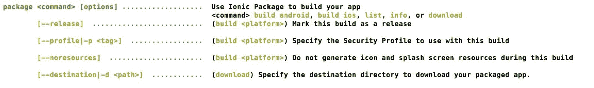

# 发布离子应用

在这一章中，我们将看看为您的离子应用程序生成安装程序的三种方法。一个使用 PhoneGap 构建服务，第二个使用 Cordova CLI，最后，第三个使用 Ionic package 服务。我们将为安卓和 iOS 操作系统生成安装程序。我们将在本章中讨论以下主题:

*   生成图标和闪屏
*   正在验证 config.xml
*   使用 PhoneGap 构建服务生成安装程序
*   使用科尔多瓦命令行界面生成安装程序
*   使用离子包生成服务

# 准备分发应用程序

现在我们已经成功地构建了我们的 ion 应用程序，我们想分发它。接触更广泛受众的最佳方式是借助应用商店。然而，在我们开始分发应用程序之前，我们需要特定于应用程序的图标和闪屏。闪屏完全是可选的，取决于产品理念。

# 设置图标和闪屏

默认情况下，运行以下代码时:

```html
ionic platform add android 

```

或者

```html
ionic platform add ios

```

命令行界面会自动添加一个名为资源的新文件夹。你可以在[第 7 章](07.html#3IE3G0-9757c8e51afd47e0a7a9ced32db749b8)*建筑瑞德 App* 中查看。resources 文件夹由 Ionic 或 Android 或两个子文件夹组成，具体取决于您添加了多少个平台，在每个文件夹中，您将看到两个子文件夹，名为 icon 和 splash。

如果你的应用程序使用闪屏，你可以保留闪屏文件夹，否则删除该文件夹以保存几个字节的最终应用程序安装程序。

要生成图标，您可以获取大于 1024 x 1024 的图标副本，并使用任何服务(如以下服务)为安卓和 iOS 生成图标和闪屏:

*   [http://icon.angrymarmot.org/](http://icon.angrymarmot.org/)
*   [http://makeappin . com/](http://makeappicon.com/)

I have no association with any of the preceding services. You use these services at your own risk.

或者，最好的部分是您可以在资源文件夹中放置一个名为`icon.png`和`splash.png`的文件，并运行以下命令:

```html
ionic resources 

```

这将负责将您的图像上传到离子云，根据需要调整它们的大小，并将它们保存回资源文件夹。

Be aware that you are uploading your content into a public/Ionic cloud.

如果您只想转换图标，可以使用以下选项:

```html
ionic resources --icon

```

仅对于闪屏，您可以使用:

```html
ionic resources --splash

```

You can use [http://code.ionicframework.com/resources/icon.psd](http://code.ionicframework.com/resources/icon.psd) to design your icon and [http://code.ionicframework.com/resources/splash.psd](http://code.ionicframework.com/resources/splash.psd) to design your splash screens.
You can place an `icon.png` image, an `icon.psd` file, or an icon.ai file at the root of the resources folder and ionic resources will do the magic!

# 正在更新 config.xml

*   正如我们已经知道的那样，`config.xml`是 Cordova API 在生成特定于操作系统的安装程序时信任的唯一真实来源。因此，在我们开始部署过程之前，需要彻底验证这个文件。您可以按照清单来确保所有的东西都准备好了:
*   小部件标识已定义且有效
*   小部件版本已定义且有效
*   在应用程序更新的情况下，小部件版本会更新并有效
*   名称标签已定义且有效
*   描述已定义且有效
    *   作者信息已定义且有效
*   访问标签已定义，仅限于所需的域([https://github . com/Apache/Cordova-plugin-白名单# network-request-白名单](https://github.com/apache/cordova-plugin-whitelist#network-request-whitelist))
*   允许导航已定义，仅限于所需的域([https://github . com/Apache/Cordova-plugin-白名单# Navigation-白名单](https://github.com/apache/cordova-plugin-whitelist#navigation-whitelist))
*   定义了允许意图，并且仅限于所需的域([https://github . com/Apache/Cordova-plugin-白名单# Intent-白名单](https://github.com/apache/cordova-plugin-whitelist#intent-whitelist))
*   交叉检查首选项
*   交叉检查图标和闪屏图像的路径
*   交叉检查权限(如果有)
*   用内容安全策略元标签更新`index.html`(https://github . com/Apache/Cordova-plugin-白名单#内容-安全-策略)

一旦验证了以上几点，我们将开始安装程序生成过程。

# PhoneGap 构建服务

我们将研究的第一种方法是使用 PhoneGap 构建服务生成应用程序安装程序。这可能是为安卓和 iOS 生成安装程序的最简单方法。

过程相当简单。我们将整个项目上传到 PhoneGap 构建服务，它负责构建安装程序。

如果觉得上传完整项目不实用，可以只上传`www`文件夹。但是，您需要进行以下更改。

1.  将`config.xml`移到`www`文件夹内。
2.  将资源文件夹移到`www`文件夹内。
3.  更新`config.xml`中资源文件夹的路径。

如果您发现自己经常做前面的事情，我建议您使用构建脚本生成一个 PhoneGap build `Deployable`文件夹，其中包含之前对项目所做的更改。

如果你打算只为安卓发布你的应用，你不需要做更多的事情。但是，如果您计划生成 iOS 安装程序，则需要获得 Apple Developer Account，并按照[处的步骤 http://docs . build . phone gap . com/en _ US/signing _ signing-iOS . MD . html](http://docs.build.phonegap.com/en_US/signing_signing-ios.md.html)生成所需的证书。

您也可以使用[中提到的步骤对您的安卓应用进行签名。](http://docs.build.phonegap.com/en_US/signing_signing-android.md.html)

一旦你有了所需的证书和密钥，我们就可以开始生成安装程序了。您可以按照给定的步骤来简化该过程:

1.  创建 PhonegGap 帐户并登录([https://build.phonegap.com/plans](https://build.phonegap.com/plans))
2.  接下来，导航到[https://build.phonegap.com/people/edit](https://build.phonegap.com/people/edit)，选择“签名密钥”选项卡，上传 iOS 和安卓证书。

3.  接下来，导航至:[https://build.phonegap.com/apps](https://build.phonegap.com/apps)并点击新应用。作为*免费计划*的一部分，你可以拥有你想要的任何数量的应用，只要它们是从公共 Git 回购中提取的。或者，您可以通过私有回购或上传 ZIP 文件来创建私有应用程序。
4.  为了测试服务，您可以创建一个`.zip`文件(不是`.rar`或`.7z)`，文件夹结构如下:

*   `App`(根文件夹)
*   `config`。可扩展标记语言
*   `resources`(文件夹)
*   `www`(文件夹)

这就是 PhoneGap 构建工作所需的全部内容。

5.  将 ZIP 文件上传到[https://build.phonegap.com/apps](https://build.phonegap.com/apps)并创建应用程序。

这个过程通常需要一分钟才能发挥它的魔力。

Sometimes, you may see unexpected errors from the build service. Wait for some time and try again. Depending on the traffic, sometimes the build process may take a bit longer than expected.

# 使用科尔多瓦命令行界面生成安装程序

我们将研究使用科尔多瓦命令行界面创建安装程序。

# Android 安装程序

首先，我们将看一下使用命令行界面为安卓生成安装程序。您可以遵循给定的步骤:

1.  在项目的根目录下打开一个新的命令提示符/终端。
2.  使用以下方法删除不需要的插件:

```html
 ionic plugin rm cordova-plugin-console

```

3.  使用以下内容在发布模式下构建应用程序:

```html
      cordova build --release android

```

这将在发布模式下生成一个未签名的安装程序，并将其置于`<<ionic project>>/platforms/android/build/outputs/apk/android-release-unsigned.apk`。

4.  接下来，我们需要创建一个签名密钥。如果您已经拥有签名密钥或正在更新现有应用程序，则可以跳过下一步。
5.  私钥是使用 keytool 生成的。我们将创建一个名为 deploy-keys 的文件夹，并将所有这些密钥保存在那里。创建文件夹后，运行`cd`命令，导航到文件夹并运行以下命令:

```html
      keytool -genkey -v -keystore app-name-release-key.keystore -alias 
      alias_name -keyalg RSA -keysize 2048 -validity 10000 

```

您将被问及以下问题，您可以回答如下所示:


If you lose this file, you cannot submit updates to the app store, ever.
Note: To know more about the keytool and signing process, refer to [https://developer.android.com/studio/publish/app-signing.html](https://developer.android.com/studio/publish/app-signing.html).

6.  这是一个可选步骤，您可以将`android-release-unsigned.apk`复制到`deploy-keys`文件夹，并从那里运行以下命令。我会把文件放在原处。
7.  接下来，我们使用 jarsigner 工具对未签名的 APK 签名:

```html
      jarsigner -verbose -sigalg SHA1withRSA -digestalg SHA1 -keystore app-name-
      release-key.keystore ../platforms/android/build/outputs/apk/android-
      release-unsigned.apk my-ionic-app

```

您将被要求输入密码，该密码是您在创建密钥库时作为第一步输入的。一旦签名过程完成，现有的`android-release-unsigned.apk`将被替换为同名的签名版本。

We run the preceding command from inside the deploy-keys folder.

8.  最后，我们运行`zipalign`工具来优化 APK:

```html
      zipalign -v 4 ../platforms/android/build/outputs/apk/android-release-
      unsigned.apk my-ionic-app.apk

```

前面的命令将在`deploy-keys`文件夹中创建`my-ionic-app.apk`。

现在，你可以把这个 APK 提交到应用商店。

# iOS 安装程序

接下来，我们将使用 XCode 为 iOS 生成一个安装程序。您可以遵循给定的步骤:

1.  在项目的根目录下打开一个新的命令提示符/终端。
2.  删除不需要的插件:

```html
 ionic plugin rm cordova-plugin-console

```

3.  运行:

```html
 ionic build -release ios

```

4.  导航到平台/iOS，使用 XCode 启动`projectname.xcodeproj`。
5.  一旦项目在 XCode 中，从导航菜单中选择产品，然后选择归档。
6.  接下来，选择窗口，并从导航菜单中选择管理器。您将看到一个创建的档案列表。
7.  单击我们现在创建的归档快照，然后单击提交。将对您的帐户进行验证，然后应用程序将被上传到 iStore。
8.  最后，您需要登录 iTunes 商店来设置截图、描述等。

使用科尔多瓦命令行界面生成安装程序的过程到此结束。

# 离子包装

在这一节中，我们将看看离子包。

# 将项目上传到离子云

使用离子云服务生成安装程序非常简单。首先，我们通过运行以下程序将我们的应用程序上传到我们的离子账户:

```html
ionic upload

```

Log in to your Ionic account before executing the preceding command.
If your project has sensitive information, cross-check with Ionic license before uploading the app to the cloud.

一旦应用程序上传，将为您的应用程序生成一个应用程序标识。可以在位于项目根目录的`ionic.config.json`文件中找到 app ID。

# 生成所需的密钥

您需要遵循“使用科尔多瓦命令行界面生成安装程序”一节中的步骤 5，即安卓安装程序小节，来获取密钥库文件。

接下来，我们使用 ionic package 命令生成安装程序:

```html
ionic package <command> [options]

```

这些选项包括以下内容:



例如，如果您想在发布模式下为安卓生成一个安装程序，如下所示:

```html
ionic package release android -k app-name-release-key.keystore -a my-ionic-app -w 12345678 -r 12345678 -o ./ -e arvind.ravulavaru@gmail.com -p 12345678

```

We are running the preceding command from inside the deploy-keys folder.

同样，iOS 的上述命令如下:

```html
ionic package release ios -c certificate-file -d password -f profilefile -o ./ -e arvind.ravulavaru@gmail.com -p 12345678

```

# 摘要

在这一章中，我们看到了如何发布和管理一个离子应用程序。我们看到了如何使用 PhoneGap 构建服务、使用 Cordova CLI 以及最后使用 Ionic Package 来生成安装程序。

在下一章中，我们将看看离子 3 以及离子 2 和离子 3 之间的主要区别。

请注意，到目前为止，我们学习的几乎所有概念仍然适用于离子 3。