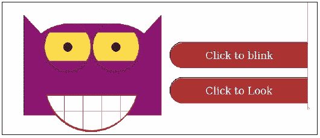

# 前言

1999 年 HTML 4.01 推出后，Web 变化很快。许多新的设备，如平板电脑和手机，出现了。移动互联网变得更快、更便宜、更稳定。W3C 于 2007 年成立了 HTML5 工作组。2012 年 12 月，W3C 指定 HTML5 为候选推荐。HTML5 与 CSS3 配合使用。如今，所有主要浏览器(Chrome、Safari、Firefox、Opera、IE)都提供 HTML5 支持。

CSS3 的影响是巨大的。如今，CSS3 不仅仅是用来为你的 HTML 文档设计风格，而且 CSS3 在你的设计责任中也扮演着重要的角色。最后但并非最不重要的是，CSS3 通过动画和过渡等功能扩展了 CSS。

复杂的动画不需要外部 flash 组件。看看[http://www . hongkiat . com/blog/css3-动画-转场-demos/](http://www.hongkiat.com/blog/css3-animation-transition-demos/) 或者看看下面截图中的搞笑猫头鹰:



前面截图中的猫头鹰是单独用 HTML5 和 CSS3 构建的。现场版可以通过按按钮眨眼和看。

响应式设计允许您仅用一个代码库构建一个版本的网站，该代码库在手机、平板电脑和台式机等不同设备上运行良好且外观美观。构建不同的移动和桌面版本不会有任何技术原因，如下图所示:


有了所有这些新东西，CSS(或 web)开发人员的工作变得更加复杂。web 开发人员需要了解复杂的 CSS3、浏览器和设备之间的区别、动画和其他样式效果。编写正确且功能齐全的 CSS 代码将是第一件事；第二件事是保持这些代码可读、可维护，并在所有主要浏览器上工作。在开发和维护过程中，CSS 文件会变得越来越不整洁。CSS 不具备修改现有值或重用通用样式的能力。此外，在 CSS 中做数学或定义变量是不可能的。这就是 Less 进入框架的地方。

**Less** ( **Leaner CSS** )是 Alexis Sellier 设计的动态样式表语言。从 2010 年开始，现在由 Less 核心团队维护和扩展。Less 帮助您使您的 CSS 代码可维护、可重用，并防止代码重复。

在这本书里，你将学习如何编写、编译和理解 Less。我们将帮助您进行更快、更具成本效益的网络开发。您将获得在当前和新项目中集成 Less 的实用技巧。看完这本书，你会用 Less 写出清晰易读的 CSS3。您可以将更多的注意力放在真正的设计任务上，而不是花时间调试特定设备或浏览器的复杂 CSS 代码。

您的客户会对您先进稳定的设计感到满意。这将减少开发和维护时间，从而降低设计成本。

Less 用函数和变量扩展了 CSS。从语义上来说，有效的 CSS 也是有效的 Less。Less 的最初版本是用 Ruby 写的；现在，Less 是用 JavaScript 编写的。

Less 称为 CSS 预编译器。这意味着最终产品将用于生产。在这种情况下，最终产品将是有效的、紧凑的、可读的 CSS 代码。此外，预编译 Less 代码也可以实时编译。Less 提供服务器端和客户端选项来实现这一点。在现代网络浏览器中通过 LESS.js 进行实时客户端编译使得测试变得容易。服务器端编译提供了用更少的资源构建应用以及创建动态 CSS 的机会。

还有，其他人知道 Less 的力量。像 Twitter 的 Bootstrap 和 WordPress 入门主题 Roots 这样的项目都依赖 Less。这些项目用 Less 构建了清晰且可扩展的框架。你不能忽视这个证据。停止编写有 bug 和浏览器缺陷的繁琐 CSS，通过阅读这本书了解 Less。

Less 是开源的，并根据 Apache 许可证获得许可。在写这本书的时候，最新版本是 1.7。Less 的源代码将在 GitHub 上维护。每个人都将被允许为此做出贡献。你可以免费使用 Less。

# 这本书涵盖了什么

[第 1 章](1.html "Chapter 1. Improving Web Development with Less")、*用更少的*改进网页开发，展示了 CSS3 如何为网页设计师带来渐变、过渡和动画等高级功能。另一方面，它也解释了 CSS 代码是如何变得更加复杂和难以维护的。Less 帮助您使您的 CSS 可维护、可重用，并防止代码重复。

[第 2 章](2.html "Chapter 2. Using Variables and Mixins")、*使用变量和 Mixins* ，解释了为什么变量允许您在一个地方指定广泛使用的值，然后在整个样式表中重用它们，从而使全局更改像更改一行代码一样容易。Mixins 允许您将一个类的所有属性嵌入到另一个类中，只需将类名作为其属性之一。本章还解释了什么是参数混合以及如何使用它们。

[第 3 章](3.html "Chapter 3. Nested Rules, Operations, and Built-in Functions")、*嵌套规则、操作和内置函数*解释了嵌套规则在明确继承和缩短样式表方面的用途。本章还解释了如何在属性之间创建复杂的关系，以及如何使用 Less 的内置函数。

[第 4 章](4.html "Chapter 4. Avoid Reinventing the Wheel")*避免重新发明轮子*，教你 Less 代码和 mixins 如何变得复杂，因为它们处理不同的浏览器和设备。本章还解释了预构建的 mixins 和其他帮助您(重新)使用它们的资源。

[第 5 章](5.html "Chapter 5. Integrate Less in Your Own Projects")、*在自己的项目中集成 Less*，教你如何为新项目整理文件，或者让你维护的项目为使用 Less 做好准备。

[第 6 章](6.html "Chapter 6. Bootstrap 3, WordPress, and Other Applications")、 *Bootstrap 3、WordPress 和其他应用*解释了什么是 Bootstrap，并展示了使用 Bootstrap Less 的优势。这一章还教你如何用 Less 构建网络应用，或者将它集成到你的 WordPress 主题中。

# 这本书你需要什么

为了理解并充分受益于这本书的内容，我们希望您以前已经用 CSS 建立了一个网站。需要对 CSS 有基本的了解。了解 CSS 选择器和 CSS 优先级将有助于您充分利用这本书。我们也将在第一章简要介绍这些 CSS 方面。了解在函数式语言(如 JavaScript)中使用函数和参数的基础知识将很有价值，但这不是必需的。如果你对函数和参数一无所知，不要惊慌。这本书包含了清晰的例子。即使没有任何(函数式)编程知识，你也可以学习如何使用 Less，这本书将帮助你做到这一点。最重要的技能将是学习的意愿。

这本书的所有章节都包含示例和示例代码。运行和测试这些例子将帮助你发展你的 Less 技能。您将需要一个现代的网络浏览器，如谷歌浏览器或 Mozilla Firefox 来运行这些示例。使用任何首选的文本或 CSS 编辑器来编写您的 Less 代码。

# 这本书是给谁的

每一个使用 CSS 的网页设计师，如果想在真正的设计任务上花更多的时间，都应该读这本书。不管你是初学网页设计师还是使用 CSS 多年；两人都将从阅读这本书中受益，并将学习如何利用 Less。我们也向现代网页设计和计算机科学的老师和学生推荐这本书。Less 不依赖于平台、语言或 CMS。如果你使用 CSS，你可以也将从 Less 中受益。

# 惯例

在这本书里，你会发现许多区分不同种类信息的文本风格。以下是这些风格的一些例子，以及对它们的含义的解释。

文本中的码字、数据库表名、文件夹名、文件名、文件扩展名、路径名、伪 URL 和用户输入如下所示:“注意，在这种情况下，ID 是以`#`开头的唯一选择器；同一 HTML 元素的选择器`[id=]`算作一个属性。”

代码块设置如下:

```html
.box-shadow(@style, @c) when (iscolor(@c)) {
  -webkit-box-shadow: @style @c;
  -moz-box-shadow:    @style @c;
  box-shadow:         @style @c;
}
.box-shadow(@style, @alpha: 50%) when (isnumber(@alpha)) {
  .box-shadow(@style, rgba(0, 0, 0, @alpha));
}
```

当我们希望将您的注意力吸引到代码块的特定部分时，相关的行或项目以粗体显示:

```html
.box-shadow(@style, @c) when (iscolor(@c)) {
  -webkit-box-shadow: @style @c;
  -moz-box-shadow:    @style @c;
  box-shadow:         @style @c;
}
.box-shadow(@style, @alpha: 50%) when (isnumber(@alpha)) {
  .box-shadow(@style, rgba(0, 0, 0, @alpha));
}
```

任何命令行输入或输出都编写如下:

```html
# lessc -c styles.less > styles.css

```

**新名词**和**重要词语**以粗体显示。你在屏幕上看到的单词，例如在菜单或对话框中，出现在如下文本中:“点击**下一步**按钮，进入下一个屏幕。”

### 注

警告或重要提示会出现在这样的框中。

### 类型

提示和技巧是这样出现的。

# 读者反馈

我们随时欢迎读者的反馈。让我们知道你对这本书的看法——你喜欢或可能不喜欢什么。读者反馈对我们开发您真正能从中获得最大收益的标题非常重要。

要给我们发送一般反馈，只需向`<[feedback@packtpub.com](mailto:feedback@packtpub.com)>`发送电子邮件，并通过您消息的主题提及书名。

如果你对某个主题有专业知识，并且对写作或投稿感兴趣，请参阅我们在[www.packtpub.com/authors](http://www.packtpub.com/authors)上的作者指南。

# 客户支持

现在，您已经自豪地拥有了一本书，我们有许多东西可以帮助您从购买中获得最大收益。

## 下载示例代码

您可以从您在[http://www.packtpub.com/](http://www.packtpub.com/)的账户中下载您购买的所有 Packt 书籍的示例代码文件。如果您在其他地方购买了这本书，您可以访问[http://www.packtpub.com/support/](http://www.packtpub.com/support/)并注册，以便将文件直接通过电子邮件发送给您。

## 勘误表

尽管我们尽了最大努力来确保我们内容的准确性，但错误还是会发生。如果你在我们的某本书里发现了错误——可能是文本或代码中的错误——如果你能向我们报告，我们将不胜感激。通过这样做，你可以让其他读者免受挫折，并帮助我们改进这本书的后续版本。如果您发现任何勘误表，请访问[http://www.packtpub.com/support](http://www.packtpub.com/support)，选择您的书籍，点击**勘误表** **提交** **表格**链接，并输入您的勘误表详情。一旦您的勘误表得到验证，您的提交将被接受，勘误表将被上传到我们的网站，或添加到该标题的勘误表部分下的任何现有勘误表列表中。

## 盗版

互联网上版权材料的盗版是所有媒体的一个持续问题。在 Packt，我们非常重视版权和许可证的保护。如果您在互联网上遇到任何形式的我们作品的非法拷贝，请立即向我们提供位置地址或网站名称，以便我们寻求补救。

请通过`<[copyright@packtpub.com](mailto:copyright@packtpub.com)>`联系我们，获取疑似盗版资料的链接。

我们感谢您在保护我们作者方面的帮助，以及我们为您带来有价值内容的能力。

## 问题

如果您对本书的任何方面有问题，可以在`<[questions@packtpub.com](mailto:questions@packtpub.com)>`联系我们，我们将尽最大努力解决。