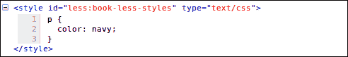
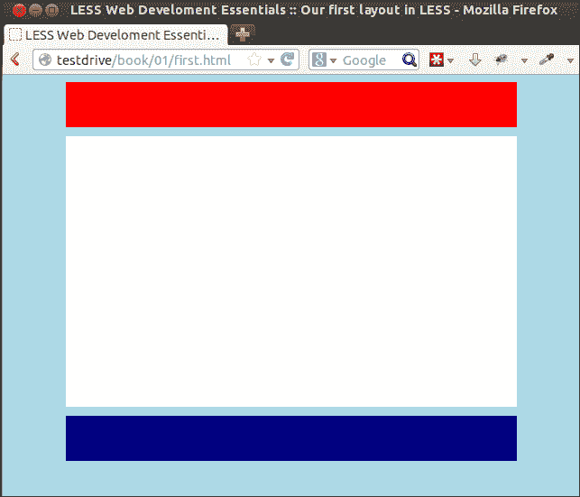
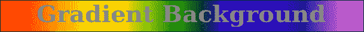
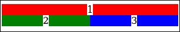
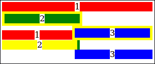

# 第一章。用更少的资源改进网络开发

没有 CSS 是无法想象现代网页设计的。有了 CSS3，网页设计师可以依赖高级功能，如渐变、过渡和动画。另一方面，CSS 代码变得更加复杂和难以维护。 *Less* 是一个 CSS 预处理器，用现代编程语言概念扩展了 CSS。Less 使您能够在编写 CSS 代码时使用变量、函数、操作，甚至规则或选择器嵌套。 *Less* 用**不重复自己** ( **DRY** )的原则帮你写 CSS。DRY 原则防止您在代码中重复任何类型的信息。

本章将涵盖以下主题:

*   CSS3 简介
*   将更少的内容编译成 CSS
*   特定于供应商的规则
*   CSS3 圆角、动画和渐变
*   使用框大小边框框
*   服务器端编译和使用图形用户界面

# 用 CSS3 设计你的 HTML

在网页设计中，你将使用 HTML 来描述你的文档的结构，使用 CSS 语言来描述它们的表现形式，包括字体、颜色和布局。当前的标准 HTML5 和 CSS3 版本适用于大多数现代浏览器和移动设备。CSS3 用其他新的选择器、文本效果、背景渐变和动画扩展了旧的 CSS。CSS3 的强大、新功能以及在使用 HTML5 和 CSS3 的移动设备上的高接受度，使它们成为现代网页设计的标准。HTML5 和 CSS3 的结合是构建响应性网站的理想选择，因为它们在手机(和其他设备)上的接受度很高。

HTML5 和 CSS3 一起引入了许多新特性。当你在这本书里学习他们的概念时，你会看到最重要的。

## 使用 CSS 选择器来设计你的 HTML

少了*(和 CSS)，你可以使用 **选择器**来设计你的 HTML 代码。CSS 选择器是识别网页的哪些 HTML 元素应该被样式化的模式或名称。CSS 选择器在编写 *Less* 代码中起着重要的作用。*

 *对于`body p.article {color:red}`，这里的选择器是`body p.article`。选择器并不仅仅指一个元素。它们可以指向多个元素，不同的元素可以引用同一个元素。例如，单个`p`选择器引用所有`p-elements`，包括带有`.article`类的 `p-elements`。在冲突的情况下，**级联** 和**特异性** 确定应该应用哪些样式。在编写 *Less* 代码时，我们应该牢记前面提到的规则。 *Less* 在不改变网站外观的情况下，更容易编写复杂的 CSS。它没有对你的最终 CSS 引入任何限制。有了*少了*，可以编辑结构良好的代码，而不是改变最终 CSS 的效果。

CSS3 引入了许多新的便捷的选择器。其中之一是`:nth-child(n)`，这使得在 HTML 文档中对每四个段落的`p`标记进行样式化成为可能。这样的选择器给 CSS3 增加了强大的功能。现在我们能够单独使用 CSS 执行操作，而在过去，我们需要 JavaScript 或硬编码样式(或者至少是类)。再次，这也是少学*的原因之一*。强大的选择器会让 CSS 变得更加重要，但是 CSS 代码也变得繁琐且难以维护。*少一点*会防止 CSS 出现这个问题，甚至让复杂的代码变得灵活，容易维护。

### 注

请访问[https://developer . Mozilla . org/en-US/docs/Web/CSS/Reference # selecters](https://developer.mozilla.org/en-US/docs/Web/CSS/Reference#Selectors)查看完整的 CSS 选择器列表。

## CSS 中的特异性、遗传和级联

大多数情况下，很多 CSS 样式可以应用在同一个 HTML 元素上，但是只有其中一个会胜出。 *W3C 规范* 描述了CSS 样式获得最高优先级并最终被应用的规则。您可以在以下部分找到这些规格。

关于重要性顺序的规则在 CSS3 中没有显著变化。简要提及它们是为了帮助您理解 *Less* /CSS 的一些常见陷阱以及如何解决它们。迟早，你会遇到这样的情况:你试图对一个元素应用一个 CSS 样式，但是它的效果保持不可见。你会重新加载，拔掉你的头发，一遍又一遍地检查错别字，但没有任何帮助。这是因为在大多数情况下，您的样式会被另一个具有更高优先级的样式否决。

CSS 中级联的全局规则如下:

*   查找适用于所讨论的元素和属性的所有 CSS 声明。
*   **内联样式** 的优先级最高，除了`!important`。CSS 中的`!important`语句是用来给声明增加权重的关键字。`!important`语句添加在 CSS 属性值的末尾。在这之后，检查谁设置了声明；作者设置的样式比用户或浏览器定义的样式具有更高的优先级(默认)。默认是指样式由网页浏览器设置，作者样式由网页中的 CSS 定义，用户样式由用户通过其网页浏览器的设置来设置。用户的重要性高于默认，带有`!important`语句的代码(参见[第二章](2.html "Chapter 2. Using Variables and Mixins")、*使用变量和 mixin*在*中的含义少于*的代码)将始终获得最高优先级。请注意，火狐等浏览器有禁用页面的选项，以便使用用户定义字体的其他替代方案。这里，用户设置否决了网页的 CSS。这种覆盖页面设置的方式不属于 CSS 优先，除非使用`!important`进行设置。
*   计算特异性，这将在下一节中讨论。
*   如果两个或两个以上的规则具有相同的优先级和特异性，则最后宣布的规则获胜。

作为一个*少* /CSS 设计者，你将在大多数情况下利用计算出的 CSS 特异性。

### CSS 特异性是如何工作的

每个 CSS 声明都有一个特性，这个特性将根据声明的类型和声明中使用的选择器来计算。内联样式将始终获得最高的特异性，并将始终被应用(除非被前两个级联规则覆盖)。在实践中，您不应该在许多情况下使用内联样式，因为它会破坏 DRY 原则。它还会禁止你只在一个集中的地方改变你的风格，并且会阻止你使用 *Less* 进行造型。

内联样式声明的示例如下所示:

```html
<p style="color:#0000ff;">
```

此后，选择器中的标识数将成为计算特异性的下一个指标。`#footer #leftcolumn {}`选择器有 2 个 ID，`#footer {}`选择器有 1 个 ID，以此类推。

### 类型

注意，在这种情况下，ID 是以`#`开始的唯一选择器；同一 HTML 元素的选择器`[id=]`算作一个**属性**。这意味着`div.#unique {}`有 1 个标识，`div[id="unique"] {}`有 0 个标识和 1 个属性。

如果两个声明的 id 数相等，选择器的**类**、**伪类**、和**属性**的数量将很重要。课程从一个点开始。比如`.row`就是一个类。伪类，比如`:hover`、`:after`，以冒号开头，属性当然是`href`、`alt`、`id`等等。

`#footer a.alert:hover {}`选择器得分 2 (1 类 1 伪类)`#footer div.right a.alert:hover {}`选择器得分 3 (2 类 1 伪类)。

如果这两个声明的值相等，我们可以开始计算**元素**和元素**伪元素**。最新的变量将用双冒号(`::`)定义。伪元素允许作者引用不可访问的信息，如`::first-letter`。以下示例向您展示了这是如何工作的。

`#footer div a{}`选择器得分为 2 (2 个元素)`#footer div p a {}`选择器得分为 3 (3 个元素)。

你现在应该知道当你的风格没有被直接应用时该怎么做了。在大多数情况下，使您的选择器更加具体，以应用您的风格。比如`#header p{}`不工作，那么可以尝试添加一个`#header #subheader p{}` ID，一个`#header p.head{}`类等等。

当 Cascade 和`!important`规则没有给出结论性答案时，特异性计算似乎是一项艰苦而耗时的工作。虽然 *Less* 在这里帮不了你，但是 Firebug(以及其他开发工具)之类的工具可以让特异性变得可见。下面的屏幕截图显示了一个使用 Firebug 的示例，其中具有最高特异性的选择器显示在屏幕顶部，否决样式被删除:


《萤火虫》中特异性的一个例子

## 用灵活的方框构建布局

**柔性盒布局**(也叫柔性盒)是 CSS3 的新功能。它在创建响应性和灵活性的布局方面非常有用。Flexbox 提供了针对不同屏幕分辨率动态更改布局的能力。它不使用浮动，并且包含不会随内容折叠的边距。不幸的是，目前主要的浏览器并不完全支持 Flexbox 布局。我们关注 Flexbox 是因为它的强大，由于它是 CSS 的一个重要特性，我们也可以使用 *Less* 来生产和维护它。您可以在[https://gist.github.com/bassjobsen/8068034](https://gist.github.com/bassjobsen/8068034)获取一套 CSS3 Flexbox 的*减*混搭。您可以使用这些混搭创建带有*减*的 Flexbox 布局，而无需使用重复代码。

现在不详细解释这些混合，但是下面的例子展示了 *Less* 如何减少创建 flex 容器所需的代码。使用 CSS，您可以使用以下代码:

```html
div#wrapper {
  display: -webkit-flex;
  display: -moz-flex;
  display: -ms-flexbox;
  display: -ms-flex;
  display: flex;
}
```

### 类型

**下载示例代码**

您可以从您在[http://www.packtpub.com/](http://www.packtpub.com/)的账户中下载您购买的所有 Packt 书籍的示例代码文件。如果您在其他地方购买了这本书，您可以访问[http://www.packtpub.com/support/](http://www.packtpub.com/support/)并注册，以便将文件直接通过电子邮件发送给您。

但是如果使用*减*，插入下面一行代码也能产生同样的效果:

```html
div#wrapper { .flex-display; }
```

你可以使用谷歌 Chrome 测试你的 Flexbox 布局。在撰写本书时，火狐和 Internet Explorer IE11 也为 Flexbox 布局提供了完全或更好的支持。之所以提到 Flexboxes，是因为它们有潜力在未来的网页设计中发挥重要作用。目前，它们超出了本书的范围。这本书将专注于使用 CSS 媒体查询和网格创建响应迅速且灵活的布局。

### 注

请访问[https://developer . Mozilla . org/en-US/docs/Web/Guide/CSS/Flexible _ box](https://developer.mozilla.org/en-US/docs/Web/Guide/CSS/Flexible_boxes)了解更多信息、示例和浏览器兼容性。

# 少编

钻研完 CSS 的理论，终于可以开始使用 *Less* 了。如前所述，它的语法与 CSS 相同。这意味着任何 CSS 代码实际上都是有效的*减*代码。有了*少了*，你就可以产生可以用来为你的网站设计风格的 CSS 代码。从*变少*的过程叫做 **编译**，在这里可以通过**服务器端**或者**客户端**编译*变少*代码。本书中给出的例子将利用客户端编译。在这种情况下，客户端意味着将代码加载到浏览器中，并使用本地机器的资源将 *Less* 代码编译成 CSS 代码。这本书使用了客户端编译，因为这是最简单的入门方法，同时也能很好地开发你的 *Less* 技能。

### 类型

需要注意的是，客户端编译的结果仅用于演示目的。对于生产，尤其是考虑应用的性能时，建议您使用服务器端**预编译**。 *Less* 捆绑了一个基于 **Node.js** 的编译器，还有很多其他的 GUI 可以用来预编译你的代码。这些图形用户界面将在本章末尾讨论。

## 从更少开始

你终于可以开始使用*减*了。你要做的第一件事就是从[http://www.lesscss.org/](http://www.lesscss.org/)下载 *Less* 。本书将使用`less.js`的 1.6 版本。下载后，应该创建一个 HTML5 文档。它应该包括`less.js`和你的第一个*减*文件。

请注意，您可以从 www.packtpub.com书籍的可下载文件中的本章支持文件下载示例，包括一份`less.js`。

首先，看看这个简单而结构良好的 HTML5 文件:

```html
<!doctype html>
<html lang="en">
<head>
  <meta charset="utf-8">

  <title>Example code</title>
  <meta name="description" content="Example code">
  <meta name="author" content="Bass Jobsen">

  <link rel="stylesheet/less" type="text/css" href="less/styles.less" />
   <script src="less.js" type="text/javascript"></script>
</head>

<body>
<h1>Less makes me Happy!</h1>
</body>
</html>
```

如您所见，一个*减*文件已使用以下代码添加到该文档中:

```html
<link rel="stylesheet/less" type="text/css" href="less/styles.less" />
```

当使用`rel="stylesheet/less"`时，代码将与样式表相同。在*少了*文件后，可以使用以下代码调用`less.js`:

```html
<script src="less.js" type="text/javascript"></script>
```

事实上，这就是你需要开始的全部内容！

为了清楚起见，`html5shiv`(可以在[http://code.google.com/p/html5shiv/](http://code.google.com/p/html5shiv/)访问)和T4【Modernizr(可以在[http://modernizr.com/](http://modernizr.com/)访问)暂时被忽略了。这些脚本为 IE7 和 IE8 等旧浏览器增加了对新的 CSS3 和 HTML5 特性的支持和检测。预计您将使用现代浏览器，如 Mozilla Firefox、谷歌 Chrome 或 IE8 以外的任何版本的互联网浏览器。这些将提供 HTML5、CSS3 和 **媒体查询**的全面支持，这是您阅读本书和做练习时需要的。

### 类型

你已经知道大多数情况下应该只使用`less.js`进行开发和测试；在生产中仍然可以有公平对待`less.js`客户端使用的用例。为了支持旧浏览器的`less.js`，你可以试试5-shim([https://github.com/es-shims/es5-shim/](https://github.com/es-shims/es5-shim/))。

现在，在浏览器中打开`http://localhost/index.html`。你会看到**少让我快乐！**页眉文本的默认字体和颜色。之后，你应该在你喜欢的文本编辑器中打开`less/styles.less`。 *Less* 和 CSS 的语法在这里没有区别，所以可以在这个文件中输入以下代码:

```html
h1{color:red;}
```

接下来，重新加载浏览器。您应该会看到红色的标题文本。

从前面的代码来看，`h1`是在你的 HTML 中选择 HTML `H1`属性的选择器。`color`酒店已经被设置为`red`酒店。这些属性会像 CSS 一样应用到你的选择器上。

### 类型

没有必要让 web 服务器运行。用浏览器导航到硬盘上的`index.html`应该就够了。不幸的是，这并不适用于所有浏览器，所以为了确保万无一失，请使用 Mozilla Firefox。这本书里的例子用的是`http://localhost/map/`，不过这个可以换成类似`file:///map/`或者`c:\map\`的东西，看你的情况。

## 使用手表功能自动重装

`less.js`文件有一个 **手表**功能，可以检查你的文件是否有变化，发现后重新加载你的浏览器视图。使用起来非常简单。执行以下步骤:

1.  在后添加`#!watch`你想打开的网址。
2.  在`index.html`后添加`#!watch`，然后重新加载浏览器窗口。
3.  所以，在你的浏览器中打开`http://localhost/index.html#!watch`，开始编辑你的 *Less* 文件。您的浏览器将反映您的更改，而无需重新加载。
4.  现在在文本编辑器中打开`less/styles.less`。在这个文件中，写`#h1{color:red;}`然后保存文件。
5.  你现在应该导航到你的浏览器，应该显示**少点让我开心！**红色。
6.  重新排列屏幕，以便在同一个窗口中同时看到文本编辑器和浏览器。
7.  此外，如果您在`less/styles.less`中将`red`更改为`blue`，您会看到浏览器会跟踪这些更改并显示【makes me Happy！蓝色一旦文件被保存。

很酷，不是吗？

### 类型

此代码中的示例使用颜色名称而不是十六进制值。比如代码用`red`代替`#ff0000`。基本颜色名称通过 less.js 转换为十六进制值，并写入 CSS。在这本书里，总是使用命名的颜色。

## 调试代码

因为我们只是人，我们容易犯错误或错别字。能够看到自己做错了什么并调试代码是很重要的。如果你的 *Less* 文件包含错误，它根本不会编译。因此，一个小小的错别字就破坏了文档的完整风格。

用`less.js`调试也很容易。要使用调试或允许`less.js`显示错误，您可以将以下代码行添加到您的`index.html`中:

```html
  <link rel="stylesheet/less" type="text/css" href="less/styles.less" />
  <script type="text/javascript">less = { env: 'development' };</script>
  <script src="less.js" type="text/javascript"></script>
```

如你所见，带`less = { env: 'development' };`的线在这里是新的。这一行包含`less.js`使用的 JavaScript 变量`less`。事实上，这是一个全局*减*对象，用于将一些设置解析为`less.js`。本书将使用的唯一设定是`env: 'development'`。更多设置请查看以下网站:[http://lesscss.org/#client-side-usage-browser-options](http://lesscss.org/#client-side-usage-browser-options)。

### 类型

`env: 'development'`也阻止*减*缓存。Less 不在浏览器缓存中缓存文件。相反，文件缓存在浏览器的本地存储中。如果`env`设置为`production`，由于更改和保存的文件没有被编译，该缓存可能会产生意外的结果。

要尝试这个新设置，请再次编辑`less/styles.less`并删除一个荣誉，创建一个无效的`h1{color:red`表单语法，然后保存文件。

在您的浏览器中，您将看到如下截图所示的页面:


较少解析错误的示例

除了 **语法错误**外，还会显示**名称错误**。在名称错误的情况下，会使用未声明的函数或变量。

可以在全局*减*对象中或通过将设置附加到网址来设置调试的其他设置。例如，您可以通过在您的 HTML 文件中添加以下代码行来指定`dumpLineNumbers`设置:

```html
<script type="text/javascript">less = { env: 'development',dumpLineNumbers: "mediaQuery"
 };</script>
```

或者，您可以将`!dumpLineNumbers:mediaQuery`添加到网址中。该设置使其他工具能够在 *Less* 源文件中找到错误的行号。将该选项设置为`mediaQuery`可以为 FireBug 或 Chrome 开发工具提供错误报告。类似地，将此设置为`comments`对于无火工具来说也是如此。例如，使用无火允许 Firebug 显示原始的 *Less* 文件名和 *Less* 生成的 CSS 样式的行号。

FireBug、Chrome 开发工具或默认浏览器检查元素函数(可以通过在浏览器屏幕上右键单击来访问)也可以用来查看和评估编译后的 CSS。CSS 显示为包装在`<style type="text/css" id="less:book-less-styles">`标签内的内嵌 CSS。在下面截图给出的例子中，你会看到一个 ID 值为`less:book-less-styles`。这个 ID 的值是由 *Less* 根据`book/less/styles.less`T6】LessT8】文件的路径和名称自动生成的:



生成较少的 CSS 样式

### 本书使用的示例代码

在这本书里，你会发现很多代码示例。除非明确提到，否则这些示例的格式总是首先显示 *Less* 代码，然后是编译后的 CSS 代码。例如，您可以在 *Less* 中编写以下几行代码:

```html
mixin() {
color: green;
}
p {
.mixin();
}
```

这段代码将被编译成以下 CSS 语法:

```html
p {
color: green;
}
```

# 你在 Less 的第一个布局

您必须首先在浏览器中打开`first.html`(从该书的可下载文件中)，然后在文本编辑器中打开`less/first.less`。在浏览器中，您将看到页眉、正文和页脚的表示形式。

正如所料，`less/first.less`包含*减*代码，该代码将被`less.js`编译器转换为有效的 CSS 。该文件中的任何错误都将停止编译器并引发错误。虽然 *Less* 代码与普通的 CSS 代码有一些相似之处，但是这里描述的过程与直接编辑你的 CSS 完全不同。

以下屏幕截图显示了在网络浏览器中打开时该布局的外观:



你在 Less 的第一个布局

## 特定于供应商的规则

CSS3 引入了 **特定于厂商的规则**，为您提供了编写一些仅适用于一个浏览器的附加 CSS 的可能性。乍一看，这似乎与你想要的完全相反。你想要的是一套适用于每个浏览器的标准和实用性，以及一套对每个浏览器都有相同效果和解释的标准的 HTML 和 CSS。这些特定于供应商的规则旨在帮助我们到达这个乌托邦。特定于供应商的规则也为我们提供了标准属性和替代语法的早期实现。最后但同样重要的是，这些规则允许浏览器实现专有的 **CSS 属性**，否则这些属性将没有有效的标准(并且可能永远不会真正成为标准)。

由于这些原因，供应商特定的规则在 CSS3 的许多新特性中扮演了重要角色。例如，**动画属性**、**边框半径**和**框影**都依赖于供应商特定的规则。

供应商使用以下前缀:

*   **网络工具包** : `-webkit`
*   **Firefox** : `-moz`
*   **歌剧** : `-o`
*   **互联网浏览器** : `-ms`

## 用边框半径构建圆角

边框半径是一个新的 CSS3 属性，会让很多网络开发者感到高兴。有了边框半径，你可以给 HTML 元素一个圆角。在前几年，已经看到了许多使用图像和透明度的圆角实现。然而，这些是不灵活的(不是流动的)并且难以维护。

特定于供应商的规则是实现所需要的，虽然圆角不能用一行代码来处理，但它的使用肯定会让圆角变得容易得多。

要为元素赋予半径为 10 像素的圆角，可以使用带有供应商特定规则的 CSS 代码，如下所示:

```html
-webkit-border-radius: 10px;
-moz-border-radius: 10px;
border-radius: 10px;
```

对于不同半径的圆角，请使用由空格分隔的值列表:`10 px 5px 20px 15px;`。半径按以下顺序给出:左上、右上、右下和左下。通过牢记这些规则，您将看到 *Less* 如何保持您的代码干净。

您可以在浏览器中从本章的下载部分打开`roundedcorners.html`，在文本编辑器中打开`less/roundedcorners.less`。在浏览器中，您将看到带有圆角的页眉、正文和页脚。

`less/roundedcorners.less`中表头的 CSS 看起来像下面的代码:

```html
#header{
background-color: red;
-webkit-border-radius: 10px;
-moz-border-radius: 10px;
border-radius: 10px;
}
```

您可以看到使用供应商特定的规则，已经创建了半径为 10 个像素的拐角。如果您正在使用 CSS，您将不得不对页眉、页脚和正文重复供应商特定的规则三次。为了更改这些规则或添加供应商，您还必须更改相同的代码三次。首先，你可能会想，“为什么不把选择者分组？”，方式类似于以下代码:

```html
#header, #content, #footer{
-webkit-border-radius: 10px;
-moz-border-radius: 10;
border-radius: 10px;
}
```

为了编写 CSS 或 *Less* 代码，前面的代码在语法上是正确的，但是随着代码库的增长，维护起来并不容易。在读取和维护代码时，基于属性对选择器进行分组没有意义。这样的结构也将引入相同选择器的许多重复的和非结构化的用法。

有了*少了*，就能高效解决这些问题。通过创建所谓的 **mixin** ，您可以解决前面提到的问题。对于边界半径，可以使用以下代码:

```html
.roundedcornersmixin()
{
-webkit-border-radius: 10px;
-moz-border-radius: 10px;
border-radius: 10px;
}
```

要使用此 mixin，您将使用以下代码将其作为选择器的属性调用:

```html
#header{
background-color: red;
.roundedcornersmixin();
}
```

这个*减*代码的编译 CSS 现在如下:

```html
#header{
background-color: red;
-webkit-border-radius: 10px;
-moz-border-radius: 10px;
border-radius: 10px;
}
```

查看`less/roundedcorners.less`文件中的原始代码，您可以看到前面的代码无法为`#content`工作。内容的边框半径是 20 像素，而不是页眉和页脚所用的 10 像素。同样， *Less* 帮助我们高效地解决了这个问题。Mixins 可以用函数编程中调用函数的相同方式用参数调用。这意味着结合一个值和该值的引用，可以调用 mixins 来设置属性。在本例中，这将更改为以下代码:

```html
.roundedcornersmixin(@radius: 10px){
-webkit-border-radius: @radius;
-moz-border-radius: @radius;
border-radius: @radius;
}
```

在`.roundedcornersmixin(@radius: 10px)` mixin 中，`@radius`是我们的参数，默认值为`10px`。

从这一点开始，mixins 可以在您的代码中使用。`.roundedcornersmixin(50px);`语句将设置半径为 50px 的拐角，`.roundedcornersmixin();`语句将设置半径为 10px 的拐角(默认)。

使用这个，你可以重写`less/roundedcorners.less`使它变成下面的代码:

```html
/* mixins */
.roundedcornersmixin(@radius: 10px){
-webkit-border-radius: @radius;
-moz-border-radius: @radius;
border-radius: @radius;
}
#header{
background-color: red;
.roundedcornersmixin();
}
#content{
background-color: white;
min-height: 300px;
.roundedcornersmixin(20px);
}
#footer{
background-color: navy;
.roundedcornersmixin();
}
```

### 类型

下载部分的 `less/roundedcornersmixins.less`文件包含该代码的副本。要使用这个，您还必须将您的 HTML 文件中的引用更改为`<link rel="stylesheet/less" type="text/css" href="less/groundedcornersmixins.less" />`。

注意这个代码省略了 HTML 中`div`和`body`标签的通用样式。这些样式仅用于使演示看起来不错，并没有以任何有用的方式实际演示 *Less* 。

重写你的 *Less* 代码后，重新加载你的浏览器，或者如果你已经应用了`#!watch`技巧的话，看看它。您将看到输出将完全相同。这向您展示了如何使用更高效的结构化代码用更少的获得相同的结果。

# 防止 CSS 重置的跨浏览器问题

当谈到 CSS 中的**层叠**时，毫无疑问会提到浏览器默认设置的优先级高于作者的首选样式。编写 *Less* 代码时，会覆盖浏览器的默认样式。换句话说，您没有定义的任何内容都将被分配一个默认样式，该样式由浏览器定义。这种行为在许多跨浏览器问题中起着重要作用。为了防止这些问题，您可以执行 **CSS 重置**。最著名的浏览器重置是埃里克·迈耶的 CSS 重置(可在[http://meyerweb.com/eric/tools/css/reset/](http://meyerweb.com/eric/tools/css/reset/)访问)。

CSS 重置会覆盖浏览器的默认样式规则，并为样式创建一个起点。这个起点在所有(或大多数)浏览器上都是一样的。在本书中，使用了 normalize.css v2。Normalize.css 是一个现代的，HTML5 就绪的 css 重置的替代品，可以从[http://necolas.github.io/normalize.css/](http://necolas.github.io/normalize.css/)下载。它让浏览器更一致地呈现所有元素，并使它们符合现代标准。

要使用 CSS 重置，您可以使用*减*的`@import`指令。有了`@import`，你可以在主*减*文件中包含其他*减*文件。语法是`@import "{filename}";`。默认情况下，指令的搜索路径从主文件的目录开始。虽然设置替代搜索路径是可能的(通过设置您的*减*环境的路径变量)，但它不会在本书中使用。

本书中的示例 *Less* 文件将在代码的前几行包含`@import "normalize.less";`。同样，您应该注意到`normalize.less`确实包含 CSS 代码。你要特别注意这个解决方案的利润！

如果你想更改或更新 CSS 重置，你只需要替换一个文件。如果您必须管理或构建多个项目(大多数人都应该这样做)，那么您可以简单地重用完整的重置代码。

## 创建背景渐变

CSS3 中的一个新特性是可以在元素的背景颜色中添加**渐变**。这可以替代复杂的代码和图像回滚。

可以定义不同类型的渐变并使用两种或多种颜色。在下图中，您将看到不同颜色的背景渐变:



渐变示例(来自[W3schools.com](http://W3schools.com)

在下一个示例中，您可以使用两种颜色的线性渐变。背景渐变使用供应商特定的规则。

您可以使用圆角示例中的示例代码来添加渐变。

第一步是复制或者打开`less/gradient.less`，在这个文件的开头添加一个新的 mixin，如下代码所示:

```html
/* Mixin */
.gradient (@start: black, @stop: white,@origin: left) {
    background-color: @start;
    background-image: -webkit-linear-gradient(@origin, @start, @stop);
     background-image: -moz-linear-gradient(@origin, @start, @stop);
    background-image: -o-linear-gradient(@origin, @start, @stop);
    background-image: -ms-linear-gradient(@origin, @start, @stop);
    background-image: linear-gradient(@origin, @start, @stop);
}
```

这将创建从左侧(`@origin`)到右侧的渐变，颜色从`@start`到`@stop`。这个混合有默认值。

IE9(及其早期版本)不支持渐变。可以通过添加`background-color: @start;`来添加回退，这将为旧浏览器创建统一的彩色背景。

将 mixin 添加到您的代码后，您可以为我们的`#header`、`#body`和`#footer`选择器调用它，如下代码所示:

```html
#header{
background-color: red;
.roundedcornersmixin();
.gradient(red,lightred);
}
#content{
background-color: white;
min-height: 300px;
.roundedcornersmixin(20px);
.gradient();
}
#footer{
background-color: navy;
.roundedcornersmixin(20px);
.gradient(navy,lightblue);
}
```

例如，如果您将的*减*文件重命名为`less/gradient.less`，您还必须将您的 HTML 文件中的引用更改为以下代码:

```html
<link rel="stylesheet/less" type="text/css" href="less/gradient.less" />
```

如果您现在在浏览器中加载 HTML 文件，您的结果应该如下图所示:


示例代码的页眉、内容和页脚中的渐变

# CSS 过渡、变换和动画

CSS3 的另一个新特性是过渡、变换和动画的出现。这些功能可以替换现有或新网页中的动画图像、flash 动画和 JavaScripts。过渡、变换和动画之间的区别不是微不足道的。**动画** 由`@keyframes`的范围构成，其中每个`@keyframes`及时处理元素的不同状态。**过渡** 也描述元素在开始和结束之间的状态。过渡大多是由 CSS 变化触发的，比如鼠标悬停在元素上。

为了让事情变得清晰，记住即将被按下的按钮是很重要的。按钮将有两种状态:按下和未按下。没有过渡和动画，我们只能设计这些状态。按钮的颜色是白色，当您将鼠标悬停在按钮上时，它的颜色会变成红色。(用 CSS 术语来说，通过添加`:hover`伪类，它的状态变为悬停状态。)在这种情况下，过渡描述了悬停按钮如何变成红色。例如，在两秒钟内从白色到红色的颜色变化(这使得它在中途变成粉红色)表明颜色变化的开始是缓慢的，并且久而久之变化得更快。在这里使用动画使我们能够描述按钮在开始和结束之间的每个时间间隔的状态。例如，您不必将颜色从白色更改为红色，但更改会覆盖所有状态，从白色、蓝色、绿色，最后更改为红色。

**变换** 改变元素的位置和外观。它们不依赖于元素的状态。一些可能的变换是 **缩放**、 **平移**(移动)、和**旋转**。

在实践中，我们在大多数情况下使用动画、变换和/或过渡的组合。此外，在这种情况下，特定于供应商的规则将发挥重要作用。

现在，一个转换将被添加到我们的示例中。

使用带圆角和渐变的示例代码，将以下代码复制到`less/transition.less`或打开`less/transition.less`，并将以下代码添加到文件的开头:

```html
/* Mixin */
.transition (@prop: all, @time: 1s, @ease: linear) {
-webkit-transition: @prop @time @ease;
-moz-transition: @prop @time @ease;
-o-transition: @prop @time @ease;
-ms-transition: @prop @time @ease;
transition: @prop @time @ease;
}
```

这个 **mixin** 有三个变量；首先是你将要改变的**属性** ( `@prop`)。这可以是`height`、`background-color`、`visibility`等等。默认值`all`不应该在生产代码中使用，因为这会对性能产生负面影响。`@time`以毫秒或秒为单位设置持续时间，并附加`s`。最后一个变量`@ease`设置 **过渡-定时-功能属性**。这个函数描述了一个属性的值，假设它已经完成了一定的百分比。转变定时函数属性描述了转变的完整性，作为时间的函数。设置为`linear`显示的是从开始到结束速度相同的效果，而`ease`开始慢，结束慢，中间速度较高。预定义的功能有`ease`、`linear`、`ease-in`、`ease-out`、`ease-in-out`、`step-start`和`step-end`。

现在，您可以编辑`less/transition.less`来使用这个**混音**。您可以设置悬停在身体上时身体的背景颜色。请注意，您不需要使用过渡来更改渐变颜色，而是更改`background-color`属性。您使用`background-color`是因为`transition-duration` 对渐变没有可见效果。`background-color`过渡的代码如下:

```html
#content{
background-color: white;
min-height: 300px;
.roundedcornersmixin(20px);
.transition(background-color,5s);
}
#content:hover{
background-color: red;
}
```

例如，如果您将 *Less* 文件重命名为`less/transition.less`，您还必须将 HTML 文件中的引用更改为以下代码:

```html
 <link rel="stylesheet/less" type="text/css" href="less/transition.less" />
```

如果您在浏览器中加载 HTML 文件，您将能够在浏览器中看到结果。将鼠标移动到内容上，在 5 秒钟内看到它从白色变为红色。

最后，可以添加旋转标题的第二个示例。在本例中，您将使用`@keyframes`。使用`@keyframes`会比较复杂。因此，在这种情况下，您可以定义一些特定于供应商的规则，并将这些动画属性添加到`#header:`中，如下所示:

```html
@-moz-keyframes spin { 100% { -moz-transform: rotate(360deg); } }
@-webkit-keyframes spin { 100% { -webkit-transform: rotate(360deg); } }
@keyframes spin { 100% { -webkit-transform: rotate(360deg); transform:rotate(360deg); } }
#header{
    -webkit-animation:spin 4s linear infinite;
    -moz-animation:spin 4s linear infinite;
    animation:spin 4s linear infinite;
}
```

您可以将前面的代码添加到我们的示例文件中，或者打开`less/keyframes.less`。

例如，如果您将 *Less* 文件重命名为`less/keyframes.less`，您还必须将 HTML 文件中的引用更改为以下代码:

```html
 <link rel="stylesheet/less" type="text/css" href="less/keyframes.less" />
```

现在，在浏览器中加载 HTML 文件并观察结果。很神奇，不是吗？稍加创造性思考，你就会看到只用 CSS3 就能创造出旋转风车或眨眼猫头鹰的可能性。然而，首先应该做的是更详细地解释这里使用的代码。如前所述，在很多情况下，您会将**动画**和**变换**进行组合。在本例中，您还可以制作变换效果的动画。为了理解发生了什么，代码可以分为三个部分。

第一部分是`@keyframes`，在下面的代码中显示为，描述了 CSS 属性(在这种情况下是变换)的值作为**动画**完整性百分比的函数:

```html
@keyframes spin { 100% { -webkit-transform: rotate(360deg); transform:rotate(360deg); } }
```

这些**关键帧** 已经被赋予了名称参考`spin`，这不是一个特殊的效果，只是一个选择的名称。在前面的示例中，描述了 100%完整性的状态。在这种状态下，动画元素应该旋转了 360 度。

这个轮换是第二个需要我们注意的部分。**变换**描述空间中元素的位置或尺寸。在此示例中，位置由绕轴旋转的度数来描述，100%时为 360 度，50%时为 180 度，25%时为 90 度，依此类推。

第三部分是动画本身，描述者:`animation:spin 4s linear infinite;`。这是动画属性的子属性设置的简写。事实上，您可以将它写成下面的代码，而不需要特定于供应商的规则:

```html
animation-name: spin;
animation-duration: 4s;
animation-timing-function:linear;
animation-iteration-count:  infinite;
```

您可以使用这三个部分来构建一个完整的动画。完成后，您可以扩展它。例如，添加一个额外的关键帧，使时间曲线非线性，如下所示:

```html
@keyframes spin {
50% { transform: rotate(10deg);}
100% {transform: rotate(360deg); }
 }
```

您可以使用`background-color`添加第二个属性。不要忘记移除渐变以查看其效果。这在以下代码中显示:

```html
@-moz-keyframes spin {
50% { transform: rotate(10deg); background-color:green;}
100% { transform: rotate(360deg); }
 }
//.gradient(red,yellow);
```

你会注意到这里没有实现少用*的全部收益。由于其可变的动画名称，您将不得不重复编写`@keyframes`定义。在[第四章](4.html "Chapter 4. Avoid Reinventing the Wheel")*避免重蹈覆辙*中，我们会为您提供一个解决方案。*

 *不幸的是，浏览器对过渡、转换和动画的支持并不是很好，并且会因浏览器而异。谷歌 Chrome 不支持 CSS 3D 转换，火狐缺乏对 CSS 滤镜的支持，IE9(以及更早的版本)根本不支持。为了解决这个问题，许多开发人员希望 jQuery 支持他们的动画。`jQuery.animate()`函数允许我们使用 JavaScript 改变元素的 CSS 属性。还可以用*减*设置初始 CSS。另一种方法是使用`animate.css`(您可以在[https://github.com/daneden/animate.css](https://github.com/daneden/animate.css)进入)；这个 CSS 动画的跨浏览器库被转换成带有 jQuery 回退的 *Less* 代码。

# 装箱尺寸

**框尺寸**属性是设置用于计算元素尺寸的 CSS 框模型的属性。事实上，框大小在 CSS 中并不新鲜，但是尽管如此，将您的代码切换到`box-sizing: border-box`将使您的工作更加容易。使用`border-box`设置时，元素宽度的计算包括边框宽度和填充。所以，改变填充的边框不会破坏你的布局。您可以从下载文件中找到本节中使用的代码在`boxsizing.html`的副本。

如今，大多数网页设计都使用网格。网格将您的设计分成大小相等的列。这有助于你把事情弄清楚，并构建响应界面。根据可用的屏幕大小(或宽度)，您可以用相同列的不同表示来显示内容和导航。

为了处理不同的屏幕尺寸，您的网站的某些部分将具有流畅的宽度或高度。其他元素，如边框、檐槽和空白，应该有固定的宽度。流体宽度占屏幕宽度(或视口)的百分比与固定宽度的组合变得复杂。这种复杂性是由于浏览器对元素的填充和边距使用不同的计算方法。

为了让您看到这一点，请看下面的示例。已经创建了一个 500 像素宽的容器。在这个容器中，您可以添加两行并将第二行分成宽度为 50%(或一半)的两部分。

```html
<div class="wrapper" style="width:300px;">
  <div style="background-color:red;width;100%;">1</div>
  <div style="background-color:green;width:50%;float:left;">2</div>
  <div style="background-color:blue;width:50%;float:right;">3</div>
</div>
```

这将看起来像下面的截图:



一个超文本标记语言包装器

当前的结构在添加一些填充之前不会出现问题，填充用于在第二行的两列之间构造一些空间或边框(在 HTML 包装器的图像中编号为 *2* 和 *3* )。填充和边框将打破我们的布局，如下所示:

```html
<div class="wrapper" style="width:300px;">
<div style="background-color:red;width:100%;">1</div>
<div style="background-color:green;width:50%;float:left;border:5px solid yellow;">2</div>
<div style="background-color:blue;width:50%;border:5px solid yellow;float:right;">3</div>
</div>
<br>
<div class="wrapper" style="width:300px;">
<div style="background-color:red;width;100%;">1</div>
<div style="background-color:green;float:left;width:50%;padding-right:5px;"><div style="background-color:yellow;">2</div></div>
<div style="background-color:blue;width:50%;padding-right:5px;float:right;">3</div>
</div>
```

最后，这段代码的输出应该如下图所示:



由于填充和边框造成的布局混乱

可以执行类似的操作，只是包装器可以包装在一个额外的包装器中。`box-sizing: border-box;`声明可以应用于此。现在，结果应该如下图所示:


带有边框尺寸的布局:边框

如您所见，填充和边框从父级中减去了 50%。这将使计算容易得多。当然，一旦父容器包装具有固定的宽度，您就可以自己进行计算。如果父对象有 300 个像素，那么其中的 50%就是 150 个像素。去掉填充和边框的宽度会给你一个固定大小的列。当父对象具有流体宽度(视口的百分比)时，这将不起作用。流体布局随着屏幕的宽度而改变宽度。如果你的屏幕变小，那么所有的元素也会变小，并且百分比保持不变。通过对所有可能的屏幕尺寸进行计算，找到允许所有元素对齐的列的真实尺寸，您会很快发现这是一个漫长、具有挑战性和艰巨的过程。

由于这些原因，本书所有的例子都应该使用`box-sizing: border-box;`。请注意，箱子大小也必须由特定于供应商的规则定义，如下所示:

```html
-webkit-box-sizing: border-box;
-moz-box-sizing: border-box;
box-sizing: border-box;
```

在本例中，*减去*的代码如下:

```html
// Box sizing mixin
.box-sizing(@boxmodel) {
  -webkit-box-sizing: @boxmodel;
     -moz-box-sizing: @boxmodel;
          box-sizing: @boxmodel;
}
// Reset the box-sizing
*,
*:before,
*:after {
  .box-sizing(border-box);
}
```

### 类型

该代码已被添加到名为`boxsizing.less`的单独文件中。从现在开始，我们的 *Less* 文件的基础将包含以下代码:

```html
@import: "normalize.less";
@import: "boxsizing.less";
```

在接下来的章节中，您将了解更多关于将您的 *Less* 代码组织成文件的信息。

# 服务器端编译

你已经朝着*少*的发展迈出了第一步。如前所述，已经使用了客户端编译。但是**客户端**用`less.js`编译不应该在真实网站上使用。这是因为尽管让你的开发变得容易和快速，为每个页面请求编译你的*少的*文件(或者实际上，每个用户的初始页面加载)实际上会减慢你的网站。

对于生产环境，需要编译文件并将最终的 CSS 文件提供给浏览器。术语**服务器端** 可能有些误导。这里的服务器端是指一个编译好的 CSS 代码被发送到客户端的浏览器，而不是 *Less* 代码，在显示之前必须在客户端的浏览器中由 less.js 编译。您应该预编译您的*减*代码。通过将 *less.js* 的结果复制并粘贴到一个文件中，并将其作为一个 CSS 文件包含在您的 HTML 文件中，您应该会有相同的效果，只是您的 CSS 没有最小化。

*更少*捆绑一个命令行编译器。使用以下命令安装和使用它很简单:

```html
 >> npm install -g less
 >> lessc styles.less styles.css

```

节点 JavaScript 平台的包管理器是 **npm** 。节点使您能够在没有浏览器的情况下运行 Java 脚本。节点和 npm 运行在 Windows、Mac OS X 和其他 Unix/*nix 机器上。通过访问[http://nodejs.org/download/](http://nodejs.org/download/)，您将找到 Node.js 源代码或您平台的预建安装程序。要安装 npm，请访问[https://www.npmjs.org/doc/README.html](https://www.npmjs.org/doc/README.html)阅读自述文件中的说明。

使用`–help`函数获得一个选项列表，您可以使用下面的命令行编译器:

```html
 >> lessc –help

```

`lessc styles.less styles.css`编译`styles.less`到`styles.css`。成功编译后的 HTML 中的`styles.css`链接如下所示:

```html
<link rel="stylesheet/css" type="text/css" href="styles.css">
```

## 压缩和最小化你的 CSS

编译后的 CSS 代码干净易读。当将这个代码投入生产时，您必须压缩并最小化它，以提高加载速度并节省带宽。**压缩**和**最小化**CSS 代码的基本步骤是删除注释、空格和其他不必要的代码。结果不会很容易被人类读取，但这并不重要，因为您可以使用 *Less* 文件来更新或修改 CSS。

*Less* 命令行编译器有压缩和最小化两个选项。第一个选项( **-x** 或`–yui-compress`)使用 **YUI CSS Compressor** (可在[http://yui.github.io/yuicompressor/css.html](http://yui.github.io/yuicompressor/css.html)访问)，第二个选项(`--clean-css`)使用 **clean-css** (可在[https://github.com/GoalSmashers/clean-css](https://github.com/GoalSmashers/clean-css)访问)。您不能同时使用这两个选项。 **Clean-css** 声称更快，直到最近，你也不会发现压缩有太大差异。通过编译前面例子中的`keyframes.less`，包括`normalize.less`和`boxsizing.less`，结果将有 4377 字节的大小。使用 clean-css，这一数字下降到 3516 字节，而 YUI 给出了 3538 字节。由于版本 1.5.0 的*少了*，所以 clean-css 是编译器的默认选项。

## 图形用户界面

你们中的一些人会更喜欢**图形用户界面** ( **图形用户界面** ) 而不是命令行编译。为了编辑和编译您的*减*代码，有许多图形用户界面可用于不同的平台。这里不能全部提及。相反，以下是一些最值得注意的积极因素:

*   WinLess 是一个针对 less.js 的 Windows GUI。
*   SimpLESS是一个跨平台的编辑器和编译器，具有许多功能，包括自动将供应商特定的规则添加到您的代码中。
*   CodeKIT 是 Mac (OS X)的一个 GUI。它编译多种语言，包括 *Less* 。它包括优化和浏览器预览。
*   最后提到的是嘎吱！嘎吱！也是跨平台的编译器和编辑器。

选择*少*开发的图形用户界面时，一定要检查它使用的是哪个版本的`less.js`。有些图形用户界面是建立在旧版本的`less.js`上的，不支持最新的功能。

使用 Visual Studio 的网络开发人员应该查看 **【网络精华】**。Web Essentials 用很多新特性扩展了 Visual Studio，包括 *Less* 。另外，其他 ide 如 **PHPStorm** 有内置的 *Less* 编译器。还有一个*减*插件，用于**月食**和。

# 总结

在这一章中，您刷新并扩展了关于 CSS3 的知识。您学习了如何在客户端编译您的 *Less* 代码。此外，您已经编写了代码，允许您在 *Less* 中使用圆角、渐变和动画，因此您现在可以见证使用 *Less* 的好处，并采取关键的初始步骤来组织和规划您的新项目。您已经见证了为什么要使用 CSS 重置，如何将它们编译成 *Less* 代码，以及框大小边框如何使您的工作更容易。您还看到了什么是 mixin，如何使用它，以及如何使用`@import`指令导入一个 *Less* 文件。最后但同样重要的是，您已经学习了什么是服务器端编译以及如何使用图形用户界面。

在下一章中，您将学习如何在 *Less* 中使用变量，以及如何构建和使用复杂的 mixins。**