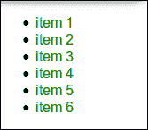
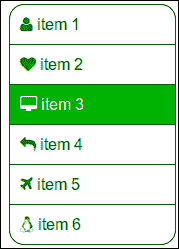
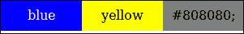
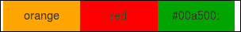

# 三、嵌套规则、操作和内置函数

在本章中，您将学习 *Less* 如何帮助您更直观地组织 CSS 选择器，使继承变得清晰，并使样式表变得更短。您还将了解操作和内置功能。操作允许您添加、减去、除和乘属性值和颜色。它们还能让你在属性之间建立复杂的关系。您还将学习如何在您的 *Less* 代码中使用内置函数设置变量或保护。

本章将涵盖以下主题:

*   嵌套 CSS 规则
*   使用操作
*   在代码中使用内置函数
*   在混搭中使用内置函数

# 导航结构

通过本章中的示例，您将使用变量和 Mixins 从[第 2 章](2.html "Chapter 2. Using Variables and Mixins")、*逐步扩展布局，并带有导航结构。您将通过用*减去*来设计一个 HTML 列表来构建这个导航结构。这种导航结构在布局的边栏中形成一个菜单。*

最终结果如下图所示:


使用*减*构建最终导航菜单

# 嵌套规则

您将使用第 2 章*中的布局示例，使用变量和混合*，更详细地研究规则的*嵌套。*

为此，您必须首先在浏览器中打开`http://localhost/index.html`，然后在文本编辑器中打开`less/sidebar.less`。

菜单项中添加了锚点。这意味着侧面菜单的 HTML 代码现在看起来像下面的代码:

```html
<aside id="sidemenu">
  <h2>Side menu</h2>
  <ul>
      <li><a href="page1.html">item 1</a></li>
      <li><a href="page2.html">item 1</a></li>
  </ul>
</aside>
```

每个规则都需要一个选择器来设置 CSS 中不同元素的样式，如下面的代码所示:

```html
#sidebar h2{
  color: black;
  font-size: 16px;
}
#sidebar ul li a{
  text-decoration: none;
  color: green;
}
```

可以看到，的`ul`(包括`li`元素和`a`锚点)元素和`h2`元素都是`#sidemenu` ID 的`aside`元素的子元素。CSS 没有反映这种关系，因为它当前的格式如前面的代码所示。*少一些*会帮助你在代码中反映这种关系。在 *Less* 中，可以编写如下代码:

```html
#sidebar{
  h2{
    color: black;
    font-size: 16px;
  }
  ul{
    li{
      a{
        text-decoration: none;
        color: green;
      }
    }
  }
}
```

前面的代码将直接编译成以下 CSS 语法:

```html
#sidebar h2 {
  color: black;
  font-size: 16px;
}
#sidebar ul li a {
  text-decoration: none;
  color: green;
}
```

您编译的*减*代码的最终 CSS 与您的原始 CSS 代码完全相同。在 *Less* 中，你只引用了一次`#sidemenu` ID，由于`h2`和`ul`在`#sidemenu`内部的嵌套，你的代码结构比较直观，反映了你的 HTML 代码的 **DOM 结构** 。

为了保持代码干净，已经创建了一个新的`less/sidebar.less`文件。它包含前面的*减*代码。当然，这个文件也应该使用下面一行代码导入到`less/styles.less`中:

```html
@import "sidebar.less";
```

还请注意，侧边栏被包装在语义 HTML5 `aside`元素中，而不是`div`元素中。虽然这更有语义**，**你会发现你做了这些改动之后，你的侧边栏已经飘到左边了。要解决这个问题，请在文本编辑器中打开`less/content.less`。通过研究 CSS 选择器在 *Less* 代码中的嵌套，你会发现`aside float:right;`嵌套在`.wrapper`容器中。如果您在`#content`容器内移动这个`aside`规则，语法应该如下代码所示:

```html
#content {
  //two third of @basic-width
  width:(@basic-width * 2 / 3);
  float:left;
  min-height:200px;
  aside {
    float:right;
  }
}
```

在`less/content.less`文件中，您还会发现线条`h2 { color: @content-dark-color; }`，这与您在`aside`元素中看到的形成对比。`h2`规则仍将被`#sidebar h2{ color: black; }`覆盖。最后一个规则包含一个`#sidebar`选择器，因此它具有更高的 **CSS 特异性**，如第一章所述。

再次检查*较少的*文件，如`less/header.less`，并记住这些关于 CSS 选择器嵌套的全新见解。您将看到嵌套已经被频繁使用。例如，在`less/header.less`中，`h1`元素的属性是通过嵌套设置的。

对这些文件的适当检查还将向您展示如何将 mixin 嵌套在类和其他 mixin 中。

## mixin 和 classes

混音器的名称应该始终以括号结束；否则，就是一个普通 T4 班。混搭和类都可以嵌套在*减*中。考虑以下示例*减去*代码的差异:

```html
.class-1{
  property-1: a;
}
.class-2{
  .class-1;
  property-2: b;
}
```

这段代码被编译成以下代码:

```html
.class-1 {
  property-1: a;
}
.class-2 {
  property-1: a;
  property-2: b;
}
```

可以看到`.class-1`的属性在编译好的 CSS 中是如何复制到`.class-2`中的。当您在*Less* 中的`.class-1`后面添加括号并使其成为混搭时，您现在应该考虑以下代码:

```html
.mixin(){
  property-1: a;
}
.class-2{
 .mixin;
  property-2: b;
}
```

这段代码将被编译成以下 CSS 代码:

```html
.class-2 {
  property-1: a;
  property-2: b;
}
```

让我们回到侧面导航菜单的例子。当你的菜单准备好了，你会发现`h2`标题元素里面的“导航”文字毫无意义。除非你有视力障碍并使用屏幕阅读器，否则你可以很容易地看到侧面菜单是为网站导航的。因此，您可以隐藏此标题，但应使其对 **屏幕阅读器**可见。设置`display:none`会隐藏屏幕阅读器中的元素，而`visibility:hidden`也会隐藏元素，但仍然会占用空间，因此会打乱我们的设计。在这种情况下，设置`clip`属性会有所帮助。您可以通过访问[http://a11yproject.com/posts/how-to-hide-content/](http://a11yproject.com/posts/how-to-hide-content/)了解更多详情。

根据优先规则，您可以使用 *Less* 编写以下类:

```html
.screenreaders-only {
  clip: rect(1px, 1px, 1px, 1px);
  position: absolute;
  border:0;
}
```

将前面的类添加到`less/boxsizing.less`中，并将该文件重命名为`less/basics.less`。另外，请不要忘记在`less/styles.less`中重命名导入语句。现在你可以使用下面的 *Less* 代码来隐藏侧边栏菜单中的`h2`标题元素:

```html
#sidebar{
  h2{
    color: black;
    font-size: 16px;
 .screenreaders-only;
  }
}
```

执行这些步骤并将 *Less* 代码编译成 CSS 代码后，侧边栏导航现在看起来像下面的截图:



带有隐藏标题文本的样式导航菜单

由于`.screenreaders-only`是一个类而不是一个 mixin，类被编译到你的最终 CSS 中，你不仅可以使用`.screenreaders-only` 类将其属性添加到 *Less* 中的其他类中，还可以直接在你的 HTML 中使用该类，如下一行代码所示:

```html
<div class="screenreaders-only">Only readable for screen readers</div>
```

当使用 *Less* 时，您通常必须在基于项目的 HTML 结构的特定编译的 *Less* 类和将应用于 HTML 代码中的类的 more 通用解决方案之间进行选择。不幸的是，在这些情况下，没有单一的解决方案。一般来说，DOM 特定的代码会生成更多的 CSS 代码，但也会保持你的 HTML 干净，并给你机会生成更多的语义 HTML 代码。重用你的*少一些*代码对于这个选项来说并不总是简单的。

将你的*少一些*语法编译成类，并在你的 HTML 中使用它们，会让你的代码更容易重用。另一方面，它会因为这些类而弄乱你的 HTML。此外，CSS 效果和 HTML 结构之间的关系变得不那么严格。这使得维护或更改变得更加困难。

## 变量

在`less/variables.less`中，您应该为侧边栏定义一个部分，如以下代码所示:

```html
/* side bar */
@header-color: black;
@header-font-size: 16px;
/* menu */
@menu-background-color: white;
@menu-font-color: green;
@menu-hover-background-color: darkgreen;
@menu-hover-font-color: white;
@menu-active-background-color: lightgreen;
@menu-active-font-color: white;
```

由于位于变量之前，`less/sidebar.less` 中的*减*代码现在看起来像下面的代码:

```html
#sidebar{
  h2{
    color: @header-color;
    font-size: @header-font-size;
    .screenreaders-only;
  }
  ul{
    li{
      a{
        text-decoration: none;
        color: @menu-font-color;
        background-color: @menu-background-color;
        }
    }
  }
}
```

## 类和名称空间

在完成菜单之前，用于设置菜单样式的 *Less* 代码将首先更改为一个类。这里要考虑的点已经讨论过了。导航是一个通用的结构，可以在很多项目中使用。在类结构中，它可以用来设置任何 HTML 列表的样式。

请为`less/nav.less`创建一个新文件，并在其中写入以下代码:

```html
.nav{
  li{
    a{
      text-decoration: none;
      color: @menu-font-color;
      background-color: @menu-background-color;
      }
  }
}
```

现在，您可以将我们的 HTML 文档中的每个 HTML 列表(`ul` 或 `ol`)变成一个导航结构，只需在其中添加`.nav`类。这可以使用下面一行代码来完成:

```html
<ul class="nav">
```

请注意，有了这个*减*代码，列表不能嵌套，列表上的项目应该包含锚点(链接)。这些需求清楚地表明，这些代码可以很容易地在其他项目中使用。 *Less* 还提供了定义**名称空间**的可能性。名称空间可以让你的代码更具可移植性，其定义方式与 CSS ID 选择器相同。名称空间以`#`开头，如下面的代码所示:

```html
#lessnamespace {
  .nav {
    //code from  less/nav.less here
  }
}
```

现在可以以`#lessnamespace` 命名空间为例，如下面的代码所示:

```html
#sidebar {
  ul{
    #lessnamespace > .nav;
  }
}
```

事实上，名称空间与标识选择器没有区别。`#lessnamespace`命名空间也可以直接在您的 HTML 代码中使用，尽管这在大多数情况下并不有用，如以下代码所示:

```html
<div id="lessnamespace">
  <ul class="nav">
    ...
  </ul>
</div>
```

HTML 要求每个 ID 只定义一次，因此除非将 ID 附加到正文中，否则不能在 HTML 文档中多次使用前面的 HTML 代码。然而，前面的代码表明，即使是专门为定制的 HTML DOM 结构编写的 *Less* 代码也可以在其他项目中重用。

在`#lessnamespace` 命名空间中，如前所述，`.nav`是一个使直接使用成为可能的类。当`.nav`变为混搭时，只能在 *Less、*中重用，如下代码所示:

```html
#namespace {
  .nav(){
    li{
      width:100%;
    }
  }
}
#sidebar {
  ul{
    #namespace > .nav;
  }
}
```

这段代码将直接编译成以下代码:

```html
#sidebar ul li {
  width: 100%;
}
```

# 对数字、颜色和变量进行操作

*Less* 支持基本的算术运算:加法(`+`)、减法(`-`)、乘法(`*`)和除法(`/`)。在严格数学模式下，运算应该放在括号之间。您可以对变量、值和数字进行运算。这些将帮助你建立变量之间的关系。

打开`less/footer.less`立即看到你使用的操作，如下代码，以及它的好处:

```html
footer {
  div {
    float: left;
  width: ((@basic-width / 3 ) - @footer-gutter);
  }
}
```

在前面的代码中，`/`符号(除法)被用来给页脚列提供可用宽度的三分之一(由`@basic-width`设置)。在代码中使用操作感觉如此自然，以至于直到现在你可能都没有意识到自己一直在使用它们。 *Less* 使用普通**顺序优先**，可以增加额外的括号，明确设置优先顺序，避免混淆。比如在*减*中， *3 + 3 * 3* 给出 *12* 。所以， *(3 + 3) * 3* 等于 *18，*如下代码所示:

```html
.mixin(){
  property1: (3 + 3 * 3);
  property2: ((3 + 3) * 3);
}
.class {
.mixin;
}
```

该代码将得到的编译成如下代码:

```html
.class {
  property1: 12;
  property2: 18;
}
```

*较少的*操作也可以用于颜色操作，可以对不同单位的值和颜色进行操作，如下代码所示:

```html
@color: yellow;
.mixin(){
  property1: (100px * 4);
  property2: (6% * 1px);
  property3: (#ffffff - #111111);
  property4: (@color / 10%)
}
.class {
.mixin;
}
```

这段代码将被编译成以下代码:

```html
.class {
  property1: 400px;
  property2: 6%;
  property3: #eeeeee;
  property4: #1a1a00;
}
```

# 符号

`&`符号在*减*中扮演着特殊而重要的角色。它引用当前选择器的父级，您可以使用它来反转嵌套的顺序，并扩展或合并类。你会发现下面的例子告诉你的不仅仅是千言万语所能表达的:

```html
.class1
{
  .class2{
    property: 5;
  }
}

.class1
{
  .class2 & {
    property: 5;
  }
}
```

这段代码将编译成以下代码:

```html
.class1 .class2 {
  property: 5;
}
.class2 .class1 {
  property: 5;
}
```

当你在后面使用`&`符号时，你可以看到`.class2`成为`.class1` 的父级。也可以使用`&`符号来引用混合之外的嵌套。

`&`符号也可以用来嵌套和追加**伪类**到类。稍后，您将看到您也可以使用它来追加类。一个简单的例子是将鼠标悬停触发的`:hover`伪类添加到链接中，如以下代码所示:

```html
.hyperlink{
  color: blue;
  &:hover {
    color: red;
  }
}
```

这段代码可以编译成以下代码:

```html
.hyperlink {
  color: blue;
}
.hyperlink:hover {
  color: red;
}
```

现在，在文本编辑器中打开`less/mixins.less`，找到 **clearfix mixin** 。clearfix mixin 使用`&`符号将`:hover`、`:after`和`:before`伪类附加到您的元素中，如以下代码所示:

```html
.clearfix() {
  &:before,
  &:after {
    content: " "; /* 1 */
    display: table; /* 2 */
  }
  &:after {
    clear: both;
  }
}
```

有了这个关于`&`符号的新知识，现在您将很容易理解如何用`:hover`和`:active` ( `.active`)状态扩展您的示例导航菜单，下面的代码向您展示了扩展后的代码的外观:

```html
.nav {
    li {
      a {
        text-decoration: none;
        color: @menu-font-color;
        &:hover {
          color:@menu-hover-font-color;
          background-color:@menu-hover-background-color;
        }

      width:100%;
      display: block;
      padding: 10px 0 10px 10px;
      border: 1px solid @menu-border-color;
      margin-top: -1px;// prevent double border      
    }
    &.active {
      a {
        color:@menu-active-font-color;
        background-color:@menu-active-background-color;
      }
    }
    &:first-child a {
      border-radius: 15px 15px 0 0;
    }
    &:last-child a{
      border-radius: 0 0 15px 15px;
    }

  }

  list-style: none outside none;
  padding:0;
}
```

在浏览器中打开`http://localhost/indexnav.html`检查前面语法的结果。

`extend`伪类是一个*减*伪类，使用与 CSS 伪类相同的语法。`extend`伪类将选择器添加到 **扩展选择器**列表中。将选择器添加到不同类的选择器列表中，可以为选择器提供与扩展类相同的属性。还记得前面一个例子中的`.hyperlink`课吗？如果扩展此类，则两个类将具有相同的属性:

```html
.hyperlink{
  color: blue;
  &:hover {
    color: red;
  }
}
       .other-hyperlink:extend(.hyperlink){};
```

这段代码将被编译成以下代码:

```html
.hyperlink,
.other-hyperlink {
  color: blue;
}
.hyperlink:hover {
  color: red;
}
```

注意嵌套的`:hover`伪类没有包含在`.other-hyperlink`中。要扩展包含扩展样式的嵌套元素的类，必须添加`all`关键字，如以下代码所示:

```html
.other-hyperlink:extend(.hyperlink all){};
```

这段代码现在被编译成以下代码:

```html
.hyperlink,

.other-hyperlink {

  color: blue;

}

.hyperlink:hover,

.other-hyperlink:hover {

  color: red;

}
```

在您嵌套`:extend`语句的情况下，您必须使用`&`符号作为引用，如以下代码所示:

```html
.other-hyperlink{
  &:extend(.hyperlink);
};
```

尽管`extend`语法模仿伪类的语法，但只要在选择器的末尾添加`:extend`，两者都可以组合，如以下代码所示:

```html
.other-hyperlink:hover:extend(.hyperlink){};
```

# 物业合并

**属性合并** 如果属性接受一个 **逗号分隔值** ( **CSV** )则很有用。您会发现这种类型的属性主要在 CSS3 中，其中边框、背景和过渡接受 CSV 列表。但是，你也会发现老派`font-family`参数接受一个用逗号分隔的字体名称列表。通过在属性名称后添加加号(`+`)来合并属性，如以下代码所示:

```html
.alternative-font()
{
  font-family+: Georgia,Serif;
}
.font()
{
  font-family+: Arial;
  .alternative-font;
}
body {
.font;
}
```

这段代码将被编译成以下代码:

```html
body {
  font-family: Arial, Georgia,Serif;
}
```

# 内置功能

*Less* 支持很多得心应手的 **内置功能**。一个内置函数可以用来操作 mixins 中的*减*值和设置变量的值。最后但同样重要的是，它们也可以用在 **守卫表情**中。通过访问[http://lesscss.org/functions/](http://lesscss.org/functions/)，您将找到完整的功能列表。

在本章中，您不会找到所有的函数，但是您将学习如何使用来自所有不同组的函数。可以根据输入和输出类型对函数进行分组，其中这些类型包括数学函数、颜色函数、列表函数、字符串函数和类型函数。还有一小部分功能不能使用前面的分类进行分组。

## JavaScript

*Less* 函数映射原生 **JavaScript 函数**和代码放在第一位，因为 *Less* 已经用 JavaScript 写好了。目前，JavaScript 表达式仍然可以作为 *Less* 代码中的值进行计算，但是这种能力可能会在未来的版本中被移除。在您的*减*代码中使用时，JavaScript 代码应该用引号括起来，如以下代码所示:

```html
@max: ~"`Math.max(10,100)+'px'`";
p {
  width: @max;
}
```

这个*减*的代码，包括 JavaScript 代码，会编译成下面的 CSS 代码:

```html
p {

  width: 100px;

}
```

即使有可能，也要尽量避免在代码中使用 JavaScript。**用其他语言编写的较少编译器** 无法评估这段代码，所以你的代码不可移植，更难维护。

如果没有内置的 *Less* 功能可供您使用，请尝试在 *Less* 代码中编写您需要的等效功能。从 1.6 版本开始，有一个`max()`功能，之前，您可以使用以下代码:

```html
.max(@a,@b) when (@a>=@b){@max:@a;}
.max(@a,@b) when (@b>@a){@max:@b;}
```

特别要注意的是，在你的 *Less* 代码中使用 JavaScript 环境时。此外，像`document.body.height`这样的值在您的编译和无状态 CSS 中没有意义。

## 列出功能

`Extract()` 和`length()` 是获取值和 CSV 列表长度的函数。这些函数一起可以用来在 CSV 列表中以数组的形式迭代。

还记得[第二章](2.html "Chapter 2. Using Variables and Mixins")、*中使用变量和混合*设置背景图像的循环吗？在这里，您将使用相同的技术在侧边栏导航中的链接前添加图标。

这个例子使用了字体真棒图标。Font Awesome 是一种图标字体，使用可缩放的矢量图标，可以通过 CSS 进行操作。图标可以用 CSS 轻松缩放或着色；此外，加载字体只需要对所有图标进行一次 HTTP 请求。更多信息请参考[http://fontawesome.io/](http://fontawesome.io/)。

要使用 Font Awesome，首先通过在 HTML 文档的头部添加下面一行代码来引用它的源代码:

```html
<link href="//netdna.bootstrapcdn.com/font-awesome/4.0.3/css/font-awesome.css" rel="stylesheet">
```

### 注

字体 Awesome 和其他图标字体也可以使用 *Less* 集成并编译到您的项目中。你将在[第四章](4.html "Chapter 4. Avoid Reinventing the Wheel")、*中学习如何做到这一点，避免重复发明轮子*。

在你的 HTML 中，你现在可以使用下面一行代码:

```html
<i class="fa fa-camera-retro"></i> fa-camera-retro
```

图标是用 CSS `:before`伪类添加的，所以前面的 HTML 代码也可以用下面的 *Less* 代码进行无类样式化:

```html
i:before {
  font-family:'FontAwesome';
  content:"\f083";
}
```

### 类型

通过访问[http://astronautweb.co/snippet/font-awesome/](http://astronautweb.co/snippet/font-awesome/)，可以找到字体牛逼图标及其 CSS 内容值的列表。

有了这些关于图标字体的信息，您可以构建一个循环，将图标添加到导航的列表项中，如以下代码所示:

```html
@icons: "\f007","\f004","\f108","\f112","\f072","\f17c";
.add-icons-to-list(@i) when (@i > 0) {
  .add-icons-to-list((@i - 1));
  @icon_: e(extract(@icons, @i));
  li:nth-child(@{i}):before {
    font-family:'FontAwesome';
     content: "@{icon_}\00a0";
  }
}
.add-icons-to-list(length(@icons));
```

在`@icon_: e(extract(@icons, @i));`行中，`e()`是一个**字符串函数** ，这个函数相当于使用`~""`进行转义。也请注意在`content: "@{icon_}\00a0";`声明中，`\00a0`只是增加了一个额外的空间，将图标与链接分开。

`@icons` CSV 列表中的图标是随机选择的。`add-icons-to-list()` mixin 的递归调用从`.add-icons-to-list(length(@icons));`调用开始，其中`length(@icons)`返回`@icons`中的项目数。

将图标添加到列表项的循环的*减*代码应添加到`less/navicons.less`中。添加代码后，打开`http://localhost/indexnavicons.html`查看结果，应该如下图截图所示:



用较少的字体和令人敬畏的字体构建的图标化超链接

前面截图中的图标列表仅用于演示目的，实际上图标甚至与超链接无关。缺乏这种关系使得很难找到一个用例。然而，以你的创造性思维，我打赌你能找到一个。请记住，CSS 仅用于演示，不能修改 HTML，因此不能使用 *Less* 设置链接本身。但是，可以在已经存在的超链接和图标之间创建关系，如以下代码所示:

```html
#content a[href*="linux"]:before {
  font-family:'FontAwesome';
  content: "\f17c\00a0";
}
```

这里，`a[href*="linux"]`是所有主播的选择器，其`href`属性中带有`linux`字样。将上述代码添加到`less/styles.less`后，您可以在`http://localhost/index.html`查看结果。

## 使用颜色功能

*较少*颜色功能可以拆分为**颜色定义**、**混合、操作**和**通道操控**功能。

颜色是在**颜色通道中定义的。** 一种 RGB 颜色有三个通道:红色、绿色和蓝色。CSS2 使用这个 RGB 定义来声明颜色，CSS3 为颜色声明增加了新的定义。这些新的定义，比如 HSL 和 HSV，不过是 RGB 值的变换。CSS3 的颜色设置方法应该更加直观和用户友好。例如，HSL 在三个通道中定义颜色，在这种情况下是色相、饱和度和明度。 *Less* 内置不同类型颜色定义的通道操作功能。 *Less* 也支持不同类型的颜色定义。从 CSS3 开始，您可以将颜色值声明为十六进制颜色、RGB 颜色、RGBA 颜色(带有设置不透明度的附加 alpha 通道的 RGB 颜色)、HSL 颜色和 HSLA 颜色(带有也设置不透明度的附加 alpha 通道的 HSL 颜色)。当然，您可以使用预定义的跨浏览器颜色名称。

*减去*的颜色定义的编译后的颜色值在 CSS 代码中并不总是定义为十六进制颜色；如果可能，颜色定义的输出与 CSS 值匹配，如以下代码所示:

```html
.selector {

 color1: rgb(32,143,60);

 color2: rgba(32,143,60,50%);

 color3: hsl(90, 100%, 50%);

}
```

前面的*减*代码编译后变成下面的 CSS 代码:

```html
.selector {

  color1: #208f3c;

  color2: rgba(32, 143, 60, 0.5);

  color3: #80ff00;

}
```

颜色是网站设计和风格的基本部分。颜色功能可以帮助你设计你的**调色板** 并使它们动态化。例如，它们将用于为元素赋予比背景颜色更深的边框颜色，或者为元素赋予基于单一输入颜色的对比色。

## 变暗()和变亮()功能

`darken()` 和 `lighten()`功能是两种颜色功能，可用于获得输入颜色的更深或更浅的变体。您已经看到了这些函数是如何在第二章、*使用变量和混合*的示例布局中被使用的。现在，您可以在之前构建的网站导航菜单上应用这些功能。

请在文本编辑器中打开`less/variablesnav.less`并定义菜单变量，这些变量依赖于主`@menucolor`参数，如下所示:

```html
@menucolor: green;
@menu-background-color: white;
@menu-font-color: @menucolor;
@menu-border-color: darken(@menucolor,10%);
@menu-hover-background-color: darken(@menucolor,10%);
@menu-hover-font-color: white;
@menu-active-background-color: lighten(@menucolor,10%);
@menu-active-font-color: white;
```

完成后，通过在浏览器中打开`http://localhost/indexnav.html`来检查您的更改。现在，您可以仅通过更改`@menucolor`变量定义的颜色来修改导航的外观。您还会发现将`@menucolor`设置为浅颜色，例如粉色或黄色，由于背景颜色和字体颜色之间的**对比度**不够高，会使字体不可读。高对比度在网页设计中起着重要的作用。高对比度的设计有助于您达到**可达性**标准。高对比度不仅有助于视觉障碍或色盲的人，还会影响视力正常的人，因为人类天生喜欢高对比度的颜色设计。这个好感对你网站的第一印象有影响。

计算合适的对比度并不总是容易的。此外，在这种情况下，您不希望在更改基本颜色后必须更改所有字体颜色。 *Less* 的`contrast()`功能会帮你选择一个在彩色背景下很容易看到的颜色。根据 WCAG 2.0 标准(http://www . w3 . org/TR/2008/REC-WCAG20-20081211/# relative luminateceef，该功能比较**亮度**值，而不是颜色的明度。`luma()`功能本身也是内置颜色功能。

`contrast()`功能接受四个参数。第一个参数定义要对比的颜色；这是这种特殊情况下的背景颜色。第二个和第三个参数定义深色和浅色，默认情况下为黑色和白色。第四个也是最后一个参数设置了一个阈值。默认情况下，该阈值设置为 43%，并定义了亮度(感知亮度)。阈值以上的颜色被视为浅色，`contrast()`返回已经在第二个参数中为这些浅色定义的深色。

现在，重新打开`less/variablesnav.less`并根据以下代码更改导航字体颜色:

```html
@menucolor: green;
@menu-background-color: white;
@menu-font-color: contrast(@menucolor);
@menu-border-color: darken(@menucolor,10%);
@menu-hover-background-color: darken(@menucolor,10%);
@menu-hover-font-color: contrast(@menu-hover-background-color);
@menu-active-background-color: lighten(@menucolor,10%);
@menu-active-font-color: contrast(@menu-active-background-color);
```

要查看更多效果，将`@menucolor`变量更改为不同的颜色，如`yellow`、`pink`、`darkgreen`或`black`，打开`http://localhost/indexnav.html`观察变化。请记住，最浅的颜色是白色，最深的是黑色，所以`darken(black,10%);`或`lighten(white,10%);`不会有任何影响。

## 色彩操纵

如前所述， *Less* 为你提供了很多操控颜色的功能。这本书不是关于**色彩理论**，所以只处理了一些色彩操纵的例子。你可以通过访问[http://www . packtpub . com/article/introduction-color-theory-lighting-basis-blender](http://www.packtpub.com/article/introduction-color-theory-lighting-basics-blender)找到更多关于色彩理论的信息。

### 颜色操作

通过`darken(), lighten()`和`contrast()`功能，您已经熟悉了一些颜色操作。其他操作包括`saturate()`、`desaturate()`、`fadein()`、`fadeout()`、`fade()`、`spin()`、`mix()`、`grayscale()`。

前面提到的功能接受一个或多个颜色值，百分比作为输入参数，返回一种颜色。请注意,的颜色范围从白色到黑色，不环绕。所以，你不能像前面提到的那样，把的颜色变黑使其变成白色。

如果颜色定义包含百分比，则操作会用输入参数的绝对百分比来更改它们。于是，`darken(hsl(90, 80%, 50%), 20%)`变成了`#4d8a0f`；相当于`hsl(90, 80%,30%)`*而不是* `hsl(90, 80%,10%)`。当然，当您操纵第二个通道(定义饱和度)时，您会看到相同的效果。比如`desaturate(hsl(45, 65%, 40%), 50%)`编译成`#756e57;`，等于`hsl(45, 15%, 40%)`。

`mix()`功能是颜色操作的最后一个例子。其他功能留给你做练习。

```html
@color: mix(blue, yellow, 50%);
.class {
color: @color;
}
```

这将再次变成以下内容:

```html
.class {
  color: #808080;
}
```

该混合物也将显示在下图中:



如何使用`mix(blue, yellow, 50%)`呈现蓝色和黄色的混合

## 少调色

颜色混合功能基于两种输入颜色计算新颜色，其中功能对输入颜色的颜色通道应用基本操作，如减法。可用功能也称为混合模式，包括`multiply()`、`screen()`、`overlay()`、`softlight()`、`hardlight()`、`difference()`、`exclusion()`、`average()`和`negation()`。使用分层图像编辑器如 Photoshop 或 GIMP 的用户会识别这些功能。

`difference()`功能逐个通道地从第一种颜色中减去第二种颜色，如以下代码所示:

```html
@color: difference(orange, red, 50%);
.class {
color: @color;
}
```

前面的代码将变成下面的代码:

```html
.class {
  color:  #00a500;
}
```

下图显示了橙色和红色的混合颜色的外观:



如何使用`difference(orange, red, 50%)`出现橙色和红色的混合物

## 类型功能

键入功能 评估输入值的类型，如果类型与功能匹配，则返回为`true`。可用的功能有`isnumber(),``isstring()``iscolor()``iskeyword()``isurl()``ispixel()``isem()``ispercentage()`和`isunit()`。一些示例功能在中显示如下代码:

```html
isnumber("string"); // false
isnumber(1234); // true
isnumber(56px); // true
iscolor(#ff0); // true
iscolor(blue); // true
iscolor("string"); // false
ispixel(1234); // false
ispixel(56px); // true
```

类型函数在定义防护时很有用。请考虑以下语法:

```html
.mixin() when isprecentage(@value) {
  width: 25%;
}
.mixin() when ispixel(@value) {
  width: (@value / 4 );
}
```

`default()`函数是另一个内置函数，不在函数类中分组。`default()`功能可以在守卫中使用，当没有其他混音器与调用者匹配时，该功能返回为`true`。您可以在前面的 mixin 中添加一个默认 mixin，如下面的代码所示:

```html
.mixin() when ispercentage(@value) {
  width: 25%;
}
.mixin() when ispixel(@value) {
  width: (@value / 4 );
}
.mixin() when (default()) {
  display: none;
}
```

# 盒影融合

有了对 *Less* 的所有了解，您现在可以理解、构建和评估任何复杂的 *Less* 代码。为了证明这一点，请打开`less/mixins.less`看一下盒影 mixin(原发布在[lesscss.org](http://lesscss.org)上)，看起来像下面的代码:

```html
.box-shadow(@style, @c) when (iscolor(@c)) {
  -webkit-box-shadow: @style @c;
  -moz-box-shadow:    @style @c;
  box-shadow:         @style @c;
}
.box-shadow(@style, @alpha: 50%) when (isnumber(@alpha)) {
  .box-shadow(@style, rgba(0, 0, 0, @alpha));
}
```

要完全理解这些混搭，你必须了解 CSS3 中**方块阴影**的基础知识。框阴影属性接受阴影的 CSV 列表。阴影由两到四个长度值和一种颜色组成。前两个长度值描述了与盒子中心相关的垂直和水平偏移。这些值是必需的，但可以设置为`0`以在框周围获得相同大小的阴影。最终值是可选的，分别设置模糊半径和扩散半径。默认情况下，模糊半径和扩散半径都是`0`，并给出清晰的阴影，其中扩散半径等于模糊半径。

现在你应该可以评估一下混音了。你会看到混血儿组成了一个守卫。两个 mixins 都接受两个参数。第一个参数是长度向量，前面已经介绍过了；第二个是颜色或百分比。如果你回忆起`isnumber(40%)`呼叫的评估结果为`true`，尽管有结束百分比符号。调用`rgba(0, 0, 0, @alpha)`将根据`@alpha`的值给出灰色阴影。如果您将第二个参数定义为一种颜色，如`blue`或`#0000ff` #，`iscolor(@c)`防护将评估为`true`，第一个混合将使用您定义的颜色进行编译。

# 总结

在本章中，您用*减去*构建了一个导航菜单。除了其他功能，导航还包括悬停、对比颜色和图标，这些都可以通过一些基本设置进行设置。您已经学习了如何在 *Less* 中使用嵌套规则、混搭和内置函数。在这一章的最后，你已经理解并使用了复杂的*少*代码。所有这些新获得的知识将在下一章非常有用。在下一章中，您将学习如何查找和构建可重用的 *Less* 代码。这将帮助你更快地工作，获得更好的结果。