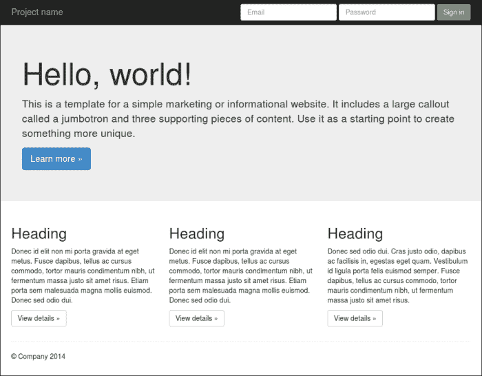
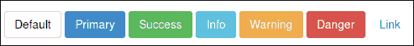
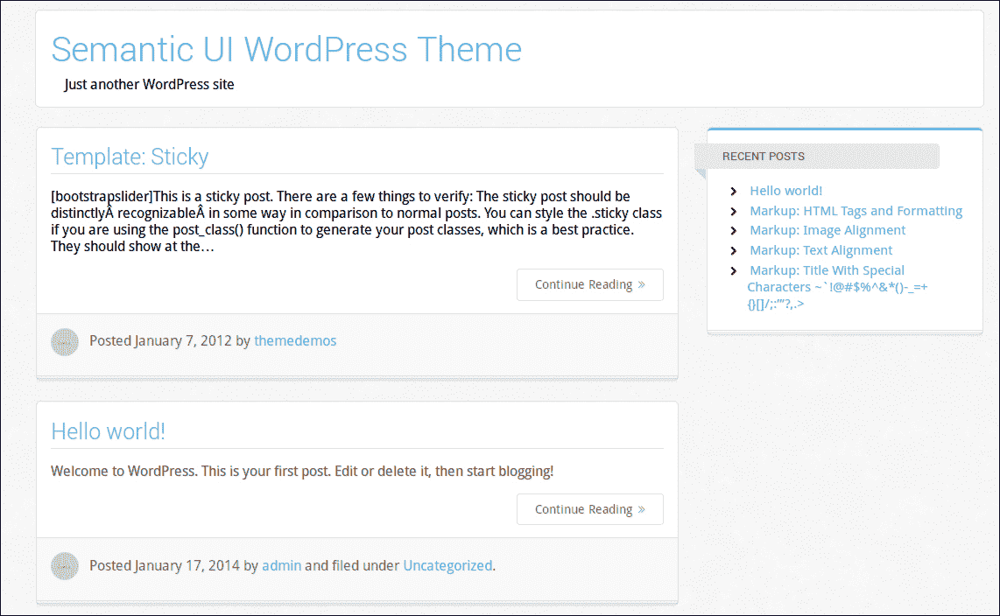

# 第六章。Bootstrap 3、WordPress 和其他应用程序

看完前面几章，你应该已经学会了用*少*来构建自己的项目。你会写得更好，在同样的时间里，你会比以前取得更多的成就。你现在已经为最后一步做好了准备。在本书的最后一章中，您将学习如何将 *Less* 与其他知名框架、应用程序和工具一起使用。您将了解到使用 *Less* 构建的或在其工作流程中集成了 *Less* 的网络开发工具。这些项目可以使用 *Less* 进行使用、定制和扩展，将帮助你用 *Less* 构建更好的项目。

本章将涵盖以下主题:

*   自举 3
*   语义用户界面
*   用*减去*构建网格
*   WordPress 和*减*
*   编译你的*减*代码的替代编译器

# 自举 3

Bootstrap 3，原名推特的 Bootstrap ，是一个用于构建应用前端的 CSS 和 JavaScript 框架。Bootstrap 3 中的三个是指这个框架的第三个版本；无论 Bootstrap 写在这本书的什么地方，它都指的是第三个版本。Bootstrap 的第三个版本比框架的早期版本有了重要的变化。Bootstrap 3 与早期版本不兼容。

Bootstrap 3 可用于构建出色的前端。您可以下载完整的框架，包括 CSS 和 JavaScript，并立即开始使用。自举也有一个 **格子**。默认情况下，Bootstrap 的网格是移动优先的，有 12 列。事实上，Bootstrap 定义了四个格:最高 768 像素的超小格(手机)，768 到 992 像素之间的小格(平板电脑)，992 到 1200 像素之间的中格(台式机)，最后是 1200 像素及以上的大格，适用于大型台式机。在[第五章](5.html "Chapter 5. Integrate Less in Your Own Projects")、*在你自己的项目中少集成*，你用 Preboot 的 mixins 构建一个网格；Bootstrap 的网格以类似的方式工作。

网格、所有其他 CSS 组件和 JavaScript 插件都在[http://getbootstrap.com/](http://getbootstrap.com/)进行了描述和很好的记录。

Bootstrap 的默认主题如下图所示:



使用 Bootstrap 3 构建的布局示例

所有 Bootstrap 网站看起来都很相似的时代已经一去不复返了。Bootstrap 将为您提供创造创新设计所需的所有自由。

关于 Bootstrap 还有很多要说的，但是现在，让我们回到 *Less* 。

## 使用引导的较少文件

Bootstrap 的所有 CSS 代码都是用 *Less* 写的。你可以下载 Bootstrap 的 *Less* 文件并重新编译你自己的 CSS 版本。 *Less* 文件可用于自定义、扩展和重用 Bootstrap 的代码。在接下来的几节中，您将学习如何做到这一点。

要下载 *Less* 文件，请点击[http://getbootstrap.com/](http://getbootstrap.com/)链接至[https://github.com/twbs/bootstrap](https://github.com/twbs/bootstrap)Bootstrap 的 GitHub 页面。在此页面，选择右侧栏的**下载 Zip** 。

### 用 Grunt 构建一个引导项目

下载完前面提到的文件后，就可以用**咕噜**构建 Bootstrap 项目了。Grunt 是一个 JavaScript 任务运行器；它可以用于过程的自动化。Grunt 在执行重复任务时可以帮助您，例如缩小、编译、单元测试和林挺代码。

Grunt 运行在 **node.js** 上，使用 **npm** ，这是你在安装 *Less* 编译器时看到的。Node.js 是一个独立的 JavaScript 解释器，建立在谷歌的 V8 JavaScript 运行时之上，就像在 Chrome 中使用的那样。Node.js 可用于轻松构建快速、可扩展的网络应用程序。

当你从下载的文件中解压文件时，你会发现`Gruntfile.js`和`package.json`等。`package.json`文件包含作为 npm 模块发布的项目的元数据。`Gruntfile.js`文件用于配置或定义任务和加载 Grunt 插件。Bootstrap Grunt 配置是一个很好的例子，向您展示了如何为包含 HTML、 *Less* (CSS)和 JavaScript 的项目设置自动化测试。这本书不能处理所有这些；更多关于 Grunt.js 的信息可以在[http://www.packtpub.com/grunt-js-cookbook/book](http://www.packtpub.com/grunt-js-cookbook/book)上的 *Grunt.js 食谱*中找到。作为一个*不太*的开发人员，您感兴趣的部分将在以下章节中提到。

在`package.json`文件中，你会发现 Bootstrap 用`grunt-contrib-less`编译它的*减*文件。在写这本书的时候，`grunt-contrib-less`插件用 Less . js 1.7 版本编译 *Less* 。与凹陷(Bootstrap 之前使用的另一个 JavaScript 构建工具)相反，`grunt-contrib-less`也支持源图。

除了`grunt-contrib-less`之外，Bootstrap 还使用`grunt-contrib-csslint`来检查编译后的 CSS 是否有语法错误。`grunt-contrib-csslint`插件也有助于提高浏览器的兼容性、性能、可维护性和可访问性。该插件的规则基于面向对象的 CSS 原则([http://www.slideshare.net/stubbornella/object-oriented-css](http://www.slideshare.net/stubbornella/object-oriented-css))。您可以通过访问[https://github.com/stubbornella/csslint/wiki/Rules](https://github.com/stubbornella/csslint/wiki/Rules)了解更多信息。

Bootstrap 大量使用*较少的*变量，可由定制者设置。

研究过`Gruntfile.js`来源的人很可能也找到了`BsLessdocParser`咕噜任务的参考。此咕噜任务用于基于引导使用的*减*变量动态构建引导的定制器。虽然解析*的过程需要构建较少的*变量，例如，文档将会非常有趣，但是这里不进一步讨论这个任务。您将在本章的后面阅读关于定制器的内容。

本节以`Gruntfile.js`中做*少*编译的部分结束。以下来自`Gruntfile.js`的代码应该会让您对该代码的外观有所了解:

```html
    less: {
      compileCore: {
        options: {
          strictMath: true,
          sourceMap: true,
          outputSourceFiles: true,
          sourceMapURL: '<%= pkg.name %>.css.map',
          sourceMapFilename: 'dist/css/<%= pkg.name %>.css.map'
        },
        files: {
          'dist/css/<%= pkg.name %>.css': 'less/bootstrap.less'
        }
      }
```

最后但同样重要的是，让我们看看从命令行运行 Grunt 和构建 Bootstrap 的基本步骤。Grunt 将与 npm 一起安装。Npm 检查 Bootstrap 的`package.json`文件，并自动安装其中列出的必要的本地依赖项。

要使用 Grunt 构建引导，您必须在命令行中输入以下命令:

```html
> npm install -g grunt-cli
> cd /path/to/extracted/files/bootstrap

```

之后可以通过运行以下命令来编译 CSS 和 JavaScript:

```html
> grunt dist

```

这将把你的文件编译到`/dist`目录中。`> grunt test`命令也将运行内置测试。

### 编译你的 Less 文件

虽然你可以用咕噜建造自举，但你不必使用咕噜。你会在根`/bootstrap`目录下一个名为`/less`的单独目录中找到 *Less* 文件。主要项目文件是`bootstrap.less`；其他文件将在下一节中解释。您可以像前面章节一样使用`bootstrap.less`。

您可以将`bootstrap.less`和 less.js 一起包含到您的 HTML 中，以便进行如下测试:

```html
  <link rel="bootstrap/less/bootstrap.less" type="text/css" href="less/styles.less" />
  <script type="text/javascript">less = { env: 'development' };</script>
  <script src="less.js" type="text/javascript"></script>
```

当然，您也可以如下编译这个文件服务器端:

```html
lessc bootstrap.less > bootstrap.css

```

### 潜入引导数据库的 Less 文件

现在是时候更详细地看看 Bootstrap 的 *Less* 文件了。`/less`目录包含一长串文件。你可以通过名字识别一些文件。之前看过`variables.less`、`mixins.less`、`normalize.less`等文件。打开`bootstrap.less`查看其他文件是如何组织的。`bootstrap.less`里面的注释告诉你 *Less* 文件是按功能组织的，如下面的代码片段所示:

```html
// Core variables and mixins
// Reset
// Core CSS
// Components
```

虽然 Bootstrap 非常基于 CSS，但是如果没有相关的 JavaScript 插件，一些组件是无法工作的。navbar 组件就是一个例子。Bootstrap 的插件需要 **jQuery** 。您不能使用最新的 2.x 版本的 jQuery，因为该版本不支持 Internet Explorer 8。

要编译自己版本的 Bootstrap，必须更改`variables.less`中定义的变量。在前面的章节中，您了解到不必覆盖原始文件和变量。当使用*最后声明胜*和*懒加载*规则时，会很容易重新声明一些变量。变量的重新定义在前面的[第 2 章](2.html "Chapter 2. Using Variables and Mixins")、*中讨论过，使用变量和混合*。

### 使用较少的内容创建自定义按钮

默认情况下，Bootstrap 定义了七个不同的按钮，如下图截图所示:



Bootstrap 3 的七种不同按钮样式

在你开始写你的 *Less* 代码之前，请看看下面 Bootstrap 的按钮的 HTML 结构:

```html
<!-- Standard button -->
<button type="button" class="btn btn-default">Default</button>
```

一个按钮有两个类别。全局来看，第一个`.btn`类只提供布局样式，第二个`.btn-default`类添加颜色。在本例中，您将只更改颜色，按钮的布局将保持不变。

在文本编辑器中打开`buttons.less`。在这个文件中，您会发现以下不同按钮的*减*代码:

```html
// Alternate buttons
// --------------------------------------------------
.btn-default {
  .button-variant(@btn-default-color; @btn-default-bg; @btn-default-border);
}
```

上面的代码清楚地表明，您可以使用`.button-variant()`混搭来创建自定义按钮。例如，要定义自定义按钮，可以使用以下*减*代码:

```html
// Customized colored button
// --------------------------------------------------
.btn-colored {
  .button-variant(blue;red;green);
}
```

在前面的情况下，您想要用您的自定义按钮扩展 Bootstrap，将您的代码添加到一个新文件中，并调用该文件`custom.less`。将`@import custom.less`添加到`bootstrap.less`内部的组件列表中会很有效。这样做的缺点是，在更新 Bootstrap 时，您必须再次更改`bootstrap.less`；因此，或者，您可以创建一个像`custombootstrap.less`这样的文件，其中包含以下代码:

```html
@import "bootstrap.less";
@import "custom.less";
```

上一步使用自定义按钮扩展了 Bootstrap 或者，您也可以通过重新定义其变量来更改默认按钮的颜色。为此，再次创建一个新文件`custombootstrap.less`，并在其中添加以下代码:

```html
@import "bootstrap.less";
//== Buttons
//
//## For each of Bootstrap's buttons, define text, background and border color.
@btn-default-color:             blue;
@btn-default-bg:                 red;
@btn-default-border:           green;
```

在某些情况下，例如，您将需要使用按钮样式，而不需要 Bootstrap 的其他功能。在这些情况下，您可以将`reference`关键字与`@import`指令一起使用，如前面在[第 5 章](5.html "Chapter 5. Integrate Less in Your Own Projects")、*在您自己的项目*中所讨论的。

您可以使用以下 *Less* 代码为您的项目创建一个引导按钮:

```html
@import (reference) "bootstrap.less";
.btn:extend(.btn){};
.btn-colored {
  .button-variant(blue;red;green);
}
```

在浏览器中访问`http://localhost/index.html`可以看到前面代码的结果。

注意根据你使用的 less.js 的版本，你可能会在编译后的输出中发现一些意想不到的类。**媒体查询** 或扩展类有时会破坏旧版 less.js 中的引用

### 用更少的资源定制引导的导航栏

Bootstrap 的一个重要组成部分是导航栏。导航栏向网站添加主导航。它主要包含一个徽标或品牌名称、一个搜索框和导航链接。在本书中，navbar 指的是导航栏。一个典型的引导导航栏看起来像下面的截图:


引导导航栏示例

Bootstrap 的 navbar 默认情况下是响应的。在小屏幕尺寸上，前面的导航栏看起来像下面的截图:


折叠并打开的 Bootstrap 导航栏

除了 CSS， Bootstrap 的响应 navbar 需要折叠 JavaScript 插件。这个插件应该包含在你的引导版本中。

现在，以改变默认导航栏的颜色为例。为此，您必须首先打开`variables.less`来找出哪些变量为导航栏着色，如下所示:

```html
//== Navbar
//
//##

// Basics of a navbar
@navbar-height:                    50px;
@navbar-margin-bottom:             @line-height-computed;
@navbar-border-radius:             @border-radius-base;
@navbar-padding-horizontal:        floor((@grid-gutter-width / 2));
@navbar-padding-vertical:          ((@navbar-height - @line-height-computed) / 2);
@navbar-collapse-max-height:       340px;

@navbar-default-color:             #777;
@navbar-default-bg:                #f8f8f8;
@navbar-default-border:            darken(@navbar-default-bg, 6.5%);

// Navbar links
@navbar-default-link-color:                #777;
@navbar-default-link-hover-color:          #333;
@navbar-default-link-hover-bg:             transparent;
@navbar-default-link-active-color:         #555;
@navbar-default-link-active-bg:            darken(@navbar-default-bg, 6.5%);
@navbar-default-link-disabled-color:       #ccc;
@navbar-default-link-disabled-bg:          transparent;

// Navbar brand label
@navbar-default-brand-color:               @navbar-default-link-color;
@navbar-default-brand-hover-color:         darken(@navbar-default-brand-color, 10%);
@navbar-default-brand-hover-bg:            transparent;

// Navbar toggle
@navbar-default-toggle-hover-bg:           #ddd;
@navbar-default-toggle-icon-bar-bg:        #888;
@navbar-default-toggle-border-color:       #ddd;
```

你已经看到很容易找到这些变量。文件中的注释是找到它们的便捷指南。您还将看到变量的有意义和描述性的名称是有意义的，正如在[第 2 章](2.html "Chapter 2. Using Variables and Mixins")、*使用变量和混合*中所学的。另一方面，你可能想知道为什么只有 navbar 有这么多变量。navbar 有许多元素和不同的表现形式，需要用变量来定义。如前所述，Bootstrap 的 navbar 默认情况下是响应的；对于较小的屏幕，它会折叠(或者事实上，从移动优先的角度来看，对于较大的屏幕尺寸，它会变成水平的)。因此，必须为 navbar 的折叠和水平版本定义样式。navbar 链接和折叠菜单切换按钮的颜色也在前面的代码中设置。

就像 Bootstrap 的按钮一样，Bootstrap 导航栏也是用两个类构建的，如下面的代码片段所示:

```html
<nav class="navbar navbar-default" role="navigation"></nav>
```

在这种情况下，`.navbar`类提供布局样式，第二个`.navbar-default`类添加颜色和其他变化。`.navbar`类还有一个第三类来设定它的类型。有四种类型的导航条:默认的、固定到顶部的、固定到底部的和静态顶部的。

导航栏类可以在`navbar.less`中找到。nav bar 没有构建类的混合。 *Less* 代码为两种可选的导航条样式提供了类:`.navbar-default`和`.navbar-inverse`。

由于没有 mixins 可以使用，重新定义 navbar 的一些变量将是定制其外观和感觉的最佳选择。或者，您可以复制完整的`.navbar-default`类并用于定制。Bootstrap 打算每页只使用一个 navbar，所以额外的样式类没有附加值。

例如，现在设置以下内容:

```html
@navbar-default-color:          red;
@navbar-default-bg:              blue;
@navbar-default-border:        yellow;
```

您可以将这些变量声明到`customnavbar.less`中，也可以将`@import "bootstrap.less";`添加到该文件中。现在，你可以编译`customnavbar.less`。

在浏览器中访问`http://localhost/customnavbar.html`可以看到前面代码的结果。

### 引导类和混合

跳过组件，你会看到 Bootstrap 是一个非常完整的框架。编译框架后，您就拥有了构建响应性网站所需的所有类。另一方面，Bootstrap 也可以用作库。您已经看到了如何仅使用按钮。

在`utilities.less`中，可以找到以下代码:

```html
.clearfix {
  .clearfix();
}
```

前面的代码使得`.clearfix`类可以在你的 HTML 中直接使用；另一方面，您仍然可以重用`.clearfix()` mixin。你可以在`mixins.less`找到 Bootstrap 的混音。mixin 和类的严格分离允许您导入`mixins.less`并将这些 mixin 应用到您自己类名下的代码中，而无需实际创建这些类的输出。

前面导入的`mixins.less`文件将允许您为自己的项目使用 Bootstrap 的渐变混合，如以下代码片段所示:

```html
@import "bootstrap/mixins.less";
header {
 #gradient > .horizontal(red; blue);
}
```

前面的代码将编译成下面的 CSS 代码:

```html
header {
  background-image: -webkit-linear-gradient(left, color-stop(#ff0000 0%), color-stop(#0000ff 100%));
  background-image: linear-gradient(to right, #ff0000 0%, #0000ff 100%);
  background-repeat: repeat-x;
  filter: progid:DXImageTransform.Microsoft.gradient(startColorstr='#ffff0000', endColorstr='#ff0000ff', GradientType=1);
}
```

正如你所看到的，渐变混合是有命名空间的。也请访问`http://localhost/gradient.html`查看前面示例的背景渐变效果。

### 用更少的引导进行主题化

由于 Bootstrap 的风格是用 *Less* 打造的，所以给自己版本的 Bootstrap 设定主题会很容易。基本上有两种方法来整合你的主题的*减*代码。

第一种方法将所有代码编译成一个 CSS 文件。大多数情况下建议使用这种方法，因为加载只需要一个 HTTP 请求。

要使用这个方法，用`@import`语句将你的主题文件导入`bootstrap.less`并重新编译 Bootstrap。或者，创建一个新的项目文件，例如，`bootstraptheme.less`，其中包括两者，如以下代码片段所示:

```html
@import "bootstrap.less";
@import "theme.less";
```

该方法在*减去*级别覆盖 Bootstrap 的样式，而第二种方法在 CSS 级别也是如此。在第二种方法中，主题的 *Less* 代码将被编译到单独的 CSS 文件中，这些文件将在 Bootstrap 的 CSS 之后加载。

您用于客户端编译的 HTML 如下:

```html
  <link rel="stylesheet/less" type="text/css" href="less/bootstrap/bootstrap.less" />
  <link rel="stylesheet/less" type="text/css" href="less/yourtheme.less" />
  <script type="text/javascript">less = { env: 'development' };</script>
  <script src="less.js" type="text/javascript"></script>
```

您在服务器端编译后的 HTML 如下:

```html
  <link type="text/css"  rel="stylesheet" href="css/bootstrap.min.css" />
  <link type="text/css"  rel="stylesheet" href="css/yourtheme.min.css" />
```

第二种方法在加载页面时需要额外的 HTTP 请求，但另一方面，它提供了从 CDN 加载 Bootstrap 核心的机会，如下所示:

```html
  <link type="text/css"  rel="stylesheet" href="//netdna.bootstrapcdn.com/bootstrap/3.1.1/css/bootstrap.min.css" />
  <link type="text/css" rel="stylesheet" href="css/yourtheme.min.css" />
```

### 【Bootstrap 的 11y 主题

**A11y** 是(网络)可访问性的常用简写。可访问性在现代网页设计中起着重要的作用；尽管如此，许多网站对其关注较少。自举的 a11y 主题为自举提供了更好的可访问性。

a11y 主题可以从[https://github.com/bassjobsen/bootstrap-a11y-theme](https://github.com/bassjobsen/bootstrap-a11y-theme)下载。你只需要编译*减*文件来使用主题。此外，在这种情况下，您可以选择将 *Less* 代码集成到您的 *Less* 代码库中，或者编译一个单独主题的 CSS 文件。关于 Bootstrap 的更多可访问性改进，也可以看看[https://github.com/paypal/bootstrap-accessibility-plugin/](https://github.com/paypal/bootstrap-accessibility-plugin/)。注意这个插件不提供任何*减*代码，只提供 CSS。

### 1 像素深的配色方案

**1pxdeep** 帮助您在项目中使用**相对视觉权重** 和**配色方案** 。基于一种种子颜色，1pxdeep 的`scheme.less`文件生成一个有 16 种颜色的颜色托盘。每种颜色也在一个变量中定义。变量，如`@color1`或`@color4c`，可用于定制您的设计。每个颜色变量也定义了一个同名的类，所以你的*减*代码中的`@color1`和你的 HTML 中的`.color1`在你的配色方案中引用了相同的颜色。

在项目中实现 1pxdeep 后，更改品牌或配色方案就像更改种子颜色一样简单。

使用 1pxdeep 和 Bootstrap 的典型`Less`项目文件看起来像下面的代码片段:

```html
@import "scheme.less"; // color scheme
@import "bootstrap.less"; // bootstrap
@import "1pxdeep.less"; // 1pxdeep theme
@import "style.less"; // your own styles
```

前面的代码重新声明了 Bootstrap 的变量，如`@brand-primary: hsl(hue(#428bca),@sat,@l-factor);`，并使您能够在`style.less`文件中使用 1pxdeep 的变量，如`@color3`，如下面的代码片段所示:

```html
header {
    background-color: @color3;
    h1 {
    color: @color3a;
    }
}
```

1pxdeep 的 CSS 类也可以直接在您的 HTML 代码中使用，如下所示:

```html
<button class="btn btn-default color1">Color 1</button>
```

在 1pxdeep 的网站上，您可以测试不同的种子颜色，以了解它们的外观。请访问[http://rriepe.github.io/1pxdeep/](http://rriepe.github.io/1pxdeep)并感到惊讶。

## 使用 Bootstrap 的定制器构建自己的版本

谁想从头开始用定制版的 Bootstrap也可以用 Bootstrap 的定制器。您可以通过访问[http://getbootstrap.com/customize/](http://getbootstrap.com/customize/)找到定制商。定制器允许您选择应该使用哪些*减*文件。也可以设置所有 Bootstrap 的*减去*变量。当您自己编译版本时，该列表也可以用作 Bootstrap 变量的参考。请注意，使用定制器时可以下载的文件不包含任何*减*文件，因此引导定制器的文件不适合使用*减*进一步定制。

# 语义用户界面——另一个更少的框架

语义也可以用来构建前端。就像 Bootstrap 一样，它包含 CSS 组件和模块。组件被分成元素、集合和视图。模块不仅需要 CSS，还需要 JavaScript。

Semantic 的名字已经明确表示关注 HTML5 的语义。它也是标签无关的，这意味着你可以使用任何带有用户界面元素的 HTML 标签。

在下面的代码中，您会发现一个简短的 HTML 示例，它展示了如何使用语义:

```html
<main class="ui three column grid">
  <aside class="column">1</aside>
  <section class="column">2</section>
  <section class="column">3</section>
</main>
```

还有，语义是用*少*构建的。完整的源代码，包括*减*文件，可以从[https://github.com/semantic-org/semantic-ui/](https://github.com/semantic-org/semantic-ui/)下载。

语义处理 *Less* 的方式不同于 Bootstrap 和本书前面看到的大多数例子。语义源也将由 Grunt 构建，如前面的引导部分所述。相反，语义没有定义变量，也没有定义导入和连接不同*少*文件的主文件。语义 *Less* 代码被分成不同的模块，其中大多数设置都是硬编码的。

语义处理 *Less* 的不同方式也意味着，当你的项目整体使用框架时，在更改或扩展 *Less* 代码后，你将总是必须运行完整的 Grunt 任务。另一方面，在您的项目中使用单个语义组件或模块将非常容易。组件和模块不相互依赖，也不依赖全局变量。

请访问示例文件中的`http://localhost/semanticui.html`查看这是如何工作的。您将看到，您可以通过仅包含*减*文件来使用网格或按钮。还要注意，如果您的按钮使用图标(语义包括戴夫·甘迪为其标准图标集设计的字体 Awesome 的完整端口)，您还应该包括`icon.less`文件。

## 供应商特定规则的自动前缀

在用 Grunt 构建语义时，任务首先将 *Less* 文件编译成单个 CSS 文件。完成该任务后，下一个任务运行`grunt-autoprefixer`。`grunt-autoprefixer`插件解析 *Less* 或 CSS，并使用**添加供应商前缀的 CSS 属性...**数据库([http://caniuse.com/](http://caniuse.com/))。`/build`目录中的*减*文件也以这种方式作为前缀。您可以通过访问[https://github.com/nDmitry/grunt-autoprefixer](https://github.com/nDmitry/grunt-autoprefixer)找到更多关于`grunt-autoprefixer`的信息。最后的任务将把 CSS 和 JavaScript 文件捆绑在一个文件中，并缩小它们。

自动前缀对于您未来的项目将非常有趣，因为它使您能够只使用单行声明来编写您的 *Less* 代码。研究语义的`Grunt.js`以了解这是如何工作的。目前，运行任务和自动前缀不在本书的讨论范围之内。请注意，如果您在项目中使用单个*少一些*文件，您将不得不使用`/build`目录而不是`/source`目录中的文件。`/build`目录中的*减*文件带前缀，而`/source`目录中的文件不带前缀。

# 用更少的资源构建网格的其他框架

在前面的部分，您学习了如何使用引导和语义 UI 来构建完整的前端。实际上，对于许多项目来说，只有一个网格就足以启动。您已经看到语义的网格可以很容易地编译为单个组件。此外，可以使用以下代码片段将 Bootstrap 的网格编译为单个组件:

```html
// Core variables and mixins
@import "variables.less";
@import "mixins.less";
// Reset
@import "normalize.less";
@import "grid.less";
```

或者，您也可以使用另一个网格系统。下面几节将简要讨论其中的一些。

## 使用黄金网格系统构建你的网格

**金色网格系统** ( **GGS** ) 将屏幕分割成 18 个偶数列。最左边和最右边的列用作网格的外部边距；这为您的设计留下了 16 列。有关该电网系统的更多详情，请参见[http://goldengridsystem.com/](http://goldengridsystem.com/)。

GGS 附带了一个 *Less* 文件来编译构建网格所需的 CSS。

### 注

**无框**网格系统逐列适应，而不是逐像素适应。

建造 GGS 的同一作者建造的无框架网格系统并不流畅；到达断点时，网格会添加列。请注意，Bootstrap 的网格也是这样工作的。无框架附带一个 *Less* 模板，可以编译使用网格。这个模板包含一个小的 CSS 重置，一些一致性修复，以及一些基本的可定制变量和函数，用于启动一个无框架网格。更多关于无框网格的信息可以在[http://framelessgrid.com/](http://framelessgrid.com/)找到。“无框架”文档很少；然而，你可以在 GitHub 上找到无框架主页的来源。这样会给你一个如何少用*少用*的印象。

## 语义网格系统

**语义网格系统** 非常基础有效。设置列宽和装订线宽度后，选择列数并在像素和百分比之间切换；您的标记中没有任何`.grid_x`类。语义网格系统也有响应。它还支持嵌套和推拉，这允许您对列应用左右缩进。

用*减去*定义流体布局就像编译一样简单，如下面的代码片段所示:

```html
@import 'grid.less';
@columns: 12;
@column-width: 60;
@gutter-width: 20;

@total-width: 100%; // Switch from pixels to percentages
article {
   .column(9);
}
section {
   .column(3);
}
```

关于语义网格系统的更多信息可以在[http://semantic.gs/](http://semantic.gs/)找到。

# WordPress 和 Less

如今，WordPress 不仅仅用于博客；它还可以用作内容管理系统来构建网站。

用 PHP 编写的 WordPress 系统已经被拆分为核心系统、插件、和主题。插件为系统增加了额外的功能，主题处理了用 WordPress 构建的网站的外观和感觉。插件彼此独立工作。插件也是独立于主题的，主题也大多不依赖于插件。WordPress 主题定义了网站的全局 CSS，但是每个插件也可以添加自己的 CSS 代码。

WordPress 主题开发者可以使用 *Less* 来编译主题和插件的 CSS。

## 少用词根主题

**根源** 是一个 WordPress 首发主题。您可以使用根来构建自己的主题。Roots 基于 HTML5 样板文件([http://html5boilerplate.com/](http://html5boilerplate.com/))和 Bootstrap。也请访问根主题网站[http://roots.io/](http://roots.io/)。此外，根可以完全用咕噜建造。更多关于如何使用 Grunt 进行 WordPress 开发的信息可以在[http://root . io/using-Grunt-for-WordPress-theme-development/](http://roots.io/using-grunt-for-wordpress-theme-development/)找到。

下载 Roots 后，在`assets/less/`目录中可以找到 *Less* 文件。这些文件包括 Bootstrap 的*减*文件，如前所述。`assets/less/app.less`文件导入主引导*减*文件，`bootstrap.less`。

现在，您可以编辑`app.less`来定制您的主题。您必须在更改后重建根。

Roots 的文档将编辑 Bootstrap 的`variables.less`文件描述为定制用 Roots 构建的网站的最简单方法。更多信息可在[http://roots.io/modifying-bootstrap-in-roots/](http://roots.io/modifying-bootstrap-in-roots/)找到。

## 内置 Less 编译器的 JBST

JBST 也是 WordPress 首发主题。《JBST》旨在与所谓的儿童主题一起使用。更多关于 WordPress 子主题的信息可以在[https://codex.wordpress.org/Child_Themes](https://codex.wordpress.org/Child_Themes)找到。

安装 JBST 后，你会在你的**仪表盘**中**外观**下找到一个*减*编译器，如下图截图所示:


WordPress 仪表板中 JBST 内置的 Less 编译器

内置的 *Less* 编译器可以用 *Less* 完全定制你的网站。Bootstrap 也构成了 JBST 的框架，默认设置是从前面提到的 a11y bootstrap 主题中收集的。

JBST 的 *Less* 编译器可以有不同的使用方式。

首先，编译器接受任何自定义编写的*减*(和 CSS)代码。例如，要更改`h1`元素的颜色，您应该简单地编辑并重新编译代码，如下所示:

```html
h1 {color: red;}
```

其次，您可以编辑 Bootstrap 的变量并(重新)使用 Bootstrap 的混合。因此，要设置导航栏的背景颜色并添加自定义按钮，您可以在 *Less* 编译器中使用以下代码:

```html
@navbar-default-bg:              blue;
.btn-colored {
  .button-variant(blue;red;green);
}
```

第三，您可以设置 JBST 的内置*减去*变量，例如，如下所示:

```html
@footer_bg_color: black;
```

第四也是最后一点，JBST 有自己的一套混音。要设置自定义字体，您可以进行如下编辑:

```html
.include-custom-font(@family: arial,@font-path, @path: @custom-font-dir, @weight: normal, @style: normal);
```

在前面的代码中，参数用于设置字体名称(`@family`)和字体文件的路径(`@path/@font-path`)。`@weight`和`@style`参数设置字体的属性。更多信息，请访问[https://github.com/bassjobsen/Boilerplate-JBST-Child-Theme](https://github.com/bassjobsen/Boilerplate-JBST-Child-Theme)。

多*少*码也可以在特殊文件(`wpless2css/wpless2css.less`或`less/custom.less`)中添加；这些文件还会给你添加选项，例如，一个预构建的混合库，比如在[第 4 章](4.html "Chapter 4. Avoid Reinventing the Wheel")、*中讨论的那些，避免重新发明轮子*。通过该文件添加库后，mixins 也可以与内置编译器一起使用。

## 语义 UI WordPress 主题

语义用户界面，如前所述，提供了自己的 WordPress 插件。该插件可以在 https://github.com/ProjectCleverWeb/Semantic-UI-WordPress 的 GitHub 上找到。安装并激活此主题后，您可以直接使用带有语义用户界面的网站。使用默认设置，您的网站将如下图所示:



用语义用户界面主题建立的网站

## WordPress 插件及更少

如前所述，WordPress 插件有自己的 CSS。该 CSS 将作为普通样式表添加到页面，如下所示:

```html
<link rel='stylesheet' id='plugin-name'  href='//domain/wp-content/plugin-name/plugin-name.css?ver=2.1.2' type='text/css' media='all' />
```

除非一个插件为他们的 CSS 提供 *Less* 文件，否则用 *Less* 管理它的样式并不容易。

### 以少胜多的主题

**woodcommerce**是 WordPress 流行的电子商务插件。有了 WooCommerce，你可以很快建立一个网上商店。你可以用*减去*来设定你的 WooCommerce 网站的主题，如[http://docs.woothemes.com/document/css-structure/](http://docs.woothemes.com/document/css-structure/)所记载的。

WooCommerce 的 *Less* 文件应该编译成 CSS，并如前所述使用。要为所有带有 *Less* 的样式表创建单个 CSS 文件，可以考虑将`woocommerce.less`导入到项目的主 *Less* 文件中，并禁用主题的`functions.php`文件中带有`define('WOOCOMMERCE_USE_CSS', false);`的默认样式。

### WP 减 CSS 插件

可以通过访问[http://wordpress.org/plugins/wp-less-to-css/](http://wordpress.org/plugins/wp-less-to-css/)找到的T2【WP Less to CSS 插件，提供了用 *Less* 设计你的 WordPress 网站的可能性。如前所述，您可以使用 JBST 的内置编译器输入您的 *Less* 代码。这段代码将被编译到网站的 CSS 中。这个插件用 PHP Less 编译器`Less.php`编译 *Less* 。

# 编译 Less 代码的替代编译器

随着 *Less* 的日益流行， *Less* 编译器也被移植到了其他语言中。这些端口可以用来编译带有本地语言调用的 *Less* 。请记住，这些端口通常会落后于官方的 JavaScript 实现，因此您可能会发现它们缺少最近的 *Less* 功能。您可能还会意识到，正如前面在[第 3 章](3.html "Chapter 3. Nested Rules, Operations, and Built-in Functions")、*嵌套规则、操作和内置函数*中提到的，这些编译器无法在倒勾内编译本机 JavaScript 表达式。

## Less.php 编译器

这个官方*少*处理器的 PHP 端口可以在[http://lessphp.gpeasy.com/](http://lessphp.gpeasy.com/)下载。您已经看到了它的用法示例；WP Less 到 CSS 插件就是用它构建的。`Less.php`还实现了缓存，加快编译速度。

虽然`Less.php`提供了动态创建 CSS 的可能性，但在大多数情况下，您仍然应该预编译您的 CSS 以用于生产。WordPress 也是用 PHP 编写的，所以在 WordPress 插件的情况下， *Less* 不需要使用系统调用就可以编译。

在下面的代码中，您将找到一个简短的示例，它将向您展示如何在用 PHP 编写的网站上编译、自定义和使用 Bootstrap:

```html
<?php
require 'less.php/Cache.php';
Less_Cache::$cache_dir = '/var/www/mysite/writable_folder';
$files = array();
$files['/var/www/mysite/bootstrap/bootstrap.less'] = '/mysite/bootstrap/';
$files['/var/www/mysite/custom/my.less'] = '/mysite/custom/';
$css_file_name = Less_Cache::Get( $files );
echo '<link rel="stylesheet" type="text/css" href="/mysite/writable_folder/'.$css_file_name.'">';
```

http://leafo.net/lessphp/[的**lesphp**编译器](http://leafo.net/lessphp/)是一个替代的 PHP Less 编译器。

## The。更少的编译器。NET 应用程序

`.less`编译器是**的 JavaScript *减*库的完整端口。NET 平台**。如果你想静态编译你的文件，你可以使用附带的`dotless.Compiler.exe`编译器。通过向`Web.Config`文件添加新的 HTTP 处理程序，您可以将`.less`用于您的网页，如下所示:

```html
<add type="dotless.Core.LessCssHttpHandler,dotless.Core" validate="false" path="*.Less" verb="*" />
```

## 开发较少的工具列表

在 *Less* 网站([http://lesscss.org/usage/](http://lesscss.org/usage/))上，你会发现很多其他的库、工具和框架来开发 *Less* 。

# 总结

在这一章中，您学习了如何使用带有引导和语义用户界面的 *Less* ，并了解了使用 *Less* 构建的其他网格和框架。您已经看到了如何在 WordPress 中使用 *Less* ，最后，您看到了如何在您的项目中使用替代编译器。

这也是本书的最后一章。在这本书里，你学会了如何在你的项目中使用 *Less* 。您看到了变量、混合和内置函数如何帮助您重用代码。有了 *Less* ，你可以嵌套你的风格规则，这让你的代码更加直观易读。读完这本书，你知道你不必自己写所有的代码，但是你可以使用别人写的预建 mixins。最后，您获得了如何使用 *Less* 从头开始项目以及将 *Less* 与 WordPress、Bootstrap 和其他工具集成的知识。现在，你真的准备开始开发*减*了。恭喜你！使用*更少的*进行项目，你已经让自己能够更好更快地工作，并且将为你真正的设计任务节省更多的时间。