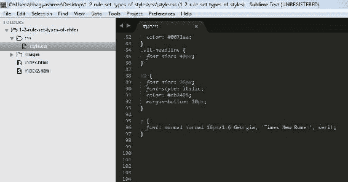
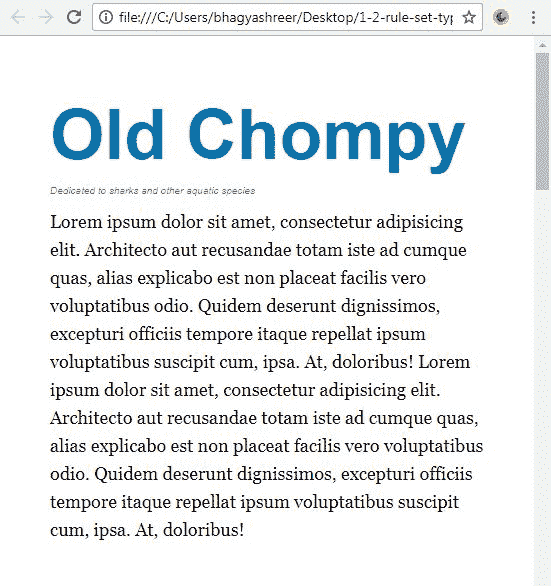
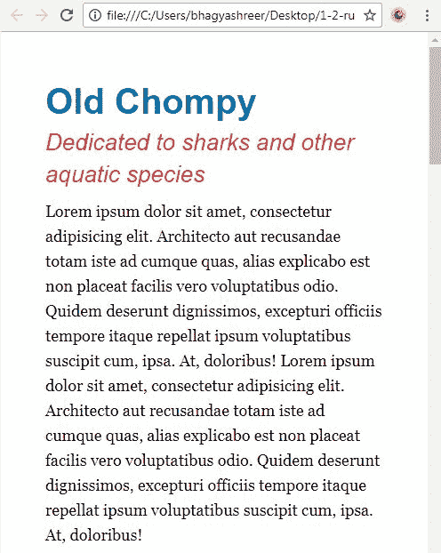
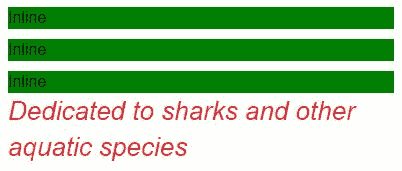

# 一、CSS 基础

在第一章 *CSS 基础*中，我们将了解掌握 CSS 所必需的基本概念。您将学习网络开发的最佳实践。

在网络发展的世界里，事情经常变化。例如，在过去，表格是布局网页时的首选技术。今天，使用表格进行布局绝对不是你想做的。一段时间以来，浮动一直是创建布局的最常见方式，也将是我们首先了解的内容。在过去一年左右的时间里，flexbox 在布局方面已经开始超越 floats，我们将在本书的结尾了解 flexbox。CSS 正在开发其他新的布局模块，旨在取代浮动来布局页面。网格布局和 CSS 区域可能是未来的发展方向。由于前端网络开发领域发展迅速，我们的关键收获是我们不能停止学习 CSS。一般来说，一旦你停止学习，你的知识就会很快过时。我的意图是教那些对你长期有益的概念和技术。

在本章的两个部分中，我们将回顾对网页设计和 CSS 至关重要的核心概念。我们将从回顾如何在 CSS 中创建最基本的东西——规则集开始，并回顾我们可以编写这些规则集的不同地方。

# 规则集和三种样式表的剖析

我们现在对这本书的内容和我们要建立的网站更加熟悉了。在我们开始钻研更高级的主题之前，让我们回顾几个 CSS 基础。在本书中，我将使用选择器、属性和值等术语，您需要准确理解这些术语的含义才能理解。下面是我们要做的:我们将首先回顾一个规则集，然后我们将看看我们可以编写这些规则集的三个不同的地方。让我们开始吧。

# 剖析规则集

让我们跳到一个 CSS 文件中，看看下面代码块中的一个规则集。它的目标是一个第二级标题。它将`26px`的`font-size`、`italic`的`font-style`、`color`设置为红色阴影，并将`10px`的`margin-bottom`设置为:

```html
h2 { 
  font-size: 26px; 
  font-style: italic; 
  color: #eb2428; 
  margin-bottom: 10px; 
} 
```

所以这里没什么可怕的！让我们仔细分析一下:

```html
selector { 
  property: value; 
  property: value;
  property: value;
} 
```

在前面的代码中，`h2`是*选择器*。我们在页面上选择一个元素来定位我们的样式规则。`h2`选择器可以是`p`、`li`、`div`、`a`或我们想要针对的任何 HTML 元素。它也可以是一个类、一个标识或一个元素属性，我稍后会谈到这一点。接下来，我们在大括号内有属性和值。从左花括号到右花括号是*声明块*。您可以在花括号或声明块中拥有任意多的属性。`font-size`、`color`、`font-style`和`margin`只是您可以使用的许多不同属性中的几个。每个属性都有相应的值。在每个属性和值之间，必须有一个冒号。值后面是分号，这也是必需的。每个属性和值都称为声明。因此声明块是花括号内的所有内容，声明是包含属性和值的单行。但实际上，在剖析规则集时，有三件重要的事情需要记住:选择器、属性和值。现在让我们看看在哪里可以编写这些规则集。

# 外部样式表

目前，我们在外部样式表中编写规则集。你可以看到它实际上是自己的文件:



在屏幕左侧的文件夹结构中，您可以看到它位于名为`css`的文件夹中:


除了**外部**样式表，还有**内嵌**和**内嵌**样式表。到目前为止，外部样式表是编写样式的最佳地方；它是一个单独的文件，链接到每个 HTML 页面。一个外部样式表可以控制整个网站，这是为什么这是首选样式表类型的主要原因。您的`index.html`文件的`<head></head>`标签之间的任何位置；这是您可以链接到外部样式表的地方:

```html
<head>
  <link rel="stylesheet" href="css/style.css"> 
</head>
```

`href`属性指向文件的位置。这里指向`css`文件夹，然后是一个名为`style.css`的文件。还有一个`rel`属性，只是基本上说这是一个`stylesheet`。在过去，您可能已经看到`text/css`作为`type`属性的值，如下面的代码块所示，但是这在 HTML5 中不再是必需的:

```html
<head>
  <link rel="stylesheet" href="css/style.css" type="text/css"> 
</head>
```

您可能还在像`link`元素这样的自结束标记上看到了一个结束正斜杠，但是在 HTML5 中，这个正斜杠不再是必需的。所以包含或排除它都不会对你的网站产生任何影响。

# 嵌入式样式表

我们也可以在 HTML 文档的头部编写规则集，而不是使用最佳类型的样式表，即外部样式表。这被称为**嵌入式样式表**。不这样做有很多理由。主要的两个原因是它妨碍了工作流程，而且它只控制了网站的一个页面。我们要做的只是在`head`标签中的某个地方创建，这些打开和关闭的`<style>`标签:

```html
<head>
  <style> 

  </style> 
</head>
```

在这个打开的`<style>`标签中的任何地方，我们都可以开始添加我们的规则集，这只会影响这一页:

```html
<head>
  <style> 
    h2 { 
      font-size: 50px; 
   } 
  </style> 
</head>
```

再说一遍，这不是你最喜欢写风格的地方。在 99%的情况下，将它们保存在外部样式表中是最好的地方，但是您可以选择在文档的`head`标签中嵌入样式。

# 内嵌样式表

最后，第三种类型的样式表是内联样式表。这并不是一个真正的样式表——更像是一个*内嵌样式*。我们可以做的是在我们的 HTML 中的一个元素内编写一个`style`属性:

```html
<h2 style=""> 
```

内联样式与使用传统规则集的外部和嵌入式样式表略有不同；这里没有选择器，也没有完整的规则集，因为您是在 HTML 标记中编写它的。我们可以进入`10px`的`font-size`。我们编写属性和值的方式与我们在规则集中的方式相同，我们应该用分号来结束它:

```html
<h2 style="font-size: 10px;"> 
```

我们也可以用分号来改变颜色和瓶盖:

```html
<h2 style="font-size: 10px; color: deeppink;"> 
```

保存这个，刷新网站，可以看到结果:



这是迄今为止最低效的写作方式。但是，直接在 HTML 元素中编写 CSS 会给它最大的权重，并且会否决所有嵌入的样式和所有针对同一元素的外部样式，除非使用`!important`关键字。在[第 4 章](04.html#24L8G0-a72d261cc09f412988422c8a08f12cd5)、*用模块化的、可重用的 CSS 类创建按钮，以及*特性规则*部分中的 CSS3* 中，我深入到级联和其他因素中，这些因素使得某些规则更有分量，并凌驾于其他规则之上。

好了，我们现在已经创建了一个规则集，并了解了规则集的每个部分被称为什么，特别是选择器、属性和值。这些信息将有助于您保留，因为我会经常使用这个术语。我们还回顾了可以创建样式表的三个不同位置:外部，嵌入在`<head>`标签中，以及内联，直接在元素内部。同样，外部样式表是最有效的，因为它们可以控制整个网站。这是我唯一能帮忙写 CSS 的地方。接下来，我们将回顾另外两个核心概念:盒子模型和`display`属性。

# 盒子模型和块与内嵌元素

在本节中，我们将回顾 CSS 的另外两个基础:盒子模型和块与内联元素。充分掌握这两个概念是为以后掌握 CSS 打下基础的关键。首先，我们将回顾盒子模型，然后我们将看看它与块级元素的关系。我们将使用内联元素的特性来跟进。

# 盒子模型

**框模型**定义了页面上元素的宽度和高度。要确定一个元素占据的水平空间，可以将`content`+`padding-left`+`padding-right`+`border-left`+`border-right`+`margin-left`+`margin-right`相加:


所以让我们通过看我们网站上的`h1`来看看实践中的这一点，这是蓝色的文本，上面写着“老 Chompy”。



以下规则集让这个标题看起来是这样的:

```html
h1 { 
  font-size: 40px; 
  line-height:1.4; 
  font-weight: bold; 
  color: #0072ae 
} 
```

让我们添加以下属性来赋予它一个`width`、`padding`、`border`和`margin`。还有一个值得注意的`background-color`:

```html
h1 { 
  font-size: 40px; 
  line-height:1.4; 
  font-weight: bold; 
  color: #0072ae 
 background-color: black; 
 width: 300px; 
 padding: 50px; border: 10px solid blue; margin: 50px; 
}
```

这是我们现在的标题。一个大盒子:


因此，构成这个元素的盒子模型的 5 个属性现在已经就位；看前面截图中的浏览器，这个`h1`真的看起来像一个盒子。我们可以看到`10px`的边框，`border`外面的`margin`是`50px`，边框和文字之间的填充是`50px`。那么填充物内部的宽度就是`300px`。所以这个元素的宽度实际上是 *300 + 20 + 100 + 100* ，加起来就是`520px`的总尺寸。因此，即使我们通过在 CSS 文件中定义`width`属性来说`width`是`300px`，这个元素真正占据的空间是`520px`。

这是传统的盒子模型。我可以使用带有`border-box`值的`box-sizing`属性修改这个传统的盒子模型。因此，让我们使用`box-sizing`属性，看看这如何影响网站。将属性和值添加到`h1`声明块的底部，如下所示:

```html
h1 { 
  font-size: 40px; 
  line-height:1.4; 
  font-weight: bold; 
  color: #0072ae 
  background-color: black; 
  width: 300px; 
  padding: 50px; 
  margin: 50px; 
  border: 10px solid blue;
  box-sizing: border-box;
}
```

如下图所示，`border-box`将包括从`width`和`height`计算中减去`padding`和`border`。如果我用`300px`作为我的`width`，`20px`的边框和`100px`的填充将从我指定的`300px`中减去。这是一个更直观的盒子模型，它与 Internet Explorer 8 和更高版本以及所有其他主要浏览器兼容。这个元素现在占据的最后水平空间从`520px`到`400px`。


# 块级元素与内嵌元素

让我们稍微谈谈块级元素。标题 1 ( `h1`)、标题 2 ( `h2`)、段落(`p`)、列表项(`li`)和 div(`div`)都是自然块级元素的示例。块级元素有两个决定性的特征:它们扩展了可用的全宽度，并强制它们后面的元素出现在下一行，这意味着它们相互堆叠。因此，让我们从我们的声明块中移除`box-sizing`属性以及`width`属性，以演示如果未指定宽度，它们如何占用可用的全部宽度:

```html
h1 { 
  font-size: 40px; 
  line-height:1.4; 
  font-weight: bold; 
  color: #0072ae 
  background-color: black; 
  padding: 50px; 
  margin: 50px; 
  border: 10px solid blue;
}
```

保存此内容并刷新网站。您可以在下面的截图中看到，当您将浏览器窗口变大时，除了我们在四周设置的`50px`的`margin`之外，它占用了全部可用宽度:


现在让我们进入 HTML 文件，在 HTML 中再添加两个这样的`h1`标签，并保存它:

```html
<section> 
  <h1>Old Chompy</h1> 
  <h1>Old Chompy</h1> 
  <h1&gt;Old Chompy</h1> 
```

看起来是这样的:


现在，您可以看到这些块级元素是如何堆叠在一起的:好的块级元素。

另一方面，内联元素的行为不同。它们水平相邻而坐，不会占据全部可用宽度。它们只占用它们需要的宽度。自然是内联元素的几个元素是锚点(`<a>`)、`<span>`、`<i>`、`<b>`、`<strong>`和`<em>`标签。

好了，让我进入 HTML，给页面添加三个`span`标签:

```html
<section> 
  <h1>Old Chompy</h1> 
  <h1>Old Chompy</h1> 
  <h1>Old Chompy</h1> 
  <span>Inline</span> 
  <span>Inline</span> 
  <span>Inline</span> 
```

我还将做的是，通常以规则集中的那些`span`元素为目标，给它们一个绿色背景，只是为了看它们是不同的:

```html
span { 
  background-color: green; 
} 
```

事情是这样的:


您可以注意到绿色内联元素是如何水平相邻而不是垂直堆叠的。没什么特别的，但是我们可以看到它们并没有占用全部可用宽度，它们只占用它们需要的宽度。

有些事情内联元素做不到。他们不回应`width``margin-top`或`margin-bottom`。因此，如果一个元素是自然内联的，并且您给它一个`width`和一个`margin-top`或`margin-bottom`，如下面的代码所示，它将什么都不做:

```html
span { 
  background-color: green;
 width: 1000px;
  margin-top: 1000px; 
} 
```

没有什么变化:


内联元素只是不尊重这些属性，这些属性对它们没有影响，所以我们将删除这些属性。

你还能做最后一件有趣的事。有一个`display`属性允许您将自然块级元素更改为内嵌，反之亦然。因此，让我们将一个具有`block`值的`display`属性添加到我们的`span`选择器中，并在浏览器中查看它。所以，我只能说`display: block`并且还补充一些`margin-top`:

```html
span { 
  background-color: green; 
 display: block; 
  margin-top: 10px; 
}
```

我们可以看到，这些元素现在堆叠在彼此之上，并且现在尊重`margin-top`和`margin-bottom`值:



将`display`属性设置为`block`的元素会尊重我给它的任何`width`值，但它也会占用可用的全部宽度。你可以看到它一直延伸到我们屏幕的边缘。我们可以很容易地使用我们的`h1`选择器上的`display: inline`属性来将显示的性质从块更改为内嵌。最后，我们可以使用`display: none`，它将元素完全隐藏在页面之外，并且由于各种原因经常被使用。所以让我们来看看我们的`h1`声明，说`display: none`:

```html
h1 { 
  font-size: 40px; 
  line-height:1.4; 
  font-weight: bold; 
  color: #0072ae; 
  background-color: black; 
  padding: 50px; 
  margin: 50px; 
  border: 10px solid blue; 
 display: none; 
} 
```

现在，如果我们看看我们的网站，那`h1`是看不见的。浏览器将不再向我们展示:


总而言之，所有元素都符合一个盒子模型。盒子模型会根据`box-sizing`属性的使用方式(如果使用的话)有所变化。此外，长方体模型会根据元素是块元素还是内嵌元素而变化，这是两种最常见的显示属性。

# 摘要

在第一章中，我们已经完成了很多。我们已经讨论了 CSS 是如何成为网络的表现语言，并真正使你的网站看起来像一个网站。我们现在已经熟悉了我们将要建立的网站，以及我们将在接下来的章节中使用的工具。我们已经介绍了一些核心概念，比如规则集、链接到外部样式表、盒子模型和显示属性，所有这些对于掌握 CSS 都是至关重要的。

在下一章中，我们将进入一些编写 CSS 所必需的工具，比如一个好的文本编辑器，一个 CSS 重置，以及 Chrome 的开发者工具。