# 上升

为了成为一名优秀的程序员，你需要努力学习一些东西来帮助你成为一名更好的开发人员。在这一章中，我们将研究能够加快工作流程的文本编辑器。然后我们来看一个 *CSS 重置*，重置默认浏览器，使其样式化为无，以及内置的浏览器开发工具来帮助我们对代码进行故障排除。然后，我们将看看如何用类和标识来重命名元素，以及如何使用后代选择器来限定我们的选择器。

# 文本编辑器

HTML、CSS 和 JavaScript 可以在任何文本编辑应用中编写。这是三种核心网络语言的伟大之处之一。问题是，编写 HTML、CSS 和 JavaScript 非常容易出错。对于 CSS，需要在正确的位置键入逗号、分号和大括号。在大多数情况下，需要完全遵守特定的语法，否则您的页面将无法按照预期呈现。以下是苹果手机的文本编辑示例。它在本质上类似于 Windows 记事本，因为它没有许多使编写代码变得容易的功能:

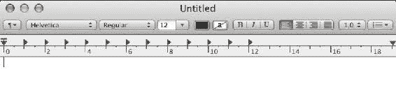

无论如何，让我们在文本编辑中编写一些代码。我们从 HTML 文档类型开始。发布这个，我们添加一个 HTML 的开始和结束标签，然后是`head`标签和里面的`title`标签。你很快就会意识到这是一个相当繁琐的过程，也就是说，用 TextEdit 编写代码。我们可以在这里编写代码，但是我们真的没有从中获得任何东西，没有语法突出显示，也没有任何其他帮助:

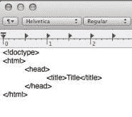

幸运的是，一个好的文本编辑器真的可以为你完成这项艰巨的工作。在这一章中，我们将看看这样一个文本编辑器，即崇高文本 3，以及它所具有的一些帮助您更好地编写 HTML 和 CSS 的优秀特性。首先，我们将查看代码片段，然后查看语法突出显示，接着是代码建议和多个游标。崇高的文本 3 是我选择的文本编辑器，因为它既快又容易使用。我喜欢的一件事是它让我编写代码变得多么容易和自然。

# 片段

在崇高文本 3 中，你只需要在你的 HTML 文件中输入`html:5`并点击*标签*键来获得你的 HTML 的基本样板。因此，我们必须在文本编辑中键入的所有代码都可以快速地为我们编写:

```html
<!DOCTYPE html> 
<html> 
<head> 
        <title></title> 
</head> 
<body> 

</body> 
</html> 
```

另一件事是，当您键入`div`并点击*选项卡*键时，您可以将`div`展开，并自动创建结束标记，光标位于开始和结束的`div`标记之间:

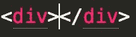

我们可以对任何 HTML 元素这样做；只需输入类似`p`的内容，点击*选项卡*，将光标置于两者之间:

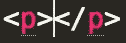

太美了！有这么简单的东西真好。

我们可以更进一步，安装 Emmet 包。我强烈鼓励你这样做。这将为您提供更好的代码片段。事实上，之前产生基本 HTML 样板的`html:5`代码片段，其实就是一个 Emmet 片段；它不是崇高的标准:

```html
<!DOCTYPE html> 
<html> 
<head> 
    <meta charset="UTF-8">     
    <title>Document</title> 
</head> 
<body> 

</body> 
</html> 
```

在崇高中安装基本上是插件的包的能力是它如此强大的另一个原因。有一个包裹，里面装着你需要的所有东西，这是威震没有的。假设您需要 ColdFusion 代码的语法高亮显示；有一个包可以帮你做到这一点。我有一篇文章在我的网站上，涵盖了软件包安装，这是相当简单。去[richfinelli.com/installing-sublime-package-manager/](http://www.richfinelli.com/installing-sublime-package-manager/)看看就知道了:


到目前为止，这是最好的包，你应该安装的第一件事是埃米特。对于埃米特，假设你进入你的 HTML，输入如下内容:

```html
div>ul>li*5>a{link$} 
```

这将扩展到以下内容:

```html
<div>
  <ul>
    <li><a href="">link1</a></li>
    <li><a href="">link2</a></li>
    <li><a href="">link3</a></li>
    <li><a href="">link4</a></li>
    <li><a href="">link5</a></li>
  </ul>
</div>
```

注意第一个`a`的`$`扩展为 1，第二个扩展为 2，以此类推，这可能非常有用。使用类似 CSS 选择器的语法快速编写 HTML 只是 Emmet 允许你做的好事之一。

# 多个光标

保留我们刚刚用埃米特扩展的`div`标签，让我们看看威震的多光标功能。由于我们有五个列表，我们可能需要在每个列表中键入相同的内容。如果您按住 *cmd* 键并单击单独的代码行，您实际上可以创建多个光标。如图所示，您现在可以在五个不同的位置键入相同的内容:

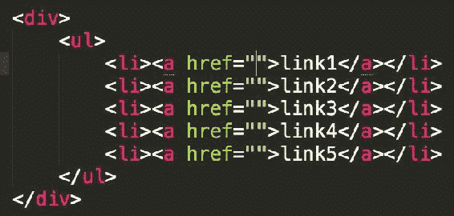

现在，假设您想要键入一些占位符文本，其中您将有多个光标。首先，键入“lorem5”，或“lorem”，后跟任何其他数字，您将获得许多占位符“lorem ipsum”文本:


然后，只需点击*选项卡*，它将自动扩展为 5 个单词的 lorem ipsum 文本，如下图所示:


# 语法突出显示

让我们暂时切换到我们的 CSS。另一个让我们的工作更容易的特性是语法高亮。请注意规则集都是如何遵循配色方案的。选择器是红色的，属性是蓝色的，值是紫色的。它们将开始嵌入你的潜意识:


崇高的文本为你做的是它巧妙地指出你的错误。我经常在需要冒号的地方键入分号。这将导致您的 CSS 不起作用。不过，语法高亮显示告诉我有些地方不对劲，因为如下图所示，配色方案发生了变化:


发现颜色差异很容易，但如果您不寻找，就很难看出冒号和分号之间的区别:

# 代码建议

有一些很酷的功能，比如代码完成和代码建议。所以如果你开始输入类似`border-`的东西，你会得到所有以`border`开头的不同属性:


在这种情况下，我正在寻找`border-radius`，所以我可以直接去那个建议，点击*标签*，它会自动为我完成任务:


我爱这个文本编辑器的原因还有很多，我就不赘述了。它的价格是 70 美元，但有无限的免费试用，你可以用它来决定你是否喜欢它——相信我，你会的。现在我不是说崇高是你唯一应该使用或尝试的文本编辑器。还有其他好的编辑器，如 Visual Studio Code、Atom、Adobe 括号等。如果你用的是其他东西，能完成我所说的大部分事情，而且对你有用，那就坚持下去。只需确保不要使用记事本或文本编辑来编写代码，因为这将是非常痛苦和徒劳的。

一个好的文本编辑器对于编写好的 HTML 和 CSS 是必不可少的，它会让我们的生活变得更加轻松。接下来，您将了解 CSS 重置，以及它们如何帮助我们为编写 CSS 创建一个非常好的起点。

# CSS 重置

在最后一节中，您了解了一个好的文本编辑器的力量。在本节中，我们将使用该文本编辑器来探索一种叫做 *CSS 重置*的东西。创建一个网站有很多需要准备好的部分，它们通常是你网站样板的一部分。我称这些碎片为“基础层”。这个*基础层*很大一部分是 CSS 重置。重置允许您消除与默认浏览器样式相关的浏览器不一致，并消除所有默认浏览器样式。它允许*你*使用 CSS 更容易地提供你的*手工风格。在本节中，我们将首先加载一个 CSS 重置，然后检查该重置，看看它在做什么。最后，我们将添加和定制重置以满足我们的需求。*

# 正在加载埃里克·迈耶的 CSS 重置

有一些不同的重置可供选择，但我已经被 CSS 大师埃里克·迈耶的重置所吸引。我们去 meyerweb.com/eric/tools/css/reset/抢吧:


因此，向下滚动一点，找到重置的顶部，然后突出显示所有代码，直到到达结束的大括号:


切换到崇高，打开你的样式表，并粘贴在那里:

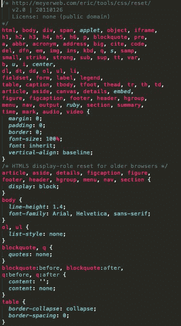

在我们保存这个之前，让我们为我们的站点打开`index.html`文件。您可以使用崇高来做的一件事是:如果您右键单击您的 HTML 文件，您可以选择在浏览器中打开，它将打开您的默认浏览器:


就我而言，是 Chrome。这就是没有重置的站点的样子:


正如您在下一张截图中看到的，我们添加的所有 CSS 实际上都删除了我们的一点样式。这就是为什么我们称之为重置。所有文本看起来都一样——没有边距，没有填充，什么都没有。

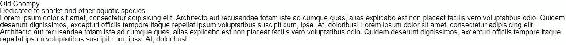

# 检查 CSS 重置

在我们的样式表的最顶端，有一个 CSS 评论认为埃里克·迈耶重置了。我们把它留在那里:

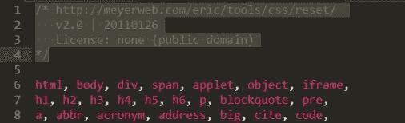

接下来，我们有大量的重置。这段庞大的代码隐约提醒了你在[第 1 章](01.html#K0RQ0-a72d261cc09f412988422c8a08f12cd5)、 *CSS Foundations* 中学到的规则集。它实际上只是一个带有很长选择器的规则集。选择器中几乎每个 HTML 元素都用逗号隔开:

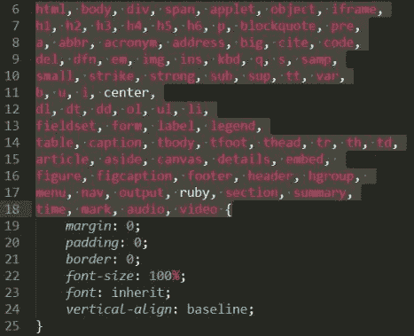

这意味着所有这些元素都将从声明块接收相同的样式:

```html
... {
  margin: 0; 
  padding: 0; 
  border: 0; 
  font-size: 100%; 
  font: inherit; 
  vertical-align: baseline; 
}
```

如您所见，在该声明块的前三个声明中，`margin`、`padding`和`border`被设置为`0`。使用`0`的值和使用`0px`一样，只是少了两个字符。如果该值为零，则不需要指定像素。这将从所有元素中移除默认边距、填充和边框。在这些声明的正下方，我们有`font-size`属性，即`100%`。这一行是将所有字体设为浏览器默认的说明，基本意思是`16px`，因为大多数桌面浏览器的默认浏览器字体大小是`16px`。

在这个声明块下面，我们有新的 HTML5 元素，我们将它们的显示设置为阻止。这使得一些无法识别这些新元素的旧浏览器现在可以将其视为块级元素。这允许 HTML5 在一些旧的浏览器中工作:

```html
/* HTML5 display-role reset for older browsers */ 
article, aside, details, figcaption, figure,  
footer, header, hgroup, menu, nav, section { 
    display: block; 
} 
```

接下来，我们有一个新的选择器和声明，将`line-height`设置为`1`:

```html
body { 
  line-height: 1; 
} 
```

`line-height`属性向下级联，这意味着如果我们将其设置在一个元素上，例如`body`，它将向下继承到它包含的所有其他元素。`1`的值是无单位值，所以`1`将等于字体的大小。`1.2`的值是字体大小的 1.2 倍。所以如果`font-size`是`16px``line-height`是`1`，那么`line-height`就相当于`16px`。如果`line-height`设置为`2`，你的字体大小为`16px`，那么`line-height`将等同于`32px`。

样式表中的下一步是有序和无序列表，我们从`ul`、`ol`和级联方式`li`中删除了项目符号和数字:

```html
ol, ul { 
    list-style: none; 
} 
```

在这下面，您将看到复位已经为`blockquote`和`q`元素设置了一些默认值。我发现自己很少使用块引号，而且这个重置有点长，所以通常我会删除重置的这一部分。但如果你发现自己经常使用这些元素，那就把它留在那里:

```html
blockquote, q { 
    quotes: none; 
} 
blockquote:before, blockquote:after, 
q:before, q:after { 
    content: ''; 
    content: none; 
} 
```

接下来，我们有 2 个`table`属性被重置:`border-collapse`和`border-spacing`:我从来没有深入挖掘过，但最终处理了一些细微的表格不一致，这在任何现代桌面浏览器中都不会看到。

```html
table { 
    border-collapse: collapse; 
    border-spacing: 0; 
} 
```

这几乎是 CSS 重置的解剖结构。这个重置应该是让你开始的 CSS 基础层的一部分。我们现在来看看如何添加和定制它。

# 自定义 CSS 重置

让我们更新`body`元素上的`line-height`和`font-family`属性，这将建立所谓的“垂直节奏”，并使`Arial`成为所有元素的默认`font-family`:

```html
body { 
    line-height: 1.4; 
    font-family: Arial, Helvetica, sans-serif; 
} 
```

然后，您将看到它如何影响文本，主要是在文本的行与行之间添加一些垂直空间:


尽早建立这些默认值是好事；这样，您就不必在整个 CSS 中为每个元素反复描述`line-height`和`font-family`。请注意，并非所有属性都像`font-family`和`line-height`一样，由子元素继承；只有某些属性具有这种效果，主要是文本级属性的行为是这样的。在这种情况下，我们在`body`元素上设置那些属性，但是它们级联到`h1`、`h2`和我们的`p`，给它们所有`1.4`的`Arial` `font`和`line-height`。

我想在我们的重置中增加几个规则集。让我们在重置底部腾出一些空间。我想添加的第一个是`clearfix`，如下一段代码所示。我现在不打算进入`clearfix`。我将在[第 3 章](03.html#1LCVG0-a72d261cc09f412988422c8a08f12cd5)、*中深入解释使用浮动*创建页面布局。这个默认值对于清除浮动非常有帮助；我们需要它:

```html
/* micro clear fix */ 
.grouping:before, 
.grouping:after { 
    content: " "; 
    display: table;  
} 
.grouping:after { 
    clear: both;  
} 
```

接下来我们要做的是为媒体元素设置`max-width`，以确保媒体的响应性。我将在[第 6 章](06.html#3UQQQ0-a72d261cc09f412988422c8a08f12cd5)、*变得有反应*中进一步讨论:

```html
img, iframe, video, object { 
  max-width: 100%;  
} 
```

最后，我想取消重置我们的`strong`和`b`元素，并确保它们*确实有一个`bold`的`font-weight`:*

```html
strong, b { 
    font-weight: bold;  
} 
```

这就是重置。现在，跳到我们的 HTML，我想详细说明我们的基础层中没有重置的两个部分:

```html
<!doctype html> 
<html lang="en"> 
<head> 
    <meta charset="UTF-8"> 
    <meta http-equiv="X-UA-Compatible" content="IE=edge,chrome=1"> 

<!-- description --> 
    <title>Section 2-Ramping Up - Mastering CSS</title> 

<!-- stylesheets --> 
    <link rel="stylesheet" href="css/style.css"> 

<!-- stylesheets for older browsers -->       
    <!-- ie6/7 micro clearfix --> 
    <!--[if lte IE 7]> 
        <style> 
        .grouping { 
            *zoom: 1; 
        } 
        </style> 
    <![endif]--> 
    <!--[if IE]> 
        <script   src="http://html5shiv.googlecode.com/svn/trunk/html5.js"></script> 
    <![endif]--> 
</head> 
```

首先，我们有一个处理`IE 7`的`clearfix`，如下代码所示。你不需要确切知道这是在做什么，但你可能想知道这让`clearfix`在 IE7 工作。如果您不支持旧版本的 IE，您可以省略这一部分。再次，我们将在[第 3 章](03.html#1LCVG0-a72d261cc09f412988422c8a08f12cd5)、*中详细了解`clearfix`使用浮动*创建页面布局:

```html
<!-- stylesheets for older browsers -->       
    <!-- ie6/7 micro clearfix --> 
    <!--[if lte IE 7]> 
        <style> 
        .grouping { 
            *zoom: 1; 
        } 
        </style> 
    <![endif]--> 
    <!--[if IE]> 
        <script 
         src="http://html5shiv.googlecode.com/svn/trunk/
         html5.js"></script> 
    <![endif]--> 
```

如果我们放大这些代码，它恰好是一个嵌入的样式表。您可以看到有一个打开和关闭`style`标签，中间有一个规则集:

```html
<style> 
  .grouping { 
    *zoom: 1; 
  } 
</style> 
```

在嵌入的样式表之外，开始的`style`标记之前的行是所谓的`IE`条件注释，它这样写道:“如果小于或等于`IE 7`，请参见下面的规则。”

```html
<!--[if lte IE 7]> 
```

在规则集的下面，我们有一个`script`指向 HTML5 Shiv 库，这使得旧版本的 IE 理解了新的 HTML5 元素:

```html
<!--[if IE]> 
    <script 
     src="http://html5shiv.googlecode.com/svn/trunk/
     html5.js"></script> 
<![endif]--> 
```

这也是 IE 条件评论的一部分，但它针对的是 IE 的所有版本。其实 IE 10 及更高版本已经不支持 IE 条件评论了，所以这个脚本只支持 IE9 及更低版本；然而，它确保了我们的 HTML5 元素在旧浏览器中得到支持。同样，如果您不支持这些较旧的浏览器，也可以忽略它。

在这一节中，我们剖析了我们的 CSS 重置以及如何让您的基础层为编写代码做好准备。现在，让我们来看看 *Chrome DevTools* 部分。

# Chrome DevTools(铬 DevTools)

到目前为止，我们所做的大多数 CSS 都相当简单。我们第一次尝试时所做的一切都很成功，但这种情况并不总是发生。通常，CSS 不起作用，我会想我错过了什么。我的编辑器中的语法高亮显示虽然有帮助，但并不能阻止我忽略错误。通常，这是一个微小的错误，导致一些事情无法工作，很难找到错误并修复它。在本节中，我们将简单地看看如何打开开发工具。然后，我们将在检查器中修改一些 CSS，最后查看控制台以查找错误。

# 如何打开开发人员工具

要打开 Chrome 的 DevTools，你所需要做的就是右击或者 *Ctrl* +点击页面的任何部分。您将获得一个上下文菜单，如下图所示。当您选择“检查元素”选项时，您将获得一个全新的技术领域:

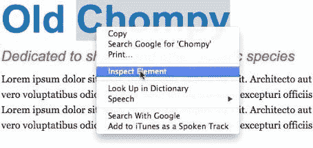

通常情况下，开发工具会占据屏幕的下半部分。正如您在下面的截图中看到的，在左侧，您的 HTML 由浏览器呈现，在技术上称为 DOM。在右手边，你将拥有你所有的风格:

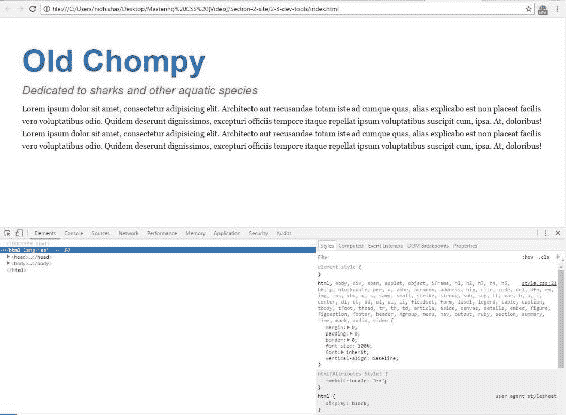

如果您将鼠标悬停在左侧的某个东西上，它会在顶部突出显示。因此，如果您将鼠标悬停在`h2`上或点击它，它会高亮显示，如下图所示:

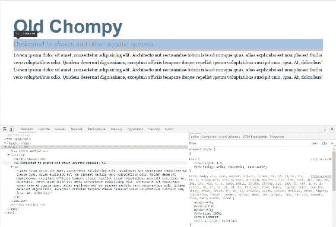

如果您将鼠标悬停在`<section>`上或点击它，它会在顶部突出显示:

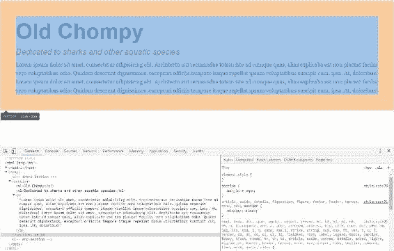

# 在检查器中更改 CSS

在检查器的右侧，您将看到您在 DOM 中高亮显示的任何元素的所有样式。您甚至可以单击这些属性或值中的任何一个并更改它们。所以如果点击`font-size`旁边的`26px`，可以增加到你想要的。这将在浏览器中立即更新，这非常酷:


您甚至可以取消选中某些属性，并立即看到这些更改。所以，正如你在下一张截图中看到的，如果你点击 DOM 中的`h2`元素，然后取消选中右侧的颜色和边距底部，对 h2 元素的这一更改会立即生效。只需重新检查即可将其添加回来:

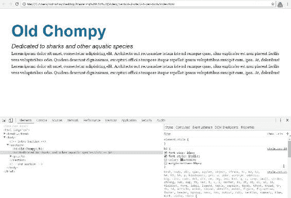

如果你点击最后一个元素，在这种情况下，点击`margin-bottom`并点击*选项卡*，它将允许你输入一个新的属性和值。所以加上`-40px`的`margin-left`，看看是什么样子；这会将`h2`移到`40px`的左侧:

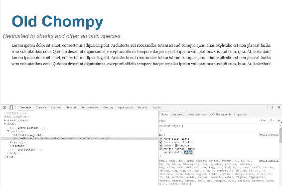

现在这些都不是永久的变化。浏览器一刷新，这些样式就会消失；但是，如果您想保留我们正在试验的这些更改，您可以复制这个规则集并将其粘贴到您的代码中。它甚至告诉我们这个规则集当前在样式表第 86 行的什么位置。如果您将鼠标悬停在上面，它会告诉您该文件在网站文件夹中的确切位置:


# 使用控制台查找错误

说到你能用 Chrome DevTools 做什么，我们目前只是看到了冰山一角。例如，有时添加图像可能很棘手。因此，让我们通过将下面的图像标签输入到我们的 HTML 中来添加到页面中，在`h2`上方:

```html
 
```

如果我们保存这个并刷新网站，我们会看到图像没有出现，所以有问题。刷新页面后，一个红色的错误图标会显示在开发工具中。如下图所示，出现了一个错误:

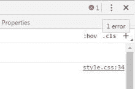

要查看错误，请单击控制台选项卡。你会看到`sharkey.png`文件找不到了:

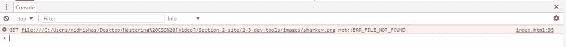

这是很好的信息。它告诉你这不是一个与权限相关的问题。不是 403；它只是在这个位置找不到它要找的文件。所以我会做的一件事是打开我的`images`文件夹，并确保图像在文件夹中，在这种情况下，假设它在文件夹中。不过，只有一个问题。它要查找的文件拼写不同:

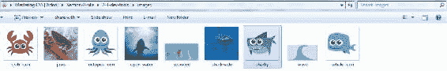

它在找`sharkey`，S-H-A-R-K-E-Y，文件实际上只是 S-H-A-R-K-Y，这样就足够容易修复了。现在，您知道问题出在哪里了，您可以在您的 HTML 中更改名称:

```html
 
```

如果您在保存后刷新浏览器，将会显示以下图像:

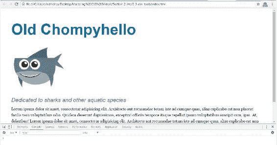

因此，元素检查器和控制台这两样东西在代码实验和代码故障排除中非常有用。我最大的建议是，如果在你的 HTML、CSS 和 JavaScript 中，事情没有像你期望的那样运行，打开开发工具，在幕后看一看。很有可能一整天，你都会打开开发工具。我还应该补充一点，火狐、Safari 和 IE 都有 DevTools，它们都执行类似的任务，在这些浏览器中对故障排除同样有用。我们几乎没有触及开发人员工具能做什么的表面。更多信息，请查看我关于使用 Chrome 开发工具对 HTML 和 CSS 进行故障排除的博客文章；在[www.richfinelli.com/troubleshooting-html-and-css](http://www.richfinelli.com/troubleshooting-html-and-css)有售。

它解释了如何创建新的选择器，以及如何访问计算值而不是声明值，这在调试 CSS 规则和确定哪些规则优先时很好。它还会引导您进入设备仿真模式，其中包括:

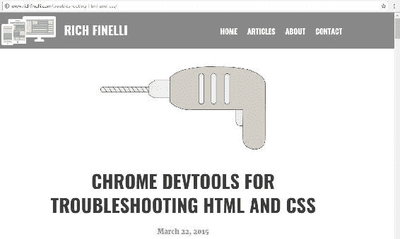

现在你知道如何使用 Chrome DevTools 了，它是你排除 HTML 和 CSS 故障的王牌。接下来，您将学习如何重命名元素，这是 CSS 真正发挥强大功能的地方。

# 重命名元素—类和标识

重命名元素是 CSS 如此强大的功能。让我为你安排一下。到目前为止，CSS 一直很好，因为我们能够保持事物的一致性。例如，所有标题 1 都是蓝色的，字体大小为 20 像素，但是如果你想让你的`h1`看起来不一样呢？这就是重命名和分类元素真正变得有用的地方。在本节中，您将学习如何基于类和标识来重命名元素和设置元素的样式。我们将在我们的鲨鱼网站上看看这将如何获得回报，首先是课程，然后是身份证。

# 班级

看`index.html`文件。你可以看到整个页面有几个 HTML5 `<section>`标签:一个在初始部分，一个在辅助部分，一个在替换部分，三个一起组成。其中之一如下所示:


在第二个`<section>`中，有三个`div`标签，每个标签包含一个`img`、`h2`、`p`和一个`a`标签。所以这个 HTML 没有什么花哨的。最后一节看起来很像第一节；它只有`h1`和`h2`元素和几个段落。然而，这是一个难题:我们希望页面底部的`h1`不同于网站的主要`h1`元素。解决方案是基于这个类添加一个类和一个样式。因此，在可选部分的`h1`元素内部，我们将添加类属性。我们将键入`class=""`并输入我们认为合适的任何名称或缩写:

```html
<h1 class="">Feeding Frenzy</h1> 
```

我现在告诉你，编程和计算机科学中最难的工作是命名事物。这个名字应该足够有意义，这样如果另一个人碰到你的代码，并从你离开的地方捡起来，他们就不会完全丢失。所以，在我们的例子中，我们将使用`alt-headline`。类是区分大小写的，所以我建议您使用小写字母，并用破折号分隔单词，这是 CSS 中常见的命名约定。如果您使用一个空间，它将被视为两个类，这真的不是我们想要做的:

```html
<h1 class="alt-headline">Feeding Frenzy</h1> 
```

所以我们将保存我们的 HTML 并跳转到我们的 CSS。

在`h1`下面，我们将添加我们的类名，前面加一个句点作为我们的选择器。键入`.alt-headline`并添加 40px 的字体大小:

```html
h1 { 
  font-size: 70px; 
  line-height:1.4; 
  font-weight: bold; 
  color: #0072ae; 
} 
.alt-headline { 
  font-size: 40px; 
} 
```

在我们保存这个之前，我们将使这个 CSS 窗口变小，这样我们就可以看到我们的站点与我们的代码相邻。在你的网站上向下滚动到`h1`，你会在左侧的预览中看到当前是`70px`:

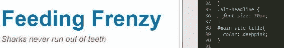

保存 CSS 时，`h1`变为`40px`:


我把这个新的规则集放在原来的`h1`规则集下面，你可能会认为因为它排在第二，所以它覆盖了上面的规则集。实际上这不是这里发生的事情。即使我把这个规则设置在`h1`以上，它仍然是`40px`。这是因为当用作选择器时，类比元素具有更大的权重:

```html
.alt-headline { 
  font-size: 40px; 
} 
h1 { 
  font-size: 70px; 
  line-height:1.4; 
  font-weight: bold; 
  color: #0072ae; 
} 
```

以下是前面代码的输出:


为了更好地衡量，让我们将`alt-headline`规则设置在原始`h1`选择器的下方。

# 对多个元素进行分类

类也用于对多个元素进行分类。如果你想改变中间部分的`h2`标签，使其与页面上其他地方的`h2`标签相似但不同，使用类将是完美的选择。让我们进入我们的 HTML，给`secondary-section`中的所有`div`标签添加一个类，并将其称为`column-title`。转到`The Octopus`、`The Crab`和`The Whale`标题，使用威震漂亮的多光标浏览器功能为每个标题添加`class="column-title"`。例如，`The Octopus`标题应该是这样的:

```html
<h2 class="column-title">The Octopus</h2> 
```

然后，我们转到我们的 CSS，在`h2`下面添加`.column-title`。然后我们将添加一些属性和值。增加`font-style`为`normal`；你想摆脱`italic`。我们的颜色是蓝色，`#0072ae`，我们将使`font-weight`加粗:

```html
.column-title { 
  font-style: normal; 
  color: #0072ae; 
  font-weight: bold; 
} 
```

保存这个，转到浏览器，你会看到现在每个图像下面的`h2`标签和你在网站上其他地方的其他`h2`标签是不同的:


网站底部和顶部的`h2`标签仍然是红色和斜体:


类对于命名和分类您希望看起来相同的相同元素的组非常有用。接下来，让我们使用一个标识来重命名一个元素。

# 本能冲动

向上滚动到我们的网站顶部，在我们的 HTML 中，转到`h1`:


我们先给第一个`h1`标签一个特殊的 ID，叫做`main-site-title`:

```html
<h1 id="main-site-title">Old Chompy</h1> 
```

有了 ID，你也可以在引号内使用任何你想要的名字，只要它有意义。切换到 CSS 并向下滚动到我们的`alt-headline`类的正下方。这就是我们要添加`main-site-title`的地方。编写类和 id 的主要区别是，我们用句点开始类，用数字符号或磅符号或 hashtag 开始 id(不管你想叫它什么):

```html
#main-site-title 
```

在这种情况下，我们会说颜色不同:`deep pink`。保存并刷新网站以查看效果:

```html
#main-site-title{ 
  color: deeppink; 
} 
```

以下是前面代码的输出:


你可以看到这只是改变了旧的 Chompy `h1`，一个有 ID 的。

# 我们应该使用类还是 id？

现在，你可能在想，类和 ID 有什么区别？嗯，首先要说明的一点是，一个 ID 比一个类有更多的权重，确切地说是 10 倍的权重。保持选择器的轻量级是可伸缩、可重用 CSS 的关键之一。体重增加到底意味着什么？这意味着它更具体，一个标识将否决任何类。我们将在[第 4 章](04.html#24L8G0-a72d261cc09f412988422c8a08f12cd5)、*用模块化的、可重用的 CSS 类创建按钮，以及 CSS3* 中深入探讨特定性规则和权重。现在，只要知道当以同一个元素为目标时，标识会否决类。第二点要说明的是，ID 是唯一的，因此，每页只能使用一次。鉴于这两点，主要是第一点，作为一个编码标准，我很少使用标识来进行样式化，因为类几乎总是绰绰有余的。

用一个简单的类重命名元素是如此令人难以置信的强大，并且可能是所有 CSS 中最有用的东西。虽然给类命名有时很棘手，但让名字具有语义或意义是很重要的。例如，如果你正在给你的博客文章容器命名，可以把它命名为“博客文章容器”，因为这完美地描述了它是什么。id 虽然有时间和地点，但不如类有用。在大多数情况下，最好只使用一个类来保持你的低特异性。在下一节中，您将了解我们如何使用后代选择器通过元素的上下文来定位元素。

# 后代选择器

正如您在上一节中学习的那样，用类重命名元素是 CSS 中一个极其强大的特性。然而，这不是针对特定类型元素的唯一方法。后代选择器将允许您基于它们的祖先元素来定位页面上的元素。这通常是必要的，因为您只想根据元素的上下文应用边距或新字体。您可以使用后代选择器来获取该上下文，而无需每次想要定位某个元素时都在该元素上放置一个类。我将首先解释什么是父元素、兄弟元素和子元素，以及什么是祖先元素和后代元素。如果我们想使用后代选择器，我们需要清楚这些。我们将通过使用后代选择器的一个实际例子来跟进，并通过计算后代选择器的权重来结束。

# 父元素、子元素和同级元素

让我们转到我们的 HTML，看一看`secondary-section`中这个很好嵌套的 HTML 代码。所以基本上，我们这里有一个`section`标签和三个`div`标签，它们在这个部分里面:

```html
<section>
  <div>
    <figure>
      
    </figure>
    <h2 class="column-title">The Octopus</h2>
    <p>Lorem ipsum dolor...</p>
    <a href="#" class="button">Tenticals</a>
  </div>
  <div>
    <figure>
      
    </figure>
    <h2 class="column-title">The Crab</h2>
    <p>Lorem ipsum dolor...</p>
    <a href="#" class="button">Crabby</a>
  </div>
  <div>
    <figure>
      
    </figure>
    <h2 class="column-title">The Whale</h2>
    <p>Lorem ipsum dolor...</p>
    <a href="#" class="button">Stuart</a>
  </div>
</section>
```

所以`<div>`是`<section>`的子元素，`<section>`是父元素。换句话说，`<div>`是`<section>`的后代，`<section>`是`<div>`的祖先。`<figure>`也是`<section>`的后裔，``是`<section>`的后裔。注意`<figure>`、`<h2>`、`<p>`在 HTML 的同一层级，所以是姐弟，也都是`<section>`的后代。这就够复杂的了。没有叔叔，没有阿姨，也没有第三个堂兄弟。

# 创建后代选择器

在上一节*重命名元素–类和标识*中，我们向所有`<h2>`添加了一个类，因为我们知道我们的 HTML 的`secondary-section`中的`<h2>`标签不同于所有其他`<h2>`标签。因此，我们可能希望这一领域的其他元素也有所不同。以下是我们如何做到最好的方法。与其把类放在`<h2>`标签上，不如把它放在`section`标签上，并从那里使用后代选择器。让我们去掉所有`<h2>`标签中的`class="column-title"`。在`section`元素上，我们增加一个新的类，即`secondary-section`:

```html
<section class="secondary-section">
  <div>
    <figure>
      
    </figure>
    <h2>The Octopus</h2>
    <p>Lorem ipsum dolor...</p>
    <a href="#" class="button">Tenticals</a>
  </div>
  <div>
    <figure>
      
    </figure>
    <h2>The Crab</h2>
    <p>Lorem ipsum dolor...</p>
    <a href="#" class="button">Crabby</a>
  </div>
  <div>
    <figure>
      
    </figure>
    <h2>The Whale</h2>
    <p>Lorem ipsum dolor...</p>
    <a href="#" class="button">Stuart</a>
  </div>
</section>
```

保存这个，你会看到`<h2>`标签失去了它们的蓝色粗体，因为在 CSS 中，我们仍然瞄准不再存在的`.column-title`类:


所以现在我要做的是进入 CSS，找到`.column-title`类，更新它:

```html
.secondary-section h2 {
  font-style: normal;
  color: #eb2428;
  margin-bottom: 10px;
}
```

这是我们的后代选择器。如果我们保存并刷新，我们会看到它将那些`<h2>`标签更改回我们想要的蓝色、粗体和非斜体`font-style`:

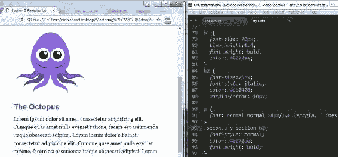

所以下面 CSS 中显示的这个`.secondary-section`选择器是一个后代选择器。它的目标是所有在 T2 的 T1:

```html
.secondary-section h2 { 
  font-style: normal; 
  color: #0072ae; 
  font-weight: bold; 
} 
```

如果我们回看一下 HTML，你会看到`h2`确实在`secondary-section`里面:

```html
<section class="secondary-section"> 
    <div> 
        <figure> 
             
        </figure> 
        <h2>The Octopus</h2> 
```

现在我们可以更进一步了。进入 CSS，在我们现有的`.secondary-section h2`规则集下面，输入`.secondary-section p`。这将针对我们的段落里面的`secondary-section`。所以添加深粉色，保存并刷新，你会看到现在我们所有的段落都是粉色的:

```html
.secondary-section p { 
  color: deeppink; 
} 
```

看起来是这样的:

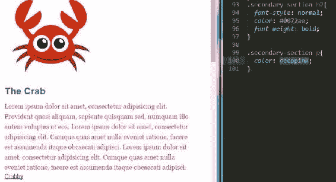

我们也可以通过我们的`image`标签做到这一点。如果你回顾一下 HTML，我们的`image`标签在`div`标签里面，而这个标签在`figure`标签里面:

```html
<section class="secondary-section"> 
    <div> 
        <figure> 
             
        </figure> 
```

切换回我们的 CSS，我们可以输入选择器`.secondary-section div figure img`，然后我们添加一个纯色的`10px`边框，这个灰色的颜色:

```html
.secondary-section div figure img { 
  border: 10px solid #333; 
} 
```

以下是前面代码的输出:

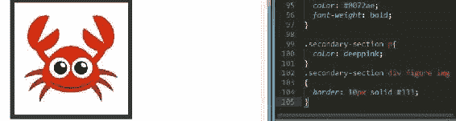

虽然我们可以看到这是可行的，并且我们在网站上的图像周围有一个灰色边框，但是我们比我们的选择器需要的更加具体。没有了`div`和`figure`，我们只需要输入`img`就可以了，边界依然存在:

```html
.secondary-section img { 
   border: 10px solid #333; 
} 
```

像这样使用很长的选择器还有另一个问题。以下选择器更有分量，可以否决您可能不希望它采用的其他样式:

```html
.secondary-section div figure img { 
   border: 10px solid #333; 
} 
```

这不利于保持代码的轻量级。专一是我很想强调的；不要过度使用很长的选择器。事实上，根据经验，深度尽量不要超过三级；当然，这条规则也有例外，但是在编写 CSS 时，请尽量记住它。这是因为有一种精确的科学方法来计算 CSS 选择器的权重，我将在后面的章节中讨论。我想至少现在介绍一下，这样我们就可以开始熟悉它了。

# 计算选择器的权重

一节课值 10 分，所以`.secondary-section`值 10 分。一个普通的老元素，比如`p`或者`div`值 1 分。因此`.secondary-section p`选择器为 11 分。`.secondary-section div figure img`选秀权是 13 分。让我们在价值 13 分的选择器下面创建另一个选择器，我们有`.secondary-section img`。然后，让我们将`border-color`更改为`blue`:

```html
.secondary-section div figure img { 
   border: 10px solid #333; 
} 
.secondary-section img { 
 border: 10px solid blue; 
}
```

当我们保存这个时，我们的边框将保持灰色，因为我们最后一个选择器的点值只有 11；它被先前选择器的点值 13 击败了。这就是这些长的后代选择器的问题，它们比应该的要长，它们变得更重:


以下是前面代码的输出:

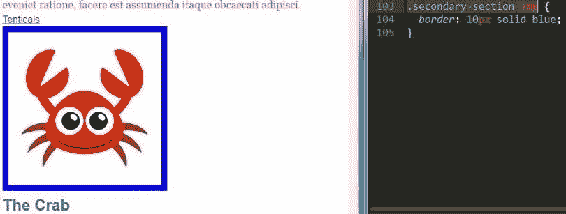

IDs 的积分值为 100 分，这就是为什么我建议不要使用它们。他们有这么多不必要的重量，并推动特异性水平通过屋顶。分配点值听起来有点像在电子游戏中记分，但不同的是你想在这个游戏中尽可能地保持你的点值。如果你这样做，你将能够写不那么复杂的 CSS。

# 不列颠帝国勋章

保持低特异性的一种技术是完全避免后代选择器使用 *BEM* 。BEM 代表*块元素修改器*，是 CSS 的命名约定。这个想法是使用一个特定的命名约定来给你最终要设计的每个元素添加一个类。这样每个元素都有 10 的特异性分数，因此每个元素都有相同的特异性。除此之外还有很多，我推荐你去[http://getbem.com/](http://getbem.com/)看看，了解更多。我倾向于使用边界元方法，但这并不是说后代选择器需要完全避免。我想他们有时间和地点。我的建议是保持你的后代选择器的合理性，避免超过 3 级的后代选择器。

# 摘要

在本章中，您了解了一个好的文本编辑器的特性，讨论了 CSS 重置，探索了 Chrome 的 DevTools 的故障排除能力，并学习了如何用类重命名元素。在本章的最后一节，您学习了后代选择器。

下一章是关于使用浮点创建多列层，并了解浮点导致的问题的解决方案。