# 创建带有浮动的页面布局

为了创建所有浏览器都支持的多列布局，我们将使用浮点数。乍一看，浮动非常简单，但有一些不直观的怪癖，当不完全理解时，会导致一些挫折。这可能是因为浮动的真正起源不是为了布局，而是为了实现常见的杂志技术，文本可以很容易地围绕图像流动。所以在这一章中，我们将深入研究浮点数。我们将讨论 float 的基本用法，并通过创建一个带有 float 的布局来跟进(并在后面的部分中解决由 float 引起的麻烦)

# 浮动介绍–图像周围的流动文本

让我们从介绍浮动开始这一章。我们将讨论浮动的最初目的，接下来是它们引起的基本问题，以及如何清除浮动之后的元素。在这一部分，我们还将开始一个关于鲨鱼电影的新的 HTML 页面，您可以在书籍下载包中找到。

# 鲨鱼电影页面

这里我们有一个新的关于鲨鱼电影的网页。如果你看这个页面，你会看到一个图片在标题上面，在一些文字上面，在一个链接上面；当您向下滚动时，您会看到三部电影中的每一部都有三个类似的部分:


超文本标记语言相当简单。分为三个部分，每个部分都有一个`div`标签，标签的类别为`wrapper`，这是内容的中心。在`wrapper`类中，有一个锚标签，里面有一个图像。锚标签下面是一个包含标题和一些段落文本的`h1`标签。接下来是一个锚点标签，这是了解更多信息的链接。这是第一部分的截图:

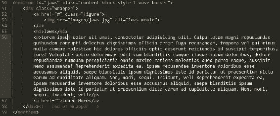

# 浮动的最初目的

让我们看看最终的项目，如下图所示。我们希望将图像向左浮动，让标题和文本围绕它流动:


让我们以 CSS 中的图像为目标。我们不在选择器中定位图像，而是实际定位图像的容器，这是一个类为`figure`的锚标签:

```html
<a href="#" class="figure"> 
```

我不想仅仅将`.figure`类作为我的选择器，因为我可能会在其他图像容器上使用这个类，并且可能不希望它们都是浮动的。因此，让我们使用基于其父代的后代选择器。它的父级在该部分的顶部，`section`标签有多个类:`content-block`、`style-1`和`wave-border`:

```html
<section id="jaws" class="content-block style-1 wave-border"> 
```

这是一种模块化方法，我们将在下一节中详细介绍。我们要找的主类是`content-block`。`style-1`和`style-2`类仅控制两种不同的配色方案，`wave-border`将波浪的重复背景图像添加到第一部分的顶部。最后，在我们的 CSS 中，我们的选择器将是`.content-block .figure`，所以我们的目标是在一个类为`content-block`的元素中有类为`figure`的任何元素:

```html
.content-block .figure { 
  margin: 30px; 
} 
```

所以我们将在这个规则集中的`margin`属性下输入的是`float: left`:

```html
.content-block .figure { 
  margin: 30px; 
 float: left 
} 
```

当我们刷新页面时，我们看到一切都按计划进行了。这几乎太简单了。我们几乎完全实现了我们在所有三个部分中设定的目标:


让我们在 CSS 中为`h1`和`p`添加一个背景色，看看这里发生了什么。我们只需通过`content-block`给`h1`一个`deeppink`的背景色和一个`green`的背景色:

```html
.content-block h1 { 
  color: #fff; 
  background-color: deeppink; 
} 
.content-block p { 
  font-family: Georgia, 'Times New Roman' sans-serif; 
  background-color: green; 
} 
```

以下是前面代码块的输出:

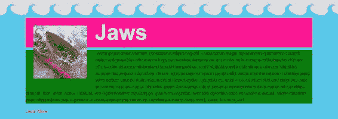

请注意图像后面的背景。文本向右流动，但元素本身不再将浮动元素(图像)视为正常流动的一部分。当浮动元素的显示属性受到影响时，浮动元素本身也会发生变化。例如，浮动的锚点标签，或者真正具有类`figure`的锚点，开始像块级元素一样工作。它现在将响应宽度和边距的顶部和底部；正如我们所看到的，它已经对边际底部做出了反应。然而，这并不一定会迫使一个新的行。让我们将它向右浮动，它应该会有非常相似的效果:

```html
.content-block .figure { 
  margin: 30px; 
  float: right; 
} 
```

以下是前面代码块的输出:


# 使用 clear 属性解决浮点运算的基本问题

我们可以使用`clear`属性来阻止浮动元素下的元素行为不良。例如，让我们在段落中添加`clear`属性。我们将添加`clear: both`，清除左右浮动元素:

```html
.content-block p { 
  font-family: Georgia, 'Times New Roman' sans-serif; 
  background-color: green; 
  clear: both; 
} 
```

现在，当您刷新时，您将看到浮动元素下面的段落文本:


我们可以对`h1`做同样的事情，如下所示:

```html
.content-block .figure { 
  margin: 30px; 
  float: right; 
} 
.content-block h1 { 
  color: #fff; 
  background-color: deeppink; 
 clear: right; 
} 
```

我们也可以只说`clear: right`，因为它上面规则集中的浮动是向右浮动的。

保存 CSS 并查看网站后，您会看到它是有效的。`h1`标签也位于`.figure`下方:

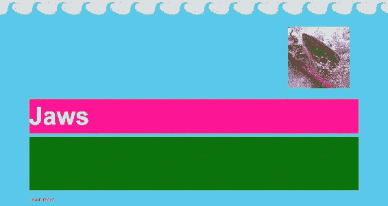

但是，如果您在您的`h1`规则集中键入`clear: left`，它不一定会起作用，因为这里没有剩余的浮动元素:

```html
.content-block h1 { 
  color: #fff; 
  background-color: deeppink; 
  clear: left; 
} 
```

以下是前面代码块的输出:


这里，`None`是`float`和`clear`的默认值。因此，我们可以在这两个上面说`clear: none`，它将回到我们添加`clear`属性之前的状态:

```html
.content-block h1 { 
  color: #fff; 
  background-color: deeppink; 
  clear: none; 
} 
.content-block p { 
  font-family: Georgia, 'Times New Roman' sans-serif; 
  background-color: green; 
  clear: none; 
} 
```

以下是前面代码块的输出:

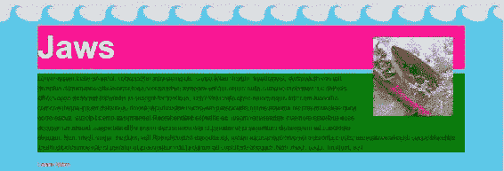

但是，由于`clear: none`是默认值，您可以从这两个选择器中去掉整个属性；这将对网站产生同样的影响。我几乎从不使用清晰的左和清晰的右；`both`值似乎在大多数时候都绰绰有余。

在本节中，我们已经看到了浮动元素的传统用法，以及浮动元素下面的元素如何围绕浮动元素流动。这可以使用`clear`属性停止。这项技术很有用，但老实说，浮点运算对于构建多列布局更有用。我们现在来看看。

# 创建多列布局

浮动被设计成在图像周围流动文本。然而，浮点运算也是构建多列布局的最常见方式。在本节中，我们将了解如何将元素相互浮动以创建页面布局。

所以，我们目前在二级部分的 HTML 中有三个`div`标签，类别为`column`:


下面的截图展示了最终的网站。这就是我们的目标。我们需要三个相等的列，中间有一个小的装订线或边距:

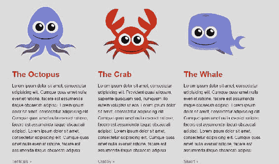

在我们当前的站点中，列一个叠一个。现在，我们有简单的行，所以我们想用浮点来解决这个问题。在我们的最终站点中，我们希望所有内容都位于页面的中间，但是现在，我们所有的内容都从浏览器窗口的一边移到了浏览器窗口的另一边:


让我们通过将`div`标签居中来解决这个问题。

# 元素居中

我们真正需要做的是将整个内容包装在一个`div`标签中；让我们开始吧。进入 HTML 文件。在开始`section`标签下面的行中，添加`<div class="wrapper">`。就在关闭`section`标签之前，用`</div>`关闭它:

```html
<section class="secondary-section"> 
    <div class="wrapper">
        <div>...</div>
        <div>...</div>
        <div>...</div>
    </div> 
</section>
```

现在，切换到 CSS 文件。`.wrapper`标签将会是一个更加可重用的类。为了使任何元素居中，我们会给它一个边距，并使用双值语法:顶部和底部将为零，左侧和右侧将自动。我们还得给它一个`960px`的宽度。如果没有宽度，您真的无法使用这种边距技术将其居中:

```html
.wrapper { 
  margin: 0 auto; 
  width: 960px; 
} 
```

在那里，我们有它；所有的内容现在都应该在这个包装内居中:

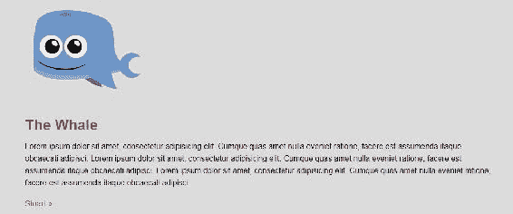

`wrapper`类，就像我说的，很好，可以重复使用。我将在我想要集中元素集合的网站上的任何地方使用`wrapper`类。

# 浮动列

所以，回到我们这里的业务顺序:在我们的主页上浮动三列。为此，我想给每个`div`标签一个我们可以样式化的`column`类。因此，在 HTML 中，让我们转到第二部分中的每个`div`标签，并使用崇高文本的漂亮的多光标功能一次性将`class="column"`添加到所有三个标签中:

```html
<section class="secondary-section"> 
    <div class="wrapper">
        <div class="column">...</div>
        <div class="column">...</div>
        <div class="column">...</div>
    </div> 
</section>
```

在我的 CSS 中，我做了一个很大的评论，指出了我的 CSS 中这三个专栏的这一部分，我鼓励你也这样做。

在此评论下，我们将针对`.column`并应用`float: left`。宽度为`320px`。

```html
/**************** 
3 columns 
****************/ 
.column { 
  float: left; 
  width: 320px; 
} 
```

理想情况下，无论何时浮动元素，都要尝试增加宽度。如果这三列都是`320px`，那加起来正好是 960 像素，完全符合包装的宽度。如果我们使用一个加起来超过 960 像素的数字，那么不是所有的三个`div`标签都适合这个空间。人们会把标签包到最下面，这样他们就不会把三个 T2 标签都放在一排了。重要的是，所有浮动的`div`标签的宽度不能超过父`div`标签。所以保存这个并刷新站点:


看起来这三列都是并排浮动的。结果很好，只是列与列之间没有任何空白。让我们回到我们的代码，给它一个`30px`的`margin-left`属性。保存并刷新浏览器:

```html
.column { 
  float: left; 
  width: 320px; 
  margin-left: 30px; 
} 
```

以下是前面代码块的输出:


我们得到了`30px`的裕度，但是我们也得到第三列漂移到底部，因为它不适合允许的宽度。

让我们通过将各列的宽度减少到`300px`来解决这个问题:

```html
.column { 
  float: left; 
  width: 300px; 
  margin-left: 30px; 
} 
```

现在如果你看看浏览器，你也会看到我们不需要第一列的`margin-left`。我们不需要空白旁边的左边距:


让我们去掉第一列左边的空白。我们可以通过使用一个名为`first child`的伪类来定位那个单独的`.column`属性。

# 瞄准目标。使用伪类的列

添加`.column:first-child`选择器将针对列元素的第一个外观。我们将`margin-left`加为零。当我们保存这个时，我们得到三个相等的列，每个列有一个`margin-left`，除了第一个:

```html
.column:first-child { 
  margin-left: 0; 
} 
```

以下是前面代码块的输出:


这种技术同样适用于两列、四列或任意数量的列。

# 折叠容器

所以，列的一切都很好，除了如果你试着向下滚动页面，你会看到我们真的很接近底部。

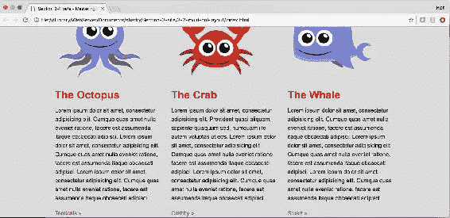

让我们看看当我们向包装所有内容的容器中添加一个`margin-bottom`属性时会发生什么:`secondary-section`。我们说`margin-bottom: 40px`:

```html
/**************** 
3 columns 
****************/ 
.secondary-section { 
  margin-bottom: 40px; 
} 
```

如果我们保存这个，它在浏览器中真的什么也做不了。内容仍然位于底部。让我进一步说明这个问题。如果我的背景颜色是绿色，那么你会认为整个背景是绿色的:

```html
.secondary-section { 
  margin-bottom: 40px; 
  background-color: green; 
} 
```

但是，如果我们添加前面的代码并保存它，背景不会变成绿色。所以，让我们实际上检查这个元素。让我们使用 Chrome 的开发工具在浏览器中检查第二部分。我们将看到页边空白和背景色都在应用过程中。但是我们在页面上看不到任何绿色内容:

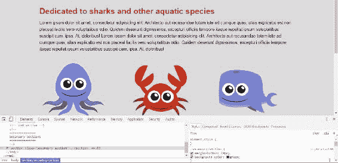

当您将鼠标放在`secondary-section`元素上时，您会看到它突出了它在屏幕上以桃色占据的空间(如果您正在查看打印的副本，您会在下面的截图中看到它是不同的灰色):

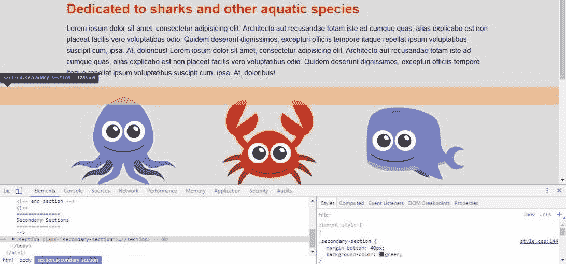

集装箱实际上已经倒塌了。当父元素内的所有元素都浮动时，就会发生这种情况:容器折叠，浮动在正常流之外，因此容器没有高度。

让我们看一看，看看我们能做些什么来解决这个问题。

# 解决浮动问题

好吧，让我们看看我们的问题。您已经学习了如何将堆叠行更改为水平列，以实现多列布局，但是浮动元素周围的包含元素已经完全折叠并失去了高度，因为其中的所有元素都是浮动的。作为一个折叠的元素，它看起来不像是对`margin-bottom`属性或我们分配给它的`background-color`的响应。因此，在本节中，我们将研究四种不同的方法来修复这种崩溃，并尝试了解处理它的最佳方法。首先使用`clear`法，然后是`overflow: hidden`法，接着是`float`法，最后是最喜欢的方法:`clearfix`黑。

# 使用清除方法

让我们使用`clear`属性来解决这个问题。我们将在`secondary-section`的末尾使用以下代码为新的`div`添加一个`clear`类:

```html
<div class="clear"></div> 
```

接下来，我们将进入我们的 CSS，在为全局样式保留的区域中，在以`wrapper`类为目标的规则集下面；我们将在这里创建`clear`选择器并添加`clear: both`:

```html
/***************
Global
***************/
::-moz-selection {
  background-color: #eb2428; 
}
::selection {
  background-color: #eb2428; 
}
.wrapper {
  margin: 0 auto;
  width: 960px;
}
.clear {
 clear: both;
}
```

所以，如果我们保存这个并返回到浏览器，我们的背景颜色将是绿色的，底边为`50px`。一切都很顺利:

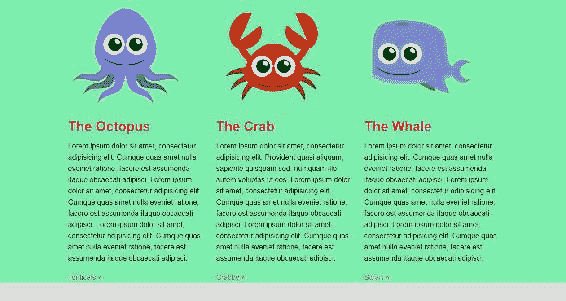

然而，我们在页面中添加了额外的非语义标记。我们*甚至可能*因此获得一个 SEO 扣减。让我们探索不添加额外标记的其他方法。去掉我们刚刚添加到 HTML 中的额外标记:

```html
<div class="clear"></div> <!-- delete this -->
```

我们的崩溃会卷土重来。现在我们再也看不到绿色背景了；这就是我们如何知道崩溃的原因:


# 使用具有隐藏值的溢出属性

接下来我们要看的方法是`overflow: hidden`。去你的 CSS 找`.secondary-section`类。我们能做的就是用`hidden`的值添加`overflow`房产:

```html
.secondary-section { 
  margin-bottom: 50px; 
  background-color: #7EEEAF; 
  overflow: hidden; 
} 
```

`overflow: hidden`是真正的黑客。它从来就不是用来修补倒塌的容器的；它用于隐藏溢出容器的任何内容图像或文本。然而，神奇的是，`overflow: hidden`也清除了崩溃。如果我们保存我们的 CSS 并转到我们的站点，我们会看到这一点在背景中很明显，现在背景是绿色的:

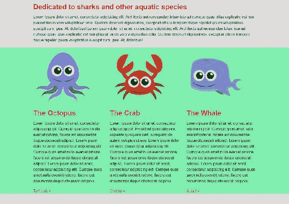

`overflow: hidden`的一个小问题是，您可能希望内容溢出容器，例如，下拉菜单或工具提示。`overflow: hidden`黑客将隐藏溢出——这并不奇怪！这是一个解决方案，但可能并不总是理想的。例如，在我们的具体场景中，我们可能希望章鱼从它的容器中爬出来。让我们进入 Chrome 开发工具，给它`margin-top: -50px`。如您所见，现在图像的顶部不再显示，溢出部分被隐藏:

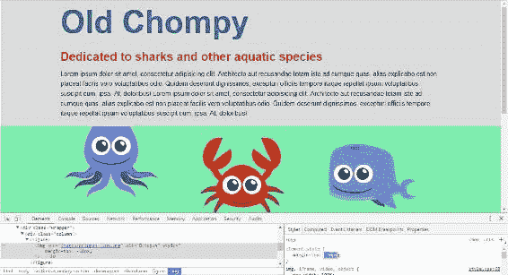

所以这对我们来说不是个好办法。让我们从 CSS 文件中删除那个`overflow: hidden`声明，看看下一个方法:`float`方法。

# 浮动法

我们可以通过向左或向右浮动容器来防止元素折叠。让我们这样做；让我们把`float: left`或`float: right`加到我们的`secondary-section`上。两者都可以:

```html
.secondary-section { 
  margin-bottom: 50px; 
  background-color: #7EEEAF; 
  float: left; 
} 
```

一旦我们保存了这个，我们会看到我们有绿色的背景，所以崩溃不再发生，但明显的问题是我们已经向左浮动了。我们希望这个分区居中:

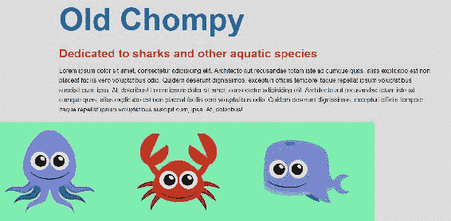

这种方法有一个明显的缺点。有些情况下，有些情况下，这将是一个完美的解决方案，但在这一个，有一个明显的问题:我们不再是中心。从你的 CSS 中移除`float: left`并探索我最喜欢的，我认为最好的解决方案:clearfix hack 。

# 克拉菲骇客

如果我们看下面的 CSS，就在我们的重置下面，这些规则集组成了我们的 **clearfix** :

```html
/* clearfix */ 
.grouping:before, 
.grouping:after { 
  content: " "; 
  display: table;  
} 
.grouping:after { 
  clear: both; 
} 
```

这段代码实际上是我们 CSS 基础层的一部分。基本上，这是在任何一个类为`grouping`的元素前后创建一个伪元素。这个伪元素有一个内容空格，显示设置为 table。然后我们在代码块下面有`after`伪元素，它设置了`clear`属性，并清除它之前的所有浮动。

有时你可能会看到`clearfix`作为类名，而不是`grouping`。我倾向于使用`grouping`因为我认为它更有意义；你在对元素进行分组，这更具语义性。虽然这并不重要；`clearfix`和`grouping`都在做同样的事情。

好了，这已经在 CSS 中了，所以除了转到 HTML 中的`secondary-section`并在其中添加这个`grouping`类之外，我们没有什么需要做的了。所以我们增加了第二类:

```html
<section class="secondary-section grouping"> 
```

当我们保存和刷新时，我们有了我们的容器；崩溃是固定的。在下一张截图中，我们看到了背景色和下边距。我们现在的状况很好:


clearfix 将在 IE8 中工作，但不会在 IE7 中工作，除非您添加一个特定于 IE 的样式表。这实际上在索引中。所以在`index.html`的头部，我有这个样式表，显示在下一个截图中，专门针对 IE7。它的作用是给分组放大`1`。这在旧版本的 IE 中触发了一种叫做`hasLayout`的东西，它清除了崩溃:


如果这对你没有太大意义，不要担心；不一定非要这样。然而，只要知道这允许 clearfix 黑客在旧版本的 IE 中工作。总之，这是非常深入的浏览器支持，并且非常容易使用，这是许多前端开发人员清除折叠浮动的首选方式。这当然是我最喜欢的方式。

在本节中，您学习了如何使用以下方法修复由浮动导致的父元素折叠:

1.  一个空的空白分区。
2.  `overflow: hidden`。
3.  通过浮动父元素。这三种方法都有效，但都有细微到重大的缺陷。
4.  clearfix hack 具有非常强大的支持、易用性和语义风格，有可能成为最佳方法。我在每个项目中都使用它。它可以轻松解决浮动最大的问题之一:崩溃。我喜欢 clearfix 黑客的另一点是，它是一种非常模块化的 CSS 方法。只需将`clearfix`类添加到标记的任何地方，您就摆脱了折叠的容器。

# 摘要

在这一章中，我们回顾了浮动元素的传统用法:在图像周围流动文本。然后，我们研究了使用浮动来构建多列布局。最后，我们学习了如何解决使用浮动带来的问题。我们发现 clearfix hack 是修复折叠浮动的最佳方法。在下一章中，我们将扩展模块化 CSS，使用模块化方法创建现代按钮。