# 使用模块化、可重用的 CSS 类和 CSS3 创建按钮

有了模块化和可重用的 CSS，它就变得有条理和简洁，从而避免了你想拔头发的情况。不管锚元素在标记中的什么位置，只要将`.button`类添加到锚元素中，并将其转换为按钮，这不是很棒吗？如果您能够在任何地方使用 CSS 的类，并且不需要这些类被父元素限定为长的后代选择器，那么 CSS 是“可重用的”。术语“模块化”是指通过向按钮添加另一个类来给按钮添加变化的能力，这样一个元素可以有两个类，这两个类可以结合在一起形成非常不同的东西。

如何编写模块化和可重用的 CSS 的一个很好的例子是:创建按钮。然而，这个概念应该适用于任何地方，适用于您网站的所有组件。这一章我们有很多东西要复习。在我们切换话题之前，我们将在前两部分介绍模块化 CSS 和多个类，并在特性规则部分讨论选择器如何相互否决。然后，我们将非常深入地了解 CSS3 的过渡、变换和渐变，并且我们将经历创建和设计一个大的行动号召按钮的每一步。

# 使用模块化 CSS 创建按钮

在本节中，我们将使用模块化的 CSS 类来创建按钮。我们将了解什么是模块化 CSS，以及它为什么有用。首先，让我们看看我们将要创建的最终站点，并探索我们将使用的不同按钮类型。

# 不同的按钮类型

在最上面，我们有巨大的 Go Premium 行动号召按钮:

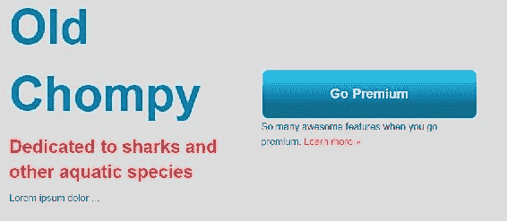

在主页上向下滚动一点，我们会发现这些“幽灵”按钮具有很好的悬停状态:


在电影页面，我们有相同的标准按钮。它只是颜色不同，位置也有点不同。这出现在所有三个电影部分:

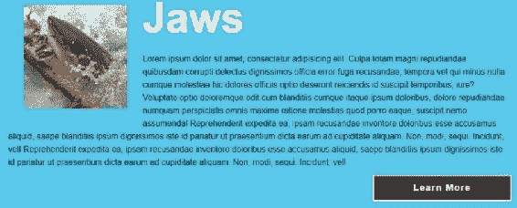

因此，在本节中，我们将在所有三列的底部构建这些标准按钮:


# 构建标准按钮

我们的起点还有很长的路要走，但应该很容易:

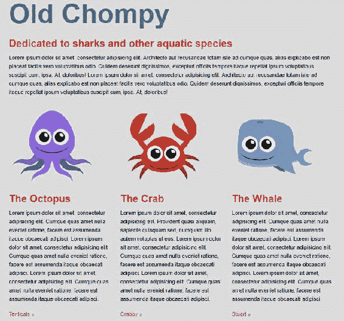

让我们跳到第二部分的 HTML:

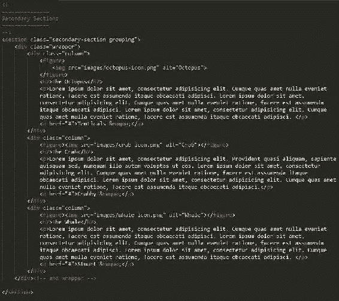

我将把`button`类添加到每列底部的所有三个锚点元素中。

```html
<a href="#" class="button">Tenticals &raquo;</a>
```

现在，跳到我们的 CSS 底部，让我们为我们的新部分添加一个巨大的评论，并命名为“按钮”。

```html
/****************
Buttons
****************/
```

这是我们所有按钮样式的发展方向。

我们要做的是创建`.button`选择器。所有跨按钮共享的样式属性都将放在这里。我们不会在按钮选择器中放置任何定位属性，因为按钮可以放在任何位置:

```html
/****************
Buttons
****************/
.button {
}
```

让我们从添加边框开始。我们将使用两个像素的纯色和一个深灰色。我们将对文本应用相同的颜色:

```html
.button {
   border: 2px solid #333;
   color: #333;
}
```

保存并刷新浏览器后，它开始有点像按钮:


我们现在需要添加一些填充。让我们回到我们的 CSS，使用双值填充简写:`10px`表示顶部和底部，`0px`表示左侧和右侧。这是因为我们最终会以文本为中心。让我们也将显示属性更改为`block`，因为这些是内联元素，我们希望它们的行为像块级元素:

```html
.button{
   border: 2px solid #333;
   color: #333;
   padding: 10px 0;
 display: block;
}
```

保存此文件，刷新浏览器，然后查看效果:


如您所见，我们现在必须添加一些文本级别的属性。首先，让我们添加一个字体系列。我们将使用典型的`sans-serif`堆栈:`Arial, Helvetica, sans-serif`。然后，使用`text-align`属性在元素的中心对齐文本。我们还会将`font-weight`设置为`bold`，然后使用另一个名为`letter-spacing`的属性，并添加一个值`1.5px`。如果你不熟悉`letter-spacing`属性，它几乎和你想象的一样——它在每个字母之间创建了一个水平空间:

```html
/****************
Buttons
****************/
.button{
  border: 2px solid #333;
  color: #333;
  padding: 10px 0;
  display: block;
  font-family: Arial, Helvetica, sans-serif;
  text-align: center;
 font-weight: bold;
 letter-spacing: 1.5px;
}
```

一旦我们保存了这个并刷新了站点，我们将拥有我们的按钮元素。还没有悬停状态；我们将在另一部分讨论这个问题:

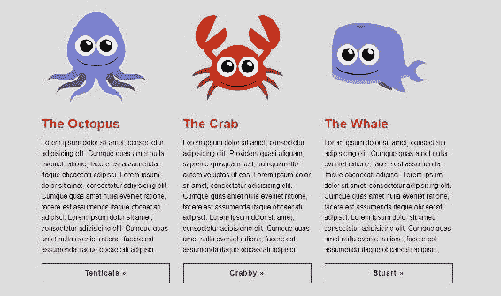

如果您现在转到电影页面，您会在那里看到“了解更多”链接，这些链接也需要是按钮:

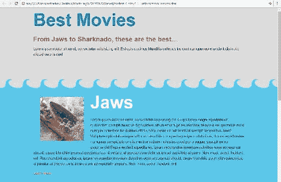

所以让我们跳到`shark-movies.html`文件中的标记，做同样的事情。将`button`的类别添加到每个电影部分底部的每个锚点标签中:

```html
<a href="" class="button">Learn More</a>
```

保存并刷新，您将立即获得一个按钮:


这是可行的。我们有一个按钮，但不是全部。它们看起来像纽扣，但是颜色不对，太宽，而且没有放在右边。此外，文本与背景的对比也不好，尤其是在较暗的部分。所以我们必须做一些修正，本质上是因为这些按钮不同于主页上的按钮，它们是全幅按钮。

让我们现在就开始修复这些按钮，看看我们如何能够获得更多的模块化，并添加多个类来改变按钮。

# 多个类别

综上所述，到目前为止，您已经学习了如何创建一个可以在我们网页的任何地方重用的类，以便创建一个按钮。然而，按钮往往会因网站而异。例如，您可能有如下按钮:`Okay`、`Close`、`Cancel`、`Submit`和`Add to cart`。所有这些都有不同的含义，所以颜色或风格都略有不同。在某些情况下，就像我们的电影和索引页面一样，由于页面之间的布局差异，按钮最终会根据它们所在的页面而变化。在这一节中，我们将更加模块化，并学习如何使用多个类来改变按钮的外观。我们将看几个例子，说明多个类如何为我们整个网站的按钮样式设计提供一些启示。

下面的截图展示了最终的网站。我们正在寻找看起来像“了解更多”按钮的按钮。它们漂浮在右边，是白色的，有白色的边框，宽度更窄:

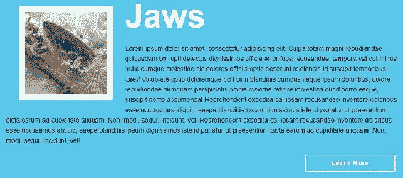

以下是我们目前对网站的看法。我们的按钮颜色为深灰色，具有全宽，但它们并不是我们在这里要找的:


# 更改按钮的宽度

首先，让我们通过创建一个名为`button-narrow`的新类来解决宽度问题。所以在我们的 CSS 中，也就是我们的按钮部分，在我们上一部分创建的`.button`规则集下面，创建一个名为`.button-narrow`的新类。很简单，宽度就是`25%`:

```html
/****************
Buttons
****************/
.button {
  border: 2px solid #333;
  color: #333;
  padding: 10px 0;
  display: block;
  font-family: Arial, Helvetica, sans-serif;
  text-align: center;
  font-weight: bold;
  letter-spacing: 1.5px;
}
.button-narrow {
 width: 25%;
}
```

保存这个。接下来，转到`shark-movies.html`文件。使用一类按钮进入三个锚点标签。我将在这里显示“了解更多”按钮，但是对所有这些按钮的代码更改都是相同的:

```html
<a href="" class="button ">Learn More</a>
```

让我们将新的`button-narrow`类添加到这些元素中:

```html
<a href="" class="button button-narrow">Learn More</a>
```

保存此内容，转到浏览器，您会看到按钮现在在所有三个部分都变小了:

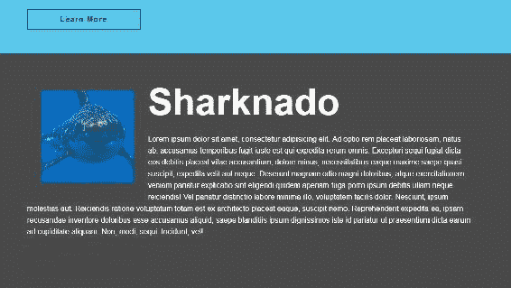

让我们更进一步，创建另一个名为`button-alt`的类，它将控制边框和字体颜色。

# 更改按钮的边框和字体颜色

让我们在 3 个**学习更多**按钮中的每一个上添加`button-alt`类。

```html
<a href="" class="button button-narrow button-alt">Learn More</a>
```

现在转到 CSS，在我们的`.button-narrow`选择器下面输入`.button-alt`作为我们的新选择器。我选择`button-alt`作为班级，因为这是一个替代按钮颜色。然后，指定`color`为白色，指定`border-color`为白色:

```html
.button-alt {
  color: #fff;
  border-color: #fff;
}
```

保存这个，去网站，你会看到我们马上就到了:


# 定位按钮

最后是按钮的位置。它目前在左手边，需要坐在右边。自然，我们可以创建一个名为`button-right`的类，它将按钮浮动到右边。然而，向左或向右浮动元素非常常见，甚至在按钮之外。最好保持类名更通用，比如右浮动和左浮动。这样，我们可以让任何东西向左或向右浮动。就我而言，在 CSS 的`Buttons`部分之前，我有我的全局样式:


在这个全局列表的正下方，我将复制我的标准模块化样式库:

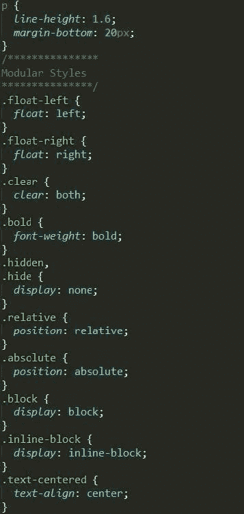

这是我多年来构建的基础样板的一部分，它有类，比如`float-left`、`float-right`、`clear`、`bold`、`hidden`，以及一些其他常见的模块化类。你可以在下载包中看到完整的列表。这些可以在整个站点重复使用。现在，在`shark-movies.html`文件中，让我们简单地将`float-right`类添加到我们的三个锚点标签中:

```html
<a href="" class="button button-narrow button-alt float-right">Learn More</a>
```

保存这个并刷新鲨鱼电影网站。现在，您将看到按钮浮动到右侧:


我还应该指出，我们围绕这些部分的容器不会倒塌。让我们进入开发工具看看为什么。下面截图中突出显示的一个类为`content-block`的部分没有折叠，因为我给它添加了 clearfix `grouping`类:


如果我把这个拿出来，从那一行删除`grouping`，你会看到崩溃将如何生效。因为我们有这个`grouping`类，所以我们确保这个部分不会崩溃:

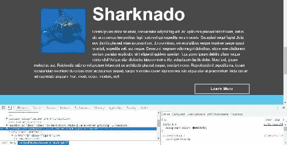

因此，总之，我们遵循一种非常模块化和可重用的方法来构建我们的按钮，并创建了一些模块化的按钮相关类，可以用来改变按钮的风格。我们还有其他方法可以做到这一点。我可以使用后代选择器根据按钮的父级来设计按钮的样式。这样，内容块中的所有按钮将总是向右浮动，并且是白色而不是深灰色。如果除了内容块之外，它还提供了其他区域，同样的可选按钮样式，这将是一个不错的选择，这是很有可能的。接下来，让我们谈谈为什么模块化、可重用和轻量级的 CSS 方法是必要的。我们将通过谈论特异性的规则来做到这一点。

# 特异性规则

我们开始理解模块化的 CSS 方法是如何允许我们将类作为 CSS 的小块来使用的，这些小块可以在网页的任何地方用来为任何元素设置样式。这使得编写 CSS 非常方便。然而，它只有在 CSS 保持轻量级的情况下才能工作。正如您将在本节中了解到的，每个 CSS 选择器都可以在一个秤上称重，最重的选择器赢得了两个竞争选择器之间的风格之战。因此，我将从解释不同选择器的权重以及它们如何相互否决开始。然后，我们将讨论通用选择器和`!important`声明如何适应选择器的权重。

# 不同选择器的权重

所有选择器都被分配一个权重，当存在冲突的 CSS 规则时，最重的选择器优先。当设计一个网站时，很自然的你会有一些通用的风格，但是在不同的环境下会被一些特定的风格所取代。在样式表顶部的全局区域，已经为所有段落元素设置了非常广泛的样式:

```html
p {
  font-size: 16px;
  line-height: 1.6;
  margin-bottom: 20px;
}
```

字体大小为`16px`。有`1.6`的`line-height`属性和`margin-bottom`的`20px`属性。当然，在不同的情况下，我可能想要覆盖`line-height`或`margin-bottom`。让我们尝试用一个带有选择器`.content-block p`的新规则集来覆盖它:

```html
p {
  font-size: 16px;
  line-height: 1.6;
  margin-bottom: 20px;
}
.content-block p {

}
```

这是一个后代选择器。现在让我们添加一个`1.8`的`line-height`和一个`40px`的`margin-bottom`:

```html
.content-block p {
 line-height: 1.8;
 margin-bottom: 40px
}
```

切换到网站查看原始设置。这个后代选择器应该以主文本区域中的任何内容或段落文本为目标:


当我们保存我们的 CSS 并刷新网站时，我们会获得更多的行高和页边距，如下面的截图所示:

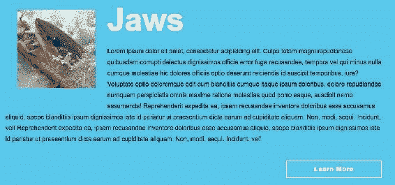

那么每个选择器有多重呢？嗯，你可以认为内联样式值 1000 分，id 值 100 分，类值 10 分，元素各值 1 分。在我们一直在看的例子中，单个`p`元素选择器只值 1 分，而作为一个类和一个元素的`.content-block p`值 11 分:

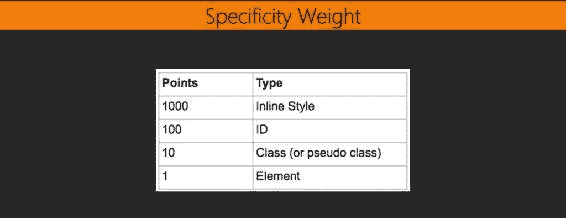

这个积分系统计算出哪个选择器会赢。在这种情况下，选择器都以段落元素为目标；然而，因为`.content-block p`值 11 分，它将胜过上面的规则集，作为元素选择器，它只值一分:

```html
p {
  font-size: 16px;
  line-height: 1.6;
  margin-bottom: 20px;
}
.content-block p {
  line-height: 1.8;
  margin-bottom: 40px
}
```

id 值 100 分，是一个班的 10 倍。在我们的`shark-movies.html`文件中，可以看到 Jaws 的第一部分有`jaws` ID:

```html
<section id="jaws" class="content-block style-1 wave-border grouping">
```

现在让我们切换回样式表，创建一个新的规则集，如下所示:

```html
#jaws p {
  line-height: 3;
}
```

当我们刷新浏览器时，你会看到`3`的`line-height`确实生效了:


我们的选择器使用了一个值 101 点的 ID，覆盖了一个值 11 点的类和元素的选择器，以及一个值 1 点的元素的选择器。身份证的重量，在我的情况下，意味着我倾向于远离他们的造型目的时，我可以。id 的通用性也不如类；它们在一页上只能使用一次。我真的尽量避免完全使用它们，因为它们不太可重用。

另一个要避免的是内嵌样式，我们可以认为它价值高达 1000 点。内联样式将击败一切，包括带有标识的选择器。让我们再次瞄准该段落来演示这一点。我们将直接跳到`shark-movies.html`文件，并实际添加一个内联样式。在`jaws`部分的`h1`选择器下面，我们有我们的段落，所以让我们添加我们的内嵌样式。我们将输入`style="line-height: 1"`:

```html
<p style="line-height: 1">
```

当我们保存这个时，我们将返回我们的站点并刷新浏览器。一旦我们这样做了，我们会看到`line-height`正在使用这种内嵌样式，因为它更有价值。它比我们样式表中的所有其他选择器都要重:


那么什么比内嵌样式更好呢？你的袖子里有一张王牌:宣言。

# 那个！重要声明

让我们看看`!important`声明是如何工作的。我们回到 CSS 中的这个元素选择器，它只是一个段落:

```html
p {
  font-size: 16px;
  line-height: 1.6;
  margin-bottom: 20px;
}
```

我们可以进入`line-height`值本身，然后将`!important`添加到该行的末尾。线路高度将达到`1.6`:

```html
p {
  font-size: 16px;
  line-height: 1.6 !important;
  margin-bottom: 20px;
}
```

以下是前面代码的输出:


让我们检查这一段，以确保它实际上使用的是`!important`声明。正如你在 Chrome 的 DevTools 中看到的，1 的内嵌风格被划掉了；我们可以看到值 101 分的 ID 中有一个元素也被划掉了:


如果我们进一步向下滚动样式，我们会看到我们的类加上被划掉的元素:

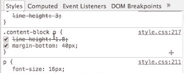

再向下滚动一点，你会看到它确实在使用我们的元素选择器中的`line-height`和`!important`声明:

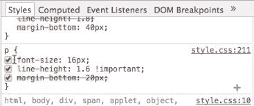

添加`!important`声明实际上可以被认为值 10，000 点，击败了该属性的所有类、标识和内联样式。就像你想远离内嵌样式和 id 一样，你也想远离使用`!important`声明，除非你有一个非常好的理由。还有一个不到一分的选择器:通用选择器。

# 通用选择器

通用选择器只是一个星号。它值零分，所以它只在没有其他选择器争用时工作。拿出我们 CSS 中的`!important`声明。在我们的其他规则集之上，让我们添加一个`*`作为选择器，并添加一个`9px`的`font-size`和一个`.5`的`line-height`:

```html
* {
  font-size: 9px;
  line-height: .5;
}
```

从技术上讲，这颗星应该适用于每一个元素，除非有更具体的定义。任何事情都比不上`*`选择器。现在当你去网站时，你会看到一旦你把`!important`声明拿出来，你又回到了你的内嵌风格的`line-height`属性:


在开发工具中，我们可以看到通用选择器最终被划掉了。它并没有被应用到这段文字或者其他任何东西上。它没有在页面上应用太多:

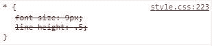

因为它的重量很小，很多时候你会看到通用选择器被用作原始重置。您可以将`margin: 0`和`padding: 0`的属性和值添加到通用选择器和样式表顶部类似的地方。这实际上会将每个元素的边距和填充值重置为零:

```html
* {
  margin: 0;
  padding: 0;
}
```

让我们重新看一下显示不同选择器权重的图表。你已经学会了你可以认为`!important`值 10000 点，通用选择器值 0 点:

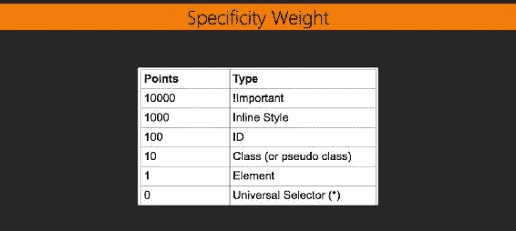

# 积分制的现实

然而在现实中，我所描述的分数系统并不完全真实。假设你有这个 11 个元素的选择器:`div div p p p p p p p p p { ... }`。用我已经描述过的系统，这个值 11 分。我描述一个类选择器值 10 分。但是，长元素选择器永远不会打败一个类:`.i-beat-any-number-of-elements`。所以技术上，元素值 0，0，0，1，类值 0，0，1，0，ID 值 0，1，0，0，内联样式值 1，0，0，0。但是！停下来强调一下。如果你创建了一个包含 10 个以上元素的选择器，你会有一个非常糟糕的体验。这将是一个非常糟糕的想法，我建议你尽量不要超过 3 或 4 个。因此，我们可以用我之前描述的术语来思考，类值 10 分，元素值 1 分，以此类推，而不是认为元素值 0，0，0，1，1，1。

此外，重要的是要记住，当您保持选择器的轻量级时，以任何合理的规模创作 CSS 都更容易，因为您可以轻松地以按钮的形式创建模块化的、可重用的类。创建一个现代网站的很大一部分是在必要时超越风格；你不想让这变得困难。我强烈建议您坚持使用类和元素选择器，并且在使用`!important`声明时非常保守；完全避开内嵌样式和标识。

# 过渡

理解 CSS 的特殊性以及选择器如何相互否决可以减轻使用 CSS 时的许多挫败感。现在我们对此有了更好的理解，让我们回到我们的项目，完成我们一直在做的按钮造型。按钮是不完整的，除非它具有平滑过渡的平滑悬停状态。我们将通过使用伪选择器`:hover`创建悬停状态来开始这一部分。然后，在最后讨论什么时候需要供应商前缀之前，我们将通过一个过渡来解决这个问题。

# 创建悬停状态

目前，我们网站上的按钮是幽灵按钮。它们没有背景色、深灰色边框或深灰色文本，如下图所示:

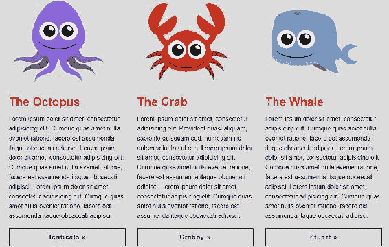

我们想创建一个按钮，它将有一个深灰色的背景色，当悬停时将显示白色文本。所以让我们使用`:hover`伪类来解决这个问题。在第一个现有的`.button`规则集下，添加一个名为`.button:hover`的新选择器。添加`background-color: #333`并将文本的颜色添加为白色:

```html
/****************
Buttons
****************/
.button {
 border: 2px solid #333;
 color: #333;
 padding: 10px 0;
 display: block;
 font-family: Arial, Helvetica, sans-serif;
 text-align: center;
 font-weight: bold;
 letter-spacing: 1.5px;
}
.button:hover {
 background-color: #333;
 color: #fff;
}
```

请注意，我没有使用十六进制代码的全部六个字符。如果所有六个字符都相同，那么只要使用三个字符就可以了。现在，如果我们保存这个并刷新，当我们将鼠标悬停在一个按钮上时，我们将拥有我们的悬停状态:

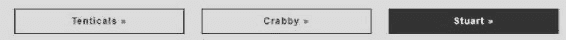

不过悬停状态的转换非常突然；它正在立即发生。所以下一步是使用 CSS3 转换属性来平滑从无悬停到悬停的状态变化。

# 使用转换属性

我们可以选择转换哪些属性、转换的持续时间以及转换的定时功能。这三个属性可以分别列为`transition-property`、`transition-duration`、`transition-timing-function`；然而，使用速记似乎是最简单的方法。因此，我们将在`.button`规则集中输入`transition`作为新属性，并使用`.25s`，即四分之一秒。我们将指定`all`我们将转换哪些属性。我们将使用`linear`计时功能:

```html
.button {
  border: 2px solid #333;
  color: #333;
  padding: 10px 0;
  display: block;
  text-align: center;
  font-weight: bold;
  letter-spacing: 1.5px;
  font-family: Arial, Helvetica, sans-serif;
  transition: .25s all linear;
}
```

现在，当我们在浏览器中查看时，当您将鼠标移动到每个按钮上时，这是一个更加渐进的变化:


从深灰色过渡到白色文本需要 0.25 秒，背景颜色和边框也是如此。四分之一秒似乎刚刚好，但你可以尝试更快的过渡或更慢的过渡。你可以把它变成十分之一秒，那也很好，非常快，几乎是立即。你可以把它改成一秒钟，这样会慢十倍，而且可能太慢了。我发现 0.2 到 0.3 秒往往是过渡的“黄金分割区”。

我们在`0.25s`之后增加的下一个值是`all`:

```html
transition: .25s all linear;
```

这可以设置为您想要转换的某个属性或所有属性。所以，如果你想的话，你可以把它设置为`color`:

```html
transition: .25s color linear;
```

唯一会转变的是文本颜色。如果您尝试这样做，您将看到按钮的深灰色背景颜色如何立即过渡，但文本颜色过渡时间超过 0.25 秒:

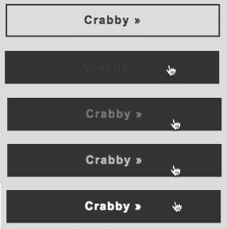

如果我们愿意，我们可以添加一个逗号分隔的属性列表来转换。在这种情况下，我正在转换`color`和`background-color`。这很好的一个原因是，如果您需要转换多个属性，但不是每个属性。

```html
 transition: .25s color linear, .25s background-color linear;
```

因此，背景颜色和文本颜色将以相同的速度过渡。我们使用`all`关键字来转换文本颜色和背景颜色，这样做效率更高。但是，在某些情况下，保持属性的转换速度不同可能会有所帮助。让我们将`background-color`更改为 1.25 秒的计时功能:

```html
transition: .25s color linear, 1.25s background-color linear;
```

颜色过渡现在将比背景颜色过渡更快。这在我们当前的情况下不是非常有用，所以让我们把它改回我们之前的方式:

```html
 transition: .25s all linear;
```

在我们的例子中，定时功能被设置为`linear`。我们也可以使用`ease`、`ease-in`、`ease-out`和`ease-in-out`:

```html
transition: .25s all ease-in-out;
```

对于像我们正在使用的这种短暂的过渡，线性方法或缺省方法都可以；它们中的任何一个都可以正常工作。像这样快速过渡的`ease`、`ease-in`、`ease-in-out`和`linear`其实很难区分。我建议尝试每一种，以确定哪一种最适合您的需求。您可能需要改变过渡的持续时间来清楚地看到效果。

好的，所以当悬停时，过渡为我们的按钮增加了一个不错的小体验层。我们还可以转换活动和聚焦状态。焦点是用户使用他们的*标签*键而不是将鼠标指针悬停在按钮上时的状态。我喜欢使所有悬停状态与聚焦状态相同。这很容易通过用逗号添加选择器来实现。所以就像我们有`.button:hover`一样，我们可以做`.button:focus`:

```html
.button:focus,
.button:hover {
  background-color: #333;
  color: #fff;
}
```

如果你添加了这个，焦点状态也会被触发。当你按下 *Tab* 键和 *Shift* + *Tab* 键从一个按钮移动到另一个按钮时，它们的悬停状态也将是它们的焦点状态。出于可访问性的原因，这很好。

# 供应商前缀

如前所述，过渡是 CSS3 的属性。所有现代(主要)浏览器都支持它们:Chrome、火狐、Safari、Internet Explorer 和 Edge。旧的浏览器，如 IE9 及以下版本，不支持它们。他们仍然获得悬停状态，但这将是突然的，没有任何过渡。这不是一个问题，因为过渡通常不是你的网站的核心功能，而是一个额外的体验水平。尽管如此，它们仍然是 CSS3，通过包含厂商前缀版本，我们可以从中获得更多的好处。传统上，`-webkit-`前缀用于 Safari 和 Chrome`-moz-`用于火狐，`-o-`用于 Opera。不过火狐和 Opera 现在也用`-webkit-`，所以技术上你不像以前需要`-moz-`和`-o-`那么需要它们了；但是，对于这些浏览器的旧版本，您仍然可以包含它们:

```html
-webkit-transition: .25s all ease-in-out;
-moz-transition: .25s all ease-in-out;
-o-transition: .25s all ease-in-out;
transition: .25s all ease-in-out;
```

或者，您可以使用一半的 CSS，仍然让 99%的用户看到您的过渡，只需使用`-webkit-`厂商前缀:

```html
-webkit-transition: .25s all ease-in-out;
transition: .25s all ease-in-out;
```

过渡是 CSS3 的一大特色，它为用户体验增加了一层额外的美好。到目前为止，我们已经为我们的幽灵按钮创建了一个悬停状态，并使用过渡效果来平滑状态变化。然后我们添加了供应商前缀来支持旧的浏览器。接下来，我们将看看 CSS3 的另一个特性:转换。

# 转换

像过渡一样，变换也是 CSS3 的一个特性。它们有更多的支持，尽管所有主要的浏览器，包括 IE9 和更高版本，都提供支持。变换允许您做几件事，包括旋转、缩放和平移。我们将在这一部分看一些实际的例子。首先，我们将对我们的按钮应用一个比例，然后我们将做一个平移，接着是旋转值的独特用法。

# 将标尺应用到我们的按钮上

让我们直接跳到我们在 CSS 中停止按钮的地方。在转场下面，让我们添加一个变换。我们会加上`transform: scale(.9, .9)`，就像这样:

```html
-o-transition: .25s all ease-in-out;
transition: .25s all ease-in-out;
transform: scale(.9,.9);
```

请注意，通过使用宽度和高度的`.9`值，我们实际上使我们的按钮变小了，为原始尺寸的十分之九:

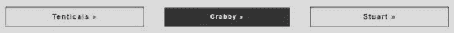

让我们再次将`scale`属性添加到按钮的悬停/聚焦状态，以获得更整洁的交互:

```html
.button:focus,
.button:hover {
  background-color: #333;
  color: #fff;
  transform: scale(1.1, 1.1);
}
```

比例值是一个 css 函数，它分别取宽度和高度。1.1 是原始尺寸的 1.1 倍。

当您保存和刷新时，您会看到当您将鼠标悬停在按钮上时，按钮实际上会变得更大。这是一个很好的平滑过渡，因为我们已经应用了过渡属性:

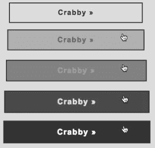

# 使用翻译功能

让我们更进一步，也使用`translate`功能。这将被添加到与我们刚刚编写的`transform: scale`代码相同的行或声明中。`translate`功能可以将元素向左、向右、向上或向下移动。正如您在下面一行代码中看到的，第一个值是用于左右移动的。但是我们不会将其向左或向右移动，所以我们将使用`0`。第二个值用于顶部和底部移动。实际上我将通过`-5px`来推动它。如果我使用一个正值，它会向下推:

```html
transform: scale(1.1,1.1) translate(0, -5px);
```

现在，当我们刷新并悬停在一个按钮上时，我们会看到它确实略微向上移动，确切地说是 5 个像素:


请注意，我用空格将两个函数分开。语法在这里非常重要:

```html
transform: scale(1.1,1.1) translate(0, -5px);
```

您可能会很自然地在那里添加一个逗号，但是如果我真的在两个函数`scale`和`translate`之间添加一个逗号，那么就`transform`而言，我们将完全没有交互，因为这个语法是不正确的:

```html
transform: scale(1.1,1.1), translate(0, -5px); /* don't use a comma to separate transforms :-( */
```

# 使用旋转值

还有另一个转换功能，我想看一下，但是如果我们给这些按钮添加更多的天赋，它们会太分散注意力。相反，让我们为电影页面上的电影图像添加一个非常有趣的悬停效果。每个电影标题旁边的图像实际上是电影的外部链接:


然而，我希望在悬停时发生视觉交互，这实际上表明这是一个超链接，或者至少让用户知道有某种类型的动作可以执行。让我们用`transform: rotate()`来实现这一点。

这就是我们最终网站的目标。一个内部有图像的白色框架，悬停效果是在这个白色框架内旋转:


如下图所示，当您将鼠标悬停在图像上时，图像会旋转并比正常情况下缩放得稍大，即使图像缩放得更大，它也不会溢出其父容器:

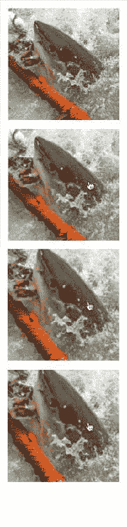

我们需要有一个元素来包裹我们的形象，以实现这一点。我们确实有这个——一个类为`figure`的锚标签，它是每个图像的父级。这就是我们要添加这个白色粗边框的地方。我们需要将`overflow: hidden`添加到`a`标签中，因为当我们进一步缩放和旋转图像时，隐藏的溢出会阻止它从容器中弹出。

我们开始工作吧。`.content-block .figure`选择器已经存在，我们先给它加上白边。我打算等一会儿再添加`overflow: hidden`。首先，我们制作`border`房产`10px`、`solid`和`white`:

```html
.content-block .figure {
  float: left;
  margin: 30px;
  border: 10px solid #fff;
}
```

在我们刷新当前站点之前，它是这样的:


当我们刷新浏览器时，我们得到白色边框:


如您所见，我们在图像底部和边框之间有一个间隙。我们可以通过两种方式来纠正这种情况。我们可以设置容器，使其具有图像的精确高度；我们可以使用`height`属性来做到这一点，这不是最好的解决方案。或者，我们可以将图像向左浮动。为此，我们可以使用`float`属性，因为它足够简单，并且是一个更强的解决方案。然而，我们想要瞄准`.content-block .figure`内部的图像本身。所以让我们这样做，让它向左浮动。

```html
.content-block .figure img {
  float: left;
}
```

当我们现在刷新浏览器时，我们会看到这消除了图像和边框之间的间隙:

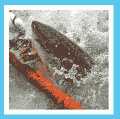

我们还将在图像中添加`rotate`和`scale`。`rotate`函数与`scale`和`transition`有点不同，因为它在函数内部没有两个参数。只需要一个:你想要旋转的度数。在我们的案例中，这是`15deg`。因此，我们将为悬停在图像上创建一个新的选择器:

```html
.content-block .figure img {
  float: left;
}
.content-block .figure img:hover {
 transform: rotate(15deg);
}
```

接下来，添加刻度:`1.25`水平，`1.25`垂直，记住*不是*在两个函数之间加逗号。这是代码:

```html
.content-block .figure img {
  float: left;
}
.content-block .figure img:hover {
  transform: rotate(15deg) scale(1.25, 1.25);
}
```

保存所有这些，转到站点，现在当您悬停时，图像会从其容器中弹出:

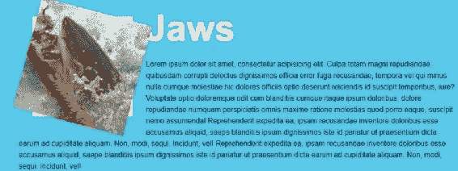

让我们将`overflow:hidden`添加到`parent .figure`选择器中。这正是`overflow:hidden`的目的:

```html
.content-block .figure {
  float: left;
  margin: 30px;
  border: 10px solid #fff;
  overflow: hidden;
}
.content-block .figure img {
  float: left;
}
.content-block .figure img:hover {
  transform: rotate(15deg) scale(1.25, 1.25);
}
```

当我们现在去网站时，我们看到它工作正常。我们得到旋转，我们得到稍微大一点的刻度，更多地包含在容器中，没有溢出:


从默认状态到悬停状态的变化仍然太突然了。让我们添加一个`transition`属性，以使其更加平滑。我们希望将过渡添加到图像的非悬停状态。让我们添加一个四分之一秒的过渡:

```html
.content-block .figure img {
  float: left;
  transition: .25s all ease-in-out;
}
```

现在，我们已经从默认状态平稳过渡到悬停状态:


# 添加供应商前缀和:焦点状态

我们要做的最后一件事是给我们的`transform`和`transition`属性添加供应商前缀。与过渡一样，我将添加声明的`-webkit-`前缀版本，以支持 Chrome、Safari、Firefox 和 Opera 的旧版本。我还将添加`-ms-`前缀版本来支持互联网浏览器 9。

```html
.content-block .figure img {
  float: left;
  -webkit-transition: .25s all ease-in-out;
  transition: .25s all ease-in-out;
}
.content-block .figure img:hover {
 -webkit-transform: rotate(15deg) scale(1.25, 1.25);
 -ms-transform: rotate(15deg) scale(1.25, 1.25);
  transform: rotate(15deg) scale(1.25, 1.25);
}
```

也许值得强调的是，在`transform`属性中，我添加了`-ms-`厂商前缀。碰巧的是，如果您为 IE9 提供`-ms-`前缀，它将支持转换:

```html
-ms-transform: rotate(15deg) scale(1.25, 1.25);
```

然而，我没有对过渡进行这样的处理，因为添加`-ms-`厂商前缀不会有任何影响，因为 IE9 只是没有构建过渡支持。

让我们也添加`:focus`状态，使其更易于网络访问:

```html
.content-block .figure img {
  float: left;
  -webkit-transition: .25s all ease-in-out;
  transition: .25s all ease-in-out;
}
.content-block .figure img:hover,
.content-block .figure img:focus {
  -webkit-transform: rotate(15deg) scale(1.25, 1.25);
  -ms-transform: rotate(15deg) scale(1.25, 1.25);
  transform: rotate(15deg) scale(1.25, 1.25);
}
```

好了，这就结束了我们对过渡和转换的简单介绍。我们将体验层提升到了另一个层次，增加了不同类型的转换，并结合转换来平滑转换。还有其他我们没有看完的变换，比如`skew`、`translate x`、`translate y`、`scale x`、`scale y`等等。随着浏览器的支持越来越好，也有一些 3D 转换真的将它提升到了一个完全值得探索的水平。接下来，我们将继续我们的风格训练，在我们的网站上设计主要的行动号召按钮。

# 设置行动号召按钮的样式

在这一章中，我们在按钮造型方面已经取得了很大的进步。现在是时候再加一个了。在最终的网站中，我们还在主页上有一个需要构建的行动号召按钮。在这一节中，让我们走完设置行动号召按钮样式的每一步。首先，我们将添加 HTML，然后正确定位并添加适当的 CSS 最后，我们将为它添加一个不错的悬停效果。

这是我们目前的网站:


以下是我们的最终目标站点，我们将创建 Go Premium 行动号召按钮:


# 添加网页

让我们将标记添加到我们的`index.html`文件中。在`Intro Section`中，使用带有文本`Go Premium`的按钮锚标签:

```html
<!-- 
===============
Intro Section
===============
-->
<section>
  <div class="wrapper">
    <h1>Old Chompy</h1>
    <h2>Dedicated to sharks and other aquatic species</h2>
    <p>Lorem ipsum dolor ...</p>
    <a href="#">Go Premium</a>
  </div><!-- end wrapper -->
</section><!-- end section -->
```

就在这下面，添加一个`p`标签，说明您需要点击这个即将出现的巨大行动号召按钮的原因。该段落标签还将包含一个锚点，以了解更多关于我们虚构的高级产品的信息:

```html
<!-- 
===============
Intro Section
===============
-->
<section>
  <div class="wrapper">
    <h1>Old Chompy</h1>
    <h2>Dedicated to sharks and other aquatic species</h2>
    <p>Lorem ipsum dolor ...</p>
    <a href="#">Go Premium</a>    <p>So many awesome features when you go premium. <a href="#">Learn more &raquo;</a></p>
  </div><!-- end wrapper -->
</section><!-- end section -->
```

现在，我们在顶部创建了一个两列布局。我们需要将内容的左边部分向左浮动，将内容的 Go Premium 部分向右浮动。最好的方法是用唯一的类名将两者包装在一个`div`标签中，给每个标签增加宽度，并使两者都浮动。所以从添加标记开始:

```html
<section>
    <div class="wrapper">
 <div class="intro-content">
            <h1>Old Chompy</h1>
            <h2>Dedicated to sharks and other aquatic species</h2>
            <p>Lorem ipsum dolor ...</p>
 </div><!-- end of intro-content -->
 <div class="go-premium">
            <a href="#">Go Premium</a>
            <p>So many awesome features when you go premium. <a href="#">Learn more &raquo;</a></p>
 </div><!-- end of go-premium -->
    </div><!-- end wrapper -->
</section><!-- end section -->
```

当我们应用它并查看我们的网站时，我们会看到行动号召按钮就在我们期望的地方，就在简介内容的正下方，因为我们还没有添加布局特定的 CSS:

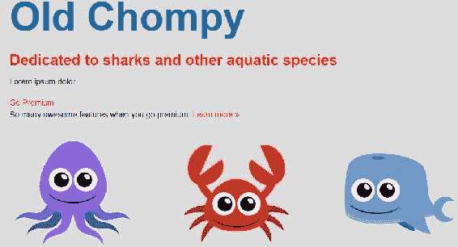

让我们深入 CSS 并改变它。

# 使用 CSS 定位

定位对我们来说应该不是什么新鲜事。只需在我们的 CSS 中用以下规则集创建一个`Go Premium`部分:

```html
/****************
Go Premium
****************/
.intro-content {
  width: 360px;
  margin-right: 60px;
  float: left;
}
.go-premium {
  width: 300px;
  float: left;
}
```

我们的`.intro-content`和`.go-premium`区域都定义了设定宽度。我们也应该把`margin-right`放在介绍内容上，在两者之间增加一些空间。两个都飘到了左边。所以这段代码真正实现的是:

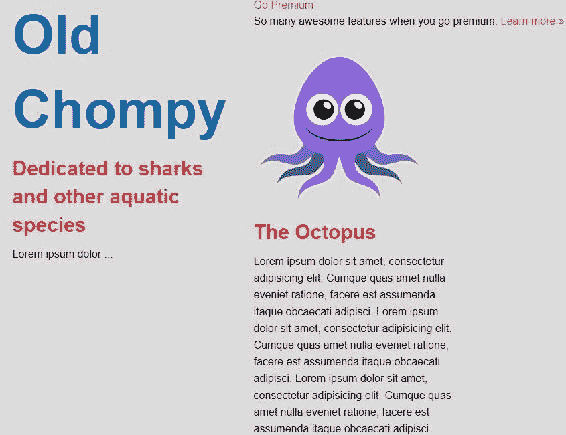

我们的介绍性内容在左侧，我们的`Go Premium`内容在右侧。不过，我们有一些问题。go premium 的内容在页面上的位置太高了，然后在页面下方，我们的内容被侵占并流向介绍内容的右侧。这就是我们面临的浮体不清的问题。

上边距应该可以解决我们的第一个问题，所以将`125px`的`margin-top`添加到`.go-premium`选择器中:

```html
.go-premium {
  width: 360px;
  float: left;
  margin-top: 125px;
}
```

以下是前面代码的输出:


我们的第二个问题是，内容实际上是围绕浮动元素流动的，并且在我们的 Go Premium 按钮上有点蔓延。我们可以使用包装整个顶部的容器上的 clearfix hack 类来解决这个问题。请看我们`index.html`文件中的介绍部分。整个顶部，包括简介内容和 go premium，都被包装在一个包装器中:

```html
<section>
    <div class="wrapper">
        <div class="intro-content">
            <h1>Old Chompy</h1>
            <h2>Dedicated to sharks and other aquatic species</h2>
            <p>Lorem ipsum dolor ...</p>
        </div><!-- intro-content -->
        <div class="go-premium">
            <a href="#">Go Premium</a>
            <p>So many awesome features when you go premium. <a     
            href="#">Learn more   
            &raquo;</a></p>
        </div><!-- end of go-premium -->
    </div><!-- end wrapper -->
</section><!-- end section -->
```

让我们使用我们的`grouping`类将 clearfix hack 添加到这个包装器中，它将修复我们站点上的问题:

```html
<div class="wrapper grouping">
```

以下是前面代码的输出:

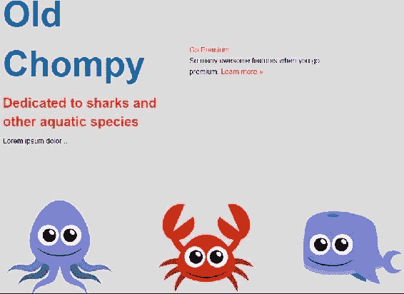

# 设计按钮的样式

让我们继续设计按钮。出于造型目的，让我们在 go premium 锚点标签中添加一类`call-to-action`:

```html
<a class="call-to-action" href="#">Go Premium</a>
```

快速查看最终站点，这就是我们使用 Go Premium 按钮的目的。它有白色边框、白色文本、蓝色渐变和大量填充:


悬停状态会移除渐变并将文本颜色和边框颜色更改为蓝色:


请注意，我们将无法使用上图中的网页字体。我们现在将使用纯蓝色背景代替渐变，因为我们将在下一节中回到它，并添加渐变以及在本书稍后返回字体。

在 CSS 中的`.go-premium`规则集下面，添加一个`.call-to-action`选择器和一个 2px 纯白边框。我们还将文本颜色设为白色，背景颜色设为蓝色。在顶部和底部添加`25px`的填充，在左侧和右侧位置添加零，因为我们最终将文本居中:

```html
/****************
Go Premium
****************/
.intro-content {
  width: 360px;
  margin-right: 60px;
  float: left;
}
.go-premium {
  width: 300px;
  float: left;
}
.call-to-action {
 border: 2px solid #fff;
 color: #fff;
 background-color: #0072ae;
 padding: 25px 0;
}
```

现在我们的按钮看起来有点时髦，因为锚是一个内嵌元素，它的填充没有向下推动它下面的文本。这就是内联元素的滚动方式:


解决这个问题最简单的方法是将显示更改为`block`:

```html
.call-to-action {
  border: 2px solid #fff;
  color: #fff;
  background-color: #0072ae;
  padding: 25px 0;
  display: block;
}
```

以下是前面代码的输出:


我们现在需要将文本对齐中心并添加圆角。像这样加上这些:

```html
.call-to-action {
  border: 2px solid #fff;
  color: #fff;
  background-color: #0072ae;
  padding: 25px 0;
  display: block;
  text-align: center;
  border-radius: 10px;
}
```

我们不再需要向边界半径添加供应商前缀，因为这个 CSS3 属性规范比同时需要供应商前缀的转换和转换属性更加成熟。刷新浏览器，您会看到我们的按钮开始变得非常好看:


现在我们可以增加字体大小和字体粗细:

```html
font-size: 22px;
font-weight: bold;
```

以下是前面代码的输出:

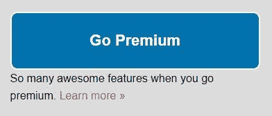

我们的按钮看起来棒极了。让我们添加悬停样式。在 CSS 中添加一个`:hover`和`:focus`选择器。我们需要将边框和文本的颜色从白色改为蓝色；`border-color`会处理好的。使用带有关键字`none`的`background`属性将去掉背景颜色:

```html
.call-to-action {
  border: 2px solid #fff;
  color: #fff;
  background-color: #0072ae;
  padding: 25px 0;
  display: block;
  text-align: center;
  border-radius: 10px;
}
.call-to-action:hover,
.call-to-action:focus {
 border-color: #0072ae; 
 color: #0072ae; 
 background: none;
}
```

如果我们现在转到我们的站点，将鼠标悬停在我们的按钮上或聚焦在按钮上，我们将看到行动号召按钮上的不同处理方式:

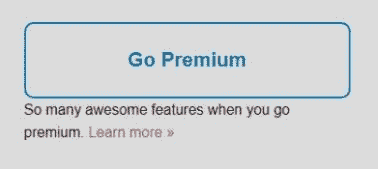

最后，让我们添加一个过渡，使状态变化更加微妙。在我们的 CSS 中，将带有供应商前缀的`transition: all .25s ease-in-out`添加到按钮的非悬停状态:

```html
.call-to-action {
  border: 2px solid #fff;
  color: #fff;
  background-color: #0072ae;
  padding: 25px 0;
  display: block;
  text-align: center;
  border-radius: 10px;
  font-size: 22px;
  font-weight: bold;
  -webkit-transition: all .25s ease-in-out;
 transition: all .25s ease-in-out;
}
```

添加过渡后，我们有了一个完全样式化的行动号召按钮(减去正确的网页字体和渐变)。

我们现在已经定位了行动号召区域，并设计了按钮本身，使其看起来更加出色。接下来，让我们完成行动号召按钮，并了解更多关于 CSS 渐变的信息。

# 梯度

我们的大“行动号召”按钮几乎完成。我们只需要添加一个渐变，就像变换、过渡和边界半径一样，是 CSS3 中的一个特性。

# 使用终极 CSS 渐变生成器

由于渐变规范和语法有些冗长，并且在不同浏览器之间不一致，所以使用它的最简单方法是通过一个应用来为我们创建 CSS 输出。通常，我会回避这类事情，因为我更喜欢自己编写代码，但我会为渐变破例。最终的 CSS 渐变生成器对我来说似乎非常好用。地点是[www.colorzilla.com/gradient-editor/](http://www.colorzilla.com/gradient-editor/)。我们拍摄的渐变非常简单。从顶部的浅蓝色到底部的深蓝色:

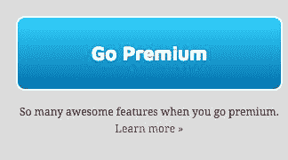

我们去 www.colorzilla.com/gradient-editor/吧。该工具默认如下。在右上角，甚至有一个预览:


默认情况下有四个颜色停止，我们只需要两个。所以点击渐变条中间的两个停靠点，把它们都删除。单击颜色停止按钮会显示一组新的控件，包括删除按钮:


我们的渐变条应该如下所示:


现在双击第一站。您的屏幕应该如下所示:


现在我们输入将要使用的颜色，也就是`33D3FF`，点击 OK。这是一个很好的类似 Photoshop 的界面:

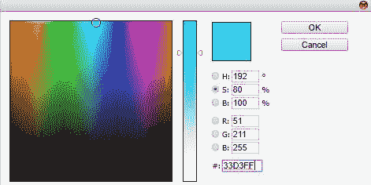

现在，双击第二个颜色停止并添加`00718e`颜色:


这种颜色和渐变看起来像我们一直在追求的。但是我们可以在渐变条上下移动颜色停止点一点来改变渐变。我要把它拖过来大约三分之一的距离:


我们还可以通过将尺寸更改为 370 x 100 来调整预览显示的高度，使其看起来更像我们实际的行动号召按钮的高度:

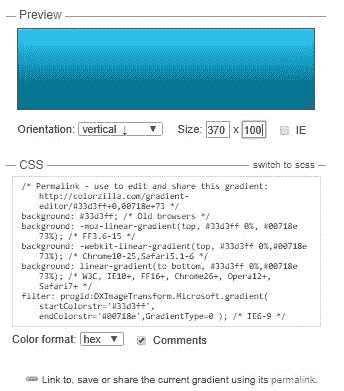

CSS 输出就在预览栏的下面。我们可以通过点击复制来复制它。切换到我们的 CSS 文件，并将其粘贴到我们的行动号召选择器中:

```html
.call-to-action {
  border: 2px solid #fff;
  color: #fff;
  background-color: #0072ae;
  padding: 25px 0;
  display: block;
  text-align: center;
  border-radius: 10px;
  font-size: 22px;
  font-weight: bold;
  -webkit-transition: all .25s ease-in-out;
  transition: all .25s ease-in-out;
  /* Permalink - use to edit and share this gradient: 
  http://colorzilla.com/gradient-editor/#33d3ff+0,00718e+73 */
 background: #33d3ff; /* Old browsers */
 background: -moz-linear-gradient(top, #33d3ff 0%, #00718e 73%); 
  /* FF3.6-15 */
 background: -webkit-gradient(top, #33d3ff 0%,#00718e 73%); 
  /* Chrome10-25,Safari5.1-6 */
 background: -webkit-linear-gradient(to bottom, #33d3ff 0%,#00718e 73%);      
  /* W3C, IE10+, FF16+, Chrome26+, Opera12+, Safari7+ */
 background: -o-linear-gradient(top, #33d3ff 0%, #0071ae 72%); 
  /* Opera 11.10+ */
 background: -ms-linear-gradient(top, #33d3ff 0%, #0071ae 72%); 
  /* IE10+ */
 background: linear-gradient(to bottom, #33d3ff 0%, #0071ae 72%); 
  /* W3C */
 filter: progid:DXImageTransform.Microsoft.gradient(startColorstr='#33d3ff', endColorstr='#00718e',GradientType=0 ); 
/* IE6-9 */
}
```

# 最终渐变生成器的 CSS 输出

终极渐变生成器创建了八种不同的属性。哇哦！首先是不支持渐变语法的旧浏览器的背景色:

```html
background: #33d3ff; /* Old browsers */
```

我们实际上想把它改成`#0072AE`，因为那是我们这个网站的官方品牌颜色。因此，添加并删除声明中前面提到的`background-color: #0072AE`属性:

```html
.call-to-action {
  border: 2px solid #fff;
  color: #fff;
  padding: 25px 0;
  display: block;
  text-align: center;
  border-radius: 10px;
  font-size: 22px;
  font-weight: bold;
  -webkit-transition: all .25s ease-in-out;
  transition: all .25s ease-in-out;
  /* Permalink - use to edit and share this gradient: 
  http://colorzilla.com/gradient-editor/#33d3ff+0,00718e+73 */
 background: #0072ae; /* Old browsers */
  background: -moz-linear-gradient(top, #33d3ff 0%, #00718e 73%); 
  /* FF3.6-15 */
  background: -webkit-gradient(top, #33d3ff 0%,#00718e 73%); 
  /* Chrome10-25,Safari5.1-6 */
  background: -webkit-linear-gradient(to bottom, #33d3ff 0%,#00718e 73%);      
  /* W3C, IE10+, FF16+, Chrome26+, Opera12+, Safari7+ */
  background: -o-linear-gradient(top, #33d3ff 0%, #0071ae 72%); 
  /* Opera 11.10+ */
  background: -ms-linear-gradient(top, #33d3ff 0%, #0071ae 72%); 
  /* IE10+ */
  background: linear-gradient(to bottom, #33d3ff 0%, #0071ae 72%); 
  /* W3C */
  filter: progid:DXImageTransform.Microsoft.gradient(startColorstr='#33d3ff', endColorstr='#00718e',GradientType=0 ); 
/* IE6-9 */
}
```

这是一吨生成的 CSS。如果我们仔细看看其中的一些，我想知道有多少人在使用火狐 3-15，而目前的版本是 55？当前版本为 60 时，Chrome 10-25 也是如此？

```html
background: -moz-linear-gradient(top, #33d3ff 0%, #00718e 73%); 
 /* FF3.6-15 */
background: -webkit-gradient(top, #33d3ff 0%,#00718e 73%); 
 /* Chrome10-25,Safari5.1-6 */
```

此外，Chrome 和 Firefox 都是常青树浏览器，这意味着它们会自动无声地更新自己，而不会提示用户。

所以，我需要对所有这些前缀版本有第二个看法。让我们看看“自动修复 CSS 在线”对此怎么说，[https://autoprefixer.github.io/](https://autoprefixer.github.io/)。Autoprefixer 自称为管理供应商前缀的工具。它添加缺失的前缀并删除过时的前缀...基于浏览器流行度的当前数据以及这些浏览器对供应商前缀的支持。

我将在 Autoprefixer 工具的左侧键入不带前缀的声明，它将根据我提供的浏览器流行度标准吐出需要哪些供应商前缀。我希望我的渐变在所有市场份额超过. 1%的浏览器中显示。

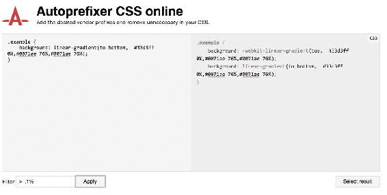

剩下的就是`-webkit-`厂商前缀和无前缀或 W3C 标准版本:

```html
background: -webkit-linear-gradient(top, #33d3ff 0%,#0071ae 76%,#0071ae 76%);     
background: linear-gradient(to bottom, #33d3ff 0%,#0071ae 76%,#0071ae 76%); }
```

让我们更新我们的规则集:

```html
.call-to-action {
  border: 2px solid #fff;
  color: #fff;
  padding: 25px 0;
  display: block;
  text-align: center;
  border-radius: 10px;
  font-size: 22px;
  font-weight: bold;
  -webkit-transition: all .25s ease-in-out;
  transition: all .25s ease-in-out;
 background: -webkit-linear-gradient(top, #33d3ff 0%,#0071ae   
  76%,#0071ae 76%);     
  background: linear-gradient(to bottom, #33d3ff 0%,#0071ae 76%,#0071ae 
  76%); }
}
```

我不知道你怎么样，但我对我们刚刚做的事情感觉很好！

我们会保存这个并转到我们的按钮。在浏览器刷新之前，您可以看到它是纯色的:


当我们刷新时，我们得到我们的渐变，如下图所示。这很好。它将适用于市场份额超过 0.1%的所有浏览器。

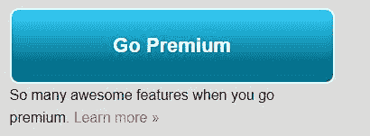

而且非常明确的是，我没有说 1%的市场份额。我说的是. 1%的市场份额。

在这一部分中，我们成功地设计了行动号召按钮，并使用一个为我们处理困难的程序应用了渐变，使我们能够更快地工作。

# 摘要

在本章中，您学习了如何使用模块化 CSS 创建按钮，并使用多个类来更改按钮的外观。您还发现了 CSS 特性是如何工作的，以及选择器是如何相互否决的。现在，您知道如何保持 CSS 的轻量级和可管理性。最后，您学习了如何使用过渡、悬停状态、变换和渐变来设计按钮的样式。

在下一章中，我们将继续创建我们的主要导航工具。通过这样做，您将了解 CSS 定位、CSS3 伪类、CSS3 动画，以及如何纯粹在 CSS 中创建下拉菜单。这真是太有趣了！