# 五、创建主导航和下拉菜单

在本章中，我们将为站点的主要导航构建所有的功能和演示。这一章相当深入，因为构建我们的主导航涉及到伪类；静态、绝对、相对和固定定位；和 CSS 动画。

# 开始导航

在这一节中，我们将从创建尽可能干净的 HTML 开始，然后插入基本的 CSS 来启动它。以下是我们的最终网站应该是什么样子；这就是我们的目标:


我们有一个典型的水平导航栏。有些项目有下拉菜单。我们还在导航条的左侧有一个鲨鱼标志，它很好地悬挂着。

# 用于构建菜单的语义 HTML

让我们直接进入并输入我们需要的 HTML。我们将从这个漂亮的大的 HTML 评论开始。你可能已经注意到了，我喜欢这些大个子。这是因为更容易快速找到我需要的部分代码:

```html
<!-- 
===============
Nav
===============
-->
```

我们将在 HTML5 `nav`元素中包装所有内容，并应用`grouping`类，因为我们将在其中浮动所有内容。clearfix 最终将是必要的，这样容器就不会崩溃:

```html
<!-- 
===============
Nav
===============
-->
<nav class="grouping">

</nav>
```

现在让我们添加一个`figure`元素来包装我们的鲨鱼图像:

```html
<nav class="grouping">
 <figure>
 
 </figure>
</nav>
```

接下来，我们将从`primary-nav`类开始一个无序列表。很久以前，人们就认为使用列表进行导航是非常语义化的，因为它本质上是一个链接列表:

```html
<nav class="grouping">
    <figure>
        
    </figure>
 <ul class="primary-nav">

 </ul>
</nav>
```

我们将从四个列表项开始。我们会在每一个里面放一个锚标签:

```html
<nav class="grouping">
    <figure>
        
    </figure>
    <ul class="primary-nav">
      <li><a href="#"></a></li> 
 <li><a href="#"></a></li> 
 <li><a href="#"></a></li> 
 <li><a href="#"></a></li> 
    </ul>
</nav>
```

当我们将此应用到我们的网站时，我们将得到一个鲨鱼图像和四个链接，全部垂直堆叠:


我们需要像块一样水平地布置这四个链接。我们将使用浮点和一些其他属性来实现这一点。

# 使用 CSS 为导航设置样式

在我们的 CSS 中，首先我们会找到导航的大块注释:

```html
/****************
nav
****************/
```

然后我们将瞄准`primary-nav`。上课。让我们使用一种特殊类型的后代选择器，它只针对列表项的第一级:

```html
.primary-nav > li
```

这很重要。我们这样做是因为稍后我们将在这些列表项中嵌套另一个无序列表，以获得一个下拉菜单。假设我们创建了相同的选择器，但没有大于符号:

```html
.primary-nav li
```

这针对的是`primary-nav`内部的任何一个`li`标签——孩子、孙子、曾孙等等。如果您只想针对直接子级，请使用此选择器；它被称为子组合器:

```html
.primary-nav > li
```

元素之间的大于号确保我们只针对直接子元素。让我们也将这些列表项向左浮动，然后刷新浏览器:

```html
.primary-nav > li {
 float: left;
}
```

以下是前面代码的输出:


这是一个开始；还有很多事情要做。

让我们使用相同类型的子组合器，仅针对`.primary-nav`的直接子列表项的直接子锚点:

```html
.primary-nav > li {
  float: left;
}
.primary-nav > li > a {

}
```

所以我们要在顶部加上`25px`的填充，在左右两边加上`0`。我们还会增加一个宽度；每一个都有`150px`宽，我们会给每一个一像素的纯色`border-left`，并给它们涂上灰色:

```html
.primary-nav > li > a {
 padding: 25px 0;
 width: 150px;
 border-left: 1px solid #ada791;
}
```

我们看到它现在开始有点像我们的最终导航:

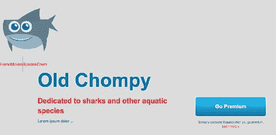

我们现在将把整个规则集放到 CSS 中，在主导航选择器下面:

```html
.primary-nav > li > a {
  padding: 25px 0;
  width: 150px;
  border-left: 1px solid #ada791;
}
nav li a{
 font-family: Arial, Helvetica, sans-serif;
 color: #766e65;
 text-transform: uppercase;
 font-size: 15px;
 text-align: center;
 -webkit-transition: 0.15s background-color linear;
 transition: 0.15s background-color linear;
}
```

对于我们将应用于主导航项以及下拉导航项的一些样式，这是一个更熟悉的后代选择器。这是一个很好的 **DRY** ( **不要重复自己**)方法，所以我们以后不必为下拉菜单重写这段代码。让我们更仔细地检查这个规则集。基本上，我们将`font-family`设置为`Arial`:

```html
font-family: Arial, Helvetica, sans-serif;
```

我们有这样的文字颜色:

```html
color: #766e65;
```

我们正在使用`text-transform: uppercase`。这将确保我们可以在 HTML 中为导航项目键入小写字母，并将这些字母中的每一个都转换为大写字符。这样，如果我们后来决定常规大小写比全大写要好，那么我们只需要在一个地方更改它，而不是更新整个 HTML:

```html
text-transform: uppercase;
```

接下来，我们有一个字体大小:

```html
font-size: 15px;
```

我们还将文本居中对齐:

```html
text-align: center;
```

我们还添加了一个过渡，如前一章所述。这是为了过渡背景颜色:

```html
-webkit-transition: 0.15s background-color linear;
transition: 0.15s background-color linear;
```

这是我们保存更改并刷新浏览器时得到的结果:


我们有些问题。一个问题是我们的锚标签是内联元素，所以实际上它们的行为不像块级元素。因此，我们可以做的一件事就是让它们也向左浮动。为此，向`.primary-nav > li > a`规则集添加一个`float: left`属性:

```html
.primary-nav > li > a {
  float: left;
  padding: 25px 0;
  width: 150px;
  border-left: 1px solid #ada791;
}
```

以下是前面代码的输出:

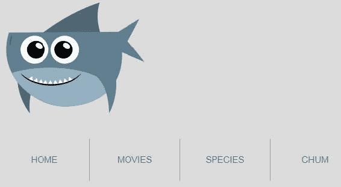

这看起来好多了。

现在让我们瞄准焦点和悬停状态。在上一个规则集下面，我们将添加另一个规则集:

```html
nav li a:focus,
nav li a:hover,
nav li a.active {
  background-color: #eb2428;
  color: #fff;
}
```

这不仅要针对焦点和悬停状态，还要针对`active`类。这不一定是“状态”，就像你会想到的聚焦或悬停状态一样。这是一个类，我们将把它应用到元素中，表示你在那个页面上。它将与悬停状态相同。接下来，我们将红色应用于背景，白色应用于文本。现在，当我们刷新它时，我们得到悬停和聚焦状态，这很好:

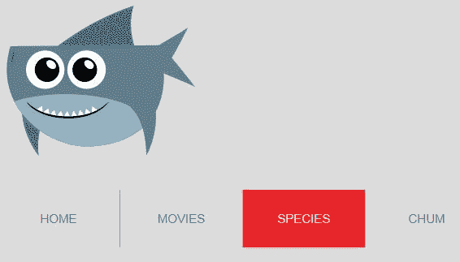

我们现在唯一要做的就是计算出导航条的位置，然后把整个东西推到右边，因为现在它就在我们的图像下面。让我们将整个导航条向右浮动。让我们这样做:

```html
.primary-nav {
  float: right;
}
```

以下是前面代码的输出:


正如你所看到的，这是相当好的结果。我们的整个导航都在鲨鱼下面。我们可以通过将鲨鱼浮动到左边来解决这个问题，但是如果我们使用绝对定位，可以实现一些不错的功能，这将在本章稍后介绍。

最后，让我们通过添加一个白色背景和限制我们的图像宽度为`160px`来稍微整理一下这个导航。

```html
/****************
nav
****************/
nav {
  background-color: #fff;
}
nav img {
  width: 160px;
}
```

这是没有白色背景的网站，我们的鲨鱼相当大:


不过，当我们刷新网站时，我们会得到我们想要的白色背景和一条较小的鲨鱼:


好了，我们已经为导航的第一层构建了 HTML 和大部分 CSS。接下来，您将学习伪类如何帮助解决导航中的某些问题。

# 使用伪类

您已经学习了如何将类添加到元素中，以对它们应用特殊的样式。您总是需要进入 HTML 来添加类。有时候这可能是个问题。例如，当内容通过内容管理系统动态生成时，您可能无法编辑任何元素，因为它可能不存在于静态 HTML 文件中。输入伪类。伪类允许您根据元素在 HTML 中的位置以及其他属性来定位元素。在这一节中，我们将看看`first-child`伪类，它可以帮助我们设计导航风格。然后我们将看看其他几个伪类，例如`last-child`和`nth-child`。

最终，我不希望作为第一个菜单的主菜单有`border-left`，因为它是第一个元素。所以，我想摆脱它:

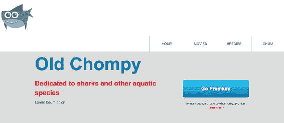

# 第一个孩子

为了瞄准我们 CSS 中的第一个元素，我们将在锚点元素后添加`first-child`。因此，我们将复制这个选择器，并将其粘贴到自身下面:

```html
.primary-nav > li > a {
  float: left;
  padding: 25px 0;
  width: 150px;
  border-left: 1px solid #ada791;
}
```

然后我们将`:first-child`添加到选择器中，删除属性，并添加`border-left`，其值设置为`none`:

```html
.primary-nav > li > a:first-child {
  border-left: none;
}
```

保存此内容，转到网站，并刷新页面:

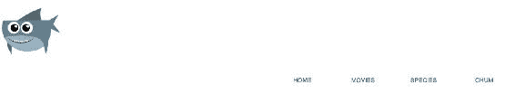

结果不是我们预期的那样。我们实际上移除了导航中每个项目的左边框。这是因为，首先，所有的主播都是他们的直系父母`li`里面的孩子。所以我们应该用不同的方式来解决这个问题。

快速浏览一下我们的 HTML 中的`nav`。锚是`li`里面的第一个元素；没有第二个元素。所以，如果我们想针对`ul`里面的第一个元素，那就不是主播，而是列表项，也就是`<li>`:

```html
<nav class="grouping">
    <figure>
        
    </figure>
    <ul class="primary-nav">
        <li><a href="#">Home</a></li>
        <li><a href="#">Movies</a></li>
        <li><a href="#">Species</a></li>
        <li><a href="#">Chum</a></li>
    </ul>
</nav>
```

在我们的 CSS 中，我们实际上要从这里移动伪类:

```html
.primary-nav > li > a:first-child {
```

我们将把它从`a`上取下，并将其连接到`li`上，如下所示:

```html
.primary-nav > li:first-child > a {
```

除了第一个元素，我们现在在所有的导航元素上都有了`border-left`属性:


`first-child`的一点是，它必须是出现在父元素内部的第一个元素。因此，即使我们特别将`li`作为主导航的第一个孩子，如果我们在第一个`li`标签之前在`ul`内部有其他东西，那么我们的选择器就不会工作。让我们看看这个。让我们添加一个`h2`作为`ul`元素的子元素:

```html
<nav class="grouping">
    <figure>
        
    </figure>
    <ul class="primary-nav">
        <h2>not valid html</h2>
        <li><a href="#">Home</a></li>
        <li><a href="#">Movies</a></li>
        <li><a href="#">Species</a></li>
        <li><a href="#">Chum</a></li>
    </ul>
</nav>
```

这不是有效的 HTML，但为了好玩，请注意，我们的左侧边框回到了第一个`li`标记:


那是因为它不再是第一个孩子了。`h2`现在是第一个孩子。这是使用`first-child`伪类时的常见错误。

# 最后一个孩子

现在我们来看看`last-child`伪类。让我们创建一个新的选择器:

```html
.primary-nav > li:last-child > a {

}
```

我们将背景颜色设置为亮粉色，文本颜色设置为白色，从而使示例更加明显:

```html
.primary-nav > li:last-child > a {
  background-color: deeppink
  color: #fff;
}
```

现在，我们的最后一个孩子应用了这些属性:


我更喜欢`first-child`，因为它对 IE7 的支持更深，而`last-child`的支持从 IE9 开始。

# 第 n 个子伪类

`nth-child`类允许我们选择元素在其父元素中的任何出现。让我们进入 CSS，将`last-child`更改为`nth-child(2)`:

```html
.primary-nav > li:nth-child(2) > a {
  background-color: deeppink;
  color: #fff;
}
```

保存代码并刷新网站:


因此，在我们的网站上，粉色实际上应该应用于`h2`和 HOME，因为`h2`是`ul`内部的第一个元素，HOME 是第二个元素。

如果你是一个 JavaScript 人，`nth-child`不是零索引的，所以第一个不是零:第一个是一。

考虑到这一点，让我们将`nth-child`设置为`1`:本质上与使用`first-child`相同；

```html
.primary-nav > li:nth-child(1) > a {
  background-color: deeppink;
  color: #fff;
}
```

让我们快速从我们的 HTML 中去掉这个`h2`标签:

```html
<nav class="grouping">
    <figure>
        
    </figure>
    <ul class="primary-nav">
        <!--<h2>not valid html</h2>-->
        <li><a href="#">Home</a></li>
        <li><a href="#">Movies</a></li>
        <li><a href="#">Species</a></li>
        <li><a href="#">Chum</a></li>
    </ul>
</nav>
```

我们现在看到粉色保留在第一个导航项目上:


也可以使用关键字`odd`和`even`。所以如果我把`even`或`odd`扔进去，你会得到应用了这些属性的数字 2 和 4:

```html
.primary-nav > li:nth-child(even) > a {
  background-color: deeppink;
  color: #fff;
}
```

刷新网站，您将获得以下结果:

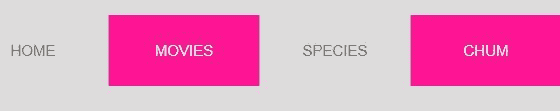

为了增加可读性，这是一种对表或列表进行斑马条纹化的优秀技术。

# 第 n 类伪类

还有`nth-of-type`。将`nth-of-type(2)`添加到我们 CSS 中的`primary-nav`选择器中:

```html
.primary-nav > li:nth-of-type(2) > a {
  background-color: deeppink;
  color: #fff;
}
```

`nth-of-type`和`nth-child`的区别在于`nth-of-type`被预先限定只寻找它所附着的元素。例如，在我们的例子中，我们将`nth-of-type`附加到了一个`li`上，因此它只匹配`li`标签:

```html
.primary-nav > li:nth-of-type(2) > a {
  background-color: deeppink;
  color: #fff;
}
```

让我们看看这是怎么回事。让我们重新添加我们的`h2`标签:

```html
<nav class="grouping">
    <figure>
        
    </figure>
    <ul class="primary-nav">
        <h2>not valid html</h2>
        <li><a href="#">Home</a></li>
        <li><a href="#">Movies</a></li>
        <li><a href="#">Species</a></li>
        <li><a href="#">Chum</a></li>
    </ul>
</nav>
```

它不会仅仅指`ul`里面的任何一个孩子。我们现在看到第二个`li`标签应用了以下属性:

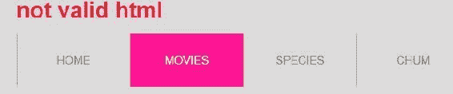

所以`nth-of-type`比`nth-child`更精准。对`nth-child`和`nth-of-type`的浏览器支持始于 IE9 和更高版本，以及其他主要浏览器。

在本节中，我们了解了一些伪类，它们允许您根据元素在 HTML 中的顺序来定位元素。然而，这些并不是我们到目前为止使用的第一个伪类。我主要指的是基于状态的伪类，比如`hover`和`focus`，到目前为止我们已经用了很多了。在下一节中，我们将切换话题并讨论 CSS 定位，以进一步推进我们的导航。

# 绝对定位

在本节中，我们将开始研究不同的 CSS 定位属性，以及它们的互补偏移属性。首先，我们将绝对定位鲨鱼标志，并通过对整个导航栏使用固定定位来跟进。

# 绝对定位鲨鱼

我们已经准备好了菜单，但是鲨鱼显然在导航的最上面。我们需要它水平对齐，或多或少。我们需要修复鲨鱼，让它悬在导航条上。我们还希望整个导航保持在浏览器窗口的顶部:

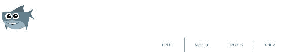

所以让我们转到 CSS，将`position: absolute`添加到`nav figure`选择器中。在`nav`规则集下创建一个新的选择器。我们称之为`nav figure`，给它一个`position`房产，价值`absolute`:

```html
/****************
nav
****************/
nav {
  background-color: #fff;
}
nav figure{
  position: absolute;
}
nav img {
  width: 160px;
}
```

马上，这看起来好多了:


让我们谈谈我们刚刚做的事情。默认情况下，所有元素都有一个`static`位置。静态元素遵循*正常流程*，这意味着只要块级元素没有浮动，它们就简单地堆叠在彼此之上。将`position`更改为`absolute`会使其脱离正常流程。它的块质量消失了，其他元素完全不受它的影响。它可以被认为是存在于另一个平面或层面的东西。绝对定位后，可以开始使用偏移属性，如`top`、`right`、`bottom`和`left`。

就这么办吧。给`nav figure`元素增加两个属性，即`top`和`left`:

```html
nav figure{
  position: absolute;
  top: -50px;
  left: 50px;
}
```

这些功能很像`margin-top`和`margin-left`。如果你查看结果，你应该看到鲨鱼从左边是`50px`，从顶部是`-50px`:

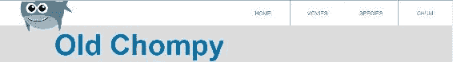

那么当我们将`top`属性切换为`bottom`并将`left`属性切换为`right`时会发生什么呢:

```html
nav figure{
  position: absolute;
  bottom: : -50px;
  right: 50px;
}
```

它实际上将鲨鱼一直移动到页面的底部和右侧！

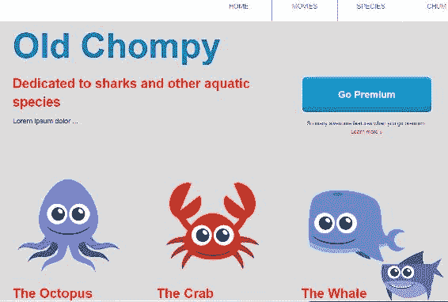

这张图片更清楚地显示了偏移属性如何与绝对定位相结合。偏移属性现在基于浏览器视口，但通常我们不想这样做；相反，我们希望通过将父元素设置为`position: relative`来使其绝对位置基于其父元素。

图像的父元素是`nav`选择器，所以我们将其设置为相对:

```html
nav {
  background-color: #fff;
  position: relative;
}
nav figure{
  position: absolute;
  bottom: -50px;
  right: 50px;
}
```

你可以看到，即使现在我们从右边`50px`因为导航一直延伸到右边，我们从导航底部`-50px`因为鲨鱼在那里的导航条下面延伸:


`position: relative`声明通过`position: absolute`将自身建立为子元素的坐标系。

让我们把鲨鱼移回它应该在的地方:

```html
nav figure{
  position: absolute;
 top: -20px;
 left: 50px;
}
```

鲨鱼和我们的导航条重叠得很好。它现在位于我们的头条，这有点好笑，但我们过一会儿会回到这个话题:


首先，让我们通过添加`position: fixed`使整个导航条贴在顶部。

# 使用导航条的固定定位

让我们将导航条的`position`属性从`absolute`更改为`fixed`，看看结果:

```html
nav {
  background-color: #fff;
  position: fixed;
}
```

以下是前面代码的输出:


`fixed`值，如`relative`，对于任何绝对定位的子元素或后代元素来说，仍然像一个坐标系，但它也有一些超能力。*现在，那些超级大国完全破坏了我们的导航。*问题来了:`position: relative`仍然保持着它的方块元素特性，而`position: fixed`在从*正常流程*中移除后，失去了很多这些方块特性，而且导航现在看起来有点滑稽:它没有延伸到浏览器窗口的整个宽度。让我们用一些偏移属性来解决这个问题。

我们可以通过说出`left: 0`和`right: 0`来扩展导航。让我们也加上`top: 0`以确保毫无疑问它将位于最顶端:

```html
nav {
  background-color: #fff;
  position: fixed;
 left: 0;
 right: 0;
 top: 0;
}
```

那看起来更好。而且，由于导航的位置被设置为固定，当我们向下滚动页面时，导航中的所有内容都被粘在顶部，其他内容都在它下面移动:


如果你一直滚动到顶部，你会看到网站标题现在位于导航的后面。这是因为导航不再是正常流程的一部分:

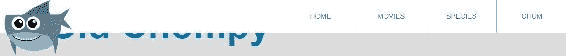

让我们通过添加`margin-top`到`intro-content`和我们的`go-premium`按钮来解决这个问题。我们将转到`go-premium`规则集，并将`150px`的值添加到`margin-top`:

```html
.go-premium {
  width: 300px;
  float: left;
  margin-top: 150px;
}
```

我们还将转到我们的`intro-content`规则集，并添加一个`125px`的`margin-top`:

```html
.intro-content {
  width: 600px;
  margin-right: 60px;
  float: left;
  margin-top: 125px;
}
```

现在看起来非常好:


因此，您已经了解了相对定位、绝对定位和固定定位。您还了解到每个元素的默认位置是静态的。`relative`位置为孩子创建一个坐标系。`absolute`位置允许您将元素移动到自己的宇宙中，并根据最近的相对定位的父元素积极地定位它。`fixed`位置将根据浏览器的视口使元素具有粘性，而不是基于任何相对定位的元素。相对于其他子元素，`absolute`和`fixed`元素都将作为坐标系。在下一节中，我们将查看构建下拉菜单，在这里我们将再次使用绝对定位。

# 构建下拉菜单

让我们创建一个纯 CSS 下拉菜单！我们将从添加标记开始，然后添加 CSS。

# 创建基本的 HTML 列表

通常，当构建一个组件(如下拉菜单)时，它通常是隐藏的，我构建它时就好像它没有隐藏一样。然后，一旦它完成并完全样式化，我就创建下拉行为。这也是我们在这里要做的。所以让我们在现有的`index.html`文档中创建 HTML。我们将进入导航条的无序列表，如下所示:

```html
<nav class="grouping">
    <figure>
        
    </figure>
    <ul class="primary-nav grouping">
        <li><a href="#">Home</a></li> 
        <li><a href="shark-movies.html">Movies</a></li>
        <li><a href="#">Species</a></li>
        <li><a href="#">Chum</a></li>
    </ul>
</nav>
```

最佳做法是在无序列表中构建菜单，其中每个菜单项都是列表项中的一个锚点。对于下拉菜单，我们需要用下拉菜单在`li`内嵌套另一个`ul`标签。我们将把它嵌套在这里:

```html
<li><a href="shark-movies.html">Movies</a></li>
```

但是首先，我们将添加一个名为`has-submenu`的特殊类到任何有下拉菜单的导航项目中:

```html
<li class="has-submenu"><a href="shark-movies.html">Movies</a></li>
```

这样，通过`has-submenu`类，我们可以在 CSS 中专门针对这些`li`标签及其后代。在这部电影的`li`标签中，我们将创建一个带有`li`标签的新`ul`，在这些`li`标签中，我们将放入一个锚标签。下面是下拉菜单的标记:

```html
<nav class="grouping">
    <figure>
        
    </figure>
    <ul class="primary-nav grouping">
        <li><a href="#">Home</a></li> 
       <li class="has-submenu"><a href="shark-movies.html">Movies</a>
 <ul>
 <li><a href="#">Jaws</a></li>
 <li><a href="#">Sharknado</a></li>
 <li><a href="#">Open Water</a></li>
 </ul>
        </li>
        <li><a href="#">Species</a></li>
        <li><a href="#">Chum</a></li>
    </ul>
</nav>

```

下拉菜单中有三个子菜单:


我们只需要把它做成我们的最终菜单。

# 设置下拉菜单的样式

我们需要适当地设计下拉菜单，以适应我们现有的菜单。这就是我们要达到的效果:


我想把下拉菜单的样式和主导航的样式分开。为此，我们将在主导航下方创建一个大的`Drop Down Menu`评论:

```html
/****************
Drop Down Menu
****************/
```

下拉菜单在这里可以有自己的小部分。所以让我们从仅仅瞄准`has-sub menu`内部的`ul`开始。为了将子菜单放置在白色导航条之外，让我们从`top`将其绝对定位到`70px`:

```html
/****************
Drop Down Menu
****************/
.has-submenu ul{
 position: absolute;
 top: 70px;
}
```

这给了我们以下效果:


现在我们需要做的就是设计下拉菜单的样式，让它看起来像它应该的那样。请注意，在我们的网站上，没有一个`li`标签像我们的主导航一样向左浮动。这是因为，你会记得，我们使用了一种后代选择器，它只针对`primary-nav`的直系子孙`li`。我们不需要取消以前的那些风格。让我们回到过去，看看如果我们不改变这些选择器会发生什么。

下面是子组合选择器的位置:

```html
.primary-nav > li {
  float: left;
}
.primary-nav > li > a {
  float: left;
  padding: 25px 0;
  width: 150px;
  border-left: 1px solid #ada791;
}
```

为了快速测试，让我们从两个选择器中删除大于符号:

```html
.primary-nav li {
  float: left;
}
.primary-nav li a {
  float: left;
  padding: 25px 0;
  width: 150px;
  border-left: 1px solid #ada791;
}
```

看起来是这样的:


请注意，我们在顶部菜单中的所有样式都在子菜单中重复出现。这是我们想要避免的，因为我们不想写额外的 CSS 来抵消整个菜单向左浮动，并在我们不需要的地方有边框。所以让我们把那些大于符号加回我们的`.primary-nav`选择器:

```html
.primary-nav > li {
  float: left;
}
.primary-nav > li > a {
  float: left;
  padding: 25px 0;
  width: 150px;
  border-left: 1px solid #ada791;
}
```

好的，让我们给`.has-submenu`加上白色背景和边框。其中更改`background-color`并在底部、左侧和右侧添加边框。我们不希望顶部有边框，因此我们将使用`border-bottom`、`border-left`和`border-right`而不是`border`简写:

```html
/****************
Drop Down Menu
****************/
.has-submenu ul {
  position: absolute;
  top: 70px;
  background-color: #fff;
 border-bottom: 1px solid #ada791;
 border-left: 1px solid #ada791;
 border-right: 1px solid #ada791;
}
```

现在它开始像一个下拉菜单:

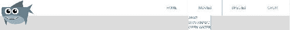

其中一个明显的问题是宽度。我们需要给它一个`150px`的`width`来匹配它的父元素的宽度。另外，让我们将`border-radius`添加到`bottom-left`和`bottom-right`角:

```html
/****************
Drop Down Menu
****************/
.has-submenu ul{
  position: absolute;
  top: 70px;
  background-color: #fff;
  border-bottom: 1px solid #ada791;
  border-left: 1px solid #ada791;
  border-right: 1px solid #ada791;
  width: 150px;
 border-radius: 0 0 15px 15px
}
```

注意`border-radius`的简写。这与边距和填充速记非常相似。第一个值是左上角的，然后从那里开始顺时针旋转。所以第二个值是右上角的，第三个是右下角的，第四个是左下角的。

现在我们有了我们需要的`width`和`border-radius`:


一个奇怪的事情是，它看起来像我们的导航项目的文本没有居中对齐。锚点元素的文本居中对齐。如果您通过右键单击`a`标签文本并选择“检查”来检查该元素，您可以看到这一点:


问题是`li`标签采用全宽，而`a`标签是内嵌元素，只占用它们需要的宽度。让我们添加一个新的选择器:`.has-submenu a`，顶部和底部分别是`display: block`和`20px`的`padding`；

```html
.has-submenu a{
  display: block;
  padding: 20px 0;
}
```

下拉菜单看起来好多了:

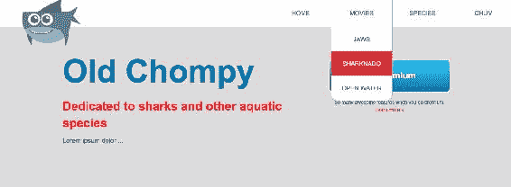

我们的悬停状态从我们的主导航中延续下来，这很好。唯一的问题是，我们最后的悬停状态-开放水域-隐藏了圆角:


# 修复悬停状态

当我们悬停在**开放水域**子菜单项上时，有两种方法可以修复圆角丢失。第一种是使用`last-child`伪类，这是您在前面几节中学习的，来定位子菜单的`a`选择器和最后一个`li`选择器。这应该可以正常工作，但是如果我们想获得更深入的浏览器支持，我们需要使用不同的技术，在`ul`元素(父元素)上使用`overflow: hidden`。我倾向于喜欢这里的`overflow: hidden`方法，因为它很小，并且有更深的浏览器支持:

```html
/****************
Drop Down Menu
****************/
.has-submenu ul{
  position: absolute;
  top: 70px;
  background-color: #fff;
  border-bottom: 1px solid #ada791;
  border-left: 1px solid #ada791;
  border-right: 1px solid #ada791;
  width: 150px;
  border-radius: 0 0 15px 15px;
  overflow: hidden;
}
```

如果我们现在看看浏览器，问题就解决了:


现在只剩下静态菜单了。它总是开着的。我们需要创建一个下拉行为，当您将鼠标悬停在 MOVIES 导航项目上时出现。一种方法是默认隐藏下拉菜单，然后使用`hover`和`focus`伪类显示。

默认使用`display: none`隐藏下拉菜单。让我们从使用`display: none`隐藏整个`ul`标签开始:

```html
/****************
Drop Down Menu
****************/
.has-submenu ul{
  position: absolute;
  top: 70px;
  background-color: #fff;
  border-bottom: 1px solid #ada791;
  border-left: 1px solid #ada791;
  border-right: 1px solid #ada791;
  width: 150px;
  border-radius: 0 0 15px 15px;
  overflow: hidden;
  display: none;
}
```

只有通过创建一个新的选择器`.has-submenu:hover ul`，当`has-submenu`悬停时，我们才能锁定`ul`:

```html
/****************
Drop Down Menu
****************/
.has-submenu ul{
  position: absolute;
  top: 70px;
  background-color: #fff;
  border-bottom: 1px solid #ada791;
  border-left: 1px solid #ada791;
  border-right: 1px solid #ada791;
  width: 150px;
  border-radius: 0 0 15px 15px;
  display: none;
}
.has-submenu a {
  display: block;
  padding: 20px 0;
}
.has-submenu:hover ul {
 display: block;
}
```

根据此规则集，每当您将鼠标悬停在电影菜单上时，位于其中的`ul`元素将会显示出来。然后，因为我们在前一个选择器中添加了`display: none`—默认情况下，非重叠状态下，作为下拉菜单的`ul`标签将不显示。默认情况下，现在没有可用的子菜单:

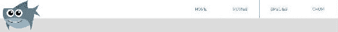

现在，当我们将鼠标悬停在“电影”菜单上时，会出现子菜单:

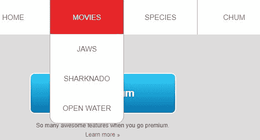

One thing I should also mention is that `display: none` has accessibility issues, as screen readers are unable to announce content with `display: none`.

还有一个选择:使用**屏下隐藏技术**，这需要一点额外的工作，但非常值得。

# 使用屏幕外隐藏技术隐藏下拉菜单

基本思想是将一个元素绝对放置在离可见屏幕很远很远的地方，这样它就不可见了，但是屏幕阅读器仍然可以宣布它。关于可访问性，还有很多需要学习的地方。我建议你先看看[https://CSS-ticks . com/places-its-诱人使用-display-none-但-don/](https://css-tricks.com/places-its-tempting-to-use-display-none-but-dont/)上的文章，了解更多信息，至少了解如何使用屏幕外隐藏技术，然后再从那里了解可访问性:

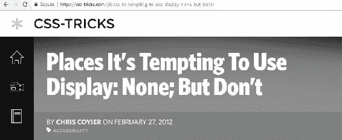

网络可访问性是一个非常有深度的话题，值得写一本自己的书。所以我在这里不能完全公正。虽然，我们可以用类似下面的东西来替换它，而不是使用`display: none`来隐藏我们的下拉菜单，以使它更容易访问:

```html
.accessibly-hidden {
  position: absolute;
  top: -9999px;
  left: -9999px;
}
```

这将对有视力的用户隐藏*内容，但仍向屏幕阅读器用户公布内容。*

 *我们已经把下拉菜单放在床上，没有太多大惊小怪。结果很完美。您第一次尝试创建下拉菜单可能并不总是如此顺利，但是使用这些技巧，您可以避免创建下拉菜单时可能遇到的一些问题。

我最大的两个建议如下:

*   最初构建下拉菜单，就好像它总是可见的一样，然后在你设计好之后隐藏它，它看起来很好。
*   由于推荐的方法是在无序列表中使用无序列表，因此值得仔细设置规则集以避免混淆。例如，一个适用于父级`ul`和子级`ul`(即`ul li`)的样式规则集；另一个规则集仅适用于使用子组合符的父级`ul`和`li`选择器(即`ul > li`)；最后，一个只适用于孩子的规则集`ul`(即`.has-submenu ul`)。这样，您就不必在以后为孩子`ul`创建一堆潜在的混淆覆盖样式。

导航的下一部分需要我们实际创建下拉效果；我们将使用一个 CSS 动画来实现这一点。

# CSS 动画(第 1 部分)

我们的主导航现在已经整合在一起，我们的下拉功能几乎已经完成。下拉菜单所需的最后一个收尾工作是 CSS 动画，以允许下拉菜单平滑地向下动画。动画非常有趣，现代浏览器，包括 Chrome、火狐、Opera 以及从 IE10 开始的浏览器都支持动画。IE9 仍然会显示一个下拉菜单，但它会简单地出现/消失。动画非常类似于过渡，但我们可以制作静态元素的动画，并使用不同的动画属性和关键帧来控制动画，而不是简单地制作状态变化的动画。我们稍后会深入讨论。这就是我们在这一部分要做的:我们将在我们想要制作动画的元素的选择器中定义`animation-name`、`animation-duration`和`animation-timing-function`。之后，我们将继续定义我们要制作动画的关键帧。

# 定义动画名称、持续时间和计时功能

让我们回忆一下下拉菜单的 CSS:

```html
/****************
Drop Down Menu
****************/
.has-submenu ul{
  position: absolute;
  top: 70px;
  background-color: #fff;
  border-bottom: 1px solid #ada791;
  border-left: 1px solid #ada791;
  border-right: 1px solid #ada791;
  width: 150px;
  border-radius: 0 0 15px 15px;
  overflow: hidden;
  display: none;
}
.has-submenu a {
  display: block;
  padding: 20px 0;
}
.has-submenu:hover ul {
  display: block;
}
```

让我们将`has-submenu`的`hover`状态定位如下:

```html
.has-submenu:hover ul {
  display: block;
}
```

现在，我们将使用非固定的/W3C 标准属性名，并返回并在末尾添加所需的前缀。所以，做一个动画，我们用`animation-name`，用`slideDown`作为动画名:

```html
.has-submenu:hover ul {
  display: block;
 animation-name: slideDown;
}
```

我可以给这个动画起任何我想要的名字，只要我不使用任何空格。就像类名一样，我也不能以数字开头。此外，关键字 **none** 不能用作动画名称，因为它被保留为移除动画的特殊关键字。接下来，我们将以秒为单位指定动画持续时间，以及动画的计时功能:

```html
.has-submenu:hover ul {
  display: block;
  animation-name:slideDown;
 animation-duration: .25s;
 animation-timing-function: ease;
}
```

对于`timing-function`我已经使用了`ease`，但是你也可以指定`linear`、`ease-in`、`ease-out`和`ease-in-out`功能，这些都是我们用于`transitions`的定时功能。这段代码本身没有任何作用。我们必须指定当我们使用`@keyframes`制作动画时会发生什么。因此，在最后一个规则集下面，我们将添加一个`@keyframes` *at-rule* ，其动画名称与我们之前提出的`slideDown`相同:

```html
@keyframes slideDown {
}
```

在大括号内，我们将指定`from`和`to`时间偏移:

```html
@keyframes slideDown {
  from {}
 to {}
}
```

`from`花括号内的内容将是起点，`to`花括号内的内容将是动画的终点。我们可以在动画中加入几个属性；让我们从负 100%的`translateY`变换函数开始:

```html
@keyframes slideDown {
  from {transform: translateY(-100%);}
  to {}
}
```

这将把无序列表上移负 100%，使其成为起点。百分比是元素的高度。`50%`会将其向下移动元素高度的一半，而`100%`会将其向下移动元素的整个高度。所以`-100%`将把它垂直向上推到元素的整个高度。`translateY`功能在我们这里是新的。很像`translate`，只不过是垂直翻译。`translateX`功能可以做横向平移。在`to`花括号内，我们将`translateY`设置为`0%`:

```html
@keyframes slideDown {
  from {transform: translateY(-100%);}
  to {transform: translateY(0%);}
}
```

我们现在可以看到菜单向下移动:


# 设置附加关键帧

到目前为止，我们的动画可以很容易地用一个`transition`来完成，因为没有新的东西真正被引入。但是动画的力量来自于我们可以设置额外的关键帧。让我们将 CSS 中的`from`和`to`分别更改为`0%`和`100%`，如下所示:

```html
@keyframes slideDown {
  0% {transform: translateY(-100%);}
  100% {transform: translateY(0%);}
}
```

我们可以在这两点之间添加任意数量的停靠点，而不是只添加起点和终点。让我们添加一个新的关键帧，比如`90%`，带有一个`10%`的`translateY`:

```html
@keyframes slideDown {
  0% {transform: translateY(-100%);}
  90% {transform: translateY(10%);}
  100% {transform: translateY(0%);}
}
```

在那 0.25 秒的第一个`90%`时间内，我们将下拉菜单的位置从`-100%`转换到`10%`。然后，在 0.25 秒的最后 10%中，垂直运动从`10%`进行到`0%`。这给了动画一点跳跃，或反弹，在最后:

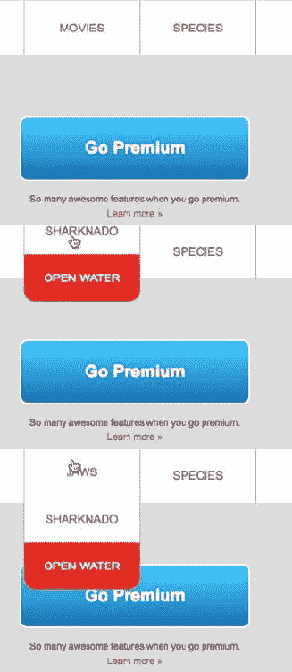

我们不仅可以添加多个关键帧，还可以为每个关键帧添加多个属性。所以让我们在动画中加入`opacity`。假设我们从关键帧不可见开始，以`1`的不透明度结束，这是完全可见的。我们不会在 90%关键帧处设置不透明度动画:

```html
@keyframes slideDown {
  0% {transform: translateY(-100%);opacity: 0;}
  90% {transform: translateY(10%);}
  100% {transform: translateY(0%);opacity: 1;}
}
```

菜单现在向下移动并淡入:


# 供应商前缀

为了总结我们的下拉动画，让我们通过添加必要的供应商前缀来获得最大限度的浏览器支持:

```html
/****************
Drop Down Menu
****************/
@-webkit-keyframes slideDown {
 0% {-webkit-transform: translateY(-100%); opacity: 0; }
 90% {-webkit-transform: translateY(10%);}
 100% {-webkit-transform: translateY(0%); opacity: 1; }
}
@keyframes slideDown {
  0% {transform: translateY(-100%); opacity: 0; }
  90% {transform: translateY(10%);}
  100% {transform: translateY(0%); opacity: 1; }
}
.has-submenu ul{
  position: absolute;
  top: 70px;
  background-color: #fff;
  border-bottom: 1px solid #ada791;
  border-left: 1px solid #ada791;
  border-right: 1px solid #ada791;
  width: 150px;
  border-radius: 0 0 15px 15px;
  overflow: hidden;
  display: none;
}
.has-submenu a {
  display: block;
  padding: 20px 0;
}
.has-submenu:hover ul {
  display: block;
 -webkit-animation-name: slideDown;
  animation-name: slideDown;
 -webkit-animation-duration: 2.5s;
  animation-duration: 2.5s;
 -webkit-animation-timing-function: ease;
  animation-timing-function: ease;
}
```

两个`@keyframes`动画都需要`-webkit-`厂商前缀，以及`transform`、`animation-name`、`animation-duration`和`animation-timing-function`属性。

当我们到达这一部分的末尾时，我们已经准备好了下拉菜单动画。IE10 及更高版本支持 CSS 动画，因此旧版本的 IE 和其他旧浏览器不会显示动画，但它们仍然可以访问菜单及其所有内容。在我们的例子中，因为它只是整体体验的一个额外接触，如果旧浏览器错过了这一点，这并不是一个严重的问题；他们仍然可以获得他们需要的所有核心内容。在下一节中，我们将继续使用 CSS 动画，通过实验我们的鲨鱼标志来创建一个更加健壮的动画。

# CSS 动画(第 2 部分)

我们的主导航下拉菜单的滑动动作已经完成。现在让我们通过实验我们的鲨鱼标志和探索其他动画属性来深入研究 CSS 动画，例如`delay`、`iteration-count`、`fill-mode`，以及`animation`——这是简写。

# 动画延迟、迭代计数和填充模式

让我们为鲨鱼图像添加一个动画，以获得动画可以做什么的不同视角，并让它在每次页面加载时发生。我们将其命名为`crazyShark`:

```html
nav figure {
  position: absolute;
  top: -20px;
  left: 50px;
 animation-name: crazyShark;
 animation-duration: .25s;
 animation-timing-function: ease;
}
@-webkit-keyframes crazyShark {

}
nav img {
  width: 160px;
}
```

让我们添加一组同时平移和旋转鲨鱼图像的`@keyframes`:

```html
@keyframes crazyShark {
  0% {transform: translate(90%, 70%);}
 33% {transform: translate(40%, 20%) rotate(90deg);}
 66% {transform: translate(10%);}
 100% {transform: translate(0%) rotate(0deg);}
}
```

现在，让我们转到动画属性，将持续时间从`0.25`秒更改为`1`秒:

```html
animation-duration: 1s;
```

鲨鱼真的在移动，因此我们的动画被命名为`crazyShark`:

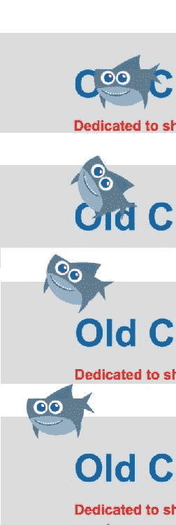

请注意，我使用的`translate`语法与我们之前使用的略有不同。用逗号分隔的两个值分别代表 *x* 和 *y* 坐标，而当 *x* 和 *y* 坐标相同时，可以使用一个值:

```html
/*translate shorthands for translateX and translateY*/

transform: translate(40%, 20%); 
/*2 values (x first, y second) when both values are different*/

transform: translate(10%); 
/*1 value is used when x and y coordinates are the same*/
```

还有其他几个动画属性，其中两个是`animation-delay`和`animation-iteration-count`。我发现这两者都很有用:

```html
nav figure {
  position: absolute;
  top: -20px;
  left: 50px;
  animation-name: crazyShark;
  animation-duration: 1s;
  animation-timing-function: ease;
 animation-delay: 2s;
 animation-iteration-count: 2;
}
```

现在，在动画开始之前，我们将有一个`2`秒的延迟，*我不会试图用书的形式来说明*。那么它应该完整地动画化两次:

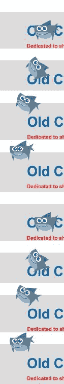

如果我们愿意，我们也可以无休止地重复动画；我们只需添加`infinite`关键字而不是数字，鲨鱼就会永远继续前进。*我也绝对不会试图用书的形式来说明这一点！*让我们摆脱`animation-delay`和`animation-iteration-count`:

```html
nav figure {
  position: absolute;
  top: -20px;
  left: 50px;
  animation-name: crazyShark;
  animation-duration: 1s;
  animation-timing-function: ease;
}
```

# 动画填充模式

动画填充模式属性告诉被动画化的元素在动画开始之前和动画完成之后如何处理自己。使用`animation-fill-mode`填充动画前后的空间。我们还不需要`animation-fill-mode`房产。这是因为 shark 动画从页面加载开始，然后将 shark 置于其静态位置——我们说的是不平移和不旋转:

```html
 100% {transform: translate(0%) rotate(0deg);}
```

然而，如果我们以 10%的 *x* 、70%的 *y* 和 10 度的旋转来结束动画呢？

```html
 100% {transform: translate(10%, 70%) rotate(10deg);}
```

如果应用这一点并转到该站点，您会注意到鲨鱼似乎会在第一个标题附近结束动画，然后跳回其原始位置。下面两张截图说明了这一点:

动画最后的鲨鱼:


鲨鱼按照动画传送到它的静态位置:

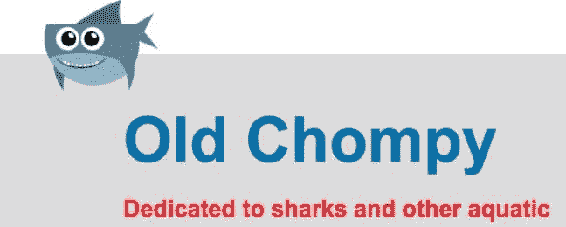

我们可以用`animation-fill-mode: forwards`来解决这个问题:

```html
nav figure {
  position: absolute;
  top: -20px;
  left: 50px;
  animation-name: crazyShark;
  animation-duration: 1s;
  animation-timing-function: ease;
  animation-delay: 2s;
  animation-iteration-count: 2;
 animation-fill-mode: forwards;
}
```

现在，动画结束后，鲨鱼将停留在该位置，而不会跳回其原始位置:


太棒了！

值为`backwards`的`animation-fill-mode`属性将确保正在制作动画的元素在动画开始之前就已经被*填充到其起始位置*。`both`关键字是填充开始和结束位置的一种方式。

让我们将规则集简化为这三个动画属性:

```html
animation-name: crazyShark;
animation-duration: 1s;
animation-timing-function: ease;
```

让我们也润色一下整个动画。这样，我们的狂鲨就会变得不那么疯狂了，*但还是够疯狂的*:

```html
@keyframes crazyShark {
  0% {transform: translate(90%, 70%);opacity: 0;} 
  33% {transform: translate(40%, 20%) rotate(90deg);}
  66% {transform: translate(10%, 50%);}
  100% {transform: translate(0%) rotate(0deg);opacity: 1;} 
}
```

我们必须为每个动画属性添加供应商前缀。但是，在我们这样做之前，让我们使用动画属性简写，将所有动画属性组合成一行，让我们的编码生活变得更容易。

# 使用动画速记

在我们的`nav figure`规则集中获取这些声明:

```html
animation-name: crazyShark;
animation-duration: 1s;
animation-timing-function: ease;
```

从`animation-name`和最下面的两个声明中删除`-name`；所以我们只剩下这个:

```html
 animation: crazyShark;
```

现在，我们将添加`1s`和`ease`:

```html
 animation: crazyShark 1s ease;
```

以下是我们现在应该结束的内容:

```html
nav figure {
  position: absolute;
  top: -20px;
  left: 50px;
 animation: crazyShark 1s ease;
}
```

此外，您可以将所有不同的动画属性转储到一个速记中。只要`animation-duration`在`animation-delay`之前，你把它们按什么顺序放进去并不重要。下面是一种使用所有动画属性的可能方法，我们已经在一个方便的简写中讨论过:

```html
animation: [name] [duration] [timing-function] [delay] [fill-mode] [iteration-count];
```

现在我们已经有了简写，添加供应商前缀版本会更容易一些。

# 供应商前缀

让我们添加`animation`属性的`-webkit-`前缀版本:

```html
nav figure {
  position: absolute;
  top: -20px;
  left: 50px;
 -webkit-animation: crazyShark 1s ease;
  animation: crazyShark 1s ease;
}
```

我们将对`@keyframes`进行同样的操作:

```html
@-webkit-keyframes crazyShark {
 0% {-webkit-transform: translate(90%, 70%);opacity: 0;}
 33% {-webkit-transform: translate(40%, 20%);}
 66% {-webkit-transform: translate(10%, 50%);}
 100% {-webkit-transform: translate(0%);opacity: 1;}
}
@keyframes crazyShark {
  0% {transform: translate(90%, 70%);opacity: 0;}
  33% {transform: translate(40%, 20%);}
  66% {transform: translate(10%, 50%);}
  100% {transform: translate(0%);opacity: 1;}
}
```

请注意，我在`@keyframes`前面加上了`@-webkit-keyframes`，在`transform`前面加上了`-webkit-transform`。

# 动画的附加信息

关于 CSS 动画的更多信息，我推荐在[richfinelli.com/css-animations-arent-that-tough](http://richfinelli.com/css-animations-arent-that-tough)查看我的文章`CSS animations aren't that tough.`:


总之，我们已经探索了其他动画属性，如`animation-delay`、`animation-iteration-count`和`animation-fill-mode`，在我们的道路上创造一个花哨的，过度的动画。我们还将所有这些属性简化为一个简单方便的简写。我们还为每个属性添加了`-webkit-`前缀版本，以获得更强的浏览器支持。在本章的下一节，也是最后一节，我们将把`box-shadow`添加到我们的整个导航中，并且用我们的下拉菜单，也就是`z-index`修复一个错误。

# 完成导航

我们几乎完成了我们的主导航，但还有几件小事要做。首先，我们将解决一个`z-index`问题，稍后我将详细说明。然后我们需要在导航条底部添加`box-shadow`来完成设计。

# 修复 Z 指数问题

首先，我们将使用`z-index`属性修复一个错误。当您将鼠标悬停在“电影”导航项目上时，会出现一个下拉列表。你会注意到一些事情:


首先，下拉项目中的一个导航项目被突出显示，而实际上它不应该被突出显示。第二，导航实际上是在 MOVIES 导航项目的顶部制作动画。

我们可以将动画速度降低到`2.5s`来更容易地了解这个问题:

```html
.has-submenu:hover ul {
  display: block;
  -webkit-animation: slideDown 2.5s ease; 
  animation: slideDown 2.5s ease; 
}
```

这可以更容易地看到下拉菜单在 MOVIES 菜单项的顶部下降。


这就是我们的问题，也是为什么我们最后会突出显示一个下拉菜单项目。

这是我们的 CSS 文件:

```html
/****************
Drop Down Menu
****************/
.has-submenu ul{
  position: absolute;
  top: 70px;
  background-color: #fff;
  border-bottom: 1px solid #ada791;
  border-left: 1px solid #ada791;
  border-right: 1px solid #ada791;
  width: 150px;
  border-radius: 0 0 15px 15px;
  overflow: hidden;
  display: none;
}
.has-submenu a {
  display: block;
  padding: 20px 0;
  position: relative;
}
.has-submenu:hover ul {
  display: block;
  -webkit-animation: slideDown 2.5s ease; 
  animation: slideDown 2.5s ease; 
}
```

可以说，这个 bug 可以用一个叫做`z-index`的新属性来修复。`z-index`属性设置重叠元素的堆叠顺序。我们的下拉菜单出现在顶部，因为它位于电影锚标签的主导航项之后。自然，绝对定位的元素将出现在没有`position`属性集的元素之上。这就是为什么下拉菜单出现在主导航的顶部。`z-index`的值是一个数字。它可以应用于设置为`relative`、`absolute`或`fixed`位置的元素，以及`opacity`小于 1 或应用了`transform`的元素，以及一些其他情况。只要我们有下拉菜单——也就是说，比它的容器少一个`z-index`，我们就可以开始了。转到`.has-submenu a`选择器，让我们应用`position:relative`声明。这样，元素就要接受`z-index`了。我们将在`10`中添加一个`z-index`:

```html
.has-submenu a {
  display: block;
  padding: 20px 0;
 position: relative;
 z-index: 10;
}
```

在`.has-submenu ul`上，我们不需要应用`position:relative`，因为它已经设置为`position: absolute`；它会接受不到 10 的`5`的`z-index`。因此，理论上，我们应该修复我们的 bug:

```html
.has-submenu ul{
  position: absolute;
  z-index: 5;
  top: 70px;
```

保存这个，看看我们的网站。全速时，当您将鼠标悬停在导航项目上时，没有一个菜单项会突出显示，下拉菜单会出现在主导航的后面。现在可以肯定的是，再次放慢动画。您应该会看到它出现在 MOVIES 菜单后面，这很棒:


我们也把`animation-duration`改回`.5s`:

```html
.has-submenu:hover ul {
  display: block;
  -webkit-animation: slideDown .5s ease; 
  animation: slideDown .5s ease; 
}
```

# 添加框阴影

我们来谈谈`box-shadow`属性。在我们的最终网站上，你可以看到我们在主导航下方有一个阴影:


让我们回到我们的 CSS，找到我们的`nav`选择器。`box-shadow`是 CSS3 属性:

```html
nav {
  background-color: #fff;
  position: fixed;
  left: 0;
  right: 0;
  top: 0;
  z-index:1;
  box-shadow: 0 8px;
}
```

我们的目标是`nav`元素，并使用所有主要浏览器都支持的非固定版本，从 IE9 及更高版本开始。我们不需要回到任何供应商前缀，因为规范已经足够成熟，因为现在所有的浏览器都支持非固定版本。我们添加的前两个值是 *x* 和 *y* 。我们将 *x* 值设置为`0`，将 *y* 值设置为`8px`；这将使`box-shadow`属性向下发散:

```html
box-shadow: 0 8px;
```

如果我使用负值，那么子菜单将从导航的顶部发出。我们希望它从导航底部发出。

下一个值是模糊。我们将它设置为`15px`:

```html
box-shadow: 0 8px 15px;
```

如果我把模糊值留在`0`，我们会得到一个硬的，8 像素的边界。模糊使它看起来更像阴影而不是边界。

我们要使用的最终值是颜色。我们将使用一个新的颜色值，称为`rgba`，这是一个 CSS3 颜色值。然后我们将添加`0, 0, 0`。这意味着红色、绿色和蓝色都将为零，这意味着它们的输出将是黑色。`a`变量指的是阿尔法通道，我们将其设置为`.1`:

```html
 box-shadow: 0 8px 15px rgba(0, 0, 0, .1);
```

所以如果你去网站，在开发工具中勾选和取消勾选框阴影，你会看到`box-shadow`属性的效果。以下是没有此属性的情况:


此图显示了我们应用了框阴影的站点:


有时候有了这些 CSS 属性，访问开发工具就很好了。让我们看看如果我们改变他们的价值观，他们会是什么样子。我们可以看到多少有些模糊的箱形阴影。在下面的截图中，我们看到了从`15px`到`26px`数值增加后的样子——可以看到模糊逐渐消失:


模糊越少，说`0px`，就变成硬化阴影:


我认为关于`15px`的说法是正确的。你也可以看到它看起来有更大的不透明度，而不是更大的阿尔法通道。如果我们将阿尔法通道从`.1`更改为`.5`，盒子阴影会变得更暗:

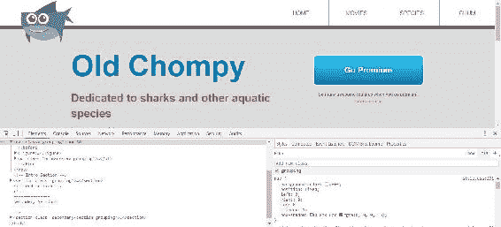

我认为`.1`差不多是对的。结果很好。

# 摘要

这是一个很长的章节；我们谈了很多。我们制作并设计了我们的菜单。您已经了解了伪类，以及我们如何根据它们在 HTML 中的位置来使用它们来定位元素。我们熟悉了定位属性，使用`absolute`定位我们的鲨鱼图标。我们为菜单建立了一个下拉菜单，并添加了动画。我们探索了动画属性，如`animation delay`、`iteration count`和`fill-mode`，并将其应用于我们的鲨鱼图标。最后，我们完成了导航，修复了`z-index`问题，并使用`box-shadow`属性完成了我们的设计。在下一章中，我们将研究我最喜欢的主题之一，响应性网页设计，因为我们已经为不同的设备尺寸做好了准备。*