# 变得敏感

到目前为止，我们已经用固定的尺寸建造了几乎所有的东西。我们的布局有固定的宽度，我们的图像有固定的宽度，我们的菜单也有固定的宽度。但是，在使用手机、平板电脑和其他各种尺寸的设备时，这并不能带来良好的体验。幸运的是，响应式网页设计将我们的静态网站转变成一个流畅、设备友好的网站。

开启这一切的书- *响应式网页设计*，作者:*伊桑·马科特*， *2011* 。他概述了响应式网页设计的三个主要技术支柱:

*   流体网格，
*   灵活的图像，以及
*   媒体查询。

我们将讨论响应性网页设计的这三个基本 CSS 基础，接下来是如何在较小的屏幕尺寸下为主要导航构建便利，最后是`viewport`元标签。

# 流体网格

在本节中，我们将讨论响应式网页设计的三个主要组件中的第一个，即流体网格或基于百分比的布局。我们将研究将固定宽度布局转换为流体网格，为此，您需要学习将像素转换为百分比的公式。

# 将像素转换为百分比

现在，我们有一个固定宽度的布局，如下图所示:

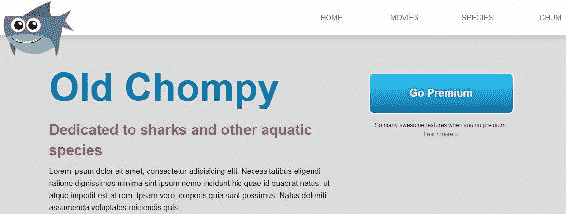

如果缩小浏览器，您可以看到它是如何分解成更小的尺寸的，如下图所示:


创建流体网格是解决这个问题的第一步。目标是将所有基于像素的宽度、左右边距和左右填充转换为百分比。我们现在将忽略我们的主导航，但是我们将在后面的部分中循环回到它。我们将从`div`标签开始，这是`wrapper`类，我已经用它包装了很多内容。我们把`width`改成`max-width`吧。这说明这个元素可以比`960px`宽，但不能比这个宽。让我们也将宽度设置为`90%`:

```html
.wrapper {
 width:960px;
 width: 90%;
  margin: 0 auto;
}
```

因此，根据这段代码，我们将宽度设为其父元素的 90%，它没有宽度。因此，它将占浏览器窗口的 90%。这将使其两侧有 5%的边沟，宽度比`960px`窄。让我们看看浏览器中的网站。您可以刷新浏览器并使其再次变小。下面的截图显示，它没有戏剧性的效果，看起来相当糟糕:

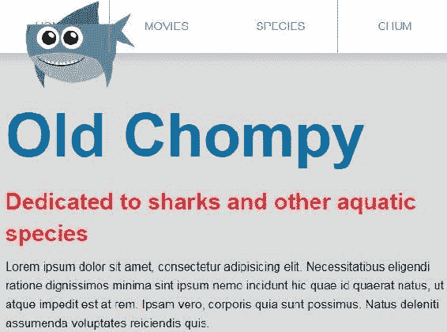

我们也想在`wrapper`百分比中创建这些元素。由于我们从固定的像素宽度开始，我们需要将所有像素转换为百分比。

# 计算百分比宽度

根据*响应网页设计**伊桑·马科特*的说法，有一个将基于像素的布局转换为基于百分比的布局的公式:*目标/上下文=结果*。*目标*是所需的元素宽度。*上下文*通常是其父元素的宽度。*结果*是我们可以插入 CSS 的百分比。

如果我们查看一下`intro-content`部分中的 HTML，我们可以看到`wrapper`类以及其中的两个`div`标签，即`intro-content`和`go-premium`，如下面的代码片段所示:

```html
<section class="grouping">
    <div class="wrapper">
        <div class="intro-content">
            <h1>Old Chompy</h1>
            <h2>Dedicated to sharks and other aquatic species</h2>
            <p>Lorem ipsum dolor sit amet...</p>
        </div><!-- end intro-content -->
        <div class="go-premium">
            <a href="#" class="call-to-action">Go Premium</a>
            <p class="reasons">So many awesome features...
                <a href="#">Learn more &raquo;</a>
            </p>
        </div><!-- end go-premium -->
    </div><!-- end wrapper -->
</section><!-- end section -->
```

回到我们的 CSS，我们的第一个元素是`intro-content`，它是出现在包装器内部的部分，如下面的代码片段所示:

```html
.intro-content {
  width: 600px;
  margin-right: 60px;
  float: left;
}
```

这里的目标是 600 像素，上下文是 960 像素。所以我们的计算是 600 除以 960，等于 0.625。我们将插入这个作为我们的宽度，添加一个百分比作为我们的度量单位，并将小数点移动两个位置，使其达到 62.5%:

```html
.intro-content {
  width: 62.5%; /* 600/960 */
  margin-right: 60px;
  float: left;
}
```

如您所见，我在声明末尾的注释告诉我，元素最初是 600 像素宽，父元素最初是 960 像素宽。

`margin-right`属性也需要是百分比。公式保持不变——*目标*除以*上下文*等于*结果*。我们的目标是 60 像素，我们的上下文仍然是 960 像素——父元素，也就是`wrapper`类。60 除以 960 得出 0.0625。我们通过将小数点移动两位来将其转换为百分比，我们有`6.25%`:

```html
.intro-content {
  width: 62.5%; /* 600/960 */  margin-right: 6.25%; /* 60/960px */
  float: left;
}
```

接下来是我们的行动号召按钮的容器，`go-premium`:

```html
.go-premium {
  width: 300px;
  float: left;
  margin-top: 150px;
}
```

由于宽度为`300px`，也需要换算成百分比。让我们做同样的事情，在这个例子中，300 除以 960——我们仍然有相同的父代。是 0.3125。将小数点移动两位，添加一个百分比，然后将它放在右边的 CSS 注释中，以防我们以后需要它:

```html
.go-premium {
  width: 31.25%; /* 300/960 */
  float: left;
  margin-top: 150px;
}
```

现在我想我们已经准备好在浏览器中查看这个了。如果我稍微缩小浏览器窗口，布局不会立即中断:

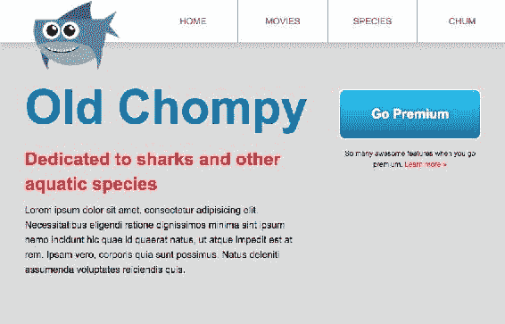

但是，如果我将浏览器窗口再缩小一点，那么它最终会变得非常糟糕:

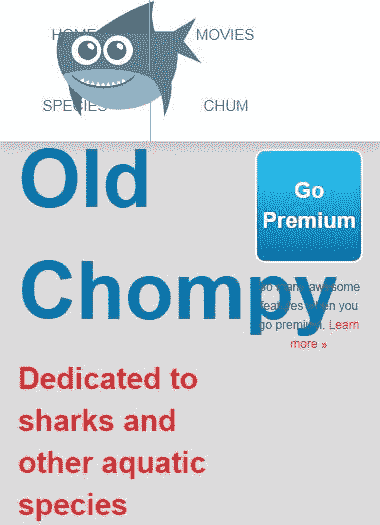

然而，我们确实取得了一些进展，因为我们的布局开始变得流畅。随着浏览器窗口变小，介绍内容和行动号召按钮也越来越窄。最终，它们会开始重叠，但没关系；至少我们在顶部有一个流体基础。

现在让我们看看它下面的三列；当窗户越来越小的时候，它们就有点破碎了:

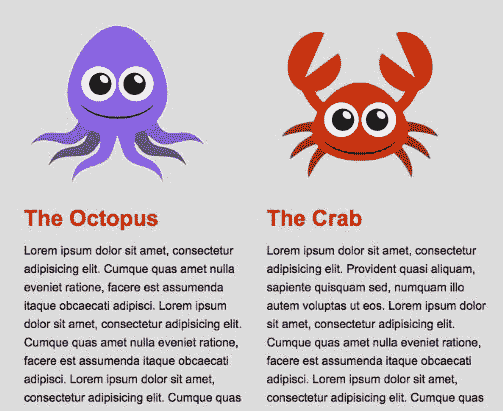

所以让我们来看看`secondary-section`类中的 HTML。这三列在一个`wrapper`类的`div`标签中，该标签最初也是 960 像素宽(但现在最大宽度为 960 像素，宽度为 90%):

```html
<section class="secondary-section grouping">
  <div class="wrapper">
    <div class="column">
      <figure>
        
      </figure>
      <h2>The Octopus</h2>
      <p>...</p>
      <a href="#" class="button">Tenticals &raquo;</a>
    </div>
    <div class="column">
      <figure></figure>
      <h2>The Crab</h2>
      <p>...</p>
      <a href="#" class="button">Crabby &raquo;</a>
    </div>
    <div class="column">
      <figure></figure>
      <h2>The Whale</h2>
      <p>...</p>
      <a href="#" class="button">Stuart &raquo;</a>
    </div>
  </div><!-- end wrapper -->
</section>
```

我们将继续使用它作为我们的上下文，同时将我们的`.column`宽度从像素转换为百分比。一直到我们 CSS 的底部，我们看到每一列都是`300px`宽:

```html
/****************
3 columns
****************/
.column {
  float: left;
  width: 300px; 
  margin-left: 30px; 
}
.column:first-child {
  margin-left: 0;
}
```

让我们在这里应用我们的公式。我们已经知道 300 除以 960 是 31.25%，因为这是我们之前使用的精确计算:

```html
.column {
  float: left;
  width: 31.25%; /* 300/960 */
  margin-left: 30px; 
}
```

`margin-left`属性是`30px`，所以我们实际上要复制并粘贴 31.25%到这里，但是我们将小数移动一位，并添加一个注释，说明 30 除以 960:

```html
.column {
  float: left;
  width: 31.25%; /* 300/960 */
 margin-left: 3.125%; /* 30/960 */
}
```

我们在第一列有一个`0`值的`margin-left`属性。我们不必将 0 更改为百分比，因为 0、0 像素和 0%都是完全相同的东西，没有任何变化:

```html
.column:first-child {
  margin-left: 0;
}
```

顺便说一下，我从来没有改变过任何高度、上下页边距或填充，因为它们对我们来说并不重要。因此，现在如果我们刷新这个部分并使其变小，我们将看到我们的三列随着浏览器窗口的缩小而成比例地缩小:


所以我们主页上的所有东西现在都是流动的，除了我们的导航，我现在就离开。我想以完全不同的方式处理它，所以我将它保留为固定宽度。

# 将填充改为百分比

我们从来不需要将左填充或右填充更改为百分比，因为我们没有任何百分比，但是这样做的过程非常相似。您仍然使用相同的公式-目标除以上下文等于结果。但是现在的语境有点不一样了；它是元素本身的宽度，而不是父元素的宽度，就像宽度和边距一样。唯一需要注意的是，如果元素本身没有定义宽度，您可以使用其父元素的宽度，或者通过确定父元素的宽度来确定宽度本身:


如果使用带有边框框值的`box-sizing`属性，填充将不再计入元素的框模型宽度。因此，您可以将其保留为像素长度，并将宽度和边距转换为百分比，因此`box-sizing: border-box`肯定会有所帮助。

# 鲨鱼电影页面上的流动网格

让我们搜索一些其他非基于百分比的宽度/边距/填充。所以我们不担心任何与垂直距离有关的东西，比如`height`、`margin-top`、`margin-bottom`、`padding-top`或者`padding-bottom`。我们不担心`0`的任何价值。

我们将在`wrapper`规则集中遇到左右边距的`auto`:

```html
.wrapper {
  max-width: 960px;
  width: 90%;
  margin: 0 auto;
}
```

这个不需要转换成百分比，因为`auto`会根据可用空间自动计算宽度，所以和百分比一样好。

我们担心以下声明块中的这个`margin`属性:

```html
.content-block .figure {
  float: left;
  margin: 30px;
  border: 15px solid #fff;
  overflow: hidden;
}
```

该规则集的`margin`为`30px`；它使用单值语法。这意味着上、下、左、右页边距都是`30px`。我们只想改变左右页边距。所以我们可以使用双值语法。第一个值是指上下页边距，第二个值是指左右页边距。

```html
margin: 30px 30px;
```

记住`content-block .figure`是包裹我们图像的元素，如下图截图所示。所以我们实际上试图将`margin-right`和`margin-left`转换成一个百分比:


如果我们看一下我们的`shark-movies.html`，我们会看到图像在一个`wrapper`里面:

```html
<section id="jaws" class="content-block style-1 wave-border grouping">
  <div class="wrapper">
    <a href="#" class="figure">
      
    </a>
    <h1>Jaws</h1>
    <p>...</p>
    <a href="" class="button button-narrow button-alt float-right">Learn More</a>
  </div><!-- end of wrapper -->
</section>
```

同样，我们知道`wrapper`是 960 像素。到目前为止，我们的语境已经非常容易确定，因为我们的语境一直是`wrapper`的宽度。

数字 30 除以 960 是 03.125，也就是 3.125%，所以我们保存这个:

```html
.content-block .figure {
  float: left;  margin: 30px 3.125%; /* 30/960 */
  border: 15px solid #fff;
  overflow: hidden;
}
```

在我们的网站上，除了导航，所有的硬像素长度都是百分比！并不是所有的东西都必须是一个百分比，响应网页设计才能发挥作用。我们做了一个判断，我们将处理没有百分比宽度的导航。这是真实的流体网格和许多其他决策的响应网页设计；真的没有放之四海而皆准的解决方案。你网站的每一个组成部分都需要从桌面到移动进行彻底的思考，或者更好的是，从移动到桌面。所以第一步，创建流体网格，现在已经完成了。这是重要的一步，因为它确保我们的设计将开始很好地适合我们所有的屏幕尺寸。在下一节中，我们将研究灵活的图像。

# 灵活的图像

我们创建了一个流体网格，这是响应性网页设计的第一个基础。基础二是反应性图像或柔性图像。我们希望我们的图像或至少某些图像的行为方式与我们的 div 和 sections 相同。我们希望它们是流动的或灵活的。

查看我们的网站，我们可以注意到`The Octopus`、`The Crab`和`The Whale`的三个图像随着它们所在的列变小而缩小。另一方面，无论浏览器的宽度如何，顶部的鲨鱼都保持不变:

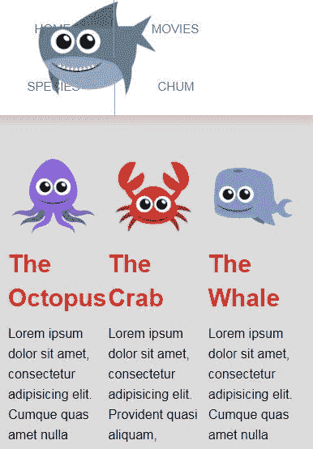

我们在导航中的形象不灵活。我们专栏中的三个图像是灵活的。我们将查看导航中的图像并了解原因。但首先，让我们回顾一下保证响应图像的三件事:

*   将`img`标签放入容器中。最具语义的容器通常是`figure`标签，但它当然可以是任何元素。
*   使容器流体化；给它一个百分比宽度。
*   将`100%`的`max-width`属性分配给所有的`img`标签，或者至少分配给你想要灵活的`img`标签。

# 章鱼、螃蟹和鲸鱼的图像

现在让我们看看我们的 HTML 文件中的一个图像。我们可以看到章鱼的形象是在一个容器里面。容器是`figure`元素:

```html
<figure>
    
</figure>
```

`figure`元素没有定义宽度，但它是一个块级元素，占据了容器的整个宽度。所以我们可以把图形宽度想象成`100%`。在`column`区里面:

```html
<div class="column">
    <figure>
        
    </figure>
    <h2>The Octopus</h2>
    <p>...</p>
    <a href="#" class="button">Tenticals &raquo;</a>
</div>
```

如果我们查看我们的 CSS 列，我们看到的列宽是`31.25%`:

```html
/****************
3 columns
****************/
.column {
  float: left;
  width: 31.25%; /* 300/960 */  
  margin-left: 3.125%; /* 30/960 */
}
```

因此，我们有了第一步——我们有了容器内部的图像。然后是第二步——母体是流动的。第三步是为所有图像指定最大宽度。

让我们向上滚动到我们的 CSS 文件的顶部。我实际上有这个选择器，显示在下一个截图中，作为我重置的一部分。它的目标是`img`、`iframe`、`video`和`object`，几乎所有类型的媒体。我给这个选择器分配了 100%的最大宽度:

```html
img, iframe, video, object {
  max-width: 100%; 
}
```

我把这个选择器作为我在每个项目中使用的样式的重置层或基础层的一部分。为了好玩，让我们去掉这个属性:

```html
img, iframe, video, object {
 /* max-width: 100%;*/
}
```

如果我们保存它并查看我们的网站，当我们缩小浏览器窗口时，图像不会变小；它们会保持同样的大小，挤在一起:

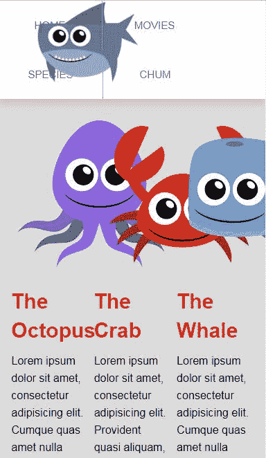

当我们重新添加`max-width: 100%`声明时，这些图像再次变得灵活。这表示任何图像的最大宽度只能是其容器的 100%。因此，随着容器变小，图像的宽度也会变小:

```html
img, iframe, video, object {
  max-width: 100%; 
}
```


# 鲨鱼形象

鲨鱼形象没有变小有两个原因。让我们检查一下。我们可以看到鲨鱼图像确实有一个直接的容器元素——一个`figure`标签。但是容器故意不流动:


如果你点击图像容器的容器，即`nav`标签，你会看到它扩展到浏览器的整个宽度，展示了容器是如何不流动的:

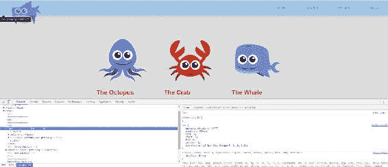

如果我们检查图像本身，我们看到它有一个分配给它的宽度`160px`，这肯定会阻止它成为流体:


我个人不喜欢在图片上设置宽度。即使我不希望这个图像是流动的，我也不希望它有宽度。在这种情况下，让我们在这里做一点清理，改变图像，使图形元素的宽度为`160px`，这是图像的容器，而不是图像本身。

```html
nav img {
  width: 160px;
}
```

这更符合我的偏好:

```html
nav figure {
  position: absolute;
  top: -20px;
  left: 50px;
  width: 160px;
  -webkit-animation: crazyShark 1s ease; 
  animation: crazyShark 1s ease;
}
/* nav img {
 width: 160px;
} */
```

我们有意将鲨鱼图像保留为固定宽度，因为它不一定需要收缩或增长来使这个设计具有响应性。我们将在本章后面单独处理标题部分。

# 缩小鲨鱼电影页面上的图像

让我们看看电影页面上的图片。当我们调整浏览器大小时，它们不会收缩。它们有固定的宽度:

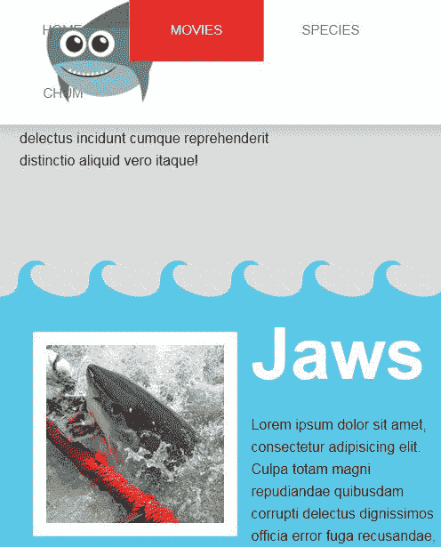

我认为他们应该收缩；在较小的浏览器中，它们只是有点太大了。我们的电影页面上的三个图像都没有缩小的原因是因为它们的父元素没有定义宽度。让我们用伊森·马科特的公式——目标除以上下文等于结果。我们知道图像填充的区域的上下文，标题 1，段落，了解更多按钮仍然是 960px 宽，因为它在一个`wrapper`里面:

那么围绕图像的锚点标签的宽度是多少呢？如果我们看看我们的 CSS，我们有`.content-block .figure`，这里没有定义宽度:

```html
.content-block .figure {
  float: left;
  margin: 30px 3.125%; /* 30/960 */
  border: 15px solid #fff;
  overflow: hidden;
}
```

如果我们看一下`.figure`内部的图像，那里也没有定义宽度:

```html
.content-block .figure img {
  float: left;
  -webkit-transition: transform .25s ease-in-out;
  transition: transform .25s ease-in-out;
}
```

所以我们必须利用 Chrome DevTools 的力量来计算`img`元素周围的`a`元素的宽度。如果我们将鼠标悬停在实际图像本身上，我们会看到图像是 200 像素乘以 200 像素:


如果我们真的突出显示锚点，如下图所示，DevTools 告诉我们宽度是 230 像素。你可以看到它显示在图像上方的弹出气泡中。我们的宽度是 230 - 200 像素的图像加上 15 像素的左边框和 15 像素的右边框。这是有道理的。


现在我们要做的是，当我们将像素值转换为百分比时，我们希望使用 230 作为我们的目标。我们也将不得不使用`box sizing: border-box`。请记住，正如您在[第 1 章](01.html#K0RQ0-a72d261cc09f412988422c8a08f12cd5)、 *CSS Foundations* 中的*方块模型和块与内联元素*部分所学的，如果您将元素设置为`box-sizing: border-box`，则`border`和`padding`将被计算到您定义的`width`中:

```html
.content-block .figure {
  float: left;
  margin: 30px 3.125%; /* 30/960 */
  border: 15px solid #fff;
  overflow: hidden;
  box-sizing: border-box;
}
```

230 除以 960 等于 0.239583333333333，所以我们将它转换成百分比，我们得到`23.98333333333%`:

```html
.content-block .figure {
  float: left;
  margin: 30px 3.125%; /* 30/960 */
  border: 15px solid #fff;
  overflow: hidden;
  box-sizing: border-box;
  width: 23.958333333333%; /*230/960*/
}
```

现在，如果我们刷新浏览器并使其变小，我们可以看到我们的图像变小。这会儿看起来可能有点奇怪，但信不信由你，这就是我们拍摄的目的，太棒了！


现在让我们回到 CCS 代码。我们正在使用的这项技术非常有用，但是我们可能会在整个代码中重复`box-sizing: border-box`很多次。让我们从我们的`.content-block .figure`规则集中完全移除它，并以稍微不同的方式将其添加到我们的重置中，它应该在的地方。让我们将它添加到样式表的重置部分:

```html
html {
  box-sizing: border-box;
}
*, *:before, *:after {
  box-sizing: inherit;
}
```

作为我们重置的一部分，每个元素都会得到`box-sizing: border-box`。我们可以看到我们在哪里将它添加到我们的 HTML 元素中，并使用了通用(星形)选择器，正如您将从我们关于特定规则的部分中记住的，它适用于所有元素。我们只在`html`元素上应用`box-sizing: border-box`，但是其他的都将得到`box-sizing: inherit`。`html`是每一个元素的母体；因此，您正在将`border-box`属性继承给每个元素。好吧，我们从灵活的图像中走了一点弯路，但我们需要这样做来创造一条积极的前进道路。

因此，总而言之，我们的图像现在是灵活的，但是我们的网站在非常小的浏览器宽度下并不完美(想想更小的设备，如手机或平板电脑)。在下一节中，我们将了解如何使用媒体查询来处理这个问题。

# 媒体查询

响应式网页设计的前两个基础只能让你走这么远。最重要的基础是媒体查询。媒体查询基本上是 CSS 中的“如果”语句或条件逻辑。例如*如果*浏览器的宽度小于 500 像素，那么我们可以根据这些条件应用不同的规则集。媒体查询非常强大，因为在某些时候，我们的网站确实会崩溃，看起来很糟糕，我们需要用。在本节中，我们将了解什么是媒体查询，并使用它来解决网站的剩余问题，尤其是在较窄的宽度上。

另一件需要考虑的事情是——因为我们将缩小浏览器窗口，以模拟平板电脑或移动设备，所以我们没有太多空间来查看开发工具。您可以单击 3 个垂直点图标打开下拉菜单，将开发工具移至右侧:


Chrome changes its UI from time to time as it updates, so the icon may look different for you.

现在，我们可以将浏览器窗口缩小到我们想要的任何更小的宽度，并且仍然有足够的空间容纳开发人员工具:

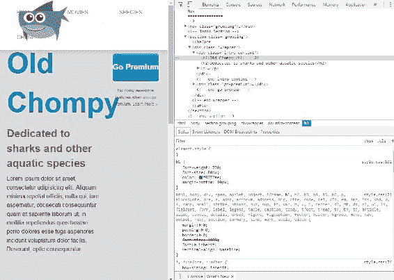

Quick tip
If you use Chrome DevTools and shrink your browser window, in the top-right corner it will show you the width and height of the browser's viewport. So, in the following image, you can see it's providing information about the width, which is at **691px**.


我们网站现在的问题是，如果我们达到一个更窄的宽度，导航将在鲨鱼的后面，行动号召按钮将被放入网站标题中，三列也太窄了:


所以我们将跳过导航，在这一节结束时循环回到它。主站点标题和行动号召按钮是浮动的。在 1，023 像素的情况下，让我们“偏转”这两个部分，并使用媒体查询将它们堆叠在一起。

# 媒体查询剖析

我将把所有的媒体查询放在样式表的底部。你不必这样做，但这就是我要做的。媒体查询总是从`@media`开始。然后，它们有两个部分。第一部分是*媒体类型*。例如:

```html
@media screen
```

你可以插入`print`、`screen`、`all`和一些其他选项。`print`仅适用于打印样式表，而`screen`仅适用于计算机屏幕(但不适用于打印输出)。`all`适用于两者。如果我们完全忽略了`media type`-这是完全可以接受的-它默认为`all`。

媒体查询的第二部分称为*媒体功能*，决定何时使用媒体查询。我们需要把这个和带有“和”字的`@media screen`分开。例如:

```html
@media screen and (max-width: 1023px) { }
```

同样，这是类似于 JavaScript 中 if 语句的条件逻辑。如果*媒体类型*和*媒体特征*评估为真，那么将应用媒体查询中的内容(是的，我们将很快在媒体查询的大括号中放入内容)。

`(max-width: 1023px)`表示如果浏览器窗口为 1，023px 或更低，则该媒体查询将适用(或评估为真)。一旦屏幕宽度超过 1，023px，则媒体查询将不再适用(或评估为 false)。也可以使用`min-width`；它具有相反的效果，适用于 1，023px 及以上的所有产品:

```html
@media screen (min-width: 1023px) { }
```

事实上，您可以使用任何长度值以及许多其他值。不过，通常情况下，`max-width`和`min-width`对我们正在努力做的事情都很好，我们暂时还是坚持使用`max-width`。注意结尾的大括号。这几乎就像我们刚刚建立了一个 CSS 规则集:

```html
@media screen (max-width: 1023px) { }
```

在媒体查询的大括号中，我们可以开始编写普通的旧 CSS，只有当浏览器窗口(1)是一个屏幕，并且(2)小于或等于 1，023px 时，才会应用它。让我们将`float: none`和`width: auto`添加到`intro-content`和`go-premium`中:

```html
@media screen and (max-width: 1023px){
 .intro-content {
 float: none;
 width: auto;
 }
 .go-premium{
 float: none;
 width: auto;
 }
}
```

`auto`值是`width`属性的默认值，因此它有效地使这些块元素跨越可用的整个宽度，这将是`wrapper`的 100%。`auto`关键字表示会自动计算数值。`auto`根据配对的属性有不同的值。在这种情况下，它基本上与`100%`相同。

现在我们可以看到我们的介绍内容不再浮动，宽度是全幅，并且`go-premium`按钮是一样的:

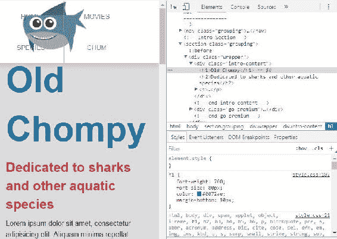

但是`go-premium`按钮和`intro-content`之间有一个很大的空间，需要去掉:


为了解决这个问题，我们将添加:

```html
@media screen and (max-width: 1023px){
  .intro-content {
    float: none;
    width: auto;
 padding-bottom: 0;
 margin-bottom: 30px;
  }
  .go-premium {
    float: none;
    width: auto;
  }
}
```

在`go-premium`按钮本身，我们将删除上边距:

```html
@media screen and (max-width: 1023px){
  .intro-content {
    float: none;
    width: auto;
    padding-bottom: 0;
    margin-bottom: 30px;
  }
  .go-premium {
    float: none;
    width: auto;
    margin-top: 0;
  }
}
```

我们有标题、副标题、文本和按钮，一切看起来都很好:

 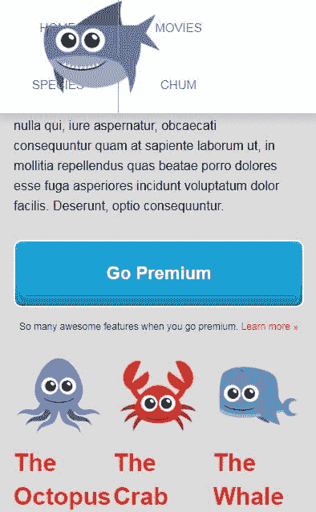

# 考虑到 iPads 和其他平板电脑尺寸

我们选择 1023 作为断点，因为这只是横向放置的 iPad 宽度的一个像素。

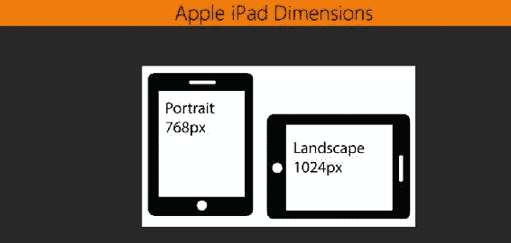

这样，我们的媒体查询将适用于小于 1，024p 的所有宽度和设备。从 2017 年开始，我会*猜测*iPad 即使不是最受欢迎的平板电脑，也是最受欢迎的平板电脑之一。我可以更肯定地说，iPad 绝对不是唯一受欢迎的平板电脑。事实上，令人惊讶的是有这么多不同的平板设备和宽度，所以你可能不一定想分别使用 1，024 和 768 作为媒体查询的基础。找出你的布局通常从哪里开始中断或者看起来很有趣，并从那里确定你的媒体查询的逻辑位置。然后，在 iPad 和你能找到的任何其他设备或模拟器上测试你的网站，以确保你的网站看起来不错。我们只使用 1，023 作为基线，因为在我们的例子中，布局看起来仍然是 1，024。

# 将我们的三列添加到媒体查询中

所以现在，我们只需要将所有的 CSS 添加到我们的媒体查询中，以便让网站的其余部分看起来更好，从三列区域开始。正如你在下面的截图中看到的，这些太紧了:

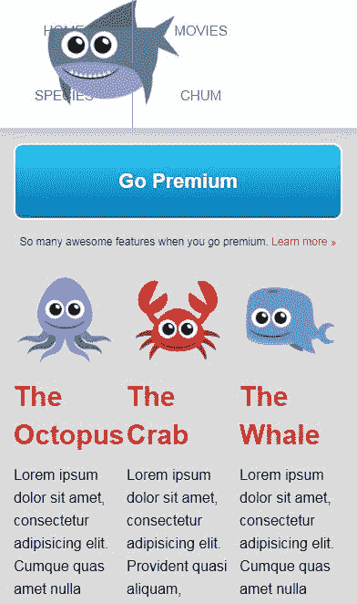

为更小的设备创建一个内容管道，去掉任何多列浮动布局，这是一种标准做法。所以我们将从`.column`中再次移除浮动，并通过指定`auto`的关键字使宽度成为父级的全宽。让我们转到 CSS 的底部，更新媒体查询:

```html
@media screen and (max-width: 1023px){
  .intro-content {
    float: none;
    width: auto;
    padding-bottom: 0;
    margin-bottom: 30px;
  }
  .go-premium {
    float: none;
    width: auto;
    margin-top: 0;
  }
 .column {
 float: none;
 width: auto;
 }
}
```

现在，当我们去我们的网站时，这三列中的每一列都将有一个完整的宽度，并且不会浮动:

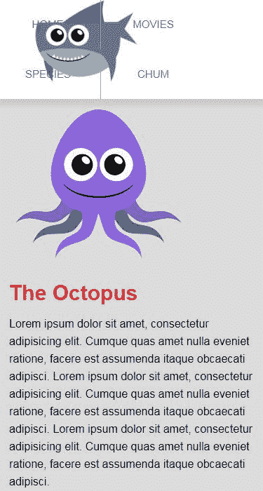

问题是，我们可能应该将文本和图像本身放在中心位置。因此，首先，我们将首先在媒体查询中定位`.column figure`以使图像居中:

```html
@media screen and (max-width: 1023px){
  .intro-content {
    float: none;
    width: auto;
    padding-bottom: 0;
    margin-bottom: 30px;
  }
  .go-premium {
    float: none;
    width: auto;
    margin-top: 0;
  }
  .column {
    float: none;
    width: auto;
  }
 .column figure {
 margin: 0 auto;
 max-width: 250px;
 width: 100%;
 }
}
```

通过对左右边距使用`auto`关键字，不仅设置`width: 100%`而且设置`max-width: 25px`，我们能够将图像居中:


添加宽度:`100%`确保如果`wrapper`容器小于 250 像素(图像的最大尺寸)，则图像宽度为其容器的`100%`；有点像一张非常窄的安全网。

接下来，让我们将标题居中，简单地使用`text-align: center`:

```html
@media screen and (max-width: 1023px){
  .intro-content {
    float: none;
    width: auto;
    padding-bottom: 0;
    margin-bottom: 30px;
  }
  .go-premium {
    float: none;
    width: auto;
    margin-top: 0;
  }
  .column {
    float: none;
    width: auto;
  }
  .column figure {
    margin: 0 auto;
    max-width: 250px;
    width: 100%;
  }  .column h2 {
 text-align: center;
 }
}
```

看起来不错:

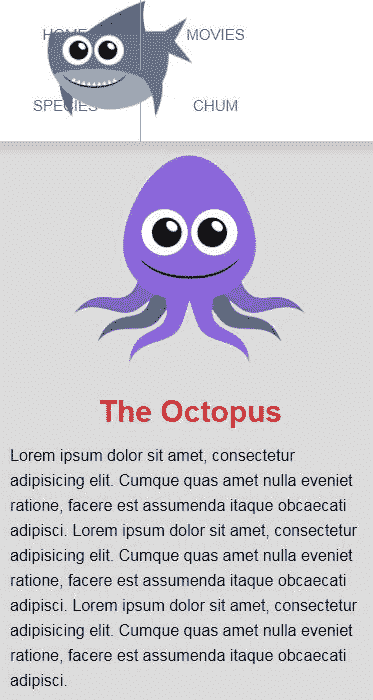

在我们的响应设计中，还有另一种方法可以采用——移动优先方法。

# 移动优先的方法

通常，这是最佳实践。顾名思义，我们希望在桌面体验的同时或之前考虑更小的显示器。这样，内容和设计在一开始就考虑了移动设备及其所有限制，因此它们可以在设计和构建过程中完全实现。移动首先涉及的不仅仅是我们如何编写 CSS。但这是移动优先代码部分背后的总体思路:将所有的 CSS 放在任何媒体查询之外的最小设备上。然后使用媒体查询来定位越来越大的设备。


这意味着使用`min-width`媒体查询为更大的显示添加额外的 CSS。例如，我们的布局在默认情况下不会有任何浮动；相反，它将是一个单一的内容隧道，这通常是移动的标准。然后，我们的媒体查询，使用`min-width`而不是`max-width`，将添加浮动，应用于更宽的屏幕宽度，以创建多列布局。

有关移动优先方法的更多信息，请查看卢克·乌鲁布莱夫斯基关于该主题的定义书- *移动优先*-可在[abookapart.com](https://abookapart.com/)网站上获得:


# 解决导航问题

现在我们来谈谈这个导航。解决导航问题并不像解决我们刚刚使用媒体查询解决的问题那么容易。在特定的宽度下，我们的鲨鱼刚好挡住了导航，在某个时候，我们也要对下拉菜单做些什么。此外，如果我们要添加更多的导航项目，那么我们会在更宽的宽度上有这个问题。

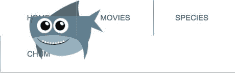

我们遇到的第一个真正的挑战是如何使用导航。出现了某些响应性的设计模式。让我们来谈谈一个由布拉德·弗罗斯特策划的网站——bradfrost.github.io/this-is-responsive:


它基本上是用于响应性网页设计的模式集合。它有一堆不同的导航处理方式，你可以探索。我们来看看*模式*下的第一个，叫做 Toggle。在更宽的范围内，菜单看起来有点像我们的；只是顶部的一些导航项目:

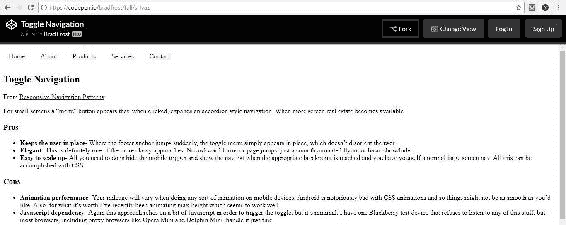

在较窄的浏览器宽度下，导航项目被替换为菜单链接:


当您单击链接时，它会展开并隐藏菜单:


这通常是我们想用我们的网站做的事情；这将需要更多地使用媒体查询和一些 JavaScript 或 jQuery 来显示和隐藏导航点击。准备好迎接挑战了吗？很好，让我们完成它！

我们使用了媒体查询来根据屏幕的宽度改变我们的 CSS。这非常有用，因为它在较窄的宽度上解决了我们的大多数问题。我们仍然需要在较小的宽度上修复导航。在下一节中，我们将使用媒体查询来彻底改变我们的导航，以便它是隐藏的，除了一个菜单图标，可以点击它来显示 jQuery 的导航。

# 移动菜单

到目前为止，在这一章中，你已经了解了伊桑·马科特的三个响应性网页设计的基本原理——流体网格、挤压的灵活图像和媒体查询。从某种程度上来说，这是比较容易的部分。困难的部分是弄清楚许多棘手的设计挑战；例如，如何处理手机上的菜单，尤其是当我们决定添加更多菜单时。幸运的是，这是一个体面的设计模式已经出现的领域。我们将放弃显示导航上每个按钮的水平菜单，代之以通过点击或触摸激活的隐藏菜单。当被点击或触摸时，隐藏的菜单将垂直向下滑动并显示所有菜单选项。我们将通过将移动导航设置为打开状态来实现这一点。然后，我们将隐藏导航，并添加触发移动菜单打开和关闭它的菜单图标。最后，我们将把我们的 HTML 链接到 jQuery CDN 和我们的脚本文件，并编写一些完成这项工作所需的基本 jQuery。

# 将移动导航设置为打开状态

在样式表的最底部，我将添加一个新的媒体查询，目标是`900px`或更少:

```html
@media screen and (max-width: 1023px){
  ...
}/* end of media query */

@media screen and (max-width: 900px) {

}
```

请注意，我还在第一个媒体查询的右大括号处添加了注释。这很有用，这样我们就不会忘记我们的第一个媒体查询在哪里结束。新的移动导航只能在新的断点`900px`处触发。这时候，它开始看起来时髦，并开始打破。首先，我不希望 nav 再固定在顶部，所以让我们摆脱固定定位，用默认的静态位置替换它:

```html
@media screen and (max-width: 900px) {
 nav {
 position: static;
 }
}
```

静态，正如您将从前面的章节中回忆到的，是`position`属性的默认值，因此它基本上关闭`fixed`定位，并将其作为基于*正常流程*的元素返回。

接下来，让我们告诉`primary-nav`的所有即时列表项向右浮动，而不是向左浮动。我们还会给它一个全宽，因为这些浮动元素只占用所需的宽度，类似于内联元素，所以我们会告诉它们占用整个可用宽度，方法是将宽度设置为`100%`:

```html
@media screen and (max-width: 900px) {
  nav {
    position: static;
  }
 .primary-nav > li {
 float: right;
 width: 100%;
 }
}/* close media query */
```

同样，我还添加了一个注释来表示这个媒体查询的右大括号，这样就不会失去对它的跟踪。

现在让我们关注主播。让我们将文本向右对齐，标准化填充，移除左边的边框并在底部添加边框，并使其字体大小小一点，为 13px，宽度为 100%:

```html
@media screen and (max-width: 900px) {
  nav {
    position: static;
  }
  .primary-nav > li {
    float: right;
    width: 100%;
  }
 .primary-nav li a {
 text-align: right;
 padding: 15px 25px 15px 0;
 width: 100%;
 border-bottom: 1px solid #e7e7e7;
 border-left: none;
 font-size: 13px;
 }
}/* close media query */
```

好了，这就是我们应用 CSS 之前导航的样子:


这是我们刷新时的样子。现在它开始看起来像移动导航:


问题是 100%的宽度并没有真正发挥作用。嗯，事实上的确如此；锚 100%是他们的容器，但也需要 100%是他们的容器。让我们给`primary-nav`分配 100%的宽度:

```html
@media screen and (max-width: 900px) {
  nav {
    position: static;
  }
  .primary-nav > li {
    float: right;
    width: 100%;
  }
  .primary-nav li a {
    text-align: right;
    padding: 15px 25px 15px 0;
    width: 100%;
    border-bottom: 1px solid #e7e7e7;
    border-left: none;
    font-size: 13px;
  }  .primary-nav {
 width: 100%;
 }
}/* close media query */
```

我们可以把它从待办事项列表中划掉:


这确实像一份菜单。房间里的大象是鲨鱼在中间占据了太多的空间。我们来解决这个问题。

让我们在针对鲨鱼的媒体查询的底部添加一个新的选择器。我们将使它变得更小，向上移动，并使用顶部和左侧位置的偏移属性将它靠近左侧，因为这已经是一个绝对定位的元素:

```html
@media screen and (max-width: 900px) {
  nav {
    position: static;
  }
  .primary-nav > li {
    float: right;
    width: 100%;
  }
  .primary-nav li a {
    text-align: right;
    padding: 15px 25px 15px 0;
    width: 100%;
    border-bottom: 1px solid #e7e7e7;
    border-left: none;
    font-size: 13px;
  }  .primary-nav {
    width: 100%;
  }
  nav figure {
 width: 100px;
 top: 0;
 left: 20px;
 }
}/* close media query */
```

看起来不错:


接下来要修复的是下拉菜单。这不行:


我们现在要做一个设计决定。我们应该隐藏下拉菜单，不让任何移动用户访问它吗？我们可以。但这对移动用户不公平。我们显然可以保持如上所示，但我认为我们将它同化到`primary-nav`中会更好地为移动用户服务。我想让它看起来像其他主要菜单。所以我们要瞄准`.has-submenu ul`选择器。我们会将此规则集添加到媒体查询的底部。我们将`position`属性从`absolute`改为`static`，将`display`属性改为`block`，去掉`border`和`border-radius`属性，使`width`一路延伸:

```html
@media screen and (max-width: 900px) {
  nav {
    position: static;
  }
  .primary-nav > li {
    float: right;
    width: 100%;
  }
  .primary-nav li a {
    text-align: right;
    padding: 15px 25px 15px 0;
    width: 100%;
    border-bottom: 1px solid #e7e7e7;
    border-left: none;
    font-size: 13px;
  }  .primary-nav {
    width: 100%;
  }
  nav figure {
    width: 100px;
    top: 0;
    left: 20px;
  }  .has-submenu ul {
 position: static;
 display: block;
 border: none;
 border-radius: 0;
 width: 100%;
 }
}/* close media query */
```

现在我们有了这个:


哇哦！看起来不错。让我们也杀死动画，因为它不再需要。我们将在媒体查询中添加一个新的选择器，并将`-webkit-animation`和`animation`设置为`none`；这个关键字会杀死动画:

```html
@media screen and (max-width: 900px) {
  nav {
    position: static;
  }
  .primary-nav > li {
    float: right;
    width: 100%;
  }
  .primary-nav li a {
    text-align: right;
    padding: 15px 25px 15px 0;
    width: 100%;
    border-bottom: 1px solid #e7e7e7;
    border-left: none;
    font-size: 13px;
  }  .primary-nav {
    width: 100%;
  }
  nav figure {
    width: 100px;
    top: 0;
    left: 20px;
  }  .has-submenu ul {
    position: static;
    display: block;
    border: none;
    border-radius: 0;
    width: 100%;
  }  .has-submenu:hover ul {
 -webkit-animation: none;
 animation: none;
 }
}/* close media query */
```

我们不再得到动画。“电影”菜单的悬停状态以一种奇怪的方式覆盖了鲨鱼，但当我们添加汉堡菜单图标时，这种情况很快就会得到解决:


处于打开状态的移动导航现已完成；现在我们需要隐藏它，并添加汉堡图标，这将触发它的打开和关闭。

# 添加汉堡菜单图标

让我们在`index.html`文件和`shark-movies.html`文件中的`primary-nav`的正上方添加一个`div`标签。我们给它上一堂`mobile-menu-icon`课；这很重要:

```html
<!--
===============
Nav
===============
-->
<nav class="grouping">
    <figure>
        
    </figure>
    <div class="mobile-menu-icon"></div>
    <ul class="primary-nav grouping">
        <li><a href="#">Home</a></li>
        <li class="has-submenu"><a href="shark-movies.html">Movies</a>
            <ul>
                <li class=""><a href="">Jaws</a></li>
                <li class=""><a href="">Sharknado</a></li>
                <li class=""><a href="">Open Water</a></li>
            </ul>
       </li>
        <li><a href="#">Species</a></li>
        <li><a href="#">Chum</a></li>
    </ul>
</nav>
```

当我们应用这个时，浏览器中没有显示任何内容，因为这只是一个空的`div`标签。让我们使用背景图像来添加图标。我们不会把这个放在媒体查询中；实际上，我们将一直向上移动到导航原来在 CSS 中的位置，并添加以下规则集:

```html
/****************
nav
****************/
nav {
  background-color: #fff;
  position: fixed;
  left: 0;
  right: 0;
  top: 0;
  z-index:1;
  box-shadow: 0 8px 15px rgba(0, 0, 0, 0.1);
}
nav figure {
  width: 160px;
  position: absolute;
  top: -20px;
  left: 50px;
  -webkit-animation: crazyShark 1s ease; 
  animation: crazyShark 1s ease;
}
.mobile-menu-icon {
 background: url('img/mobile-menu-icon.png') 0 0 no-repeat;
}
```

我们的图像文件夹中已经有了这张图像。我们使用零和零作为我们的背景位置和不重复，以确保这个图像不会自动重复。除非我们增加宽度和高度，否则浏览器中仍然不会显示任何内容。我们知道图像是`30px`宽`26px`高，所以我们将使用这些精确的尺寸:

```html
.mobile-menu-icon {
  background: url('img/mobile-menu-icon.png') 0 0 no-repeat;
 width: 30px;
 height: 26px;
}
```

现在，当我们保存和刷新时，我们可以看到浏览器窗口顶部的三栏图标:


我们还想把它移到右边，用一些上边距、右边距和下边距给它留出一些空间。我们还可以更改光标，这样它就有了不同的外观。让我们将这些属性添加到`mobile-menu-icon`中:

```html
.mobile-menu-icon {
  background: url('img/mobile-menu-icon.png') 0 0 no-repeat;
  width: 30px;
  height: 26px;
  float: right;
 margin: 10px 15px 10px 0;
 cursor: pointer;
}
```

在我们刷新浏览器之前，我们可以看到只有一个常规光标悬停在图标上:


在我们刷新之后，它移动到右边，现在它有一个指针类型的光标，指示它是可点击的:

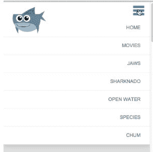

显然，我们不会在移动设备上看到这一点，而是在桌面设备或桌面浏览器上；这是一件好事。

# 隐藏菜单

现在让我们默认隐藏菜单。与其使用`display: none`，正如我前面提到的，出于可访问性的原因，这并不太好，不如让我们探索另一种更具创造性地隐藏内容的技术，以便屏幕读者仍然可以找到并宣布它。我们将回到我们的媒体查询里面，在`.primary-nav`里面。我们要说这个元素的高度为零:

```html
@media screen and (max-width: 900px) {
  .intro-content {
    margin-top: 50px;
  }
  nav {
    position: static;
  }
  .primary-nav {
    width: 100%;
    max-height: 0;
 overflow: hidden;
    -webkit-transition: all ease-out .35s;
    -moz-transition: all ease-out .35s;
    -o-transition: all ease-out .35s;
    transition: all ease-out .35s;
  }
...
```

以下是前面代码的输出:

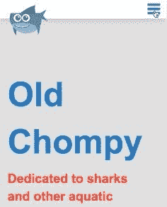

给你。现在我们要做的是点击激活菜单。

# 使用 jQuery 一键触发菜单

在这个阶段，我们必须链接到 jQuery 和我们自己的 JavaScript 文件。我们将在 HTML 的底部这样做，就在我们的结束`</body>`和`</html>`标签的上方。复制一个链接到谷歌网站上托管的 jQuery CDN。在这下面，添加一个链接到我们自己的 JS 文件。我们将把这个文件放在`js`文件夹中，并给这个文件命名为`scripts.js`:

```html
<script src="https://ajax.googleapis.com/ajax/libs/jquery/3.2.1/jquery.min.js"></script>
<script src="js/scripts.js"></script>
</body>
</html>
```

还有，我们把这个复制到`shark-movies.html`里的同一个地方。让我们也创建这个新的 JavaScript 文件。

In Sublime Text an easy way to create a new file, is to use *Cmd* + *N* (on Mac) or *Ctrl* + *N* (on Windows). *Cmd* + *S* (on Mac) or *Ctrl* + *S* (on Windows) will let you save name and save the file.

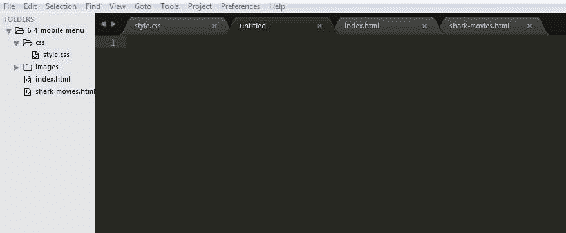

我们将它保存在`js`文件夹中:


我们将命名文件`scripts.js`。

好的，很好，现在让我们写一些 jQuery。如果这里的一切对你来说没有太大意义，不要担心。由于这个主题超出了本书的范围，所以我不打算详细讨论，但是我们的响应设计需要它。我们将在这里粘贴到我们的新`scripts.js`文件中的是一个在 DOM 准备就绪时触发的函数:

```html
$(document).ready(function() {

});//end doc ready
```

我们想把我们写的代码放在这个函数里面。这只是告诉脚本等待网页准备就绪，然后再执行其中的代码。这对 jQuery 来说是一种公平的标准。因此，让我们将它粘贴到我们的函数中，如下所示:

```html
$(document).ready(function() {
  $(".mobile-menu-icon").on("click", function(){
    $(".primary-nav").toggleClass("active");
    $(this).toggleClass("open");
  });
});//end doc ready
```

首先，我们这里有一个 jQuery 函数，当您单击该元素时，它专门针对`mobile-menu-icon`类:

```html
$(".mobile-menu-icon").on("click", function(){
```

单击该元素后，将执行两行代码。我们将首先练习`primary-nav`并切换一个名为`active`的类:

```html
$(".primary-nav").toggleClass("active");
$(this).toggleClass("open");
```

所以，如果你点击汉堡菜单，它会给`primary-nav`增加一个`active`类。如果你第二次点击它，它会把它移除，然后继续为我们做，这很好。下一条线的目标是`$(this)`。这里，`$(this)`指的是我们正在点击的任何东西。在这种情况下，我们点击`mobile-menu-icon`并在上面切换一个名为`open`的类。查看移动菜单图标和开发工具中的`primary-nav`:


下面的截图突出显示了开发工具中的代码行:


这两者都应该添加类。当我们点击汉堡菜单图标时，我们看到`mobile-menu-icon`获得`open`等级，`primary-nav`获得`active`等级:

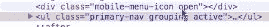

当我们再次点击它时，它们都消失了。所以现在我们可以按照我们需要的方式来定位这些类。让我们回到我们的 CSS。我们想锁定处于打开状态的`mobile-menu-icon`。所以我们将选择器添加到 CSS 的导航部分:

```html
@media screen and (max-width: 900px) {
  ...
  .mobile-menu-icon {
    background: url('img/mobile-menu-icon.png') 0 0 no-repeat;
    width: 30px;
    height: 26px;
    float: right;
    margin: 10px 15px 10px 0;
    cursor: pointer;
  }
  .mobile-menu-icon.open { }
}/* end of media query */
```

我们要做的就是改变背景图像:

```html
.mobile-menu-icon.open { 
  background-image: url('img/mobile-menu-close-icon.png');
}
```

现在，当我们点击汉堡图标时，我们得到 x 图标，当我们再次点击它时，我们得到菜单图标。这很好:


现在我们要瞄准`primary-nav.active`选择器，所以让我们把它添加到我们的 CSS 中，并给它一些高度:

```html
@media screen and (max-width: 900px) {
  .intro-content {
    margin-top: 50px;
  }
  nav {
    position: static;
  }
  .primary-nav {
    width: 100%;
    max-height: 0;
    overflow: hidden;
  }
  .primary-nav.active {
 max-height: 350px;
 }
  ...
}
```

现在，当我们点击图标，我们得到我们的菜单:


当我们再次点击它时，它消失了:

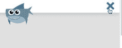

此时，图像会立即出现和消失，因此我们想在此基础上添加一个过渡。让我们转到`.primary-nav`并添加一个过渡:

```html
@media screen and (max-width: 900px) {
  .intro-content {
    margin-top: 50px;
  }
  nav {
    position: static;
  }
  .primary-nav {
    width: 100%;
    max-height: 0;
    overflow: hidden;
 -webkit-transition: all ease-out .35s;
 transition: all ease-out .35s;
  }
  .primary-nav.active {
    max-height: 350px;
  }
  ...
}
```

我们现在应该有一个丝般平滑的过渡，当我们点击菜单图标时，隐藏的导航上下滑动。

我们的移动导航已经完成，有相当多的 CSS 和一点 JavaScript，我们的网站现在响应广泛。我们只需要做一件事——我们需要在移动设备上测试我们的网站。我们会注意到，结果与我们将浏览器调整到手机或平板电脑的宽度时大不相同。幸运的是，解决方案非常简单——元标签。

# 视口元标记

我们即将完成我们的响应网站。除了尚未在移动设备上实际测试之外，我们已经做好了一切准备。在本节中，让我们使用 Chrome 的移动设备模拟器测试我们的设计，然后查看并尝试理解`viewport`元标签。

# 在移动设备上测试我们的响应设计

在手机上进行测试的一种方法是这样的——让你的网站上线，并在实际的手机或平板电脑上进行测试。在手机上做简单测试的一个更简单的方法是使用 Chrome 的设备模拟器(但可能稍微不太精确)。在开发工具中有一个设备图标:


一旦你点击它，你就可以选择一部手机。我们可以看到我们的网站，但它看起来不像我们刚刚最小化浏览器窗口到手机大小的时候:


正在发生的事情是，大多数移动设备将尝试缩小您的网站以适合手机，然后如果您的网站没有响应，它将看起来像桌面版本，只是小得多。因此，一个值得注意的事情是，我没有看到移动导航。有一个非常简单的解决方案——元元素`viewport`。我将把这个复制粘贴到`index`和`shark-movies`页面:

```html
<!doctype html>
<html lang="en">
<head>
  <meta charset="UTF-8">
  <meta http-equiv="X-UA-Compatible" content="IE=edge,chrome=1">

<!-- description -->
  <title>Section 6-Becoming Responsive - Mastering CSS</title>

<!-- stylesheets -->
  <link rel="stylesheet" href="css/style.css">

<!-- mobile -->
 <meta name="viewport" content="width=device-width, initial-scale=1.0, minimum-scale=1.0">

<!-- stylesheets for older browsers --> 
  <!-- ie6/7 micro clearfix -->
  <!--[if lte IE 7]>
    <style>
    .grouping {
        *zoom: 1;
    }
    </style>
  <![endif]-->
  <!--[if IE]>
    <script src="http://html5shiv.googlecode.com/svn/trunk/html5.js"></script>
  <![endif]-->
</head>
```

只是一个名为`viewport`的`meta`元素；我们一会儿再谈这个。现在，看看当我们刷新浏览器时会发生什么:

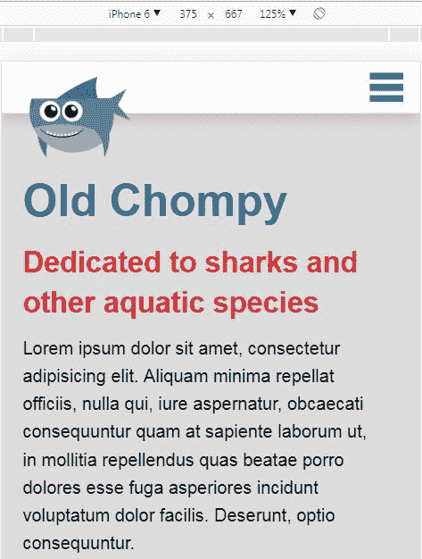

我们实际上正在得到移动版本，所以这看起来好多了，它解决了我们的问题。

# 视口元标记的剖析

让我们检查一下这个元标签:

```html
<meta name="viewport" content="width=device-width, initial-scale=1.0, minimum-scale=1.0">
```

在这里，我为名称属性提供了一个值`viewport`。然后，我有一个`content`属性，里面提供了一些不同的东西。第一件事是`width=device-width`。这基本上意味着“请不要在移动设备上缩小我的页面，因为我正在处理媒体查询。谢谢！”第二件事是`initial-scale=1.0`，它基本上是这样说的——将它精确地调整到设备的宽度，仅此而已。最后，我们有`minimum-scale=1.0`。这有助于您旋转手机，以便在设备宽度从*纵向*模式更改为*横向*模式后，网站保持与设备宽度完全一致，反之亦然。`viewport`元标签还有更多。我们可以添加`user-scalable=no`:

`user-scalable=no`一词不允许用户放大或缩小手机。有这种功能的网站可能会非常烦人，这就是为什么我们不打算在网站上包含它。

总之，我建议在你的站点的锅炉板上添加`viewport`元标签，以便在每个站点上使用。此外，没有任何东西可以替代实际的设备测试，因为实际的手机和仿真器永远不会完全相同。

# 摘要

在这一章中，我们介绍了响应式网页设计的核心概念，它可以让你的网站在任何设备上看起来都很好。您了解到流体网格和灵活的图像是让网站适合所有屏幕尺寸的第一步。我们现在了解媒体查询如何确保网站在较窄的宽度下看起来不错。我们还创建了一个移动菜单，使用 jQuery 一键触发菜单。最后，我们在 Chrome 的移动设备模拟器上测试了我们的设计，并学习了如何使用`viewport`元标签来确保我们的网站在移动设备上具有响应性。我强烈建议你们在自己使用这些技术时，从一开始就考虑移动体验，尤其是在设计过程中。在下一章，我们将讨论网页字体。