# 网页字体

很长一段时间，我们被一些基本的字体卡住了，比如泰晤士新罗马字体、乔治亚字体和 Arial 字体。如果你想偏离得更远，你就要冒这样的风险:当有人查看你的网站时，字体不会出现，因为他们可能不会在电脑上安装这种字体。在此期间，每当我们想使用花哨的字体时，我们都被要求将其保存为图像，这曾经会带来许多问题。对我们来说幸运的是，现在网络字体已经正式出现，这使我们能够使用多种适用于所有计算机的伟大字体。在本章中，您将学习网络字体。首先，您将了解`@font-face`规则的基本语法，然后我们将讨论`@font-face`是如何变得有点棘手的，接下来是进入提供字体并将其传递到您的网站的服务，例如谷歌网络字体和 Typekit。我们将以图标字体结束。

# @font-face 属性

让我们从学习如何使用`@font-face`属性为我们的网站添加网页字体开始这一章。首先，我们将把一个 OTF 文件添加到我们网站上的一个文件夹中，然后我们将在 CSS 中定义一种新的字体，最后，我们将把该 CSS 应用到我们网页上的元素中。

# 将字体文件直接添加到网站

在本节的项目文件中，我们有一个名为`fonts`的新文件夹。在这个文件夹中，有一个名为`LeagueGothic-Regular`的 OTF 文件:

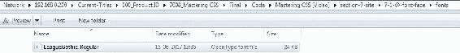

所以现在这种字体存在于我们网站的文件夹中，访问我们网站的最终用户会将这种字体下载到他们的计算机上，就像他们下载了 HTML、CSS 文件和图像一样。但是首先，我们必须告诉它这样做，并在我们的 CSS 中寻找它。

# 在我们的 CSS 中定义和应用新字体

在 CSS 中，就在我们的重置下面，让我们添加一个名为字体的新部分。添加`@font-face`；这将允许我们声明一种新的字体:

```html
/****************
Fonts
****************/
@font-face {
    font-family: 'League-Gothic';
}
```

我先声明字体名称，可以是任意的。所以即使字体叫`League Gothic-Regular`，如果愿意也可以命名为`Bananas Serif`。让我们称之为`League Gothic`，因为这最有意义。

我用单引号括起来有两个原因。一，是网页字体，二，不止一个字，要经常引用，就像引用`'Times New Roman'`一样。接下来，我们将使用`src`属性来声明该字体存在的位置:

```html
@font-face {
  font-family: 'League Gothic';
 src: url('../fonts/LeagueGothic-Regular.otf');
}
```

我们希望确保拼写正确，与 OTF 文件的名称相匹配。注意我用的是`../`。这是从`CSS`文件夹出来，然后进入`fonts`文件夹寻找`LeagueGothic-Regular.otf`的指令。这是我们的项目文件夹结构:

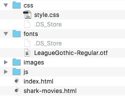

所以现在我们可以使用我们习惯的`font-family`属性将这种字体添加到任何规则集中。我们也可以像平常一样指定后退，以防字体不被下载。在样式表的“全局”部分，有一个针对`h1`的规则集，另一个针对`h2`:

```html
h1 {
  font-weight: 700;
  font-size: 80px;
  color: #0072ae;
  margin-bottom: 10px; 
}
h2 {
  font-size: 30px;
  margin-bottom: 10px;
  color: #eb2428;
  font-weight: 700; 
}
```

在`h2`规则集下面，我们将添加另一个，目标是`h1`标签和`h2`标签添加我们的新网页字体。

```html
h1, h2 {
  font-family: "League Gothic", Arial, Helvetica, sans-serif;
}
```

以下是前面代码的输出:

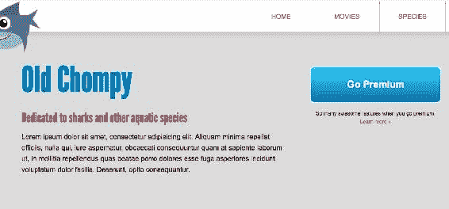

以下是我们过去使用的字体:


当我们刷新的时候，BAM！非常时尚的网页字体被添加到我们的网站:


我们已经成功地在我们的网站上添加了网页字体，但是不幸的是，我们所做的并不能在所有的浏览器中工作。因为排版可能是网页上最重要的事情，我们必须找到更好的解决方案。

# @font-face:有点棘手的事情

从表面上看，网络字体相当容易，但实际上，当我们希望它们在所有现代浏览器中工作时，它们会变得复杂。有些浏览器使用 OTF，有些使用 WOFF，有些使用 EOT、RTF 和 SVG。让我们回顾一下使用`@font-face`属性制作网页字体的完整设置。

# 使其在所有浏览器中都能工作

如果我们想在所有浏览器中以最佳方式工作，我们需要提供相当多的额外资源。这里有一个流行博客的片段，描述了理想的 at 规则。(*CSS-tricks.com[https://css-tricks.com/snippets/css/using-font-face/](https://css-tricks.com/snippets/css/using-font-face/)2016 年 8 月 25 日*克里斯·科伊尔*使用@font-face* 。)

```html
@font-face {
  font-family: 'MyWebFont';
  src: url('webfont.eot'); /* IE9 Compat Modes */
  src: url('webfont.eot?#iefix') format('embedded- 
  opentype'), /* IE6-   
  IE8 */
  url('webfont.woff2') format('woff2'), /* Super Modern 
  Browsers */
  url('webfont.woff') format('woff'), /* Pretty Modern   
  Browsers */
  url('webfont.ttf') format('truetype'), /* Safari, 
  Android, iOS */
  url('webfont.svg#svgFontName') format('svg'); /* Legacy 
  iOS */
}
```

这不仅是七个不同的`url`寻找字体，也是五个不同的字体文件:`eot`、`woff2`、`woff`、`ttf`、`svg`！正如前面代码示例中的注释所解释的，每种字体文件格式都支持不同的浏览器版本。

根据同样的 *CSS 技巧*文章，仅仅是`woff`和`woff2`文件格式就会给你相当不错的浏览器支持(Chrome 5+、Safari 5.1+、Firefox 3.6+、IE9+、Edge、Android 4.4+、iOS 5.1+):

```html
@font-face {
 font-family: 'MyWebFont';
 src: url('myfont.woff2') format('woff2'),
      url('myfont.woff') format('woff');
}
```

但这仍然意味着您需要获得并托管这两种文件格式，这当然不像五种文件格式那样具有挑战性，但也不完全是小菜一碟。

网页字体比我们希望的要复杂一些。大多数情况下，字体是通过一项服务提供的，这就是我们将在接下来的两个部分中看到的。谷歌网络字体、Typekit 和其他服务使网络字体变得更加容易，并以许多不同的权重和风格提供高质量的字体。在下一节中，我们将使用谷歌字体中的一种字体。

# 谷歌网页字体

托管自己的网页字体和使用适当的 CSS 来支持所有浏览器有点挑战性。有很多更简单的方法可以做到这一点。我真的很喜欢谷歌字体；它们非常容易使用，而且 100%免费。字体的质量也很好。在这一部分，我们将用谷歌网页字体替换我们的托管字体。第一步是去谷歌字体，选择我们将使用的两种字体。在两个 HTML 文档的标题中添加到 CSS 文件的链接。然后最后，将字体名称添加到我们的 CSS 中。

# 查找谷歌字体

前往[https://fonts.google.com/](https://fonts.google.com/)搜索我们的标题字体:`Maven`。酷的是，我们可以输入一些文本，比如我们的网站标题，看看特定的单词在这种字体下会是什么样子。大多数字体服务输出如下内容:


因此，我们只需输入旧的 Chompy，就可以知道这种字体在我们的`h1`上会是什么样子。我们甚至可以调高字体大小。让我们搜索并使用**Maven Pro**；点击红色加号图标。在屏幕底部，我们应该选择一个字体系列:

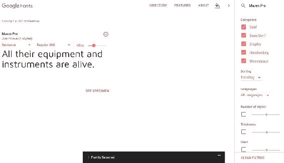

我们要寻找的下一个字体是 **Droid Serif** 。在底部，它将显示选择的 2 个系列:


让我们打开底部的那个东西来获取更多信息:


我们快完成了；我们只是在核实和回顾。从底部向上滑动的面板向我们展示了一些有趣的东西:

*   装入时间
*   如何在我们的页面上嵌入字体文件
*   如何在我们的 CSS 中指定这些字体

我可以通过进入*自定义*标签添加额外的字体粗细和字体样式:

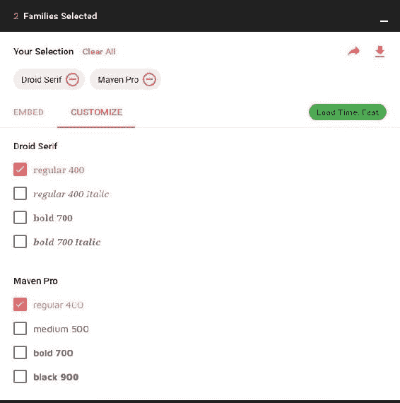

在这里我可以选择额外的字体粗细和字体样式。如果我选择了太多，装载时间指示器会变慢:


我们只需要 Droid Serif 的普通、斜体和加粗，Maven Pro 的普通和加粗，也就是从慢到中:


现在，我们设置为中等负载速度。我真的很想穿绿色的，但至少我们没有穿红色的，所以我们会选择红色的。

让我们回到*嵌入*选项卡，复制这些字体文件的链接:


这段代码实际上只是一个样式表。让我们把它粘贴到`index.html`和`shark-movies.html`的`head`标签中:


我们可以看到，这与我们用来指定样式的`<link/>`相同:

```html
<link href="https://fonts.googleapis.com/css?family=Droid+Serif:400,400i,700|Maven+Pro:400,700" rel="stylesheet">
```

事实上，它是一个指向`fonts.googleapis.com`的样式表，这是它获取字体的地方。它实际上显示了两种字体选择，都是:Droid Serif 和 Maven Pro。谷歌字体托管在谷歌的服务器上，我们只发出一个 http 请求，这对性能很好。

# 在 CSS 中应用字体

现在我们想在我们的 CSS 中使用这些字体。如您所见，它们向我们展示了如何做到这一点:

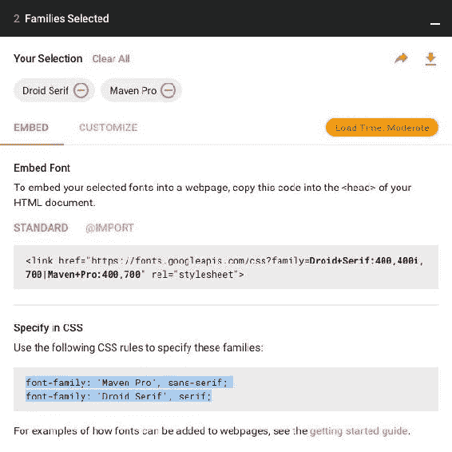

首先，我们将`h1`和`h2`中的`League Gothic`替换为`Maven Pro`:

```html
h1 {
  font-size: 80px;
  color: #0072ae;
  margin-bottom: 10px; 
  font-family: "Maven Pro", Arial, Helvetica, sans-serif;
  font-weight: 700;
}
h2 {
  font-size: 30px;
  margin-bottom: 10px;
  color: #eb2428;
  font-family: "Maven Pro", Arial, Helvetica, sans-serif;
  font-style: italic;
}
```

下一步是添加 **Droid Serif** 。我实际上想确保我们所有的正文副本、所有的段落、锚点以及除`h1`标签和`h2`标签之外的所有内容都使用 **Droid Serif** 。我们会格外小心，所以我们会添加后备字体。我们将把后备字体指定为`Georgia`，然后是`Times New Roman`，然后是默认的`serif`，如下图所示:

```html
body {
  background-color: #dcdcdc;
  font-family: "Droid Serif", Georgia, "Times New Roman", sans-serif;
  font-weight: 100;
  font-size: 16px; 
}
```

保存这些更改。现在当我们去我们的网站，在刷新它之前，我们可以看到我们有一个**联盟哥特式**应用于`h1`和`h2`，然后我们的通用`Arial`为段落:


当我们刷新时，我们得到了我们的新字体:这非常好。我们的`h1`和`h2`有 **Maven Pro** ，我们的所有其他文本有 **Droid Serif** :


在本节中，您学习了如何使用谷歌巨大的免费字体资源。使用谷歌的网络字体是世界上最简单的使用字体的方法，而不是完全不指定字体。在下一节中，我们将看到另一个伟大的字体资源— *Typekit* ，一个由 *Adobe* 提供大量高质量字体的订阅字体库。

# Adobe 测钨濬倰

Adobe Typekit 是目前最好的订阅字体服务之一。尽管有谷歌提供的免费字体，为什么还要使用 Typekit 呢？我不想说用谷歌你得到了你付出的东西，因为我认为谷歌的字体质量非常高，选择范围非常大，但我认为 Typekit 上字体的选择和质量也很突出。不过，最好的功能，在我看来，就是这个字体服务对所有 *Adobe Creative Cloud* 订阅者都是免费的。因此，如果您已经订阅了 Photoshop 和 Illustrator 等工具的创意云套件，您也可以访问 Typekit 上的每种字体。如果你不是 Adobe Creative Cloud 的订阅者，你也可以订阅 Typekit，这是完全值得的。另一个很酷的事情是，你可以非常容易地将字体同步到 Photoshop 和 Illustrator 中，并在这些工具中使用它们进行设计，而这并不像谷歌网络字体那样容易完成。在本节中，我们将从 Typekit 向我们的网站添加另一种字体。

# 从 Typekit 中选择字体

我们去[https://typekit.com/](https://typekit.com/)吧:


我将使用我的 Adobe ID 和密码登录。如果您没有 Adobe 标识，或者您不是 Adobe 创意云或作为独立服务的 Typekit 的成员，您需要注册才能继续。我们可以浏览看起来不错的字体，但让我们实际搜索我们想要的字体，`expo sans`:


在选择了 Expo Sans 之后，我们来到了一个显示不同重量和样式的页面。我们有两个基本选项可以使用，同步全部或添加到工具包。同步是为了将此字体同步到我的电脑，以便在 Photoshop、Illustrator 和其他 Adobe 产品中使用。把它添加到一个工具包中可以让我在网上使用它。让我们这样做，并点击添加到工具包按钮:

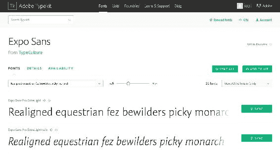

然后，我们将点击为世博无专业版创建工具包按钮:


我们将其命名为`Old Chompy`，我们网站的名称。那么，对于域名，我就用`localhost:8888`和`oldchompy.com`；`localhost:8888`将用于开发，`oldchompy.com`将用于后期网站投产，因为这将是域名。然后我们将点击继续:


This is a minor downside of using Typekit; you have to select a domain. Throughout this course, we've been serving our pages to the browser directly through the file system. We haven't had the need to set up a local development environment. Normally, you don't have to do this until you start working with AJAX calls, server-side code, or a **content management system** (**CMS**). In order to ensure that Typekit's fonts can't be used willy-nilly anywhere, Typekit delivers them to a specific domain name.

我将使用`localhost:8888`，这是我的本地服务器通过 MAMP 在我的计算机上运行的地方。设置一个本地开发环境远远超出了这个项目的范围，所以不要觉得你必须完全按照这个特定的步骤去做。我也将进入这个网站理论上将公开直播的领域，我们将是`localhost:8888`和`oldchompy.com`。

在我们进入这个嵌入代码之前，让我们回到网站，看看网址的第一部分:

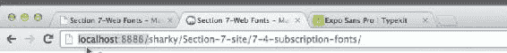

请注意，我现在通过`local host:8888`以不同的方式访问我的网站。这是我的本地服务器运行的地方。这与我以前访问它的方式不同，我以前直接通过文件系统访问它，转到文件库 web 服务器文档，然后转到我的站点文件夹:


我将为整个课程的这一部分做这个。就像我之前说的，如果你不能理解这一部分，就要担心。

# 向网站添加字体

让我们回到 Typekit 上的嵌入代码；该屏幕为我们提供了 JavaScript 嵌入代码:

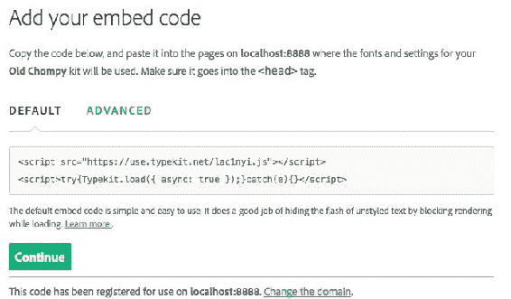

我将复制这个，转到升华文本，然后将其粘贴到我们的 HTML 文件的`<head></head>`标签中。我将在我的`shark-movies.html`页面中做同样的事情，并保存它:

```html
<!doctype html>
<html lang="en">
<head>
  <meta charset="UTF-8">
  <meta http-equiv="X-UA-Compatible" content="IE=edge,chrome=1">

<!-- mobile -->
  <meta name="viewport" content="width=device-width, initial-scale=1.0, minimum-
  scale=1.0">

<!-- description -->
  <title>Section 7-Web Fonts - Mastering CSS</title>

<!-- stylesheets -->
  <link rel="stylesheet" href="css/style.css">

<!-- fonts -->
  <link href='http://fonts.googleapis.com/css?
  family=Droid+Serif:400,700|Maven+Pro:400,700' rel='stylesheet' type='text/css'>
 <!-- Typekit -->
<script src="https://use.typekit.net/ycq4ynz.js"></script>
<script>try{Typekit.load({ async: true });}catch(e){}</script>
```

好了，回到打字组。我将单击继续按钮进入下一步:


在下一个屏幕上，我们可以做几件事，包括选择我们想要包括的重量和样式。默认情况下，选择常规、斜体、粗体和粗斜体的组合权重为 134K。我可以选择其他重量和样式，它向我展示了套件大小的变化。现在，我将保留默认的四种权重和样式。接下来，让我们点击顶部附近的“在 CSS 中使用字体”链接:

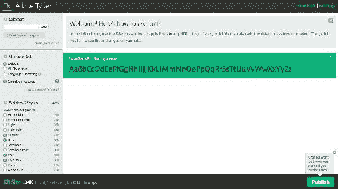

这就给了我们想要使用的字体名称，即`expo-sans-pro`:


我们复制`expo-sans-pro`回到 CSS 文件。只是为了好玩，把它粘贴到我们的`h1`选择器中，就在`Maven Pro`之前，然后保存它:

```html
h1 {
  font-weight: 700;
  font-size: 100px;
  color: #0072ae;
  margin-bottom: 10px; 
  font-family: 'expo-sans-pro', 'Maven Pro', Arial, sans-serif;
  font-style: normal;
  font-weight: bold;
}
```

在此之前，我们需要点击发布按钮:


现在，它会告诉我们可能需要几分钟的时间才能完全分布在他们的网络中，但通常情况下，它发生的速度要快得多。如果我们现在去我们的网站并刷新它，我们可以看到字体的不同:


这是 *Expo Sans Pro* ，真的很华丽的字体。我几乎比 *Maven Pro* 更喜欢它，这也是使用 Typekit 或付费字体服务的好处之一:他们有这么多令人难以置信的高质量字体。

所以总结一下，我们使用了 Typekit 中的一个漂亮字体，我很想用它来代替 *Maven Pro* ，但是我想我们还是把 Maven 留在那里吧。从诸如 Typekit 这样的服务中应用字体需要一些额外的步骤，但总的来说，这仍然比自己托管字体容易。在下一节中，我们将看看我们可以使用的另一种字体，称为图标字体。

# 图标字体

在本节中，我们将了解如何为网站添加图标字体。当您的网站上使用实心的彩色图标时，图标字体会很好地工作。所有图标都是对整个字体的一个请求的一部分，而不是将每个图像作为一个单独的请求，这样会更快。由于我们不使用图像，我们可以使用 CSS 来提供图像的颜色和大小，这意味着我们可以在不损失保真度的情况下使图标变大。我们将在页脚展示我们的图标字体。首先，我们必须为这两个页面构建页脚，然后我们将从 ZURB 基金会下载一个免费的图标字体。接下来，我们将使用 CSS 向我们的网站添加图标字体。最后，我们将为图标添加一个`:hover`状态，来实验我们如何使用 CSS 来改变它们的外观。

# 构建页脚

这就是我们在最终网站的页脚处拍摄的内容:


我们想要三列链接，每个链接都有一个图标。传统上，你会用图像来做这个，但是如果你有很多像我们这样的图像，这可能会影响性能。传统上，许多人将所有这些图标组合成一个名为`image sprite`的图像文件，并使用`background-position`属性将其加载为背景图像，仅显示所需图像的背景图像部分。这将确保您有一个网络请求，而不是 10 个，因为您一直在使用一个图像文件。这个过程很棘手，因为你必须使用`background-position`属性来找到你要找的图像。更大的问题是，当改变颜色或添加新图标时，你必须更新精灵，然后更新 CSS。图像精灵最大的问题是当你必须支持 HiDPI 或*视网膜*设备时。图标字体并不完美，但它们解决了这些棘手的问题。

在我们的两个 HTML 文件中，让我们复制页脚的代码:

```html
<!-- 
================ 
Footer
================
--> 
<footer>
  <div class="wrapper grouping">
    <ul>
      <li class="list-heading">Social</li>
      <li><a href=""><span></span>Facebook</a></li>
      <li><a href=""><span></span>Twitter</a></li>
      <li><a href=""><span></span>Google+</a></li>
      <li><a href=""><span></span>Dribble</a></li>
    </ul>
    <ul>
      <li class="list-heading">Interwebs</li>
      <li><a href=""><span></span>Github</a></li>
      <li><a href=""><span></span>Stack Overflow</a></li>
      <li><a href=""><span></span>Zurb Foundation</a></li>
    </ul>
    <ul>
      <li class="list-heading">Resources</li>
      <li><a href=""><span></span>Smashing Mag</a></li>
      <li><a href=""><span></span>Treehouse</a></li>
      <li><a href=""><span></span>Designer News</a></li>
    </ul>
    <p class="legal-copy clear">Ol' Chompy - The Shark Site</p>
  </div><!-- end wrapper -->
</footer>
```

以下是没有添加任何 CSS 的情况:


我们需要清理一下。就在媒体查询开始之前，让我们删除一些 CSS 来使页脚对齐:

```html
/***************
Footer
***************/
footer {
  background: #fff url('img/seaweed.jpg') repeat-x 0 0;
  padding: 142px 0;
  font-size: 14px;
  line-height: 1.7; 
}
footer ul {
  float: left;
  margin: 0 100px 50px 0; 
}
footer .list-heading {
  text-transform: uppercase;
  color: #333;
  margin-bottom: 30px;
  font-size: 17px; 
  font-family: 'Maven Pro', Arial, Helvetica, sans-serif;
}
footer a {
  color: #333;
}
footer li, 
footer p {
  color: #4D4D4D; 
  line-height: 30px;
}
footer li {
  margin-bottom: 10px;
}
.legal-copy {
  text-align: right;
  font-size: 10px;
}
```

这使它看起来更好:

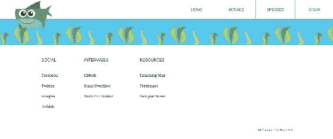

# 从 ZURB 基金会下载免费图标字体

让我们转到位于[http://zurb.com/playground/foundation-icon-fonts-3](http://zurb.com/playground/foundation-icon-fonts-3)的基础图标字体 3 的 Zurb 页面:

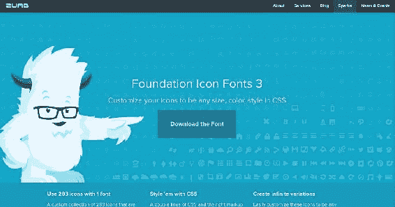

有很多不同的图标字体是这个图标集的标配。让我们点击下载字体按钮。在 Chrome 中，会在左下角下载；我们只需将文件夹放在桌面上，双击它就可以解压了。然后，我们可以打开`Foundation-icons`文件夹:


这个文件夹里面是一个 CSS 文件，几个字体文件，一个叫`preview.html`的文件，然后是一个装满`svgs`的文件夹。以下是 CSS 文件的外观:

```html
@font-face {
  font-family: "foundation-icons";
  src: url("foundation-icons.eot");
  src: url("foundation-icons.eot?#iefix") format("embedded-opentype"),
       url("foundation-icons.woff") format("woff"),
       url("foundation-icons.ttf") format("truetype"),
       url("foundation-icons.svg#fontcustom") format("svg");
  font-weight: normal;
  font-style: normal;
}
```

# 将图标字体添加到我们的网站

在我们的 CSS 中，我们可以看到`@font-face`规则加载在不同的字体文件中，就像我们在本章第二节中看到的网页字体一样。下面是每个图标字体的类名，后面是前面的伪元素:


我们已经学习了伪类，但没有学习伪元素。伪元素`:before`和`:after`基本上是“假装”元素，它们将出现在您正在调用的元素之前或之后。使用 CSS 添加内容是一种很好的方式。它添加的内容是与类名相关的图标。因此，如果我们深入选择器的底部，我们可以看到它实际上设置了字体系列、所有不同的字体属性以及其他一些东西:

```html
... {
  font-family: "foundation-icons";
  font-style: normal;
  font-weight: normal;
  font-variant: normal;
  text-transform: none;
  line-height: 1;
  -webkit-font-smoothing: antialiased;
  display: inline-block;
  text-decoration: inherit;
}
```

之后，在下一个选择器中，您可以看到每个图标都将内容添加到其伪元素中:

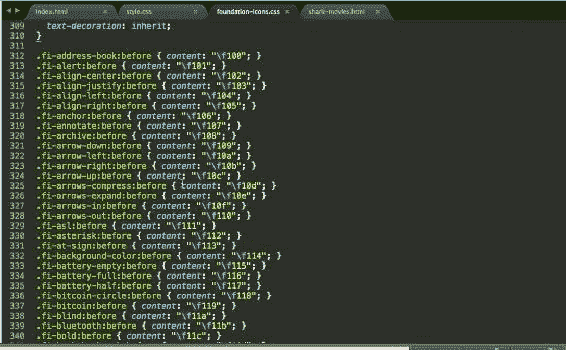

内容是与字体系列中的字母相对应的代码。例如:

```html
fi-address-book:before { content: "\f100"; }
```

这是与字体系列中的地址簿图标相对应的内容。我们在这些代码行中看到的`fi-`前缀代表**基础图标**。如果你不完全理解这一切，不要担心；主要是我们需要将这个 CSS 复制到我们的 CSS 文件中。它有 594 行代码，所以我不想把它包含在我们现有的样式表中，因为它只会让它过于膨胀，超出我的意愿。所以我们有两个选择。我们可以从 CSS 文件中找出我们计划使用的图标，或者我们可以单独链接到 CSS 文件。让我们单独链接到它——这样，如果我们需要的话，我们就可以拥有整个图标字体库。理想情况下，我们会在转移到生产之前剔除未使用的图标字体，因为将该文件配对到我们正在使用的 10 个图标会使其从 20kb 变为 1kb！

让我们将这个文件保存在我们项目的`css`文件夹中，并将其称为`icons.css`:


我们现在将进入我们的`index.html`文件，并在这个文件的头部添加一个到`foundation-icons.css`的链接，就在到`style.css`的链接下面:

```html
<!-- stylesheets -->
 <link rel="stylesheet" href="css/style.css">
 <link rel="stylesheet" href="css/foundation-icons.css">
```

保存这个，复制它，跳转到鲨鱼电影粘贴在那里，并保存它。

接下来，让我们创建一个名为`icons`的新文件夹。我们将把四个不同的字体文件拖到这个新文件夹中:

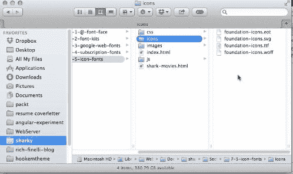

既然这四个不同的字体文件都在`icons`文件夹中，回到`icons.css`文件中，我们只需要将源文件更改为现在指向我们刚刚放置这些字体文件的文件夹。让我们在网址前面加上`../icons/`，就像这样:

```html
@font-face {
  font-family: "foundation-icons";
  src: url("../icons/foundation-icons.eot");
  src: url("../icons/foundation-icons.eot?#iefix") format("embedded-opentype"),
       url("../icons/foundation-icons.woff") format("woff"),
       url("../icons/foundation-icons.ttf") format("truetype"),
       url("../icons/foundation-icons.svg#fontcustom") format("svg");
  font-weight: normal;
  font-style: normal;
}
```

所以现在我们有这些指向正确文件夹的网址。

我们现在需要将图标类添加到 HTML 中的元素中，以便加载到图标中。但是首先我们需要确定使用哪些类。`preview.html`文件在这方面很有帮助，所以让我们从`foundation-icons`文件夹打开它:

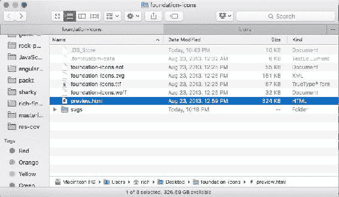

当我们打开它时，我们可以看到不同大小的图标。搜索脸书，在这里我们可以看到我们正在寻找的脸书图标和与之对应的类名:`fi-social-facebook`:


复制除该类名句点以外的所有内容，并将其粘贴到`index.html`中的脸书链接旁边:

```html
<footer>
  <div class="wrapper grouping">
    <ul>
      <li class="list-heading">Social</li>
      <li><a href=""><span class="fi-social-facebook"></span>Facebook</a></li>
      <li><a href=""><span></span>Twitter</a></li>
      <li><a href=""><span></span>Google+</a></li>
      <li><a href=""><span></span>Dribble</a></li>
    </ul>
    <ul>
      <li class="list-heading">Interwebs</li>
      <li><a href=""><span></span>Github</a></li>
      <li><a href=""><span></span>Stack Overflow</a></li>
      <li><a href=""><span></span>Zurb Foundation</a></li>
    </ul>
    <ul>
      <li class="list-heading">Resources</li>
      <li><a href=""><span></span>Smashing Mag</a></li>
      <li><a href=""><span></span>Treehouse</a></li>
      <li><a href=""><span></span>Designer News</a></li>
    </ul>
    <p class="legal-copy clear">Ol' Chompy - The Shark Site</p>

  </div><!-- end wrapper -->
</footer>
```

保存这个，现在，当我们去我们的网站，我们将能够看到脸书图标:


# 设置图标字体的样式

我们有两个问题:一是太小，二是真的很接近字。我们应该做的是给每个图标添加`margin-right`并使其变大。这意味着 HTML 中的每个`span`标签都需要一个类。让我们添加`class="icon"`如下:

```html
<footer>
  <div class="wrapper grouping">
    <ul>
      <li class="list-heading">Social</li>
      <li><a href=""><span class="icon fi-social-facebook"></span>Facebook</a></li>
      <li><a href=""><span class="icon"></span>Twitter</a></li>
      <li><a href=""><span class="icon"></span>Google+</a></li>
      <li><a href=""><span class="icon"></span>Dribble</a></li>
    </ul>
    <ul>
      <li class="list-heading">Interwebs</li>
      <li><a href=""><span class="icon"></span>Github</a></li>
      <li><a href=""><span class="icon"></span>Stack Overflow</a></li>
      <li><a href=""><span class="icon"></span>Zurb Foundation</a></li>
    </ul>
    <ul>
      <li class="list-heading">Resources</li>
      <li><a href=""><span class="icon"></span>Smashing Mag</a></li>
      <li><a href=""><span class="icon"></span>Treehouse</a></li>
      <li><a href=""><span class="icon"></span>Designer News</a></li>
    </ul>
    <p class="legal-copy clear">Ol' Chompy - The Shark Site</p>

  </div><!-- end wrapper -->
</footer>
```

现在，在 CSS 的页脚部分，让我们添加一个新的规则集来修复这两个问题:

```html
footer .icon {
  margin-right: 10px;
  font-size: 30px;
}
```

我们可以做的另一件事是添加一个过渡，因为我们将有一个悬停效果，这将有助于缓解状态变化。让我们添加一个过渡:

```html
footer .icon {
  margin-right: 10px;
  font-size: 30px;
 -webkit-transition: .25s color ease-in-out;
 transition: .25s color ease-in-out;
}
```

现在刷新站点，您会看到脸书图标稍微大了一点，并且有更多的空间:

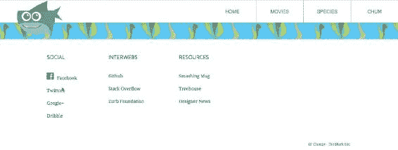

现在我们需要做的是为推特、谷歌、运球和 HTML 中的其他六个链接添加一个相应的类:

```html
<footer>
  <div class="wrapper grouping">
    <ul>
      <li class="list-heading">Social</li>
      <li><a href=""><span class="icon fi-social-facebook">
      </span>Facebook</a></li>
      <li><a href=""><span class="icon fi-social-twitter">
      </span>Twitter</a></li>
      <li><a href=""><span class="icon fi-social-google-plus">
      </span>Google+</a></li>
      <li><a href=""><span class="icon fi-social-dribbble">
      </span>Dribbble</a></li>
    </ul>
    <ul>
      <li class="list-heading">Interwebs</li>
      <li><a href=""><span class="icon fi-social-github">
      </span>Github</a></li>
      <li><a href=""><span class="icon fi-social-stack-overflow">
      </span>Stack Overflow</a></li>
      <li><a href=""><span class="icon fi-social-zurb"></span>Zurb 
      Foundation</a></li>
    </ul>
    <ul>
      <li class="list-heading">Resources</li>
      <li><a href=""><span class="icon fi-social-smashing-mag">
      </span>Smashing Mag</a></li>
      <li><a href=""><span class="icon fi-social-treehouse">
      </span>Treehouse</a></li>
      <li><a href=""><span class="icon fi-social-designer-news">
      </span>Designer News</a></li>
    </ul>
    <p class="legal-copy clear">Ol' Chompy - The Shark Site</p>

  </div><!-- end wrapper -->
</footer>
```

以下是它的外观:


好的！现在我们已经有了所有的图标类，并且在页脚的每个链接上都有一个图标。图标字体很酷的一点是，在 HiDPI 设备上它们会很清晰。此外，我们可以在悬停状态下更改颜色和其他属性，这是普通光栅图像无法做到的。让我们为所有这些添加一个快速悬停状态。在我们的 CSS 中，让我们添加一个新的选择器:

```html
footer .icon {
  margin-right: 10px;
  font-size: 30px;
  -webkit-transition: .25s color ease-in-out;
  transition: .25s color ease-in-out;
}
footer a:hover .icon {
 color: #f00;
}
```

应用这个，你会看到这个图标很好地过渡到一个完全不同的颜色:

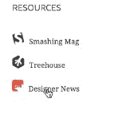

图标字体是您网站的绝佳选择。我建议在网站的非关键元素上使用图标字体，因为如果由于某种原因字体没有加载到用户的计算机上，就没有退路了。后退通常默认为一个正方形，或者更糟，一个完全不相关的字符或字母。在我们的例子中，我认为我们没问题，因为在我们的图标字体没有加载的情况下，我们仍然会在它旁边有图标的描述。图标字体的好处是，就像任何其他字体一样，它们可以流畅地缩放到视网膜设备。

# 摘要

我们从讨论`@font-face`属性开始了网页字体这一章，用它来给我们的网站添加字体。我们研究了如何使用谷歌字体和字体套件。最后，您学习了如何使用图标字体，并使用 Zurb 中的图标字体构建网站页脚。在下一章中，我们将讨论视网膜设备，并为 HiDPI 设备的世界准备好我们的页面。