# Flexbox，第 1 部分

Flexbox 是一个用于布局页面各部分的模块，它目前拥有强大的浏览器支持，从 Internet Explorer 10 开始。技术上，它不是为整页版面设计的；它更适合页面的部分布局，或者给定的组件。

例如，以下三列(章鱼、螃蟹和鲸鱼)是使用浮动布局的，但是我们将使用 flexbox 来做完全相同的事情:


Flexbox 是一个很大的话题，所以我们将分两章讨论它。本章将介绍基础知识，我们将讨论如何实现 flexbox，从 floats 切换到 flexbox，以及所有 flexbox 属性和快捷键。在下一章中，我们将构建一个新的部分—下面的产品列表—来演示我们如何使用 flexbox 构建不同的东西:


I'm going to code in the latest version of Chrome, which as of now supports the non-prefixed versions of all flexbox properties. This is going to un-complicate the learning experience. But, before we're done we'll need to add vendor prefixes for maximum browser compatibility.

我们将讨论以下主题:

*   CSS 柔性盒布局模块概述
*   从浮动切换到弹性箱
*   flexbox 属性和速记

# 柔性盒布局模块概述

什么是 flexbox？通常被称为柔性盒，它的真实名称是*柔性盒布局模块*。它提供了一种更有效的方式来布局、对齐和在父元素的子元素之间分配空间，即使它们的大小和数量是未知的或动态的。Flexbox 定义了全新的布局模式。

传统上有*块模式*，是为文档布局设计的。有*直列模式*，是为文字设计的；*表格模式*，专为表格数据(表格)设计；和*定位模式*，这是为显式定位而设计的，不太考虑周围的其他元素。现在有*弹性箱模式*。那么 flexbox 是做什么的呢？它可以做很多真正有用的事情。flexbox 的核心是布局和对齐。下面的列表说明了它更常见的用例:

*   元素的垂直或水平布局。
*   元素向左或向右对齐，就像你可以使用彩车，但不需要彩车带来的额外负担。您也可以水平或垂直居中元素。
*   此外，您可以控制显示方向。例如，您可以让元素在默认情况下以源顺序显示，或者以相反的方向显示。
*   此外，您可以明确控制元素并更改它们的显示顺序。
*   它很容易做到的另一件事是，它给你同样高的柱子，这只能通过以前的黑客攻击来实现
*   它真正的乐趣在于它如何在父级中根据可用空间分配元素。
*   面向响应性设计

# Flex 术语

所以这都是令人兴奋的事情，我相信你想开始看到它的行动，但在我们开始之前，我们需要做一些功课，学习 flex 术语。

# 弹性容器和弹性项目

首先，有一个叫做*伸缩容器*的东西，它本质上是一个包含所有*伸缩项目*的元素。换句话说，它是元素集合的父元素；flex 项是其父项或 flex 容器的子元素。


# 主要尺寸和交叉尺寸

有个东西叫*主尺寸*和*十字尺寸*，如下图:

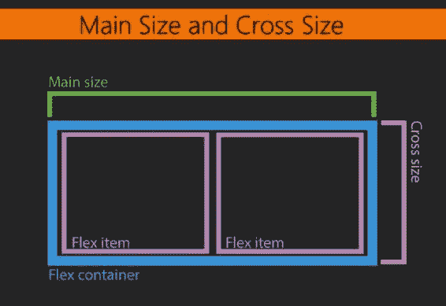

默认情况下，主尺寸是宽度，十字尺寸是高度，但是如果您修改`flex-direction`，这可能会改变，这将在下一节中介绍。

# 主轴和横轴

而且还有一个东西叫做*主轴*，默认水平运行，*横轴*，默认垂直运行，如下图所示:


# 对齐内容和对齐项目

在本章的后面，你会了解到一个名为`justify-content`的属性，它控制沿着主轴的对齐；`align-items`属性控制沿横轴的对齐。这里有一个重要的概念。主轴和横轴可以根据`flex-direction`设置为`column`或`row`进行切换。所以主轴默认永远是横轴，除非你用`flex-direction: column`，纵轴变成主轴！

如果这是你第一次尝试 flexbox，你可能会说，“嘿，慢点！”不用担心，这只是对术语和一些属性和概念的介绍；不要指望这一切会马上发生。在接下来的部分中，当我们开始使用不同的属性时，我们将更多地参考前面的图表，并且在接下来的部分中，我们将深入讨论每一个属性。

# 从浮动到弹性箱

在本节中，我们将开始工作，并将我们的列模块从基于浮点的布局更改为基于 flexbox 的布局(我很兴奋！).

首先，我们将从列中移除所有与浮点相关的属性，并将它们分解为一个正方形；然后，我们将使用`display: flex`将浮动布局转换为基于 flexbox 的布局，以查看即时结果。最后，我们将探索`flex-direction`如何在响应性设计中发挥作用；我们将在讨论更小的屏幕尺寸时讨论这个问题。

# 从“列”部分删除与浮点相关的属性

好的，这是我们的三列布局:


让我们回忆一下它是如何移动到一个更小宽度的单柱试管中的:

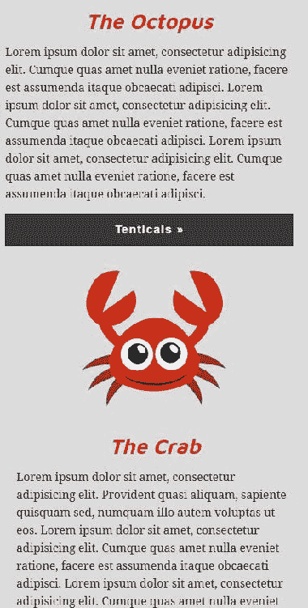

好吧，让我们去 CSS 文件。现在我们将从列中移除所有基于浮点的属性。

从这里开始:

```html
****************
3 columns
****************/
.column {
  float: left;
  width: 31.25%; /* 300/960 */
  margin-left: 3.125%; /* 30/960 */
}
.column:first-child {
  margin-left: 0;
}
.columns figure {
  margin: 0 auto;
  width: 100%;
  max-width: 250px;
}
```

让我们基本上删除所有内容，使其看起来像这样:

```html
****************
3 columns
****************/
.column {

}

```

接下来，让我们把响应媒体查询中基于浮点的代码去掉。所以从这个开始:

```html
@media screen and (max-width: 1023px){
  .intro-content {
    width: auto;
    float: none;
    padding-bottom: 0;
    margin-bottom: 30px;
  }
  .go-premium {
    width: auto;
    float: none;
    margin-top: 0;
  }
 .column {
 float: none;
 width: auto;
 padding: 0 50px;
 }
 .column figure {
 margin: 0 auto;
 width: 100%; 
 max-width: 250px;
 }
 .column h2 {
 text-align: center;
 }
}/* end of media query */
```

让我们换成这样:

```html
@media screen and (max-width: 1023px){
  .intro-content {
    width: auto;
    float: none;
    padding-bottom: 0;
    margin-bottom: 30px;
  }
  .go-premium {
    width: auto;
    float: none;
    margin-top: 0;
  }
}/* end of media query */
```

在另一个非常小宽度的媒体查询中，让我们删除对该列的最后一个引用。所以，从这个开始:

```html
@media screen and (max-width: 550px) {
  h1 {
    font-size: 40px;
  }
  h2 {
    font-size: 26px;
  }
 .column {
 padding: 0;
 }
  .content-block .figure {
    width: 200px;
    display: block;
    margin-left: auto;
    margin-right: auto;
    float: none;
  }
  .content-block h1 {
    text-align: center;
  }
  .button-narrow {
    width: 100%;
  }
}/* end of media query */
```

让我们移除`.column {}`规则集，看起来是这样的:

```html
@media screen and (max-width: 550px) {
  h1 {
    font-size: 40px;
  }
  h2 {
    font-size: 26px;
  }
  .content-block .figure {
    width: 200px;
    display: block;
    margin-left: auto;
    margin-right: auto;
    float: none;
  }
  .content-block h1 {
    text-align: center;
  }
  .button-narrow {
    width: 100%;
  }
}/* end of media query */
```

好吧，如果我们刷新浏览器并加宽它，我们将回到堆叠布局:


我们已经成功地从这个部分移除了基于浮点的布局，因为我们的三个列都不见了。

# 使用显示器打开弹性盒:弹性

现在我们将使用 flexbox 重新构建列。我们来看看我们的 index.html 档案。以下是我们称之为列的区域的标记:

```html
<!-- 
===============
Secondary Sections
===============
-->
<section class="secondary-section grouping">
  <div class="wrapper">
    <div class="column">
      <figure>
        
      </figure>
      <h2>The Octopus</h2>
      <p>Lorem ipsum dolor...</p>
      <a href="#" class="button">Tenticals &raquo;</a>
    </div>
    <div class="column">
      <figure>
        
      </figure>
      <h2>The Crab</h2>
      <p>Lorem ipsum dolor...</p>
      <a href="#" class="button">Crabby &raquo;</a>
    </div>
    <div class="column">
      <figure></figure>
      <h2>The Whale</h2>
      <p>Lorem ipsum dolor...</p>
      <a href="#" class="button">Stuart &raquo;</a>
    </div>
  </div><!-- end wrapper -->
</section>
```

这些`<div class="column"></div>`中的每一个都将是我们的弹性项目；`<div class="wrapper">`将是我们的弹性容器。为了便于理解，我将把我们的标记简化为:

```html
<div class="wrapper"> <!--flex container-->
  <div class="column">...</div> <!--flex item-->
  <div class="column">...</div> <!--flex item-->
  <div class="column">...</div> <!--flex item-->
</div> <!--end of flex container-->
```

让我们向 flex 容器添加一个名为“columns”的新类，我们将使用 flexbox 代码来定位 flex 容器:

```html
<div class="wrapper columns"> <!--flex container-->
  <div class="column"></div> <!--flex item-->
  <div class="column"></div> <!--flex item-->
  <div class="column"></div> <!--flex item-->
</div> <!--end of flex container-->
```

让我们添加一个新的规则集，目标是我们未来的 flex 容器。要将某物转换成柔性容器，只需添加`display: flex`:

```html
/****************
3 columns
****************/
.columns {
  display: flex;
}
.column {

}
```

flex 容器的子容器将自动成为 flex 项目。

Note the grandchildren and great-grandchildren elements will not be considered flex items, only the immediate children.

我们得到的是:

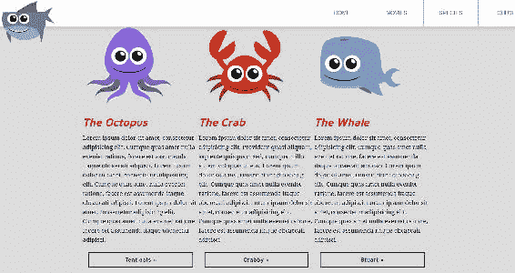

我们基本上已经用一个简单的属性实现了浮动布局:`display: flex`。间距有点紧，但我们还是有水平布局。

Flex overrides floats. Let's say we have many floats, namely `float: left`, `float: right`, and `float: none`; whatever it might be, flex items ignore floats, that is, they have zero impact. So once a container element gets `display: flex`, making the children elements flex items, floats are now ignored on those flex items. I can float to my heart's delight, but it will have zero impact on flex items. .

另外，要记住的另一件事是，每根柱子现在的高度相等。但让我们做一件事。让我们在弹性项周围添加一个边框:

```html
/****************
3 columns
****************/
.columns {
  display: flex;
}
.column {
  border: 1px solid pink;
}
```

看起来是这样的:

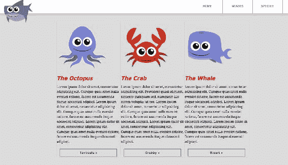

等高柱对吗？嗯，每一栏都有完全相同的内容。所以即使我们使用浮动来布局，我们也会有等高的列。当每一列的内容量不同时，高度就会不相等。我将删除螃蟹栏中的一些段落文本:

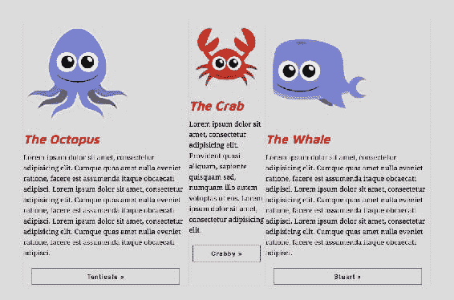

这样做之后，你可以看到，即使它的内容少了很多，但它仍然有相同的高度。尽管如此，这里还是发生了一些其他的事情，也就是螃蟹柱的宽度与其他两个柱不同。我们将在本章的后面讨论这一点，但是默认情况下，我们确实获得了相同的高度，这是一个快速的胜利，使用基于浮动的布局很难实现。

# 改变弯曲方向

让我们看看通过添加值为`column`的`flex-direction`属性来更改布局方向有多容易。该属性适用于`.columns`弹性容器。我也去掉了粉色`border`。

```html
/****************
3 columns
****************/
.columns {
  display: flex;
 flex-direction: column;
}
.column {
}
```

我们会救这个然后轰！我们从水平走向垂直:

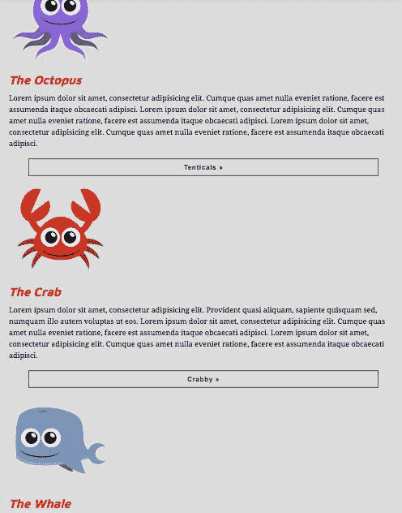

我们可能想要的一些中心对齐已经消失了；然而，布局仍然是垂直的。这很有趣。

另外我们可以将`flex-direction`设置为`column-reverse`:

```html
/****************
3 columns
****************/
.columns {
  display: flex;
  flex-direction: column-reverse;
}
.column {
}
```

早些时候，我们的章鱼最先出现；现在，如果我们刷新浏览器，我们的鲸鱼排在第一位，章鱼排在最后:


但是，如果我们查看我们的开发工具，我们会看到章鱼仍然是源顺序中的第一个，但却是最后一个显示的:

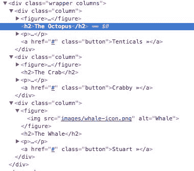

所以源顺序没有改变，只有显示顺序。

这是一个谈论我们的 flexbox 图表的好时机。当`flex-direction`设置为`row`时，该图适用-柔性项水平布置:

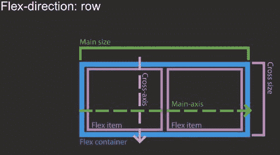

然而，当`flex-direction`变为`column`时，图表发生变化:

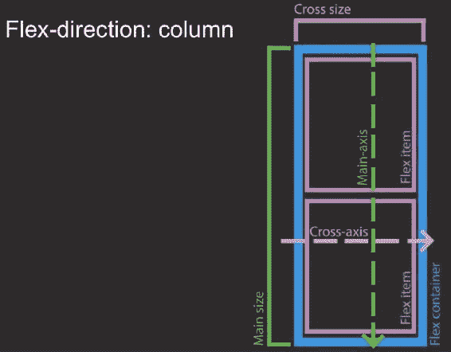

横轴现在从左向右延伸，主轴从上向下延伸，伸缩项现在堆叠在一起。

The default value of `flex-direction` is `row`; `flex-direction: row`.

我们也可以将`flex-direction`设置为`row-reverse`，它会做你认为它会做的事情:它将伸缩项水平排列，但顺序相反。我们来看看下面的图片；我们有鲸鱼、螃蟹和章鱼，顺序相反:

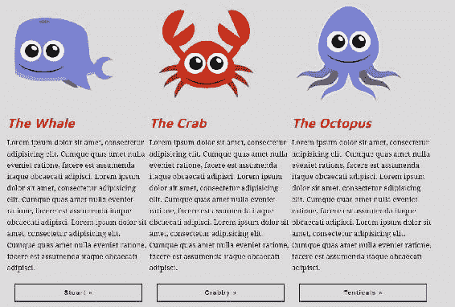

让我们从`.column` flex 容器中移除`flex-direction`属性，它将默认为 row，这就是我们想要的:

```html
/****************
3 columns
****************/
.columns {
  display: flex;
}
.column {
}
```

# 浏览器缩小

现在让我们通过缩小浏览器来考虑更小的设备。在平板电脑尺寸附近，它会变得有点紧:


在我们的媒体查询中，我们最初删除了所有的`float`东西。让我们把`flex-direction`改成`column`:

```html
@media screen and (max-width: 550px) {
  h1 {
    font-size: 40px;
  }
  h2 {
    font-size: 26px;
  }
  .columns {
 flex-direction: column;
 }
  .content-block .figure {
    width: 200px;
    display: block;
    margin-left: auto;
    margin-right: auto;
    float: none;
  }
  .content-block h1 {
    text-align: center;
  } 
  .button-narrow {
    width: 100%;
  }
}/* end of media query */
```

我们回到了一列堆叠布局，以实现更窄的浏览器宽度:

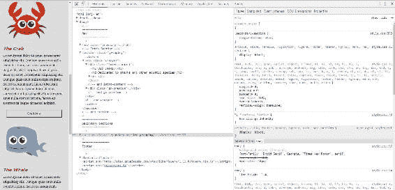

如您所见，间距和对齐仍然存在一些问题，我们将在下一节中使用 flexbox 解决这些问题。

总之，我们从列部分移除了所有基于浮动的布局 CSS，并使用`display: flex`添加了一个 flexbox 布局。我们还改变了`flex-direction`，正如我们看到的，它决定了主轴和横轴的方向。

# 了解弹性增长、弹性基础、弹性收缩和弹性

让我们试着了解一下 flexbox 的尺寸属性。在这一节中，我们将看看用`flex-grow`、`flex-shrink`、`flex-basis`来调整 flex 项目的大小，以及它们的简写；`flex`。所有这些属性都适用于弹性项，而不适用于弹性容器。

# 使用灵活增长

首先，我们来看看新的一页——`flexbox.html`。正如你可能已经猜到的，有一个`<section>`将是弹性容器，5 个`<div>`将是弹性物品。：

```html
<!--
====================
Flexbox Demo
====================
-->
<section class='flex-container'>
    <div class="flex-item flex-item1">item 1</div>
    <div class="flex-item flex-item2">item 2</div>
    <div class="flex-item flex-item3">item 3</div>
    <div class="flex-item flex-item4">item 4</div>
    <div class="flex-item flex-item5">item 5</div>
</section>
```

在添加 flexbox 属性之前，我们将从以下 CSS 开始:

```html
/***************
Flexbox demo
***************/
.flex-container {
  margin-top: 200px;
}
.flex-item {
  padding: 20px;
}
.flex-item1 { background: deeppink;}
.flex-item2 { background: orange; }
.flex-item3 { background: lightblue; }
.flex-item4 { background: lime; }
.flex-item5 { background: olive; }
```

以下是它在浏览器中的样子:

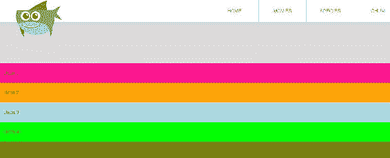

让我们通过在 CSS 文件中向 flex 容器添加`display: flex`来打开 flexbox:

```html
.flex-container {
  margin-top: 200px;
 display: flex;
}
```

好吧，如果我们刷新浏览器，这会为我们创建一个水平行，如下图所示:

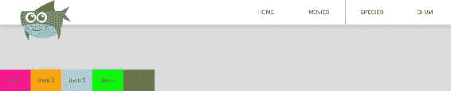

我们要看的第一个 flexbox 尺寸属性是`flex-grow`，这是一个因素。它决定了如何沿着 flex 容器的主轴分配“剩余空间”。让我们明确一下我说的“剩余空间”是什么意思。这是 flex 容器内部 flex 项目不占用的未填充空间。在我们的例子中，这是右边的空白处:


同样，`flex-grow`确定如何将剩余空间分配给伸缩项。让我们使用值`1`将其应用于我们的弹性项目:

```html
.flex-container {
  margin-top: 200px;
  display: flex;
}
.flex-item {
  padding: 20px;
  flex-grow: 1;
}
```

`flex-grow: 1`将强制剩余空间均匀分布到所有伸缩项。每个 flex 项目都会获得相等数量的先前未占用的空间:

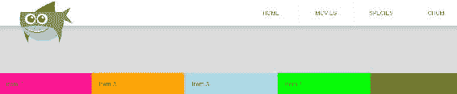

当我收缩浏览器时，我们可以看到，我们实现了一个完美的流体网格，而没有使用`width`属性，也没有计算 100 如何等分为 5 的精确百分比！


让我们为第二个 flex 项目创建一个新的规则集(每个 flex 项目都有一个唯一的类，第二个是`flex-item2`)。我们将添加一个值为`2`的`flex-grow`属性，这将为第二个弹性项分配两倍的剩余空间:

```html
.flex-container {
  margin-top: 200px;
  display: flex;
}
.flex-item {
  padding: 20px;
  flex-grow: 1;
}
.flex-item2 {
 flex-grow: 2
}
```

如果我们刷新浏览器，它应该如下所示:

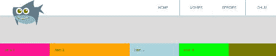

注意`flex-item2`不一定是其他宽度的两倍；它得到的剩余空间是其他空间的两倍。这是一个显著的区别。而且，如果我们缩小浏览器窗口，我们可以看到它是如何随着浏览器窗口的缩小而变窄的，直到我们缩小到一定的宽度，然后它们都大致相同。当有额外空间时，它会尝试将更多空间分配给`flex-item2`，因为它具有更高的`flex-grow`因子:


我们也可以将`flex-item2`的`flex-grow`设置为`0`，这是`flex-grow`的默认值。这基本上是说，不要将任何剩余空间分配给这个灵活项目:

```html
.flex-item2 {
  flex-grow: 0
}
```

第二个 flex 项目不会占用任何额外的空间；其余四个项目占用了额外的可用空间:

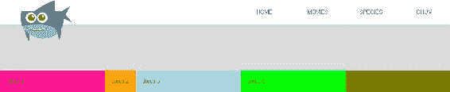

# 使用弹性基础

让我们来看看 flex 项目的另一个属性:`flex-basis`。注意`flex-basis`是屈曲项的初始主尺寸，根据屈曲因子分配剩余空间之前，分别是`flex-grow`和`flex-shrink`；我们稍后将讨论后者。现在，让我们把`flex-basis`想象成一个宽度。所以对于`flex-item2`，我们给它`400px`的`flex-basis`，去掉它的`flex-grow`因子:

```html
/***************
Flexbox demo
***************/
.flex-container {
  margin-top: 200px;
  display: flex;
}
.flex-item {
  padding: 20px;
  flex-grow: 1;
}
.flex-item2 {
 flex-basis: 400px;
}
```

如果你刷新浏览器，它会将第二个伸缩项调整到`400px`。但如果我们真的看看这个，它的尺寸是 400 像素多一点:


然而，我仍然将`flex-grow`作为`1`应用于所有的伸缩项，包括这个。让我们对此进行更改，使我们的第二个弹性项具有默认值`flex-grow: 0;`:

```html
.flex-item2 {
 flex-grow: 0;
    flex-basis: 400px;
}
```

现在，当您刷新浏览器时，您可以看到它正好是 400 像素:

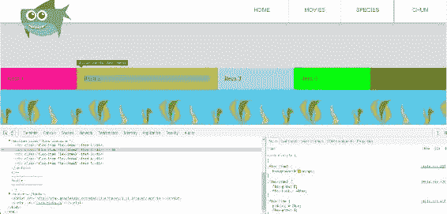

在我们开始缩小浏览器之前，它将正好是 400 像素；在某个时候，它会开始让步。一旦空间开始变得非常有限，它就决定让它小于 400 像素；这就是*初始主尺寸*部分`flex-basis`定义发挥作用的地方。我们告诉 flexbox，我们希望第二个 flex 项目的宽度为 400 像素，flexbox 将遵守这一点，直到 flex 容器空间不足以容纳它。然后，它开始将第二个弯曲项的宽度减小到小于`flex-basis: 400px`的宽度，以获得最佳布局。

让我们再次移除`flex-grow`:

```html
.flex-item2 {
  flex-basis: 400px;
}
```

注意`flex-basis`不仅仅是宽度:是`flex-direction`设置为`row`时的宽度，是默认的，是`flex-direction`设置为`column`时的高度。从技术上讲，因为它不是宽度或高度，它是主要的尺寸。

Are you starting to understand why we spent all that time going over flex terminology? If any of this is not making sense to you, I recommend going back to the start of this chapter to review flex terminology.

所以我们把`flex-direction`改成`column`。我们将在 flex 容器上执行此操作:

```html
.flex-container {
  margin-top: 200px;
  display: flex;
 flex-direction: column;
}
.flex-item {
  padding: 20px;
  flex-grow: 1;
}
.flex-item2 {
  flex-basis: 400px;
}
```

`400px`的 A `flex-basis`现在是第二个伸缩项的高度，现在主轴是垂直运行的。您可以在下面的截图中看到这一点:


因此`flex-basis`会覆盖设置的任何高度。让我们举个例子，为第二个弹性项输入一个`800px`的`height`:

```html
.flex-item2 {
  flex-basis: 400px;
 height: 800px;
}
```

我们看到高度还是 400 像素。真的，我应该说主尺寸是 400 像素，应该是这样的:


所以，`flex-basis`也接受两个关键词:`auto`和`content`。`auto`关键字的意思是“去看看`width`或`height`楼盘”。由于`flex-direction`目前为`column`，当我们将`flex-basis`改为`auto`时，`800px`的`height`不应再被忽略:

```html
.flex-item2 {
 flex-basis: auto;
  height: 800px;
}
```

高度现在是 800 像素:

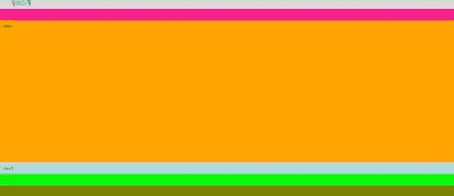

所以，还是那句话，`auto`是`flex-basis`的默认值。还有另一个关键词叫做`content`；这意味着 flex 项的大小基于 flex 项内容的大小。这是目前最新版本的 Chrome 不支持的，所以我就不演示了；然而，听起来一旦浏览器开始实现它，它在未来可能会很有用。

好的，我会去掉`height`和`flex-basis`。我还将删除以这种状态结束我们的 CSS 的`flex-direction`:

```html
.flex-container {
  margin-top: 200px;
  display: flex;
}
.flex-item {
  padding: 20px;
  flex-grow: 1;
}
.flex-item2 {

}
```

看起来是这样的:


# 使用伸缩收缩

A `flex-shrink`可以认为是`flex-grow`的反义词。当`flex-grow`决定一个伸缩项目应该消耗多少额外空间，当有剩余空间时与其他人成比例，而`flex-shrink`决定当没有剩余空间时，伸缩项目本身应该相对于他人缩小多少。所以，让我们看看这是怎么回事，然后把它拿出来。

首先，我们将`200px`的`flex-basis`添加到每个伸缩项中，并暂时删除`flex-grow`:

```html
.flex-container {
  margin-top: 200px;
  display: flex;
}
.flex-item {
  padding: 20px;
  flex-basis: 200px;
}
.flex-item2 {

}
```

因此，如果`flex-basis`设置为 200 像素，每个伸缩项将为 200 像素宽，并且任何伸缩项中都不允许有任何额外的空间，因为`flex-grow`已被移除。它应该是这样的:

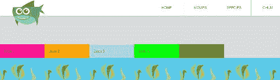

让我们将`1`的`flex-grow`添加回我们的`flex-item`课:

```html
.flex-item {
  padding: 20px;
  flex-basis: 200px;
  flex-grow: 1;
}
```

同样，额外的空间被分配给每个 flex 项目。`flex-basis`属性只是初始主尺寸的起点(注意我没有说“初始主尺寸”而不是“宽度”)。但是每一个灵活的项目都变得更宽，以消耗平均分配给每一个项目的额外空间。这就是你的页面此刻应该是什么样子:


让我们在第二个伸缩项上抛出一个`flex-shrink`属性。我们将使用系数`2`，如以下代码所示:

```html
.flex-container {
  margin-top: 200px;
  display: flex;
}
.flex-item {
  padding: 20px;
  flex-basis: 200px;
  flex-grow: 1;
}
.flex-item2 {
  flex-shrink: 2;
}
```

随着浏览器尺寸的减小，所有项目都会缩小。除了第二个 flex 项，它的收缩量是其他 flex 项的两倍，如下图所示:


如果没有为弹性项目指定，`flex-shrink`默认为`1`。因此，让我们将`flex-shrink: 1`添加到除第二个弹性项以外的所有弹性项中，第二个弹性项将`flex-shrink`设置为`2`，只是为了证明没有什么会改变:

```html
.flex-container {
  margin-top: 200px;
  display: flex;
}
.flex-item {
  padding: 20px;
  flex-basis: 200px;
  flex-grow: 1;
 flex-shrink: 1;
}
.flex-item2 {
  flex-shrink: 2;
}
```

我们可以看到，当我们把浏览器做得更小的时候，真的没有什么变化；第二个 flex 项目仍然比其他项目收缩得更多，如以下示例所示:


你可以做的另一件整洁的事情是将`flex-shrink`设置为`0`，以确保一个项目不会收缩。让我们对第二个 flex 项目执行此操作:

```html
.flex-container {
  margin-top: 200px;
  display: flex;
}
.flex-item {
  padding: 20px;
  flex-basis: 200px;
  flex-grow: 1;
  flex-shrink: 1;
}
.flex-item2 {
 flex-shrink: 0;
}
```

现在刷新浏览器。当空间有限时，除项目 2 外，所有其他 flex 项目都会收缩；它保持其`flex-basis: 200px`:


# 使用灵活速记

还有一个简写属性，叫做`flex`，我们可以用它来代替`flex-grow`、`flex-shrink`和`flex-basis`。让我们把`flex-basis`、`flex-grow`和`flex-shrink`换成刚刚的`flex`:

```html
.flex-container {
  margin-top: 200px;
  display: flex;
}
.flex-item {
  padding: 20px;
 flex: 1 1 200px;
}
.flex-item2 {
  flex-shrink: 0;
}
```

所以`flex`中数值的顺序如下:`flex-grow`、`flex-shrink`和`flex-basis`:

```html
.flex-container {
  margin-top: 200px;
  display: flex;
}
.flex-item {
  padding: 20px;
 flex: 1 1 200px; /* order: flex-grow, flex-shrink, flex-basis */
}
```

如果我们刷新浏览器，它将执行与我们使用非速记属性时完全相同的操作:


对于第二个 flex 项，它只有`flex-shrink`，所以我们可以用`flex: 1 0`的简写。`flex-basis`将被智能设置为默认的`auto`，可以省略。我们需要设置值`1 0`，因为`flex-grow`的默认值是`1`，所以即使我们没有明确设置`flex-grow`，我们也需要将其值添加到我们的简写中。我们还将删除现有的`flex-shrink`:

```html
.flex-container {
  margin-top: 200px;
  display: flex;
}
.flex-item {
  padding: 20px;
  flex: 1 1 200px; /* order: flex-grow, flex-shrink, flex-basis */
}
.flex-item2 {
 flex: 1 0; /* order: flex-grow, flex-shrink */
}
```

同样，我们在浏览器中看不到任何变化，这正是我们从我们的小重构中想要的:

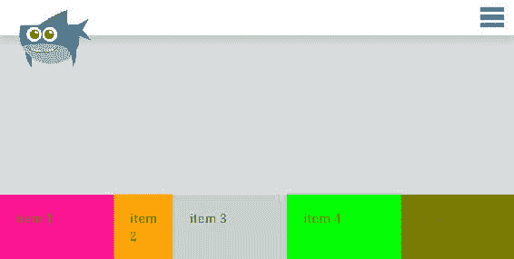

所以`flex: 1 0`是指`flex-grow = 1`和`flex-shrink = 0`。如前所述，`flex-basis`默认为`auto`，这里不需要补充。还有一个`none`的关键词，基本上就是说不要长，不要缩，主要尺寸看我的宽度或者高度，换句话说就是不要屈。速记很好而且简洁，但是当开始使用 flexbox 时，我建议单独使用每个属性，直到您完全理解每个属性的作用。

# 更多布局，更多定位

本节介绍 flexbox 的更多布局和定位。在这里，我们将检查一个新的属性，`justify-content`，以及如何在彼此之间嵌套 flexboxes，最后使用自动边距。

在开始之前，让我们通过去掉 flex 速记来重置一些`flex`属性:

```html
.flex-container {
  margin-top: 200px;
  display: flex;
}
.flex-item {
  padding: 20px;
}
.flex-item2 {

}
```

通过删除 flex 简写，每个 flex 项目不再担心增长、收缩或它们最初的主要大小应该是多少:


# 使用调整内容属性

首先是`justify-content`，这是一个灵活的容器属性，它决定了内容是对齐还是定位在主轴的开始、主轴的结束还是中间。让我们添加`justify-content`并将其设置为`flex-start`，如以下代码片段所示:

```html
.flex-container {
  margin-top: 200px;
  display: flex;
 justify-content: flex-start;
}
```

`flex-start`是`justify-content`的默认值，因此没有任何变化:


`flex-start`将伸缩项定位在主轴的起点。请记住，当`flex-direction`未指定或指定为`row`时，主轴水平从左向右运行。所以`flex-start`是左边，而`flex-end`是右边:


现在让我们将该值更改为`flex-end`:

```html
.flex-container {
  margin-top: 200px;
  display: flex;
 justify-content: flex-end;
} 
```

内容现在位于右侧:


这很像使用`float:right`，除了没有所有伴随浮动而来的额外负担和问题:没有清理，没有折叠，也没有浮动项目的重新整理。本质上，我们只是将伸缩项放在右边。

这非常有用，但真正的神奇发生在我们使用`justify-content: center`的时候:

```html
.flex-container {
  margin-top: 200px;
  display: flex;
  justify-content: center;
}
```

哦，我的天，我们刚刚把弹性物品放在中间了！


从来没有`float: center`。诚然，我们可以通过将容器的左右边距设置为`auto`来居中。但问题是，当我们这样做时，我们总是必须指定容器的`width`；因此，如果容器中的物品数量发生变化，我们也必须改变`width`属性。对事物进行定心还有其他技巧，但没有一个如此简单和灵活。

Flexbox 天生对动态内容更有准备，不需要定义任何`width`；让我们在 HTML 中添加另一个 flex 项来证明这一点:

```html
<section class="flex-container">
    <div class="flex-item flex-item1">item 1</div>
    <div class="flex-item flex-item2">item 2</div>
    <div class="flex-item flex-item3">item 3</div>
    <div class="flex-item flex-item4">item 4</div>
    <div class="flex-item flex-item5">item 5</div>
 <div class="flex-item flex-item1">item 6</div>
</section>
```

现在我们有六个项目，它们都仍然在中心位置:


但是等等，还有更多！有一个关键词叫做`space-between`，我们可以使用:

```html
.flex-container {
  margin-top: 200px;
  display: flex;
 justify-content: space-between;
}

```

这个关键字`space-between`，在每个项目之间均匀地重新分配额外的空间。所以每个元素之间都有“空间”:


请注意，第一个和最后一个元素紧挨着边缘；第一个 flex 项目紧靠其容器的最左边；最后一个 flex 项目紧靠其容器的最右边。

但是，还有另一个值`space-around`做了一些稍微不同的事情:

```html
.flex-container {
     margin-top: 200px;
     display: flex;
    justify-content: space-around;
 }
```

注意`space-around`将容器的额外空间重新分布在所有伸缩项周围，甚至是第一个和最后一个，而`space-between`仅在每个项之间插入额外空间。

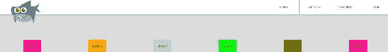

让我们重新访问主页，并在一个更实际的例子中实现它，即我们的三个列:


我们的三列设置为`display: flex`，但没有应用其他伸缩属性。因为 flex 容器是居中的，所以 flex 项目已经有点居中了。但是，我们希望每个 flex 项目之间有一些空间。所以在我们专栏的 CSS 区域，我们说`justify-content: space-between`。与我们目前所做的无关。我也把`max-width: 50%`放在我们的海洋生物上，这样它们就不会那么大了。但更重要的是`justify-content`:

```html
.columns {
  display: flex;
 justify-content: space-between;
}
.column {

}
.column figure {
 max-width: 50%;
}
```

什么都没变！


这是因为每一栏的文字。内容是推动每个 flex 项目来填充可用空间。因此，我们需要在这些项目或`flex-basis`中添加一个`width`来明确定义我们希望每列有多宽。这是因为由于没有额外的空间，flexbox 没有办法重新分配 flex 项目，在每个 flex 项目之间放置额外的空间。我们需要一些额外的空间。

让我们通过在每个列中添加`flex-basis: 30%`来实现这一点:

```html
.columns {
  display: flex;
  justify-content: space-between;
}
.column {
 flex-basis: 30%;
}
.column figure {
  max-width: 50%;
}
```

刷新页面，这是您应该看到的内容:


请注意，每个项目之间的空间均匀分布。可爱！不过，我们还有一些清洁工作要做。底部的按钮并不总是在每一列的底部；这一点现在不那么明显了，因为每一列中的内容相对来说都是相同的；但是，如果我们使每一栏的内容量有很大不同，这将变得更加明显:


我们如何解决这个问题？记住，在我们的例子中，flex 容器是列，每个列都是一个 flex 项。该按钮不是弹性项，因为它在列内。这就是嵌套弹性箱发挥作用的地方。

# 嵌套弹性框

让我们将该列转换为嵌套的 flex 容器:

```html
.columns {
  display: flex;
  justify-content: space-between;
}
.column {
  flex-basis: 30%;
 display: flex;
}.column figure {
  max-width: 50%;
}
```

当然，一个容器的伸缩项默认设置为`flex-direction:row`，所以都是水平挨着坐的，完全破坏了东西:


显然，这不是我们想要的样子，但我们可以很容易地补救这一点。让我们将`flex-direction`改为`column`，如下面的代码片段所示:

```html
.column {
  flex-basis: 30%;
  display: flex;
  flex-direction: column;
}
```

很好，我们又开始做生意了。看起来与我们将这些列作为 flex 容器之前所做的相同:


这对我们有什么帮助？嗯，我们可以开始使用`justify-content`，也许我们可以说`justify-content`，`space-between`:

```html
.column {
  flex-basis: 30%;
  display: flex;
  flex-direction: column;
 justify-content: space-between;
}
```

这使得按钮很好地位于底部，但现在位于内容的中间。每个 flex 项目之间的空间是均匀分布的，每一列的空间都不一样，因此看起来不太好:


让我们回到`justify-content`的默认值:

```html
.column {
  flex-basis: 30%;
  display: flex;
  flex-direction: column;
  justify-content: flex-start;
}
```

这将一切移回顶部，因为`flex-direction`是`column`，主轴现在上下运行:


# 使用自动边距

flexbox 值得注意的一点是，它对`margin`的`auto`关键词进行了全新的处理。自动页边距现在与 flexbox 的配合非常紧密。我现在可以将我的按钮作为选择器，并赋予它`auto`的`margin-top`:

```html
.columns {
  display: flex;
  justify-content: space-between;
}
.column {
  flex-basis: 30%;
  display: flex;
}
.column figure {
  max-width: 50%;
}
.column .button {
 margin-top: auto;
}
```

轰！按钮上方的空间现在会自动计算，按钮位于每列的底部:


当 flex-direction 为 row 时，这也有效；您可以使用`margin-left: auto;`或`margin-right: auto`将柔性物品抱到其柔性容器的外边缘。

为了举例说明这一点，让我们回到我们的 flexbox 演示示例，我们可以将 flex 容器的`justify-content`更改为`flex-start`，然后添加另一个规则集，该规则集使用`margin-left: auto`推动最终的 flex 项目紧靠右边缘:

```html
/***************
Flexbox demo
***************/
.flex-container {
  margin-top: 200px;
  display: flex;
 justify-content: flex-start;
}
.flex-item {
  padding: 20px;
}
.flex-item:last-child {
 margin-left: auto;
}
```

所有的伸缩项都排在左边——在它们的`flex-start`处——除了最后一个伸缩项，它抱在右边——或者在`flex-end`处——因为我们在自动计算它的左边距:


让我们回到主页，看看我们的专栏。关于这些专栏的最后一件事:红色标题没有在每个专栏的相同垂直位置对齐，因为我们的每一个海洋生物 SVG 的高度都略有不同:


让我们给每个海洋生物一个`150px`的`flex-basis`。既然，`flex-direction`是`column`，`flex-basis`可以认为是身高；因此，我们基本上给每个图形相同的高度`150px`:

```html
.columns {
  display: flex;
  justify-content: space-between;
}
.column {
  flex-basis: 30%;
  display: flex;
  flex-direction: column;
}
.column figure {
  max-width: 50%;
 flex-basis: 150px;
}
.column .button {
  margin-top: auto;
}
```

现在，这些红色标题将整齐地排列在一起:


总之，`justify-content`沿着主轴定位并重新分配额外的空间。您可以整天嵌套 flexboxes，自动边距非常贴心，允许您将内容放置在 flex 容器的相对边缘，这是一种非常常见的用户界面模式。

# 摘要

在本章中，我们已经介绍了 flexbox 的大量内容，包括所有基本的 flexbox 属性。我们将在下一章中继续讨论如何对齐和流动 flexbox 内容，以及实现这一点所需的属性。我们还将创建一个新的用户界面模式——一个产品列表——并看看 flexbox 如何在这方面提供帮助。