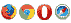
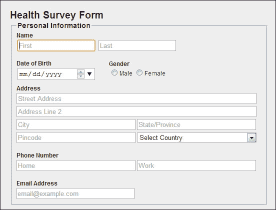
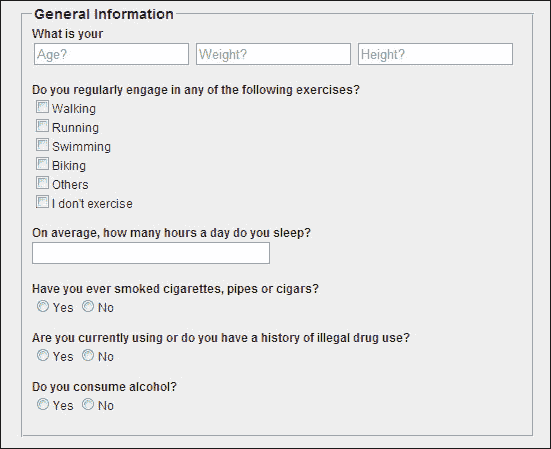

# 第一章。形式及其意义

在网页中使用表单是从用户那里收集相关数据的最有效方式。表单是用户与应用真正交互的方式，无论是搜索表单、登录屏幕还是多页注册向导。表单可以输入姓名、性别、信用卡号、密码、图像或上传文件到表单中。

在本章中，我们将涵盖以下主题:

*   Web 表单及其优势
*   新的 HTML5 `<form>`元素
*   构建 web 表单
*   构建 web 表单的指南

# 了解网页表单

在开始学习 HTML5 表单之前，让我们先了解一下什么是 web 表单。

与基于纸张的表单相比，网页上的表单提供了一个可以在客户端和用户之间更容易、更安全地共享信息的界面。它们是各种`<input>`类型的集合，如`textbox`、`radiobutton`和`checkbox`，允许用户执行各种动作并简化决策。

表单一直是网络的基本组成部分。没有它们，各种各样的网络交易、讨论和高效的搜索就根本不可能实现。大多数浏览器都支持基于 Web 的表单，可以用来在购买产品后提供反馈、从搜索引擎检索搜索结果、联系任何服务等等。

通过一个简单的例子，让我们了解什么是 web 表单。假设你有一次去医院，接待员给了你一张打印好的表格要你填写。你会遇到许多收集病人信息的领域。他们中的一些人要求你在看起来像文本框或文本区域的地方写下病人的姓名和地址，以及其他细节，如房间类型等；您还被要求从选项中选择一个或多个单选按钮或复选框。同样的概念也适用于 HTML5 表单。您必须填写该表格的字段，然后按下按钮将这些信息发送到服务器，而不是去医院将表格交给接待员。

## 福利

网页中的表单比纸质表单有很多优势。除了用于在线收集数据之外，web 表单还为用户和表单所有者提供了便利和速度。

网页表单的一些优势是:

*   在线表格帮助客户与公司交谈，因为它们包含数字存储的数据，并将这些数据推断为有意义的信息
*   表单所有者可以快速构建和分发 HTML5 界面，面向大量受众
*   表单所有者可以根据需要轻松更新和修改表单
*   级联样式表(CSS)和 JavaScript 属性允许作者使用特定的样式和功能自定义表单控件
*   由于不需要人力来收集信息，Web 表单既省时又经济
*   它们为决策提供了可视性，例如，在易贝等网站上在线购物
*   由于数据是由客户直接输入的，因此可以很容易地对其进行排序，以获得所需的信息

即使表单有很多好处，但构建它们并不是最好的工作，而且会变得令人头疼，因为如果我们谈论验证、错误处理和样式，一些表单会变得非常复杂。我们要么使用服务器端语言验证或捕捉错误，要么使用 JavaScript，甚至两者都使用。无论是哪种情况，web 表单都会占用您大量的开发时间，这可能是一个问题。然而，对于 HTML5 来说，一些痛苦已经被我们可以使用的新`<form>`类型的引入所消除。

尽管 HTML5 中有许多增强，但有些东西保持不变，例如:

*   当用户点击**提交**按钮时，表单仍然会将值发送到服务器
*   表单仍然包含在`<form>`元素中，如下面的代码片段所示:

    ```html
    <form action= "#">
      <input type= "text" name= "emailaddress">
      <input type= "submit" name= "submit">
    </form>
    ```

*   表单控件仍然是完全可脚本化的

但是，对于 HTML5 表单，不需要在`<form>`元素中包含`<form>`控件。

# HTML 对比 HTML5 表单

一个 HTML5 表单比以前的版本提供了两个主要的优势。它们是:

*   由于 HTML5 的新`<form>`类型和内置的验证将语义标记提升到了一个新的水平，所以在早期版本的 HTML 中需要的繁琐的脚本和表单样式被删除了
*   即使浏览器中禁用了脚本，用户也可以体验 HTML5 表单的好处

# 表单<输入>类型、元素和属性

HTML5 表单侧重于增强现有的简单 HTML 表单，以包含更多类型的控件，并解决网络开发人员目前面临的限制。它们最好的一点是，您现在可以使用几乎所有新的输入类型、元素和属性，并且 HTML5 表单完全向后兼容。支持新 HTML5 元素的浏览器增强了它们的功能，否则不支持它的浏览器将它们显示为文本框。

在这一节中，我们将学习新的 HTML5 `<form>`元素，例如`<input>`类型、元素和属性，它们被引入来增强表单的功能。

## 将<表单>中的<输入>类型

*   `date`: The `date` type allows the user to select a date with no time zone.

    在中支持。

    语法:

    ```html
    <input type= "date" name= "#">
    ```

    属性:

    *   `value`:初始值。格式为 yyyy-mm-dd
    *   `min`、`max`:可以选择最小和最大日期的范围
*   `datetime`: The `datetime` type allows the user to select a date and a time with the time zone set to UTC.

    格式为 yyyy-mm-dd HH:MM。

    在中支持。

    语法:

    ```html
    <input type= "datetime" name= "#">
    ```

*   `datetime-local`: The `datetime-local` type allows the user to select a date and time with no time zone. The format used is yyyy-mm-dd HH:MM.

    在中支持。

    语法:

    ```html
    <input type= "datetime-local" name= "#">
    ```

*   `color`: The `color` type results in opening a color chooser pop up and is used to choose a color of the `<input>` type `#rrggbb` (hex value). It could be represented by a swatch or a wheel picker.

    选择的值必须是有效的简单颜色十六进制值，如`#ffffff`。

    在中支持。

    语法:

    ```html
    <input type= "color" id= "#"name= "#">
    ```

    属性:

    *   `value`:初始值
*   `number`: The `number` type allows the user to input the numbers in either `integer` or `floating point`.

    它也被称为旋转器。

    我们可以对接受的数字设置限制。

    在中支持。

    语法:

    ```html
    <input type= "number" name= "#">
    ```

    属性:

    *   `value`:初始值
    *   `min`、`max`:用上下箭头选择最小和最大值的范围
    *   `step`:这告诉我们当我们滚动微调器时要改变多少值
*   `range`: The `range` type allows the user to input the numbers in either integer or floating point from a range of numbers. It is displayed in the form of a slider.

    使用此功能，除非使用 JavaScript，否则不会显示精确值，因此如果希望用户选择精确值，请使用`<input type="number" />`。

    我们可以对接受的数字设置限制。

    在中支持。

    语法:

    ```html
    <input type= "range" name= "#">
    ```

    属性:

    *   `value`:初始值。默认值是滑块的中点。
    *   `min`、`max`:可以选择最小值和最大值的范围。最小值的默认值为 0，最大值为 100。
    *   `step`:这告诉我们滚动微调器时要改变多少值。默认值为 1。
*   `email`: The `email` type allows the user to enter the text in e-mail address format `email@example.com`.

    点击**提交**按钮，输入的文本自动生效。

    如果指定了多个属性，可以输入多个电子邮件地址，用逗号分隔。

    在中支持。

    语法:

    ```html
    <input type= "email" name= "#">
    ```

    属性:

    *   `value`:初始值(合法的电子邮件地址)

    使用多个属性，即接受多个电子邮件标识，每个属性用逗号分隔。

*   `search`: The `<input>` type `search` allows the user to enter text that the user wants to search for.

    搜索字段的行为类似于标准文本字段，并具有内置的明文功能，例如 WebKit 浏览器中的十字按钮。

    在中支持。

    语法:

    ```html
    <input type= "search" name= "#">
    ```

    属性:

    *   `value`:初始值
*   `tel`: The `tel` type allows the user to input a telephone number. `tel` does not provide any default syntax, so if you want to ensure a particular format, you can use `pattern` to do additional validation.

    到目前为止没有浏览器支持。

    语法:

    ```html
    <input type= "tel" name= "#">
    ```

    属性:

    *   `value`:作为电话号码的初始值
*   `month`: The `month` type allows the user to select a month and a year with no time zone.

    在中支持。

    语法:

    ```html
    <input type= "month" name= "#" >
    ```

    属性:

    *   `value`:初始值。格式为 yyyy-mm。
    *   `min`、`max`:可以选择最小值和最大值的范围。
*   `time`: The `time` type allows the user to select a time value with hour, minutes, seconds, and fractional seconds with no time zone.

    在中支持。

    语法:

    ```html
    <input type= "time" name= "#">
    ```

*   `url`: The `url` type allows the user to input an absolute URL.

    点击**提交**按钮，输入的文本自动生效。

    在中支持。

    语法:

    ```html
    <input type= "url" name= "#" >
    ```

    属性:

    *   `value`:作为绝对 URL 的初始值
*   `week`: The `week` type allows the user to select a week and a year with no time zone.

    在中支持。

    语法:

    ```html
    <input type= "week" name= "#">
    ```

    属性:

    *   `value`:初始值。格式为 yyyy-mmW。

到目前为止，我们已经了解了各种`<input>`类型。现在让我们看看新的 HTML5 `<form>`元素。

## <形成>元素

*   `<datalist>`: The `<datalist>` element provides a list of predefined options for form controls to the user as they input data. It is used to provide an `autocomplete` feature on the `<form>` elements.

    例如，如果用户在文本字段中输入一些文本，列表将会下拉，其中包含他们可以从中选择的预填充值。

    在中支持。

    例如:

    ```html
    <input list= "browsers" name= "browser">
    <datalist id= "browsers">
      <option value= "Internet Explorer">
      <option value= "Firefox">
    </datalist>
    ```

*   `<keygen>`: The `<keygen>` element is used to provide a secure way to authenticate users.

    提交表单时，私钥存储在本地密钥库中，公钥打包并发送到服务器。

    在中支持。

    例如:

    ```html
    <form action= "keygen.html" method= "get"><input type= "text" name= "username"><keygen name= "security"><input type= "submit">
    </form>
    ```

*   `<output>`: The `<output>` element represents the result of a calculation performed like the one performed by scripts.

    在中支持。

    例如:

    ```html
    <form onsubmit="return false" oninput="o.value=parseInt(a.value)+parseInt(b.value)"><input name="a" type="number" step="any">+<input name="b" type="number" step= "any">
    =<output name="o"></output></form>
    ```

现在让我们看看新的 HTML5 `<form>`属性。

## 形态>属性

*   `autocomplete`: The `autocomplete` attribute allows users to complete the forms based on earlier inputs. We can have an autocomplete `on` option for the form and an `off` option for specific input fields or vice versa.

    它适用于`<form>`和`<input>`类型，如`textbox`、`datepicker`、`range`、`color`、`url`、`tel`、`search`和`email`。

    在中支持。

    例如:

    ```html
    <input type="text" name="city" autocomplete="on">
    ```

*   `autofocus`: When the `autofocus` attribute is added, an `<input>`type automatically gets focus when the page loads.

    例如，当我们打开谷歌主页或任何搜索引擎时，焦点会自动转移到用户输入文本以执行搜索的文本框。

    适用于`<input>`型、`textbox`、`search`、`url`、`email`、`tel`和`password`。

    在中支持。

    例如:

    ```html
    <input type="text" name="city">
    <input type="text" name="state" autofocus>
    ```

*   `placeholder`: The `placeholder` attribute gives users a hint that describes the expected value of an `<input>` field.

    当单击控件或获得焦点时，它会消失。

    只能用于简短描述，否则使用`title`属性。

    它适用于`<input>`类型、`textbox`、`search`、`url`、`email`、`tel`和T6。

    在中支持。

    例如:

    ```html
    <input type="text" name="name" placeholder="First Name">
    ```

*   `min` and `max`: The `min` and `max` attributes are used to specify the minimum and maximum value to an `<input>` type.

    它适用于`<input>`类型、`number`、`range`、`date`、`datetime`、`datetime-local`、`month`、`time`和`week`。

    在中支持。

    例如:

    ```html
    <input type="number" min="1" max="5">
    ```

*   `list`: The `list` attribute refers to a `<datalist>` element that contains predefined options for an `<input>` element.

    它用于在`<form>`元素上提供`autocomplete`特征。

    例如，如果用户在文本字段中输入一些文本，一个列表将会下拉，其中包含他们可以从中选择的预填充值。

    它适用于`<input>`类型、`textbox`、`search`、`url`、`email`、`tel`。

    在中支持。

    例如:

    ```html
    <input list= "browsers" name= "browser">
    <datalist id= "browsers">
      <option value= "Internet Explorer">
      <option value= "Firefox">
    </datalist>
    ```

*   `formnovalidate`: The `formnovalidate` attribute specifies that the form should not be validated during submission. It overrides the `novalidate` attribute of the `<form>`elements.

    它适用于`<input>`类型、`submit`和`image`。

    在中支持。

    例如:

    ```html
    <input type="email" name="email"><input type="submit" formnovalidate value="Submit">
    ```

*   `form`: The `form` attribute specifies one or more forms that an `<input>` type belongs to, or in other words, it allows the users to associate any orphaned form control with any `<form>` element on the page.

    在中支持。

    例如:

    ```html
    <body>
      <form action="form.html" id="form1"><input type="text" name="fname"><br><input type="submit" value="Submit"></form>
      <p>The "Last name" field below is outside the form element, but it is still a part of the form</p>
      <input type="text" name="lname" form="form1">
    </body>
    ```

*   `formaction`: The `formaction` attribute specifies the URL of a file or application that will submit the form.

    它适用于`<input>`类型、`submit`和`image`。

    在中支持。

    例如:

    ```html
    <input type="submit" value="Submit" formaction="form.html">
    ```

*   `formenctype`: The `formenctype` attribute specifies how the form data is encoded when submitting to the server.

    它仅适用于`post`方法。

    它适用于`<input>`类型、`submit`和`image`。

    在中支持。

    例如:

    ```html
    <input type="submit" value="Submit" formenctype="multipart/form-data">
    ```

*   `formmethod`: The `formmethod` attribute specifies which HTTP method such as `GET`, `POST`, `PUT`, and `DELETE` will be used to submit the form data.

    它适用于`<input>`类型、`submit`和`image`。

    在中支持。

    例如:

    ```html
    <input type="submit" value="Submit" formmethod="post">
    ```

*   `formtarget`: The `formtarget` attribute specifies the target window to display the response received after submitting the form.

    它适用于`<input>`类型、`submit`和`image`。

    在中支持。

    例如:

    ```html
    <input type="submit" value="Submit" formtarget="_self">
    ```

    值:

    *   `blank`
    *   `self`
    *   `parent`
    *   `top`
    *   `framename`
*   `multiple`: The `multiple` attribute allows users to enter more than one value to the `<input>` types.

    它适用于`<input>`类型、`email`和`file`。

    在中支持。

    例如:

    ```html
    <input type= "file" name= "image"multiple>
    ```

*   `novalidate`: The `novalidate` attribute specifies that the form should not be validated when the **Submit** button is clicked.

    在中支持。

    例如:

    ```html
    <form action= "form.html" novalidate>
      <input type= "text" name= "city">
      <input type= "text" name= "state" autofocus>
    </form>
    ```

*   `step`: Let us understand the `step` attribute with an example. If `step=` `2`, legal numbers could be `2`, `0`, `2`, `4`, and `6`.

    它适用于`<input>`类型、`number`、`range`、`date`、`datetime`、`datetime-local`、`month`、`time`和`week`。

    在中支持。

    例如:

    ```html
    <input type= "range" name= "#" step= "2">
    ```

*   `required`: The `required` attribute, when added, enforces that an input field must be filled out before submitting the form.

    目前，错误消息是特定于浏览器的，无法由 CSS 控制。

    它取代了用 JavaScript 实现的基本`<form>`验证，从而节省了开发时间。

    在中支持。

    例如:

    ```html
    <input type= "text" name= "city"required>
    ```

*   `pattern`: Using the `pattern` attribute, you can declare your own requirements for validation using `Regular Expressions` (`regex`).

    适用于`<input>`型、`text`、`search`、`url`、`tel`、`email`和`password`。

    如果用户输入的值与模式不匹配，它将显示一条浏览器通用消息。

    在中支持。

    例如:

    ```html
    <input type= "text" name= "country_code" pattern= "[A-Za-z]{3}" placeholder= "Three letter country code">
    ```

# 构建 HTML5 表单

到目前为止，我们对 HTML5 表单的了解还只是理论上的，但是现在是时候将这个学习更上一层楼了。更上一层楼意味着在这一节中，我们将构建一个示例表单，对它们的结构和新的`<form>`类型有所了解，我们已经讨论过了。

在这里，我们将花更少的时间在样式或功能上，如设计和验证，但更多的时间在新的`<form>`类型的 HTML5 的核心上。这种形式在支持 HTML5 特性的浏览器中最受支持。

在本例中，我们将构建一个健康调查表单。

这个例子演示了一个简单的表单，使用了基本的 HTML 元素和新的`<form>`元素，代码应该是不言自明的。

现在，让我们看看代码。下面的代码是表单的 CSS，维护在一个单独的文件中，扩展名为`.css`(外部 CSS 文件)，链接到主 HTML 页面。拥有一个单独的 CSS 文件也是一个很好的做法。

```html
html {
  background-color: #333;
  margin: 0px;
  padding: 0px;
}
body {
  font-size:12px;
  width: 517px;
  padding: 20px;
  margin: 10px auto;
  background-color: #eee;
  font-family: Helvetica, Arial, sans-serif;
  color: #333;
}
label{
  font-weight:bold;
}

/* General Form */
.heading{
  font-size:20px;
}
.gender{
  position:relative;
  top:-42px;
  left:185px;
}
.selectOption{
  width:239px;
}
.textboxAddress{
  width:474px;
}
.textboxAddressDetail{
  width:232px;
}
.legend{
  font-weight:bold;
  font-size:14px;
}
.submit{
  text-align:center;
}
```

下面的代码是我们构建表单结构的主 HTML 页面。`<fieldset>`标签包含在`<form>`标签中。

为了更好的理解，结构被分成几个部分。此外，`<form>`类型以粗体突出显示。

以下是显示个人信息表单的代码片段:

```html
<fieldset>
  <legend class="legend">Personal Information</legend>
  <div>
    <label for="name">Name</label><br>
    <input type="text" placeholder="First" autofocus>
    <input type="text" placeholder="Last">
  </div><br>
  <div>
    <label for="dob">Date of Birth</label><br>
    <input type="date" value="">
  </div>
  <div class="gender">
    <label for="gender">Gender</label><br>
    <input type="radio" name="gender"><label>Male</label>
    <input type="radio" name="gender"><label>Female</label>
  </div><br>
  <div>
    <label for="address">Address</label><br>
    <input type="text" class="textboxAddress" placeholder="Street Address"><br>
    <input type="text" class="textboxAddress" placeholder="Address Line 2"><br>
    <input type="text" class="textboxAddressDetail" placeholder="City">  
    <input type="text" class="textboxAddressDetail" placeholder="State/Province"><br>
    <input type="text" class="textboxAddressDetail" placeholder="Pincode">
    <select class="selectOption">
      <option value="Country">Select Country</option>
    </select>
  </div><br>
  <div>
    <label for="contact">Phone Number</label><br>
    <input type="tel" class="textboxAddressDetail" placeholder="Home"> 
    <input type="tel" class="textboxAddressDetail" placeholder="Work">
  </div><br>
  <div>
    <label for="email">Email Address</label><br>
    <input type="email" class="textboxAddressDetail" placeholder="email@example.com">
  </div>
</fieldset>
```

### 类型

**下载示例代码**

您可以从您在[http://www.packtpub.com](http://www.packtpub.com)的账户中下载您购买的所有 Packt 书籍的示例代码文件。如果您在其他地方购买了这本书，您可以访问[http://www.packtpub.com/support](http://www.packtpub.com/support)并注册，以便将文件直接通过电子邮件发送给您。

代码的输出如下:



本部分询问受访者的个人信息，如姓名、地址和其他详细信息。我们已经将`<label>`与描述性文本一起使用，并将其绑定到表单控件。

我们还在第一个文本框中使用了属性，这样当页面加载时`<input>`元素会自动获得焦点。第一个文本框中的`placeholder`属性被多次用作`First`以向回答者提示需要什么内容。对于出生日期，我们使用了`<input>`类型`date`，它以日历的形式打开。

基本的 HTML 元素的`<input>`类型，比如`radiobutton`、`textbox`，以及下拉列表也被使用了。

同样，对于电话号码字段，使用`<input>`类型`tel`，对于电子邮件地址字段，使用`<input>`类型`email`。

以下是显示一般信息表单的代码片段:

```html
<fieldset>
  <legend class="legend">General Information</legend>
  <div>
    <label for="info">What is your</label><br>
    <input type="text" placeholder="Age?"> 
    <input type="text" placeholder="Weight?"> 
    <input type="text" placeholder="Height?">
  </div><br>
  <div>
    <label for="exerciceinfo">Do you regularly engage in any of the following exercises?</label><br>
    <div><input type="checkbox" name="smoke"><label>Walking</label><br>
    <input type="checkbox" name="smoke"><label>Running</label></div>
    <div><input type="checkbox" name="smoke"><label>Swimming</label><br>
    <input type="checkbox" name="smoke"><label>Biking</label></div>
    <div><input type="checkbox" name="smoke"><label>Others</label><br>
    <input type="checkbox" name="smoke"><label>I don't exercise</label></div>
  </div><br>
  <div>
    <label for="sleep">On average, how many hours a day do you sleep?</label><br>
    <input type="number" class="textboxAddressDetail">
  </div><br>
  <div>
    <label for="smoking">Have you ever smoked cigarettes, pipes or cigars?</label><br>
    <input type="radio" name="smoke"><label>Yes</label>
    <input type="radio" name="smoke"><label>No</label>
  </div><br>
  <div>
    <label for="drugs">Are you currently using or do you have a history of illegal drug use?</label><br>
    <input type="radio" name="drugs"><label>Yes</label>
    <input type="radio" name="drugs"><label>No</label>
  </div><br>
  <div>
    <label for="alcohol">Do you consume alcohol?</label><br>
    <input type="radio" name="alcohol"><label>Yes</label>
    <input type="radio" name="alcohol"><label>No</label>
  </div>
</fieldset>
```

代码的输出如下:



表格的顶部部分询问了受访者的一般信息，如年龄、体重、身高和其他关于他们日常生活的信息。

在这里，我们使用了基本的 HTML `<form>` `<input>`类型，如`textbox`、`radiobutton`、`checkbox`，以及新的`<form>`属性，如`placeholder,`来从应答者那里获取输入。

以下代码片段显示了存储医疗信息的表单:

```html
<fieldset>
  <legend class="legend">Medical Information</legend>
  <div>
    <label for= "disease">Check all that apply to you or your immediate family?</label><br>
    <input type="checkbox" name="disease"><label>Asthma</label><br>
    <input type="checkbox" name="disease"><label>Cancer</label><br>
    <input type="checkbox" name="disease"><label>HIV and AIDS</label><br>
    <input type="checkbox" name="disease"><label>Diabetes</label><br>
    <input type="checkbox" name="disease"><label>Hypertension</label><br>
    <input type="checkbox" name="disease"><label>Malaria</label><br>
    <input type="checkbox" name="disease"><label>Seizure Disorder</label><br>
    <input type="checkbox" name="disease"><label>Psychiatric Disorders</label><br>
    <input type="checkbox" name="disease"><label>Mental Health</label><br>
    <input type="checkbox" name="disease"><label>Stroke</label><br>
    <input type="checkbox" name="disease"><label>Others</label><br>
    <input type="checkbox" name="disease"><label>Not Applicable</label>
  </div><br>
  <div>
    <label for= "symptons">Checkall symptoms you are currently experiencing</label><br>
    <input type="checkbox" name="symptoms"><label>Allergy</label><br>
    <input type="checkbox" name="symptoms"><label>Eye</label><br>
    <input type="checkbox" name="symptoms"><label>Lymphatic</label><br>
    <input type="checkbox" name="symptoms"><label>Fever</label><br>
    <input type="checkbox" name="symptoms"><label>Eating Disorder</label><br>
    <input type="checkbox" name="symptoms"><label>Hemtalogical</label><br>
    <input type="checkbox" name="symptoms"><label>Musculoskeletal Pain</label><br>
    <input type="checkbox" name="symptoms"><label>Skin</label><br>
    <input type="checkbox" name="symptoms"><label>Gastrointestinal</label><br>
    <input type="checkbox" name="symptoms"><label>Weight Loss</label><br>
    <input type="checkbox" name="symptoms"><label>Others</label><br>
    <input type="checkbox" name="symptoms"><label>Not Applicable</label>
  </div><br>
  <div>
    <label for="allergy">Please list any medication allergies that you have</label><br>
    <textarea name="allergy" rows="4" cols="57">
    </textarea>
  </div><br>
  <div>
    <label for="medications">Please list any medications you are currently taking</label><br>
    <textarea name= "medications" rows="4" cols="57">
    </textarea>
  </div><br>
  <div>
    <label for="pregnancy">If you are a woman, are you currently pregnant, or is there a possibility that you are pregnant?</label><br>
    <input type="radio" name="pregnancy"><label>Yes</label>
    <input type="radio" name="pregnancy"><label>No</label>
    <input type="radio" name="pregnancy"><label>Not Applicable</label>
  </div><br>
  <div>
    <label for="healthrating">In general, would you say your health is</label><br>
    * Taking 1 to be poor and 5 to be excellent<br>
    <input type="number" name="healthrating" min="1" max="5">
  </div><br>
    <label for="ratinghealth">When you think about your health care, how much do you agree or disagree with this statement: "I receive exactly what I want and need exactly when and how I want and need it."</label><br>
    * Taking 1 to be strongly dis-agree and 5 to be strongly agree<br>
    1<input type="range" name="ratinghealth" min="1" max="5">5
  </div> 
</fieldset>

<div class="submit">
  <input type="submit" value="Submit">
</div>
```

代码的输出如下:


表格的最后一部分询问受访者的医疗信息。为了获得被调查者的各种疾病或症状的信息，我们使用了基本的 HTML `<form>` `<input>`类型`checkbox`。

`Textarea` 是一个自由文本字段，其中包含详细的文本，在我们的案例中，允许被调查者输入信息，例如药物过敏和药物治疗。`textarea`的行和列决定了表单中`textarea`文本字段的可显示大小。我们也可以通过设置`maxlength`来设置限制，限制回答者输入冗长的细节。

`radiobutton`用于限制被申请人在多个选项中只能选择一个选项。

使用`<input>`类型`number`，我们创建了一个微调器，这是一个用于选择由数字表示的字符串的精确控件。这里，我们通过将最小值设置为`1`并将最大值设置为`5`来设置限制。

使用`<input>`类型`range`，我们创建了一个滑块，这是一个不精确的控件，用于将值设置为代表数字的字符串。这里，我们通过将最小值设置为`1`并将最大值设置为`5`来设置限制。

最后`<input>`类型`submit`将数据发送到服务器。

# 指引

一个好的实践或指导方针是设计和开发一个标准的方法，它总是显示出更好的结果。

创建有效表单的一些最佳实践如下:

*   使用相关的内容分组来组织表单
*   尽量减少填写表格所需的帮助和提示
*   采用灵活的数据输入
*   对于长表单，显示进度和保存选项
*   保持一致的方法
*   保持初始选择选项之间的清晰关系
*   使用具有潜在高错误率的输入的内联验证
*   提供可行的补救措施来纠正错误
*   用户点击后，禁用 **提交**按钮，避免多次提交
*   清楚地传达数据的提交并提供反馈
*   为 CSS 和 JavaScript 维护单独的文件

使用最佳实践:

*   提高跨浏览器兼容性
*   提高性能
*   节省时间并降低成本
*   项目理解变得容易
*   代码维护变得很容易

# 总结

在本章中，我们了解了表单以及使用表单的好处。我们已经看到了基本 HTML 表单和 HTML5 表单之间的区别。

我们了解了新的`<form>`控件、`date`、`week`、`tel`、`email`、`range`、`numbers`以及更多我们不必依赖 JavaScript 的控件，以及它们在现代浏览器中的工作方式。

我们还构建了一个示例表单来熟悉表单，在这一章的最后，我们学习了创建有效 web 表单的最佳实践。

总的来说，当用户需要在 HTML5 的帮助下创建全功能表单时，我们已经看到了减少脚本和开发时间的方法。