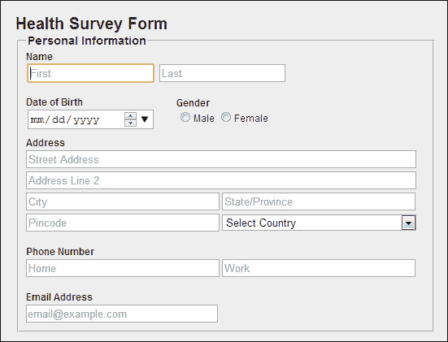

# 三、设计表单

在前面的章节中，我们学习了如何使用 HTML5 构建表单，但是网页设计者和开发人员使用 CSS3 来赋予网页表单丰富而优雅的外观。有了对 CSS3 的基本了解，在本章中我们将学习如何改善表单的外观和感觉。

在本章中，我们将涵盖以下主题:

*   CSS3 及其模块
*   设计表单
*   表格有效样式指南

# 网页表单的 CSS3

CSS3 给我们带来了无限的新可能性，并允许样式制作更好的网页表单。CSS3 给了我们许多新的方法来影响我们的表单设计，并做了相当多的重要改变。HTML5 引入了滑块和旋转器等有用的新表单元素以及`textbox`和`textarea`等旧元素，我们可以用我们的创新和 CSS3 让它们看起来真的很酷。使用 CSS3，我们可以把一个古老而枯燥的形态变成一个现代、酷、醒目的形态。

CSS3 是完全向后兼容的，所以我们不必改变现有的表单设计。浏览器已经并将永远支持 CSS2。

CSS3 表单可以拆分成模块。一些最重要的 CSS3 模块是:

*   选择器(带伪选择器)
*   背景和边框
*   文本(带文本效果)
*   字体
*   梯度

表单的样式总是随着需求和 web 设计者或开发人员的创新而变化。在这一章中，我们将看看那些 CSS3 属性，我们可以用它们来设计我们的表单，并给它们一个丰富而优雅的外观。

CSS3 的一些新属性需要供应商前缀，这些前缀在帮助浏览器阅读代码时经常使用。一般来说，一些属性不再需要和 CSS3 一起使用，比如`border-radius`，但是当浏览器不解释代码的时候，它们就会起作用。主要浏览器的所有供应商前缀列表如下:

*   `-moz-` : Firefox
*   `-webkit-`:Safari、Chrome 等 WebKit 浏览器
*   `-o-`:歌剧
*   `-ms-`:互联网浏览器

在开始设计表单样式之前，让我们快速修改表单模块，以便更好地理解和设计表单。

# 选择器和伪选择器

选择器是一种模式，用于选择我们想要设置样式的元素。选择器可以包含一个或多个由组合符分隔的简单选择器。CSS3 选择器模块引入了三个新的属性选择器；它们被分组在标题**子串匹配属性选择器**下。

这些新的选择器如下:

*   `[att^=val]`:选择“开始于”选择器
*   `[att$=val]`:选择器的“结束”
*   `[att*=val]`:包含选择器

这些新选择器中的第一个，我们称之为“开始于”选择器，允许选择指定属性(例如超链接的`href`属性)以指定字符串(例如`http://`、`https://`或`mailto:`)开头的元素。

同样，另外两个新的选择器，我们称之为“以”和“包含”选择器，允许选择元素，其中指定的属性分别以指定的字符串结尾或包含指定的字符串。

CSS 伪类只是选择器的一个附加关键字，它告诉要选择的元素的特殊状态。例如，当用户将鼠标悬停在选择器指定的元素上时，`:hover`将应用一种样式。伪类与伪元素一起，不仅与文档树的内容相关，还与外部因素相关，如导航器的历史，如`:visited`，以及某些表单元素的内容状态，如`:checked`。

新的伪类如下:

<colgroup><col style="text-align: left"> <col style="text-align: left"></colgroup> 
| 

类型

 | 

细节

 |
| --- | --- |
| `:last-child` | 它用于匹配元素，该元素是其父元素的最后一个子元素。 |
| `:first-child` | 它用于匹配作为其父元素的第一个子元素的元素。 |
| `:checked` | 它用于匹配元素，如单选按钮或复选框被选中。 |
| `:first-of-type` | 用于匹配指定元素类型的第一个子元素。 |
| `:last-of-type` | 用于匹配指定元素类型的最后一个子元素。 |
| `:nth-last-of-type(N)` | 用于从指定元素类型的最后一个开始匹配第 n 个子元素。 |
| `:only-child` | 如果某个元素是其父元素的唯一子元素，则使用来匹配该元素。 |
| `:only-of-type` | 用于匹配其类型的唯一子元素。 |
| `:root` | 用于匹配作为文档根元素的元素。 |
| `:empty` | 用于匹配没有孩子的元素。 |
| `:target` | 它用于匹配当前活动元素，该元素是文档网址中标识符的目标。 |
| `:enabled` | 用于匹配已启用的用户界面元素。 |
| `:nth-child(N)` | 用于匹配父元素的每第 n 个子元素。 |
| `:nth-of-type(N)` | 它用于匹配从父元素的最后一个开始计数的父元素的每第 n 个子元素。 |
| `:disabled` | 用于匹配禁用的用户界面元素。 |
| `:not(S)` | 它用于匹配指定选择器不匹配的元素。 |
| `:nth-last-child(N)` | 在父元素的子元素列表中，它用于根据元素的位置来匹配元素。 |

# 背景

CSS3 包含几个新的背景属性；而且，在 CSS3 中，背景的之前的属性也做了一些改动；这允许对背景元素进行更好的控制。

新增的背景属性如下。

## 背景剪辑属性

`background-clip`属性用于确定背景图像的允许区域。

如果没有背景图像，那么这个属性只有视觉效果，比如当边框有透明区域或者部分不透明区域时；否则，边框会掩盖差异。

### 语法

`background-clip`属性的语法如下:

```html
background-clip: no-clip / border-box / padding-box / content-box;
```

### 值

`background-clip`属性的值如下:

*   `border-box`:有了这个，背景延伸到边界的外缘
*   `padding-box`:有了这个，边框下面就不画背景了
*   `content-box`:有了这个，背景就是内容框内画的；仅绘制内容覆盖的区域
*   `no-clip`:这是默认的值，与 `border-box`相同

## 背景来源属性

`background-origin`属性指定背景图像或颜色相对于`background-position`属性的位置。

如果背景图像的`background-attachment`属性是固定的，则该属性无效。

### 语法

以下是`background-attachment`属性的语法:

```html
background-origin: border-box / padding-box / content-box;
```

### 值

`background-attachment`属性的值如下:

*   `border-box`:有了这个，背景延伸到边框外缘
*   `padding-box`:通过使用这个，没有背景被画在边框下面
*   `content-box`:用这个，背景画在内容框内

## 背景大小属性

`background-size`属性指定背景图像的大小。

如果未指定该属性，则将显示图像的原始尺寸。

### 语法

以下是`background-size`属性的语法:

```html
background-size: length / percentage / cover / contain;
```

### 值

`background-size`属性的值如下:

*   `length`:指定背景图像的高度和宽度。不允许负值。
*   `percentage`:以父元素的百分比来指定背景图像的高度和宽度。
*   `cover`:这指定了背景图像尽可能大，使得背景区域被完全覆盖。
*   `contain`:这将图像指定为最大尺寸，以便其宽度和高度能够适合内容区域。

除了增加新的属性外，CSS3 还增强了一些旧的背景属性，具体如下。

## 背景颜色属性

如果元素背景图像的底层无法使用，我们除了指定背景颜色外，还可以指定回退颜色。

我们可以通过在回退颜色之前添加一个正斜杠来实现这一点。

```html
background-color: red / blue;
```

## 背景重复属性

在 CSS2 中，当一个图像在最后重复时，图像经常被切掉。CSS3 引入了新的属性，我们可以用它来解决这个问题:

*   `space`:通过在图像块之间使用该属性，应用相等的空间量，直到它们填满元素
*   `round`:通过使用这个属性直到图块适合元素，图像被缩小

## 背景-附件属性

有了新的可能值`local`，我们现在可以将背景设置为当元素内容滚动时滚动。

这通过可以滚动的元素来实现。例如:

```html
body{background-image:url('example.gif');background-repeat:no-repeat;background-attachment:fixed;}
```

### 注

CSS3 允许网页设计者和开发者拥有多个背景图片，只使用一个简单的逗号分隔列表。例如:

```html
background-image: url(abc.png), url(xyz.png);
```

## 边框

`border`属性允许我们指定元素边框的样式和颜色，在 CSS3 的帮助下，我们已经进入了下一个层次。

使用 CSS3，我们可以创建圆角边框，添加阴影，并使用图像作为边框，而无需使用 Photoshop 等各种设计程序。

添加的新边框属性如下。

## 边界半径属性

使用 CSS 创建圆形边框从来都不容易。有许多可用的方法，但没有一种方法是直接的。此外，为了正确应用样式，有必要为 WebKit 和 Mozilla 使用供应商前缀。

`border-radius`属性可用于自定义按钮。我们也可以将`border-radius`应用到各个角落。借助这一特性，我们可以轻松创建圆形边框。

### 语法

`border-radius`属性的语法如下:

```html
border-radius: 1-4 length / % ;
```

### 值

以下是`border-radius`属性的值:

*   `length`:定义圆半径的大小
*   `%`:用百分比值定义圆半径的大小

## 框影属性

`box-shadow`属性允许设计人员和开发人员轻松创建多个投影。这些可以在框的外部或内部，指定颜色、大小、模糊和偏移的值。

通过简单地声明一次`box-shadow`，我们可以同时使用`outer`和`inset`版本，用逗号分隔。

### 语法

`box-shadow`属性的语法如下:

```html
box-shadow: h-shadow v-shadow blur spread color inset;
```

### 值

下面显示了`box-shadow`属性的值:

*   `inset`:这将外部(开始)阴影变为内部阴影
*   `<h-shadow>`、`<v-shadow>`:此指定阴影的位置
*   `<blur>`:这个值越大，模糊越大
*   `<spread>`:指定阴影的大小
*   `<color>`:指定阴影的颜色

## 边框图像属性

`border-image`属性有点棘手，但它允许我们创建带有自定义边框的框。使用此功能，您可以定义一个图像作为边框，而不是普通边框。

我们可以在简单的圆角之外用图像甚至渐变来创建装饰性边框。

这个特性实际上分为几个属性:

*   边框图像
*   边界角图像

### 语法

`border-image`属性的语法如下:

```html
border-image: <source><slice><width><outset><repeat>;
```

### 值

`border-image`属性的值如下:

*   `source`:指定边框使用的图像。
*   `slice`:指定边框向内的偏移量。
*   `width`:指定边框的宽度。
*   `outset`:这指定了边框图像区域超出边框框的程度。
*   `repeat`:指定边框是否要拉伸。如果是，那么它是圆的还是拉伸的。

# 文字效果

我们已经看到了许多具有各种文本效果的网站，它们作为当前和即将到来的良好表单设计趋势而迅速流行起来。在 CSS3 的帮助下，这些效果最好的一点就是可以用纯 CSS 实现，也就是不用再进行图像替换和重图像的设计。在这一节中，我们将学习 CSS3 为我们提供的一些新的文本效果。

新的文本功能如下。

## 文本阴影属性

`text-shadow`属性用于对文本内容应用阴影效果。通过使用一个简单的逗号，我们可以对一个文本产生一个或多个效果。

这些效果由阴影颜色、阴影效果的 x/y 偏移和阴影效果的模糊半径组成。效果可以相互重叠，但为了清晰起见，它们不应与文本内容重叠。

### 语法

`text-shadow`属性的语法如下:

```html
text-shadow: <color><offset-x><offset-y><blur-radius>;
```

## 自动换行属性

浏览器使用`word-wrap`属性在单词内换行，防止文本超出边界，否则会超出边界。它强制文本换行，即使它必须在一个单词的中间拆分它。

### 语法

`word-wrap`属性的语法如下:

```html
word-wrap:break-word / normal;
```

### 值

`word-wrap`属性的值如下:

*   `word-break`:这可以让牢不可破的话被打破
*   `normal`:这只会在允许的断点处断字

CSS3 提供的一些新的文本属性如下:

*   `hanging-punctuation`:指定标点字符是否可以放在线框外
*   `punctuation-trim`:指定一个标点符号是否需要修剪
*   `text-align-last`:这个描述了强制换行符之前的块或行的最后一行是如何对齐的
*   `text-emphasis`:这将对元素的文本应用强调标记，对强调标记应用前景色
*   `text-justify`:这指定了`text-align`为`justify`时使用的辩解方法
*   `text-outline`:这指定了文本的轮廓
*   `text-overflow`:这指定了当包含元素中的文本溢出时需要采取什么动作
*   `text-wrap`:这为文本指定了断线规则
*   `word-break`:对于非 CJK 剧本，这个规定了断线规则

# 来源

在 CSS2 中，字体模块用于定义文本的大小、行高和粗细，以及样式和系列等其他属性。

在 CSS 中，我们只能使用计算机上可用的预定义字体系列，但是 CSS3 为我们提供了使用用户定义字体的功能，这些字体可用于设计 web 表单的样式。

## 字体规则

字体在决定页面或页面特定部分的外观方面发挥着重要作用，这也是网页设计师和企业受益的地方，例如在品牌推广方面。

`@font-face`属性使字体的使用更上一层楼。

此规则允许用户为 web 窗体或网页上的文本指定任何真实字体。更准确地说，如果用户还没有安装特定的字体，这个规则允许从服务器下载特定的字体，并在 web 表单或页面中使用它。

### 语法

`@font-face`属性的语法如下:

```html
@font-face{
  font-family: <family-name>;
  src: <url>;
  unicode-range: <urange>;
  font-variant: <font-variant>;
  font-feature-settings: normal / <feature-tag-value>;
  font-stretch: <font-stretch>;
  font-weight: <weight>;
  font-style: <style>;
}
```

## 字体描述符

CSS3 提供了新的字体描述符，可以在`@font-face`规则中定义。可以使用的各种字体描述符如下。

### src 字体描述符

`src`字体描述符用于定义字体的网址。

值:`URL`。

### 字体样式的字体描述符

`font-style`字体描述符用于定义要使用的字体的样式。是可选字段，默认为`normal`。

数值:`normal`、、`italic`、`oblique`。

### 字体拉伸字体描述符

`font-stretch`字体描述符用于定义字体应该拉伸多少。它是一个可选字段，默认为`normal`。

值:`normal`、、`condensed`、`ultra-condensed`、`extra-condensed`、`semi-condensed`、`expanded`、`semi-expanded`、`extra-expanded`和`ultra-expanded`。

### 字体系列字体描述符

`font-family`字体描述符用于定义字体的名称或类型。

值:`name`。

### unicode 范围的字体描述符

`unicode-range`字体描述符用于定义字体支持的 Unicode 字符范围。为可选字段，默认为`U+0-10FFFF`。

值:`Unicode-range`。

### 字体粗细描述符

`font-weight`字体描述符用于定义字体的加粗程度。是可选字段，默认为`normal`。

数值:`normal`、`bold`、`100`、`200`、`300`、`400`、`500`、`600`、`700`、`800`和`900`。

# 梯度

CSS3 的惊人的颜色特性之一是渐变。它们允许从一种颜色到另一种颜色的平滑过渡。

它们使用`background-image`属性声明，因为它们没有特殊属性。

渐变允许通过将颜色`hex`转换到`rgba`模式来创建透明度。

尽管有许多改进，供应商前缀被用来使表单浏览器兼容，以便浏览器可以解释样式。

## 语法

渐变的语法如下:

```html
linear-gradient (<angle><to [left / right || top / bottom]><color [percentage/length]><color [percentage/length]>)
```

## 值

梯度值包括以下内容:

*   `angle`:指定渐变的方向角度
*   `color`:通过停止位置的可选选项指定颜色值

# 造型

在快速修改了新的 CSS3 属性后，是时候定制旧的和无聊的表单了。

在[第 1 章](1.html "Chapter 1. Forms and Their Significance")、*表格及其意义*中，我们建立了**健康调查表格**。我们将重复使用表单示例来讨论新的 CSS3 以及基本的 CSS 属性，以及它们如何增强表单的创造力。

对于样式，我们只取表格的第一部分**个人信息**。有一些不需要解释的小改动，下面是 HTML 代码:

```html
<form id="masteringhtml5_form">
  <label for="heading" class="heading">Health Survey Form</label>
  <fieldset class="fieldset_border">
    <legend class="legend">Personal Information</legend>
    <div>
      <label for="name">Name</label><br>
      <input  type="text" class="name txtinput" name="name" placeholder="First" autofocus>
      <input  type="text" class="name txtinput" name="name" placeholder="Last">
    </div><br>
    <div class="div_outer_dob">
      <div class="div_dob">
        <label for="dob">Date of Birth</label><br>
        <input type="date" value="date of birth" class="txtinput dateinput">
      </div>
      <div class="gender">
        <label for="gender">Gender</label><br>
        <input type="radio" name="gender"><label>Male</label>
        <input type="radio" name="gender"><label>Female</label>
      </div>
    </div>

    <div class="div_outer_address" >
      <label for="address">Address</label><br>
      <input type="text" class="txtinput textbox address_img" placeholder="Street Address"><br>
      <input type="text" class="txtinput textbox address_img" placeholder="Address Line 2"><br>
      <input type="text" class="txtinput  address_img" placeholder="City">
      <input type="text" class="txtinput  address_img" placeholder="State/Province"><br>
      <input type="text" class="txtinput  address_img" placeholder="Pincode">
      <select class="txtinput select address_img" >
        <option value="Country" class="select"  >Select Country</option>
        <option value="India" class="select"  >India</option>
        <option value="Australia" class="select"  >Australia</option>
      </select>
    </div><br>
    <div>
      <label for="contact">Phone Number</label><br>
      <input type="tel" class="txtinput  home_tel" placeholder="Home">
      <input type="tel" class="txtinput  work_tel" placeholder="Work">
    </div><br>
    <div>
      <label for="email">Email Address</label><br>
      <input type="email" class="txtinput  email" placeholder="email@example.com">
    </div>
    </fieldset>
    <br>

  <div class="submit">
    <input type="submit" class="submit_btn" value="Submit">
  </div>
</form>
```

由于我们的主要焦点是样式，让我们来看看表单的 CSS。下面的代码保存在一个单独的文件中，扩展名为`.css`(外部 CSS 文件)，链接到主 HTML 页面。应该遵循一个单独的 CSS 文件，因为它提高了代码的可读性，并且样式的维护变得更加容易。

此外，新属性和字体类型以粗体突出显示:

```html
/* General Form */
html{
  margin: 0px;
  padding: 0px;
  background: #000000;
}
@font-face{
  font-family: 'Conv_azoft-sans-bold-italic';
  src: url('fonts/azoft-sans-bold-italic.eot');
  src: url('fonts/azoft-sans-bold-italic.woff') format('woff'),  
  url('fonts/azoft-sans-bold-italic.ttf') format('truetype'), url('fonts/azoft-sans-bold-italic.svg') format('svg');
  font-weight: normal;
  font-style: normal;
}

body{
  font-size:12px;
  height: 100%; 
  width: 38%;
  padding: 20px;
  margin: 10px auto;
  font-family: Helvetica, Arial, sans-serif;
  color: #000000;
  background: rgba(212,228,239,1);
  background: -moz-linear-gradient(top, rgba(212,228,239,1) 0%, rgba(134,174,204,1) 100%);
  background: -webkit-gradient(left top, left bottom, color-stop(0%, rgba(212,228,239,1)), color-stop(100%, rgba(134,174,204,1)));
  background: -webkit-linear-gradient(top, rgba(212,228,239,1) 0%, rgba(134,174,204,1) 100%);
  background: -o-linear-gradient(top, rgba(212,228,239,1) 0%, rgba(134,174,204,1) 100%);
  background: -ms-linear-gradient(top, rgba(212,228,239,1) 0%, rgba(134,174,204,1) 100%);
  background: linear-gradient(to bottom, rgba(212,228,239,1) 0%, rgba(134,174,204,1) 100%);
}

input[type="radio"]{
  cursor:pointer;
}

#masteringhtml5_form .fieldset_border{
  border-color:#ffffff;
  border-style: solid;
}

#masteringhtml5_form .txtinput{ 
  font-family: Helvetica, Arial, sans-serif;
  border-style: solid;
  border-radius: 4px;
  border-width: 1px;
  border-color: #dedede;
  font-size: 18px;
  padding-left: 40px;
  width: 40%;
  color: #777;
  cursor:pointer;
}

#masteringhtml5_form .name{
  background: #fff url('images/user.png')  no-repeat;
}

#masteringhtml5_form  label{
  font-weight:bold;
  font-size:17px;
}

#masteringhtml5_form .legend{
  font-size: 18px;
  font-family: 'Conv_azoft-sans-bold-italic',Helvetica, Arial, sans-serif;
}

#masteringhtml5_form .heading{
  font-size: 24px;
  font-family: 'Conv_azoft-sans-bold-italic',Helvetica, Arial, sans-serif;
}

#masteringhtml5_form .txtinput.textbox{
  width:89%;
}

#masteringhtml5_form .address_img{
  background: #fff url('images/home.png')  no-repeat;
  background-position-y: -5px;
}

#masteringhtml5_form .txtinput.select{
  width:49%;
  color:#777777;
}

#masteringhtml5_form .div_outer_dob{
  width:100%;
}

#masteringhtml5_form .dateinput{
  width:79%;
  background: #fff url('images/date.png')  no-repeat;
  background-position-x: 1px;
  background-size: 29px 29px;
}

#masteringhtml5_form .home_tel{
  background: #fff url('images/tel.png')  no-repeat;
  background-position-x: 1px;
  background-size: 29px 29px;
}

#masteringhtml5_form .work_tel{
  background: #fff url('images/work.png')  no-repeat;
  background-size: 27px 25px;
}

#masteringhtml5_form .email{
  background: #fff url('images/email.png')  no-repeat;
}

#masteringhtml5_form .div_dob{
  width:50%;
  float:left;
}

#masteringhtml5_form .gender{
  width:50%;
  float:left;
}

#masteringhtml5_form .gender span{
  font-size:18px;
}

#masteringhtml5_form .div_outer_address{
  clear:both;
}

.legend{
  font-weight:bold;
  font-size:14px;
}

#masteringhtml5_form .submit{
  text-align:center; 
}

#masteringhtml5_form .submit_btn{
  color:#ffffff;
  cursor:pointer;
  border-radius:5px;
  width: 17%;
  height: 100%;
  font-size: 21px;
  height:100%;
  box-shadow: 5px 5px 10px 5px #888888;
  background: rgb(149,149,149);
  background: -moz-linear-gradient(top,  rgba(149,149,149,1) 0%, rgba(13,13,13,1) 46%, rgba(1,1,1,1) 50%, rgba(10,10,10,1) 53%, rgba(78,78,78,1) 76%, rgba(56,56,56,1) 87%, rgba(27,27,27,1) 100%); 
  background: -webkit-gradient(linear, left top, left bottom, color-stop(0%,rgba(149,149,149,1)), color-stop(46%,rgba(13,13,13,1)), color-stop(50%,rgba(1,1,1,1)), color-stop(53%,rgba(10,10,10,1)), color-stop(76%,rgba(78,78,78,1)), color-stop(87%,rgba(56,56,56,1)), color-stop(100%,rgba(27,27,27,1))); 
  background: -webkit-linear-gradient(top,  rgba(149,149,149,1) 0%,rgba(13,13,13,1) 46%,rgba(1,1,1,1) 50%,rgba(10,10,10,1) 53%,rgba(78,78,78,1) 76%,rgba(56,56,56,1) 87%,rgba(27,27,27,1) 100%); 
  background: -o-linear-gradient(top,  rgba(149,149,149,1) 0%,rgba(13,13,13,1) 46%,rgba(1,1,1,1) 50%,rgba(10,10,10,1) 53%,rgba(78,78,78,1) 76%,rgba(56,56,56,1) 87%,rgba(27,27,27,1) 100%); 
  background: -ms-linear-gradient(top,  rgba(149,149,149,1) 0%,rgba(13,13,13,1) 46%,rgba(1,1,1,1) 50%,rgba(10,10,10,1) 53%,rgba(78,78,78,1) 76%,rgba(56,56,56,1) 87%,rgba(27,27,27,1) 100%); 
  background: linear-gradient(to bottom,  rgba(149,149,149,1) 0%,rgba(13,13,13,1) 46%,rgba(1,1,1,1) 50%,rgba(10,10,10,1) 53%,rgba(78,78,78,1) 76%,rgba(56,56,56,1) 87%,rgba(27,27,27,1) 100%); 
}
```

前面的 HTML 和 CSS 代码的结果如下:


如果我们将新的 CSS3 表单与我们在[第 1 章](1.html "Chapter 1. Forms and Their Significance")、*表单及其意义*中构建的表单的第一部分进行比较，我们会看到两种表单在外观和感觉上的差异。

为了更好地进行比较，[第一章](1.html "Chapter 1. Forms and Their Significance")、*表单及其意义*中的第一节给出如下:



现在，我们意识到了 CSS3 的强大，使用它，我们已经很容易地将一个简单而无聊的表单转换成时尚而吸引眼球的东西。

让我们看看表单 CSS 中使用的各种选择器及其意义:

*   `<body>`:应用于`<body>`标签的 CSS 属性充当回退或默认属性，因为它充当包含其他几个标签的父标签。CSS 的`fallback`属性是`font-family`、`font-size`等等。

借助`linear-gradient`设置一个属性，如`background`，该属性利用颜色(就 RBG 而言)。`linear-gradient`借助 RBG 色值描述，从顶部开始，停止值定义为百分比，直到底部。它们针对不同的浏览器支持进行描述，这些支持包含起始值，如`–webkit`、`-O`和“`-ms`。它显示了表单的蓝色背景。除此之外，还使用了各种其他 CSS 属性，如`font-size`、`height`、`width`。

*   `heading` and `legend`: For our form heading (**Health Survey Form**) and legend heading (**Personal Information**), we have implemented a new font type, `Conv_azoft-sans-bold-italic`, which is defined in the `font-family` attribute in the `heading` and `legend` class using the `@font-face` property.

    借助`@font-face`属性，我们已经导入了支持不同浏览器的字体文件`.eot`、`.woff`、`.ttf`和`.svg`。

    同样，对于`legend`标签，我们使用了`fieldset_border`类来改变边框颜色和样式。

*   `dateinput`和`div_dob`:这两个类都是为`<input>`类型`date`定义的，用户可以从下拉日历中选择自己的出生日期。利用左侧的`float`属性，为屏幕上的元素排列定义`div_dob`类别。与此同时，`dateinput`类用于借助`background`、`background-position`和`background-size`属性放置日期图标，以便正确渲染。
*   `txtinput`: The `txtinput` class is used for styling the text inputs used in the form, and apart from using the previous CSS attributes, such as `font-family` and `border-style`, we have used a new attribute named `border-radius` to give the text input a rounded border on all sides.

    我们还为`cursor`类型添加了一个属性作为指针，当我们将鼠标指针移动到输入字段上时，它会显示一个手动点击图标。

    类`name`、`address_img`、`home_tel`、`work_tel`、`email`、`dropdown`和`calendar`已用于根据`<input>`类型设置文本输入字段的背景图像及其各自的图标图像。我们利用了背景的各种属性，例如`background`、`background-position`和`background-size`来正确呈现图标图像。

    `autofocus`属性用于表单加载期间光标自动聚焦的名字文本输入。

*   `radiobutton`: The `<input>` type `radio` is an old HTML input, which is used here for the purpose of selecting the gender. We have also used the `float` property for aligning the radio buttons on the right-hand side of the date of birth.

    我们还为`cursor`类型添加了一个属性作为指针，当我们将鼠标指针移动到输入字段上时，它会显示一个手动点击图标。

*   `submit`: For submitting the form to the server, we have created a **Submit** button. In the `submit_btn` class we have performed button customization using the previous version properties such as color, width, and height, along with CSS3 properties such as `border-radius` to round the button from all sides, `box-shadow`, and `background` with a color attribute using `linear-gradients` to provide the desired effect.

    我们还为`cursor`类型添加了一个属性，它是一个指针，当我们将鼠标指针移动到输入字段上时，它会显示一个手动点击图标。

# 指引

在本节中，我们将看到有效的表单样式的 CSS3 指南。

CSS3 的一些最佳实践如下:

*   避免对 CSS 使用内嵌样式。外部 CSS 文件必须用于样式。
*   必须尽可能使用缩小的 CSS 文件，因为这是从代码中删除不必要字符以减小大小的一种做法。
*   对 CSS 使用组合文件。
*   尽可能避免使用多个声明。
*   总是想到渐进式增强。
*   供应商前缀应该有条理，并有很好的注释。
*   对于与背景相关的属性，请使用回退。
*   使用版式时，不应影响文本的可读性。
*   启用回退并在每个浏览器中测试表单。
*   尽量使用高效的 CSS 选择器。
*   尽可能避免使用 CSS 表达式。
*   指定图像尺寸以提高网页的呈现速度。
*   使用 CSS 精灵可以更快地渲染图像。

# 总结

在这一章中，我们学习了 CSS3 的基础知识，以及可以对 CSS3 中的表单进行分类的模块，例如供应商前缀、渐变和背景。

然后，在一个代码示例的帮助下，我们学习了大多数 CSS3 属性的实际实现，这些属性可以用来改善表单的外观。

最后，我们学习了表单有效样式的最佳实践。