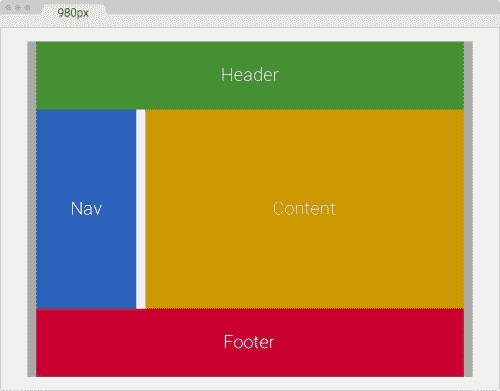
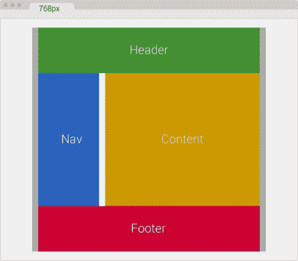
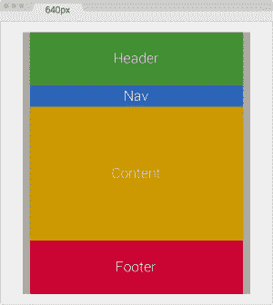

# 第三章，手机优先还是桌面优先？

在我多年的设计和构建响应式网站的经验中，我发现为了更好地查看内容和消息，在线框和设计阶段，使用桌面优先的方法更容易实现可视化。

由于我们能够通过桌面优先的方法在给定的布局中看到更多的内容，因此它允许我们将提供给我们的内容的层次结构转换为表示所述层次结构的布局。在 320 像素宽的小画布上执行此操作比需要的难度更大。

当您完成该层次结构时，它在小屏幕设备上将保持不变，唯一改变的是布局。

*最佳实践*建议首先构建移动设备，但许多网络专业人士并不知道我们为什么首先构建*移动设备*。双关语。

所以，让我们把它弄清楚。我们之所以首先构建移动设备，是因为卢克·沃布列夫斯基（Luke Wroblewski）提到了三个原则。卢克·沃布列夫斯基在 2009 年创造了术语*移动设备优先*。您会注意到，这些原则都与 HTML、CSS 和/或 JavaScript 无关。换句话说，由于 HTML、CSS 或JavaScript 的任何优势，您不会首先构建 mobile。欲了解更多信息，请访问[http://www.lukew.com/ff/entry.asp?933](http://www.lukew.com/ff/entry.asp?933) 。

考虑以下几点：

*   **手机正在爆炸**：手机已经爆炸了。这基本上意味着人们使用移动设备访问网络更容易、更快、更方便。因此，如果您首先构建与移动设备兼容的网站，那么与仅使用桌面网站/应用程序相比，您有更好的机会提供更好的用户体验并被更多人浏览。
*   **移动迫使你专注于**：由于移动设备的屏幕上的空间比桌面屏幕上的空间小得多，因此必须优先考虑。这意味着最重要的任务和/或消息需要立即可见。
*   **移动扩展您的功能**：移动设备具有桌面设备所不具备的功能：GPS、加速度计、多点触摸输入、语音识别、前后摄像头等。首先使用移动设备时，您可以使用这些先进的技术来创造更丰富、更激动人心的体验。

现在您已经有了最终的设计，现在需要将该设计实现为 HTML、CSS 和 JavaScript。在这个阶段，您应该使用移动优先的方法，并考虑我们前面提到的三个原因：

*   打造手机拳头意味着你的网站/应用程序可以被更多人看到
*   它让你对内容进行优先排序
*   如果需要，它将允许您使用移动设备的高级功能

在本章中，我们将介绍以下主题：

*   在桌面第一视图中创建您的设计，但首先使用移动设备实现它们。
*   Sass 混合用于移动优先和桌面优先媒体查询。
*   处理遗留浏览器。
*   如何处理高密度屏幕。
*   为什么 RWD 有时不一定是正确的解决方案。
*   用 RWD 改造旧网站。

# 在桌面第一视图中创建您的设计，但首先使用移动设备实现它们

让我们看看一些术语，这样我们就在同一页上了：

*   **线框**：这是一个非常基本的布局视觉表示，仅使用轮廓，换句话说，是黑色和白色。没有颜色，没有品牌，也没有任何类型的定义样式。
*   **设计/组合**：这是一个*充实的*线框，有颜色、品牌和风格。它是最终页面/站点/应用程序的一个非常接近的表示（通常，比如说，95%接近最终产品），而不涉及任何类型的标记或编码。
*   **HTML 模型或 HTML 模板**：这是指将设计实现为一个实际的 HTML 页面，其中包含 CSS和 JavaScript。它只能在浏览器中查看。它实际上是页面/站点/web 应用程序外观和工作方式的精确表示（99%接近最终产品）。

术语清楚后，让我们继续。

一些专业人士，包括我在内，建议使用更现代、更高效的技术来创建视觉资产，以优化线框和创建设计/组合过程中花费的时间。风格瓷砖、情绪板、元素拼贴和原子设计等技术与传统的线框和设计/合成方法不同。他们提供了探索版面和风格的机会，与屏幕宽度、技术甚至内容创建无关。

在本书中，我们将重点介绍如何利用传统的线框和设计/comps 方法，同时最大限度地利用我们在掌握 HTML5 和 CSS3 的**响应性网页设计**（**RWD**）的初始阶段的时间。

## 为什么要在桌面第一视图中创建设计？

在桌面第一视图中创建设计的原因很简单：房地产（空间）。

作为设计师，我们需要以视觉方式反映内容的层次结构。为了实现这一点，我们使用了许多设计原则，如节奏、接近、空白、模式、对比、平衡、网格、对称等。

当我们正在创建线框或设计/合成的画布足够大，可以尝试不同的安排和布局时，我们有必要的灵活性来探索可以表示所述内容层次结构的不同方式。

例如，我们使用的是一个 12 列的网格，提供给我们的内容决定了以下内容层次结构：

*   企业希望用户能够提供他们的电子邮件 ID 来接收我们的新闻稿。
*   我们想展示一篇由编辑部选择的*专题文章*。

使用前面的内容层次结构，我们可以立即开始绘制不同的布局，以传达此层次结构：

*   为了让用户提供他们的电子邮件地址，我们将创建一个带有标题、段落、输入类型电子邮件和按钮的表单。此表单将位于页眉下方的左上角，宽度可以为三到四列。我认为也许四栏太宽了，但让我们线框一下，看看感觉如何，以及这会带来什么可用性、可访问性和易读性问题或好处。
*   对于*专题文章*，我们将使用剩余的专栏。如果电子邮件表单有三列宽，我们将使用剩下的九列；如果电子邮件表单是四列宽的，我们将只使用剩余的八列。特色文章有更多的内容，如标题、作者、日期、类别、片段、缩略图和完整文章的链接。

在我们的设计/线框应用程序中有宽画布，我们可以使用这些不同的方法，最终以一个合理的布局结束，并根据业务或利益相关者的要求表示内容层次结构。

用一个小画布，用移动优先的方法创建这样的布局几乎是不可能的。小型房地产屏幕的限制和限制令人难以置信。但是，当事情开始发展时，每次想到一个特定的断点时，我们都需要进行这个探索过程。

### 提示

实际上，我们现在不应该考虑断点（没有双关语），因为内容而不是特定的设备宽度决定了需要添加新断点的位置。

一旦我们定义了一个反映内容层次结构的布局，我们将处于一个良好的位置，因为当内容在较小的屏幕上重新排列时，无论哪个宽度，层次结构都将保持不变。

## 为什么先用手机实施？

让我们先澄清一个术语：*实现*意味着基于线框或设计/合成，使用 CSS 和 JavaScript（如有必要）创建 HTML 模型。

本章开头提到的原因是对问题*的回答，为什么首先使用移动设备？*记住：移动设备正在爆炸（其实已经爆炸了），移动设备迫使你集中精力，移动设备扩展了你的能力。

除了第二个前提（这可能是一个巨大的*可能*）之外，所有这些原因都不能通过桌面优先实现来实现。

让我们改变档位，进入一个更具技术性的主题，这将帮助我们了解 Sass mixins 如何帮助我们掌握移动优先和桌面优先方法的 RWD。

那么，让我们回顾一下。首先使用桌面创建设计和线框。拥有一个大画布可以让我们探索不同的布局，并正确安排内容的层次结构。当需要实现（创建 HTML 模型）时，首先使用 mobile。

# 移动优先和桌面优先媒体查询的 Sass 混合

对于我们的示例，我们将在本书中使用两种类型的 Sassmixin：使用`min-width`属性的 mobile first mixin 和使用`max-width`属性的 desktop first mixin。我们已经在[第 1 章](1.html "Chapter 1. Harness the Power of Sass for Responsive Web Design")*中看到了以下混搭以及它们是如何工作的*利用 Sass 的力量进行响应性网页设计*，但这里有一个复习。*

## 手机首次混音

我们将使用以下移动首次混音：

```html
@mixin forLargeScreens($media) {
    @media (min-width: $media/16+em) { @content; }
}
```

我们就是这样使用它的：

```html
header {
   //Properties for small screens
    width: 50%;
    background: red;
    @include forLargeScreens(640) {
      //Properties for large screens
        width: 100%;
        background: blue;
    }
}
```

这将编译为以下内容：

```html
header {
    width: 50%;
    background: red;
}

@media (min-width: 40em) {
    header {
        width: 100%;
        background: blue;
    }
}
```

## 桌面第一次混入

这是我们将要使用的桌面第一个混音器：

```html
@mixin forSmallScreens($media) {
    @media (max-width: $media/16+em) { @content; }
}
```

我们就是这样使用它的：

```html
header {
    //Properties for large screens
    width: 100%;
    background: purple;
    @include forSmallScreens(640) {
      //Properties for small screens
        width: 50%;
        background: yellow;
    }
}
@include forSmallScreens

```

这将编译为以下内容：

```html
header {
    width: 100%;
    background: purple;
}

@media (max-width: 40em) {
    header {
        width: 50%;
        background: yellow;
    }
}
```

### 提示

使用这些 mixin 的好处在于，很容易找到使用的方法，因为我们可以看到术语`forLargeScreens`或`forSmallScreens`在我们的 SCSS 文件中重复出现。如果其他人编辑了我们最初做的任何工作，他们只需扫描 SCSS 文件，就可以清楚地了解我们构建网站/应用程序的方法。

# 处理遗留浏览器

在问题“移动优先还是桌面优先”中，有一个领域我们需要涉及传统浏览器。每个项目、每个客户机及其相应的分析（如果他们有，他们应该有）都有不同的需求，这些需求会影响我们应该如何处理这些旧浏览器。

如果您使用桌面优先的方法进行构建，那么您当前的工作流程应该保持不变，因为这与 RWD 成为实际强制要求之前我们所做的工作基本相同。

这意味着您仍将使用以下内容：

```html
header {
    //Desktop-first declaration
    width: 50%;
    @include forSmallScreens(768) {
      //Target small screens (mobile devices)
      width: 100%; }
}
```

这将编译为以下内容：

```html
header {
    width: 50%;
}

@media (max-width: 48em) {
    header {
      width: 100%;
    }
}
```

IE7 和 IE8 不支持媒体查询，但前面的代码可以正常工作，因为`header { width: 50%; }`规则不在媒体查询中。

但是，如果您首先使用移动设备，那么`header { width: 50%; }`将位于媒体查询中，这样 IE7 和 IE8 将无法看到该规则：

```html
.article {
    //Mobile-first declaration
    width: 100%;
    //IE7 and IE8 won't be able to see this rule.
    @include forLargeScreens(768) {
      width: 50%;
    }
}
```

这将编译为以下内容：

```html
header {
    width: 100%;
}

@media (min-width: 48em) { 
    header {
      width: 50%;
    }
}
```

那你怎么办？解决方法很简单：使用`Respond.js`脚本。

## RWD 如何使用 Respond.js

`Respond.js`是一种称为*polyfill*的脚本。根据一词的创造者雷米·夏普（Remy Sharp）的说法，polyfill 是一段代码，它提供了我们网络开发人员期望浏览器本机提供的技术。

在 web 设计和开发中，PolyFill 作为 JavaScript 实现更为丰富，在我们的例子中，Scott Jehl 的`Respond.js`。但我们也可以说 CSS 中也存在多填充，例如，Eric Meyer 的著名`reset.css`和 Nicolas Gallagher 和 Jonathan Neal 的`Normalize.css`。

`Respond.js`脚本是一个 polyfill，它使传统浏览器（IE6/7/8）支持一个他们从未支持过的特定 CSS 功能：媒体查询。

您可以从[下载`Respond.js`https://github.com/scottjehl/Respond](https://github.com/scottjehl/Respond) 。

### 提示

虽然我建议使用 polyfill，但我们需要注意站点/应用程序需要发出额外的 HTTP 请求才能获取此 JavaScript 文件。我们的网站/应用程序发出的请求越少，它们就越快创造出许多好处，如改善用户体验和积极的 SEO 影响。

因此，以下是您需要做的：

*   确保对`Respond.js`的调用是在对 CSS 文件的调用之后的*（希望它只是一个 CSS 文件）。*
*   调用`Respond.js`脚本。

### 提示

性能最佳实践建议将不重要的脚本放在标记底部，正好在结束`</body>`标记之前。既然`Respond.js`针对的是传统浏览器，那么让我们继续这样做吧。将脚本放在标记底部的另一个好处是，它有助于避免阻塞页面的呈现。

下面是我们的示例 HTML：

```html
<!DOCTYPE html>
<html>
<head>
    <meta charset="utf-8">
    <title>Mastering RWD with HTML5 &amp; CSS3</title>
    <link href="styles.css" rel="stylesheet">
</head>
<body>
    <header>Logo goes here…</header>
    <article>Content goes here…</article>
    <script src="js/respond.min.js"></script>
</body>
</html>
```

在我们的`styles.scss`文件中，我们键入以下行：

```html
//Mobile-first declaration
article { background: red;
    //Target screens 640px wide and larger
    @include forLargeScreens(640) {
        & { background: green; }
  }
}
```

这将编译为以下内容：

```html
article {
    background: red;
}

@media (min-width: 40em) {
    article {
         background: green; 
    }
}
```

因此，当您调整 IE7 或 IE8 浏览器窗口的大小时，如果窗口宽度小于等于 640 像素，它将能够显示红色背景，如果窗口宽度大于等于 641 像素，它将能够显示绿色背景。

## IE 特定样式表的时代已经过去

自从我开始写 CSS 以来，我一直避免创建特定于 IE 的样式表。原因很简单：

*   **档案管理**：投入生产时需要管理的档案越少，每道工序越顺畅；更不用说不容易出错了。
*   **可伸缩性**：如果您需要添加、删除或编辑样式，您和您的团队知道最终的更改需要在您的主 CSS 文件中完成，在我们的例子中是 SCSS 文件。
*   **组织机构**：在正确的 CSS 文件（在本例中为 SCSS 文件）中添加、删除或编辑 IE 特定样式时，将所有人保持在同一页面上。
*   **性能**：减少一个HTTP 请求是一件好事，一件非常好的事。我们可以为性能做的任何事情，无论多小，都可以为获得良好的用户体验做出很大的贡献；更不用说一个快速的网站对搜索引擎优化有好处。

### 不使用 IE 特定样式表的其他好处

在传统的浏览器中，当他们试图下载特定于 IE 的样式表时，页面呈现不会被阻止。此外，故障排除也更容易。那么我们用什么呢？

通过将所有内容保存在一个样式表中，有几种处理 IE 的方法：

*   使用 CSS 黑客（不推荐）。
*   使用`Modernizr.js`。
*   在`<html>`标记中使用条件类。

让我们进一步讨论一种流行的方法，使用条件类。

#### 在<html>标记中使用条件类

保罗·爱尔兰 2008 年的文章（[http://www.paulirish.com/2008/conditional-stylesheets-vs-css-hacks-answer-neither/](http://www.paulirish.com/2008/conditional-stylesheets-vs-css-hacks-answer-neither/) 指定了我推荐的方法，原因有几个：

*   易于实现；只需在 HTML 文件的顶部复制和粘贴此标记块。
*   它不是侵入性的，因为链中的任何人（用户、浏览器、服务器和我们）都不需要处理额外的文件。
*   它不需要 JavaScript 来工作；如果访问者的 JavaScript 不可用或已禁用，则一切仍将正常工作。

这是我使用的一个：

```html
<!--[if IE 8]> <html class="no-js ie8" lang="en"> <![endif]-->
<!--[if IE 9]> <html class="no-js ie9" lang="en"> <![endif]-->
<!--[if gt IE 9]><!--><html class="no-js" lang="en"><!--<![endif]-->
```

### 提示

IE10 及以上版本不再支持*条件注释*，这就是为什么在条件类标记中没有提到 IE10 的原因。

有了前面的条件类，针对特定 IE（本例中为 IE7）的目标如下：

```html
.ie7 nav li {
    float: left;
}
```

如果我们需要针对所有 IEs，我们会这样做：

```html
.ie7, .ie8, .ie9 {
    nav li {
        float: left;
    }
}
```

这将编译为以下内容：

```html
.ie7 nav li, .ie8 nav li, .ie9 nav li {
    float: left;
}
```

对于所有其他浏览器，我们将执行以下操作：

```html
nav {
    display: flex;
}
```

无论您使用哪种方法，`Modernizr.js`还是条件类，这都是个人偏好。通过使用这两种方法中的任何一种，您将做*正确的事情*。

记住，要不惜一切代价避免 CSS 攻击。作为网页设计师和网页开发者，我们有道德责任为每个人创造一个更好的网页。

# 如何处理高密度屏幕

网上有很多文章解释了每英寸**点**（**DPI**）、**每英寸像素**（**PPI**）和**密度无关像素**（**DP/DiP**是什么。尽管理解这些技术和术语的复杂细节可能很重要，但让我们将本书的范围保持在高密度屏幕的基础是什么以及我们需要了解什么来创建声音响应设计。

## 高密度屏幕的位图或矢量？

SVG、图标字体或常规字体等向量是数学方程的可视化表示，因此它们无论大小都不会失去质量。

为了使位图图像能够在高密度屏幕上很好地显示，我们必须导出一个高分辨率版本的*正常质量*图像。这意味着我们需要为我们计划使用的每个位图图像创建两个（或更多）文件：一个用于非高密度屏幕（标准 LCD 显示器、旧 TFT 显示器、一些电视等）的正常质量图像，以及一个（或更多）用于高密度屏幕（任何*视网膜*的高质量图像例如，设备和超级 AMOLED 显示器）。

这就是好的设计判断发挥作用的地方，因为有时我们不一定每次都需要导出两个（或更多）位图图像。

当我们必须考虑高密度屏幕时，有几种技术可以用来处理图像。这些技术在[第 6 章](6.html "Chapter 6. Working with Images and Videos in Responsive Web Design")*中有详细说明，在响应式网页设计*中处理图像和视频。

# 有时 RWD 不一定是正确的解决方案

以为例，大多数旅游网站的预订部分。像这样的网站所管理的信息数量和类型之多，使得它很难拥有一个响应迅速的网站。当访问谷歌搜索结果中排名最高的八个旅游网站时，我看到的是：

*   [http://www.kayak.com/](http://www.kayak.com/)
    *   **首页**：响应
    *   **预订页面**：无响应
*   [http://www.expedia.com/](http://www.expedia.com/)
    *   **首页**：响应
    *   **预订页面**响应
*   T0https://www.hotwire.com/ T1
    *   **首页**：无响应
    *   **预订页面**响应
*   [http://www.travelocity.com/](http://www.travelocity.com/)
    *   **首页**：响应
    *   **预订页面**响应
*   [http://www.orbitz.com/](http://www.orbitz.com/)
    *   **首页**：无响应
    *   **预订页面**：无响应
*   [http://www.priceline.com/](http://www.priceline.com/)
    *   **首页**：无响应
    *   **预订页面**：无响应
*   [http://www.tripadvisor.in/](http://www.tripadvisor.in/)
    *   **首页**：无响应
    *   **预订页面**：无响应
*   T0https://www.hipmunk.com/ T1
    *   **首页**：无响应
    *   **预订页面**：无响应

以下是我们调查结果的简要列表：

*   自从 Expedia 收购 Travelocity 以来，它们共享同一平台。区别在于品牌；因此，我将考虑这两个站点作为一个。
*   七分之五的网站（71%）的主页没有响应。
*   七分之五的网站（71%）的预订页面没有响应。
*   七个站点中只有一个（Expedia/Travelocity）（14%）完全响应。
*   七分之四的站点（57%）没有任何 RWD。

我们可以得出结论，最受欢迎的旅游网站尚未完全采用 RWD，但有些是固定宽度和响应性布局的混合。这就是为什么所有这些网站都有独立的移动应用程序。对他们来说，RWD 可能不是一个优先事项，所以他们依靠自己的移动应用来平衡这一不足。

虽然现在很少见，但有时我们可能需要建立一个没有响应的站点或页面。事实上，今天有一些页面没有响应。

CodePen 是最流行的前端沙盒之一，CodePen 的编辑器没有响应能力。为什么？因为不需要这样。开发人员不太可能使用他们的手机去 CodePen 编写 HTML、Sass 和 JavaScript。

话虽如此，如果您需要构建一个不需要响应的站点/页面，就 CSS 网格系统而言，有两个很好的选择：

*   使用我们的老朋友，960 网格系统（[http://960.gs/](http://960.gs/) 。
*   使用1140 网格系统（[http://www.1140px.com/](http://www.1140px.com/) 。

有几件事需要考虑：

*   960 网格系统针对 1024px 宽的屏幕。
*   1140 网格系统针对 1280px 宽的屏幕。
*   默认情况下，1140 网格系统包含媒体查询，因此我们需要考虑这一点，并决定是最好保留它们，还是最好删除它们，以减少 IE6-IE9 中的文件大小和选择器限制。

因为我一直认为 960 网格系统左侧和右侧的 10px 填充使内容过于靠近主容器的边缘，所以我在每侧增加了 10 个像素，将填充增加到 20px，从而将 960 网格系统变成了 980 网格系统。从现在起，我们称之为 980GS。

# 用 RWD 改造旧网站

如果和当时机到来时，我们需要做好准备，使一个无响应或固定宽度的站点/应用程序响应。

有两种方法可以改造无响应或固定宽度的站点/应用程序。一种方法是使用使用绝对单位（即像素）的**自适应网页设计**（**AWD**技术）。另一种方法是使用 RWD，用一个非常简单的公式将所有像素值转换为百分比。

无论我们使用哪种技术，我们都将不得不使用桌面优先的方法，因为我们正在处理的站点只为宽屏幕构建。这意味着我们将在媒体查询中使用`max-width`属性。

在我们研究这两种改造技术之前，我们需要一个基本页面。

## 基准页

您在这里看到的图形与 12 列 980GS 布局成比例。浏览器窗口为 1024 像素宽，页面为 980 像素宽：



### 提示

我们主要的灰色容器，宽 980px，左右两侧已经有 10px 的填充物。这意味着内部的部分总是需要加起来达到**960px**。

以下是容器的组件：

*   灰色的主容器宽 980px，左右两侧各有 10px 的填充物。
*   绿色的**页眉**和红色的**页脚**各为 960px 或 12 列宽：940px，左右两侧各有 10px 的边距。
*   蓝色的**导航**部分为 240px 或 3 列宽：220px，左边距和右边距分别为 10px。
*   黄色的**内容**部分为 710px 或 9 列宽：700px，右边缘为 10px。
*   白色天沟的宽度为 20px，即**导航**的右边缘为 10px，而**内容**的左边缘为 10px。
*   所以，220px name+710px Content+20px boys+10px margins=960px。

## HTML

以下是表示我们的主页的标记：

```html
<!DOCTYPE html>
<html>
<head>
    <meta charset="utf-8">
    <title>Retrofitting with Adaptive Web Design</title>
    <link href="css/styles.css" rel="stylesheet">
</head>
<body>
    <main class="container_12 clear">
      <header class="grid_12">Header</header>
      <nav class="grid_3">Nav</nav>
      <section class="grid_9">Content</section>
      <footer class="grid_12">Footer</footer>
    </main>
</body>
</html>
```

## 'T0'：CSS/SCSS

关于我们的 CSS/SCS，我们只需要创建一个部分，即包含固定宽度网格的`_980gs.scss`文件。

然后，我们将创建一个`styles.scss`文件，我们将使用该文件执行以下操作：

*   导入`_980gs.scss`文件。
*   包括我们的简单桌面第一 Sass 混合来处理媒体查询。
*   使用`max-width`属性创建所有必要的媒体查询。
*   编译成`styles.css`并在我们的页面中使用。

### 创建 _980gs.scss 文件

`_980gs.scss`文件包含基本网格，如下所示：

```html
//Globals
*, *:before, *:after {
    box-sizing: border-box;
}

//Container
.container_12 {
    width: 980px;
    padding: 0 10px;
    margin: auto; 
}

//Grid >> Global
.grid {
    &_1, &_2, &_3, &_4, &_5, &_6, &_7, &_8, &_9, &_10, &_11, &_12 {
      float: left;
      margin: 0 10px;
    }
}

//Grid >> 12 Columns
.container_12 {
    .grid_1  { width: 60px; }
    .grid_2  { width: 140px; }
    .grid_3  { width: 220px; }
    .grid_4  { width: 300px; }
    .grid_5  { width: 380px; }
    .grid_6  { width: 460px; }
    .grid_7  { width: 540px; }
    .grid_8  { width: 620px; }
    .grid_9  { width: 700px; }
    .grid_10 { width: 780px; }
    .grid_11 { width: 860px; }
    .grid_12 { width: 940px; }
}

//Clear Floated Elements - http://davidwalsh.name/css-clear-fix
.clear, .row {
    &:before,
    &:after { content: ''; display: table; }
    &:after { clear: both; }
}

//Use rows to nest containers
.row { margin-bottom: 10px;
    &:last-of-type { margin-bottom: 0; }
}
//Legacy IE
.clear { zoom: 1; }
```

# AWD 改装

与RWD 不同，RWD 的宽度是流体和弹性的（ems 和百分比），因此术语*相对单位*，在 AWD 中，宽度是固定的（像素）。因此，我们使用术语*绝对单位*，当我们调整浏览器窗口大小时，元素将*捕捉*到这些固定宽度。

在 AWD 中，几乎每个宽度都使用像素，甚至我们的媒体查询。

## 创建 styles.scss 文件

在`styles.scss`文件中，我们要做的第一件事是导入部分`_980gs.scss`文件：

```html
//Retrofitting with Adaptive Web Design
@import "980gs";

```

然后，我们将首先包含简单的桌面 mixin 来处理媒体查询。但是，还记得我之前提到的 mixin 是如何可伸缩的，如果我们愿意，我们可以让它编译基于像素的值？我们需要做的就是从分区`$media/16+em`中删除值`/16+em`：

```html
//Retrofitting with Adaptive Web Design
@import "980gs";

//Desktop-first Media Query Mixin
@mixin forSmallScreens($media) {
 @media (max-width: $media) { @content; }
}

```

以下规则仅用于造型目的，以实现我们在之前的屏幕截图中看到的相同设计：

```html
//Retrofitting with Adaptive Web Design
@import "980gs";

//Desktop-first Media Query Mixin
@mixin forSmallScreens($media) {
    @media (max-width: $media) { @content; }
}

//Basic styling
.container_12 {
 background: #aaa;
 font-size: 30px;
 text-shadow: 0 1px 1px rgba(black,.5);
}
header { background: #429032; }
nav { background: #2963BD; }
section { background: #c90; }
footer { background: #c03; }

//Give heights to elements for better perception of sections
header, footer { height: 150px; }
nav, section { height: 440px; }

```

此时，我们的页面宽度为 980px，看起来就像我们最初看到的屏幕截图。

让我们定义将使我们的基页*捕捉*到的宽度：

*   在 980px，我们将把页面捕捉到 768px。
*   在 768px，我们将把页面捕捉到 640px。
*   在 640px，我们将把页面快照到 480px。
*   在 480px 时，我们将把页面快照到 320px。

这就是乐趣的开始。让我们通过为每个部分创建媒体查询来改进此页面。

### 980px 至 768px（全轮驱动）

以下媒体查询针对 768px：

```html
.container_12 {
  @include forSmallScreens(980px) {
 width: 768px;
 }
    .grid_12 { //Header and Footer sections
      @include forSmallScreens(980px) {
 width: 728px;
 }
  }
  .grid_3 { //Nav section
    @include forSmallScreens(980px) {
 width: 200px;
 }
  }
  .grid_9 { //Content section
    @include forSmallScreens(980px) {
 width: 508px;
 }
  }
}
```

诚然，从 980px 到 768px，很难看出书中的差异，但相信我，下面的截图完全代表了 980px 宽的浏览器窗口和 768px 宽的页面：



正如你所看到的，当屏幕是 980px 时，我们的主容器（`.container_12`的宽度从 980px 变为 768px。我们的主容器左右各有 10px 的填充物，所以所有其他部分的宽度加起来应该与 748px 相匹配。

让我们看一看。

我们使用同一类`.grid_12`的**页眉**和**页脚**现在宽 728px。所以如果我们加上：*728px+10px 左边距+10px 右边距=748px*。

如果我们增加我们的**导航**（`.grid_3`和**内容**（`.grid_9`段）的宽度：

*   'T0'：200px 导航+508px 内容=708px'T1'。
*   708px+20px 男孩=728px↓T1；）
*   1.2.2.2.2.2.2.2.2.2.2.2.2.2.2.2.2.2.2.2.2.2.2.2.2.2.2.2.2.2.2.2.2.2.4.2.2.2.2.2.2.2.2.2.2.2.2.2.2.2.2.2.2.2

跟我呆在一起，我保证这会很有趣。

### 768px 至 640px（全轮驱动）

以下媒体查询针对 640px：

```html
.container_12 {
    @include forSmallScreens(980px) {
      width: 768px;
  }
    @include forSmallScreens(768px) {
 width: 640px;
 }
    .grid_12 { //Header and Footer sections
      @include forSmallScreens(980px) {
        width: 728px;
      }
      @include forSmallScreens(768px) {
 width: 600px;
 }
    }
    .grid_3 { //Nav section
      @include forSmallScreens(980px) {
        width: 200px;
      }
      @include forSmallScreens(768px) {
 width: 160px;
 }
    }
    .grid_9 { //Content section
      @include forSmallScreens(980px) {
        width: 508px;
      }
      @include forSmallScreens(768px) {
 width: 420px;
 }
    }
}
```

好的，这个布局现在是一个单列页面。我们开始看到一些结果。美好的



同样，请记住，我们的主容器左右各有 10px 的填充，因此所有其他部分的宽度加起来应该与 620px 匹配。

让我们确保我们的数字相加：

我们使用同一类`.grid_12`的**页眉**和**页脚**现在宽 600 像素。所以如果我们加上：*600px+10px 左边距+10px 右边距=620px*。

如果我们添加我们的**导航**（`.grid_3`）和**内容**（`.grid_9`）部分的宽度：

*   “T0”（160px 导航+420px 内容=580px“T1”）
*   580px+20px 男孩=600px↓T1；）
*   123044T001230560px+10px 导航左边距+10px 内容右边距=620px{12304T1 至 123055；

让我们把这一页做得更小！

### 640px 至 480px（全轮驱动）

以下媒体查询针对 480px：

```html
.container_12 {
    @include forSmallScreens(980px) {
      width: 768px;
    }
    @include forSmallScreens(768px) {
      width: 640px;
    }
    @include forSmallScreens(640px) {
 width: 480px;
 }
    .grid_12 { //Header and Footer sections
      @include forSmallScreens(980px) {
        width: 728px;
      }
      @include forSmallScreens(768px) {
        width: 600px;
      }
    }
    .grid_3 { //Nav section
      @include forSmallScreens(980px) {
        width: 200px;
      }
      @include forSmallScreens(768px) {
        width: 160px;
      }
    }
    .grid_9 { //Content section
      @include forSmallScreens(980px) {
        width: 508px;
      }
      @include forSmallScreens(768px) {
        width: 420px;
      }
    }
    .grid_3,
 .grid_9,
 .grid_12 {
 @include forSmallScreens(640px) {
 width: 440px;
 }
 }
}
```

我们正在取得一些当之无愧的进步！此处，浏览器窗口为 640px 宽，页面为 480px 宽：


记住我们的主容器左右各有 10px 的填充物，因此所有其他部分的宽度加起来应该与 460px 匹配。

现在，我们将从 2 列布局更改为 1 列布局。这意味着所有部分现在都具有完全相同的宽度。

这也意味着在我们的 SCSS 文件中，我们可以为所有三类创建一个媒体块：

```html
.grid_3,
.grid_9,
.grid_12 {
    @include forSmallScreens(640px) {
      width: 440px;
    }
}
```

现在，让我们确保我们的数字相加：

我们的**页眉**、**导航**、**内容**和**页脚**部分现在是 440px 宽，一个叠在另一个上。所以如果我们加上：*所有部分的 440px+10px 左边距+10px 右边距=460px*。

我们来了，这道难题的最后一块！

### 480px 至 320px（全轮驱动）

以下媒体查询针对 320px：

```html
.container_12 {
    @include forSmallScreens(980px) {
      width: 768px;
    }
    @include forSmallScreens(768px) {
      width: 640px;
    }
    @include forSmallScreens(640px) {
      width: 480px;
    }
    @include forSmallScreens(480px) {
 width: 320px;
 padding: 0;
 }
    .grid_12 { //Header and Footer sections
      @include forSmallScreens(980px) {
        width: 728px;
      }
      @include forSmallScreens(768px) {
        width: 600px;
      }
    }
    .grid_3 { //Nav section
      @include forSmallScreens(980px) {
        width: 200px;
      }
      @include forSmallScreens(768px) {
        width: 160px;
      }
      @include forSmallScreens(640px) {     
        height: 50px; //This is only for styling
      }
    }
    .grid_9 { //Content section
      @include forSmallScreens(980px) {
        width: 508px;
      }
      @include forSmallScreens(768px) {
        width: 420px;
      }
    }
    .grid_3,.grid_9,.grid_12 {
      @include forSmallScreens(640px) {
        width: 440px;
      }
 @include forSmallScreens(480px) {
 width: 300px;
 }
    }
}
```

好了，我们走！在此屏幕截图中，浏览器窗口为 320px 宽，内容也为 320px 宽，非常适合：


我们已经知道我们的主容器左右各有 10px 的填充物。在本例中，我们将删除该填充以获得这 20 个像素，因为我们的屏幕空间现在非常小：

```html
@include forSmallScreens(480px) {
    width: 320px;
    padding: 0;
}
```

现在，左侧和右侧的 10px间距将由其他部分的左侧和右侧边距创建。这意味着每个部分的宽度应为 300px。

添加新的 320px 断点很容易：

```html
.grid_3,
.grid_9,
.grid_12 {
    @include forSmallScreens(640px) {
      width: 440px;
    }
    @include forSmallScreens(480px) {
 width: 300px;
 }
}
```

现在，让我们确保我们的数字相加：

我们的**页眉**、**导航**、**内容**和**页脚**部分现在是 300px 宽，一个叠在另一个上。所以如果我们加上：*所有部分的 300px+10px 左边距+10px 右边距=320px*。

就这样。我们现在已经改装了一个固定宽度的页面，以便使用 AWD 技术进行响应。

最终 SCS 如下所示：

```html
.container_12 {
    @include forSmallScreens(980px) {
      width: 768px;
    }
    @include forSmallScreens(768px) {
      width: 640px;
    }
    @include forSmallScreens(640px) {
      width: 480px;
    }
    @include forSmallScreens(480px) {
 width: 320px; padding: 0;
 }
    .grid_12 { //Header and Footer sections
      @include forSmallScreens(980px) {
        width: 728px;
      }
      @include forSmallScreens(768px) {
        width: 600px;
      }
    }
    .grid_3 { //Nav section
      @include forSmallScreens(980px) {
        width: 200px;
      }
      @include forSmallScreens(768px) {
        width: 160px;
      }
      @include forSmallScreens(640px) {     
        height: 50px; //This is only for styling
      }
    }
    .grid_9 { //Content section
      @include forSmallScreens(980px) {
        width: 508px;
      }
      @include forSmallScreens(768px) {
        width: 420px;
      }
    }
    .grid_3, .grid_9, .grid_12 {
      @include forSmallScreens(640px) {
        width: 440px;
      }
 @include forSmallScreens(480px) {
 width: 300px;
 }
    }
}
```

它将编译为以下 CSS：

```html
@media (max-width: 980px) {
    .container_12 {
      width: 768px;
    }
}
@media (max-width: 768px) {
    .container_12 {
      width: 640px;
    }
}
@media (max-width: 640px) {
    .container_12 {
      width: 480px;
    }
}
@media (max-width: 480px) {
    .container_12 {
      width: 320px;
      padding: 0;
  }
}
@media (max-width: 980px) {
    .container_12 .grid_12 {
      width: 728px;
    }
}
@media (max-width: 768px) {
    .container_12 .grid_12 {
      width: 600px;
    }
}
@media (max-width: 980px) {
    .container_12 .grid_3 {
      width: 200px;
    }
}
@media (max-width: 768px) {
    .container_12 .grid_3 {
      width: 160px;
    }
}
@media (max-width: 640px) {
    .container_12 .grid_3 {
      height: 50px;
    }
}
@media (max-width: 980px) {
    .container_12 .grid_9 {
      width: 508px;
    }
}
@media (max-width: 768px) {
    .container_12 .grid_9 {
      width: 420px;
    }
}
@media (max-width: 640px) {
    .container_12 .grid_3, .container_12 .grid_9,.container_12 .grid_12 {
      width: 440px;
    }
}
@media (max-width: 480px) {
    .container_12 .grid_3,.container_12 .grid_9,.container_12 .grid_12 {
      width: 300px;
  }
}
```

### 提示

如您所见，在最终的 CSS 文件中重复了几个断点。这是 Sass 的一个问题。然而，这并不是一个问题，也不是我们需要担心的事情，因为当服务器对这个文件进行 gzip 压缩时，它将最大限度地压缩它。如果我们最小化最终输出（无论如何我们都应该这样做），我们将进一步压缩文件。重复的`@media`断点对性能几乎没有影响。

现在，让我们看看当使用百分比和 RWD 时，对同一页面进行改造会是什么样子。

# 加装后轮驱动

我们刚刚看到了使用 AWD 是如何完成的，使用像素。通过 RWD 和一个非常简单的等式，我们可以使用相对单位（在我们的例子中是百分比）来改造一个站点。更不用说它将比使用 AWD 容易得多。

## RWD 魔术公式

由伊桑·马科特（Ethan Marcotte）发现/创造，他创造了术语*响应式网页设计*，RWD神奇公式是一个非常简单的方程式：

（目标÷背景）x 100=结果%

在我们开始将像素转换成百分比之前，我们需要了解*上下文*的宽度。

## 主容器

我们的上下文将成为页面`.container_12`的主容器，其最大宽度为 980px。然而，主容器和列将把 980px 上下文转换成 960px。注意`.container_12`部分的 10px 左右填充和`.grid`规则中的 10px 左右边距：

```html
.container_12 {
    width: 980px;
    padding: 0 10px;
    margin: auto; 
}
.grid {
    &_1, &_2, &_3, &_4, &_5, &_6, &_7, &_8, &_9, &_10, &_11, &_12 {
      float: left;
      margin: 0 10px;
    }
}
```

`.grid`规则中的 10px 左右边距意味着所有列的宽度都有一个额外的 20px。例如，940px 宽的页眉和页脚实际上是 960px 宽的。`box-sizing: border-box;`属性仅用于减去盒子模型内部的内容（填充），而不是外部的内容（边距）。

一种解决方案是移除`.container_12`上的 10px 左右边距，并将`.grid`规则中的左右边距增加到 20px，以保持排水沟；否则，这些柱子就会相互接触。

现在，排水沟变宽了，这可能不是出于设计目的，信不信由你，在最宽的容器中增加了一个额外的 1px。在我们的例子中，它被添加到页眉和页脚。

作为一名设计师，我知道如果不需要的话，我不想处理这些问题。

第二种解决方案更简单：将上下文设为 960px。这样，我们可以在不影响主容器和列的完整性的情况下全局删除额外的 10 个像素，结果值几乎相同，因为我们得到的是百分比。

（960px÷980px）x 100=97.95918367346939%（97.95%）

它实际上与：*（940px÷960px）x100=97.916667%（97.91%）*相同

在第二种解决方案中，1px 问题确实会发生，但在调整浏览器大小时会以随机宽度发生。但是，对于第一个解决方案，1px 问题是永久性的，无论浏览器的宽度如何。

清楚了这一部分之后，我们将使用 960px 作为其上下文，将所有基于像素的宽度转换为百分比。

## 页眉和页脚部分

**页眉**和**页脚**部分的宽度相同，为 940px。知道它们的上下文是960px，让我们继续使用神奇的公式来计算它们的宽度百分比：*（940px÷960px）x100=97.916667%*。

你可能会问自己，“需要这么多小数吗？”不是所有小数，但至少推荐两个小数。

所以我们最终得到了 97.91%的**页眉**和**页脚**部分。

一些开发人员建议使用所有的小数，并让浏览器决定要使用多少。在过去，我决定挑战这一建议，只使用两个小数来查看发生了什么。自从我开始使用两个小数以来，我在任何浏览器中都没有遇到任何不必要的行为或宽度问题。

Firefox 和 IE11 将多余的小数削减为 2。另一方面，Chrome 保留所有小数。我建议使用不少于两个小数，这是我们在书中要使用的，以保持简单和简短。然而，如果你喜欢使用所有的小数，那就一定要用！在这一点上，这是个人偏好的问题。

### 提示

避免将数值四舍五入，让浏览器按原样处理小数。这样做还可以让你专注于最重要的事情：提高效率，努力为用户创造一些难忘的东西。

## “T0”：导航部分

为了找到**导航**部分的宽度百分比，我们也使用 960px 作为上下文：*（220px÷960px）x100=22.916667%*。

使用两个小数，我们得到了 22.91%的**Nav**部分。

## 内容部分

为了找出以百分比表示的**内容**部分的宽度，我们的公式看起来几乎相同。唯一的区别是我们正在更改第一个值，该值对应于**内容**部分的宽度（以像素为单位）：*（700px÷960px）x100=72.916667%*。

仅使用两个小数，我们的最终值是 72.91%的**内容**部分。

这就是我们最初改装 RWD SCSS 文件的样子：

```html
.container_12 {
    .grid_12 { //Header and Footer sections
      width: 97.91%;
    }
    .grid_3 { //Nav section
      width: 22.91%;
    }
    .grid_9 { //Content section
       width: 72.91%;
    }
}
```

现在，在我们继续之前，让我们退一步，讨论其他一些基于像素的宽度。还记得主容器`.container_12`左右两侧的 10px 填充物吗？我们还需要将这些 10px 转换成百分比。

通过我们的神奇公式，我们可以这样做：

*（10px÷960px）x100=1.0416667%*。

仅使用两个小数，我们的最终值是 1.04%的左右填充。

让我们将此值添加到我们的 SCS 中：

```html
.container_12 {
    width: 980px;
    padding: 0 1.04%;
    margin: auto; 
}
.container_12 {
    .grid_12 { //Header and Footer sections
      width: 97.91%;
    }
    .grid_3 { //Nav section
      width: 22.91%;
    }
    .grid_9 { //Content section
       width: 72.91%;
    }
}
```

此外，我们所有的列在左右两侧都有 10px 的边距。既然我们已经知道 10px 是 1.04%，那么让我们将此值添加到 SCS 中的所有列中：

```html
.container_12 {
    width: 980px;
    padding: 0 1.04%;
    margin: auto; 
}
.grid {
 &_1, &_2, &_3, &_4, &_5, &_6, &_7, &_8, &_9, &_10, &_11, &_12 {
 float: left;
 margin: 0 1.04%;
 }
}
.container_12 {

    .grid_12 { //Header and Footer sections
      width: 97.91%;
    }
    .grid_3 { //Nav section
      width: 22.91%;
    }
    .grid_9 { //Content section
       width: 72.91%;
    }
}
```

现在，我们有一个 1024px 宽的浏览器窗口，一个 980px 宽的布局，所有列都有相应的百分比值。实际上，如果不查看代码以直观地告诉固定宽度和基于百分比的布局之间的差异，这几乎是不可能的。

我们在这里做得很好！


让乐趣开始吧。让我们添加第一个媒体查询。

### 980px 至 768px（后轮驱动）

以下媒体查询针对 768px：

```html
.container_12 {
    width: 980px;
    padding: 0 1.04%;
    margin: auto; 
}
.grid {
    &_1, &_2, &_3, &_4, &_5, &_6, &_7, &_8, &_9, &_10, &_11, &_12 {
 float: left;
      margin: 0 1.04%;
    }
}
.container_12 {
    @include forSmallScreens(980px) {
 width: 768px;
 }
    .grid_12 { //Header and Footer sections
      width: 97.91%;
    }
    .grid_3 { //Nav section
      width: 22.91%;
    }
    .grid_9 { //Content section
       width: 72.91%;
    }
}
```

由于的**页眉**、**页脚**、**导航**和**内容**部分的宽度、填充和边距现在都是按百分比设置的，我们不必为它们声明任何媒体查询，至少现在还没有，因为布局没有改变。

当我们调整浏览器窗口的大小时，**页眉**、**页脚**、**导航**和**内容**部分会自动响应、按比例收缩、正确捕捉，并适应主容器`.container_12`的新宽度，而不会破坏布局。这显示在以下屏幕截图中：


这太棒了！

让我们添加另一个断点。

### 768px 至 640px（后轮驱动）

在后面的断点（640px）中，我们的布局将更改为一列。因此，我们将添加一个新的媒体查询，使**导航**和**内容**部分与**页眉**和**页脚**部分一样宽，并使它们相互堆叠。

以下媒体查询针对 640px，将**导航**和**内容**部分全宽：

```html
.container_12 {
    width: 980px;
    padding: 0 1.04%;
    margin: auto;
}
.grid {
    &_1, &_2, &_3, &_4, &_5, &_6, &_7, &_8, &_9, &_10, &_11, &_12 {
        float: left;
        margin: 0 1.04%;
    }
}
.container_12 {
    @include forSmallScreens(980px) {
        width: 768px;
    }
    @include forSmallScreens(768px) {
 width: 640px;
 }
    .grid_12 { //Header and Footer sections
      width: 97.91%;
    }
    .grid_3 { //Nav section
      width: 22.91%;
    }
    .grid_9 { //Content section
      width: 72.91%;
    }
    .grid_3, .grid_9 { //Nav and Content sections
 @include forSmallScreens(640px) {
 width: 97.91%;
 }
 }
}
```

好的，我们现在有一个单列布局。不错，不错！


### 640px 至 480px（后轮驱动）

我们现在的将小到 480px，单列布局不会改变，只有所有容器的宽度会改变。

以下媒体查询针对 480px：

```html
.container_12 {
  width: 980px;
  padding: 0 1.04%;
  margin: auto; 
}
.grid {
    &_1, &_2, &_3, &_4, &_5, &_6, &_7, &_8, &_9, &_10, &_11, &_12 {
 float: left;
      margin: 0 1.04%;
    }
}
.container_12 {
    @include forSmallScreens(980px) {
      width: 768px;
    }
    @include forSmallScreens(768px) {
      width: 640px;
    }
    @include forSmallScreens(640px) {
 width: 480px;
 }
    .grid_12 { //Header and Footer sections
      width: 97.91%;
    }
    .grid_3 { //Nav section
      width: 22.91%;
      @include forSmallScreens(640px) {     
        height: 50px; //This is only for styling
      }
    }
    .grid_9 { //Content section
       width: 72.91%;
    }
    .grid_3, .grid_9 { //Nav and Content sections
 @include forSmallScreens(640px) {
 width: 97.91%;
 }
 }
}
```

我们的布局越来越窄，我们所需要做的就是添加一个新的媒体查询，就是这样！不需要和其他容器混在一起；它们完全适应我们定义的任何宽度。


### 480px 至 320px（后轮驱动）

最后，我们在不修改单列布局的情况下处理 320px 的宽度。我们移除`.container_12`上的填充物，以利用所有可用的屏幕空间。

以下媒体查询针对 320px：

```html
.container_12 {
    width: 980px;
    padding: 0 1.04%;
    margin: auto;
}
.grid {
    &_1, &_2, &_3, &_4, &_5, &_6, &_7, &_8, &_9, &_10, &_11, &_12 {
 float: left;
    margin: 0 1.04%;  }
}
.container_12 {
    @include forSmallScreens(980px) {
      width: 768px;
    }
    @include forSmallScreens(768px) {
      width: 640px;
    }
    @include forSmallScreens(640px) {
      width: 480px;
    }
    @include forSmallScreens(480px) {
 width: 320px; padding: 0;
 }
    .grid_12 { //Header and Footer sections
      width: 97.91%;
    }
    .grid_3 { //Nav section
      width: 22.91%;
      @include forSmallScreens(640px) {     
        height: 50px; //This is only for styling
      }
    }
    .grid_9 { //Content section
       width: 72.91%;
    }
    .grid_3, .grid_9 {
      @include forSmallScreens(640px) {
        width: 97.91%;
      }
    }
}
```

再一次我们不需要在**页眉**、**页脚**、**导航**和**内容**部分添加任何内容，因为它们现在都有 97.91%的宽度。这使他们反应灵敏，我们不必担心其他任何事情。


结合所有断点和宽度的最终 SCS 如下所示：

```html
.container_12 {
    width: 980px;
    padding: 0 1.04%;
    margin: auto;
}
.grid {
    &_1, &_2, &_3, &_4, &_5, &_6, &_7, &_8, &_9, &_10, &_11, &_12 {
        float: left;
        margin: 0 1.04%;
    }
}
.container_12 {
    @include forSmallScreens(980px) {
        width: 768px;
    }
    @include forSmallScreens(768px) {
        width: 640px;
    }
    @include forSmallScreens(640px) {
        width: 480px;
    }
    @include forSmallScreens(480px) {
        width: 320px; padding: 0;
    }
    .grid_12 { //Header and Footer sections
      width: 97.91%;
    }
    .grid_3 { //Nav section
      width: 22.91%;
    }
    .grid_9 { //Content section
      width: 72.91%;
    }
    .grid_3, .grid_9 { //Nav and Content sections
        @include forSmallScreens(640px) {
            width: 97.91%;
        }
    }
}
```

它编译成以下 CSS：

```html
.container_12 {
    width: 980px;
    padding: 0 1.04%;
    margin: auto;
}

.grid_1, .grid_2, .grid_3, .grid_4, .grid_5, .grid_6, .grid_7, .grid_8, .grid_9, .grid_10, .grid_11, .grid_12 {
    float: left;
    margin: 0 1.04%;
}

@media (max-width: 980px) {
    .container_12 {
      width: 768px;
    }
}
@media (max-width: 768px) {
    .container_12 {
      width: 640px;
    }
}
@media (max-width: 640px) {
    .container_12 {
      width: 480px;
    }
}
@media (max-width: 480px) {
    .container_12 {
      width: 320px;
      padding: 0;
    }
}
.container_12 .grid_12 {
    width: 97.91%;
}
.container_12 .grid_3 {
    width: 22.91%;
}
.container_12 .grid_9 {
    width: 72.91%;
}
@media (max-width: 640px) {
    .container_12 .grid_3, .container_12 .grid_9 {
      width: 97.91%;
    }
}
```

正如您所见，使用 RWD 改造站点的代码要比使用 AWD 少得多。诚然，这些例子是对站点/应用程序布局的极端简化，但现在当使用 AWD 或 RWD 的时机敲响你的大门时，你已经了解了每种技术的基本概念。

# 总结

当然，我们在这一章中讨论了很多有趣的东西。我们看到了使用 desktop first 创建设计和线框是多么有益，因为拥有一个大画布可以让我们探索不同的布局，并正确安排内容的层次结构。

在创建 HTML 模型时，使用 mobile first 会更好，因为对移动设备友好的网站将有更大的覆盖范围，允许重点内容，并利用移动设备的技术。

我们能够用魔术公式在固定宽度的场地上加装全轮驱动和后轮驱动。我们还讨论了 RWD 的好处，因为它需要更少的代码。然而，对旅游网站的分析清楚地表明，RWD 有时不是正确的解决方案。

我们还了解了如果我们采用移动优先的方法构建，如何使用`Respond.js`使传统浏览器支持媒体查询。使用条件类是一种很好的技术，因为它不具有侵入性，易于实现，并且没有 JavaScript 依赖性。

在下一章中，我们将讨论 RWD 世界中一些最有趣的主题：CSS 网格、CSS 框架和 Flexbox 的威力。

让我们这样做！