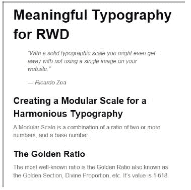

# 七、响应性网页设计的有意义排版

正如我在代顿网络开发者会议上的一次演讲中所说：

> *“有了坚实的排版比例，你甚至可以在网站上不用一张图片。”*

印刷术的力量已经成为网页设计中最被低估的资产之一。诚然，我们看到越来越多的设计都在考虑排版，在创造网站或应用程序的预期氛围方面发挥着重要作用。

在这一章中，我们的重点将放在一些方面，技巧和技巧，我们需要从排版立场考虑 RWD 的东西。

我们将讨论：

*   印刷用像素、ems 或 REM？
*   计算相对字体大小。
*   为和谐的排版创建模块化比例。
*   使用模块化比例进行排版。
*   网页字体及其对 RWD 的影响。
*   流体尺寸标题使用`FitText.js`。
*   使用`FlowType.js`提高易读性。

# 用于排版的像素、ems 或 REM？

很难决定是使用像素、ems 还是 rems 进行排版。这是风格的问题。一些 web 设计师/开发人员仍然使用像素作为其单位来声明字体大小。只不过把我们的脑袋绕在尺寸上要容易得多。

以像素为单位设置字体大小的问题基本上是在传统 IEs 上，如果用户出于任何原因想放大页面，文本将保持在给定的像素大小。

现在，就现代浏览器而言，这已经成为过去。当你放大任何现代的浏览器时，如果它放大到足够大，它将触发媒体查询，从而显示网站的移动版本。

基于像素的字体大小调整的另一个问题是很难缩放和维护。这基本上意味着我们必须在每个媒体查询中一遍又一遍地声明更多元素的字体大小。

另一方面，我们有相对的单位，ems 和 REM，这几乎是我们推荐的设置字体大小的方法。

然而，ems 的问题是，我们必须（在思想上，在 CSS/HTML 注释中，或在某个文本文件中）跟踪父容器的大小，这很容易成为字体管理的噩梦。ems 中的字体大小取决于其父容器的字体大小。因此，如果我们有不同级别的嵌套容器，事情可能会很快变得糟糕，因为跟踪父容器的字体大小并不容易。

但是随后*rem*出现了。Rem 指*根 em*。*根*是`<html>`元素。

Rems 带来了两个方面的好处：我们可以使用与我们声明像素相同的心智模型在 Rems 中声明字体大小，但使用 ems 等相对单位的好处是。使用 rems 的唯一问题是传统浏览器不支持此单元，因此需要考虑基于像素的字体大小回退值。这是一个简短的 Sass 混合来拯救这一天。

但在尝试任何 Sass 技巧之前，让我们先从本章的核心策略开始。

# 计算相对字体大小

还记得我们在[第 3 章](3.html "Chapter 3. Mobile-first or Desktop-first?")中提到的RWD 魔术公式吗？*移动优先还是桌面优先？*：

（目标÷背景）x 100=结果%

当字体大小以像素为单位设置时，还有另一个类似的计算相对字体大小（ems）的神奇公式。唯一的区别是我们没有乘以 100。

这是一个公式：

目标÷上下文=结果

*目标*是以像素为单位定义的字体大小。*上下文*是父容器中定义的字体大小。*结果*是 ems 中定义的值。

下面是一个示例，考虑到父容器（本例中的主体）中的字体大小为 16px：

```html
header {
    font: 30px Arial, "Helvetica Neue", Helvetica, sans-serif;
}
```

为了计算相对字体大小，我们使用以下公式：

*30px÷16px=1.875em*。

因此，我们的 CSS 规则如下所示：

```html
header {
    font: 1.875em Arial, "Helvetica Neue", Helvetica, sans-serif;
}
```

我们必须对设计中的每种字体大小都这样做。

就理解数学而言，这很好。然而，真正的价值在于首先创建这些基于像素的值的思考过程。这就是模块化规模的由来。

# 为和谐的排版创建模块化比例

模块化量表由蒂姆·布朗创建。有不同的方法来创建排版的模块化比例。在我们的示例中，我们将使用两个基数和一个比率创建一个模块化比例。这些数字的乘法创建了一个在所有值之间和谐且成比例的刻度。

最著名的比例是*黄金比例*也称为*黄金分割*、*神圣比例*等等。其值为*1.618*。

现在，为了避免不必要的数学运算，黄金分割率基于斐波那契序列：1、1、2、3、5、8、13、21 等等。

这些数字具有以下模式：下一个数字是前两个数字相加的结果。例如：

所以 0 加 T0，1 加 T2，1 加 T3 等于 2 加 T4，1 乘 T5 等于 3 加 T6，2 乘 T7 等于 5 加 T8，3 乘 T9 等于 8 加 T10，5 乘 T11 等于 13 加 T12，8 乘 T13，也就是 21。

这里的想法是理解创建一组在一起使用时和谐的数字的意图。我们也将使用模块化规模的 web 应用程序创建一个排版规模，用于我们的项目中，而忘记手动计算项目的相对字体大小。

那么让我们来看看由蒂姆·布朗和斯科特·凯勒姆构建的模块化网络应用程序：[http://www.modularscale.com/](http://www.modularscale.com/) 。

一旦web 应用程序打开，我们需要三个步骤来创建我们的模块化规模：

1.  定义第一个基数。
2.  定义第二个基数。
3.  选择一个比率。

### 提示

模块化比例可以用于任何使用某种值的东西，而不仅仅是排版。可用于`padding`、`margin`、`line-height`等。然而，我们在本章的重点是排版。

## 定义第一个基数

建议定义第一个数字的方法是使用正文文本大小，即段落中使用的字体大小。但请记住，使用正文文本大小作为第一个基数不是强制性的。我们可以使用字体的 x 高度，或者字体中的其他长度，我们认为这可能是一个很好的起点。

尽管我们可以选择任何字体大小，但让我们从所有浏览器都使用的默认字体 16px 开始。所以我们在第一个基本字段中输入`16px`。

单击加号图标并添加第二个基本字段。

### 提示

不要担心应用程序的字体大小预览，正如您所看到的，当我们为基本值键入数字时，右侧预览窗格中的字体大小会发生变化。我们将在下一步中实现这一点。

## 定义第二个基数

第二个基本字段是我所说的*幻数*，因为这个数字完全是主观的和任意的，然而，它与我们正在进行的项目密切相关。

当我说*紧密相关*时，我的意思是使用主容器的宽度，例如 960px、980px、1140px 等等。或者，它也可以是网格中使用的列数，例如 12 或 16。它也可以是站点最大宽度处的柱宽度，例如 60px，甚至是排水沟间距，例如 20px。

这个*魔法数字*是我们想要的任何东西，但它以某种方式与我们的项目直接相关。在这个例子中，假设我们的目标屏幕的最大宽度为 1280px，那么我们的主容器的最大宽度为 1140px。因此，让我们在第二个基本字段中键入`1140px`。

## 选择一个比率

这就是魔法发生的地方。选择一个比率意味着该比率将乘以基数，创建成比例相关的数值比例。

这些比率是基于音阶的，如果我们决定使用黄金比率（1.618），那么在这个列表中也有黄金比率。从**比率**下拉列表中，选择**1:1.618–黄金分割**比率。

就这样！我们现在已经创建了第一个模块化量表。

此模块化比例尺提供的字体大小完全协调，因为它们根据与我们的项目直接相关的相关值相互成比例：

*   理想的正文字体大小是 16px
*   我们主容器的最大宽度是 1140px
*   黄金比率为 1.618

我们的排版现在有一个坚实的模块化基础，让我们使用它。

# 使用模块化比例进行排版

如果您点击**表**视图，所有文本都将消失，我们将看到一个字体大小列表，范围从可笑的小值到同样可笑的大值。不过没关系。这就是模块化秤的威力。

这就是我们看到的：


如上图所示，共有三列：

*   第一列以像素为单位显示字体大小。
*   第二列显示 ems 中的字体大小。
*   如果基数为 16px，则第三列显示字体大小。

我们需要做的是只关注第一列和第二列。突出显示的一行表示 16px 或 1em，这将是我们段落的字体大小。16px 是大多数浏览器的默认字体大小。

然后，我们定义标题元素。假设我们只定义了`h1`、`h2`和`h3`。这意味着我们将选择 16px 以上的行，这些行具有较大的字体大小：

*   `<h1>`：**39.269px**即 2.454em
*   `<h2>`：**25.888px**即 1.618em
*   `<h3>`：**24.57px**即 1.517em

对于`<small>`元素，如果我们的网站上有任何免责声明，我们选择 16px 以下的字体大小：

`<small>`：**9.889px**即 0.618em

就这样！这个模块化量表中的所有数字都是和谐的，当一起使用时，将提供一个清晰的视觉层次，以及一种难以通过其他方法获得的关系。

这里有一个例子。

这是 HTML：

```html
<h1>Meaningful Typography for RWD</h1>
<blockquote>
    <p>"With a solid typographic scale you might even get away with not using a single image on your website."</p>
    <p>— Ricardo Zea</p>
</blockquote>
<h2>Creating a Modular Scale for a Harmonious Typography</h2>
<p>A Modular Scale is a combination of a ratio of two or more numbers, and a base number.</p>
<h3>The Golden Ratio</h3>
<p>The most well-known ratio is the Golden Ratio also known as the Golden Section, Divine Proportion, etc. It's value is 1.618.</p>
```

这是 SCSS：

```html
//Mobile-first Media Query Mixin
@mixin forLargeScreens($media) {
    @media (min-width: $media/16+em) { @content; }
}
body {
    font:16px/1.4 Arial, "Helvetica Neue", Helvetica, sans-serif;
    @include forLargeScreens(640) {
        font-size: 20px;
    }
}
h1 { font-size: 2.454em; }
h2 { font-size: 1.618em; }
h3 { font-size: 1.517em; }
```

### 提示

注意，我是如何将 mobilefirst-Sass 混入其中的。

以下是编译的 CSS：

```html
body {
    font: 16px/1.4 Arial, "Helvetica Neue", Helvetica, sans-serif;
}
@media (min-width: 40em) {
    body {
        font-size: 20px;
    }
}
h1 {
    font-size: 2.454em;
}
h2 {
    font-size: 1.618em;
}
h3 {
    font-size: 1.517em;
}
```

在小屏幕（510px 宽）上，模块化比例如下所示：


而在大屏幕（850px 宽）上也是如此：


这里唯一的潜在问题是我之前提到的关于使用 ems 的问题：跟踪父元素的字体大小可能会变成字体管理的噩梦。

使用像素是不可能的，因为它在传统浏览器中存在可伸缩性问题。然而，使用 rems 可以使事情保持在“相对字体大小”的范围内，同时提供基于像素的思维方式，但不存在可伸缩性问题。这使我们能够支持不支持 rems 的传统浏览器。

下面是我在 CodePen 中为此创建的一个演示：

[http://codepen.io/ricardozea/pen/0b781bef63029bff6155c00ff3caed85](http://codepen.io/ricardozea/pen/0b781bef63029bff6155c00ff3caed85)

## rems 到 Sass 的混合

我们只需要一个 Sass mixin，它允许我们在没有特定单位的情况下设置字体值，mixin 负责为现代浏览器添加基于 rem 的字体大小，为传统浏览器添加基于像素的字体大小。

这是 Chris Coyer 创建的 Sass mixin：

```html
//Pixels to Rems Mixin
@mixin fontSize($sizeValue: 1.6) {
    font-size: ($sizeValue * 10) + px;
    font-size: $sizeValue + rem;
}
```

### 提示

我对 mixin 的原始名称做了一个小小的修改，从使用 dash separated 改为 camelCase。我这样做的原因是，在扫描文档时，可以更容易地从类名中找到 mixin 的名称。

用法如下：

```html
@include fontSize(2);
```

本例使用了与前一章相同的标记，因此我将仅向您展示 SCS 和一些屏幕截图。

SCSS 如下所示：

```html
//Mobile-first Media Query Mixin
@mixin forLargeScreens($media) {
    @media (min-width: $media/16+em) { @content; }
}
//Pixels to Rems Mixin
@mixin fontSize($sizeValue: 1.6) {
 font-size: ($sizeValue * 10) + px;
 font-size: $sizeValue + rem;
}
//Base-10 model
html { font-size: 62.5%;
    @include forLargeScreens(640) {
        font-size: 75%;
    }
}
h1 { @include fontSize(3.9269); }
h2 { @include fontSize(2.5888); }
h3 { @include fontSize(2.457); }
p { @include fontSize(1.6); }
```

考虑以下几点：

*   我们将根字体大小设置为 62.5%，这将字体大小减少到 10px。这使得声明字体值更加容易。例如，字体大小 1.2rem 与 12px 相同，8rem 与 8px 相同，依此类推。
*   在 rems 中声明字体大小时，我们需要将小数点从基于像素的值向左移动一个点。例如，根据我们的模块化比例，`<h1>`像素大小为 39.269px，因此在 rems 中声明字体大小时，我们将其声明为 3.9269，*而无单位*。

已编译的 CSS 如下所示：

```html
html {
    font-size: 62.5%;
}
@media (min-width: 40em) {
    html {
        font-size: 75%;
    }
}
h1 {
    font-size: 39.269px;
    font-size: 3.9269rem;
}
h2 {
    font-size: 25.888px;
    font-size: 2.5888rem;
}
h3 {
    font-size: 24.57px;
    font-size: 2.457rem;
}
p {
    font-size: 16px;
    font-size: 1.6rem;
}
```

这是在小屏幕（510px 宽）上使用 rems 到像素混合的模块化比例：



这是在大屏幕（850px 宽）上的样子：


下面是我在 CodePen 中为此创建的一个演示：

T0http://codepen.io/ricardozea/pen/8a95403db5b73c995443720475fdd900 T1

我们刚才看到的示例使用的是系统字体 Arial。让我们继续用一些网页字体来修饰这些例子，让它们更具*字符*。

# 网页字体及其对 RWD 的影响

网页字体现在几乎是必须使用的，我说*几乎是*，因为我们需要注意它们给我们的项目带来的影响，如果有必要，我们实际上可能根本不使用它们。

在我们深入了解如何使用 web 字体之前，以下是一些 web 字体资源，它们可能会对您中的许多人有所帮助：

*   **字体松鼠**（[http://www.fontsquirrel.com/](http://www.fontsquirrel.com/) ：我已经广泛使用这项服务并取得了巨大成功。要使用字体，您需要下载文件，然后在 CSS 中与`@font-face`一起使用。他们有你能找到的最好的网页字体生成器工具（[http://www.fontsquirrel.com/tools/webfont-generator](http://www.fontsquirrel.com/tools/webfont-generator)
*   **谷歌字体**[https://www.google.com/fonts](https://www.google.com/fonts) ：如果不提到谷歌字体，我就无法谈论网络字体资源。如果我在 Font Squirrel 上找不到它，我会来这里，反之亦然。您可以下载字体文件或使用 JavaScript。以下示例中使用的字体是从 Google 字体下载的（[https://github.com/google/fonts/tree/master/ofl/oswald](https://github.com/google/fonts/tree/master/ofl/oswald) 。
*   **Adobe Edge 网页字体**（[https://edgewebfonts.adobe.com/](https://edgewebfonts.adobe.com/) ：这也是一个很棒的工具。此服务由 TypeKit（第一个 web 字体服务）提供支持。我也广泛使用了 TypeKit。您无法下载字体，您必须使用JavaScript。

现在，让我们看看使用网页字体的利弊：

的优点是：

*   它们有助于突出品牌，并在不同媒体之间建立一致性。
*   如果使用得当，它们会使设计看起来更吸引人。
*   不再需要使用图像替换技术。
*   这使文本保持为 HTML 格式，使内容更易于访问和*可索引*。
*   传统浏览器支持 web 字体。
*   免费字体的巨大资源。
*   所有这些反过来又有助于保持标记的整洁。

缺点是：

*   由于 HTTP 请求或对第三方服务器的依赖性，它们会减慢网站/应用程序的速度。
*   并非所有的网页字体在大小上都清晰可辨。
*   如果需要支持传统浏览器，则需要管理更多文件。
*   授权使用字体需要某种形式的付款：每月、每种字体系列、每种字体样式，等等。
*   一些免费字体没有很好地构建。
*   存在渲染副作用：
    *   **未设置样式的文本**（**FOUT**）闪烁：在现代浏览器上，当页面加载时，文本首先以系统字体呈现在屏幕上，然后再以 web 字体交换和设置样式。
    *   **不可见文本的闪烁**（**FOIT**）：在传统浏览器上，当页面加载时，文本不可见，但一秒钟后会使用 web 字体呈现。

还有其他不值得进入的内容，如回退文本的**闪现和虚假文本**的**闪现（**FOFT**）。**

如何处理所有“任何文本的闪光”不属于本节的范围。但是，我鼓励您阅读 Zach Leatherman 在 Opera 博客上的文章*Better@Font face with Font Load Events*（[中关于字体加载事件的https://dev.opera.com/articles/better-font-face/](https://dev.opera.com/articles/better-font-face/) ）。

# 用于实现 web 字体的 Sass mixin

为了实现 web 字体，我们需要在 CSS 中使用`@font-face`指令……嗯，SCSS。

`@font-face`声明块在其香草 CSS 形式中如下所示：

```html
@font-face {
    font-family: fontName;
    src: url('path/to/font.eot'); /*IE9 Compat Modes*/
    src: url('path/to/font.eot?#iefix') format('embedded-opentype'), /*IE6-IE8 */
        url('path/to/font.woff') format('woff'), /*Modern Browsers*/
        url('path/to/font.ttf') format('truetype'), /*Safari, Android, iOS*/
        url('path/to/font.svg#fontName') format('svg'); /*iOS devices*/
    font-weight: normal;
    font-style: normal;
}
```

现在，如果您使用多个样式或字体系列，则需要为每个字体文件重复整个`@font-face`声明块。这不是很干（不要重复）。

### 提示

Web 字体在文件大小和服务器请求方面非常昂贵，因此请适度使用 Web 字体。你使用的越多，你的网站/网络应用程序就会变得越慢。

是的，这是一个相当强大的 CSS 来处理网页字体，哦，伙计。

为了保持理智，让我们将前面的`@font-face`CSS 声明块转换为 Sass mixin：

```html
@mixin fontFace($font-family, $file-path) {
    @font-face {
        font: {
            family: $font-family;
            weight: normal;
            style: normal;
        }
        //IE9 Compat Modes
        src: url('#{$file-path}.eot');
        //IE6-IE8
        src: url('#{$file-path}.eot?#iefix') format('embedded-opentype'),
        //Modern Browsers
        url('#{$file-path}.woff') format('woff'),
        //Safari, Android, iOS
        url('#{$file-path}.ttf') format('truetype'),
        //Safari, Android, iOS
        url('#{$file-path}.svg') format('svg');
    }
}
```

用法是调用字体文件的一行代码。让我们使用 Oswald 字体：

```html
@include fontFace(oswald-light, '../fonts/oswald-light');
```

在任何元素上使用它都需要在字体堆栈的开头添加字体名称，如下所示：

```html
p { font: 2.2rem oswald-bold, Arial, "Helvetica Neue", Helvetica, sans-serif; }
```

如果需要包含多个字体文件，只需添加另一行调用 mixin，但指定其他字体名称：

```html
@include fontFace(oswald-light, '../fonts/oswald-light');
@include fontFace(oswald-regular, '../fonts/oswald-regular');

```

前两行代码将编译为以下 CSS：

```html
@font-face {
    font-family: oswald-light;
    font-weight: normal;
    font-style: normal;
    src: url("../fonts/oswald-light.eot");
    src: url("../fonts/oswald-light.eot?#iefix") format("embedded-opentype"), url("../fonts/oswald-light.woff") format("woff"), url("../fonts/oswald-light.ttf") format("truetype"), url("../fonts/oswald-light.svg") format("svg");
}
@font-face {
    font-family: oswald-regular;
    font-weight: normal;
    font-style: normal;
    src: url("../fonts/oswald-regular.eot");
    src: url("../fonts/oswald-regular.eot?#iefix") format("embedded-opentype"), url("../fonts/oswald-regular.woff") format("woff"), url("../fonts/oswald-regular.ttf") format("truetype"), url("../fonts/oswald-regular.svg") format("svg");
}
```

这是一种很好的方式，只需两行代码就可以创建所有 CSS，是吗？但是，如果我们想纠正错误，让我们分析一下我们在这里做的事情：

*   我们支持传统浏览器：
    *   IE8 及以下，带有`.eot`字体。
    *   iOS 中 Android 上的老 Safari，字体为`.ttf`。
    *   旧的 iOS，用于几乎被遗忘的 iPhone3 及以下版本，带有`.svg`文件。
*   现代浏览器只需要`.woff`字体。根据 CanIUse.com 的数据，`.woff`字体文件的支持率为 99%，但在撰写本书时（[的 Opera Mini 除外 http://caniuse.com/#search=woff](http://caniuse.com/#search=woff) ）。

所以问题是：我们能否优雅地降低传统浏览器和操作系统的体验，让它们改用系统字体？

当然可以！

将 mixin 优化为仅使用`.woff`字体后，看起来是这样的：

```html
@mixin fontFace($font-family, $file-path) {
    @font-face {
        font: {
            family: $font-family;
            weight: normal;
            style: normal;
        }
      //Modern Browsers
        src: url('#{$file-path}.woff') format('woff');
    }
}
```

用法完全相同：

```html
@include fontFace(oswald-light, '../fonts/oswald-light');
@include fontFace(oswald-regular, '../fonts/oswald-regular');
```

编译后的 CSS 要短得多：

```html
@font-face {
    font-family: oswald-light;
    font-weight: normal;
    font-style: normal;
    src: url("../fonts/oswald-light.woff") format("woff");
}
@font-face {
    font-family: oswald-regular;
    font-weight: normal;
    font-style: normal;
    src: url("../fonts/oswald-regular.woff") format("woff");
}
```

在几个元素上使用它如下所示：

```html
h1 { font: 4.1rem oswald-regular, Arial, "Helvetica Neue", Helvetica, sans-serif; }
p { font: 2.4rem oswald-light, Arial, "Helvetica Neue", Helvetica, sans-serif; }
```

只使用`.woff`字体可以大大减少文件管理的工作量，这有助于将我们的大脑从不必要的任务中解放出来，让我们专注于最重要的事情：建立一个难忘的体验。更不用说，它使我们的 CSS 代码更加精简和可伸缩。

但是等等，我们让传统浏览器优雅地降级为系统字体，我们仍然需要为它们定义像素大小！

像素到 rems Sass 混合到救援中！

记住在`<html>`标签中看到 base-10 模型，以便于计算：

```html
//Base-10 model
html { font-size: 62.5%; }
```

然后，让我们声明字体大小和字体系列：

```html
h1 {
    @include fontSize(4.1);
    font-family: oswald-regular, Arial, "Helvetica Neue", Helvetica, sans-serif;
}
p {
    @include fontSize(2.4);
    font-family: oswald-light, Arial, "Helvetica Neue", Helvetica, sans-serif;
}
```

编译后的 CSS 如下所示：

```html
h1 {
    font-size: 41px;
    font-size: 4.1rem;
    font-family: oswald-regular, Arial, "Helvetica Neue", Helvetica, sans-serif;
}

p {
    font-size: 24px;
    font-size: 2.4rem;
    font-family: oswald-light, Arial, "Helvetica Neue", Helvetica, sans-serif;
}
```

### 提示

我们在同一规则中声明了两种不同的字体大小，因此在这种情况下不能使用字体速记。

因此，通过利用两个简单的 Sass 混合的超级功能，我们可以轻松嵌入 web 字体并使用 rems 调整字体大小，同时为传统浏览器提供基于像素的字体大小。

这是一个健壮的可伸缩性的好例子。

下面是我在 CodePen 中为此创建的一个演示：

T0http://codepen.io/ricardozea/pen/9c93240a3404f12ffad83fa88f14d6ef T1

在不失去任何动力的情况下，让我们换个角度，讨论一下如何通过简单聚焦，使用令人敬畏的 FlowType.js jQuery 插件实现最小行长，从而提高页面的易读性。

# 使用 FlowType.js 提高易读性

最引人注目的编辑原则之一是，最清晰的排版的理想行长在 45 到 75 个字符之间。

如果你问我的话，这是一个相当不错的范围。然而，实际上，让你的段落足够长，或者足够短，就像是一个“盲人领导盲人”的游戏。我们如何判断容器宽度和字体大小的组合是否符合 45 到 75 个字符的建议？此外，在小型或中型屏幕上，您如何判断情况是这样？

棘手的一个，嗯？

不用担心，因为使用 FlowType.js，我们可以解决这些问题。

您可以从[下载插件 http://simplefocus.com/flowtype/](http://simplefocus.com/flowtype/) 。

我们首先需要的是 HTML，下面是我们将要使用的标记：

```html
<!DOCTYPE html>
<!--[if IE 8]> <html class="no-js ie8" lang="en"> <![endif]-->
<!--[if IE 9]> <html class="no-js ie9" lang="en"> <![endif]-->
<!--[if gt IE 9]><!--><html class="no-js" lang="en"><!--<![endif]-->
<head>
    <meta charset="utf-8">
    <meta name="viewport" content="width=device-width, initial-scale=1">
    <meta http-equiv="X-UA-Compatible" content="IE=edge">
    <title>Meaningful Typography for RWD</title>
    <script src="//code.jquery.com/jquery-latest.min.js"></script>
    <script src="js/flowtype.js"></script>
</head>
<body>
    <main class="main-ctnr" role="main">
        <h1>Meaningful Typography for RWD</h1>
        <blockquote>
            <p>"With a solid typographic scale you might even get away with not using a single image on your website."</p>
            <p>— Ricardo Zea</p>
        </blockquote>
        <p>One of the most compelling editorial principles states that the ideal line length for the most legible typography is between 45 and 75 characters.</p>
    </main>
</body>
</html>
```

一旦您熟悉 FlowType.js，您可能会开始思考，“如果 FlowType 在几乎任何视口宽度下自动修改字体大小，我认为我不需要在我的 SCS 中声明任何字体大小！毕竟，它们将被 FlowType 覆盖。”

不管怎样，我们都需要设置字体大小，因为如果不加载 FlowType.js，我们将任由浏览器的默认样式支配，我们设计师不希望这样。

说到这里，下面是 SCS 来声明必要的字体大小：

```html
//Pixels to Rems Mixin
@mixin font-size($sizeValue: 1.6) {
    font-size: ($sizeValue * 10) + px;
    font-size: $sizeValue + rem;
}
//Base-10 model
html { font-size: 62.5%; }
h1 { @include fontSize(3.9269); }
p { @include fontSize(1.6); }
```

这将编译为以下 CSS：

```html
html {
    font-size: 62.5%;
}
h1 {
    font-size: 39.269px;
    font-size: 3.9269rem;
}
p {
    font-size: 16px;
    font-size: 1.6rem;
}
```

这就是魔法发生的地方。我们创建了一个 jQuery 函数，可以在其中指定要针对的元素。此函数可以放在单独的 JavaScript 文件中，也可以放在标记中。

在我们的示例中，我们告诉 FlowType.js 将字体的大小调整应用于`<html>`元素。因为我们使用的是相对字体大小单位 rems，所以所有文本都会在任何屏幕宽度下自动调整大小，保持理想的行长。

以下是 jQuery 函数：

```html
$(function() {
    $("html").flowtype();
});
```

## 定义阈值

我们刚才看到的解决方案有一个潜在的问题：FlowType.js 将无限期地修改段落的字体大小。换句话说，在小屏幕上，文本将非常小，而在大屏幕上，文本将太大。

我们可以使用两种单独的阈值方法或两者的组合来解决这个问题。

现在，我们需要弄清楚的一件事是，这一部分需要一些调整和调整，以获得最佳结果，没有特定的值适用于所有情况。

我们将采用以下方法：

*   定义容器或元素的最小和最大宽度。
*   定义容器或元素的最小和最大字体大小。

### 阈值宽度

定义最小和最大宽度将告诉 FlowType.js 应该在哪些点停止调整大小。

让我们定义宽度阈值：

```html
$(function() {
    $("html").flowtype({
      //Max width at which script stops enlarging
        maximum: 980,
      //Min width at which script stops decreasing
      minimum: 320
   });
});
```

### 提示

我选择的阈值特别适用于本例，但不一定适用于其他情况。调整和测试，直到获得理想的宽度，每行推荐 45-75 个字符。

### 阈值字体大小

就像使用宽度阈值一样，定义最小和最大字体大小将告诉 FlowType.js 它应该缩放文本的最小和最大字体大小。

我们还将使用`fontRatio`变量声明我们自己的字体大小；数字越大，字体越小；数字越小，字体越大。如果这感觉违反直觉，请这样看：数字越高，压缩越高（因此使其变小），数字越低，压缩越低（因此使其变大）。

调整`fontRatio`值是一项*目不转睛的*练习，因此调整并测试，就像没有明天一样。

让我们看一看字体大小值：

```html
$(function() {
 $("html").flowtype({
      //Max width at which script stops enlarging
      maximum: 980,
      //Min width at which script stops decreasing
      minimum: 320,
      //Max font size
      maxFont : 18,
      //Min font size
      minFont : 8,
 //Define own font-size
 fontRatio : 58
   });
});
```

### 提示

列表中最后一个值后面不需要包含逗号。

FlowType.js 只是普通的石头人！

下面是我在 CodePen 中为此创建的一个演示：

T0http://codepen.io/ricardozea/pen/c2e6abf545dbaa82a16ae84718c79d34 T1

# 总结

因此，我们在这里，在 RWD 的排版水平。还有更多关于排版的内容吗？当然！这个惊人的主题本身就是一个完整的行业，没有它我们就不会读这本书。

我们现在可以说，我们理解了为什么在排版中使用相对单位是一个好方法：可伸缩性。此外，使用我们的小魔术公式，我们可以计算设计中每个文本元素的相对字体大小，但为什么要经历这些麻烦呢？在这方面，排版的模块化规模节省了时间，它为我们的项目注入了令人敬畏的排版和谐。谁知道呢，也许我们根本不需要使用图像！

品牌现在可以通过 Web 字体扩展到 Web，但我们需要小心，并考虑使用它们对我们的网站/应用程序的影响。此外，就现代浏览器而言，我们只需要使用单一的文件类型（WOFF 字体文件），这使得浏览器下载和用户享受时更容易管理。

js 增强了标题和正文文本，同时保持了良好的易读性。

现在，RWD 的一个重要部分是（信不信由你）像我们很多年前做的那样做。在下一章中，我们将保持简单，我们将在电子邮件中讨论 RWD。

时光倒流！