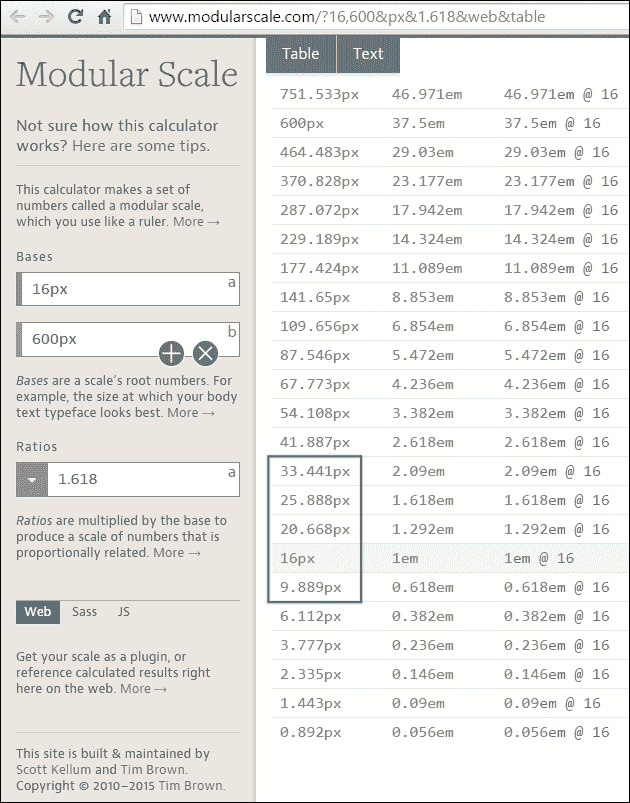
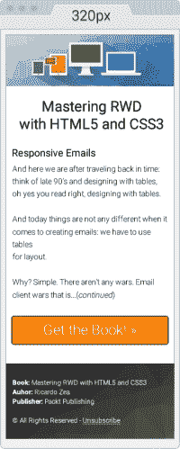

# 第八章。 响应电子邮件

我们回到了过去。 想想 90 年代末的桌子设计; 哦，是的，你读对了，用桌子设计。

今天，当涉及到创建电子邮件时，事情并没有任何不同:我们必须使用表格进行布局。 为什么? 这很简单。 没有战争。 也就是说，电子邮件客户机大战。

与 1995 年网景和 ie 争夺市场霸主地位的浏览器大战不同，电子邮件客户端自记事以来就一直过着各自独立的生活，彼此几乎一无所知。

多亏了浏览器之战，我们现在有了如此棒的兼容标准的浏览器，这些浏览器充满了特性、定制功能、不断更新等等，让每个人的在线生活变得更轻松。

另一方面，电子邮件客户端以自己的速度发展，这种速度很慢，因为实际上没有任何竞争。 此外，绝大多数企业已经被微软的 Outlook 所束缚。 在 Office 的最新版本中，Outlook 实际上比它的早期版本更糟糕，因此并没有真正帮助电子邮件领域在支持更现代技术方面得到改善。

更糟糕的是，有些电子邮件客户机相对较新，完全拒绝对`<style>`元素甚至媒体查询的支持。

但电子邮件是一种令人难以置信的高效和强大的营销工具——无论技术水平如何，我们都需要准备好在不久之后使用它。

换句话说，电子邮件作为一种交流媒介在短时间内不会消失，作为网页设计师/开发者，我们必须使用表格和内嵌样式来设计电子邮件。

但是不要担心，我将向您展示 RWD 的基本原则，以及使用渐进增强的一点常识，并总是试图保持事情简单，设计和实现响应性电子邮件并不困难，而且可能很有趣。

在本章中，我们将讨论以下主题:

*   为什么我们需要担心回复邮件?
*   不要忽视你的分析。
*   响应电子邮件需要考虑的事情。
*   响应电子邮件。
*   第三方服务。

# 为什么我们需要担心回复邮件?

我们需要担心响应性电子邮件的主要原因很简单:大约 65%的电子邮件是在移动设备(智能手机和平板电脑)上打开的。 剩下的 35%的电子邮件是在桌面上打开的。 此外，回复的电子邮件比没有回复的电子邮件更有参与性。

除此之外，在桌面打开的电子邮件比在移动设备上打开的电子邮件更具粘性。

查看以下文章:

*   *美国近 65%的电子邮件是在移动设备上打开的*:[https://www.internetretailer.com/2014/01/23/nearly-65-e-mails-us-are-opened-mobile-devices](https://www.internetretailer.com/2014/01/23/nearly-65-e-mails-us-are-opened-mobile-devices)
*   *上季度 65%的营销邮件是在移动设备上打开的; Android 平板电脑使用翻倍*:[http://www.phonearena.com/news/65-of-marketing-emails-were-opened-on-a-mobile-device-last-quarter-Android-tablet-use-doubles_id51864](http://www.phonearena.com/news/65-of-marketing-emails-were-opened-on-a-mobile-device-last-quarter-Android-tablet-use-doubles_id51864)

### 提示

术语*参与度*指的是用户点击/点击。 所以，*更多用户粘性*意味着*更多点击/点击*。

# 不要忽视你的分析

在开始推送像素、嵌套表和样式元素之前，我们绝对有必要查看分析，并对将要创建电子邮件的内容进行鸟瞰。

这样做会让我们明白:

*   我们的电子邮件什么时候被打开?
*   哪一天有更多的开放。
*   哪些时间开放更多。
*   这个赛季是否造成更多/更少的空缺。
*   哪些设备被用来打开我们的电子邮件。
*   哪些电子邮件客户端使用最多/使用较少。

以为例，如果分析数据表明 Outlook 2013 很少被使用(这不是很好吗)，那么我们可能根本不需要担心这个电子邮件客户机。

如果 Android 中的 Yahoo Mail 应用程序是最常用的应用程序和平台，那么我们可以安全地使用更高级的 CSS 属性并逐步增强，知道我们的想法将正确地显示。

做市场份额调查是很重要的，但你自己的分析最终将决定你如何制定你的电子邮件开发策略。

# 构建更好的响应电子邮件的建议

尽管一些电子邮件客户机在呈现电子邮件方面做得越来越好，但还有一些电子邮件客户机并没有达到它们应该达到的水平。 这意味着我们需要构建一些基本的东西，并逐步增强它，以实现更好的电子邮件客户机。

在构建响应性电子邮件时，有一些重要的指导方针需要考虑:

*   **定义 CSS 和 HTML 支持最少的电子邮件客户端**:知道哪个电子邮件客户端拥有最少的 HTML 和 CSS 支持将为我们在测试中节省不必要的头痛和时间。 这也是分析的关键所在。
*   **使用渐进式增强**:首先，为 CSS 和 HTML 支持最少的电子邮件客户端设计和构建。 然后，我们利用这些核心基础来增强设计和体验。
*   **保持在 550 到 600 像素的宽度内**:这是非常重要的，因为大多数电子邮件客户端都有非常窄的预览窗格。 此外，在桌面客户端和 web 浏览器上，600px 或更小的像素会看起来很好，而且在小屏幕上缩小或设置响应时，电子邮件仍然可以阅读。
*   **使用表格进行布局**:大多数电子邮件客户端对 HTML 和 CSS 的支持远不如 web 浏览器，所以使用表格构建布局仍然是创建电子邮件的方式。
*   **Inline CSS**:许多电子邮件客户端删除了电子邮件的`<head>`部分，因此我们放入其中的任何内容都将被删除。 因此，我们需要内联 CSS 以实现必要的样式化。
*   **使用系统字体**:虽然使用 web 字体在技术上是可行的，但最好还是坚持使用系统字体，这样电子邮件在不同设备和不同的电子邮件客户端上看起来尽可能相似。 然而，如果你决定使用 web 字体，那就使用它，并将其作为渐进增强过程的一部分。
*   **为背景图片提供一个后退色**:使用背景图片并不是真的那么困难。 Outlook 是唯一需要特殊标记(条件注释)才能工作的客户机。 然而，总是提供一个后备的背景颜色，以防图像不加载。
*   **总是在图像上使用 alt 属性**:如果图像没有加载或加载太慢，电子邮件客户端将显示替代文本。 确保在`alt`属性中也加入一些描述性的内容。 与其用*标志*，不如用*公司标志-标语*。
*   **不需要做移动优先**:因为我们正在做渐进式增强，我们从对 HTML 和 CSS 支持最少的电子邮件客户机开始。 因此，这个电子邮件客户机很可能不支持媒体查询或`viewport`元标记。 因此，以移动设备为优先的方法可能不一定是最好的选择，至少目前还不是。
*   **使用 HTML5 DOCTYPE**:我们当然可以使用旧的 HTML4 DOCTYPE，但我们也可以使用 HTML5 DOCTYPE，这总是一个很好的衡量标准。
*   **避免使用 HTML5 元素**:虽然我们可以使用 HTML5 DOCTYPE，但实际上不支持 HTML5 元素。 所以要避免在电子邮件中使用 HTML5 元素。
*   **保持简单**:大多数电子邮件的寿命都很短，所以没有必要做一个复杂的布局。 创建一个简单的单列布局，这将为我们省去很多麻烦。 强烈关注设计本身。 这是一个坚实的排印模块化规模可以工作奇迹。

# 响应式电子邮件构建

定义电子邮件的特性也是*构建*的一部分，所以让我们定义这些特性:

1.  创建排版的模块化比例。
2.  创建两个设计来帮助预先可视化电子邮件:一个用于大屏幕，一个用于小屏幕。
3.  电子邮件的最大宽度为 600px，最小宽度为 320px。
4.  使用渐进增强。

## 排版模块尺度

为了构建的模块化尺度，我们将使用以下值:

*   **基数 1**(16px):这是我们的基本字体大小。
*   **基数 2**(600px):这是我们的电子邮件的最大宽度。
*   **Ratio**(1.618):黄金比例。

该模块量表可在[http://www.modularscale.com/?16,600&px&1.618&web&表](http://www.modularscale.com/?16,600&px&1.618&web&table)中找到。



## 设计-大屏幕和小屏幕视图

以下的设计将有助于在大屏幕和小屏幕上更好地展示电子邮件。 这是它在 600px 宽时的样子:


这是电子邮件的最小尺寸，320px 宽:



让我们直接进入正题，构建响应性电子邮件。

## 建立基本的 HTML 模板

让我们从最基本的模板开始。 然后，我们将添加不同的东西，我们需要有一个声音模板。

以下是在`<head>`部分中包含一些初始元素的 HTML 的第一次展示:

*   使用`lang`属性定义文档的语言，在本例中为英语。
*   由于我们的设计具有彩色背景，所以我们需要将`<html>`和`<body>`元素的高度设置为 100%。 这使得两个元素都伸展到视口的全部高度。 否则，背景将结束在电子邮件的底部，然后页面将显示白色的背景。
*   添加一个`<title>`标签。
*   添加以下元标签:
    *   utf - 8 字符集
    *   视窗
    *   使 Internet Explorer 尽可能使用最新的渲染引擎
    *   移除 OSX/iOS 中电话号码的自动样式
*   谁说我们不能使用网络字体? 只有少数的电子邮件客户端支持它们，那些不支持它们的客户端将退回到我们字体堆栈中的系统字体，很可能是 Arial 或 Helvetica。 让我们用 Roboto。

HTML:

```html
<!DOCTYPE html>
<html lang="en" style="height: 100%;">
<head>
    <title>Mastering RWD with HTML5 and CSS3</title>
 <meta charset="utf-8">
 <!-- Responsive: Tell browsers that this template is optimized for small screens -->
 <meta name="viewport" content="width=device-width, initial-scale=1.0">
 <!-- IE: Make IE use its best rendering engine rather than Compatibility View mode -->
 <meta http-equiv="X-UA-Compatible" content="IE=edge">
 <!-- OSX/iOS: Remove auto styling of phone numbers -->
 <meta name="format-detection" content="telephone=no">
 <!-- Webfont from Google Fonts -->
 <link href='http://fonts.googleapis.com/css?family=Roboto:300,500' rel='stylesheet'>
</head>
<body style="height: 100%;">

</body>
</html>
```

### 使用 CSS 复位来规范化显示

让我们添加必要的 CSS 重置样式，这将有助于在尽可能多的电子邮件客户机之间保持相对统一的显示。

下面的列表概括了我们将在多个电子邮件客户端*重置*(也称为*规范化*)的具体内容:

*   **Outlook(所有版本)**
    *   强制它在浏览器链接中提供一个 View。
    *   使它保持任何自定义的线高定义。
    *   删除`<table>`元素左右两边的空格。
    *   修复填充问题。
*   **OSX/iOS/Windows Mobile**
    *   修正当字体很小时自动增加字体大小到 13px 的问题。
*   **雅虎**:
    *   修正段落问题。
*   :
    *   修正图像大小调整的问题。
*   **Hotmail/Outlook.com**
    *   使它显示电子邮件在全宽。
    *   强制它显示法线间距。
*   **所有电子邮件客户端**:
    *   删除链接图像周围的边界。

下面是嵌入的 CSS:

```html
<!DOCTYPE html>
<html lang="en" style="height: 100%;">
<head>
    <title>Mastering RWD with HTML5 and CSS3</title>
    <meta charset="utf-8">
    <!-- Responsive: Tell browsers that this template is optimized for small screens -->
    <meta name="viewport" content="width=device-width, initial-scale=1.0">
    <!-- IE: Make IE use its best rendering engine rather than Compatibility View mode -->
    <meta http-equiv="X-UA-Compatible" content="IE=edge">
    <!-- OSX/iOS: Remove auto styling of phone numbers -->
    <meta name="format-detection" content="telephone=no">
    <!-- Webfont from Google Fonts -->
    <link href='http://fonts.googleapis.com/css?family=Roboto:300,500' rel='stylesheet'>
    <style>
        /*Force Outlook to provide a "View in Browser" link.*/
 #outlook a { padding: 0; }
        body {
            width: 100% !important;
            margin: 0;
            padding: 0;
            /*Outlook: Make Outlook maintain any custom line heights defined.*/
 mso-line-height-rule: exactly;
 /*OSX/iOS/Windows Mobile: Fix automatic increasing of font size to 13px when fonts are small.*/
 -webkit-text-size-adjust: 100%;
 -ms-text-size-adjust: 100%;
 }
 /*Yahoo: Fix paragraph issue*/
 p { margin: 1em 0; }
 /*Outlook: Remove spaces on left and right side of a table elements.*/
 table {
 mso-table-lspace:0pt;
 mso-table-rspace:0pt;
 }
 /*Outlook 07, 10: Fix padding issue.*/
 table td { border-collapse: collapse; }
 img {
 outline: none;
 text-decoration: none;
 /*IE: Make resized images look fine.*/
 -ms-interpolation-mode: bicubic;
 }
 /*Remove border around linked images.*/
 a img { border: none; }
 /*Prevent Webkit and Windows Mobile platforms from changing default font sizes, while not breaking desktop design.*/
 /*Force Hotmail to display e-mails at full width.*/
 .ExternalClass{ width:100%; }
 /*Force Hotmail to display normal line spacing.*/
 .ExternalClass,
 .ExternalClass p,
 .ExternalClass span,
 .ExternalClass font,
 .ExternalClass td,
 .ExternalClass div {
 line-height: 100%;
 }
    </style>
</head>
<body style="height: 100%;">

</body>
</html>
```

有了这个基本模板，让我们开始添加内容。

### 添加邮件内容

建立电子邮件几乎是一个*你必须做你必须做的!* 心态。 换句话说，我们做任何我们必须做的事情，使的东西显示我们想要他们。 有时，我们必须使用不间断空格(`&nbsp;`)来分隔内容，使用`<br>`标记使内容转到下一行，甚至使用几个`<br>`标记在元素之间创建空格。

然而，这并不意味着我们要把所有我们学到的好东西都扔到窗外，没有办法。

让我们尽可能保持整洁和精简，在必要的地方嵌套，并在需要的地方添加必要的样式。

### 提示

为了优化空间并帮助关注重要的部分，我们将只使用`<body>`标记内的标记。

#### 创建一个 100%宽的包装表

这是我们最外层的表容器，拥有一个表容器总是一个好的做法。 这个表将允许我们处理设计中需要的任何填充，因为在`<body>`标签上添加填充可能不是一种可靠的方法。

如果我们的设计有背景色，我们也可以使用这个外部的表格来添加背景色。 我们将给这个外部表格的宽度和高度都设为 100%。

我们还在单元格中添加了 20px 的填充; 这将给整个电子邮件一点空间*，因为它不会接触到它将被看到的视口/面板的上下边缘。 代码如下:*

```html
<body style="height: 100%;">
 <table width="100%" height="100%" cellpadding="20" cellspacing="0" border="0" bgcolor="#efefef" class="outer-container-table">
 <tr>
 <td align="center"> </td>
 </tr>
 </table>
</body>
```

### 提示

我正在向电子邮件中的一些元素添加类，这些元素可能不需要马上使用。 我将添加它们以防将来发生一些变化，我已经有了这些类，可以更快地编辑。

#### 创建 600px 的内部表

我们用 HTML 属性`width`声明了这个内部表的宽度，而不是内联样式中的宽度。 我们还为这个表格添加了一个白色背景，这样我们的内容就会覆盖在它上面，并将浅灰色背景与宽容器隔开。

1px 的边框可以用边框速记法添加。 有人说不要在电子邮件中使用 CSS 缩写! 但是，在测试了几个电子邮件客户机之后，这种速记工作得很好。

在顶部添加 10px 的边距可以给电子邮件更多的空间。 代码如下:

```html
<body style="height: 100%;">
    <table width="100%" height="100%" cellpadding="20" cellspacing="0" border="0" bgcolor="#efefef" class="outer-container-table">
        <tr>
            <td align="center">
                <table width="600" cellpadding="0" cellspacing="0" border="0" bgcolor="white" align="center" class="inner-container-table" style="margin-top: 10px; border: #999999 1px solid;">
 <tr>
 <td></td>
 </tr>
 </table>
            </td>
        </tr>
    </table>
</body>
```

注意我如何使用*白色*作为`.inner-container-table`的背景色? 这是因为我想向您展示，您也可以使用 HTML 颜色名称来代替十六进制值。 所有电子邮件客户端都支持此功能。 它也更具有描述性。

在开放 Web 中有很多资源列出了所有 HTML 颜色名称，但我特别喜欢这个，因为它按类别对颜色名称进行分组。 因此，在设计中更容易使用:[http://html-color-codes.info/color-names/](http://html-color-codes.info/color-names/)。

#### 添加标题图像

在空的`<td>`元素中，我们只需要添加``标签来调用 header image。

图像默认为`inline-block`元素。 为了避免不需要的行为，确保图像有`display: block;`和`width: 100%;`元素，如下所示:

```html
<body style="height: 100%;">
   <table width="100%" cellpadding="0" cellspacing="20" border="0" bgcolor="#efefef" style="height: 100%;" class="outer-container-table">
      <tr>
         <td align="center">
            <table width="580" cellpadding="0" cellspacing="0" border="0" bgcolor="white" align="center" class="inner-container-table" style="margin-top: 10px; border: #999999 1px solid;">
               <tr>
                  <td>
                     
                  </td>
               </tr>
            </table>
         </td>
      </tr>
   </table>
</body>
```

#### 创建内容包装表及其所有内容

这个是最神奇的地方，因为我们现在正在创建电子邮件的主体，包括页脚。 需要注意的几件事:

*   第一个表的宽度为 88%。 我这样做是为了告诉你，你可以任意选择。 此外，您不必每次都使用像素，在使用百分比时，您还可以使用不同于 100%的其他值。
*   在某些部分，我大量使用了`<br>`标签。 这是因为一些元素之间的间距是我想要的。 在其他情况下，这将是一个非常糟糕的做法; 在电子邮件中，这样做很有用，也很常见。
*   我们将使用三行:一行用于主标题，一行用于主体，另一行用于**Call to Action**(**CTA**)按钮。 这样做将允许我们独立处理每个部分，而不必担心在调试或样式化时影响其他两个部分。
*   页脚将从主要内容结构中分离出来，所以我们可以很容易地处理背景图像。

标记如下:

```html
<body style="height: 100%;">
    <table width="100%" height="100%" cellpadding="20" cellspacing="0" border="0" bgcolor="#efefef" class="outer-container-table">
        <tr>
            <td align="center">
                <table width="600" cellpadding="0" cellspacing="0" border="0" bgcolor="  white" align="center" class="inner-container-table" style="margin-top: 10px; border: #999999 1px solid;">
                    <tr>
                        <td>
                            
                        </td>
                    </tr>
                    <tr>
 <td align="center">
 <table width="88%" cellpadding="0" cellspacing="0" border="0" align="center" class="content-table">
 <tr>
 <td align="center">
 <table width="100%" cellpadding="10" cellspacing="0" border="0" align="center">
 <tr>
 <td style="font-family: Roboto, Arial, Helvetica, san-serif; font-weight: 500; font-size: 33.441px; text-align: center;"><br>Mastering RWD<br>with HTML5 and&nbsp;CSS3</td>
 </tr>
 <tr>
 <td>
 <h2 style="font-family: Roboto, Arial, Helvetica, san-serif; font-weight: 500; font-size: 25.888px;">Responsive Emails</h2>
 <p style="font-family: Roboto, Arial, Helvetica, san-serif; font-weight: 300; font-size: 16px; line-height: 26px">And here we sare after traveling back in time: think of late 90's and designing with tables, oh yes you read right, designing with&nbsp;tables.</p>
 <p style="font-family: Roboto, Arial, Helvetica, san-serif; font-weight: 300; font-size: 16px; line-height: 26px"> And today things are not any different when it comes to creating e-mails: we have to use tables for&nbsp;layout.</p>
 <p style="font-family: Roboto, Arial, Helvetica, san-serif; font-weight: 300; font-size: 16px; line-height: 26px">Why? Simple. There aren't any wars. Email client wars that is&hellip;&nbsp;(continued).</p>
 </td>
 </tr>
 <tr>
 <td style="font-family: Roboto, Arial, Helvetica, san-serif; font-weight:300; font-size: 25.888px; text-align:center;">
 <br>
 <a href="#" target="_blank" style="padding: 20px 30px; border: #663300 2px solid; border-radius: 5px; text-decoration: none; color: white; background: #ff8000;" class="main-cta">Get the Book! &raquo;</a>

 <br><br><br>
 </td>
 </tr>
 </table>
 </td>
 </tr>
 </table>
 </td>
 </tr>
 <tr>
 <td>
 <table width="100%" cellpadding="0" cellspacing="0" border="0" class="footer-table-ctnr" style="background: #666666; background: linear-gradient(#333, #666);">
 <tr>
 <td background="https://s3-us-west-2.amazonaws.com/s.cdpn.io/9988/trianglify-black.png">
 <table width="95%" align="center" cellpadding="30" cellspacing="0" border="0">
 <tr>
 <td style="font-family: Roboto, Arial, Helvetica, san-serif; font-weight: 300; font-size: 12px; line-height: 20px; color: white;">
 <p style="margin: 0;"><span style="font-weight: 500;">Book:</span> Mastering RWD with HTML5 and&nbsp;CSS3</p>
 <p style="margin: 0;"><span style="font-weight: 500;">Author:</span> Ricardo Zea</p>
 <p style="margin: 0;"><span style="font-weight: 500;">Publisher:</span> Packt Publishing</p>
 <br>
 <p>&copy; All Rights Reserved - <a href="#" style="color: white;">Unsubscribe</a></p>
 </td>
 </tr>
 </table>
 </td>
 </tr>
 </table>
 </td>
 </tr>
 </table>
 </td>
 </tr>
    </table>
</body>
```

在这一点上，电子邮件是这样的:


我们完成了! 我们是吗? 还没有，我们还有几件事要做:

*   在页脚和 CTA 按钮中添加 Outlook 2007/2010/2013 条件评论。
*   添加媒体查询。
*   添加 Outlook web 字体回退样式。

#### 增加了 Outlook 2007/2010/2013 条件评论修改

就像 IE 在 T0 时代的基于表格的布局一样，Outlook 统治着桌面电子邮件客户端。 所以我们在创建电子邮件时不能忽略这个客户。

这一切都很好; 问题是大多数 Outlook 版本的 HTML 渲染能力都很差，所以通过条件注释进行 HTML hack(不幸的是)是必要的。 它们不难实现; 你只需要知道何时执行它们。

条件注释对于背景图像和大型 CTA 按钮最有用。 在我们的例子中，我们同时拥有:在页脚的黑色/灰色三角形背景模式和橙色的**Get the Book»**CTA，即 Call To Action。

在下面的标记中，您将能够注意到以下几点:

*   条件注释只包装元素以防万一。 换句话说，确保您包装的元素不超过所需，否则，我们将创建更多的问题而不是解决方案。
*   页脚和 CTA 按钮都要求我们在两个地方编辑内容:元素本身和条件注释内部。
*   电子邮件条件评论看起来相当模糊; 它们不遵循任何标准，因为它们是专有技术。 把它们看作一个补丁，而不是渐进增强的一部分。 他们是彻头彻尾的黑客。
*   编辑条件注释不是太难。 可自定义的部分是内联 CSS 属性/值，或者图像的`src`属性——我们以前从未见过。

### 提示

为了清晰起见，也为了涵盖本书的范围，我将只向您展示包含在条件注释中的两个部分。

##### 背景图片在页脚的条件注释

这个是 HTML 的样子:

```html
<td background="https://s3-us-west-2.amazonaws.com/s.cdpn.io/9988/trianglify-black.png">
 <!--[if gte mso 9]>
 <v:rect xmlns:v="urn:schemas-microsoft-com:vml" strokecolor="none" style="width: 600px; height: 184px;">
 <v:fill type="frame" src="https://s3-us-west-2.amazonaws.com/s.cdpn.io/9988/trianglify-black.png"></v:fill>
 </v:rect>
 <v:shape style="position: absolute; width: 600px; height: 184px;">
 <![endif]-->
   <table width="95%" align="center" cellpadding="30" cellspacing="0" border="0">
      <tr>
         <td style="font-family: Roboto, Arial, Helvetica, san-serif; font-weight: 300; font-size: 12px; line-height: 20px; color: white;">
            <p style="margin: 0;"><span style="font-weight: 500;">Book:</span> Mastering RWD with HTML5 and&nbsp;CSS3</p>
            <p style="margin: 0;"><span style="font-weight: 500;">Author:</span> Ricardo Zea</p>
            <p style="margin: 0;"><span style="font-weight: 500;">Publisher:</span> Packt Publishing</p>
            <br>
            <p>&copy; All Rights Reserved - <a href="#" style="color: white;">Unsubscribe</a></p>
         </td>
      </tr>
   </table>
   <!--[if gte mso 9]>
 </v:shape>
 <![endif]-->
</td>
```

##### CTA 按钮的条件注释

下面的代码片段是改编自伊莱迪金森的文章*如何让 HTML 电子邮件按钮,岩石*从 IndustryDive.com (http://www.industrydive.com/blog/how-to-make-html-email-buttons-that-rock/)。

这里是什么标记看起来像:

```html
<td style="font-family: Roboto, Arial, Helvetica, san-serif; font-weight:300; font-size: 25.888px; text-align: center;">
    <br>
  <!--[if mso]>
 <v:roundrect xmlns:v="urn:schemas-microsoft-com:vml" xmlns:w="urn:schemas-microsoft-com:office:word" href="http:#" style="height: 60px; width: 300px; v-text-anchor: middle;" arcsize="10%" stroke="f" fillcolor="#ff8000">
 <center style="color: #ffffff; font-family: Roboto, Arial, Helvetica, san-serif; font-weight:300; font-size: 25.888px;">
 Get the Book! &raquo;
 </center>
 </v:roundrect>
 <![endif]-->
 <![if !mso]>
     <a href="#" target="_blank" style="padding: 20px 30px; border: #663300 2px solid; border-radius: 5px; text-decoration: none; color: white; background: #ff8000;" class="main-cta">Get the Book! &raquo;</a>
 <![endif]-->
  <br><br><br>
</td>
```

#### 添加媒体查询

此电子邮件的媒体查询中使用的代码量非常少。 这是在创建任何 HTML 或 CSS 之前就有了坚实的特性基础的结果。

这封邮件的内容如下所示:

*   设置排版模块比例。
*   保持布局为单一列。
*   首先针对问题最多的电子邮件客户机进行构建。
*   使用渐进增强。
*   知道在哪里应用条件注释。

媒体查询简单地如下所示:

```html
/*Responsive Styles*/
@media (max-width: 380px) {
    .main-cta { padding:10px 30px !important; white-space: nowrap !important; }
}
@media (max-width: 600px) {
    .inner-container-table { width: 95% !important; }
    .footer-table-ctnr td { padding: 10px 0 10px 5px !important; }
}
```

### 提示

由于内联样式比`<style>`标签中的样式具有更高的特异性，我们需要在值的末尾添加`!important`声明，以便覆盖那些内联样式。

以下是我们在媒体查询中看到的:

*   因为我们使用的是桌面优先的方法，所以我们使用了`max-width` 属性。
*   我们在 380px 处看到一个媒体查询，因为橙色的 CTA 在这个宽度的小屏幕上看起来有点厚。 因此，我们将顶部和底部的填充从 20px 减少到 10px。
*   我们还添加了一个`white-space: nowrap !important;`元素，避免将按钮换行到第二行。
*   当视口达到 600px 时，我们将把`inner-container-table`的宽度设置为 95%。 这将在电子邮件的两侧添加一些填充，使其能够*呼吸*，而不会在这么小的空间中感到*被框住*。
*   然后，我们将在页脚中减少表上的填充物。 这有助于使用更多可用空间，同时将每个 credits 保持在一行中。

#### Outlook 网页字体后退风格

Outlook不会使用任何字体堆栈中的备用字体。 它只会使用 Times New Roman，有时这不是我们想要的。

所以在条件注释中使用特定的风格来目标 Outlook 是解决这个问题的方法。 这个样式应该在主嵌入式样式表的`</style>`标签之后。

它看起来是这样的:

```html
<!--[if mso]>
    <style>
    /* Make Outlook fallback to Arial rather than Times New Roman */
    h1, h2, p { font-family: Arial, sans-serif; }
    </style>
<![endif]-->
```

这是它! 真的,它是。 下面是我在 CodePen 中创建的一个演示:[http://codepen.io/ricardozea/pen/d11a14e6f5eace07d93beb559b771263](http://codepen.io/ricardozea/pen/d11a14e6f5eace07d93beb559b771263)

##### 各种电子邮件客户端的截图

此电子邮件在以下电子邮件客户端和平台上进行了测试:

*   桌面:
    *   展望 2010 年
    *   Gmail
    *   雅虎 邮件
    *   Outlook.com
*   移动电话(手机):
    *   邮件应用程序
    *   Gmail App(*移动友好*视图)
    *   Gmail App(原始视图)
    *   雅虎邮箱应用
*   移动(Android):
    *   Gmail 应用

以下是各种桌面和移动客户端上的电子邮件的图像:


在这里，一些电子邮件客户端，包括桌面和移动，实际上能够选择 Roboto，我们使用的网页字体。 其他的字体使用 Arial 字体，这也是我们的计划。

在桌面，令人惊讶的是，Outlook 2010 是唯一一个能够渲染 roboto 的，尽管字体看起来比实际更粗壮，但它仍然是唯一的一个。

在移动端，iPhone 的邮件应用程序和 Android 的 Gmail 都能够使用 Roboto。

# 第三方服务

当构建响应性电子邮件时，我们必须利用能够让我们更快测试、优化工作流程、利用更现代的技术提高效率并向他人学习的工具，来补充我们的技巧、技巧和对电子邮件客户端的古怪和错误的广泛理解。

有多少网页设计师就有多少工具; 我们将要提到的那些与这本书的内容密切相关。 此外，所有这些工具都是免费的。 让我们来看一看。

## Litmus's PutsMail

我不得不承认这个工具的名字不是很有描述性，也没有提到这个工具有多有用。 使用 Litmus 的 PutsMail，我们可以向任何想要测试和调试的帐户发送电子邮件。 只需单击一个按钮，PutsMail 就会向我们想要的任意数量的电子邮件帐户发送电子邮件。

putmail 允许我们做以下事情:

*   添加要将测试发送到的任何电子邮件
*   添加主题
*   粘贴我们的 HTML

一旦我们准备好了，我们只需点击按钮发送电子邮件，然后在所有设备上进行测试。 在电子邮件管理平台中不需要登录和繁琐的界面。

我使用这个工具发送您在图片中看到的电子邮件，以及几段后的所有电子邮件客户端的截屏。

优点是:

*   它很容易使用，而且学习曲线很低。
*   与一些电子邮件管理服务不同，PutsMail 会立即发送测试电子邮件。
*   从列表中添加和删除电子邮件是非常容易的。
*   除了测试普通的 HTML 电子邮件，它还允许你测试纯文本和 Apple Watch 版本。
*   如果需要，它可以选择内联 CSS。
*   标记在 HTML 字段中整齐地高亮显示。
*   这是免费的。

缺点是:

*   有时你需要删除一封邮件，然后重新添加，才能接收测试。
*   每个电子邮件营销服务对于在发送电子邮件时删除哪些内容或在标记中保留哪些内容有不同的规则。 因此 PutsMail 的规则可能与其他电子邮件营销提供商的规则不同。

Litmus 的 PutsMail 可以在以下 URL 找到:[https://putsmail.com/](https://putsmail.com/)。

## CSS 内联

编写行内 CSS 是一项相当乏味的任务:如果我们的段落有`font-family: Arial, Helvetica, san-serif; font-style: italic; font-weight: bold; font-size: 18px;`，那么我们必须将所有这些属性复制粘贴到每个段落中。 或者，我们必须复制粘贴相同的段落，并更改其中的文本。

甚至不要考虑使用字体速记。 如果其中一个属性发生了变化呢? 现在我们需要在每一段中进行修改。 做一个发现和替换可能是有风险的，这意味着更多的时间测试。 输入 CSS inliners !

使用 CSS 内联器，我们可以在电子邮件模板的`<head>`部分的`<style>`标记中编写 CSS，就像创建普通 web 页面一样。 完成之后，我们将电子邮件模板上传到 CSS 内联工具中。 该工具将*内联*CSS 自动在每个相应的 HTML 标签中。

如果我们有下面这段话:

```html
<p class="note__important">CSS inliners are an awesome tool!</p>
```

然后，我们在`<head>`部分的`<style>`标签中写入:

```html
<style>
    p.note__important {
        font-family: Arial, Helvetica, san-serif;
        font-style: italic;
        font-weight: bold;
        font-size: 18px;
    }
</style>
```

CSS内联器会这样做:

```html
<p class="note__important" style="font-family: Arial, Helvetica, san-serif;font-style: italic;font-weight: bold;font-size: 18px;" >CSS inliners are an awesome tool!</p>
```

优点如下:

*   我们可以将所有样式包含在电子邮件模板的`<head>`部分的`<style>`标记中，就像在常规的 web 页面构建中一样。
*   使用 CSS 内联很简单:粘贴标记，按下内联按钮，就完成了。
*   它大大减少了重复的任务，因为我们只需要将类放在`<style>`标记中——工具就可以完成剩下的工作。
*   大多数 CSS 内联是免费的。

缺点是:

*   Testing e-mails is very time consuming, so using a CSS inliner to create test e-mails adds an extra step to the process.

    一个例外是 Litmus 的 PutsMail，因为它可以在发送测试电子邮件时内联 CSS。

*   CSS 内联器有不同的书写样式的方式:一些在分号后面添加空格，而另一些则不添加。 这可能与一个人的风格一致，也可能不一致。

最受欢迎的CSS 内联中的一些如下:

*   MailChimp([http://templates.mailchimp.com/resources/inline-css/](http://templates.mailchimp.com/resources/inline-css/))
*   活动监控([http://inliner.cm/](http://inliner.cm/))
*   前语([http://premailer.dialect.ca/](http://premailer.dialect.ca/))
*   Zurb's内页([http://zurb.com/ink/inliner.php](http://zurb.com/ink/inliner.php))

## 高级电子邮件框架

谁说我们不能用现代和更先进的技术来构建电子邮件，比如 Sass、Grunt 和 Node.js?

对于那些更注重技术并喜欢前端开发的人来说，这些电子邮件框架可以极大地加快工作速度。

优点如下:

*   这些技术提高了开发和测试阶段的速度。
*   这些技术在本地机器上运行; 这意味着任何事情的执行都比使用第三方基于 web 的服务快得多。
*   如果您是熟悉此类技术的前端开发人员，那么学习使用任何电子邮件框架会容易得多。
*   一些电子邮件框架允许我们重用组件，类似于使用 include，比如页眉和页脚等等。
*   在某些电子邮件框架中可以创建纯文本电子邮件。
*   任何时候我们使用开源项目，我们都是在帮助其他网络专业人士，以及围绕这些项目的社区，创造一个更好的网络。
*   有来自开发人员和项目贡献者生态系统的支持。
*   这些技术都是免费的。

缺点如下:

*   如果不熟悉这些前沿技术，学习曲线可能会很陡峭。
*   它需要事先了解和理解不止一种前沿技术。

以下是一些电子邮件框架:

*   NathanRambeck 的电子邮件实验室([https://github.com/sparkbox/email-lab](https://github.com/sparkbox/email-lab))它使用如下:
    *   node . js
    *   Grunt
    *   打包机
    *   萨斯
    *   Ruby
    *   Premailer
    *   Nodemailer
    *   Handlebars /组装
*   Alex Ilhan's Zenith ([https://github.com/Omgitsonlyalex/ZenithFramework](https://github.com/Omgitsonlyalex/ZenithFramework))

    你可以在 Litmus 的[https://litmus.com/community/learning/23-getting-started-with-sass-in-email](https://litmus.com/community/learning/23-getting-started-with-sass-in-email)找到教程。 它使用以下内容:

    *   萨斯
    *   指南针
    *   Premailer
*   Lee Munroe's Grunt Email Workflow ([https://github.com/leemunroe/grunt-email-workflow](https://github.com/leemunroe/grunt-email-workflow))

    它使用以下内容:

    *   Grunt
    *   Ruby
    *   node . js
    *   萨斯
    *   Premailer
    *   Mailgun (optional)
    *   石蕊(可选)
    *   Rackspace 的云(可选)

## 响应式电子邮件模板服务

我一直认为亲身实践是最好的学习方式。 然而，在电子邮件的世界中，动手操作意味着花费大量时间以不再是良好实践的方式处理 HTML 和 CSS。 使用表格进行布局(并不是说使用浮动就更好了)、内联 CSS、处理古怪的电子邮件客户机等等，在测试和调试以及所有其他好东西方面所花费的时间远远超过所需的时间。

加快速度的一种方法是使用第三方电子邮件模板，因为作者已经(至少在大多数情况下)为我们做了繁重的工作。 让我们来看看使用第三方响应式电子邮件模板的优缺点。

优点:

*   很可能已经进行了彻底的测试; 这极大地减少了我们自己的测试时间。
*   如果我们对布局满意，我们所需要做的就是用我们自己的内容替换内容。
*   有些电子邮件模板服务甚至允许您在编辑后发送电子邮件本身。
*   有些服务不需要作者知道任何 HTML 或 CSS 就可以创建响应的电子邮件。
*   下载电子邮件模板是一些电子邮件模板服务提供的选项。
*   大多数可供下载的响应式电子邮件模板都是免费的。
*   一些付费的拖拽式电子邮件构建服务提供了一个免费的帐户，在他们的免费计划中提供了许多功能。

缺点是:

*   虽然是最低限度的，但我们自己的一些测试仍然是必要的。
*   如果我们想要改变布局，有时是不可能的。 这取决于电子邮件模板服务。
*   尽管一些电子邮件模板服务允许我们发送电子邮件，但它们不提供任何分析或后端，我们无法看到电子邮件是如何执行的。
*   图像优化可能是理想的，也可能不是。 没有办法知道。
*   有些服务不可能重新使用旧的电子邮件模板，所以如果我们计划使用相同的布局，就必须重新编辑所有内容。

以下是一些最常见的响应式电子邮件模板供下载:

*   MailChimp 的Email 蓝图([https://github.com/mailchimp/Email-Blueprints](https://github.com/mailchimp/Email-Blueprints))
*   Zurb油墨([http://zurb.com/ink/templates.php](http://zurb.com/ink/templates.php))
*   石蕊石板([https://litmus.com/resources/free-responsive-email-templates](https://litmus.com/resources/free-responsive-email-templates))
*   BrianGraves 的响应邮件模式([http://responsiveemailpatterns.com/](http://responsiveemailpatterns.com/))

以下的是拖放电子邮件构建服务:

*   Stamplia建造者([https://builder.stamplia.com/](https://builder.stamplia.com/))
*   MailUp's BEE Free ([https://beefree.io/](https://beefree.io/))

    **BEE**是**最佳电子邮件编辑器**

## 查看电子邮件是如何构建的

这个工具已经成为电子邮件开发和学习中最令人惊奇和有用的工具之一。 Litmus 的**Scope**bookmarklet 允许我们从任何 web 邮件客户端中看到如何构建电子邮件模板。

### 提示

一个*bookmarklet*是一个 JavaScript 组件，可以存储在书签中，通常是书签栏中。 当您单击 bookmarklet 时，将显示一个特殊的功能。 书签本身并不是书签; 它碰巧与书签一起存储，但提供了与普通书签非常不同的功能。

Scope 的工作方式非常简单:

1.  转到 Scope 站点:[https://litmus.com/scope/](https://litmus.com/scope/)。
2.  将书签小工具拖到浏览器的书签栏中。
3.  打开你的电子邮件并查看任何电子邮件。
4.  点击书签栏中的**Scope It**书签。
5.  Scope 站点以*设计*模式通过电子邮件打开。
6.  单击**代码**，设计面板就会滑开，让我们可以看到所讨论的电子邮件的所有标记。

这对于学习其他人如何完成电子邮件、渐变、响应等令人惊叹的事情是非常有用的。 下面的截图显示了我们刚刚构建的响应性电子邮件模板在将其发送到我的 Gmail 帐户并使用 bookmarklet 将其*限定范围*之后的样子。

在左边，我们在 Litmus 的网站上看到 Scope，在右边是在 Sublime 文本中打开的文件。 它们完全相同……甚至格式也完全相同。 神奇的工具!


使用 Litmus 的 Scope 的电子邮件模板

# 总结

哇，我们成功了!

在关于响应式电子邮件的最后一章中，我们讨论了除了构建实际电子邮件之外的一些重要内容。

我们现在明白了为什么电子邮件在任何营销活动中如此重要，因为越来越多的电子邮件在移动设备上打开。 然而，人们更喜欢在桌面上与电子邮件交互——这是使我们的电子邮件具有响应性的非常可靠的理由。

分析是决定支持哪些电子邮件客户端的关键因素。 我们要明智地利用时间。 然后，设置一个基本的 HTML 模板可以大有帮助，因为我们可以不断地重用这样的模板。

像 CSS 重置、将内容包装在一个 100%宽的表中以及创建内部表之类的事情几乎是任何电子邮件设计的首选过程。 现在我们知道电子邮件的最大宽度应该是 600px。

微软的 Outlook 2007/2010/2013 版本是电子邮件客户端的 IE6:它们对现代 HTML 和 CSS 的支持非常差，但它们是桌面最流行的电子邮件客户端。 因此，使用条件注释为好的 cta 和背景是一种方法。

此外，为了尽可能地高效，使用第三方电子邮件模板和拖放电子邮件构建服务总是一个选择。

关于响应式电子邮件，我们已经结束了我们掌握 html5 和 CSS3 响应式 Web 设计的旅程。 如果你有任何问题，请不要犹豫来找我。 无论何时何地，我都很乐意帮助一个网络专业人士。

我们现在可以在[第 6 章](6.html "Chapter 6. Working with Images and Videos in Responsive Web Design")、*中使用图像和视频进行响应式网页设计*中展示少林寺功夫大师施德儒和施德阳所做的相同姿势。

Hi Ya!


非常感谢你的阅读，希望你喜欢!*