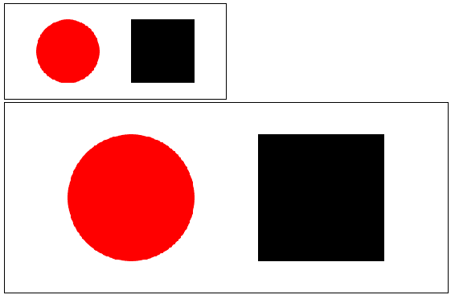
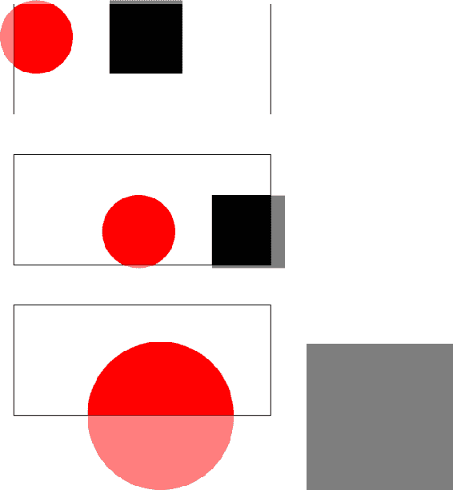
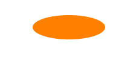
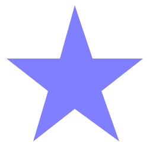
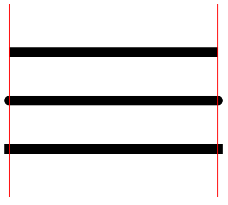
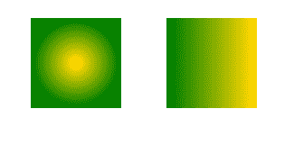
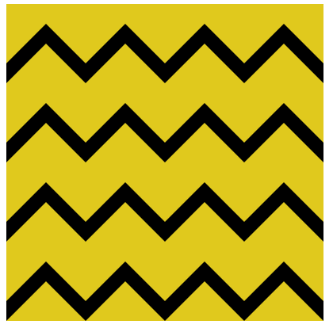
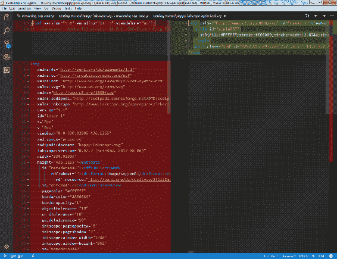

# 二、开始编写 SVG

既然已经初步了解了 SVG，现在是时候深入了解常见 SVG 元素及其用法了。 本章将关注最常见的 SVG 元素及其用法，涵盖一些您已经深入了解的元素，然后介绍许多其他元素，您将使用创建 SVG 图像。

本章将涵盖以下主题:

*   SVG 的基本形状
*   SVG 定位系统
*   梯度和模式
*   使用 SVG 图像生成的软件程序，如 Adobe Illustrator, Inkscape，和 Sketch

# 在 SVG 中定位

正如你在[第一章](01.html)，*介绍可缩放矢量图形*中看到的，SVG 元素使用坐标平面定位系统。 SVG 文档中的元素使用*x*和*y*坐标定位。 这应该是你从几何学课程中熟悉的，或者更具体地说，对于 web，如果你习惯使用 CSS，绝对定位元素。 下面的代码显示了两个不同的定位方案,您已经看到一个圆的元素,它使用`cx`、*中心(x)*,和`cy`、【t16.1】中心(y),`circle`元素属性将根据圆的中心和`rect`元素, 它将使用`x`和`y`属性将正方形的左上角放置在坐标平面上:

```html
     <svg  width="350" height="150"
       viewBox="0 0 350 150" version="1.1"> 
        <circle cx="100" cy="75" r="50" fill="rgba(255,0,0,1)"/> 
        <rect x="200" y="25" width="100" height="100" 
         fill="rga(0,0,255,1)"/> 
      </svg> 
```

在浏览器中呈现，它看起来是这样的:


除了使用两个 center 属性来放置基于其中心的元素*x*和*y*之外，这看起来应该与在 CSS 中定位元素一样。 有趣的是`height`和`width`的交集以及 SVG 元素本身上的`viewBox`属性的值。

# viewBox 和 SVG 中的 viewport

`height`和`width`属性定义 SVG 元素的*视口*。 可以用与浏览器中的视口相同的方式来考虑视口。 它定义了 SVG 文档的可见维度。 底层 SVG 文档的维度可以大于视口，并且与 HTML 一样，元素可以完全离开屏幕。 所有可见的东西都在视口的尺寸范围内。

如果您只设置 SVG 元素的`height`和`width`属性，而不使用`viewBox`属性，那么它的行为方式将与您使用 CSS 时所期望的方式相同。 在前面的示例中，视口坐标系统将以坐标`(0,0)`开始，以坐标`(350, 150)`结束。

Throughout this book, coordinates will be rendered as (`x` value, `y` value).

在这种情况下，每个用户单元将默认为屏幕上的一个像素。

`viewBox`属性允许您更改初始视口坐标系统。 通过重新定义坐标系统，您可以以有趣的方式移动和缩放底层 SVG 文档。 与其尝试*描述*什么是可能的，不如让我们看一些例子。

在我们到目前为止展示的每个示例中，我们都使用了`viewBox`属性，并将其设置为匹配视口的`height`和`width`属性的尺寸。 如果我们更改 SVG 元素的`height`和`width`属性而不更改`viewBox`以匹配，会发生什么情况? 添加第二个具有新的`height`属性且`width`等于原值两倍的 SVG 元素，创建图像的第二个版本，其大小为原来的两倍:

```html
     <svg  width="700" height="300" 
       viewBox="0 0 350 150" version="1.1"> 
        <circle cx="100" cy="75" r="50" fill="rgba(255,0,0,1)"/> 
        <rect x="200" y="25" width="100" height="100" 
         fill="rga(0,0,255,1)"/> 
      </svg> 
```

这是它在浏览器中的样子。 如您所见，视口被加倍了，但是由于`viewBox`具有相同的尺寸，所以`circle`和`rect`元素上完全相同的坐标将创建图像的放大版本。 在这种情况下，用户单位不再等同于一个像素，但 SVG 元素内的计算保持不变:



你可以把它放大到你喜欢的大小，它会渲染得很完美。

如果我们调整`viewBox`属性本身会发生什么? 属性的值代表什么?

`viewBox`属性包含四个参数:`min-x`、`min-y`、`width`和`height`。 `min-x`、`min-y`定义了`viewBox`的左上角。 现在，`width`和`height`决定了`viewBox`的宽度和高度。 使用这些值可以显示它们如何与视口的高度和宽度交互。 前两个例子改变了视口坐标系统的*x*和*y*位置。 第一个例子在正方向上将其偏移 20%(70 和 30 是 SVG 宽度和高度的 20%)。 第二个例子向负方向偏移 20%。 第三个例子改变了`viewBox `属性的宽度和高度，将其缩小了一半:

```html
<svg  width="350" height="150" viewBox="70 30 350 150" version="1.1"> <circle cx="100" cy="75" r="50"
  fill="rgba(255,0,0,1)"/> <rect x="200" y="25" width="100" 
  height="100" fill="rga(0,0,255,1)"/> </svg> 
<svg  width="350" height="150" 
 viewBox="-70 -30 350 150" version="1.1"> <circle cx="100" cy="75" 
 r="50" fill="rgba(255,0,0,1)"/> <rect x="200" y="25" width="100" height="100" fill="rga(0,0,255,1)"/> </svg> 
<svg  width="350" height="150" 
 viewBox="0 0 175 75" version="1.1"> <circle cx="100" cy="75" r="50"
 fill="rgba(255,0,0,1)"/> <rect x="200" y="25" width="100" height="100" 
 fill="rga(0,0,255,1)"/> </svg> 
```

呈现在浏览器中，您可以看到这些更改对`viewBox`属性的影响。 偏移量将圆和正方形移动到更靠近视口左上角的位置。 将`viewBox`属性的大小减半，并保持`rect`和`circle`的大小不变，有效地使呈现元素的大小翻倍。 viewport 保持相同的大小，因此`viewBox`属性和相关的用户单元放大 2 倍以适应。 它里面的所有元素都根据需要进行缩放:


下图显示了在更深一点的地方(黑色的轮廓覆盖代表了`viewBox`视口):



关于 SVG 中的定位还有更多内容需要学习，但是我们将在本书的其余部分中处理这些主题。

现在让我们更深入地了解组成 SVG 体验的其他一些元素。

# 引入路径

到目前为止，SVG 规范中最重要的元素是`path`元素。 `path`允许您使用由作为值传入`d`属性的一系列命令定义的向量绘制线条和形状。 还记得我提到过，采用 SVG 的最大障碍之一是缺乏友好的 API 吗? 这个`path`元素可能是整个规范中最大的痛处。 您可能在`d`属性中看到的值可能非常密集，难以读取。 读起来有多难? SVG logo 中的*S*元素:

```html
<path id="S" d="M 5.482,31.319 C2.163,28.001 0.109,23.419 0.109,18.358 C0.109,8.232 8.322,0.024 18.443,0.024 C28.569,0.024 36.782,8.232 36.782,18.358 L26.042,18.358 C26.042,14.164 22.638,10.765 18.443,10.765 C14.249,10.765 10.850,14.164 10.850,18.358 C10.850,20.453 11.701,22.351 13.070,23.721 L13.075,23.721 C14.450,25.101 15.595,25.500 18.443,25.952 L18.443,25.952 C23.509,26.479 28.091,28.006 31.409,31.324 L31.409,31.324 C34.728,34.643 36.782,39.225 36.782,44.286 C36.782,54.412 28.569,62.625 18.443,62.625 C8.322,62.625 0.109,54.412 0.109,44.286 L10.850,44.286 C10.850,48.480 14.249,51.884 18.443,51.884 C22.638,51.884 26.042,48.480 26.042,44.286 C26.042,42.191 25.191,40.298 23.821,38.923 L23.816,38.923 C22.441,37.548 20.468,37.074 18.443,36.697 L18.443,36.692 C13.533,35.939 8.800,34.638 5.482,31.319 L5.482,31.319 L5.482,31.319 Z"/> 
```

如果不知道发生了什么，就不可能解析，甚至不知道`d`属性的规则，很难跟踪。

让我们看一个更简单的示例，以便您能够理解语法。 在本文中，我们创建了一个程式化的字母 r。下面是如何阅读`d`属性的说明:

1.  (M)ove to point`(100,100)`。
2.  画一条(L)线到`(100,300)`。
3.  画一条(L)线到`(150,300)`。
4.  画一条(L)线到`(150,150)`。

5.  以`(250,150)`为第二个控制点，从当前点到`(150,175)`点绘制(S)平滑三次 Bézier 曲线。 控制点提供用于绘制曲线的方向信息。 这个版本的立方体 Bézier`curveto`指令实际上是一种速记，表示控制点被反映了出来。 在其他格式中，可以定义指向不同方向的多个控制点。 这将创建一个更复杂的曲线。
6.  画一条(L)线到`(200,300)`。
7.  画一条(L)线到`(250,300)`。
8.  画一条(L)线到`(225,225)`。
9.  以`(350,100)`为第二个控制点，从当前起始点到`(100,100)`点绘制(S)平滑三次 Bézier 曲线:

```html
<svg  width="500" height="500" viewBox="0 0 500 500" version="1.1"> 
        <path d="M100,100 L100,300 L150,300 L150,150 S250,150,175,200 L200,300 L250,300 L225,225 S350,100,100,100" stroke-width="1" stroke="#003366" fill="#cccccc"></path> 
</svg> 
```

在浏览器中呈现的这些命令会产生以下结果:


这组指令仍然很复杂，它甚至没有涉及`path`元素的所有可能选项。 好消息是，大多数情况下，当您使用 SVG 时，会生成这些复杂的`path`—为您(使用图形化 SVG 编辑器)或由您通过 JavaScript 生成。 所以，在现实中，你只需要能够理解说明和它们的用法。 你不需要坐在那里逐条解析这些数据。

# 更多关于基本形状的内容

现在您已经了解了`path`，让我们看看 SVG 领域中一些更直接的部分，并研究一些更基本的形状。 你已经学习了`circle`和`rect`。 让我们看一些更基本的形状。

# 行元素

`path`元素允许您使用一长串的指令来绘制任何您能想到的东西。 值得庆幸的是，有许多方便的元素定义了常见的形状，它们比`path`元素更容易使用。 您将学到的第一个元素是`line`元素。

下面的示例在`500`×`500`正方形上绘制网格。 这里使用的`line`元素有五个参数:`x1`、`y1`、`x2`、`y2`和一个`stroke`。 *x*和*y*坐标表示该线的起始点(`x1`，`y1`)和结束点(`x2`，`y2`)。 该 SVG 文档在`500`像素正方形的每边绘制一个网格`100`像素:

```html
    <svg version="1.1"  
        width="500" height="500" viewBox="500 500 0 0"> 
        <line stroke="#000000" x1="0" y1="0" x2="0" y2="500" /> 
        <line stroke="#000000" x1="100" y1="0" x2="100" y2="500" /> 
        <line stroke="#000000" x1="200" y1="0" x2="200" y2="500" /> 
        <line stroke="#000000" x1="300" y1="0" x2="300" y2="500" /> 
        <line stroke="#000000" x1="400" y1="0" x2="400" y2="500" /> 
        <line stroke="#000000" x1="500" y1="0" x2="500" y2="500" /> 
        <line stroke="#000000" x1="0" y1="0" x2="500" y2="0" /> 
        <line stroke="#000000" x1="0" y1="100" x2="500" y2="100" /> 
        <line stroke="#000000" x1="0" y1="200" x2="500" y2="200" /> 
        <line stroke="#000000" x1="0" y1="300" x2="500" y2="300" /> 
        <line stroke="#000000" x1="0" y1="400" x2="500" y2="400" /> 
        <line stroke="#000000" x1="0" y1="500" x2="500" y2="500" /> 
      </svg> 
```

在浏览器中呈现的前一个标记生成以下网格:


另外，生成这样的网格对于生成和调试 SVG 文档很有帮助。 使用网格上更细粒度的网格，您可以更容易地确定在屏幕上计算或手动生成的位置。

# 椭圆元素

`ellipse`和`circle`一样，只是它有*两个半径*参数，*x*和*y*半径分别为`rx`和`ry`。 这个额外的半径参数是必需的，否则，我们将只是画一个标准圆:

```html
      <svg width="250" height="100" viewBox="0 0 250 100" 
         > 
        <ellipse cx="125" cy="50" rx="75" ry="25" 
         fill="rgba(255,127,0,1)"/> 
      </svg> 
```

下面是这个简单的标记的输出:



# 多边形元素

元素创建由多条直线组成的封闭式形状，这些直线从初始的`x,y`坐标开始，以坐标平面上的最后一个点结束。 `points`属性接受坐标计划上定义`polygon`元素的点列表。 元素的最后一个点自动连接到第一个点。 下面的代码示例绘制了一个星星:

```html
<svg width="240" height="240" viewBox="0 0 240 240" 
  > 
        <polygon points="95,95 120,5 150,95 235,95 165,150 195,235
         120,180 50,235 75,150 5,95" fill="rgba(0,0,255,1)"></polygon> 
</svg> 
```

下面显示了前面的 SVG 元素的输出:



With `polygon` and `polyline`, it's just a suggestion, but not a requirement to separate the `x,y` pairs with commas.

下面的代码在编程上与前面的示例相同(尽管更难读懂)。 它呈现完全相同的形状:

```html
<svg width="240" height="240" viewBox="0 0 240 240" 
  > 
   <polygon points="95 95 120 5 150 95 235 95 165 150 195 235 120 
     180 50 235 75 150 5 95" fill="rgba(0,0,255,1)"></polygon> 
 </svg> 
```

# 多段线元素

元素创建由多条直线组成的*开放式*形状。 `points`属性接受坐标计划上的`x,y`点的列表来定义`polyline`。 下面的代码示例跟踪夜空中龙星座的图案:

```html
<svg width="800" height="600" viewBox="0 0 400 300" 
   > 
   <polyline points="360,60 330,90 295,160 230,220 190,217
    175,180 155,130 155,60 135,30 100,25 90,55 65,170 80,195 
    65,220 35,210 65,170" fill="none" stroke="white" stroke-width="3"> 
    </polyline> 
</svg> 
```

在浏览器中运行，前面的例子是这样的:


# 更多关于填充和笔画

你已经在大多数例子中看到了它们的使用，现在让我们更全面地看看填充和笔画。 这些表示属性对 SVG 很重要，特别是在动态使用它们时，因为与编写动态 CSS 相比，直接操作元素要容易得多。

`fill`和`stroke`合称为`paint`属性。 `fill`设置对象的内部颜色，`stroke`设置对象周围线条的颜色。 正如您已经看到的，它们可以接受任何有效的 CSS 颜色值。 他们也可以接受【病人】油漆服务器元素引用(`hatch`,`linearGradient`,`meshgradient`、【显示】,`radialGradient`和`solidcolor`),这些元素定义了一个绘画风格的元素。 您已经看到了其中的一个(`linearGradient`)，并将很快了解更常用的支持。 但是，在此之前，应该看看一些特定于笔画的属性，它们控制线条的显示方式和组合方式。

# stroke-dasharray

属性定义一个由逗号和/或空格分隔的长度或百分比组成的列表，该列表指定用于描线的破折号和空白的交替模式。 下面的示例展示了几个不同的示例。 第一个是一系列 10 个像素的开启和 5 个像素的关闭。 第二个示例根据斐波那契序列打开和关闭像素。 第三个序列根据一系列质数打开和关闭像素:

```html
<svg width="400" height="300" viewBox="0 0 400 300" 
  > 
  <rect x="50" y="20" width="300" height="50" fill="none" 
    stroke="#000000" stroke-width="4"  stroke-dasharray="10 5"></rect> 
  <rect x="50" y="80" width="300" height="50" fill="none" 
   stroke="#000000" stroke-width="4"  stroke-dasharray="1, 2, 3, 5, 8, 
    13"></rect> 
  <rect x="50" y="140" width="300" height="50" fill="none" 
    stroke="#000000" stroke-width="4"  stroke-dasharray="2, 3, 5, 7, 
     11, 13, 17, 19"></rect> 
 </svg> 

```

前面的代码在浏览器中呈现，生成以下示例:


If an odd number of values are provided as the value of the attribute then the list is repeated in order to yield an even number of values. This may not result in a pattern you expect as values might shift from dashes to spaces and create an unexpected result. In the following example the single value of `10` produces `10` on and `10` off, which is probably what you envisioned. The `"15,10,5"` pattern, on the other hand, produces `15` on, `10` off, `5` on, `15` off, `10` on, and `5` off. If you expect the pattern to *always* have `15` as an `"on"` then this might come as a surprise.

```html
 <svg width="400" height="300" viewBox="0 0 400 300"
    > 
    <rect x="50" y="20" width="300" height="50" fill="none" 
     stroke="#000000" stroke-width="4"  stroke-dasharray="10"> 
    </rect> 
    <rect x="50" y="80" width="300" height="50" fill="none" 
      stroke="#000000" stroke-width="4"  stroke-dasharray="15,10,5">
    </rect> 
  </svg> 
```

您可以在浏览器中看到这一点。 这可能是你想要的样子，但如果不是，现在你知道为什么了:


# stroke-dashoffset

属性接受正或负的长度或百分比值，并指定进入破折号模式的距离，以便开始呈现破折号。 这个偏移量可以在下面的代码示例中看到:

```html
<svg width="400" height="300" viewBox="0 0 400 300"  
 >
 <rect x="50" y="20" width="300" height="50" fill="none"
  stroke="#000000" stroke-width="4" stroke-dasharray="10 10"></rect>
 <rect x="50" y="80" width="300" height="50" fill="none"
  stroke="#000000" stroke-width="4" stroke-dasharray="10 10" stroke- 
  dashoffset="25"></rect>
 <rect x="50" y="140" width="300" height="50" fill="none"
  stroke="#000000" stroke-width="4" stroke-dasharray="10 10" stroke-
  dashoffset="-25"></rect>
</svg>
```

这个属性的效果可以在下面的截图中看到:


# stroke-linecap

属性指示要在开放行末尾呈现的形状。 选项为`butt`、`round`、`square`和`inherit`。 下面的代码示例展示了不同的呈现选项。 这两条红线是用来表示`butt`和`square`的区别。 `butt`结束`stroke`flush with the end of the line。 `square`帽延伸到线的末端，包括`stroke`的厚度:

```html
<svg  width="500" height="400"
   viewBox="0 0 500 400" version="1.1"> 
 <line fill="none" stroke-width="20" stroke="#000000" x1="20" y1="100" 
    x2="450" y2="100" stroke-linecap="butt" /> 
 <line fill="none" stroke-width="20" stroke="#000000" x1="20" y1="200"
    x2="450" y2="200" stroke-linecap="round" /> 
 <line fill="none" stroke-width="20" stroke="#000000" x1="20" y1="300"
    x2="450" y2="300" stroke-linecap="square" /> 
 <line fill="none" stroke-width="2" stroke="rgba(255,0,0,1)" x1="20" 
    y1="0" x2="20" y2="400" /> 
 <line fill="none" stroke-width="2" stroke="rgba(255,0,0,1)" x1="450" 
    y1="0" x2="450" y2="400" /> 
</svg> 
```

结果如下图所示:



# stroke-linejoin

`stroke-linejoin`属性定义了`path`的角和基本形状的渲染方式。 可能的值为`miter`、`round`、`bevel`和`inherit`。 `Round`呈现平滑的弯角，`miter`产生棱角只有一个角的尖锐边缘，`bevel`在角上添加一个新的角，创建复合角:

```html
  <svg width="400" height="300" viewBox="0 0 400 300" 
    > 
  <rect x="50" y="20" width="300" height="50" fill="none" 
    stroke="#000000" stroke-width="20"  stroke-linejoin="miter"></rect> 
  <rect x="50" y="100" width="300" height="50" fill="none" 
     stroke="#000000" stroke-width="20"   stroke-linejoin="bevel">  
  </rect> 
  <rect x="50" y="180" width="300" height="50" fill="none" 
     stroke="#000000" stroke-width="20"  stroke-linejoin="round">
   </rect> 
 </svg> 
```

这些选项可以在下面的截图中看到:


# stroke-opacity

`stroke-opacity`属性执行您可能期望的操作。 它设置一个描边对象的不透明度。 下面的示例在三个独立的矩形上设置了三种不同的不透明度。 你可以看到`stroke`不仅与页面的背景交互，而且与矩形的填充交互，因为`stroke`位于矩形边缘的中心，并且它的一部分覆盖了填充区域:

There is no easy way to change the positioning of the `stroke` attribute on an SVG element. In graphics programs, it's possible to set the `stroke` attribute to be on the inside of the box, centered on the edge of the box (which is how SVG does it) and outside the box. There is a proposal in the new SVG strokes ([https://www.w3.org/TR/svg-strokes/](https://www.w3.org/TR/svg-strokes/)) specification to change the alignment of `stroke` (called stroke-alignment) but there isn't anything in the browser at the present time.

```html
<svg width="400" height="300" viewBox="0 0 400 300" 
  >
 <rect x="50" y="20" width="300" height="50" fill="none"
  stroke="#000000" stroke-width="20" stroke-opacity=".25"></rect>
 <rect x="50" y="100" width="300" height="50" fill="none"
  stroke="#000000" stroke-width="20" stroke-opacity=".5"></rect>
 <rect x="50" y="180" width="300" height="50" fill="none"
  stroke="#000000" stroke-width="20" stroke-opacity="1"></rect>
</svg>
```

上述代码的输出如下截图所示:


既然我们已经了解了`stroke`s 的不同选项，现在是时候看看填充的其他一些选项了。 这些就是我们之前提到的绘制服务器元素。 你已经遇到其中一个了，`linearGradient`。 您还将了解另外两个常用的单词`radialGradient`和`pattern`。

# linearGradient 和 radialGradient

你已经在[第一章](01.html)、*介绍可伸缩矢量图形*中看到了`linearGradient`元素。 还有`radialGradient`的工作方式基本相同，除了它呈现围绕中心点辐射的梯度。 这两个元素都被添加到`defs`节中，每个元素都有一系列的`stop`s，其中`offset`s 和`stop-color`s 定义梯度。

然后它们被其`id`属性引用，作为`rect`的`fill`属性的参数:

```html
<svg width="400" height="300" viewBox="0 0 400 300"  
 >
    <defs>
        <linearGradient id="linear">
            <stop offset="5%" stop-color="green"/>
            <stop offset="95%" stop-color="gold"/>
        </linearGradient>
        <radialGradient id="radial">
            <stop offset="10%" stop-color="gold"/>
            <stop offset="95%" stop-color="green"/>
        </radialGradient>
    </defs>
    <rect x="50" y="20" width="100" height="100" fill="url(#radial)">
    </rect>
    <rect x="200" y="20" width="100" height="100" fill="url(#linear)"> 
    </rect>
</svg>
```

这会产生以下输出:

****

# 图案元素

我们要看的最后一个油漆服务器是`pattern`元素。 `pattern`允许您定义一个小的图形元素，您可以将其引用为`fill`或`stroke`，并将其平铺在重复模式中的一个元素上。 在本例中，我们使用了一个带有单个子元素`polygon`的`pattern`元素，该元素定义了两条对角线，这两条对角线组合起来创建一个长模式:

```html
<svg width="400" height="400" viewBox="0 0 400 400" 
 >
    <pattern id="pattern-example" width="100" height="100"
      patternUnits="userSpaceOnUse">
    <polygon points="0,50 0,100 50,50 100,100 100,75 50,25 0,75" 
      fill="#000000"></polygon>
    </pattern>
    <rect x="0" y="0" width="400" height="400" fill="url(#pattern-
     example)"></rect>
</svg>
```

在浏览器中呈现出来，这会创建以下锯齿状模式:



# 编写程序

书中到目前为止的所有例子都是手工生成的。 在实践中，您将在本书中了解到，SVG 通常是由软件生成的。 本书的大部分内容将介绍如何使用基于 web 的工具和库创建和操作 SVG，但是也可以通过桌面绘图应用程序生成 SVG 图像。 在网络上工作时,您通常会使用 SVG 图像已经被设计师创建应用程序,比如 Inkscape (https://inkscape.org/en/),Adobe Illustrator (https://www.adobe.com/products/illustrator.html),或草图(https://www.sketchapp.com/)。 这些应用程序非常棒，因为它们允许非技术设计人员使用 SVG 使用高级绘图工具创建图像。

虽然这不是本书其余部分的要求，但我建议您使用一些可以用于以这种方式编写 SVG 的东西。 虽然您希望了解如何在动态的、基于 web 的环境中使用 SVG，但如果可以选择使用高级绘图工具来更新和操作 SVG 元素，那就太好了。 多年来，我一直使用 Adobe Illustrator 和 Inkscape，很多人都喜欢 Sketch，所以这是三个开始的选择。 刚开始的时候，我建议先看看 Inkscape。 Inkscape 是在 GNU 许可下发布的免费开源软件，从特性的角度来看，它非常可靠，所以它是一个很好的默认选择。

无论您选择什么应用程序(即使您没有选择一个应用程序，而只是继承其中的 SVG 图像)，都应该知道这些应用程序有一些缺点。 这些应用程序是为创作体验而设计的，并不是为了制作网页而优化的 SVG 图像，所以当将图形程序创建的 SVG 图像导入网页项目时，记住这一点很重要。 在本书后面的部分，您将了解关于优化 SVG 图像的更多内容，但是您应该从一开始就知道要面对的是什么。

看看下面的截图。 它显示了渲染完全相同图像的两个文件之间的差异。 左边的是 Inkscape 输出的 SVG 源文件。 右侧为优化后的文件。 正如您所看到的，在 Inkscape 文件中有很多额外的数据。 这些数据是应用程序所需要的，但在网络上是不需要的，所以删除它可以让我们大幅削减文件:



您将在[第 11 章](11.html)、*中了解清理 SVG 文件的工具*。

# 总结

在本章中，您了解了 SVG 的多个特性。 您了解了`path`，它允许您使用线条和曲线绘制复杂的图形。 您还了解了一些基本的绘图工具，这些工具允许您绘制线条、椭圆、多边形和折线。 此外，您还了解了一些笔画和填充选项。

最后，您了解了一些使用软件绘制静态 SVG 的选项，并了解了一些这样做的潜在缺点。

在[第 3 章](03.html)、*深入研究 SVG 创作*中，您将继续学习 SVG 创作，添加到您已经体验过的越来越多的工具列表中，并允许您创建更复杂的 SVG 图像。