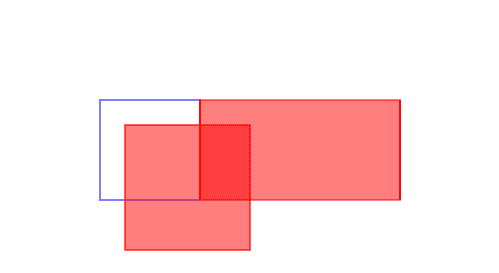
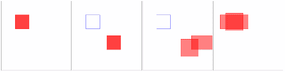
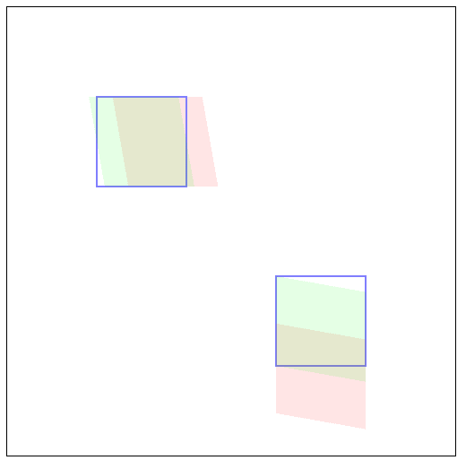
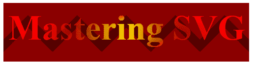
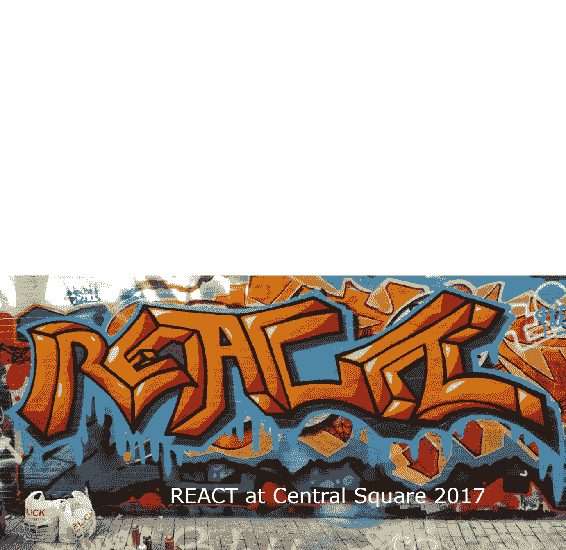

# 深入研究 SVG 创作

到目前为止，在本书中，您已经了解了大部分基本 SVG 特性和元素。 仅使用到目前为止所使用的工具，您就可以开始使用 SVG 执行一些实际任务。 也就是说，SVG 提供了更多的东西。 本章将开始介绍更高级的 SVG 工具。 其中一些技术将在实现动态 SVG 动画和可视化方面发挥重要作用。

本章将涵盖以下主题:

*   转换
*   剪裁和屏蔽
*   将内容导入 SVG
*   过滤效果
*   在 web 上提供 SVG 服务

所有这些，加上您已经了解的工具，将为您提供坚实的 SVG 基础。

# 转换

SVG 中的转换允许您以多种方式操作 SVG 元素，包括缩放、旋转、倾斜和转换(这看起来像移动元素，但并不完全是那样)。 使用转换允许您操作 SVG 而不改变其固有值(例如，高度、宽度、*x*和*y*)，这在以动态方式操作元素时非常重要。

本节将逐个向您介绍常用的转换函数，并提供每个函数的示例。

# 翻译

`translate`转换通过指定的`x`和`y`坐标移动 SVG 元素。 平移会改变元素坐标系统的*原点*。

`y`坐标是一个可选参数，如果没有提供`x`参数，则假定它等价于`x`参数。

下面的示例显示了三个等价的圆。 第一个圆没有以任何方式变换。 第二个参数使用单个参数(`10`)进行转换，该参数在`x`轴上移动`10`，在`y`轴上移动`10`。 第三种是`x`平面上的`"75"`像素和`y`平面上的`0`像素。 在每种情况下，底层元素具有相同的度量，但它们的显示方式不同。

你可能会问，为什么不只是移动元素。 首先，这在动态 SVG 中非常有用，因为在移动元素时，您不必跟踪元素的原始位置。 您可以通过删除转换简单地将元素重置为其原始状态:

```html
<svg  width="350" height="150"
  viewBox="0 0 350 150" version="1.1">
    <circle cx="100" cy="75" r="50" fill="rgba(255,0,0,.5)"/>
    <circle cx="100" cy="75" r="50" fill="rgba(255,0,0,.5)" 
     transform="translate(10)" />
    <circle cx="100" cy="75" r="50" fill="rgba(255,0,0,.5)"
     transform="translate(75,0)" />
</svg>
```

你可以在下面的截图中看到输出:


# 规模

`scale`转换按指定的`x`和`y`坐标缩放 SVG 元素。 该单元是一个**因子**，因此传入两个将*使*元素的大小加倍。

与`translate`一样，`y`坐标是可选的，如果没有提供`x`参数，则假定它等价于`x`参数。

如果您已经完成了 CSS 转换并缩放了一个元素，您可能会对`scale`的工作方式感到惊讶。 即使您没有做过 CSS，您也可能会感到惊讶。

SVG 中的缩放是从坐标系的*原点*开始的。 参见下面的示例，其中显示了三个独立的框。 1 完全没有缩放。 接下来的两个矩形在两个轴上用`1.25`缩放，然后在*x*轴上用`2`缩放，然后在*y*轴上不缩放:

```html
<svg  width="500" height="500"
 viewBox="0 0 500 500" version="1.1">
    <rect x="100" y="100" width="100" height="100" stroke="blue"
     fill="none"></rect>
    <rect x="100" y="100" width="100" height="100" stroke="red"
     fill="rgba(255,0,0,.5)" transform="scale(1.25)"></rect>
    <rect x="100" y="100" width="100" height="100" stroke="red" 
     fill="rgba(255,0,0,.5)" transform="scale(2,1)"></rect>
</svg>
```

正如你在下面的截图中看到的，结果是不仅元素的尺寸被缩放了，从坐标系统原点的距离也被缩放了。 第一个元素沿着`x`和`y`平面在两个方向上进行调整。 第二个元素沿着`x`轴向右移动:



将其与下面的代码进行比较，下面的代码展示了 CSS 缩放的工作方式。 在 CSS 中使用相同的比例因子会产生完全不同的结果。 CSS 不是从 SVG 文档的原点扩展，而是从元素本身的中心点扩展。 语法可能看起来相似，但结果是不同的:

```html
<head>
<style type="text/css">
    div {
        position: absolute;
        left: 100px;
        top: 100px;
        width: 100px;
        height: 100px;
        border: 1px solid blue;
    }
    .scale-1-25 {
        transform: scale(1.25);
        border: 1px solid red;
        background: rgba(255,0,0,.5);
    }
    .scale-2-by-1 {
        transform: scale(2,1);
        border: 1px solid red;
        background: rgba(255,0,0,.5);
    }
</style>
</head>
<body>
    <div></div>
    <div class="scale-1-25"></div>
    <div class="scale-2-by-1"></div>
</body>
```

结果如下图所示:


如果您想用 SVG 产生类似的效果，可以使用一个有趣的技巧。 这个技巧对于说明`transform`属性可以接受多个转换函数的方式也很有用。 你不局限于一个人。

那么，它是如何工作的呢? 如前所述，CSS 转换的起始点是被转换的框的*中心。 这种技术在 SVG 中复制了相同的原点。*

要做到这一点，您需要使用一个技巧，将元素的原点移动到与 CSS 原点匹配的新原点。 这是如何工作的。 在本例中，我们的矩形位于坐标系统中的`(100, 100)`处，并且是一侧的`100`像素。 因此，盒子的中心在`(150, 150)`处。 通过`(150,150)`转换元素将这些元素的起始点设置为等同于 CSS 起始点的值。 记住，CSS 的起始点是框的中心(在转换之前是`(150,150)`)，而转换元素*实际上会改变*的起始点。

在平移之后，我们应用比例。 这发生在新的起始点`(150, 150)`(同样，等同于 CSS 的起始点)，并将正方形分别扩大`1.25`和`2`。 最后,我们变换元素*回其原始*【显示】`(0,0)`原点,因为他们操纵的 CSS 等价点起源`(150, 150)`,现在的扩展元素集中适当:**

```html
<svg  width="500" height="500"
  viewBox="0 0 500 500" version="1.1">
    <rect x="100" y="100" width="100" height="100" stroke="red"
     fill="rgba(255,0,0,.5)"></rect>
    <rect x="100" y="100" width="100" height="100" stroke="red" 
     fill="rgba(255,0,0,.5)" transform="translate(150 150) scale(1.25)
      translate(-150 -150)"></rect>
    <rect x="100" y="100" width="100" height="100" stroke="red" 
     fill="rgba(255,0,0,.5)" transform="translate(150 150) scale(2,1) 
     translate(-150 -150)"></rect>
</svg>
```

下面的插图展示了它是如何一步步工作的:

1.  第一帧显示起始位置。 将`100`像素矩形置于`(100,100)`，其原点为`(0,0)`。
2.  然后由`(150,150)`翻译。
3.  然后从新的起始点`(150,150)`，分别由`1.25`和`(2,1)`转化。

4.  它们被转换回`(0,0)`，同时仍然保持新的规模。 它们在这一点上的实际原点是`(0,0)`，但它呈现出好像它有 CSS 的原点`(150,150)`:



# 旋转

`rotate`变换将元素旋转若干度。 这个转换有三个参数。 第一个是度数。 第二个和第三个参数是定义旋转起始点的`x`和`y`坐标。 如果元素没有原点，则使用视口的原点。 在下面两个代码示例中可以看到这一点，其中在 SVG 元素上绘制了 9 个矩形。 第一个没有改变。 接下来的 8 个将每个递增旋转 10 度:

```html
<svg  width="700" height="700" 
  viewBox="0 0 700 700" version="1.1">
    <rect x="600" y="0" width="100" height="100" 
     fill="rgba(255,0,0,.5)"/>
    <rect x="600" y="0" width="100" height="100" 
      fill="rgba(255,0,0,.5)" transform="rotate(10)"/>
    <rect x="600" y="0" width="100" height="100" 
     fill="rgba(255,0,0,.5)" transform="rotate(20)"/>
    <rect x="600" y="0" width="100" height="100" 
     fill="rgba(255,0,0,.5)" transform="rotate(30)"/>
    <rect x="600" y="0" width="100" height="100" 
     fill="rgba(255,0,0,.5)" transform="rotate(40)"/>
    <rect x="600" y="0" width="100" height="100" 
     fill="rgba(255,0,0,.5)" transform="rotate(50)"/>
    <rect x="600" y="0" width="100" height="100" 
     fill="rgba(255,0,0,.5)" transform="rotate(60)"/>
    <rect x="600" y="0" width="100" height="100"
      fill="rgba(255,0,0,.5)" transform="rotate(70)"/>
    <rect x="600" y="0" width="100" height="100" 
     fill="rgba(255,0,0,.5)" transform="rotate(80)"/>
</svg>
```

正如你在下面渲染代码的截图中看到的，它们`arc`穿过整个画布，在旋转起始处的视口`(0,0)`点:


将其与下图进行比较，下图将旋转点沿`x`轴和`y`轴移动到视口的中部:

```html
<svg  width="700" height="700" viewBox="0 0 700 700" version="1.1">
    <rect x="600" y="0" width="100" height="100" 
      fill="rgba(255,0,0,.5)"/>
    <rect x="600" y="0" width="100" height="100" 
     fill="rgba(255,0,0,.5)" transform="rotate(10 350 0)"/>
    <rect x="600" y="0" width="100" height="100"  
     fill="rgba(255,0,0,.5)" transform="rotate(20 350 0)"/>
    <rect x="600" y="0" width="100" height="100" 
     fill="rgba(255,0,0,.5)" transform="rotate(30 350 0)"/>
    <rect x="600" y="0" width="100" height="100" 
     fill="rgba(255,0,0,.5)" transform="rotate(40 350 0)"/>
    <rect x="600" y="0" width="100" height="100" 
     fill="rgba(255,0,0,.5)" transform="rotate(50 350 0)"/>
    <rect x="600" y="0" width="100" height="100" 
     fill="rgba(255,0,0,.5)" transform="rotate(60 350 0)"/>
    <rect x="600" y="0" width="100" height="100" 
     fill="rgba(255,0,0,.5)" transform="rotate(70 350 0)"/>
    <rect x="600" y="0" width="100" height="100" 
     fill="rgba(255,0,0,.5)" transform="rotate(80 350 0)"/>
</svg>
```

如您所见，当这段代码在浏览器中呈现时，具有相同旋转角度`arc`的相同元素横过视口的右上方四分之一。 *正方形从新的原点向外辐射*:


与缩放一样，如果您想围绕元素的中心点旋转，您可以使用在该部分中学到的相同的转换技巧。 在下面的代码示例中，矩形被等效于其中心点`(100,100)`平移，旋转`10`度，然后平移回其原来的原点:

```html
<svg  width="400" height="400" viewBox="0 0 200 200" version="1.1">
    <rect x="50" y="50" width="100" height="100" 
    fill="rgba(255,0,0,.2)" transform="translate(100,100) rotate(10) translate(-100,-100)"/>
    <rect x="50" y="50" width="100" height="100" 
    fill="rgba(255,0,0,.2)" transform="translate(100,100) rotate(20) 
    translate(-100,-100)"/>
    <rect x="50" y="50" width="100" height="100" 
    fill="rgba(255,0,0,.2)" transform="translate(100,100) rotate(30)
     translate(-100,-100)"/>
    <rect x="50" y="50" width="100" height="100" 
    fill="rgba(255,0,0,.2)" transform="translate(100,100) rotate(40) 
    translate(-100,-100)"/>
    <rect x="50" y="50" width="100" height="100"
     fill="rgba(255,0,0,.2)" transform="translate(100,100) rotate(50) 
     translate(-100,-100)"/>
    <rect x="50" y="50" width="100" height="100" 
     fill="rgba(255,0,0,.2)" transform="translate(100,100) rotate(60)
     translate(-100,-100)"/>
    <rect x="50" y="50" width="100" height="100"
     fill="rgba(255,0,0,.2)" transform="translate(100,100) rotate(70) 
      translate(-100,-100)"/>
    <rect x="50" y="50" width="100" height="100" 
    fill="rgba(255,0,0,.2)" transform="translate(100,100) rotate(80)
     translate(-100,-100)"/>
    <rect x="50" y="50" width="100" height="100" 
    fill="rgba(255,0,0,.2)" transform="translate(100,100) rotate(90) 
    translate(-100,-100)"/>
</svg>
```

这会产生以下输出:


# 斜

`skew`变换使元素沿指定轴倾斜一个角度。 与`rotate`、`scale`一样，`skew`以当前起始点为基础。 下面的代码示例显示了两组元素。 一个沿着`x`轴倾斜。 另一个沿`y`轴倾斜。 对于每一组元素，都有一个转换只关注`skew`，然后有另一个同样数量的`skew`转换，也包括转换技术:

```html
<svg  width="500" height="500" viewBox="0 0 500 500" version="1.1">
    <rect x="100" y="100" width="100" height="100"
     fill="rgba(255,0,0,.1)" transform="skewX(10)"/>
    <rect x="100" y="100" width="100" height="100" stroke="blue"
     fill="none"/>
    <rect x="100" y="100" width="100" height="100" 
    fill="rgba(0,255,0,.1)" transform="translate(150,150) skewX(10) 
    translate(-150,-150)"/>
    <rect x="300" y="300" width="100" height="100" stroke="blue" 
    fill="none"/>
    <rect x="300" y="300" width="100" height="100" 
     fill="rgba(255,0,0,.1)" transform="skewY(10)"/>
    <rect x="300" y="300" width="100" height="100" 
    fill="rgba(0,255,0,.1)" transform="translate(300,300) skewY(10)
     translate(-300,-300)"/>
</svg>
```

您可以在下面的屏幕截图中看到该代码的输出。 蓝色方块显示了原始位置，然后两个倾斜元素排列在它的顶部，以显示基于原始原点的倾斜和使用平移技术将原点更改为元素的中心之间的差异:



There is another option to transform elements. You can use what's called a *transformation matrix*. Matrix transformations are powerful (they can represent any of the other transformation functions) but also complicated and they rely heavily on math. Since not everyone thinks math is fun, matrix transformations aren't as common as the other transformation functions. For that reason, I'm not going to cover them here. Realistically, you can do anything you need to do with the ones you've already learned.

# 剪裁和屏蔽

剪切和屏蔽允许您减去 SVG 文档中的元素部分。

使用`clipPath`元素实现的剪切路径，使用路径、文本元素和基本形状的任意组合来作为简单蒙版的轮廓。 这意味着`clipPath`元素轮廓内部的一切都是可见的，而外部的一切都是裁剪出来的。 `clipPath`中的每个像素要么打开要么关闭。

蒙版使用`mask`元素实现，可以包含图形、文本和基本形状，用作半透明蒙版。 使用蒙版，每个像素值表示不透明度的程度，可以从完全透明到完全不透明。

# 剪裁

SVG 中的`clipPath`元素允许您从另一个形状中切割出一个形状。 剪切使用形状的几何形状来定义被剪切的区域。 它只考虑形状，因此`stroke`和`fill`等属性不会改变被切割的区域。

下面的代码示例展示了使用`clipPath`元素的一个非常简单但非常有用的模式。 基本的效果是减少一半的一个复杂的元素(明星我们画在第二章,*开始使用编写 SVG)为了把它的另一个实例的星创建平分星设计红色和黑色。 虽然您可以创建星形的两个半部分并将它们彼此放在一起，但混合和匹配相同元素的实例要灵活得多。*

 *让我们看看这是如何工作的。

首先，在`defs`部分中，我们创建`clipPath`元素本身。 `clipPath`的任何子元素将被捆绑在一起，以创建我们稍后将使用的剪切模式。 在本例中，它是一个简单的矩形，覆盖了画布的一半。 其 ID 为`"box"`。 接下来，我们创建了在[第二章](02.html)、*中创建的可重用的星星实例*。 我们给它一个 ID`"star"`。 在`defs`部分之外，我们把所有内容放在一起。 有了`use`元素的两个实例(它允许您交换在其他地方定义的元素)，我们链接到星星的`polygon`并将其插入两次到文档中，一次用红色填充，一次用黑色填充。 注意，user 元素使用片段标识符来引用多边形。 `"#star"`是指向本页上特定`id`的有效的、相对的 URL。 第二个变体有一个`clip-path`属性，链接到我们的方框`clipPath`:

```html
<svg  width="240" height="240" viewBox="0 0 240 240" version="1.1">
    <defs>
        <clipPath id="box" maskUnits="userSpaceOnUse" x="0" y="0"
         width="240" height="240">
            <rect x="120" y="0" width="240" height="240" fill="red" >
            </rect>
        </clipPath>
        <polygon id="star" points="95,95 120,5 150,95 235,95 165,150 
           195,235 120,180 50,235 75,150 5,95"></polygon>
    </defs>
    <use href="#star" fill="red"></use>
    <use href="#star" fill="black" clip-path="url(#box)"></use>
</svg>
```

下面的屏幕截图显示了该代码的输出。 红色的星星实例被暴露为黑色星星的左半边，它被`clipPath`元素中定义的方形剪裁掉:


# 屏蔽

掩蔽与剪切不同，它考虑的是被剪切元素的简单形状之外的属性。 如前所述，您利用了透明、半透明或完全不透明像素的全部范围。 这会产生有趣的效果。

下面的示例说明如何同时使用多个掩码。 在本例中，我们大量使用了`defs`部分，然后使用不同的可重用元素组成一个图像。

首先，我们创建两个渐变。 一种是线性渐变，有五个步骤，大部分是黑色的，这在渐变中间创造了一个非常强烈的白色带。 第二种是径向渐变，它的中心区域是黑色，周围环绕着一个很大的白色圆圈。 使用这些作为遮罩意味着这些渐变中的每个像素都落在一个连续统一体上，从完全不透明(黑色像素)到完全透明(白色像素)，中间是可变的透明度。

看看这些渐变本身:


然后我们创建一个表示掌握 SVG 的`text`元素，并引入一个`pattern`元素，您将从[第 2 章](02.html)、*开始编写 SVG*中认识这个元素。

在 SVG 元素的主体,我们的链接文本元素,使用片段标识符(`#mastering-SVG`)指向`text`元素的 id 在`defs`部分,并应用这两个面具用`url`的`mask`属性值指向的片段标识符`mask`属性。 看看蒙版是如何影响文本元素本身的:


把它们放在一起，我们把两个文本元素堆叠在一起，并在文本框后面添加一个有图案的框:

```html
<svg  width="500" height="120" viewBox="0 0 500 120" version="1.1">
    <defs>
        <linearGradient id="gradient">
            <stop offset="0" stop-color="black" stop-opacity="1" />
            <stop offset=".25" stop-color="black" stop-opacity="1" />
            <stop offset=".5" stop-color="white" stop-opacity="1" />
            <stop offset=".75" stop-color="black" stop-opacity="1" />
            <stop offset="1" stop-color="black" stop-opacity="1" />
        </linearGradient>
        <radialGradient id="highlight-gradient">
            <stop offset=".25" stop-color="black" stop-opacity="1" />
            <stop offset=".75" stop-color="white" stop-opacity="1" />
        </radialGradient>
        <mask id="gradient-mask" maskUnits="userSpaceOnUse" x="0" y="0"
         width="500" height="240">
            <rect y="0" x="0" width="500" height="120" 
             fill="url(#gradient)"></rect>
        </mask>
        <mask id="highlight-mask" maskUnits="userSpaceOnUse" x="0" 
         y="0" width="500" height="240">
            <rect y="0" x="0" width="500" height="120" 
             fill="url(#highlight-gradient)"></rect>
        </mask>
        <text id="mastering-SVG" x="10" y="75" font-size="72" text-
         anchor="left" font-weight="bold">
            Mastering SVG
        </text>
        <pattern id="pattern-example" width="100" height="100" 
         patternUnits="userSpaceOnUse">
            <rect width="100" height="100" fill="darkred" x="0" y="0">
            </rect>
            <polygon points="0,50 0,100 50,50 100,100 100,75 50,25 
              0,75" fill="rgb(83,1,1)">               
            </polygon>
        </pattern>
    </defs>
    <rect x="0" y="0" width="500" height="120" fill="url(#pattern-
      example)"></rect>
    <use href="#mastering-SVG" fill="gold" mask="url(#gradient-mask)" 
     x="120"></use>
    <use href="#mastering-SVG" fill="red" mask="url(#highlight-mask)"></use>
</svg>
```

在浏览器中运行它会产生以下输出。 如您所见，两个文本元素中可见的黄色区域和红色区域混合在一起。 中间有完全不透明颜色的区域，边缘与半透明颜色的区域混合，其中背景图案通过，在中间:

 **** 

本节只涉及到屏蔽和剪切的可能性。 在本书的其余部分，您将继续看到这些强大技术的示例。

# 将图像导入 SVG

除了使用 SVG 创建大量图像外，还可以将其他图像拉到 SVG 文档中。

有几种方法可以做到这一点。 一种方法是使用 SVG`image`元素并以您熟悉的方式导入图像(如果您使用过 HTML`img`元素的话)。 在本例中，我们使用了`image`元素。 它采用一个`href`属性，其作用类似于`img src`(如 HTML 中所示)，并且具有`height`和`width`属性。 与 HTML`img`元素不同，它也接受`x`和`y`的位置:

In the context of an HTML document, the HTML `spec` actually defines `IMAGE` as a synonym of `img`. It only exists in the context of inline SVG.

```html
<svg  width="1000" height="485" viewBox="0 0 1000 485" version="1.1">
    <image href="take-2-central-2017.jpg" width="1000" height="485" 
      x="0" y="0" ></image>
    <text x="300" y="400" fill="white" font-family="verdana, helvetica" 
     font-size="36" text-anchor="left">
        REACT @ Central Square 2017
    </text>
</svg>
```

在浏览器中呈现，我们得到完整的照片图像，并使用 SVG 文本元素作为标题:


还可以使用`image`元素导入其他 SVG 图像。 这种技术存在某些限制，限制了导入 SVG 元素的有用性。 它们基本上被当作静态图像处理，所以像进一步导入图像这样的事情不会起作用; 您不能在导入的 SVG 图像中导入其他图像。 只有*第一个*引用图像将被导入。 要使用导入的 SVG 图像的全部功能，您应该使用`use`元素并指向一个外部 URL。 使用这种技术，您还可以针对导入文档的特定片段。 这种技术允许您创建一个符号库，并通过引用将符号导入 SVG 文档。

在这个简单的示例中，我们展示了如何使用`use`元素并引用所包含文档的片段来正确地导入图像。 `#image`指向导入文件中特定元素的`id`元素，`svg-with-import.svg`:

```html
<svg  width="1000" height="970" viewBox="0 0 1000 970" version="1.1">
<image href="svg-with-import.svg" width="1000" height="485" x="0" y="0"></image>
<use xlink:href="svg-with-import.svg#image" width="1000" height="485" x="0" y="485"></use>
</svg>
```

本文档顶部的空白区域显示了图像无法加载的位置:



要使这个示例在小于 8 个版本的 Internet Explorer 中工作，您需要使用一个名为`svg4everybody`([https://github.com/jonathantneal/svg4everybody](https://github.com/jonathantneal/svg4everybody))的 polyfill 脚本。 将它插入到文档中，在需要使用 SVG 时调用它，它就可以工作了。 `svg4everybody`同样在 Safari 6 和 Edge 12 中填充了游戏体验。 下面的代码示例显示了如何修复页面。 你包含这个文件，然后调用`svg4everybody()`脚本:

```html
<script src="svg4everybody.min.js"></script>
<script>svg4everybody();</script>
```

# 过滤器

过滤器允许您对元素或元素组应用各种效果。 过滤器允许您模糊图像，应用灯光效果，和许多其他先进的图像处理技术。 如果您曾经使用过 Adobe Photoshop 或其他图形处理程序，这些过滤器就像您在该环境中看到的过滤器一样。

过滤器在 SVG 文档的`defs`部分中实现，并被分组为`filter`元素的一部分。 它们的引用方式与`mask`和`clipPath`元素相同，都是通过片段 URL。 下面的例子展示了应用于圆形的常见高斯模糊滤镜:

```html
<svg
 width="300" height="150" viewBox="0 0 300 150">
    <filter id="blurIsm">
        <feGaussianBlur in="SourceGraphic" stdDeviation="5"/>
    </filter>
    <circle cx="75" cy="75" r="50" fill="red"/>
    <circle cx="200" cy="75" r="50" fill="red" filter="url(#blurIsm)"/>
</svg>
```

在浏览器中呈现，你可以看到右边模糊的圆圈:


在这本书中，我不会详细介绍过滤器。 有很多这样的人; 浏览器支持的级别各不相同(有时令人困惑)，解释起来非常复杂。 我想给你们看一个这样你们就能看到基本的模式这个很简单。 *其他过滤器的所有*都遵循相同的一般模式。 一个`filter`或一系列的过滤器分组在`defs`节中，并用`id`元素引用。 只要知道这个简单的模式，您就可以使用它们或将它们合并到您的项目中。

# 在 web 上提供 SVG 服务

在接下来的章节中，我们将详细讨论 SVG 与更广泛的 web 技术交互的方式，关于 SVG 的最后一点需要注意:如果你打算在 web 上提供 SVG，你需要确保它提供的是正确的内容类型。 浏览器希望使用`"image/svg+xml"`媒体类型提供 SVG。 如果遇到 SVG 图像不显示的问题，并且可以验证它们是否存在于服务器上，那么最好检查标题(使用浏览器调试器的 Network 选项卡)，看看它们是否得到了正确的服务。 如果不是(例如，如果它们是`text/xml`)，则需要正确设置媒体类型。 介绍如何在常见的 web 服务器上设置合适的媒体类型。

# Apache

在 Apache 中添加正确的媒体类型很简单，只需在你的`.htaccess`文件中添加以下一行:

```html
AddType image/svg+xml svg svgz
```

# nginx

在 nginx 中添加正确的媒体类型需要你在你的`mime.types`文件中有以下条目:

```html
types {
    image/svg+xml svg svgz;
}
```

# IIS

在 IIS 中添加正确的媒体类型有两种方式。 您可以通过 IIS 管理器([https://docs.microsoft.com/en-us/previous-versions/windows/it-pro/windows-server-2008-R2-and-2008/cc753281(v=ws.10)](https://docs.microsoft.com/en-us/previous-versions/windows/it-pro/windows-server-2008-R2-and-2008/cc753281(v=ws.10))添加媒体类型，也可以在`web.config`中添加以下条目:

```html
<configuration>
    <system.webServer>
        <staticContent>
            <remove fileExtension=".svg"/>
            <mimeMap fileExtension=".svg" mimeType="image/svg+xml"/>
            <remove fileExtension=".svgz"/>
            <mimeMap fileExtension=".svgz" mimeType="image/svg+xml"/>
        </staticContent>
    </system.webServer>
</configuration>
```

# 总结

在本章中，您了解了大量更高级的 SVG 特性。 您了解了多重转换，它允许您操作 SVG 元素而不改变它们的底层结构。 这开启了许多可能性，我们将在本书中继续探讨。

您还学习了剪切和掩蔽，这允许您通过使用复杂的绘图减去它们的一部分来操纵图像。 这包括使用可变不透明度来操纵图像的能力。

此外，您还学习了如何实现基本的 SVG 过滤器，以及如何在常见的 web 服务器上提供 SVG 文件。

在第四章,*使用 SVG 在 HTML 中*,您将了解一些细节的上下文中使用 SVG HTML 文档,这是真正的 SVG 是暴露在整个世界的力量。*