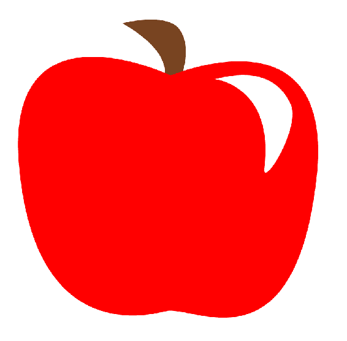
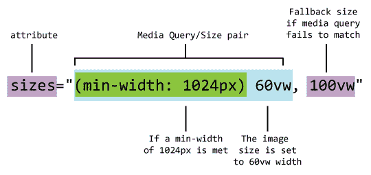

# 在 HTML 中使用 SVG

到目前为止，在本书中，您已经了解了 SVG 的基本构建块:SVG 规范本身中定义的特性和功能。 虽然 SVG 可以而且确实是独立存在的，但当它在现代 web 上发布时，它确实很出色。 现在的 web 是一个多设备、多表单因素和多连接速度的环境，SVG 帮助解决了现代 web 开发人员面临的许多棘手问题。 为此，接下来的几章将集中讨论 SVG 与其他核心技术:HTML、CSS 和 JavaScript 的集成。 本章非常简单，主要讨论如何在 HTML 文档的上下文中使用 SVG。 网页上的一切都是从 HTML 开始的，所以确保你的 SVG 在你的 HTML 中是合适的。

在[第 1 章](https://cdp.packtpub.com/mastering_svg/wp-admin/post.php?post=29&action=edit)、*介绍可缩放矢量图形*中，您已经学习了将 SVG 作为图像或内联 SVG 元素插入 HTML 文档的基础知识。 本章在此基础上增加了一些细节。

在本章中，你将学到以下内容:

*   SVG 和可访问性
*   将 SVG 图像用于响应式网页设计以及作为响应式图像解决方案的一部分的好处
*   关于在 HTML 文档上下文中使用内联 SVG 的详细信息

那么，让我们开始吧!

# SVG、HTML 和可访问性

无障碍网页致力于确保残疾人能够访问网站和应用程序。 总的目标是提供能够让残疾用户直接访问的服务和结构的内容，或者，如果因为残疾而无法直接访问(例如，听力受损用户需要音频内容)， 提供传递相同信息的适当结构的替代内容。 然后可以通过**辅助技术**(**AT**)访问这种结构化的替代内容。 AT 最常见的例子是*屏幕阅读器。 【5】*

屏幕阅读器适用于所有平台。 一些你可以测试的免费应用程序包括:

*   NVDA (Windows)
*   苹果画外音(OS X)
*   虎鲸(Linux)

对于 SVG(一种可视格式)，重点在于提供(适当时)*描述图像的文本内容。*

 *正如您所希望的，HTML 本身有工具和最佳实践来实现可访问性。 除了 HTML 之外，还有一组称为**可访问的富 Internet 应用程序**(**ARIA)**的技术，它定义了使 web 和 web 应用程序对残疾人更容易访问的方法。 ARIA 提供了一组特殊的可访问性属性，当将这些属性添加到 HTML 中时，可以提供关于页面或应用程序的可访问性信息。 例如，`role`属性定义元素所在对象的*类型*(文章、菜单或图像)。

当你看到在[第一章](01.html),*介绍*可缩放矢量图形,通常有两种方法来让你的 SVG 成 HTML 文档:`src`的一个图像作为一个内联 SVG 元素(或元素)。 本节将添加一些关于使用 SVG、HTML 和 ARIA 属性的说明，以确保您的内容仍然可以使用这两种技术进行访问。

# SVG 作为图像 src

将 SVG 放入文档的最简单方法是作为`img`元素的`src`。 这样做,我们看到在第一章,*介绍【显示】可缩放矢量图形,一样简单引用`*.svg`元素相同的方式引用任何形象`img`的`src`属性元素。*

至于可访问性，如果您遵循关于可访问性和图像的最佳实践，您可以继续对 SVG 图像进行同样的操作。 `alt`属性应该在那里，如果 AT 需要它，那么它应该恰当地描述内容([https://webaim.org/techniques/alttext/](https://webaim.org/techniques/alttext/))。 您可能想知道为什么要这样做，特别是对于一个已经将描述性文本作为其源的一部分的 SVG 图像。 请注意，实际上，SVG 文件中的任何文本内容都被锁在屏幕阅读器外，因此即使使用 SVG(一种描述性的、基于标记的图像格式)，它的行为至少在本例中与常见的位图文件格式类似。

除了替代文本之外，你应该考虑一下 Safari 的旧版本(比 Safari Desktop 9.1.1 或 iOS 版本 9.3.2 更老)。 在那些旧版本中，`alt`文本不会被苹果屏幕阅读器 VoiceOver 读取，除非在`img`元素上设置了`role="img"`ARIA 角色:

```html

```

# 内联 SVG

内联 SVG 为可访问性提供了更广泛的调色板。 例如，与我们刚才讨论的作为`img src`场景的 SVG 不同，如果 SVG 中有一个或多个`<text>`元素，那么屏幕阅读器就可以直接读取该文本。 如果文本正确地描述了图像，那么您已经提供了一个可访问的图像。 你不需要做其他任何事情。

如果 SVG 中的文本不是图像的描述性文本，或者图像中没有文本，那么可以利用两个 SVG 元素`title`和`desc`提供可访问的文本。 这些元素，加上`aria-labelledby`属性，提供了一种可访问性的两级方法。 下面的代码示例展示了其工作原理。 图像本身就是一个苹果的插图。 在浏览器中呈现，它看起来是这样的:



标记如下所示。

SVG 元素本身有两个重要的属性。 它有`img`的`role`，这表示元素被标识为图形。 它还利用了`aria-labelledby`属性，该属性引用了两个独立的 id`"apple-title"`和`"apple-desc"`。 `aria-labelledby`属性创建了其属性所在的元素与其他标记它的元素之间的关系。

我们将这两个元素中的第一个元素作为 SVG 元素的第一个子元素`title`。 SVG 元素可以使用`title`元素提供元素的文本描述。 它不直接由浏览器呈现，但应该由屏幕阅读器读取，并可以在工具提示中呈现，很像`alt`属性中的文本在某些浏览器中显示的方式。 它有`id`和`"apple-title"`。 接下来是可选的`desc`元素。 `desc`允许您提供图像的较长的文字描述。 它有`"apple-desc"`中的`id`。 它也可以由屏幕阅读器读取，而不会直接呈现到浏览器中。

最后一个有趣的标记是`role="presentation"`，它应用于每个子`path`元素。 这样做会将这些元素从可访问性树([https://www.w3.org/TR/svg-aam-1.0/#exclude_elements](https://www.w3.org/TR/svg-aam-1.0/#exclude_elements))中拉出来，所以从可访问性的角度来看，SVG 元素被视为一个图形:

```html
<!doctype html>
<html lang="en">
<head>
 <meta charset="utf-8">
 <title>Mastering SVG- Accessible Inline SVG </title>
</head>
<body>
 <svg  width="300" height="300"
  viewBox="0 0 300 300" version="1.1" role="img" aria-
  labelledby="apple-title apple-desc">
 <title id="apple-title">An Apple</title>
 <desc id="apple-desc">An apple, the sweet, pomaceous fruit, of the
  apple tree.</desc>
 <path role="presentation" style="fill:#784421;stroke:none;stroke-
  width:0.26458332px;stroke-linecap:butt;stroke-linejoin:miter;stroke-
  opacity:1"
  d="m 105.75769,18.053573 c 0,0 46.1131,23.434525 34.01786,50.64881  
  -12.09524,27.214284 15.875,-6.803573 15.875,-6.803573 0,0
   9.07143,-23.434524 -1.5119,-38.55357 -10.58334,-15.1190474 
  -48.38096,-5.291667 -48.38096,-5.291667 z"
 />
 <path role="presentation" style="fill:#ff0000;stroke:none;stroke-
  width:0.26458332px;stroke-linecap:butt;stroke-linejoin:miter;stroke-
  opacity:1"
  d="m 146.65476,61.898812 c 0,0 -139.0952362,-66.5238097
 -127.755951,73.327378 11.339285,139.85118 92.218641,132.57921
  123.220231,124.73214 23.47822,-5.94277 108.10119,52.16071 
  127.00001,-111.125 C 286.06755,2.3982366 146.65476,61.898812 
  146.65476,61.898812 Z"
 />

 <path role="presentation" style="fill:#ffffff;stroke:none;stroke-
  width:0.26458332px;stroke-linecap:butt;stroke-linejoin:miter;stroke-
  opacity:1"
  d="m 183.69643,64.92262 c 0,0 50.21311,5.546816 41.57738,74.83928 
  -2.32319,18.64109 31.75,-34.7738 21.92261,-54.428565 C
  237.36905,65.678572 219.22619,55.851191 183.69643,64.92262 Z"
 />
 </svg>
</body>
</html>
```

本节描述静态 SVG 图像的可访问性。 动态 SVG 还可以使用其他可访问性技术，包括其他 ARIA 属性，例如 ARIA 活动区域([https://developer.mozilla.org/en-US/docs/Web/Accessibility/ARIA/ARIA_Live_Regions](https://developer.mozilla.org/en-US/docs/Web/Accessibility/ARIA/ARIA_Live_Regions))。 在适用的情况下，您将在下面的章节中了解这些内容。 也就是说，掌握静态 SVG 的基本知识是一个很好的开始，学习使用屏幕阅读器测试 SVG 将使您走上正确的道路。

# SVG 和响应式网页设计

**响应网页设计**(**RWD)技术开发网站和应用程序,利用流体布局网格和 CSS3 媒体查询([https://www.w3.org/TR/css3-mediaqueries/)创建布局,能够适应和应对设备或用户代理的特点, 在不了解设备特性的情况下，拉伸和收缩以呈现适用于各种屏幕尺寸的布局。](https://www.w3.org/TR/css3-mediaqueries/)**

 **当 RWD 开始起步时，其中一个问题迅速浮出水面，成为一个痛点，那就是提供正确大小的图像(包括文件的重量和尺寸)的困难，这取决于会影响最终用户体验的众多变量中的任何一个。 屏幕分辨率、像素深度和可用带宽结合在一起，使得为用户提供什么样大小的图像成为一个复杂的问题。

接下来是长达数年的对标记模式的探索，该模式将创建响应性内容图像。 *内容图像*是带有`img`标签的图像，其目的是作为内容呈现。 这与仅用于设计的图像相比，它可以而且应该已经用 CSS 处理。 由于强烈支持媒体查询，CSS 已经提供了许多工具来根据许多因素呈现正确的图像。

响应图像的一些要求如下:

*   **最小的文件大小**:这是真正的核心问题。 它只是在很多方面表现出来。 在一个完美的世界里，我们将只发送尽可能小的字节数，以使图像达到可接受的质量水平。
*   **利用浏览器预紧器**:所有现代 web 浏览器使用一个浏览器跳过前面的技术,同时阅读和构建 DOM 文档,和阅读文档,寻找额外的资产,它可以开始下载。
*   **将正确大小的图像提供给多个分辨率**:如果您将大图像提供给`2048`像素监视器，那么您希望它是`1600`像素或更多的大图像。 另一方面，平板电脑或手机上的大图可能只需要`320`或`480`像素宽。 在这种情况下，发送正确数量的数据可以显著提高性能。
*   **为多个像素比设备提供正确的图像**:为了在具有高设备像素比的设备上生成干净的图像，您需要按比例发送为给定 CSS 像素集显示的较大文件。 在标准桌面显示器上清晰的图像会在高像素密度显示器上显示伪影。 显然，您可以向所有浏览器发送更高分辨率的图像，但这些像素需要付出带宽的代价，所以最好是将正确的图像发送到正确的设备。
*   **选择不同大小的图像或在不同的断点处完全不同的图像**:希望能够显示不同方向和屏幕分辨率的不同图像。 在一个大屏幕上，在一篇描述亚利桑那州图森地区植物群的文章中，你可能会使用一张宽阔的图片，展示你在那里能找到的各种耐寒植物。 在一个垂直方向的小屏幕上，多样性的影响可能会消失，因为它只显示一英寸高，细节很少，一个具有强烈垂直长宽比的萨瓜罗仙人掌的图像可能是一个更好的选择。
*   **使用设计断点**:围绕媒体查询断点的概念进行了大量的开发。 它们是 RWD 的核心技术之一。 图像需要与响应性站点中发生的所有其他设计变化一起进行控制。

由此产生的多种解决方案(游戏邦注:包括`picture`元素、`srcset`和`sizes`属性)非常强大。 花了一段时间(几年的互联网焦虑),但最终,我们所需的一切服务于*正确的图像正确*文件大小和正确*【显示】维度是用于我们的浏览器。***

 *这并不容易。 这是一个复杂的问题，因为它有一个复杂的解决办法。 编码是复杂的，它是复杂的理解，它需要多个版本生成的每个图像，你想在网上呈现。

让我们看看新的解决方案是如何工作的，然后我们将看到 SVG(由于图像需求而可以使用它)如何使其变得不那么复杂。

# srcset 属性

`srcset`属性是添加到`img`元素的新属性。 您可以将它与新的`picture`元素一起使用，稍后我们将这样做。 现在，让我们单独来看它。 就像我说的，这个东西很复杂，所以值得花时间慢慢建立起来。

与标准的`src`属性一样，`srcset`属性告诉浏览器从哪里获取`img`元素的内容所使用的文件。 然而，与`src`引用的单个图像不同，`srcset`属性显示一个用逗号分隔的 url 列表。 `srcset`属性还提供*提示*关于图像大小或像素密度。

让我们看一个示例来理解这些提示是如何工作的。

以下示例中的`srcset`属性提示设备像素比率。 在这种情况下，有两种选择。 第一个选项是`more-colors-small.jpg`，它是`600*350`(600 × 350)像素宽，以标准分辨率显示。 第二个图像`more-colors-large.jpg`是`1200*700`像素，用于更高分辨率的显示。 它仍将以`600*350`*CSS*像素显示，但它有足够的额外图像信息，以看起来干净的更高像素密度显示器。

`src`属性作为不支持`srcset`的浏览器的回退:

```html
<!DOCTYPE html>
   <html lang="en">
     <head>
       <meta charset="utf-8">
     </head>
     <body>
       
     </body>
 </html>
```

这是设备像素比率用例的解决方案。

将`src`作为支持图像的浏览器的后备方案，将`alt`属性作为不支持图像的浏览器的后备方案，这是一个很好的向后兼容解决方案。

# srcset 和 size 属性

为了解决更复杂的用例，`srcset`属性可以与新的`sizes`属性协同工作，使用媒体查询服务于独立的图像源，基于浏览器窗口以不同的相对维度显示。 下面的代码示例说明了这是如何工作的。

在本例中，对于不支持的浏览器，元素以`src`属性开始。 在本例中，我选择了一个较小的图像，以确保无论使用什么设备或浏览器，它都能快速加载。 接下来是新的`sizes`属性。 `sizes`接受媒体查询/图像大小对(或对列表)。

下面的图表分解了这些组件。 第一部分是媒体查询。 如果您在 CSS 中使用过这个媒体查询，那么应该对它很熟悉。 如果查询为`true`，则图像大小设置为**60vw**(**视口宽度**的 60%(**vw**))。 如果媒体查询失败，则大小降回默认大小**100vw**:



可以有任意数量的**媒体查询/大小对**。 第一个匹配的将胜出，如果没有匹配，则使用回退值。

这里的`srcset`属性更广泛。 该列表有一系列像素宽度在`200`和`1600`像素之间的图像。 源集中值对的第二部分不是指示首选像素密度，而是提示浏览器图像的像素宽度(200w、400w 等等)。 这是由浏览器混合和匹配最佳像素宽度与适当的大小在不同的尺寸和像素密度:

```html
<!doctype html>
<html lang="en">
<head>
  <meta charset="utf-8">
  <title>Mastering SVG - the srcset and sizes attributes </title>
</head>
<body>
    
  </body>
</html>

```

The length part of `size` can be specified in any valid CSS length, which adds to the possibilities and complexity of this attribute. This chapter will stick with `vw` measurements.

# 图片的元素

在其最初的概念中，`picture`被设计为一个并行的`img`元素，建模于 HTML5`video`和`audio`元素的语法。 其想法是用一个`picture`元素包装一系列`source`元素，这将代表图像源的选项。 它会为不支持的浏览器包装一个默认的`img`元素。 每个源代码上的`media`属性会提示浏览器正确使用的源代码:

```html
<picture alt="original proposal">
 <source src="high-resolution.png" media="min-width:1024px">
 <source src="low-resolution.png">
 
 </picture>
```

由于各种与实现有关的原因，这个最初的建议被否决了。 `srcset`填补了一些空白，但由于它没有解决所有的响应图像用例，所以在规范领域中总是存在漏洞。

许多年过去了，*最终*，在许多错误的开始后，`picture`被复活和重制以填补那个洞。

然而，现在`picture`不再是`img`的替代品，而是`img`元素的*增强*，以帮助浏览器为图像源找到可能的最佳解决方案。

让我们看一个例子。 `srcset`示例使用同一图像的不同分辨率版本，而本`picture`示例旨在为不同分辨率提供不同的图像。 这里，在较大的浏览器窗口中，将显示宽大于高的图像:


在小于 1024 像素的浏览器窗口中，将使用方形图像:


为此的标记相对复杂，需要一些解释。

在`head`中，请注意存在`picturefill.min.js`文件。 Picturefill[(https://github.com/scottjehl/picturefill)是一个 Polyfill](https://github.com/scottjehl/picturefill)([https://remysharp.com/2010/10/08/what-is-a-polyfill)`picture`元素,提供支持 JavaScript 驱动的图片元素不能传导波的浏览器。](https://remysharp.com/2010/10/08/what-is-a-polyfill)

在 HTML 文档的主体中，`picture`元素包装了整个解决方案。 它让浏览器知道它应该使用这个`picture`元素来为子`img`元素挑选合适的源代码。 然而，我们不能立即得到`img`元素。 我们遇到的第一个子元素是`source`元素。

从开发人员的角度来看，`source`按照最初建议的方式工作。 如果媒体查询匹配，则使用`source`。 如果不匹配，则转到堆栈中的下一个媒体查询。

在这里，您有一个搜索最小宽度为`1024`像素的页面的媒体查询。 如果媒体查询匹配，则使用`srcset`属性让浏览器在三个独立的源图像之间进行选择，范围从`600`像素到`1600`像素宽。 由于此图像打算显示在`50vw`，这将为大多数显示器提供良好的覆盖。 在此之后，还有一个回退元素`img`，它也包含一个`srcset`。 如果浏览器不支持`picture`和`source`，或者如果之前的媒体查询不匹配，您可以在这里使用`srcset`属性来获取此图像的源。 `sizes`属性允许您进一步调整显示的大小范围小于`1024`像素:

```html
<!doctype html>
<html lang="en">
<head>
  <meta charset="utf-8">
  <title>Mastering SVG- picture element </title>
  <script src="picturefill.min.js"></script>
</head>
<body>
    <picture>
     <source
      media="(min-width: 1024px)"
      sizes="50vw"
      srcset="more-colors-600.jpg 600w,
        more-colors-1200.jpg 1200w,
        more-colors-1600.jpg 1600w">
       
      </picture>
  </body>
</html>
```

虽然它很复杂，但这个`picture`模式解决了不同图像大小和不同格式的问题，以选择不同的艺术方向。 现在(冗长的)解释已经结束，让我们看看 SVG 如何用更少的标记解决一些相同的问题。 您已经在[第一章](https://cdp.packtpub.com/mastering_svg/wp-admin/post.php?post=29&action=edit)、*介绍可缩放矢量图形*中看到过，这是一个 SVG 图像的例子，它是`img`元素的`src`可以随意上下缩放。 事实上，使用 SVG，响应图像就像下面的代码一样简单:

```html
<!doctype html>
<html lang="en">
<head>
  <meta charset="utf-8">
  <title>Mastering SVG- 100% image element </title>
</head>
<body>
    
  </body>
</html>
```

它允许您无限地向上和向下缩放，而不会损失保真度或额外的字节，而且不需要`srcset`! 有很多方法可以用 CSS 来改进这个简单的解决方案，我们将在下一章中看到，但是现在，只需要知道这个模式是可行的。 从一个超过 3000 像素的巨型显示器到一个小型功能手机(假设它支持 SVG)，上述标记将很好地缩放。

那么美术方向用例呢? 使用 SVG 也会简单得多。 因为我们不需要提供图像的多个版本(每个 SVG 图像都可以根据需要缩放)，所以艺术方向用例的标记如下所示。

我们有前面看到的相同的`picture`元素。 有一个子元素`source`具有指向大于`1024`像素的浏览器的媒体查询。 如果是`true`，则使用景观图像。 然后，有一个子元素`img`，其中`srcset`指向正方形图像，`width`为 100%。 如果第一个`source`元素上的媒体查询失败，我们就会得到这个图像。

它不像普通的`img`那样简单，但它比每个`srcset`中有多个位图图像的版本要简单得多。 输出两张图像，你就可以使用最复杂的情况，艺术方向，缩放多个屏幕分辨率:

```html
<!doctype html>
<html lang="en">
<head>
  <meta charset="utf-8">
  <title>Mastering SVG- picture element with SVG </title>
  <script src="picturefill.min.js"></script>
</head>
<body>
  <picture>
    <source 
      media="(min-width: 1024px)"
      srcset="more-colors.svg">
    
  </picture>
  </body>
</html>
```

虽然并不是每个用例都可以使用 SVG，但它是目前为止 RWD 中最灵活的图像格式。 从基于一个图像源缩放图像的简单`width="100%"`技术，到利用`picture`元素实现艺术方向用例的更简单实现，SVG 在这些多分辨率、多设备的世界中提供了巨大的好处。

# 关于 HTML 文档中内联 SVG 的附加细节

正如您已经了解到的，使用内联 SVG 就像使用 HTML 标记一样简单，而且通常是将 SVG 嵌入文档的最佳(或者在交互式 SVG 的情况下，是惟一的)选择。 也就是说，与 web 上的任何东西一样，在使用内联 SVG 时，总是需要记住一些边缘情况、注释和陷阱。 本节概述了两个关注点。 第一个问题是如何利用浏览器的缓存，另一个问题是要意识到使用 SVG 时 DOM 的复杂性可能会大幅增加。

# 缓存

与链接为`img`元素的`src`或使用 CSS 引用的 SVG 图像不同，内联 SVG 不能被缓存并在另一个页面或单页面应用程序的不同视图上引用。 虽然最小化 HTTP 请求的数量(内联 SVG 通过消除对单独 SVG 文档的请求来做到这一点)会带来性能上的好处，但这并不总是最优模式。 如果您在多个页面或多个站点访问中多次使用相同的 SVG 图像，那么拥有一个可以缓存和稍后再次读取的文件将是一个好处。 对于更大、更复杂的 SVG 图像尤其如此，因为它们的下载占用空间很大。

如果您确实需要使用内联 SVG(例如，所有交互示例)，您仍然可以尝试以不同的方式利用浏览器缓存，通过使用`use`元素链接到外部库 SVG 元素。 您可能会预先添加一些 HTTP 请求，但不需要持续下载和解析定义这些可重用组件的内联标记。

实际上，考虑可重用组件是考虑构建项目任何方面的一个好方法，因此这比利用浏览器的缓存更有好处。

# 复杂性

虽然到目前为止，我一直试图限制您在本书中看到的 SVG 代码示例的复杂性，但您已经看到了一些非常忙碌的*SVG 示例。 事实上，当处理比少量`rect`、`circle`或`text`元素更复杂的任何内容时，SVG 代码的大小和/或可读性可能会很快下降。 对于生成的代码尤其如此，因为它并不是真正为人类使用的。*

 *这种复杂性可能在两个方面造成问题:更复杂的创作环境以及页面的呈现和性能下降。

# 创作

SVG 文档可以变得非常大，即使对于简单的图像也是如此。 根据效果的数量和元素的数量，用于绘制 SVG 图像的标记可能会迅速覆盖页面上的其他所有内容。 因此，值得将较大的 SVG 元素保留为单独的文档片段，并根据需要将它们拉到文档中。 根据使用方式的不同，这可能是使用包含 SVG 文档中的`use`元素，也可能是使用所选的页面组合工具导入文档片段。 有大量的服务器端和/或客户端解决方案可以将标记和文本片段组合在一起(例如，JavaScript 模板解决方案、cms、博客平台和服务器端脚本语言，如 PHP)，所以我不打算创建一个可能使用有限的示例。 我相信你会利用你最亲近的人。

在检查页面时，您仍然需要处理它，但这比在一个 700 行文件中使用一个显示供应链图或类似内容的 SVG 插图占用 500 行标记要好得多。

# 文档对象模型

除了创作方面的问题外，使用非常复杂的 SVG 还可能遇到浏览器性能问题。 无论您以何种方式导入它们，这都是正确的，因为即使是作为`img src`导入的 SVG 也不仅仅是像素的集合，但如果您已经在与 DOM 进行大量交互，这可能会变得更加尖锐。 通常，文档中元素的数量直接影响页面的速度和响应能力([https://developers.google.com/web/fundamentals/performance/rendering/avoid-large-complex-layouts-and-layout-thrashing](https://developers.google.com/web/fundamentals/performance/rendering/avoid-large-complex-layouts-and-layout-thrashing))。 当页面上有成百上千个可能具有交互性的 SVG 元素时，每个元素都需要计算(有些需要进行非常复杂的计算)并由浏览器呈现，因此速度会非常快。

大多数时候，您不会遇到这类性能问题。 至少我希望你不是。 然而，它*是*可能的，所以把可能性归档，希望你永远不会用到知识。

# 总结

在本章中，您了解了如何在 HTML 文档的上下文中使用 SVG。 首先，您了解了内联 SVG 元素和作为`img`元素的`src`的 SVG 图像的 SVG 可访问性。 这包括`img`元素的`alt`属性的详细信息，以及内联 SVG 中的`title`和`desc`元素的详细信息。

接下来，您了解了响应性图像的解决方案，以及使用 SVG 如何大大简化即使是最复杂的响应性图像用例的实现。 最后，学习了内联 SVG 的一些其他方面，以便在现实世界中实现这些解决方案时注意。

接下来，我们将研究 CSS 和 SVG 的重要交集。 下一章将以我们所学的知识为基础，介绍一些功能强大的新工具，以便添加到 SVG 工具箱中。*****