# 五、使用 SVG 和 CSS

本章将重点讨论 SVG 和 CSS 之间的交集。 虽然 JavaScript 是使用 SVG 的最强大的工具，但没有 CSS 的 SVG 不会像现在这样流行。 正如你所了解的，SVG 非常适合现代 web，通常是 RWD 问题的最佳答案。 正因为如此，它被设计人员和开发人员全心全意地用于制作网页图像。

对于整个 web 来说，这种对 SVG 的偏好是一个很好的选择，应该加以培养。 希望本章将解释其中的原因。

在本章中，我们将学习以下内容:

*   使用 CSS 背景图像
*   如何优化数据 uri 的 SVG
*   SVG 精灵 vs 图标字体
*   嵌入 SVG 的不同方式如何与 CSS 交互
*   使用常见的 CSS 属性操作 SVG
*   使用 SVG 特定的 CSS 属性操作 SVG
*   基本的 CSS 动画和 SVG 转换

# CSS 背景图像

你已经在[第 1 章](01.html)、*介绍可伸缩矢量图*中看到了使用 CSS 处理背景图片的例子。 本节将为以这种方式使用 SVG 添加更多细节。

在这个初始的基本示例中，我们添加了一个带有程式化字母 R 的 SVG 图像作为`div`的背景图像。 一个重要的方面是设置`background-size`属性。 SVG 图像的自然大小为`458`×`392`。 在本例中，它被设置为该大小的一半，以适应`div`的大小:

```html
<!doctype html>
<html lang="en">
    <head>
        <meta charset="utf-8">
        <title>Mastering SVG- CSS Background Images</title>
        <style type="text/css">
          .logo{
            width: 229px;
            height: 196px;
            background: url(icon.svg);
            background-repeat: no-repeat;
            background-size: 229px 196px;
          }
        </style>
    </head>
    <body>
        <div class="logo">
        </div>
    </body>
</html>
```

在浏览器中呈现，我们得到以下结果:

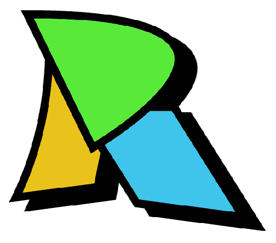

除了提供高像素密度的显示(*是*一个很棒的特性)，这并不能让你获得更多 PNG 所提供的内容。

在使用相对单元的环境中，您可以利用 SVG 将`contain`或`cover`作为`background-size`的值进行缩放的能力来真正利用 SVG。 在下面的例子中，相同的 logo 被应用为背景图像，以及一些文本。 所有指标都是相对的，使用根 em (rem)单位。 背景图像设置为`background-size`值`contain`。 `contain`确保标志将被显示，*其整体*，受包含元素的高度和宽度的限制。 因为我们使用 SVG 图像作为背景图像、文档的基本字体(因此的计算【显示】根 em)可以从 16 像素规模(浏览器默认)1600 像素和 SVG 背景能够规模匹配:

```html
<!doctype html>
<html lang="en">
    <head>
        <meta charset="utf-8">
        <title>Mastering SVG- Relative Background Images </title>
        <link href="https://fonts.googleapis.com/css?
         family=Raleway:600" rel="stylesheet"> 
        <style type="text/css">
          .logo{
            width: 14.3rem;
            height: 14.3rem;
            background: url(icon.svg);
            background-repeat: no-repeat;
            background-size: contain;
            background-position-y: 2.5rem;
          }
          h1 {
            font-family: Raleway, sans-serif;
            font-size: 2rem;
          }
        </style>
    </head>
    <body>
      <div class="logo">

      <h1>Rob Larsen</h1>
    </div>
    </body>
</html>
```

在浏览器中呈现，我们得到以下结果:

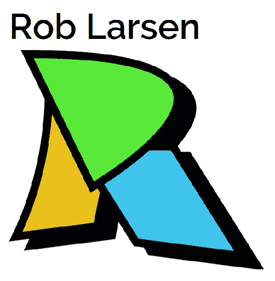

这里并没有太多新的内容，但是在现代 web 上 SVG 是如此重要的一个应用，因此值得花些时间来加强这种模式。

# SVG 背景图像的数据 url

如果考虑性能，您可能会想知道通过 data: URL 直接在 CSS 中嵌入背景图像的技术。 数据 url 允许您通过特殊的`data: URL`将文件直接嵌入到文档中。 这种技术允许您保存 HTTP 请求。

当处理 jpeg 或 png 等二进制格式时，图像数据需要用`base64`编码。 虽然这将适用于 SVG 图像，但将 SVG 图像作为 SVG 源嵌入实际上更快([https://css-tricks.com/probably-dont-base64-svg/](https://css-tricks.com/probably-dont-base64-svg/))。 这是因为除了`base64`编码的数据之外，您还可以直接嵌入文本。 当然，SVG 是一种文本格式。 您只需要对 SVG 做几件事就可以使它正常工作。 您应该阅读 Taylor Hunt 的全文以了解详细信息([https://codepen.io/tigt/post/optimizing-svgs-in-data-uris](https://codepen.io/tigt/post/optimizing-svgs-in-data-uris))，但基本步骤如下:

*   属性值使用单引号
*   url 编码任何非安全字符(`<`，`>`，`#`，等等)
*   用双引号引用数据 URL

转换初始示例，我们得到如下代码:

```html
<!doctype html>
<html lang="en">
    <head>
        <meta charset="utf-8">
        <title>Mastering SVG- CSS Background Images with Data 
         URLs</title>
        <style type="text/css">
          .logo{
            width: 229px;
            height: 196px;
            background: url("data:image/svg+xml,%3Csvg
xmlns='http://www.w3.org/2000/svg' height='392' width='458'%3E%3Cg  stroke='%23000' stroke-width='14.17'%3E%3Cpath d='M96.42 60.2s14 141.5-58 289l145.5-18.4 55.4-276.7z' fill='%23000012'/%3E%3Cpath d='M145.42 188l108.5 171.6 189.2 24.4-123.4-196z' fill='%23000012'/%3E%3Cpath d='M70.12 43.7s14 141.5-58 289l145.5-18.4 55.4-276.7z' fill='%23e9c21b'/%3E%3Cpath d='M59.02 23.6l116.2 237.2c-.1 0 411.3-239.1-116.2-237.2z' fill='%23000012'/%3E%3Cpath d='M119.12 171.6l108.5 171.6 189.2 24.4-123.4-196z' fill='%233fc4eb'/%3E%3Cpath d='M32.62 7.1l116.2 237.2S560.22 5.2 32.62 7.1z' fill='%2359ea39'/%3E%3C/g%3E%3C/svg%3E");
            background-repeat: no-repeat;
            background-size: 229px 196px;
          }
        </style>
    </head>
    <body>
      <div class="logo">
    </div>
    </body>
</html>
```

虽然这实际上是非常直接的手工准备(这里的示例是手工编码的)，但如果您希望压缩所有字节，有一些可用的工具可以为您完成此工作。 有一个节点模块([https://www.npmjs.com/package/mini-svg-data-uri](https://www.npmjs.com/package/mini-svg-data-uri))和一个 SASS 函数([https://codepen.io/jakob-e/](https://codepen.io/jakob-e/))可以帮助您将此功能构建到您的工作流中。

# SVG 精灵和图标集

本节并不是严格地讨论 CSS，但是讨论了一种常见的 CSS 驱动的解决方案的替代品，可以将图标添加到应用程序中，所以这里似乎是讨论它的最佳场所。

如果你正在阅读这本书，你可能对图标字体的概念有些熟悉，比如 GLYPHICONS([http://glyphicons.com/](http://glyphicons.com/))或 Font Awesome([https://fontawesome.com/icons?from=io](https://fontawesome.com/icons?from=io))。 如果你不是，他们是字体，而不是代表可以阅读的语言字符(在，你现在正在阅读的字符)，他们呈现不同的图像，可以用作一个网站或应用程序的图标。

例如，您可以使用*Font Awesome*为视频播放器创建界面，而无需设计单个元素。

下面的代码示例显示了该实现的样子。 除了字体 Awesome，下面的例子使用 Bootstrap 样式。

Font Awesome 的基本模式是将图标作为空元素包含在内。 在本例中为`i`。 每一个都有两个公共类:`fa`和`fa-2x`。 这表明该元素是一个字体 Awesome 图标，它应该以正常大小`2x`呈现。 在此之后，单独的图标被添加`fa-`类，这些类表示要使用的图标类型:

```html
<!doctype html>
<html lang="en">
    <head>
        <meta charset="utf-8">
        <title>Mastering SVG- Font Awesome</title>
        <link rel="stylesheet" 
href="https://maxcdn.bootstrapcdn.com/bootstrap/4.0.0/css/bootstrap.min.css" integrity="sha384-Gn5384xqQ1aoWXA+058RXPxPg6fy4IWvTNh0E263XmFcJlSAwiGgFAW/dAiS6JXm" crossorigin="anonymous">
        <link href="font-awesome.min.css" rel="stylesheet" />
    </head>
    <body>       
        <div style="text-align: center">
            <button class="btn btn-link"><i class="fa fa-2x fa-backward
             "></i></button> 
            <button class="btn btn-link"><i class="fa fa-2x fa-fast-
              backward"></i></button> 
            <button class="btn btn-link"><i class="fa fa-2x fa-play">
             </i></button>
            <button class="btn btn-link"><i class="fa fa-2x fa-fast-
             forward"></i></button> 
            <button class="btn btn-link"><i class="fa fa-2x fa-
             forward"></i></button> 
        </div>

    </body>
</html>
```

在浏览器中呈现，它看起来如下:


这些都很清楚，也很容易理解。 正因为如此，这些图标字体非常受欢迎。 我在多个环境中使用过它们，它们的易用性以及它们提供的快速启动和运行的能力给我留下了深刻的印象。

也就是说，使用图标字体也有缺点。 两个突出的缺点是:

*   可访问性:在可访问性方面，有很多方法可以很好地处理图标字体([https://www.filamentgroup.com/lab/bulletproof_icon_fonts.html](https://www.filamentgroup.com/lab/bulletproof_icon_fonts.html))，但开箱操作后，您将杂乱的字符插入空元素中。 屏幕阅读器可能会读到这些废话，给依赖 AT 浏览 web 的用户带来一种混乱的体验。
*   语义:空元素为*空。 使用`i`或`span`的图标字体实际上没有任何意义。*

还有其他的问题，包括加载网页字体的挑剔性质和阅读障碍用户的问题([https://cloudfour.com/thinks/seriously-dont-use-icon-fonts/](https://cloudfour.com/thinks/seriously-dont-use-icon-fonts/))。

好消息是，如果您对更好的语义、更好的可访问性和更直接的实现感兴趣，可以使用 SVG 替代图标字体:使用*SVG 精灵*。 公平地说，SVG 精灵也不是一个完美的解决方案，因为它们最优雅的变体需要 IE/ edge 形状的工作区。 但对于某些配置(特别是单页面应用)，SVG 精灵是图标传递的绝佳选择。

让我们看看它是如何工作的。

对于本例，我们将使用 Front Awesome v5，它提供所有图标的 SVG 版本，以复制前面的一组控件。

下面是如何使用 SVG 精灵实现相同的控制。

首先，让我们看看精灵文件本身的细节。 其中，所有图标都被定义为一个`symbol`元素，该元素对应于 CSS 图标的类名所引用的相同名称。 每个`symbol`元素包括可访问的`title`元素。

集合中的每个图标都在文件`fa-solid.svg`中表示:

```html
 <symbol id="play" viewBox="0 0 448 512">
    <title id="play-title">play</title>
    <path d="M424.4 214.7L72.4 6.6C43.8-10.3 0 6.1 0 47.9V464c0 37.5 
     40.7 60.1 72.4 41.3l352-208c31.4-18.5 31.5-64.1 0-82.6z"></path>
  </symbol> 

```

在 HTML 文件中，情况略有不同，但模式基本上是相同的。 为了方便起见，我们仍然链接到 Bootstrap。 我们不再链接到任何从字体 Awesome 在`head`。 我们只有一小块 CSS 来调整页面上图标的大小。 在实际的示例中，您可能需要对这些样式做更多的处理，但目前这已经足够使其具有功能。

在文档主体中，我们有一个新模式。 我们用`button.btn > svg > use`代替了`button.btn > i.fa`模式，并且使用`button.btn > svg > use`指向`fa-solid.svg`文件中的特定符号。

除此之外，我们还有一个 ie 形状的皱纹。 Internet Explorer 不允许您从外部文档中`use`一个元素。 脚本*svg4everybody*填充了这个缺点，并允许你在 IE 中链接到外部 SVG:

```html
<html lang="en">
<head>
  <meta charset="utf-8">
  <title>Mastering SVG- Font Awesome</title>
  <link rel="stylesheet" 
    href="https://maxcdn.bootstrapcdn.com/bootstrap/4.0.0- 
    beta.3/css/bootstrap.min.css" integrity="sha384-
    Zug+QiDoJOrZ5t4lssLdxGhVrurbmBWopoEl+M6BdEfwnCJZtKxi1KgxUyJq13dy"
    crossorigin="anonymous">
  <style>
    .btn svg{
      height: 2em;
      width: 2em;
      fill: #007bff;
    }
  </style>
</head>
<body>
  <div>
    <button aria-label="rewind" class="btn btn-link">
      <svg  role="img">
        <use xlink:href="fa-solid.svg#backward"></use>
      </svg>
    </button>
    <button aria-label="skip to previous track" class="btn btn-link">
      <svg  role="img">
        <use xlink:href="fa-solid.svg#fast-backward"></use>
      </svg>
    </button>
    <button aria-label="play" class="btn btn-link">
      <svg  role="img">
        <use xlink:href="fa-solid.svg#play"></use>
      </svg>
    </button>
    <button aria-label="skip to next track" class="btn btn-link">
      <svg  role="img">
        <use xlink:href="fa-solid.svg#fast-forward"></use>
      </svg>
    </button>
    <button aria-label="fast forward" class="btn btn-link">
      <svg  role="img">
        <use xlink:href="fa-solid.svg#forward"></use>
      </svg>
    </button>
  </div>
  <script src="svg4everybody.min.js"></script>
  <script>svg4everybody();</script>
</body>

</html>
```

我提到了单页面应用的不同对待方式。 如果您处理的是单页应用程序，并且希望使用 SVG 图标，那么您可以在页面中*内嵌*符号，并在所有现代浏览器中不使用任何 polyfill 脚本使用它们。 对于单页面应用程序，您可能已经内联 CSS 等内容以保存在 HTTP 请求中，因此在文档中内联添加 SVG 部分可能是相同过程的一部分。

我不打算从构建或页面创建的角度详细说明这是如何工作的，因为有很多方法可以做到这一点(作为构建过程的一部分或通过服务器端模板系统)，但输出可能类似以下代码示例。

最大的区别是`body`顶部的内联`svg`元素中的符号的定义。 这增加了页面的复杂性，但节省了 HTTP 请求。 所以如果你正在创建一个单页面应用，并且不需要缓存单独的精灵文件，这将会稍微快一些。

除此之外，引用直接指向同一页面的文档片段，而不是链接到单独的文件。 这意味着我们不需要 svg4 每个人，并且 Internet Explorer 很乐意支持`use`:

```html
<!doctype html>
<html lang="en">

<head>
  <meta charset="utf-8">
  <title>Mastering SVG- Font Awesome</title>
  <link rel="stylesheet" 
    href="https://maxcdn.bootstrapcdn.com/bootstrap/4.0.0-
    beta.3/css/bootstrap.min.css" integrity="sha384-
    Zug+QiDoJOrZ5t4lssLdxGhVrurbmBWopoEl+M6BdEfwnCJZtKxi1KgxUyJq13dy"
    crossorigin="anonymous">
  <style>
    .btn svg {
      height: 2em;
      width: 2em;
      fill: #007bff;
    }
  </style>
</head>

<body>
  <svg  style="display:none">
    <defs>
      <symbol id="play" viewBox="0 0 448 512">
        <title id="play-title">play</title>
        <path d="M424.4 214.7L72.4 6.6C43.8-10.3 0 6.1 0 47.9V464c0 
         37.5 40.7 60.1 72.4 41.3l352-208c31.4-18.5 31.5-64.1 0-82.6z"></path>
      </symbol>
      <symbol id="fast-backward" viewBox="0 0 512 512">
        <title id="fast-backward-title">fast-backward</title>
        <path d="M0 436V76c0-6.6 5.4-12 12-12h40c6.6 0 12 5.4 12
         12v151.9L235.5 71.4C256.1 54.3 288 68.6 288 96v131.9L459.5 
         71.4C480.1 54.3 512 68.6 512 96v320c0 27.4-31.9 41.7-52.5
         24.6L288 285.3V416c0 27.4-31.9 41.7-52.5 24.6L64 285.3V436c0 
         6.6-5.4
         12-12 12H12c-6.6 0-12-5.4-12-12z"></path>
      </symbol>
      <symbol id="fast-forward" viewBox="0 0 512 512">
        <title id="fast-forward-title">fast-forward</title>
        <path d="M512 76v360c0 6.6-5.4 12-12 12h-40c-6.6 0-12-5.4-12-
         12V284.1L276.5 440.6c-20.6 17.2-52.5 2.8-52.5-24.6V284.1L52.5 
         440.6C31.9 457.8 0 443.4 0 416V96c0-27.4 31.9-41.7 52.5-
         24.6L224 226.8V96c0-27.4 31.9-41.7 52.5-24.6L448 226.8V76c0-
         6.6 5.4-12 12-12h40c6.6 0 12 5.4 12 12z"></path>
      </symbol>
      <symbol id="forward" viewBox="0 0 512 512">
        <title id="forward-title">forward</title>
        <path d="M500.5 231.4l-192-160C287.9 54.3 256 68.6 256 96v320c0 
         27.4 31.9 41.8 52.5 24.6l192-160c15.3-12.8 15.3-36.4 0-49.2zm-
         256 0l-192-160C31.9 54.3 0 68.6 0 96v320c0 27.4 31.9 41.8 52.5 
         24.6l192-160c15.3-12.8 15.3-36.4 0-49.2z"></path>
      </symbol>
      <symbol id="backward" viewBox="0 0 512 512">
        <title id="backward-title">backward</title>
        <path d="M11.5 280.6l192 160c20.6 17.2 52.5 2.8 52.5-24.6V96c0-
         27.4-31.9-41.8-52.5-24.6l-192 160c-15.3 12.8-15.3 36.4 0 
         49.2zm256 0l192 160c20.6 17.2 52.5 2.8 52.5-24.6V96c0-27.4-
         31.9-41.8-52.5-24.6l-192 160c-15.3 12.8-15.3 36.4 0 49.2z"></path>
      </symbol>
    </defs>
  </svg>
  <div>
    <button aria-label="rewind" class="btn btn-link">
      <svg  role="img">
        <use xlink:href="#backward"></use>
      </svg>
    </button>
    <button aria-label="skip to previous track" class="btn btn-link">
      <svg  role="img">
        <use xlink:href="#fast-backward"></use>
      </svg>
    </button>
    <button aria-label="play" class="btn btn-link">
      <svg  role="img">
        <use xlink:href="#play"></use>
      </svg>
    </button>
    <button aria-label="skip to next track" class="btn btn-link">
      <svg  role="img">
        <use xlink:href="#fast-forward"></use>
      </svg>
    </button>
    <button aria-label="fast forward" class="btn btn-link">
      <svg  role="img">
        <use xlink:href="#forward"></use>
      </svg>
    </button>
  </div>
</body>

</html>
```

与图标字体一样，SVG 精灵可以通过 CSS 完全定制。 在前面的例子中，我们已经看到了改变图标大小和颜色的例子。 在阅读本章的其余部分时，您将看到使用 CSS 操作 SVG 的许多方法。 这是一个相当强大的组合!

# 内联样式 SVG

本节将重点介绍使用 CSS 操作内联 SVG 元素的几种方法。 本节并不详尽，但将涵盖使用 SVG 时使用的许多最常见属性。

这些属性分为两类:

*   您可能在使用 CSS 和 HTML 时熟悉这些 CSS 属性，这也将适用于 SVG
*   特定于 SVG 本身的 CSS 属性

让我们从熟悉的 CSS 属性开始。

# 使用常见的 CSS 属性来操作 svg

本节将重点介绍使用 SVG 的常见 CSS 属性。 除了几个例外，大多数你真正要注意的都是与文本相关的。

# 基本字体属性

如果您曾经使用过 CSS，那么您很可能已经对元素的字体和样式进行了操作。 SVG 元素也可以使用这些相同的属性。

下面的代码示例显示了四个`text`元素。 第一个示例没有显示应用于它的样式，而是显示了 SVG 中的`text`元素的默认呈现。 接下来的三个元素通过 CSS 样式进行了增强。 第一类`text`加入了优秀的 Raleway 字体(可用为谷歌网络字体)和一个新的`font-size`(`2em`)。 接下来的两个类，`text-italic`和`text-bold`，分别以`font-style`和`font-weight`为基础:

```html
<!doctype html>
<html lang="en">
    <head>
        <meta charset="utf-8">
        <title>Mastering SVG- CSS Font Properties</title>
        <link href="https://fonts.googleapis.com/css?
         family=Raleway:400" rel="stylesheet"> 

        <style type="text/css">
          .text {
            font-family: Raleway, sans-serif;
            font-size: 2em;
          }
          .text-italic {
            font-style: italic;
          }
          .text-bold {
            font-weight: bold;
          }
        </style>
    </head>
    <body>
      <svg  role="img" width="800"
        height="250" viewBox="0 0 800 250">
        <text x="25" y="50">
          Default text format
        </text>
        <text x="25" y="100" class="text">
          font-family: Raleway, sans-serif;
          font-size: 2em;
        </text>
        <text x="25" y="150" class="text text-italic">
          font-style: italic;
        </text>
        <text x="25" y="200" class="text text-bold">
          font-weight: bold;
        </text>
       </svg>
    </body>
</html>
```

呈现在浏览器中，你可以看到如下结果:

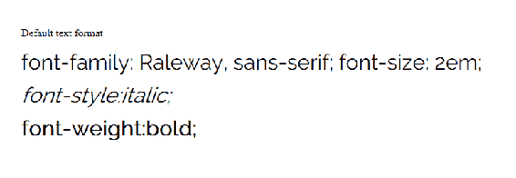

如果您想知道，也可以使用速记属性。 因此，简单地定义一个`font`属性是支持的，如下面的代码示例所示:

```html
<!doctype html>
<html lang="en">
    <head>
        <meta charset="utf-8">
        <title>Mastering SVG- CSS Font Shorthand</title>
        <link href="https://fonts.googleapis.com/css?
         family=Raleway:400" rel="stylesheet"> 
        <style type="text/css">
          .text {
            font: 2em bold Raleway, sans-serif; 
          }
        </style>
    </head>
    <body>
      <svg  role="img" width="800"
       height="250" viewBox="0 0 800 250">
        <text x="25" y="50">
          Default text format
        </text>
        <text x="25" y="100" class="text">
          font: 2em bold Raleway, sans-serif; 
        </text>
       </svg>
    </body>
</html>
```

它在浏览器中呈现如下:


# 文本属性

SVG 支持的下一组 CSS 属性都与文本块有关。 因此，不仅仅是由字体属性定义的单个符号，而是更大的一组符号组合在一起的方式。

下面的代码示例演示了其中的几个。 第一类，`text`，同样改变了`font-family`和`font-size`。

接下来，我们有几个其他类显示了对文本属性的 SVG 支持。 第一个示例说明了对`direction`的支持，它允许定义可以在从右向左阅读的语言(例如波斯语、阿拉伯语和希伯来语)中正常工作的文本块。 这个示例只是将基于英语的属性定义锚定到框的右侧。 接下来，我们将`letter-spacing`(跟踪)属性设置为宽敞的`1em`，使用`text-decoration`添加下划线，并将`word-spacing`设置为`2em`:

```html
<!doctype html>
<html lang="en">
    <head>
        <meta charset="utf-8">
        <title>Mastering SVG- CSS Text Properties</title>
        <link href="https://fonts.googleapis.com/css?
         family=Raleway:400" rel="stylesheet"> 

        <style type="text/css">
          .text {
            font-family: Raleway, sans-serif;
            font-size: 1.5em;
          }
          .text-direction {
            direction: rtl;
          }
          .text-letter-spacing {
            letter-spacing: 1em;
          }
          .text-decoration {
            text-decoration: underline;
          }
          .text-word-spacing {
            word-spacing: 2em;
          }
        </style>
    </head>
    <body>
      <svg  role="img" width="500"
       height="300" viewBox="0 0 500 300">
        <text x="475" y="50" class="text text-direction">
          direction: rtl;
        </text>
        <text x="25" y="100" class="text text-letter-spacing">
          letter-spacing: 1em;
        </text>
        <text x="25" y="150" class="text text-decoration">
          text-decoration: underline;
        </text>
        <text x="25" y="200" class="text text-word-spacing">
          word-spacing: 2em;
        </text>

       </svg>
    </body>
</html>
```

在浏览器中呈现的示例如下所示:

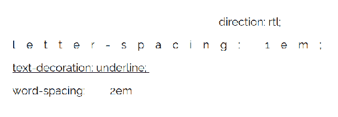

# 各种各样的 CSS 属性

本节的最后一个示例展示了对光标、显示和可见性属性的支持。 其中最有用的是光标。 在本例中，我们将`rect`元素的`cursor`更改为帮助光标。 拖动句柄、调整大小句柄、可单击指针等等都是交互式 SVG 中使用的常见值。

接下来，我们使用`display`和`visibility`属性隐藏元素。 虽然在 HTML 中这两个属性之间的区别很明显，但在 SVG 中这两个属性之间的区别就不那么实际了。 在 HTML 中，带有`display:none`的元素不会被考虑到文档的呈现中。 它们不会影响文档的整体流程。 它们在 DOM 中，可以从 JavaScript 访问，但实际上它们被渲染引擎忽略了。 另一方面，使用`visibility:hidden`设置的元素仍然是文档流的一部分。 一个 200 像素高的`div`仍然会占用 200 像素。 它会在不可见的情况下这样做。

由于 SVG 中的大多数元素在坐标系统上使用`(x,y)`属性定位，所以两者之间的区别可能很微妙。 带有`visibility:hidden`的 SVG 元素通常没有任何要中断的流(`tspan`是一个例外)，因此在布局上没有实际差异。 唯一的区别是处理 JavaScript 事件的方式。 我们将在下一节和后面的 JavaScript 章节中更深入地讨论这个问题。 但是，根据`pointer-events`属性的设置方式，`visibility:hidden`元素仍然可能通过 JavaScript 事件与用户交互。 默认情况下不会，但仍然有可能:

```html
<!doctype html>
<html lang="en">
    <head>
        <meta charset="utf-8">
        <title>Mastering SVG- CSS Misc Properties</title>
        <link href="https://fonts.googleapis.com/css?
         family=Raleway:400" rel="stylesheet"> 

        <style type="text/css">
          .help {
            cursor: help;
          }
          .display-none {
            display: none;
          }
          .visibility-hidden {
            visibility: hidden;
          }
        </style>
    </head>
    <body>
      <svg  role="img" width="500" 
        height="300" viewBox="0 0 500 300">
        <rect x="10" y="0" width="100" height="100" fill="red" 
          class="help"></rect>
        <rect x="120" y="120" height="100" width="100" fill="blue" 
          class="display-none"></rect>
        <rect x="240" y="120" height="100" width="100" fill="blue" 
           class="visibility-hidden"></rect>
       </svg>
    </body>
</html>

```

在浏览器中呈现，当鼠标悬停在元素上时，这个示例如下所示:

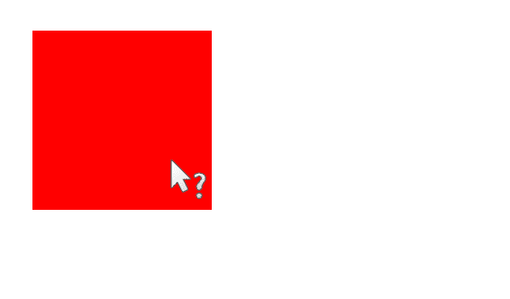

If you're familiar with CSS, then you'll know there are other possible values for `display`. While I'm sure there are valid use cases for setting an SVG element to have another `display` value, it's not going to be something you'll commonly do, so I'm not going to talk about that here. 

# 使用 svg 特定的 CSS 属性来操作 svg

本节将讨论用于处理 SVG 的不同 CSS 属性。 这些属性中的大多数在前面的章节中已经作为特定 SVG 元素的属性看到过。 您将发现，这些表示性属性的组合以及在 SVG 元素和 SVG 文档之间使用 CSS 共享样式的可能性代表了一种强大的组合。

CSS properties will override presentation attributes, but will not override `style` attributes (which really just means that SVG + CSS behaves the way you would expect it to if you're familiar with the way that CSS specificity works ([https://css-tricks.com/specifics-on-css-specificity/](https://css-tricks.com/specifics-on-css-specificity/))).

# 色彩和油漆性能

第一个示例演示了更改元素填充的能力。 `fill`属性接受任何有效的 CSS 颜色值(https://developer.mozilla.org/en-US/docs/Web/CSS/color_value),以及一个油漆服务器链接(例如,一个`pattern``defs`部分)中定义。 `fill-opacity`改变填充本身的不透明度(就像`rgba`颜色定义中的 alpha 值一样)，而不是整个元素，就像 CSS`opacity`属性一样。

在这个例子中，我们定义了四个类。 前两个，`red-fill`和`blue-fill`，定义了两种不同的原色，红色和蓝色，用于填充。 第三个，`half-opacity`，定义`50%`不透明度。 最后一个，`gradient`，将填充定义为指向 SVG 元素中定义的绘制服务器的链接。

然后使用与普通 HTML 元素相同的`class`属性应用它们:

```html
<!doctype html>
<html lang="en">
    <head>
        <meta charset="utf-8">
        <title>Mastering SVG- CSS Fill Properties</title>
        <link href="https://fonts.googleapis.com/css?
          family=Raleway:400" rel="stylesheet"> 

        <style type="text/css">
          .red-fill {
            fill: red;
          }
          .blue-fill {
            fill: blue;
          }
          .half-opacity{
            fill-opacity: .5;
          }
          .gradient{
            fill: url(#linear);
          }
        </style>
    </head>
    <body>
      <svg  role="img" width="550" 
        height="300" viewBox="0 0 550 300">
          <defs>
            <linearGradient id="linear">
                <stop offset="5%" stop-color="green"/>
                <stop offset="95%" stop-color="gold"/>
            </linearGradient>

        </defs>
        <rect x="10" y="0" width="100" height="100" class="red-fill">
        </rect>
        <rect x="120" y="0" height="100" width="100" class="blue-fill">
        </rect>
        <rect x="230" y="0" height="100" width="100" class="blue-fill 
         half-opacity" ></rect>
        <rect x="340" y="0" height="100" width="100" class="gradient">
        </rect>
       </svg>
    </body>
</html>
```

在浏览器中呈现，我们得到以下结果:

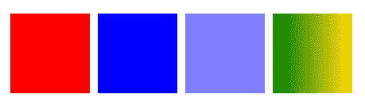

# 中风的属性

另一组非常有用的属性可以从 CSS 操作 SVG，它们与笔画有关。 所有的笔画属性都可以作为 CSS 属性使用。 与`fill`属性类似，这些属性在创建一致的界面和可视化时非常有用。

这个示例展示了作为基础类`stroke`的一部分`stroke`和`stroke-width`的用法。 这将设置一个常见的笔画样式，以便我们可以将其他笔画操作属性应用到示例中。 接下来，我们设置两个破折号属性`stroke-dashoffset`和`stroke-dasharray`，并使用`stroke-dasharray`和`stroke-dashoffset`类将其应用到前两个`rect`元素。 之后，我们使用`stroke-linecap-join`类将`stroke-linecap`应用于`line`元素。 接下来，我们将`stroke-linejoin-round`类应用到最后一个`rect`元素。

The `property/value` pairs match the same patterns you learned about in [Chapter 2](02.html), *Getting Started with Authoring SVG*, when you initially learned about these presentation attributes. 

所有这些都可以作为 CSS 属性使用，这可以帮助你为 SVG 文档中的元素创建一致的可重用的描边模式:

```html
<!doctype html>
<html lang="en">
    <head>
        <meta charset="utf-8">
        <title>Mastering SVG- CSS Stroke Properties</title>
        <link href="https://fonts.googleapis.com/css?
         family=Raleway:400" rel="stylesheet"> 

        <style type="text/css">
            .stroke {
                stroke-width: 10px;
                stroke: royalblue;
            }
            .stroke-dasharray {
                stroke-dasharray: 10;
            }
            .stroke-dashoffset {
                stroke-dashoffset: 25;
            }
            .stroke-linecap-square {
                stroke-linecap: square;
            }
            .stroke-linejoin-round{
                stroke-linejoin: round;
            }
            .stroke-opacity{
                stroke-opacity: .5;
            }
        </style>
    </head>
    <body>
      <svg  width="550" height="300" 
       viewBox="0 0 550 300">
        <rect x="50" y="15" width="300" height="50" fill="none"
        class="stroke stroke-dasharray"></rect>
        <rect x="50" y="80" width="300" height="50" fill="none"
        class="stroke stroke-dasharray stroke-dashoffset"></rect>
        <line x1="50" y1="160" x2="350" y2="160" class="stroke stroke-
          linecap-square"></line>
        <rect x="50" y="180" width="300" height="50" fill="none"
        class="stroke stroke-linejoin-round"></rect>
       </svg>
    </body>
</html>
```

在浏览器中呈现的上述代码产生如下输出:

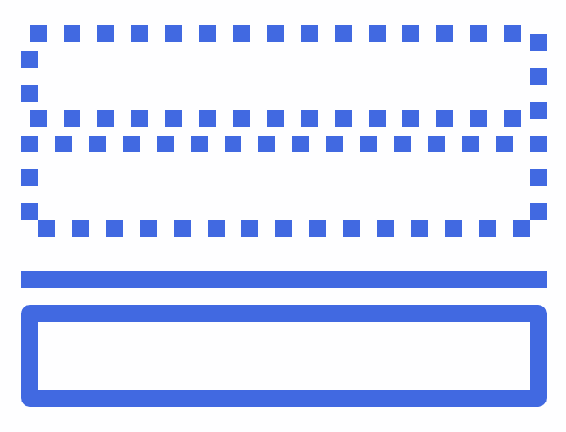

# 文本属性

本节将介绍一些 svg 特定的文本属性。 前几个示例处理 SVG 中的文本基线。 根据您所做的工作类型，您可能永远不需要调整文本元素的基线(一行文本所在的视觉平面)。 但你可能不得不*，特别是当你在处理多语言布局或复杂的基于文本的插图(如 logo)时。 所以介绍这些性质是值得的。 与基线相关的属性是`alignment-baseline`、`dominant-baseline`和`baseline-shift`。*

 *除此之外，本节还将研究`text-anchor`属性，该属性更改`text`元素的锚点。

作为对基线属性的简要说明，它们还有更多的内容，但下面的描述将为您提供足够的基础，以了解代码示例中发生的情况。 这是*可能*足够你通过使用这些属性:

*   `dominant-baseline`用于调整`text`元素的基线
*   `alignment-baseline`用于调整子元素相对于其父元素`text`的基线的基线
*   `baseline-shift`可能是最有用的，它通过向上或向下移动主导基线来提供常见的*下标*和*上标*功能

`dominant-baseline`和`alignment-baseline`接受相似值。 这里使用的两个是*挂起的*，将文本放到文本框的底部，以及*中间的*，将文本垂直地放在文本框的底部。 在本例中，`dominant-baseline`应用于具有两个不同值的`text`元素，`alignment-baseline`应用于具有两个不同值的两个不同子元素`tspan`。

然后，使用`baseline-shift`的`super`和`sub`值创建常见的上标和下标模式。

最后，`text-anchor`属性通过三个不同的值应用于视口中居中的文本元素来说明。 `text-anchor`将文本对齐文本框中的`start`、`middle`和句子中的`end`。

下面的代码示例演示了这些基线属性的用法以及`text-anchor`属性的用法:

```html
<!doctype html>
<html lang="en">

<head>
    <meta charset="utf-8">
    <title>Mastering SVG- SVG-specific CSS Text Properties</title>
    <link href="https://fonts.googleapis.com/css?family=Raleway:400"
      rel="stylesheet">

    <style type="text/css">
     .text {
         font-family: Raleway, sans-serif;
         font-size: 1.5em;
     }
     .dominant-hanging {
         dominant-baseline: hanging;
     }
     .dominant-middle {
         dominant-baseline: middle;
     }
     .alignment-hanging {
         alignment-baseline: hanging;
     }
     .alignment-middle {
         alignment-baseline: middle;
     }
     .sub {
        baseline-shift: sub;
    }
    .super {
        baseline-shift: super;
    }
    .text-anchor-start{
        text-anchor:start;
    }
    .text-anchor-middle{
        text-anchor:middle;
    }
    .text-anchor-end{
        text-anchor:end;
    }
    </style>
</head>

<body>
    <svg  width="400" height="550"
      viewBox="0 0 400 550">
        <rect width="400" height="25" x="0" y="0" fill="#cccccc" />
        <rect width="400" height="25" x="0" y="25" fill="#efefef" />
        <rect width="400" height="25" x="0" y="50" fill="#cccccc"/>
        <rect width="400" height="25" x="0" y="75" fill="#efefef"/>
        <rect width="400" height="25" x="0" y="100" fill="#cccccc"/>
        <rect width="400" height="25" x="0" y="125" fill="#efefef"/>
        <rect width="400" height="25" x="0" y="150" fill="#cccccc"/>
        <rect width="400" height="25" x="0" y="175" fill="#efefef"/>
        <rect width="400" height="25" x="0" y="200" fill="#cccccc"/>
        <rect width="400" height="25" x="0" y="225" fill="#efefef"/>
        <rect width="400" height="25" x="0" y="250" fill="#cccccc"/>
        <rect width="400" height="25" x="0" y="275" fill="#efefef"/>
        <rect width="400" height="25" x="0" y="300" fill="#cccccc"/>
        <rect width="400" height="25" x="0" y="325" fill="#efefef"/>
        <rect width="400" height="25" x="0" y="350" fill="#cccccc"/>
        <rect width="400" height="25" x="0" y="375" fill="#efefef"/>
        <rect width="400" height="25" x="0" y="400" fill="#cccccc"/>
        <rect width="400" height="25" x="0" y="425" fill="#efefef"/>

        <line x1="200" y1="300" x2=
        "200" y2="325" stroke="red"></line>
        <line x1="200" y1="350" x2=
        "200" y2="375" stroke="red"></line>
        <line x1="200" y1="400" x2=
        "200" y2="425" stroke="red"></line>
        <text class="text dominant-hanging" x="50"
          y="25">Hanging</text>
        <text class="text dominant-middle" x="50" y="75">Middle</text>
        <text class="text" x="50" y="125">Text <tspan class="alignment-
         hanging">Hanging</tspan></text>
        <text class="text" x="50" y="175">Text <tspan class="alignment-
         middle">Middle</tspan></text>
        <text class="text" x="50" y="225">Super<tspan
         class="super">sup</tspan></text>
        <text class="text" x="50" y="275">Sub<tspan 
         class="sub">sub</tspan></text>
        <text class="text text-anchor-start" x="200" y="325">Text
          Anchor Start</text>

        <text class="text text-anchor-middle" x="200" y="375">Text
         Anchor Middle</text>

        <text class="text text-anchor-end" x="200" y="425">Text Anchor 
         End </text>

    </svg>
</body>

</html>
```

呈现在浏览器中，这些效果在下面的截图中可见:

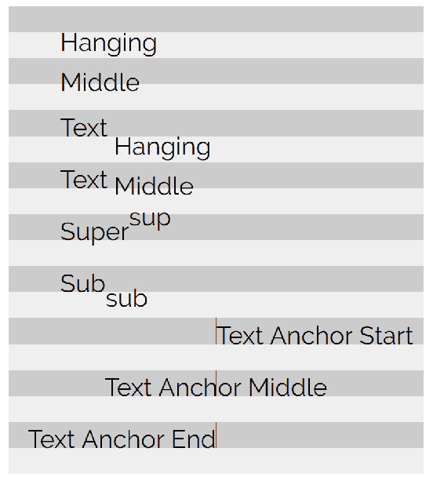

较暗的带显示基于文本元素的*x*，*y*位置的初始文本框。 你可以看到`hanging`和`middle`在参考*x*，*y*位置时，字体的基线发生了明显的偏移。

通过添加一行来说明`text-anchor`示例，该行表示这些文本元素的`(x,y)`位置。 它们被放在 SVG 元素的中心，这说明了该属性对文本元素的影响。

# 合成属性

目前浏览器对合成属性的支持相当糟糕。 在撰写本文时，微软并没有完全支持`clip`属性，而且掩码属性的支持也很糟糕)。 这是不幸的，因为它们为定义和重用剪贴路径和遮罩提供了强大的选项。

我将要展示的一个工作示例演示了如何使用 CSS 定义`clip-path`。 有两种变体。 第一个简单地通过`id`引用`clipPath`元素。 这很简单，可以在现代浏览器中工作。

第二个示例允许对关注点进行更大的分离。 您可以直接向 CSS 提供多边形坐标，而不是必须定义一个带有路径的元素来进行剪切。 `polygon`、`circle`和`inset`是此属性的可用值。 此语法替换了现在已弃用的`clip`属性。 如果您熟悉`clip`，那么应该注意以下几点。 首先，请注意，没有对`rect`值的直接替代。 值得庆幸的是，正如我们在这里显示的，多边形已经足够取代`rect`。 其次，`clip-path`而不是**是否要求元素必须绝对定位(尽管，在 SVG 中使用该属性时这不是一个特别关注的问题)。**

 **多边形值的语法与用于`polygon`元素的`path`属性的语法略有不同。 逗号不是任意的，只是为了便于阅读(就像 path 元素的 d 属性那样)，这个 CSS 属性中的点对需要用逗号分隔并需要单位。 否则，它的工作方式与 SVG 中的`polygon`相同。

这个例子复制了在`clipPath`例子中看到的矩形，通过映射出的点为`polygon`:

```html
<!doctype html>
<html lang="en">

<head>
    <meta charset="utf-8">
    <title>Mastering SVG- CSS Compositing Properties</title>
    <link href="https://fonts.googleapis.com/css?family=Raleway:400" 
      rel="stylesheet">

    <style type="text/css">
      .clip-url{
        clip-path: url(#box);
      }
      .clip-polygon {
        clip-path: polygon(50% 0, 100% 0, 100% 100%, 50% 100%, 50% 0)
      }
    </style>
   </head>
   <body>
     <svg  width="240" height="240"
       viewBox="0 0 240 240" version="1.1">
       <defs>
         <clipPath id="box" maskUnits="userSpaceOnUse" x="0" y="0" 
           width="240" height="240">

             <rect x="120" y="0" width="240" height="240" fill="red" >
             </rect>
         </clipPath>
         <polygon id="star" points="95,95 120,5 150,95 235,95 165,150 
           195,235 120,180 50,235 75,150 5,95"></polygon>
       </defs> 
       <use href="#star" fill="red"></use>
       <use href="#star" fill="black" class="clip-url"></use>
     </svg>
     <svg  width="240" height="240"
        viewBox="0 0 240 240" version="1.1">
      <defs>
        <polygon id="star" points="95,95 120,5 150,95 235,95 165,150 
          195,235 120,180 50,235 75,150 5,95"></polygon>
      </defs> 
      <use href="#star" fill="red"></use>
      <use href="#star" fill="black" class="clip-polygon"></use>
    </svg>
   </body>
</html>

```

在浏览器中呈现，你会得到以下输出:


正如我所提到的，对`mask`属性的支持是有问题的，所以我还没有完全实现的示例。 这里定义了三种模式:

*   第一个类似于`clip-path`属性。 你可以定义一个`mask-image`属性，并通过`url`将一个蒙版图像传递给它:

```html
.mask{
    mask-image: url(mask.svg);
}
```

*   第二种选择是使用片段标识符链接图像的一部分:

```html
.mask-fragment{
    mask-image: url(mask.svg#fragment);
}
```

*   第三个，也是最有趣的选项，允许你在属性值中创建遮罩:

```html
.mask-image {
    mask-image: linear-gradient(rgba(0, 0, 0, 1.0), transparent);
}
```

这项技术还没有准备好，但是很有必要知道即将发生什么，特别是它允许您只使用 CSS 类重用在中心位置定义的掩码。

# 交互属性

我们要看的最后一个 CSS 属性是`pointer-events`属性。 属性指示 SVG 元素是否可以成为指针事件的目标(包括所有输入，包括鼠标、笔或触摸输入)。

实现`pointer-events`的基本方法是打开或关闭它们。 下面的示例演示了实际情况。 本例还将包含一些 JavaScript，因此您可以先了解[第 6 章](06.html)、*JavaScript 和 SVG*，在这里我们将直接使用 JavaScript 处理 SVG。

在这个示例中，我们有两个`rect`元素。 其中一个设置了一个 class`pointer-default`。 该类只有一个属性`pointer-events`，该属性被设置为`visiblePainted`。 `visiblePainted`是 SVG 元素上的`pointer-events`的默认值。 它表示元素的整个可见绘制区域应该接受鼠标事件。 这意味着边界和填充。

第二个`rect`有一个类`pointer-none`。 其单个属性`pointer-events`的值为`none`。 这表明元素不应该接收鼠标事件。

在页面的底部有一个小 JavaScript 块，它显示了实际的属性。 它还说明了在使用 SVG 和 JavaScript 时可能遇到的不同。 在其中，我们使用一些核心**文档对象模型**(**DOM**)方法将一个点击事件处理程序附加到每个`rect`元素上。 首先，我们使用`document.querySelectorAll`来获取对页面上所有`rect`元素的引用。 如果您不熟悉它，可以将`querySelectorAll`看作是著名 jQuery 接口的标准的浏览器原生版本。 传入一个 CSS 选择器，它返回一个包含查询结果的静态`nodeList`。

我们立即使用方便方法`forEach`循环遍历类似数组的`nodeList`，并将事件处理程序附加到每个节点。 此事件处理程序设计用于每当单击一个正方形时更改相邻`text`元素的文本。

If you're used to using `innerHTML` to set text content, you will notice the property `textContent` used here instead. Why? SVG doesn't have an `innerHTML` (*which makes sense, since it's not HTML*). 

在浏览器中运行它，您将看到只有单击带有默认值`pointer-events`的`rect`才会更改文本。 将`pointer-events`设置为`none`的`rect`不会做任何事情:

```html
<!doctype html>
<html lang="en">

<head>
    <meta charset="utf-8">
    <title>Mastering SVG- CSS Compositing Properties</title>
    <link href="https://fonts.googleapis.com/css?family=Raleway:400" 
      rel="stylesheet">

    <style type="text/css">
      .pointer-default {
        pointer-events: visiblePainted;
      }
      .pointer-none {
        pointer-events: none;
      }

    </style>
   </head>
   <body>
     <svg  width="500" height="250" 
      viewBox="0 0 500 250" version="1.1">
       <rect x="10" y="10" width="100" height="100" class="pointer-
         default" fill="red"></rect>
       <rect x="120" y="10" width="100" height="100" class="pointer-
          none" fill= "red"></rect>
       <text x="10" y="150" id="text"></text>
    </svg>
    <script>
      document.querySelectorAll("rect").forEach(function(element){
        let classname = element.className.baseVal;
        element.addEventListener("click",()=>{
          document.getElementById("text").textContent= `clicked
           ${classname}`
        });
      });
    </script>
   </body>
</html>
```

下图显示了两个`rect`元素被点击后的页面:

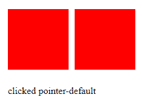

下表说明了此属性的其他可能值。 在与 SVG 元素交互的方式上，它们提供了许多控制。 取决于你计划做多少精确的互动，你可能最终会利用这种精确:

| 财产 | 定义 |
| `visiblePainted` | 如果`visibility`属性被设置为`visible`并且指针位于*绘制区域*上，元素就可以被指向。 使用此值，绘制区域包括`stroke`(如果它被设置为`none`以外的值)和`fill`(如果它被设置为`none`以外的值)。 |
| `visibleFill` | 如果`visibility`属性被设置为`visible`并且指针位于内部(`fill`区域)上，那么该元素就可以成为目标，无论`fill`是否被设置。 |
| `visibleStroke` | 如果`visibility`属性被设置为`visible`并且指针位于周长(`stroke`区域)之上，那么该元素就可以被锁定，无论`stroke`是否被设置。 |
| `visible` | 如果`visibility`属性设置为`visible`且指针位于内部或周长之上，则该元素可以作为目标，无论填充或描边是否设置。 |
| `painted` | 如果`visibility`属性被设置为`visible`并且指针位于*绘制区域*上，元素就可以被指向。 使用此值，绘制区域包括`stroke`(如果它被设置为`none`以外的值)和`fill`(如果它被设置为`none`以外的值)。 `visibility`房产的价值没有被考虑在内。 |
| `fill` | 如果指针位于内部(`fill`区域)上，无论填充是否设置，元素都可以作为目标。 `visibility`财产的价值没有考虑在内。 |
| `stroke` | 如果指针在周长(`stroke`区域)之上，无论填充是否设置，元素都可以作为目标。 `visibility`财产的价值没有考虑在内。 |
| `all` | 如果指针位于元素的内部或周长之上，则可以将元素作为目标。 笔划、`fill`和`visibility`属性的值没有考虑在内。 |
| `none` | 元素不接收指针事件。 |

# 独立 SVG 图像中的样式

虽然到目前为止的所有示例都是关于 HTML 文档中的内联 SVG，但您也可以在独立的 SVG 图像中使用 CSS。 下面的 SVG 图像显示了使用 CSS 调整多个 SVG`text`元素的显示。 有趣的细节包括**字符数据**(`<![CDATA[ ]]>`)块包装`style`元素中包含的样式:

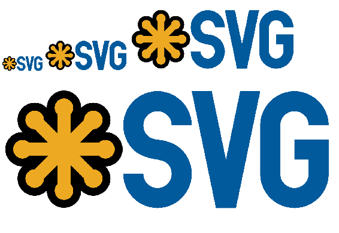

如果你还没有处理大量 XML(这并不是像以前那么常见了,这可能是这样),`CDATA`用于指示部分可能包含字符的 XML 解析器,可以解释为 XML,但不应该。 JavaScript(包括`<`和`>`)是最常见的用例(如果您在 1999 年创建网站，您就会知道它)，但 CSS 可能也会落入同样的陷阱，所以在这里也使用它很好。

下一件要注意的事情是没有外部样式表。 如果要创建一个将作为`img src`导入的 SVG 图像，或者作为 CSS 中的背景图像，那么它需要完全独立。

除此之外，它的工作原理很像 HTML 和 CSS 的组合，你可能很熟悉:

```html
<?xml version="1.0" encoding="UTF-8"?>
    <svg  width="250" height="250" viewBox="0 0 250 250" version="1.1">
    <style>
      <![CDATA[
          text {
            font-family: Verdana, Geneva, sans-serif;
            fill: slategray;
          }
          .palatino{
            font-family: Palatino, "Palatino Linotype", "Palatino LT
            STD", "Book Antiqua", Georgia, serif;
          }
          .big-green{
            fill: forestgreen;
            font-size: 2rem;
            opacity: .75;
          }
          .huge-blue{
            fill: dodgerblue;
            font-size: 4rem;
          }
          .medium-deep-pink{
            fill: deeppink;
            font-size: 1.5rem;
          }
          .bigger {
            font-size: 6rem;
          }
          .text-anchor-middle{
            text-anchor: middle;
          }
          .text-baseline-middle{
            dominant-baseline: middle;
          }
          .half-opacity{
            opacity: .5;
          }
        ]]>
       </style>
          <text x="20" y="20" class="big-green">Styles</text>
          <text x="-10" y="50" class="huge-blue palatino">Styles</text>
          <text x="66" y="40" class="medium-deep-pink half
           opacity">Styles</text>
          <text x="77" y="77" class="big-green">Styles</text>
          <text x="55" y="66">Styles</text>
          <text x="100" y="125" class="medium-deep-pink 
           bigger">Styles</text> 
          <text x="175" y="33" class="big-green">Styles</text>
          <text x="220" y="44" class="huge-blue half-
            opacity">Styles</text>
          <text x="-20" y="244" class="huge-blue bigger half-
            opacity">Styles</text>
          <text x="120" y="120" class="medium-deep-pink">Styles</text>
          <text x="14" y="166" class="big-green palatino">Styles</text>

          <text x="136" y="199" class="huge-blue palatino half-
            opacity">Styles</text>
          <text x="170" y="144" class="huge-blue">Styles</text>
          <text x="-40" y="144" class="huge-blue half-
            opacity">Styles</text>
          <text x="143" y="24" class="big-green">Styles</text> 
          <text x="125" y="125" class="bigger text-anchor-middle text- 
            baseline-middle">Styles</text> 
      </svg>
```

在浏览器中呈现的图像如下:

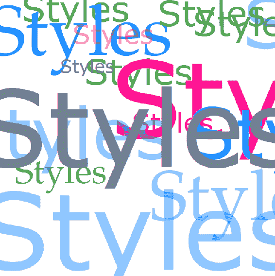

# 基本的 CSS 动画和 SVG 转换

使用 SVG 和 CSS 最有趣的方法之一是使用 CSS*动画*和*过渡*。

*   **动画**:这允许你为元素分配动画。 这些动画被定义为对 CSS 属性的一系列更改。
*   **Transitions**:这允许你控制 CSS 属性改变生效的时间。 它们*不是立即改变，而是在状态之间转换*。

这些特性非常强大，是 SVG 工具包中重要的概念和技术补充。

# CSS 动画

SVG 中的 CSS 动画的工作方式与 HTML 中的相同，只是增加了使用 SVG 特定属性的能力。

# 基本的动画格式

基本模式如下。 SVG 是简单的。 它是一个单一的`rect`元素。 CSS 有两个有趣的组件。 第一个是类`rect`，它引用一个属性`animation`。 `animation`; 这是一个简单的属性，它映射到整个系列的`animation-`属性。 在这个例子中，我们设置了两个。 第一个映射属性是`animation-name`，它引用了在`@keyframes`动画中定义的名为`movement`的动画。 我们设置的第二个是`animation-duration`，我们将其设置为 3 秒(`3s`)。 `@keyframes`动画是奇迹发生的地方。 在它中，我们设置了两组关键帧。 第一个集合标记具有相同属性的动画的初始(`0%`)和最终状态(`100%`)，一个带有`translate`函数设置为`(0,0)`的 CSS`transform`。 这是初始(和结束)状态。 我们将在下一个关键帧中针对`transform`属性进行动画。 在它中，设置为动画(`50%`)的中间，我们将`rect`向右平移 400 像素:

```html
<!doctype html>
<html lang="en">

<head>
    <meta charset="utf-8">
    <title>Mastering SVG- CSS animation</title>

    <style type="text/css">
    .rect {
      animation: movement 3s;
    }

    @keyframes movement {
      0%, 100% {
        transform: translate(0, 0);
      }
      50% {
        transform: translate(400px, 0);
      }
    }

    </style>
   </head>
   <body>
     <svg  width="500" height="100" 
       viewBox="0 0 500 100" version="1.1">
      <rect x="0" y="0" width="100" height="100" class="rect">
    </svg>
   </body>
</html>
```

其效果是，矩形缓慢地从左到右移动，然后再返回，如下所示:

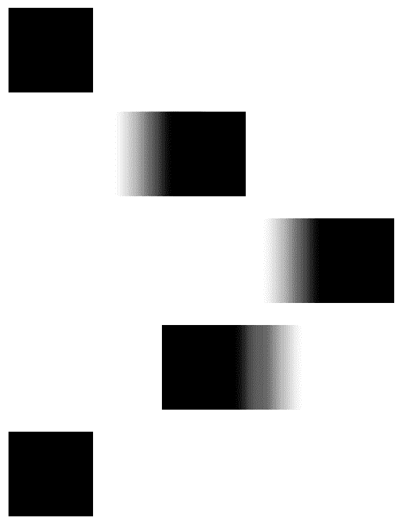

# 动画剪辑路径

一个相对简单的例子(从 CSS 的角度来看)显示了 SVG 动画的强大，那就是动画剪辑路径。 使用我们刚刚了解的`polygon`选项，您可以在定义为`clip-path`的两个(或多个)形状之间进行动画操作。 如果它们有相同数量的*点*，浏览器将在动画中定义的关键帧位置之间平滑地动画。

下面的示例说明了这一点。 在这个例子中，我们创建了一个类`stars`:

*   `stars`有一个`animation`属性。 它引用稍后在样式表中定义的`@keyframe stars`块。
*   第二个你已经熟悉的论点，`animation-duration`。 再次设置为 3 秒。
*   第三个属性对您来说可能是新的。 属性值`infinite`映射到`animation-iteration-count`属性。
*   `animation-iteration-count`可以接受一个数字，表示动画应该运行的特定次数，也可以接受关键字`infinite`，它表示动画应该永远播放。

`@keyframes`遵循与前一个动画相同的模式。 我们有等效的开始和结束状态(0%和 100%)。 这些被定义为一个多边形`clip-path`，它表示一个星星。 动画的中点(`50%`)，将多边形重新定义为正方形。 由于动画状态之间的点数量需要相等，这意味着我们在这些状态之间定义了多于 4 个点的动画:

```html
<!doctype html>
<html lang="en">

<head>
    <meta charset="utf-8">
    <title>Mastering SVG- CSS animation</title>

    <style type="text/css">
    .stars {
      animation: stars 3s infinite;
    }

    @keyframes stars {
      0%, 100% {
        clip-path: polygon(95px 95px, 120px 5px, 150px 95px, 235px 
         95px, 165px 150px, 195px 235px, 120px 180px, 50px 235px,75px
         150px, 5px 95px)
      }
      50% {
        clip-path: polygon(10px 10px, 120px 10px, 230px 10px, 230px 
        120px, 230px 180px, 230px 230px, 120px 230px, 10px 230px, 10px
        180px, 10px 120px)
      }
    }

    </style>
   </head>
   <body>
     <svg  width="240" height="240"
      viewBox="0 0 500 500" version="1.1">
      <image href="take-2-central-2017.jpg" width="1000" height="500" 
       x="0" y="0" class="stars"></image>
    </svg>
   </body>
</html>
```

下面的延时截图显示了动画在运行的三秒钟内是如何展开的。 一定要在支持它的浏览器中运行，看看这个效果有多有趣:

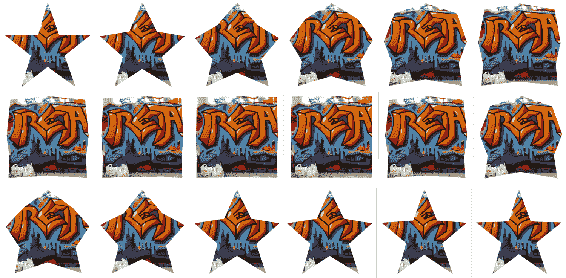

# 动画多个属性和分配多个动画到一个元素

关于动画还有两点需要注意:

*   你可以让多个 CSS 属性同时动起来
*   您还可以对同一个元素应用多个动画

下面的代码示例展示了这两个特性是如何工作的。 有三个重要的部分。 第一类是单类`rect`。 它有*两个*逗号分隔的参数用于`animation`属性，以及动画`box`和`change-color-and-fade`。 `box`定义了两个正方形`clip-path`属性，一个`50`像素距离矩形的边缘，另一个`10`像素距离矩形的边缘。 `change-color-and-fade`改变背景色从红色到蓝色，不透明度从`.5`到`1`:

```html
<!doctype html>
<html lang="en">

<head>
  <meta charset="utf-8">
  <title>Mastering SVG- CSS animation</title>
  <style type="text/css">
    svg {
      background: lightgray;
    }
    .rect {
      animation: box 3s infinite, change-colors-and-fade 3s infinite;
    }
    @keyframes box {
      0%,
      100% {
        clip-path: polygon(50px 50px, 200px 50px, 200px 200px, 50px 
        200px)
      }
      50% {
        clip-path: polygon(10px 10px, 240px 10px, 240px 240px, 10px 
        240px)
      }
    }
    @keyframes change-colors-and-fade {
      0%,
      100% {
        opacity: .5;
        fill: rgb(255, 0, 0);
      }
      50% {
        opacity: 1;
        fill: rgb(0, 0, 255);
      }
    }
  </style>
</head>

<body>
  <svg  width="250" height="250"
   viewBox="0 0 250 250" version="1.1">
    <rect x="0" y="50" width="250" height="50" fill="gray"></rect>
    <rect x="0" y="0" width="250" height="250" class="rect"></rect>
  </svg>
</body>

</html>
```

在浏览器中运行，动画经历以下几个阶段:

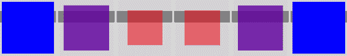

# CSS 转换

在本章中，我们将要学习的最后一个 CSS 属性是 CSS`transition`属性。 `transition`允许您定义浏览器在属性值的变化之间进行动画的方式。 它们可以更平稳地转换，而不是立即改变属性。

下面的示例展示了这是如何工作的。 其中有一个小的单值条形图，当用户将鼠标悬停在条形图上时，该条形图就会填充，显示针对目标的想象进度。

CSS 中充满了定义文本的类。 你会注意到你在本章学到的许多属性。 除了这些，在本章中使用它们之后，您至少应该对它们有一些熟悉，还有定义条形图的类，其中一个比另一个更有趣。

第一个，`the-bar`，定义了条形图的轮廓。 第二个，`fill-the-bar`，定义了 bar 的*进度*部分。 它没有描边，只有绿色填充。 对于我们的目的，有趣的部分是`transition`属性。 是一组相关`transition-`属性的简写。 在这个例子中，我们使用了`transition-property`(`transform`)和`transition-duration`(`3s`)。 这表明浏览器应该观察对该元素上的`transform`属性的更改，并在三秒内将更改转换到该属性。 同样在这个类中，我们定义一个值为`1`的`scaleY transform`，并将`transform`锚定到具有`transform-origin`的元素的`bottom`。 我们需要一个基线`scaleY`，这样浏览器就有一个匹配的属性来进行动画。 `fill-the-bar:hover`将刻度改为`7.5`，根据配置方式，该刻度将填满目标的`75%`条:

```html
<!doctype html>
<html lang="en">
<head>
  <meta charset="utf-8">
  <title>Mastering SVG- CSS Transitions</title>
  <link href="https://fonts.googleapis.com/css?family=Raleway:400" 
   rel="stylesheet">

  <style type="text/css">
    .text {
      font-family: Raleway, sans-serif;
      font-size: 1.5em;
    }

```

```html
    .smaller-text {
      font-size: 1em;
    }

    .the-bar {
      stroke: black;
      stroke-width: 2px;
      fill: none;
    }

    .fill-the-bar {
      transition: transform 2s;
      transform: scaleY(1);
      transform-origin: bottom;
      stroke: none;
      fill: green;
      cursor: pointer;
    }

    .fill-the-bar:hover {
      transform: scaleY(7.5);
    }

    .dominant-baseline-hanging {
      dominant-baseline: hanging;
    }

    .dominant-baseline-middle {
      dominant-baseline: middle;
    }

    .text-anchor-end {
      text-anchor: end;
    }
  </style>
</head>

<body>
  <svg  width="250" height="500" 
   viewBox="0 0 250 500" version="1.1">
    <text class="text" x="10" y="25">Our Progress</text>
    <text x="90" y="50" class="dominant-baseline-hanging smaller-text
     text-anchor-end">100%</text>
    <text class="text smaller-text text-anchor-end" x="90" y="250">0%
    </text>
    <text class="text smaller-text text-anchor-end dominant-baseline-
     middle" x="90" y="150">50%</text>

    <rect x="100" y="50" height="200" width="50" class="the-bar">
    </rect>
    <rect class="fill-the-bar" x="100" y="230" height="20" width="50" 
     fill="green"></rect>
  </svg>
</body>

</html>
```

在浏览器中运行; 过渡的速度很慢，直到它填满适当的空间:


# 总结

这一章你学到了很多东西。 CSS 是快速、可维护的现代网站和应用程序的关键技术之一，理解 SVG 和 CSS 之间的交集是很重要的。

本章首先详细介绍了在 CSS 背景图像中使用 SVG 的常见用例，包括使用 SVG 数据 url 的有趣细节。

在此之后，您了解了 SVG 精灵和图标集，以及如何以及为什么可以使用它们来代替目前在 web 上非常流行的常见字体图标集。

在此之后，您学习了内联 SVG 的样式化，包括操作字体和文本行流的详细方法。 接下来，您了解了许多 svg 特定的属性，包括控制元素的`fill`、`stroke`和文本的属性。 在此之后，您了解了一些最先进的合成属性，如`clip-path`和`mask-image`，这些属性非常强大，即使浏览器支持还不完全。

在此之后，您了解了如何使用 CSS 提高独立 SVG 图像的一致性和简化创作。

最后，您学习了基本的 CSS 动画和 SVG 转换，这是一种强大的模式，可以为站点和应用程序添加交互性和移动。

接下来，我们将学习如何将 SVG 添加到页面上并确保它看起来正确，我们将添加 JavaScript，这样我们就可以开始以越来越有趣的方式与 SVG 交互。***