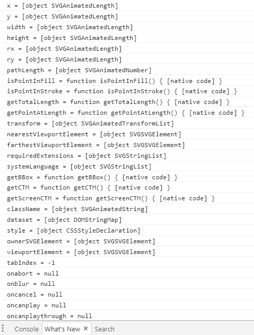
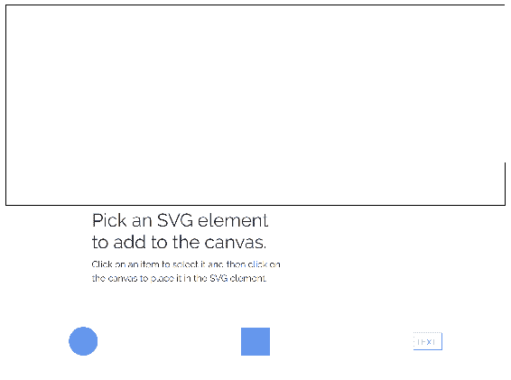
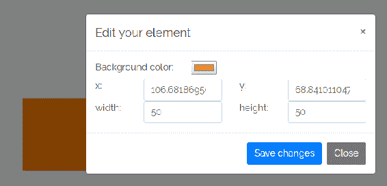

# 六、JavaScript 和 SVG

到目前为止，您已经在本书中了解了有关 SVG 的很多内容。 您已经花了很多时间研究 SVG 规范的细节以及 SVG 与 CSS 和 HTML 交互的不同方式。 希望你和我一样对它感兴趣。

有趣的是，在这一章中，我们将把*所有*工具放在一起，真正释放 SVG 的力量。 将 JavaScript 添加到混合中会带来大量新的可能性。

当然，有许多 web 开发人员和设计师永远不会使用 SVG 进行动画、动态可视化或其他交互工作。 对于他们来说，充分理解 SVG 本身作为标记的工作方式以及它如何与其他静态 web 技术相适应是非常有价值的。 对于我们刚刚详细了解的 SVG 和 CSS 之间的交集，这一点尤其正确。

也就是说，SVG 最令人兴奋的地方在于它可以很容易地与 JavaScript 一起工作来增强站点的交互性。 所有这些开放网络技术被设计成以一种比单个规范的总和更大的方式共同工作。 即使有独立处理所有这些不同的技术专家,他们这样做公开(大部分),一般来说,更大的组织的一部分,如微软、谷歌或 Mozilla,因此有一个真正的欲望,以确保这些技术以最好的方式一起工作。

SVG 和 JavaScript 的交集就是这样一种情况。

在本章中，我们将学习 JavaScript 和 SVG 之间的底层接口。 这包括到 SVG 的 DOM 接口。 这是很重要的东西，尽管我们还将学习使用 SVG 的库和框架。 即使你已经从事过一段时间的 web 开发，并且熟悉 JavaScript 和 DOM，常规 HTML DOM 和 SVG 元素的界面之间的区别也很重要。 如果您对原始 DOM 操作不太熟悉(许多从 jQuery 时代开始的开发人员以及之后的开发人员都不太熟悉)，那么本章将为您提供一整套有用的技能。

在本章中，我们将学习以下内容:

*   SVG 的基本 DOM 接口——基本访问和操作 JavaScript 中的 SVG 元素
*   SVG-specific DOM 接口
*   动态地使用 SVG 和 CSS

# JavaScript 版本和工具

在我们进入代码之前，我认为有必要回顾一下不同的 JavaScript 版本以及它们将如何在书中使用。 我还想介绍一下如何展示需要使用工具的示例。

# JavaScript 版本

您可能已经知道，在过去几年里，围绕着 JavaScript 编程语言的发展进行了大量的工作。 其中一些工作真的，真的很棒。 事实上，现在网络上的主流库和框架都是用 JavaScript 的版本和变体编写的，而这些版本和变体在网络浏览器中并不是普遍可用的。 在最新版本的工作语言,包括特定于框架的扩展,可能是因为使用 transpiler([https://scotch.io/tutorials/javascript-transpilers-what-they-are-why-we-need-them),一个软件,软件一种语言编写的代码(或在这种情况下, 一种语言的版本)，并输出另一种语言的代码(在本例中是一种较旧的、完全受支持的语言版本)。 这个转译步骤允许我们用自己喜欢的任何风格的 JavaScript 编写应用程序，然后将其转换为可以在任何地方运行的浏览器标准 JavaScript。](https://scotch.io/tutorials/javascript-transpilers-what-they-are-why-we-need-them)

本节概述了您将在本书中遇到的不同版本的 JavaScript。 下一节将简要介绍如何使用编译器来让您的尖端代码在普通 web 浏览器中运行所需的工具。

请注意，这是对这个主题最广泛的介绍。 更多的细节，随着它们的出现，将在本书的过程中涵盖，但即使这样也只是触及这个广泛话题的表面。

While I have called and will continue to call the language JavaScript throughout the book, that trademarked name (trademarked by Oracle, which got the trademark from Sun Microsystems, who in turn got the trademark from Netscape) is not the official name of the language. The language is officially called **ECMAScript**, based on Ecma ([https://www.ecma-international.org/](https://www.ecma-international.org/)), the organization which hosts the standards body that writes the specification.

# ECMAScript 5

**ECMAScript 5**(**ES5**)是目前浏览器中支持最充分的语言版本，是编译器的目标，因为它可以在任何地方运行。 这个版本在 2009 年被标准化，到撰写本文时为止，它已经在超过 90%的浏览器中获得了完全支持，在 97%的浏览器中获得了部分支持。 通过添加 ES5 polyfills([https://github.com/es-shims/es5-shim](https://github.com/es-shims/es5-shim))，您可以获得针对 ES5 的近乎全面的覆盖。 一些代码，特别是[第 7 章](07.html)中的 Angular 1 和 jQuery 部分，*常见 JavaScript 库和 SVG*中的代码，将直接写成 ES5。 这是因为大多数人都熟悉 Angular 1 和 jQuery 作为 ES5 风格的接口。 文件顶部的注释，如下所示，表明正在使用该版本:

```html
/*
 ECMAScript 5
 */
```

# ECMAScript 2015 

ECMAScript 2015 前身为**ECMAScript 6**(**ES6**)。 这个版本于 2015 年定稿，现在正在进入浏览器。 它在所有主流浏览器(Edge、Firefox、Chrome 和 Safari)的最新版本中都获得了部分支持。 一般来说，本书中编写的 JavaScript 代码，除了前面提到的例子，都将使用 ES6。 除了*React*部分使用更高级的特性和一些特定于 React 的扩展外，所使用的特性都在最新版本的 Chrome、Edge 和 Firefox 中得到支持。 因此，如果你使用这些浏览器中的一个，你不需要为这些示例运行一个编译器。 如果您希望将这些代码转移到生产环境中，那是另一回事，这超出了本书的范围。

文件顶部的注释，如下所示，表明正在使用该版本:

```html
/*
 ECMAScript 6
 */
```

# 打印稿

Angular([https://angular.io/](https://angular.io/))部分将用 TypeScript([https://www.typescriptlang.org/](https://www.typescriptlang.org/))编写。 Typescript 是 JavaScript 的一个超集，它通过使用类型注释添加了某些可选特性，最显著的是静态类型([https://www.typescriptlang.org/docs/handbook/basic-types.html](https://www.typescriptlang.org/docs/handbook/basic-types.html))。 TypeScript 被 Angular 团队用来为 Angular 的开发环境添加一些核心特性。 因为不是每个人都有 TypeScript 的经验，所以例子中的 TypeScript 语言特性会被指出来，把混淆降到最低。

好消息是，一旦脚本启动并运行，任何 Angular 组件的主体都可以写成普通的旧 JavaScript。

# 工具

到目前为止，我们还不需要在工具方面做太多工作。 几乎所有示例都可以在本地文件系统之外正常工作。

未来的情况未必如此。 在最简单的情况下，例如，任何需要发出 HTTP 请求的示例都将依赖于节点包服务([https://www.npmjs.com/package/serve](https://www.npmjs.com/package/serve))来设置一个简单的本地服务器。

特别是 React 和 Angular 的例子，需要更广泛的工具。 至少你需要安装 Node.js([https://nodejs.org/en/](https://nodejs.org/en/))，你必须遵循几个步骤来进行设置。 最后，你会有一个本地 web 服务器在运行，还有几个进程会监视你的 JavaScript 或 Typescript 文件的变化。 当你做出更改时，相关的流程将捕获这些更改并执行操作(例如，将代码从 Typescript 编译为 JavaScript)，以确保代码在本地服务器上更新。

在每一节中都将介绍如何设置和运行代码示例。

另外，请记住所有的工作代码都可以在 GitHub([https://github.com/roblarsen/mastering-svg-code](https://github.com/roblarsen/mastering-svg-code))上找到。

在完成所有这些之后，让我们看看一些代码，这些代码只需要一个更新的 web 浏览器就可以在本地运行。

# 到 SVG 的 DOM 接口

DOM 是用于访问、更新、创建和删除基于 xml 文档的元素、属性和内容的 API。 这包括相关但不严格的 XML 语法的文档，比如最新的 HTML 规范。

对于一般的开发人员来说，现在很少做大量纯 DOM 操作。 jQuery 在很多年前就解决了这个问题，但它再也没有流行起来。 根据经验，我可以说，知道 DOM 操作在底层是如何工作的仍然很有用，这样当您遇到所使用的库或框架没有提供的东西时，您就可以编写代码来摆脱绑定。

它还说明了使用不同技术时可用的可能性。 能够访问库或框架作者感兴趣的内容是一回事，但是如果您熟悉底层代码，那么您的想象力和目标浏览器中可用的内容就会受到限制。

SVG DOM 构建在 DOM 第 2 级规范([https://www.w3.org/TR/2000/REC-DOM-Level-2-Core-20001113/core.html](https://www.w3.org/TR/2000/REC-DOM-Level-2-Core-20001113/core.html))之上。 它支持任何有 DOM 和 HTML 经验的人所期望的大部分功能，并添加了几组特定于 SVG 的接口，您可以使用这些接口来操作 SVG 文档。

本节将介绍特定于 svg 的 DOM 方法的基本类，并说明它们的用法。 除非您正在编写一个库，否则您不需要知道关于这些低级工具的一切。 本章将作为一个介绍，所以你有一个很好的介绍，并知道要寻找什么。

# 初步探索

首先，让我们看看任意(和常见)SVG 元素`rect`上可用的一些 DOM 方法和属性。 为此，您可以转到`SVGRectElement`元素文档([https://developer.mozilla.org/en-US/docs/Web/API/SVGRectElement](https://developer.mozilla.org/en-US/docs/Web/API/SVGRectElement))。 这是个不错的选择。

您还可以使用所选浏览器的开发人员工具直接检查`rect`元素。 这看起来像下面的截图。 这将是许多人使用 SVG 元素的可用方法和属性的方式:


虽然这些都很常见，但您也可以执行以下操作，这是编写 SVG 脚本的一个很好的步骤。

在这个代码示例中，我们使用`document.getElementById`访问`rect`元素，并将其存储在变量`rect`中。 `document.getElementById`是一种常见的 DOM 访问方法，您将使用它访问 SVG 和 HTML 本身中的 DOM 元素。 在本章中，你会看到更多使用它的例子。

往下,然后循环的特性`for...in``rect`循环使用一个简单的循环,写的变量和属性到控制台使用括号,`prop`是一个属性或方法的名称`rect`元素:

```html
<!doctype html>
<html lang="en">

<head>
    <meta charset="utf-8">
    <title>Mastering SVG- SVG Basic SVG DOM Manipulation</title>
</head>

<body>
    <svg  width="500" height="500"
     viewBox="0 0 500 500" version="1.1">
        <rect x="20" y="20" fill="blue" width="460" height="460"
         id="rect"></rect>
    </svg>
    <script>
    /*
        ES6
    */
        document.addEventListener("DOMContentLoaded",()=> 
            const rect = document.getElementById("rect");
            for (let prop in rect){
                let val = rect[prop];
                console.log(`${prop} = ${val}`);
            }
        });
    </script>
</body>

</html>
```

输出如下面的截图所示。 您将注意到前几个属性和方法都是 svg 特定的。 除了下面截图中的屏幕，这个列表还包括其他几个屏幕，但是列表中的第一个屏幕都是特定于 SVG 的。 这是因为`for...in`【T1 的循环开始时的属性】,然后向原型链的特性`SVGGeometryElement`,一直到`SVGElement`,`Element`,`Node`(最通用的 DOM 接口)。 在这些特性中，有一些是非常明显和立即有用的，如`x`、`y`、`width`和`height`。

其他的可能没有那么明显有用，如`getBBox`或`isPointInFill`(尽管你可能能够猜到它们能做什么)，但你可以开始看到，当你能够访问一个元素时，有很多可用的元素:



以这些基本的基础和探索的思想为基础，让我们开始构建一个小应用程序，它允许您以简单的方式操作 SVG 画布。 下一节将重点介绍逐步构建一个小工具，该工具将允许您向 SVG 画布(`text`、`rect`和`circle`)添加简单的 SVG 元素，并以不同的方式操作它们。 这个小演示很容易理解，并将演示与 SVG 交互的许多不同方式。

# SVG DOM 操纵符

我们将要构建的应用程序将允许您单击并向 SVG 画布添加三种不同类型的 SVG 元素。 接口将允许您单击您想要添加项目(`rect`、`circle`或`text`),然后你可以在画布上单击并将该元素添加到屏幕上这些特定的`(x,y)`坐标。 选中该元素后，您就可以通过更改几个可用属性来编辑它。

这个示例将使用 Bootstrap 简化不同表单字段的布局，并创建一个简单的模式来编辑属性。 正因为如此，jQuery 也将被包含在内，尽管，至少在这个版本的演示中，jQuery 交互将被保持在最低限度; 我们将关注原始 DOM 操作。

完成后，它将像下面的截图所示，在屏幕顶部显示 SVG 画布，用黑色边框镶边。 在这之后，有一些简单的说明，然后在屏幕底部有三个按钮，让你选择一个矩形，一个圆，或一个文本元素添加到画布:



这一次，我们将不像在书中那样一次性添加整个代码示例并解释整个事情，而是构建示例并在浏览示例时讨论每个代码块。

让我们从页面的框架开始。 这个初始状态中没有任何 JavaScript，但它提供了一些结构和稍后会用到的工具。

在`head`我们从**链接引导内容分发网络**(**CDN),我们从谷歌链接 Raleway 字体字体,然后设置一些基本的样式对我们的页面,添加 Raleway 身体字体,把我们帆布 SVG 元素边框,然后改变我们的 SVG 雪碧按钮的颜色。**

在 body 中，我们将页面设置为具有响应性，使用 Bootstrap 的实用程序类创建一个填充整个屏幕宽度的流体布局。 SVG 元素将缩放到适合这个 Bootstrap 容器。

布局有两个部分:目标 SVG 元素(绘图将发生在这里)和用于 UI 控件的第二个部分。 目前，UI 控件只是围绕着 SVG 精灵的 3 个`button`元素。

接下来，我们有一个隐藏的 SVG 元素，其中包含一系列`symbol`元素，用于定义精灵。

最后，我们链接到一些第三方 JavaScript，以连接一些 Bootstrap 功能:

```html
<!doctype html>
<html lang="en">

<head>
  <meta charset="utf-8">
  <title>Mastering SVG- SVG Basic The DOM Manipulator</title>
  <link rel="stylesheet" 
   href="https://maxcdn.bootstrapcdn.com/bootstrap/4.0.0/css/bootstrap.
    min.css" integrity="sha384-
    Gn5384xqQ1aoWXA+058RXPxPg6fy4IWvTNh0E263XmFcJlSAwiGgFAW/dAiS6JXm"
    crossorigin="anonymous">
  <link href="https://fonts.googleapis.com/css?family=Raleway" 
    rel="stylesheet">
  <style type="text/css">
    body {
      font-family: Raleway, sans-serif;
    }
    svg.canvas {
      border: 1px solid black;
    }

    button svg {
      fill: cornflowerblue;
      stroke: cornflowerblue;
      max-width: 50px;
    }
  </style>
</head>

<body>

  <div class="container-fluid">
    <div class="row">
        <div class="col-12">
            <svg  viewBox="0 0 500 
              200" version="1.1" id="canvas" class="canvas">
            </svg>
        </div>
    </div>
    <div class="row">
      <div class="col-5 offset-2">
        <h2>Pick an SVG element to add to the canvas. </h2>
        <p>Click on an item to select it and then click on the canvas
             to place it in the SVG element.</p>
      </div>
    </div>
    <div class="row">
      <div class="col-4 text-center">
        <button class="btn btn-link" title="click to add a circle">
          <svg  role="img">
            <use xlink:href="#circle"></use>
          </svg>
        </button>
      </div>
      <div class="col-4 text-center" title="click to add a square">
        <button class="btn btn-link">

          <svg  role="img">
            <use xlink:href="#square"></use>
          </svg>
        </button>
      </div>
      <div class="col-4 text-center">
        <button class="btn btn-link" title="click to add a text box">
          <svg  role="img">
            <use xlink:href="#text"></use>
          </svg>
        </button>
      </div>
    </div>
  </div>

  <svg  style="display:none">
    <defs>
      <symbol id="circle" viewBox="0 0 512 512">
        <circle cx="256" cy="256" r="256"></circle>
      </symbol>
      <symbol id="square" viewBox="0 0 512 512">
        <rect x="6" y="6" height="500" width="500"></rect>
      </symbol>
      <symbol id="text" viewBox="0 0 512 512">
        <rect x="6" y="106" height="300" width="500" fill="none" 
            stroke-width="10px"></rect>
        <text x="6" y="325" font-size="150">TEXT</text>
      </symbol>
      <!--
      Font Awesome Free 5.0.2 by @fontawesome - http://fontawesome.com
      License - http://fontawesome.com/license (Icons: CC BY 4.0,
         Fonts: SIL OFL 1.1, Code: MIT License)
      -->
      <symbol id="edit" viewBox="0 0 576 512">
          <title id="edit-title">Edit</title>
          <path d="M402.6 83.2l90.2 90.2c3.8 3.8 3.8 10 0 13.8L274.4 
            405.6l-92.8 10.3c-12.4 1.4-22.9-9.1-21.5-21.5l10.3-
            92.8L388.8 83.2c3.8-3.8 10-3.8 13.8 0zm162-22.9l-48.8-
            48.8c-15.2-15.2-39.9-15.2-55.2 0l-35.4 35.4c-3.8 3.8-3.8 10 
            0 13.8l90.2 90.2c3.8 3.8 10 3.8 13.8 0l35.4-35.4c15.2-15.3 
            15.2-40 0-55.2zM384 346.2V448H64V128h229.8c3.2 0 6.2-1.3 
            8.5-3.5l40-40c7.6-7.6 2.2-20.5-8.5-20.5H48C21.5 64 0 85.5 0 
            112v352c0 26.5 21.5 48 48 48h352c26.5 0 48-21.5 48-
            48V306.2c0-10.7-12.9-16-20.5-8.5l-40 40c-2.2 2.3-3.5 5.3-
            3.5 8.5z"></path>
        </symbol>
    </defs>
  </svg>
  <script>

  </script>
  <script src="https://code.jquery.com/jquery-3.2.1.slim.min.js"
     integrity="sha384-KJ3o2DKtIkvYIK3UENzmM7KCkRr/rE9/Qpg6aAZGJwFDMVNA/GpGFF93hXpG5KkN"
    crossorigin="anonymous"></script>
  <script 
   src="https://cdnjs.cloudflare.com/ajax/libs/popper.js/1.12.9/umd/pop
    per.min.js" integrity="sha384-
    ApNbgh9B+Y1QKtv3Rn7W3mgPxhU9K/ScQsAP7hUibX39j7fakFPskvXusvfa0b4Q"
    crossorigin="anonymous"></script>
  <script 
   src="https://maxcdn.bootstrapcdn.com/bootstrap/4.0.0/js/bootstrap.mi
    n.js" integrity="sha384-
    JZR6Spejh4U02d8jOt6vLEHfe/JQGiRRSQQxSfFWpi1MquVdAyjUar5+76PVCmYl"
    crossorigin="anonymous"></script>
</body>

</html>
```

现在我们已经了解了页面的基础知识，让我们开始添加一些交互性。

Although we have jQuery on the page, I'm not going to use it for any of the DOM manipulations so that we can look at the raw interactions. We will look at jQuery and SVG in [Chapter 7](07.html), *Common JavaScript Libraries and SVG*, so don't fret.  

我们要做的第一件事是创建一些事件处理程序来处理不同的交互。 我们将添加的第一个事件处理程序是按钮上的`click`事件处理程序。 其思想是单击按钮将 SVG 元素加载到光标上，然后再次单击将其放置在画布上。 这段代码还没有处理将元素添加到 SVG 画布上的问题，但它说明了使用 SVG 和 JavaScript 时的一些问题。

在这个实例中，您从老式 DOM 操作中学到的一些东西可能会失败。 如果您一直在直接操作 HTML DOM，那么您可能已经习惯了使用`Element.className`属性。 在 HTML 元素上，`className`属性是一个`read/write`字符串，它映射到 HTML 元素上的`class`属性。 在该上下文中，您可以操作字符串，并将更改反映到 DOM 中。

DOM 接口`SVGElement`确实有`className`属性，但它不是一个简单的字符串。 它是一个带有两个字符串值`AnimVal`和`BaseVal`的`SVGAnimatedString`属性。 因为有了这个额外的层，而且我选择的替代方案的接口更现代、更清晰，所以我决定使用`SVGElement.classList`属性来操作 CSS 类。 `classList`是元素上 CSS 类的结构化接口。 直接访问，`classList`就是`readonly`，但是有一些方法可以查询和操作类列表。

让我们深入研究这段代码，看看它是如何工作的。

我们首先添加一个在`DOMContentLoaded`事件上触发的函数。 当 DOM 被浏览器读取后，该事件触发一个函数。 如果您希望在浏览器读取标记时使用页面上的某个元素，那么从这里开始操作 DOM 是最安全的。 然后我们设置两个局部引用，一个通过变量`doc`设置为`document`，另一个通过变量`canvas`设置为 SVG 画布本身。

We create local references to DOM properties and elements because DOM lookups can be slow. Saving a local reference to DOM properties and elements is a common performance pattern.

然后使用`querySelectorAll`获得按钮集合，依次循环遍历每个按钮，为每个按钮添加一个单击事件处理程序。 在单击事件处理程序的主体内部，我们首先设置两个本地引用，`classlist`作为对目标 SVG 元素的`classList`的引用，`const`引用被请求的元素的`type`。 该类型通过`use`元素上的`data-*`属性传入。 `data-*`是一种在 DOM 元素上存储任意数据的方法。

然后使用该类型和一个简单的`if...else`语句来确保正确的类位于目标 SVG 元素上。 在第一个`if`块中，我们测试当前类是否匹配当前类型，并且它是否有`active`类。 如果它们与当前类型匹配，并且元素具有活动类，则删除这些类。 此操作适用于以下情况:我们已经加载了具有特定类型的光标，并希望通过单击相同的按钮来重置它。 下一个块检查光标是否处于活动状态，但不是当前选择的类型。 在这种情况下，我们删除所有类型类以确保清除选定的类型，然后将当前选定的类型添加回去。 在最后一个块中，游标没有活动，所以我们添加了`active`类和 type 类，加载游标:

```html
    /*
    Ecmascript 6
    */
    document.addEventListener("DOMContentLoaded", () => {
      let doc = document;
      let canvas = doc.getElementById("canvas");
      doc.querySelectorAll(".controls .btn").forEach((element) => {
        element.addEventListener("click", (event) => {
          let classlist = canvas.classList;
          const type = event.srcElement.dataset.type;
          if (classlist.contains("active") && classlist.contains(type)){
            classlist.remove("active",type);
          }
          else if (classlist.contains("active")){
            classlist.remove("circle","text","square");
            classlist.add(type);
          } else {
            classlist.remove("circle","text","square");
            classlist.add("active",type);
          }
        });
      });
    });
```

活动游标的 CSS 如下所示。 在新的 CSS 中，我们简单地将一个 URL 引用传递给每个活动游标的游标属性 PNG:

```html
    svg.canvas.active.square{
      cursor:url(square.png), crosshair;
    }
    svg.canvas.active.circle{
      cursor:url(circle.png), crosshair;
    }
    svg.canvas.active.text{
      cursor:url(text.png), crosshair;
    }

```

加载了圆形元素的光标如下截图所示:


接下来，我们将介绍单击添加元素到目标 SVG 元素的过程。 功能`add`是奇迹发生的地方。 我们首先在其中设置一些变量。 我们从五个常量开始。 首先是一个参考`document`,存储为`doc`,第二个是目标 SVG 元素的引用,存储为`canvas`,第三是目标 SVG 的`classList`,存储为`classes`,还有对 SVG 的引用名称空间 URL,存储为**名称空间**(【病人】**NS),最后有一个`SVGpoint`,创建并存储为`point`。 前三个应该是直接的; 稍后将解释`NS`变量的用法。**

`point`立即使用。 这是常规 DOM 操作与使用 SVG DOM 之间的一个主要区别，所以让我们看看这里发生了什么。 这段代码的基本目的是将屏幕坐标从单击事件转换为 SVG 元素中的适当坐标(可能经过转换或缩放)。 如果你一直关注 SVG 量表的方式,一般来说,与 SVG 元素转换工作的方式,你应该能够看到,根据文档的方式设置,屏幕像素可能会或可能不会匹配用户单位在 SVG 文档中。 因为我们有一个静态`viewbox`设置为 500 用户规模的单位和一个 SVG 元素,适合整个页面,我们将需要使用 SVG 一些工具来访问当前的变换矩阵,并应用矩阵的点击。

要做到这一点，我们需要完成几个步骤。 `point`是通过`createSVGPoint`创建的，该方法返回当前 SVG 坐标系统中的一个点。 初始返回值有两个属性`x`和`y`，设置为零。 我们立即用单击事件的鼠标坐标填充该变量。 它们作为事件对象的一部分可用，作为参数自动传入函数`event.offsetX`和`event.offsetY`。 然后用`getScreenCTM()`方法求出**当前用户单位变换矩阵**(**CTM**)的逆。 CTM 表示将屏幕坐标系统转换为 SVG 文档中的坐标系统所需的转换步骤。 调用`inverse()`方法将返回从 SVG 用户单元坐标系统移动到屏幕上的坐标系统所需的步骤。 因此，将该矩阵应用于 point 中定义的`(x,y)`点，将这些点移动到 SVG 文档中的正确位置。

最后，我们创建一个空变量`elem`，稍后将用我们想要添加到文档中的元素填充该变量。

接下来，我们实际创建元素。

如果活动类位于目标 SVG 元素上，那么我们将向其添加一个元素。 无论我们试图创建哪种类型的元素，模式都是相同的:

1.  我们测试哪种类型的元素是活动的。
2.  我们创建元素。
3.  在将其添加到 DOM 之前，我们在其上设置了几个属性。

同样，如果您熟悉 DOM 操作，那么您将注意到这里的一些区别。 这就是变量`NS`发挥作用的地方。 由于这不是纯 HTML，而且实际上是完全不同的文档定义，所以我们需要提供该名称空间，以便正确地创建元素。 因此，我们必须使用`document.createElementNS`而不是`document.createElement`，并通过`NS`变量传入引用 SVG 名称空间的第二个参数。

创建元素之后，我们使用`elem.setAttribute`设置相关属性。 对于`rect`，我们设置`x`、`y`、`width`和`height`。 对于`circle`，我们设置`r`、`cx`、`cy`。 对于`text`元素，我们设置`x`、`y`，然后使用`elem.textContent`设置文本内容，如果您习惯于使用`innerHTML`更新文本和/或 HTML 节点，这将是一个新的问题。 如前所述，没有 SVG 元素的`innerHTML`。

用基线属性定义了`elem`之后，我们使用`appendChild`方法将其插入到文档中。 最后，我们从目标 SVG 元素中删除`"active"`类，这将防止意外添加更多的元素:

```html
  function add(event) {
        const classes = canvas.classList;
        const NS = canvas.getAttribute('xmlns');
        const point = canvas.createSVGPoint()
        point.x = event.offsetX;
        point.y = event.offsetY;
        const svgCoords = 
        point.matrixTransform(canvas.getScreenCTM().inverse());
        let elem;
        if (classes.contains("active")) {
          if (classes.contains("square")) {
            elem = doc.createElementNS(NS, "rect");
            elem.setAttribute("x", svgCoords.x);
            elem.setAttribute("y", svgCoords.y);
            elem.setAttribute("width", 50);
            elem.setAttribute("height", 50);

          } else if (classes.contains("circle")) {
            elem = doc.createElementNS(NS, "circle");
            elem.setAttribute("r", 10);
            elem.setAttribute("cx", svgCoords.x);
            elem.setAttribute("cy", svgCoords.y);
          } else if (classes.contains("text")) {
            elem = doc.createElementNS(NS, "text");
            elem.setAttribute("x", svgCoords.x);
            elem.setAttribute("y", svgCoords.y);
            elem.textContent = "TEXT"
          }
          elem.setAttribute("fill", "#ff8000");
          canvas.appendChild(elem);
          classes.remove("active");
        }
      }
```

这是在 SVG 画布上新添加的方形元素，如下所示:


虽然我们现在已经将事件绑定到文档并可以向屏幕添加元素，但这个演示还没有完成。 我们需要做的是允许用户更新放置在目标 SVG 元素上的元素。 而我们能做的,在日益复杂的方式(用鼠标点击和拖动,新元素或用手指,复制和粘贴元素)为了这个演示,我们只是将允许用户单击 SVG 元素,并打开一个小引导模式将允许他们编辑基本 SVG 属性。 这将演示如何操作底层 DOM 属性，而不需要深入了解任何一组交互。 这是特别关键的，因为许多最复杂的交互都可以由独立的库或框架更好地处理。 正如您将看到的，即使在最好的情况下，完全手工执行这些操作也会很麻烦。

让我们开始吧。 我们要做的第一件事是用一行代码更新`add`函数。 这一行将单击事件处理程序添加到`elem`，这将触发`edit`函数。 所以，看看`add`函数的底部，我们可以看到新的代码:

```html
          elem.setAttribute("fill", "#ff8000");
          canvas.appendChild(elem);
          classes.remove("active");  
 elem.addEventListener("click", edit, false);
```

在我们看编辑函数之前，让我们看一下模态标记。 如果您以前使用过 Bootstrap，那么应该对它很熟悉。 如果没有，那么基本原理是相当简单的。 Bootstrap`modal`包装器类和`modal-`类的模式添加了 Bootstrap 模式布局，这些类还指示 Bootstrap JavaScript 应该将 Bootstrap 特定的事件绑定到这个特定的元素。 我们很快就会看到这些事件中的一个。

每个模态都有一个`id`来引用我们的函数，以及更新所选元素所需的特定表单字段。

第一个模态用于编辑`rect`元素。 它有一个类型的`input``color`,以允许用户选择一个新的背景颜色,两种类型的`inputs``number`更新`x`和`y`坐标,和两个`number`【显示】更新`height`和`width`元素。

Inputs of type `number` and type `color` are newer, HTML5 input types. 

第二个模态用于编辑`circle`元素。 它提供了一个`color``input`来改变背景颜色，两个`number``inputs`来改变`cx`和`cy`属性，最后一个`number``input`来改变圆的半径。

最后一个模态用于编辑`text`元素。 它提供了一个`color``input`改变文本的颜色,两个`number``inputs`改变`x`,`y`位置的元素,和一个`text`【显示】`text`改变的实际文本元素:

```html
<div class="modal" tabindex="-1" role="dialog" id="rect-edit-modal">
    <div class="modal-dialog" role="document">
      <div class="modal-content">
        <div class="modal-header">
          <h5 class="modal-title">Edit your element</h5>
          <button type="button" class="close" data-dismiss="modal"
             aria-label="Close">
            <span aria-hidden="true">&times;</span>
          </button>
        </div>
        <div class="modal-body">
          <div class="row">
            <div class="col-4">
              <label for="rect-color">Background color:</label>
            </div>
            <div class="col-8">
              <input type="color" id="rect-color">
            </div>
          </div>
          <div class="row">
            <div class="col-2">
              <label for="rect-x">x:</label>
            </div>
            <div class="col-4">
              <input type="number" id="rect-x" class="form-control">
            </div>
            <div class="col-2">
              <label for="rect-y">y:</label>
            </div>
            <div class="col-4">
              <input type="number" id="rect-y" class="form-control">
            </div>
          </div>
          <div class="row">
            <div class="col-2">
              <label for="rect-width">width:</label>
            </div>
            <div class="col-4">
              <input type="number" id="rect-width" class="form-
                control">
            </div>
            <div class="col-2">
              <label for="rect-height">height:</label>
            </div>
            <div class="col-4">
              <input type="number" id="rect-height" class="form-
                control">
            </div>
          </div>
        </div>
        <div class="modal-footer">
          <button type="button" class="btn btn-primary" id="rect-
            save">Save changes</button>
          <button type="button" class="btn btn-secondary" data-
            dismiss="modal">Close</button>
        </div>
      </div>
    </div>
  </div>
  <div class="modal" tabindex="-1" role="dialog" id="circle-edit-
    modal">
    <div class="modal-dialog" role="document">
      <div class="modal-content">
        <div class="modal-header">
          <h5 class="modal-title">Edit your element</h5>
          <button type="button" class="close" data-dismiss="modal" 
              aria-label="Close">
            <span aria-hidden="true">&times;</span>
          </button>
        </div>
        <div class="modal-body">
          <div class="row">
            <div class="col-4">
              <label for="circle-color">Background color:</label>
            </div>
            <div class="col-8">
              <input type="color" id="circle-color">
            </div>
          </div>
          <div class="row">
            <div class="col-2">
              <label for="cirlce-cx">cx:</label>
            </div>
            <div class="col-4">
              <input type="number" id="circle-cx" class="form-control">
            </div>
            <div class="col-2">
              <label for="circle-cy">cy:</label>
            </div>
            <div class="col-4">
              <input type="number" id="circle-cy" class="form-control">
            </div>
          </div>
          <div class="row">
            <div class="col-2">
              <label for="circle-radius">radius:</label>
            </div>
            <div class="col-4">
              <input type="number" id="circle-radius" class="form-
                control">
            </div>

          </div>
        </div>
        <div class="modal-footer">
          <button type="button" class="btn btn-primary" id="circle-
            save">Save changes</button>
          <button type="button" class="btn btn-secondary" data-
            dismiss="modal">Close</button>
        </div>
      </div>
    </div>
  </div>
  <div class="modal" tabindex="-1" role="dialog" id="text-edit-modal">
    <div class="modal-dialog" role="document">
      <div class="modal-content">
        <div class="modal-header">
          <h5 class="modal-title">Edit your element</h5>
          <button type="button" class="close" data-dismiss="modal"
             aria-label="Close">
            <span aria-hidden="true">&times;</span>
          </button>
        </div>
        <div class="modal-body">
          <div class="row">
            <div class="col-4">
              <label for="text-color">Color:</label>
            </div>
            <div class="col-8">
              <input type="color" id="text-color">
            </div>
          </div>
          <div class="row">
            <div class="col-2">
              <label for="text-x">x:</label>
            </div>
            <div class="col-4">
              <input type="number" id="text-x" class="form-control">
            </div>
            <div class="col-2">
              <label for="text=y">y:</label>
            </div>
            <div class="col-4">
              <input type="number" id="text-y" class="form-control">
            </div>
          </div>
          <div class="row">
            <div class="col-2">
              <label for="text-text">content:</label>
            </div>
            <div class="col-10">
              <input type="text" id="text-text" class="form-control">
            </div>

          </div>
        </div>
        <div class="modal-footer">
          <button type="button" class="btn btn-primary" id="text-
            save">Save changes</button>
          <button type="button" class="btn btn-secondary" data-
            dismiss="modal">Close</button>
        </div>
      </div>
    </div>
  </div>
```

现在让我们看一下`edit`函数。 这里的大多数有趣的事情都是基于`event argument`。 `event`引用了关于正在触发的事件的各种信息。 `edit`检查`event.srcElement.nodeName`以查看已单击的元素类型。 然后该函数对每种元素类型做三件事。

1.  它使用`"show"`选项调用的`$().modal`方法打开正确的编辑模式。
2.  它使用 jQuery`$().data()`方法存储对当前元素的引用。 `$().data`可以将任意数据绑定到元素上。 我们来看看更多的 jQuery 功能[第七章](07.html),*常见的 JavaScript 库和 SVG,但是因为我们已经使用 jQuery 的引导方法,我们使用`$().data()`为了方便。*

 *3.  它从被单击的元素加载当前值并将它们加载到表单字段中。 有多个这样的实例，但它们在大多数情况下遵循相同的模式。 `form`字段通过`id`引用，其值通过`event.srcElement.getAttribute`访问的当前值设置。 唯一的例外是由`event.srcElement.textContent`属性访问的文本元素的文本值。

因此，一旦元素被点击，模态就会被打开并填充当前的值，以便进行操作:

```html
      function edit(event) {
        let elem = event.srcElement;

        if (event.srcElement.nodeName.toLowerCase() === "rect") {
          $("#rect-edit-modal").modal("show").data("current-element",
             elem);
          document.getElementById("rect-color").value = 
            elem.getAttribute("fill");
          document.getElementById("rect-x").value =
             elem.getAttribute("x");
          document.getElementById("rect-y").value = 
            elem.getAttribute("y");
          document.getElementById("rect-width").value =
             elem.getAttribute("width");
          document.getElementById("rect-height").value =
             elem.getAttribute("height");
        }
        else if (event.srcElement.nodeName.toLowerCase() === "circle") {
          $("#circle-edit-modal").modal("show").data("current-element",
             elem);
          document.getElementById("circle-color").value = 
            elem.getAttribute("fill");
          document.getElementById("circle-cx").value =
             elem.getAttribute("cx");
          document.getElementById("circle-cy").value = 
             elem.getAttribute("cy");
          document.getElementById("circle-radius").value =
             elem.getAttribute("r");
        }
        else if (event.srcElement.nodeName.toLowerCase() === "text") {
          $("#text-edit-modal").modal("show").data("current-element",
             event.srcElement);
          document.getElementById("text-color").value =
             elem.getAttribute("fill");
          document.getElementById("text-x").value =
             elem.getAttribute("x");
          document.getElementById("text-y").value = 
            elem.getAttribute("y");
          document.getElementById("text-text").value = 
            elem.textContent;
        }
      }
```

下面是打开模式的样子:



为了捕获更改，我们需要向文档添加更多的事件处理程序，并添加更多的函数来保存数据。 这是通过向三个模式保存按钮添加一些单击处理程序并定义三个不同的函数来处理更改来实现的。

在下一个示例中可以看到，事件处理程序非常简单。 你可以通过`document.getElementById`得到对每个保存按钮的引用，并使用`addEventListener`为每个元素添加正确的保存处理程序:

```html
 document.getElementById("rect-save").addEventListener("click",
  rectSave);
 document.getElementById("circle-save").addEventListener("click",
 circleSave);
 document.getElementById("text-save").addEventListener("click", 
  textSave);
```

各种保存函数也非常简单。 它们最初都使用带有`hide`参数的`$.modal()`方法隐藏已打开的模态。 之后，该函数使用`$().data()`方法的 get 签名存储对当前单击元素的引用，并将其存储为一个局部变量`elem`。 然后，根据类型，该函数从表单访问值并在选定的元素上设置新值。 `rectSave`访问`fill`、`x`、`y`、`height`和`width`属性。 `circleSave`访问`fill`、`cx`、`cy`和`r`属性。 `text``Save`访问`fill`，`x`，`y`，和`text`属性:

```html
function rectSave() {
        $("#rect-edit-modal").modal("hide");
        let elem = $("#rect-edit-modal").data("current-element")
        elem.setAttribute("fill", document.getElementById("rect-
        color").value);
        elem.setAttribute("x", document.getElementById("rect-
        x").value);
        elem.setAttribute("y", document.getElementById("rect-
        y").value);
        elem.setAttribute("height", document.getElementById("rect-
        height").value);
        elem.setAttribute("width", document.getElementById("rect-
        width").value);
      }
      function circleSave() {
        $("#circle-edit-modal").modal("hide");
        let elem = $("#circle-edit-modal").data("current-element")
        elem.setAttribute("fill", document.getElementById("circle-
        color").value);
        elem.setAttribute("cx", document.getElementById("circle-
        cx").value);
        elem.setAttribute("cy", document.getElementById("circle-
         cy").value);
        elem.setAttribute("r", document.getElementById("circle-
        radius").value);
      }
      function textSave() {
        $("#text-edit-modal").modal("hide");
        let elem = $("#text-edit-modal").data("current-element")
        elem.setAttribute("fill", document.getElementById("text-
        color").value);
        elem.setAttribute("x", document.getElementById("text-
        x").value);
        elem.setAttribute("y", document.getElementById("text-
        y").value);
        elem.textContent = document.getElementById("text-text").value;
      }
```

对一个`text`元素运行 edit 函数如下截图所示:


应用这些值会产生以下输出:


虽然我们可以在这个小的 SVG 编辑演示程序中添加很多很多特性，但这个示例非常简单，可以在一章中理解，而且还允许我们演示用于在屏幕上添加、访问和更新 SVG 元素的基本模式。 如果您过去有过一些原始 DOM 操作的经验，那么应该对这些都很熟悉。 如果还没有，那么这是一组很有用的技能，您在这里看到的基本模式是这些在 SVG 和 HTML 领域中都工作的方式。 一旦您访问了一个元素，您就可以访问并更新它的属性，并调用它的各种方法来在屏幕上调整它。 有了这个基础，您就能够解决用 SVG 和 HTML 的库或框架无法轻松解决的问题

# 总结

在本章中，您创建了一个小应用程序，它允许您在目标 SVG 画布上添加和编辑 SVG 元素。 通过这个应用程序，您了解了各种 DOM 特性和功能，包括:

*   使用`document.getElementById`和`document.querySelectorAll`访问 DOM 元素的两种不同方式
*   如何使用`document.createElementNS`和`appendChild`插入 SVG 元素
*   如何使用`addEventListener`将事件绑定到 HTML 和 SVG 元素
*   如何使用`classList`接口从 SVG 元素中获取、设置和删除 CSS 类
*   如何使用`getAttribute`和`setAttribute`操作常见 SVG 属性
*   如何将浏览器坐标系和 SVG 元素之间的坐标系统通过使用`getScreenCTM`方法得到的逆*C*urrent 用户单位*T M*atrix 转化
**   如何使用`textContent`设置 SVG 文本元素的文本内容*

 *结合您在本书中所学到的内容，本章中所学到的内容将意味着您已经准备好在各种任务的高水平上使用 SVG。 如果你熟悉原始 DOM 接口，那么创建、访问和操作 DOM 元素的模式就是构建最复杂的 web 应用程序和可视化所需要的全部。

以这个基础为基础，我们现在要把迄今为止学到的所有东西应用到其他库和框架中，这样你就可以利用 jQuery、React 和 D3 等库以及 Angular 等框架在原始 DOM 接口之上提供的强大和便利。**