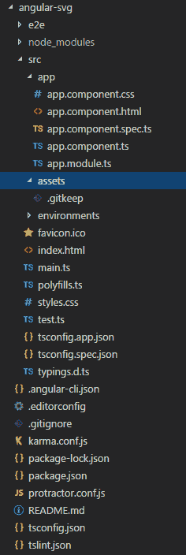
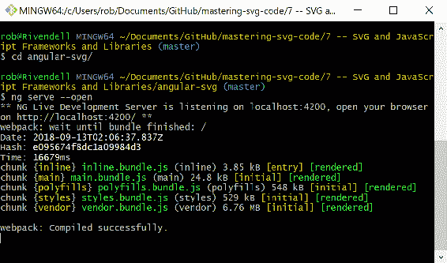
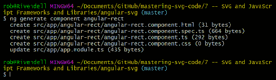
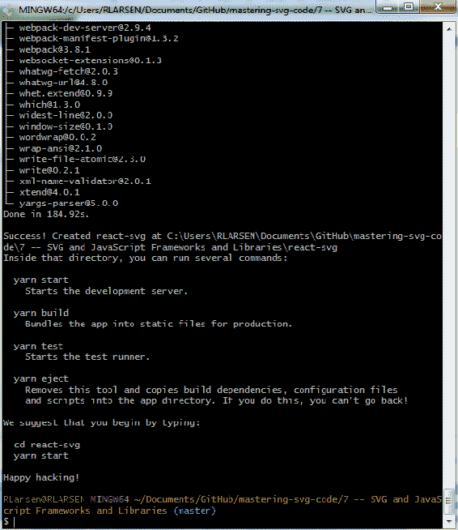
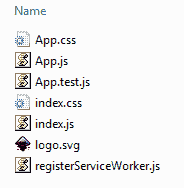
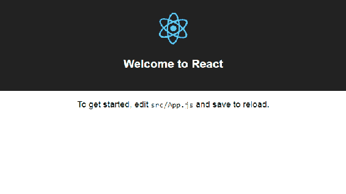

# 通用 JavaScript 库和 SVG

现在您已经了解了 SVG 的原始 DOM 接口，现在该看看 SVG 和一些更常见的 JavaScript 库和框架之间的接口了。 根据从[第 6 章](06.html)、*JavaScript 和*学到的经验，我们来看看在让 SVG 与 jQuery、AngularJS(1.*)、Angular(2+)和 ReactJS 一起正常工作时出现的一些奇怪现象。 这些示例不会很深入，但应该都说明了使用 SVG 和其他代码库时出现的基本问题。 这里的目标不是向您全面介绍这些库和框架。 这里有足够的介绍来帮助您启动和运行，然后每个部分将处理该库或框架和 SVG 的细节。

在本章中，我们将介绍:

*   使用非常流行的 jQuery 库和 SVG
*   Angular 1、Angular(2+)和 SVG 之间的接口
*   SVG 和 ReactJS，来自 Facebook 的流行库

# 使用 jQuery 操作 SVG

我们要看的第一个库是 jQuery。 jQuery 已经不像以前那么热门了，但它仍然是世界上最流行的 JavaScript 库，理解 SVG 与 jQuery 的结合使用仍然有潜在的用处。

由于 jQuery 可以作为常见 DOM 交互的友好替代，本节将介绍基于 jQuery 重写我们在[第 6 章](06.html)、JavaScript 和 SVG 中所做的 DOM 操纵器演示。

它使用完全相同的标记，所以在本章中我们唯一需要看的地方是底部的脚本块。

This code will be written in idiomatic jQuery/ES5.

我们首先要看的是我们将在 jQuery 的`DOMContentLoaded`事件中触发的函数`$(document).ready()`。 `$(document).ready()`接受一个函数作为参数。 顾名思义，该函数将在文档的 DOM 内容完成加载后执行。

虽然可以传入一个函数表达式，但我们将定义一个传统命名的函数`init`来传入`$(document).ready()`。

在其中，我们设置了一些事件处理程序。 第一个是用于按钮的`click`事件处理程序。 它触发了`loadCursor`函数。 第二个到第四个事件处理程序为每种不同的 SVG 元素类型创建`save`事件。 最后一个将`add`函数添加到`#canvas`元素，这样单击 canvas 元素就会知道将选择的 SVG 元素拖放到页面上:

```html
  function init() {
      $(".controls .btn").on("click", loadCursor); 
      $("#rect-save").on("click", rectSave);
      $("#circle-save").on("click", circleSave);
      $("#text-save").on("click", textSave);
      $("#canvas").on("click", add);
    }
$().ready(init);
```

现在我们已经了解了启动应用程序的函数，接下来让我们看看其他函数。 首先，我们来看一下新版本的`add`函数。 有一个大的皱纹，然后有几个小的。

我们从获取加载的 jQuery 对`$("#canvas")`SVG 元素的引用开始。 之后，初始化类似于函数的普通 JavaScript 版本。

这包括一个主要的问题，即 jQuery 的预期行为失败。 虽然常见的 jQuery 元素创建方法(如`$("<rect>")`)使用 SVG 元素，并将`<rect>`元素插入到页面中，但仍然需要使用适当的名称空间创建它们。 如前一章所述，如果没有名称空间，它们就会像任意 HTML 元素一样被浏览器处理，并且不会按预期呈现。 因此，与普通 JS 示例一样，我们需要将名称空间添加到元素创建中。 因此，我们使用与仅 javascript 示例中相同的`elem = doc.createElementNS(NS, "rect");`模式来实现这一点。 一旦创建了元素，就可以将其插入到 DOM 中，并像往常一样使用 jQuery 进行操作。

在创建这些元素之后，`square`、`circle`和`text`的各个选项的处理都类似于只使用 javascript 的示例。 在本例中，我们只使用 jQuery 方便方法`$().hasClass()`和`$().attr()`来测试类名并设置各种属性。

最后，我们使用更多的 jQuery 方便方法将元素添加到`$canvas`元素中，删除`"active"`类，并添加`click`事件处理程序来编辑元素:

```html
function add($event) {
      var $canvas = $("#canvas");
      var elem;
      var doc = document;
      var NS = canvas.getAttribute('xmlns');
      var point = canvas.createSVGPoint();
      var $elem;
      point.x = $event.offsetX;
      point.y = $event.offsetY;
      var svgCoords = 
        point.matrixTransform(canvas.getScreenCTM().inverse());
      if ($canvas.hasClass("active")) {
        if ($canvas.hasClass("square")) {
          elem = doc.createElementNS(NS, "rect");
          $elem = $(elem).attr({
            "x": svgCoords.x,
            "y": svgCoords.y,
            "width": 50,
            "height": 50
          });

        } else if ($canvas.hasClass("circle")) {
          elem = doc.createElementNS(NS, "circle");

          $elem = $(elem).attr({
            "cx": svgCoords.x,
            "cy": svgCoords.y,
            "r": 10
          });
        } else if ($canvas.hasClass("text")) {
          elem = doc.createElementNS(NS, "text");
          $elem = $(elem).attr({
            "x": svgCoords.x,
            "y": svgCoords.y,
            "width": 50,
            "height": 50
          });
          $elem.text("TEXT");

        }
        $elem.attr("fill", "#ff8000");
        $canvas.append($elem);
        $canvas.removeClass("active");
        $elem.on("click", edit);
      }
    }
```

这三个编辑函数同样遵循与 JS 示例相同的模式。 在每个函数中，我们获得一个加载的 jQuery 引用`target`元素，并将其存储为`$elem`。 然后，我们使用 jQuery 方法`$().prop`来查找对象属性，以测试调用对象的`nodeName`。 然后显示正确的模态，使用 Bootstrap 模态方法调用`"show"`参数，并使用 jQuery`$().data`方法设置当前元素。 `$().data`，正如你所记得的[第 6 章](06.html)，*JavaScript 和 SVG*，获取和设置元素上的任意数据。 然后，我们使用获取或设置表单输入值的`$().val()`方法和获取或设置元素属性的`$().attr()`方法的组合来填充表单值。 这里使用`$().val()`来设置表单的值，方法是使用`$().attr()`读取 SVG 元素的值，称为`getter`(不带参数)，并将该值用作`$().val()`的参数:

```html
   function edit($event) {
      var $elem = $($event.target);
      if ($elem.prop("nodeName") === "rect") {
        $("#rect-edit-modal").modal("show").data("current-element",
         $elem);

        $("#rect-color").val($elem.attr("fill"));
        $("#rect-x").val($elem.attr("x"));
        $("#rect-y").val($elem.attr("y"));
        $("#rect-width").val($elem.attr("width"));
        $("#rect-height").val($elem.attr("height"));
      }
      else if ($elem.prop("nodeName") === "circle") {
        $("#circle-edit-modal").modal("show").data("current-element",
         $elem);
        $("#circle-color").val($elem.attr("fill"));
        $("#circle-cx").val($elem.attr("cx"));
        $("#circle-cy").val($elem.attr("cy"));
        $("#circle-radius").val($elem.attr("r"));
      }
      else if ($elem.prop("nodeName") === "text") {
        $("#text-edit-modal").modal("show").data("current-element",
         $elem);
        $("#text-color").val($elem.attr("fill"));
        $("#text-x").val($elem.attr("x"));
        $("#text-y").val($elem.attr("y"));
        $("#text-text").val($elem.text());
      }
    }
```

最后，我们有各种各样的`save`方法。 它们遵循与前面示例相同的模式。 这是与 JS 例子相同的基本工作流，但再次我们能够使用完整的 jQuery 方便方法套件针对 SVG 元素: 使用 Bootstrap 方法隐藏模态，使用`$().data()`方法获取当前元素的引用，然后使用`$().attr()`方法(称为`setter`，`$().val()`称为`getter`)设置属性作为参数:

```html
    function rectSave() {
      $("#rect-edit-modal").modal("hide");
      var $elem = $("#rect-edit-modal").data("current-element");
      $elem.attr({
        "fill": $("#rect-color").val(),
        "x": $("#rect-x").val(),
        "y": $("#rect-y").val(),
        "height": $("#rect-height").val(),
        "width": $("#rect-width").val()
      });
    }
    function circleSave() {
      $("#circle-edit-modal").modal("hide");
      var $elem = $("#circle-edit-modal").data("current-element");
      $elem.attr({
        "fill": $("#circle-color").val(),
        "cx": $("#circle-cx").val(),
        "cy": $("#circle-cy").val(),
        "r": $("#circle-radius").val()
      });
    }
    function textSave() {
      $("#text-edit-modal").modal("hide");
      var $elem = $("#text-edit-modal").data("current-element");
      $elem.attr({
        "fill": $("#text-color").val(), "x": $("#text-x").val(),
        "y": $("#text-y").val()
      });
      $elem.text($("#text-text").val());
    }
```

如您所见，除了创建元素外，使用 SVG 和 jQuery 非常简单。 元素创建需要使用标准 DOM 方法，但是与 SVG 元素的其他交互可以使用适当的 jQuery 方法。

# 使用 AngularJS 和 SVG

现在，我们来看看如何在更完整的应用程序框架中使用 SVG。 我们将从 AngularJS 开始，它是谷歌广受欢迎的应用程序框架的原始版本。 虽然 AngularJS (Angular 1.*)在 web 框架的上下文中已经很老了，但它仍然很流行，在许多环境中都在使用。 许多人都熟悉 SVG，而且它被广泛部署，因此从多个角度简要了解如何在 AngularJS 应用程序中使用 SVG 是非常有用的。

这个示例和下面的示例将比 jQuery 和纯 JavaScript 演示简单。 这有两个原因。 首先，您已经了解了大量关于 SVG 和 JavaScript 如何在 DOM 中交互的细节。 实际上，您已经准备好自己处理 SVG DOM 操作，因此了解不同框架中的大量变体可能并没有那么大的好处。 掌握了基本的知识，你就可以自己出发了。

其次，我们不想要关于实际库和框架的太多细节。 尽量少介绍每种方法意味着我们可以将讨论的重点放在 SVG 部分。 为此，我们将看一个尽可能简单的演示，演示在应用程序中处理元素的两个最重要方面:将动态 SVG 元素插入 DOM，以及通过用户交互操作它们。

演示将如下所示:


This code will be written in idiomatic ES5.

之前的代码。 本例中的所有代码都在一个 HTML 文件中。 这通常不是构建 AngularJS 应用程序的方式，但它在本例中运行得很好。

文档`head`使用必要的脚本和样式设置应用程序。 我们链接到 Bootstrap、jQuery 和 Angular:

```html
<head>
  <link rel="stylesheet" 
   href="https://maxcdn.bootstrapcdn.com/bootstrap/4.0.0/css/bootstrap.
    min.css" integrity="sha384-
    Gn5384xqQ1aoWXA+058RXPxPg6fy4IWvTNh0E263XmFcJlSAwiGgFAW/dAiS6JXm"
    crossorigin="anonymous">
  <link rel="stylesheet" href="style.css" />
  <script src="https://code.jquery.com/jquery-3.3.1.min.js" 
          integrity="sha256-
            FgpCb/KJQlLNfOu91ta32o/NMZxltwRo8QtmkMRdAu8="
            crossorigin="anonymous"></script>
  <script  
   src="https://ajax.googleapis.com/ajax/libs/angularjs/1.6.10/angular.
    min.js"></script>
</head>
```

有趣的事情开始于`body`元素。 这就是我们设置 Angular 应用的地方。 `ng-app`属性表明，Angular 应该处理`body`元素及其所有子元素，将 Angular 的特殊解析规则应用于其中包含的标记。 稍后我们将看到更多关于`ng-app`值`"angularSVG"`引用的内容。

接下来的标记是我们连接 UI 以使用 Angular 特性和功能的地方。 Angular 使用特殊属性和自定义 HTML 元素的组合来创建动态接口。

从我们的角度来看，最重要的部分是对`fill`、`cx`、`cy`和`r`属性使用`ng-attr`前缀。 Angular 允许你在标记中引用当前控制器作用域中的变量，只要它被封装在`{{}}`模式中，Angular 就会用模型中的值替换该引用。 这是一个实时引用，它将自动更新在一个定期的周期。

这个非常方便的特性*不能很好地与某些 SVG 属性一起使用***。 当你使用应用程序*并将这些值从 Angular 令牌转换为数值后，下面的代码将最终工作，*当文档加载时，它将会*错误*:****

```html
<circle
      fill="{{fill}}" 
      cx="{{cx}}" 
      cy="{{cy}}" 
      r="{{r}}" />
```

下面的截图显示了这个错误。 SVG 解析器期望得到一个`length`值，而不是得到一个字符串:


要解决这个问题，需要使用`ng-attr`前缀。 这个前缀向 Angular 表明，`allOrNothing`标志应该在插值步骤中使用。 简单地说，这意味着如果属性的值是`undefined`，那么该属性就不会呈现到文档中。 一旦它有了一个值，它就会正常呈现。

该标记的第二个有趣部分是自定义 HTML 元素`angular-rect`。 `angular-rect`是 Angular 中所谓的**指令**。 指令是 Angular 用来创建自定义 HTML 元素和属性的机制，它允许你用自己设计的可重用代码块来扩展和增强通用 HTML 元素和文档。 虽然这个元素非常简单，但你很快就会看到，这个自定义元素将简洁地说明 Angular 指令如何使用 SVG。

该标记的另一个有趣部分是使用`ng-model`属性将 JavaScript 变量值绑定到表单字段中的元素。 这个特殊的 AngularJS 属性连接了标记和 Angular 控制器之间的双向数据绑定。 我们很快就会看到这些变量在控制器中是如何设置的，但请记住，一旦设置了这个连接，AngularJS 就会保持它的活力，并且每当`form`字段更新时，它都会更新 SVG 元素中的值:

```html
<body ng-app="angularSVG">
  <div ng-controller="circleController" class="container">
    <svg  width="150" height="150" 
     viewBox="0 0 150 150" version="1.1">
      <circle
      ng-attr-fill="{{fill}}" 
      ng-attr-cx="{{cx}}" 
      ng-attr-cy="{{cy}}" 
      ng-attr-r="{{r}}" />
      <angular-rect></angular-rect>
    </svg>
    <div class="row">
      <div class="col-4">
        <label>Background color:</label>
      </div>
      <div class="col-8">
        <input type="color" ng-model="fill" id="circle-color">
      </div>
    </div>
    <div class="row">
      <div class="col-2">
        <label>cx:</label>
      </div>
      <div class="col-4">
        <input type="number" ng-model="cx" id="circle-cx" class="form-
          control">
      </div>
      <div class="col-2">
        <label>cy:</label>
      </div>
      <div class="col-4">
        <input type="number" ng-model="cy" id="circle-cy" class="form-
         control">
      </div>
    </div>
    <div class="row">
      <div class="col-2">
        <label>radius:</label>
      </div>
      <div class="col-4" height="{{cx}}>
        <input type="number" ng-model="r" id="circle-radius" 
          class="form-control">
      </div>
    </div>
  </div>
```

JavaScript 非常简单。 只需几行 JavaScript 代码，就可以将表单字段的值连接起来，动态调整圆的高度、宽度和填充颜色。 第一部分是`angular.module()`方法调用，它创建了一个名为`"angularSVG"`的 Angular 应用。 Angular 在标记中查找的就是这个引用，以便知道页面上是否有 Angular 应用。 如果它在`ng-app`中找到这个值，它就解析该标记并将基于 angular 的魔法应用到页面上。

接下来是我们的小控制器定义`circleController`。 `circleController`有一个参数，角`$scope`变量。 如果你不熟悉 Angular，可以把`$scope`看作是函数的`this`值的托管别名。 它是控制器的内部状态，并且`$scope`中的属性和方法对 JavaScript 代码和 Angular 感知标记都是可用的。

在控制器内部，我们所要做的就是在`$scope`上设置一些变量。 这些作为圆的基线值，因为它们被绑定到 Angular`$scope`，它们会自动激活，双向连接到圆和表单字段中相应的值。

然后，我们创建一个简单的 Angular 指令`angularRect`，它只做一个`rect`元素插入 SVG DOM。 我们不会在这里讨论 Angular 指令的复杂性，但有一个特定的细节对 SVG 元素很重要。 返回对象的`templateNamespace`属性告诉 Angular，该指令应该被视为 SVG。 没有它，就像 jQuery 的常见 DOM 创建模式和 DOM 方法`document.createElement`，指令将被插入到文档中，但不会被创建为正确的 SVG 元素。 它会在那里，但它不会在渲染时显示为正方形:

Angular uses the JavaScript friendly camelCase inside JavaScript and then kebab case when the elements are inserted into the document.  

```html
 <script>
    angular.module('angularSVG', [])
      .controller('circleController', function ($scope) {
        $scope.cx = 75;
        $scope.cy = 75;
        $scope.r = 50;
        $scope.fill = "#ff0000";
      }).directive('angularRect', function() {
        return {
            restrict: 'E',
            templateNamespace: 'svg',
            template: '<rect x="125" y="125" width="10" height="10"
             stroke="blue" fill="none"></rect>',
            replace: true
        };
});
  </script>
```

在浏览器中运行，然后调整值如下截图所示。 初始截图显示了加载初始值的演示:


第二张截图显示了调整后的值，并以相应的方式改变圆元素:


现在我们已经了解了 AngularJS，让我们来看看 Angular 的新演变，Angular 2.+。 这个框架的迭代被称为 Angular，它非常不同，也非常强大。

让我们快速浏览一下。

# 用 Angular 操作 SVG

从 AngularJS 继续，让我们看看 Angular 的现代演变。 角 2。 +(被称为*，就像 Angular*一样)是一个完全现代的框架。 它通常是用 TypeScript 编写的，TypeScript 是 JavaScript 的一个超级集合，它添加了一些可选的特性，Angular 可以利用这些特性为库添加一些非常方便的特性和功能。

# Angular 入门

由于 Angular 是一个更新的框架，占用的空间也大得多，所以我们将稍微介绍一下这个框架的设置。 下载示例中的代码可以正常工作，但是了解如何实现这些代码非常有用。 让我们开始吧。

这个 Angular 例子将复制 AngularJS 例子中使用 Angular 代码重做的演示。 正如您可能已经意识到并将继续学习的那样，无论您使用什么库或框架，动态 SVG 的基本问题都是相同的; 解决方案只是略有不同。

You can use whatever text editor you like for the Angular sample, but I suggest using Microsoft's VS Code. It's free, well-supported, updated frequently, and plays very well with TypeScript.

# 正在安装 Node、npm 和 Angular Cli

在你开始使用 Angular 之前，你需要先用实际运行代码所需的工具进行设置。 一切的基础都是 Node.js 和 Node 的包管理器`npm`。 所以如果你还没有安装的话，你应该先安装它们。 最简单的方法是访问[nodejs.org](http://nodejs.org)并下载您的操作系统的安装程序。

一旦你完成了这些，你就可以继续安装 Angular 的**命令行实用程序**(**CLI**)。 Angular CLI 让创建和运行 Angular 项目变得非常容易，你很快就会看到。 下面的命令会在你的机器上全局安装 Angular CLI:


1.  安装后，就可以使用`ng new`命令创建一个项目了。 `ng new`会创建一个新文件夹，里面包含你需要的所有东西，以启动并运行 Angular 项目。 我们不会深入讨论所有细节，但是在运行这个命令之后，你应该已经准备好开始使用你的应用程序了:


2.  下一步是进入您刚刚创建的文件夹并运行`npm install`:


`npm install` will ensure that all your dependencies are installed in `node_modules` and your application will be ready to run.  

3.  下面的截图来自 VS Code，显示了应用程序初始化和`npm`安装运行后的布局:



4.  因为我们在这个版本的演示中也使用 Bootstrap，我们需要确保它是可用的。 这是通过跑步完成的

```html
npm install --save bootstrap 
```

这将安装 Bootstrap 到您的`node_modules`:


然后可以用`angular-cli.json`将其连接起来。 `angular-cli.json`是你配置 Angular CLI 安装的不同方面的地方。 在这种情况下，我们所需要做的就是将 Bootstrap CSS 添加到 styles 属性中，这样它就会与应用程序的其余部分绑定在一起:

Under the hood, Angular CLI uses Webpack to bundle scripts and styles and process them in a number of ways to ready them for delivery to your development server as well as to production environments. One of the greatest benefits of using Angular CLI is that it smoothes out the complexity of working with Webpack. Webpack is incredibly powerful but has a steep learning curve. Angular CLI makes it just work. 

```html
 "apps": [
    {
      "root": "src",
      "outDir": "dist",
      "assets": [
        "assets",
        "favicon.ico"
      ],
      "index": "index.html",
      "main": "main.ts",
      "polyfills": "polyfills.ts",
      "test": "test.ts",
      "tsconfig": "tsconfig.app.json",
      "testTsconfig": "tsconfig.spec.json",
      "prefix": "app",
      "styles": [
        "../node_modules/bootstrap/dist/css/bootstrap.css",
        "styles.css"
      ],
      "scripts": [],
      "environmentSource": "environments/environment.ts",
      "environments": {
        "dev": "environments/environment.ts",
        "prod": "environments/environment.prod.ts"
      }
    }
  ],
```

在这种简单的状态下运行应用程序将允许我们开始开发应用程序，并针对本地运行的开发服务器进行测试。 这可以使用`ng serve`命令完成。 它在这里通过`--open`选项调用，该选项将在代码编译后打开一个 web 浏览器:



这将在代码发生更改时自动在浏览器中重新加载代码。

所以，现在是时候开始写一些 TypeScript 并与 SVG 交互了。

我们要做的第一件事是编辑应用程序的主模块。 `app.module.ts`是应用程序的根模块，它是应用程序的所有部分连接在一起的地方。 其中大部分是由`Angular CLI`自动连接起来的。 我们只需要从 Angular 核心中导入`FormsModule`，使用新的 ES6 模块模式(`import``module from src`)。 然后将其添加到`@NgModule`装饰器的`imports`数组中。 这允许`FormsModule`的指令和属性在这个应用程序中可用:

```html
import { BrowserModule } from '@angular/platform-browser';
import { NgModule } from '@angular/core';
import { FormsModule } from '@angular/forms';
import { AppComponent } from './app.component';

@NgModule({
  declarations: [
    AppComponent,
    AngularRectComponent
  ],
  imports: [
    BrowserModule,
    FormsModule
  ],
  providers: [],
  bootstrap: [AppComponent]
})
export class AppModule { }
```

接下来，我们将完全编辑`app.component.ts`文件来表示我们的(简单的)组件。 在它中，我们从 Angular 中导入`Component`和`FormsModule`，在`@Component`装饰器中做一些标准的内审，然后导出带有四个属性集的`AppComponent`类。 这种模式需要一些解释，因为它可能很熟悉，但又很不同，可能会让人费解。 对于初学者来说，所有这些都是用`public`关键字创建的。 这表明这些属性应该在类的范围之外可用。 接下来是变量名本身，后跟冒号和类型注释，指示变量的预期类型。 TypeScript 允许你基于其他 TypeScript 类创建自定义类型，但出于我们的目的，我们只是使用标准的 JavaScript 原语`number`和`string`。 最后，我们为它们设置了默认值，这样我们的应用程序就有一些东西可以挂起:

```html
import { Component } from '@angular/core';
import { FormsModule } from '@angular/forms';

@Component({
  selector: 'app-root',
  templateUrl: './app.component.html',
  styleUrls: ['./app.component.css']
})
export class AppComponent {
  public cx:number = 75;
  public cy:number = 75;
  public r:number = 50
  public color:string = "#cc0000";
}
```

接下来我们有了标记，它与前面的示例类似。 都包含在`app.component.html`中。 与 AngularJS 版本有一些相似之处。 例如，必须以类似的方式处理动态属性，您仍然不能直接绑定到 SVG 属性而不会导致错误，因此您仍然必须显式地管理它们。 在本例中，你使用了`attr.`前缀，而不是在 AngularJS 中使用的`ng-attr-`前缀。 您还会注意到属性周围的方括号。

使用简单的方括号`[]`表示这是单向数据绑定; 模板读取前面定义的组件属性。 稍后，在输入中，我们将看到一个显式的双向数据绑定示例，该数据绑定使用方括号`[()]`语法围绕属性。 `ngModel`是我们与`FormsModule`一起导入的指令。 它允许我们从表单元素到组件属性进行双向数据绑定。 这样，表单中的条目再次用 SVG`circle`元素的属性表示，并且在`form`字段更新时显示更改:

```html
<div class="container">
  <svg  width="150" height="150" viewBox="0 0 150 150" version="1.1">
    <svg:circle
    [attr.fill]="color"
    [attr.cx]="cx"
    [attr.cy]="cy"
    [attr.r]="r" />
  </svg>
  <div class="row">
    <div class="col-4">
      <label>Background color:</label>
    </div>
    <div class="col-8">
      <input type="color" [(ngModel)]="color" id="circle-color">
    </div>
  </div>
  <div class="row">
    <div class="col-2">
      <label>cx:</label>
    </div>
    <div class="col-4">
      <input type="number" id="circle-cx" [(ngModel)]="cx" class="form-
        control">
    </div>
    <div class="col-2">
      <label>cy:</label>
    </div>
    <div class="col-4">
      <input type="number" id="circle-cy" [(ngModel)]="cy" class="form-
        control">
    </div>
  </div>
  <div class="row">
    <div class="col-2">
      <label>radius:</label>
    </div>
    <div class="col-4">
      <input type="number" id="circle-radius" [(ngModel)]="r" 
        class="form-control">
    </div>
  </div>
</div>
```

要让这个 Angular 例子与 AngularJS 中的前一个例子相匹配，我们只需要再做一件事，那就是添加一个代表蓝色小元素`rect`的子组件。 这里有几个有趣的问题。 第一个例子演示了 Angular CLI 的强大功能。 在 Angular CLI 中，如果你需要连接一个组件，你可以使用`ng new`命令。 在我们的例子中，我们将运行`ng new component angular-rect`，它将生成组成 Angular 组件的各种文件，并将组件连接到`app.module.ts`:



你可以在下面更新后的代码样例中看到`app.module.ts`的样子，其中新的`AngularRectComponent`组件被导入并添加到`@NgModule`声明中:

```html
import { BrowserModule } from '@angular/platform-browser';
import { NgModule } from '@angular/core';
import { FormsModule } from '@angular/forms';
import { AppComponent } from './app.component';
import { AngularRectComponent } from './angular-rect/angular-rect.component';

@NgModule({
  declarations: [
    AppComponent,
    AngularRectComponent
  ],
  imports: [
    BrowserModule,
    FormsModule
  ],
  providers: [],
  bootstrap: [AppComponent]
})
export class AppModule { }
```

还有一些与 SVG 直接相关的问题需要指出，以便将这个自定义元素添加到页面上。 第一个要求是在`angular-rect`组件中的元素上添加`svg:`前缀。 这告诉 Angular，你猜对了，在创建这些元素时，它应该使用 SVG 命名空间:

```html
<svg:rect x="125" y="125" width="10" height="10" stroke="blue" fill="none"></svg:rect>
```

下一个问题是两部分。 对于一个由简单 HTML 元素组成的组件，你可以做类似这样的事情，这与你在 AngularJS 中看到的类似。 您将添加元素到页面如下:

```html
<angular-rect></angular-rect>
```

它将在 Web 检查器的实时视图中渲染以下内容:

```html
<angular-rect _ngcontent-c0="" _nghost-c1=""><rect _ngcontent-c1="" fill="none" height="10" stroke="blue" width="10" x="125" y="125"></rect>
</angular-rect>
```

从标记的角度来看，这看起来很好，但是在浏览器中，蓝色矩形不见了。 整个元素并没有呈现，即使它是在 DOM 中。

在 HTML5 中，这类事情是可行的，因为 HTML5 解析器的设计允许未知元素(以及格式糟糕的标记)，你可以使用 CSS 操作定制元素。 SVG,另一方面,仍是一个严格的 XML 语法,所以除非元素在 SVG 规范,或者你可以指向一个基于 XML 的**文档类型定义(DTD**),定义了特定的元素,它不会正确地呈现。 幸运的是，有一个 svg 形状的解决方案可以很好地配合 Angular 组件的一个特性。 你可以使用 Angular 的能力，用通用的`g`元素将自定义组件绑定到属性上，以创建大致相同的效果。****

 ****下面的代码示例展示了这是如何实现的。

首先，让我们看看`angular-rect`组件本身。 唯一需要注意的是，由于大多数文件只是样板文件，所以`@Component`装饰器中的选择器被包裹在`[]`中。 因为它是用方括号括起来的，这就向解析器表明它是一个属性选择器，而不是你在应用程序组件中看到的通用元素选择器。 这意味着 Angular 会把`angular-rect`作为元素的属性来查找，然后用我们的新自定义组件来替换它:

```html
import { Component, OnInit } from '@angular/core';

@Component({
  selector: '[angular-rect]',
  templateUrl: './angular-rect.component.html',
  styleUrls: ['./angular-rect.component.css']
})
export class AngularRectComponent implements OnInit {

  constructor() {}

  ngOnInit() {}

}
```

接下来，我们将看到如何使用标记。 我们再一次将`svg:`前缀添加到`g`元素中，然后简单地添加`angular-rect`属性，组件就可以正常呈现了:

```html
  <svg  width="150" height="150" viewBox="0 0 150 150" version="1.1">
    <svg:circle
    [attr.fill]="color"
    [attr.cx]="cx"
    [attr.cy]="cy"
    [attr.r]="r" />
    <svg:g angular-rect></svg:g>
  </svg>
```

这就是 Angular 的一切。

# 使用 React 和 SVG

我们要看的最后一个库是 React。 React 是一个非常流行的库，它出现的时候，AngularJS 还很老，而 Angular 还没有准备好迎接黄金时刻。 它在某些圈子里很受欢迎。 它基于 ES6，带有一些 React 特有的扩展。

根据本章到目前为止所看到的内容，特别是如果您已经进行过任何严肃的 web 应用程序开发，那么其中的大部分内容对您来说都很熟悉。

开始使用 React 比使用 Angular 要简单得多。 实际上，Angular 可能更复杂，但 Angular CLI 解决了很多问题，所以作为一个开发人员，你从来(或很少)真正看到复杂性。 React 与其说是一个完整的框架，不如说是一个库，因此为了启动和运行，您可能不得不做出更多的决定。 值得庆幸的是，虽然有很多方法可以实现这个目标，但没有一种方法像 Angular CLI 对 Angular 那样对项目至关重要(它们在文档和社区中是紧密耦合的)，但也有一些方法可以像 Angular CLI 那样简单。 也许更简单，因为根本就没有什么可安装的。

假设您的机器上安装了 Node Version >6，要创建演示代码中使用的简单应用程序，您所需要做的就是运行单个命令:

```html
$ npx create-react-app react-svg 
```

`create-react-app`是一款来自 Facebook 的实用程序，它可以旋转一个完整的 React 应用程序。运行它看起来像以下两张截图(整个滚动会占用很多页书)。

这是非常酷的。 它创建了文件夹，下载了所有的依赖项，并安装了所有的东西，给你一系列的命令来运行，以便与你新创建的 React 应用程序交互:


持续的结果:



更深入地看，它创建了如下截图所示的目录。 它包含包含所有依赖项的`node_modules`文件夹，`public`是运行编译文件的地方(当你浏览你的工作代码时，它会被提供)，`src`是运行应用程序的所有源文件的地方。 其他文件都是`git/npm/yarn-based project`的标准文件:

Yarn is an alternative to `npm`. We won't go into the details of the differences between the two because it's out of the scope of this book and, to be honest, isn't all that interesting. Suffice to say, yarn is a parallel tool to `npm` so you will do the same things you would do with `npm` with yarn. The syntax is occasionally different and there is a different file created when doing `yarn install` (`yarn.lock`). But for the sake of this book you don't need to concern yourself with the differences. 


如前所述，应用程序代码在`src`中。 你可以在下面的截图中看到这个文件夹的布局。

`App.css`、`App.js`和`App.test.js`是应用程序的核心所在。 `index.js`文件是应用程序的主要入口点，它们引导你的 React 应用程序。 是一个由框架提供的文件，用于从本地缓存中获取资源。 然而，在这个简单的应用程序中，你实际上不会触摸它:



从项目文件夹的根目录运行`yarn start`将编译所有的 React 代码和 CSS，并在 localhost 上启动一个可用的开发服务器:


如果你想知道的话，starter 应用程序如下所示。 我们很快就会把它吹走:



在我们开始深入研究 SVG 和 React 之前，让我们先看看由`create-react-app`生成的基本 React 组件。 你之前看过它的渲染; 让我们看看它是如何工作的。

React 组件的基本格式如下。 它是一个 ES6 模块，具有`import`语句、一个类和一个导出。 有一个元素是 React 特有的，值得注意。

文件的顶部显示 ES6 导入。 这可以包括 CSS 文件(稍后我们将看到)和 SVG 图像。 Webpack 会读取这些 import 语句并优化这些导入，就像 Webpack 处理 Angular 装饰器一样。

然后在文件中有一个类。 `App`，它扩展了 React 的基础`Component`类。 它有一个方法`render()`，它使用一个名为 JSX 的 JavaScript 扩展。 JSX 允许将 XML 和 JavaScript 混合在一起。 老实说，我一直不太喜欢这种格式，当他们发布它时，我几乎被它震惊了，但我已经开始欣赏它的意图，尽管我并不喜欢它。 如果 JSX 属性被引用，它们将被解析为字符串。 否则，它们将被视为 JavaScript 表达式。 在本例中，到`logo.svg`的路径被转换为有用的路径，并在浏览器中呈现徽标。

最后，导出默认类`App`，它可以被其他应用程序导入:

```html
import React, { Component } from 'react';
import logo from './logo.svg';
import './App.css';

class App extends Component {
  render() {
    return (
      <div className="App">
        <header className="App-header">
          
          <h1 className="App-title">Welcome to React</h1>
        </header>
        <p className="App-intro">
          To get started, edit <code>src/App.js</code> and save to 
            reload.
        </p>
      </div>
    );
  }
}

export default App;
```

快速地说一下，因为我们实际上并没有使用它做很多事情，让我们来看看`index.js`。 这将向我们展示如何加载应用程序。

在该文件的顶部有几个 ES6 模块导入。 React 和 ReactDOM 是核心，它们驱动了基本的 React 库，并添加了 ReactDOM 接口。 它们驱动着我们在这个小演示中要做的大部分事情。

导入还包括`index.css`文件。

除此之外，我们导入了两段 JavaScript:`App`，这是我们将要在其中进行工作的模块，以及前面提到的`registerServiceWorker`，我们根本不会使用它。

导入所有内容后，运行两个小函数。 `ReactDOM.render`调用时有两个参数，`<App />`表示 App 组件创建的自定义元素，`document.getElementById("root")`表示应该接收新元素的节点:

```html
import React from 'react';
import ReactDOM from 'react-dom';
import './index.css';
import App from './App';
import registerServiceWorker from './registerServiceWorker';

ReactDOM.render(<App />, document.getElementById('root'));
registerServiceWorker();
```

现在我们已经快速浏览了基本的 React 架构，让我们来看看我们的演示。

除了基本的 React 应用程序，Bootstrap 还通过运行以下命令安装到这个项目中。 我们将做一个简单表单/ SVG 演示的另一个版本，继续使用相同的标记是有意义的:

```html
npm install --save bootstrap
```

让我们看看我们的`App.js`。 它从几个 import 语句开始。 我们从 React 中引入`React`和`component`。 然后我们导入两个 CSS 文件，我们自己的自定义的`App.css`和我们刚刚安装的`Bootstrap CSS`，它们链接到项目的`node_modules`中的文件。 最后，我们从`rect`模块导入独立的`ReactRect`组件。

然后我们有了`App`类定义。 它真的有两件事要做。 在构造函数中，我们使用标准 SVG 属性`cx`、`cy`、`r`和`color`的默认值创建基类`state`对象。 然后我们设置一个方法`handleChange`来处理对底层模型的更改。

方法很简单。 它引入`event`对象，用`event.target`创建一个`target`常量，然后进一步检查该对象以获得输入的`name`和`value`。 然后，它使用方法`setState`(继承自`props`)来设置应用程序的状态值。

接下来是`render`函数。

查看它，您会注意到，要让 React 正确地呈现 SVG，不需要做太多事情。

首先，我们使用 ES6 解构赋值模式为各个属性设置局部变量。 设置好这些变量后，将需要 React 解释的变量添加到相应属性中的括号`{}`中就很简单了。 SVG 元素和表单输入中的变量引用的处理方式完全相同，不需要任何特殊处理。

我们只需直接在标记中将`handleChange`方法绑定到`onChange`事件，一切就会如预期的那样运行。

我们导入的`ReactRect`被添加到 SVG 元素中。 React 处理导入该组件，我们很快就会看到，并将其渲染到文档中:

Custom components need to start with a capital letter. Markup starting with a lowercase letter is interpreted as an HTML element. 

```html
import React, { Component } . from 'react';
import './App.css';
import 'bootstrap/dist/css/bootstrap.css';
import ReactRect from './rect';

class App extends Component {
  constructor(props) {
    super(props);
    this.state = {
      cx: 75,
      cy: 75,
      r: 50,
      color: "#cc0000"
    };
    this.handleChange = this.handleChange.bind(this);
  }
  handleChange(event) {
    const target = event.target;
    const value = target.value;
    const name = target.name;
    this.setState({
      [name]: value
    });
  }
  render() {
    const { cx,cy,r,color } = this.state;
    return (
      <div className="container">
      <svg  width="150" height="150" 
        viewBox="0 0 150 150" version="1.1">
        <circle
        r={r}
        cy={cy}
        cx={cx}
        fill={color}
        ></circle>
        <ReactRect></ReactRect>
      </svg>
      <div className="row">
        <div className="col-4">
          <label>Background color:</label>
        </div>
        <div className="col-8">
          <input type="color" id="circle-color" value={color}
          name="color"
          onChange={this.handleChange} />
        </div>
      </div>
      <div className="row">
        <div className="col-2">
          <label>cx:</label>
        </div>
        <div className="col-4">
          <input type="number" id="circle-cx" className="form-control" 
            value={cx}
          name="cx"
          onChange={this.handleChange} />
        </div>
        <div className="col-2">
          <label>cy:</label>
        </div>
        <div className="col-4">
          <input type="number" id="circle-cy" className="form-control" 
            value={cy}
          name="cy"
          onChange={this.handleChange} />
        </div>
      </div>
      <div className="row">
        <div className="col-2">
          <label>radius:</label>
        </div>
        <div className="col-4">
          <input type="number" id="circle-radius" className="form-
            control" value={r}
          name="r"
          onChange={this.handleChange} />
        </div>
      </div>
    </div>
    );
  }
}

export default App;
```

我们的定制元素非常简单。 它只是一个简单的 React 组件，返回我们的`rect`元素:

```html
import React, { Component } from 'react';

class ReactRect extends Component {
  render() {
    return (
      <rect x="125" y="125" width="10" height="10" stroke="blue" 
        fill="none"></rect>

    );
  }
}

export default ReactRect;
```

如您所见，使用动态 SVG 和 React 非常简单。 React 团队做出了一致的努力，以确保 SVG 元素和属性都能正常工作，所以这取决于他们的努力。 谢谢,反应团队!

# 总结

在本章中，您将使用四个常见的库和框架，将这些强大的工具与 SVG 集成在一起。

从 jQuery 开始，通过 AngularJS、Angular 和 React，你现在已经有了将 SVG 与世界上最流行的四种库和框架集成的基本经验。

具体来说，您学习了如何使用每种框架设置应用程序、如何创建具有 SVG 元素和属性的动态组件以及如何动态地操作这些属性。

你还学习了使用 SVG 和这些库时的多个陷阱，包括确保在 jQuery 中正确创建元素的方法，以及确保在 Angular 框架中正确处理动态属性的方法。********