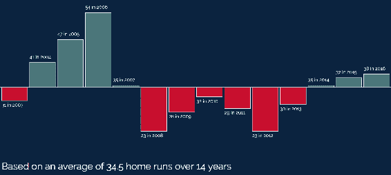
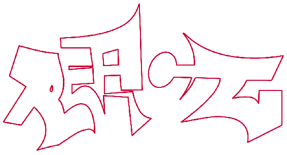

# 八、SVG 动画和可视化

本章介绍 SVG 最动态、最令人印象深刻的用例:使用 SVG 实现数据可视化和动画。 您已经学习的工具(SVG、JavaScript 和 CSS)以及一些新工具将结合在一起，为您创建强大的选项来构建动态站点和应用。

在本章中，我们将学习以下内容:

*   如何使用 SVG、JavaScript 和结构化数据生成静态数据可视化
*   对 SVG 动画的一般技术的概述
*   用 Vivus 制作 SVG 动画
*   动画与 GSAP

在学习完本章中的示例后，您将能够使用 SVG 创建动画和数据可视化，并了解使用 SVG 和动画的两种最佳工具。

让我们开始吧。

# 创建 SVG 数据可视化

第一部分将重点介绍如何使用 SVG 和 JavaScript 组合基本数据可视化。 这种特殊的可视化将集中于一个插图，即平均值的正/负方差。 在这种情况下，它将说明棒球运动员大卫·奥尔蒂斯在波士顿红袜队的职业生涯中，每个赛季的本垒打数与他在红袜队的职业生涯中平均本垒打数的比较。

从 2003 年到 2016 年，大卫·奥尔蒂斯在红袜队打球时，每个赛季至少打出 23 支本垒打，最多打出 54 支本垒打。 他平均每个赛季 34.5 分。 这个可视化将显示他每年全垒打总数相对于平均 34.5 的正/负方差。 他击球超过平均水平的年份将是绿色。 岁月里，他打得少的地方，将会是红色的。

我们需要完成的步骤如下:

1.  我们会用这些数据得到总年数，总本垒打数，然后计算平均值。
2.  我们将遍历数据并计算每年的正/负偏移量。
3.  我们将基于可用的屏幕区域计算一些参数。
4.  我们将在屏幕上垂直居中绘制一条基线。
5.  我们将在适当的地方画一系列矩形，用适当的高度来表示正/负方差，以及一些简单的标签来表示年份和本垒打的数量。
6.  我们将添加一个说明平均本垒打数和年数的图例。

最终的视觉效果是这样的:



现在我们已经制定了基本的计划，让我们详细看看它是如何工作的。

我们将从标记开始，它非常简单。 我们首先将 Bootstrap 和 Raleway 字体作为标准模板的一部分。 接下来，我们设置 SVG 元素的背景，并设置两种不同类型文本元素的字体、大小和颜色。 然后我们只包含目标 SVG 元素和运行可视化的 JavaScript 文件:

```html
<!doctype html>
<html lang="en">

<head>
  <meta charset="utf-8">
  <title>Mastering SVG- SVG Data Visualization</title>
  <link rel="stylesheet" 
   href="https://maxcdn.bootstrapcdn.com/bootstrap/4.0.0/css/bootstrap.
    min.css" integrity="sha384-
    Gn5384xqQ1aoWXA+058RXPxPg6fy4IWvTNh0E263XmFcJlSAwiGgFAW/dAiS6JXm"
    crossorigin="anonymous">
  <link href="https://fonts.googleapis.com/css?family=Raleway" 
    rel="stylesheet">
  <style type="text/css">
    body {
      font-family: Raleway, sans-serif;
    }
    svg.canvas {
     background: #0C2340;
    }
    text {
      font-family: Raleway, sans-serif;
      font-size: .75em;
      fill: #fff;
    }
    text.large {
      font-size: 1.5em;
    }
  </style>
</head>

<body>

  <div class="container-fluid">
    <div class="row">
      <div class="col-12">
        <svg  viewBox="0 0 1000 450" 
          width="1000" height="450" version="1.1" id="canvas" 
            class="canvas">
        </svg>
      </div>
    </div>
  </div>
  <script src="scripts.js"></script>
</body>

</html>
```

所包含的 JavaScript 文件是完成实际工作的地方。

This JavaScript file is written using several ES6 features. 

`scripts.js`本身基本上就是一个大函数`viz`。

在`viz`的顶端是`data`变量。 这个变量是一个 JavaScript 对象数组。 每个对象都有两个属性，`year`和`hrs`，分别表示问题所在的年份和奥尔蒂斯当年打出的本垒打数量:

```html
function viz() {
  /*
    ES6
  */
  const data = [
    {
      "year": 2003,
      "hrs": 31
    },
    {
      "year": 2004,
      "hrs": 41
    },
    {
      "year": 2005,
      "hrs": 47
    },
    {
      "year": 2006,
      "hrs": 54
    },
    {
      "year": 2007,
      "hrs": 35
    },
    {
      "year": 2008,
      "hrs": 23
    },
    {
      "year": 2009,
      "hrs": 28
    },
    {
      "year": 2010,
      "hrs": 32
    },
    {
      "year": 2011,
      "hrs": 29
    },
    {
      "year": 2012,
      "hrs": 23
    },
    {
      "year": 2013,
      "hrs": 30
    },
    {
      "year": 2014,
      "hrs": 35
    },
    {
      "year": 2015,
      "hrs": 37
    },
    {
      "year": 2016,
      "hrs": 38
    }
  ];
```

如果你运行这个可视化交互式地,接受用户的输入或插入一个 web 服务调用的结果统计数据库可视化,你就需要有正确的结构(对象数组)和形式(`hrs`和`year`)和其他工作本身。 当我们查看填充文件其余部分的变量和方法时，请记住这一点。

从`data`开始，除了`data`，我们还设置了几个不同的变量，在整个可视化过程中使用:

*   `doc`:对文件的引用
*   `canvas`:引用带有`#canvas`的`id`的 SVG 元素
*   `NS`:对派生自`SVG`元素的名称空间的引用
*   `elem`:我们将创建的元素的占位符变量

```html
  const doc = document;
  const canvas = doc.getElementById("canvas");
  const NS = canvas.getAttribute('xmlns');
  let elem;
```

接下来是几个实用程序方法，我们使用它们来用值和元素填充可视化。

第一个，`addText`，让我们将文本标签添加到可视化中。 它接受一个坐标对象`coords`，要输入的`text`，最后是一个可选的 CSS 类`cssClass`。 我们将在其中一个示例中探讨 CSS 类参数的用例。 前两个参数应该是直接的并且是必需的。

在`addText`之后，有一个`addLine`函数，它允许我们在屏幕上绘制线条。 它接受一个坐标对象`coords`(在本例中包含四个坐标)和一个可选的`stroke`颜色。 您会注意到，在函数签名中创建`stroke`时使用的是默认值。 如果没有提供描边颜色，则`stroke`为`#ff8000`。

接下来是`addRect`功能，它允许我们在屏幕上添加矩形。 它接受一个坐标对象`coords`，其中包含`height`和`width`属性，以及可选的`stroke`和`fill`颜色。

最后，还有一个函数`maxDiffer`，它计算出一组正数和负数之间的最大差值。 获得这个范围，然后使用这个最大差异，确保无论数字如何分布，高于或低于基线所需的最大高度将适合屏幕:

```html
  function addText(coords, text, cssClass) {
    elem = doc.createElementNS(NS, "text");
    elem.setAttribute("x", coords.x);
    elem.setAttribute("y", coords.y);
    elem.textContent = text;
    if (cssClass){
      elem.classList.add(cssClass);
    }
    canvas.appendChild(elem);
  }
  function addLine(coords, stroke = "#ff8000") {
    elem = doc.createElementNS(NS, "line");
    elem.setAttribute("x1", coords.x1);
    elem.setAttribute("y1", coords.y1);
    elem.setAttribute("x2", coords.x2);
    elem.setAttribute("y2", coords.y2);
    elem.setAttribute("stroke", stroke);
    canvas.appendChild(elem);
  }
  function addRect(coords, fill = "#ff8000", stroke = "#ffffff") {
    elem = doc.createElementNS(NS, "rect");
    elem.setAttribute("x", coords.x);
    elem.setAttribute("y", coords.y);
    elem.setAttribute("width", coords.width);
    elem.setAttribute("height", coords.height);
    elem.setAttribute("fill", fill);
    elem.setAttribute("stroke", stroke);
    canvas.appendChild(elem);
  }
  function maxDiffer(arr) {
    let maxDiff = arr[1] - arr[0];
    for (let i = 0; i < arr.length; i++) {
      for (let j = i + 1; j < arr.length; j++) {
        if (arr[j] - arr[i] > maxDiff) {
          maxDiff = arr[j] - arr[i];
        }
      }
    }
    return maxDiff;
  }

```

在这些实用函数之后，我们有了定义可视化核心的代码。 它发生在运行`DOMContentLoaded`事件的函数中。

当函数运行时，我们创建多个变量，其中包含生成可视化所需的不同属性。 他们是这样做的:

*   `viewBox`是对 SVG 元素`viewBox`的局部引用。 我们将这个和下面的 DOM 引用存储在本地，这样就可以节省`viewBox`的 DOM 查找次数。
*   `width`是对 SVG 元素`viewBox`的宽度的局部引用。
*   `height`是对`viewBox`中的`height`的局部引用。
*   `x`是对`viewBox`中的`x`点的局部引用。
*   `y`是对`viewBox`中的`y`点的局部引用。
*   是一个任意常数，它创建多个填充计算。
*   定义了 SVG 画布的可见宽度。 这定义了可以安全地将元素绘制到 SVG 元素中的区域。
*   `years`是对数据集中年数的引用。
*   `total`是一个计算值，表示整个数据集中本垒打的总数。
*   `avg`是每年本垒打的平均数目，用`total`除以`years`的数目。
*   `verticalMidPoint`表示 SVG 元素的垂直中点。 这条线上画着正或负方差。
*   `diffs`是一个数组，记录着每年平均本垒打数和本垒打数之间的正负差。
*   `maxDiff`是某一年平均本垒打数与本垒打数之间的最大差值。
*   `yInterval`是每个本垒打的像素数。 这确保了盒子在垂直方向上以任何给定年份的本垒打数量为基础进行适当的缩放。
*   `xInterval`为每年的像素数。 这个值让我们可以均匀地将空格框分隔开，不管数据集中的年份是多少:

```html
  document.addEventListener("DOMContentLoaded", () => {
    const viewBox = canvas.viewBox.baseVal;
    const width = viewBox.width;
    const height = viewBox.height;
    const x = viewBox.x;
    const y = viewBox.y;
    const padding = width / 200;
    const vizWidth = width - padding;
    const years = data.length;
    const total = data.reduce((total, item) => {
      return total + item.hrs;
    }, 0);
    const avg = total / years;
    const verticalMidPoint = (y + height) / 2;
    const diffs = data.map((item) => {
      return item.hrs - avg;
    });
    const maxDiff = maxDiffer(diffs);
    const yIntervals = verticalMidPoint / maxDiff;
    const xInterval = (vizWidth / years);
```

在创建所有这些变量之后，我们开始绘制不同的方框并添加标签。 为此，我们使用`for...in`循环遍历数组`diffs`，进行两次计算，创建两个新变量`newX`和`newY`。 `newX`是一个基于`i`的值乘以我们之前创建的`intervalX`变量的规则间隔。 `newY`变量的计算方法是将`diffs[i]`的值(当前的差值)乘以`yInterval`常数。 这给了我们一个用来计算矩形高度的距离，以表示每年本垒打的数量。

接下来，我们测试当前的`diff`是大于还是小于零。 如果它大于 0，我们要画一个从`verticalMidPoint`向上的方框。 如果当前`diff`小于零，则从`verticalMidPoint`画出一个从`down`到`down`的方框。 由于矩形的方向和框的相关锚点在每种情况下都是不同的，因此我们需要以不同的方式处理它们。 我们还将使用不同的颜色为这两种变化，以突出次要指示的差异。

虽然这个`if`的两个分支之间存在差异，但两个分支都调用`addRect`和`addText`。 让我们来看看`if`这两个分支的相似点和不同点。

对于初学者来说，对`addRect`的每次调用都遵循与`x`和`width`属性相同的模式。 `x`是`padding`加上`newX`的值，`width`是`xInterval`加上`padding`的值。

两个分支对`y`和`height`值的处理方式不同。

如果当前差值小于零，则新的`y`坐标为`verticalMidpoint`。 这将框的顶部固定在可视化中表示为 0 的线上，并表明该框将挂在该线之下。 如果当前差值大于零，则将`y`坐标设置为`verticalMidPoint`减去`newY`。 这将新矩形的顶部设置为`newY`的值，位于*表示零的那一行之上。*

 *如果当前差小于零，那么`height`就是传入`Math.abs()`的`newY`值。 您不能将负值传递给 SVG 元素，因此需要使用`Math.abs()`将负值转换为正值。 在当前差值大于零的情况下，`height`就是`newY`值，因为它已经是正数了。

`if`的每个分支中对`addText`的调用在`y`点的位置上发散。 如果`newY`值为负数，那么`Math.abs`必须再次将`newY`值转换为正数。 否则，它就会原样传递。

接下来，我们通过调用`addLine`将零线添加到垂直中点。 传入的实参是最左边和最右边的点的`viewBox`中未改变的`x`和`width`，以及两个点的`y`值的`verticalMidpint`

最后，我们添加了一些文本来解释可视化的基础知识。 在这里我们使用`addLine`的可选参数`cssClass`，传入`large`以便我们可以使文本稍微大一些。 `x`和`y`参数利用`x`和`height`变量以及`padding`变量将文本稍微放在 SVG 元素的左下角。

最后一行代码简单地调用`viz()`函数来开始可视化:

```html
for (const i in diffs) {
      const newX = xInterval * i;
      const newY = diffs[i] * yInterval;
      if (diffs[i] < 0) {
        addRect({
          "x": newX + padding,
          "y": verticalMidPoint,
          "width": xInterval - padding,
          "height": Math.abs(newY),
        }, "#C8102E", "#ffffff");
        addText({
          "x": newX + padding,
          "y": verticalMidPoint + Math.abs(newY) + (padding * 3)
        }, `${data[i].hrs} in ${data[i].year}`);
      }
      else if (diffs[i] > 0) {
        addRect({
          "x": newX + padding,
          "y": verticalMidPoint - newY,
          "width": xInterval - padding,
          "height": newY,
        }, "#4A777A", "#ffffff");
        addText({
          "x": newX + padding,
          "y": verticalMidPoint - newY - (padding * 2)
        }, `${data[i].hrs} in ${data[i].year}`);
      }
      addLine({
        x1: x,
        y1: verticalMidPoint,
        x2: width,
        y2: verticalMidPoint
      }, "#ffffff");
      addText({
        "x": x + padding,
        "y": height - (padding * 3)
      }, `Based on an average of ${avg} home runs over ${years} years`,
            "large");
    }
  });

}
viz();
```

如果这是一种用于生产或更通用用途的可视化，那么我们仍然想用它来做一些事情。 眼尖的读者会发现，我们实际上并没有处理本垒打的数量与平均本垒打的数量完全相等的情况。 也就是说，就本书的目的而言，这里的细节足以说明如何使用 JavaScript、SVG 和数据来直观地讲述数据集的故事。

现在我们已经了解了静态可视化，让我们看看如何向屏幕添加一些移动。 下一节将讨论在浏览器中动画 SVG 的多种方法。

# SVG 动画的一般技术

本节将介绍制作 SVG 动画的各种通用技术。 虽然有不同的工具可以完成这项工作(稍后在本章中您将遇到两个)，但了解在没有框架或库的帮助下如何完成这些工作是很有用的。 本节将提供这个基础。

你之前已经看到了其中的一些技术，但最好还是在动画的背景下再看一遍。

# 纯 JavaScript 动画

在出现 CSS 关键帧动画和 CSS 过渡(这两种技术我们将在本章后面讨论)之前，我们必须使用 JavaScript 在浏览器中手工制作所有的动画和有趣的效果; 在循环中更新属性和手动优化帧速率。 最终，像 jQuery 这样的库出现了，通过将动画作为 API 的一部分呈现，不再需要知道它是如何工作的。 值得庆幸的是，现在除了你所选择的工具中可用的动画方法之外，你还可以利用 CSS 动画来完成很多我们曾经使用 JavaScript 来完成的事情，所以现在人们越来越不需要学习这些技能了。

也就是说，有些地方 CSS 动画不会剪切它，所以在没有库帮助的情况下看看它是如何工作的是有一些好处的。

这个简单的动画将使圆形元素从左到右跨 SVG 元素。 我们将需要计算几个指标来创建动画，所以即使它很简单，它将说明许多挑战，你可能会遇到这种编码。

让我们看看代码。

在`head`中没有什么有趣的内容，所以让我们直接跳到页面的`body`。 `body`具有我们在本书中一直在使用的标准 Bootstrap 标记。 在主`div`中，我们有一个`SVG`元素，它包含一个位于`75, 225`的`circle`元素，其半径为`50`-像素。 它有`circle`中的`id`:

```html
  <div class="container-fluid">
    <div class="row">
      <div class="col-12">
        <svg  viewBox="0 0 1000 450" 
          width="1000" height="450" version="1.1" id="canvas" 
           class="canvas">
          <circle cx="75" cy="225" r="50" fill="blue" id="circle">
        </circle>
        </svg>
      </div>
    </div>
  </div>
```

JavaScript 很简单。

它由添加到`DOMContentLoaded`事件的一个函数组成。 这个函数做一些熟悉的事情。 它创建了对`doc`、`canvas`和`circle`的局部引用，以便我们可以在整个动画中轻松引用这些元素。 接下来创建了几个变量来存储`viewBox`的属性:`viewBox`本身、`height`、`width`和`x`。 然后我们设置两个常量，分别表示动画运行的`seconds`帧数和帧数(**fps**)。

接下来，我们获取 circle 元素的当前值`x`作为变量`currX`。 然后我们用圆的半径乘以 3 来计算终点`newX`。 这在视觉上给了我们一个舒适的终点。

接下来，我们创建一些变量来运行动画。 第一个，`diffX`，是计算当前`x`值和目标`newX`值之间的差值。 然后我们用`diffX`除以秒数，再乘以每秒的帧数。 这将创造三秒钟的动画间隔。

最后，我们创建了动画变量`animX`，当我们在屏幕上动画元素时，我们将在每一帧中使用该变量。

接下来，有一个函数可以调整元素在屏幕上每一帧的位置。 它做三件事。 它将区间添加到`animX`中，以便将元素移动到计算的区间。 然后设置元素的`cx`属性，将其移动到新位置。 最后，它使用`window.requestAnimationFrame`递归地调用自己。

`requestAnimationFrame` is a method that allows the browser to optimize the way that JavaScript animations are drawn onto the screen. The number of frames per second it's optimized to is usually `60`, but technically it will match the display refresh rate of the device.

所有这些都在一个`if`块中发生，该块在动画完成时停止动画。 如果`animX`小于`newX`，则执行代码，再次调用`animate`以启动下一帧。 如果`animX`大于或等于`newX`，则动画停止:

```html
document.addEventListener("DOMContentLoaded", () => {

 const doc = document;
 const canvas = doc.getElementById("canvas");
 const circle = doc.getElementById('circle');
 const viewBox = canvas.viewBox.baseVal;
 const width = viewBox.width;
 const height = viewBox.height;
 const x = viewBox.x;
 const padding = width / 200;
 const seconds = 3;
 const fps = 60;
 let currX = circle.cx.baseVal.value;
 let newX = width - (circle.r.baseVal.value * 3);
 let diffX = newX - currX;
 let intervalX = diffX / (fps * seconds);
 let animX = currX;
 function animate() {
    if (animX < newX) {
        animX = animX + intervalX;
        circle.setAttribute("cx", animX);
        window.requestAnimationFrame(animate);
     }
 }
 animate();
 });
```

这不是最复杂的动画，但使用`window.requestAnimationFrame`意味着它在浏览器中看起来很好。

虽然有其他的 SVG 动画选项，您应该了解它们并在适当的地方使用它们，但 JavaScript 将是最强大的、最终也是最灵活的选项。 如果你的动画需要在大多数可能的浏览器上运行，那么你就需要使用 JavaScript。

好消息是，正如您将在本章后面看到的，有一些优秀的工具可以简化 JavaScript 动画。

在我们研究使用 SVG 的第一个 JavaScript 库之前，让我们看看使用核心 web 技术实现 SVG 动画的另外两个选项:CSS 和 SMIL。

# 用 CSS 动画

用 CSS 制作 SVG 动画很简单，因为它的工作方式与用普通 HTML 元素制作 CSS 动画和转换相同。 您定义一些 CSS 属性，并根据您是否使用关键帧动画或转换，创建特定的 CSS 规则来处理它们在一段时间内如何呈现。 这个过程直观的想法存在的问题是，只有驱动 SVG 的表示属性，也可以作为 CSS 属性使用 CSS 进行操作。 正如您在以下网站上看到的，按照 SVG 1.1 中定义的，该列表缺少许多重要属性:[https://www.w3.org/TR/SVG/propidx.html](https://www.w3.org/TR/SVG/propidx.html)。 SVG 2.0 添加了更多的属性，但对这些新属性的支持不是通用的，而且不幸的是，没有一个适当的概要说明哪些属性在哪里受支持。

换句话说，使用这些技术会有一些潜在的问题，这取决于你的浏览器支持矩阵的样子。

无论如何，尽管故事有些粗糙，但还是值得看看这些技巧的实际应用。

这里有三个例子。 两个显示动画类似于之前的 JavaScript 动画; 他们在屏幕上移动一个蓝色圆圈。 它们以两种不同的方式实现。 这说明了您可能会看到的实现差异，取决于您的目标浏览器。 第一个例子使用 CSS 转换和 CSS 动画在屏幕上转换元素。 这种技术具有更广泛的浏览器支持。 第二个示例使用了更简单的方法:在`cx`属性上设置一个转换，然后更改 SVG 元素悬浮时的值。 `cx`作为 CSS 属性在 Chrome 中可用，所以在该浏览器中这是更容易的方法。

第三个例子展示了一个元素上的`fill`转换，以说明将计算留给浏览器和 CSS 是非常有益的。 如果不清楚如何从一个颜色值动画到另一个颜色值，那么您可能会看到至少有一个很棒的用例，可以把繁重的工作留给浏览器。

让我们按顺序看一下这些例子。

第一个例子很简单。 在这个示例中，我们使用了与前面 JavaScript 示例相同的标记，只有一个例外:通过 CSS 设置`cx`属性。 我们在文档的`head`中的`#circle`选择器中执行此操作。

此外，我们在该选择器上设置了一个`transition`属性，观察`cx`属性的更改，并在其更改时进行三秒钟的转换。 在下一个选择器`svg:hover #circle`中，我们通过父 SVG 元素上的悬停事件触发动画，该事件将`cx`值设置为最终目标`875`像素。

当您将鼠标移到 SVG 元素上时，将设置新的`cx`，浏览器将在 SVG 元素的*x*轴上的`75`和`875`像素之间移动:

```html
<!doctype html>
<html lang="en">

<head>
  <meta charset="utf-8">
  <title>Mastering SVG- SVG Animation with CSS</title>
  <link rel="stylesheet" 
  href="https://maxcdn.bootstrapcdn.com/bootstrap/4.0.0/css/bootstrap.m
    in.css" integrity="sha384-
    Gn5384xqQ1aoWXA+058RXPxPg6fy4IWvTNh0E263XmFcJlSAwiGgFAW/dAiS6JXm"
    crossorigin="anonymous">
  <style type="text/css">
    #circle {
      transition: cx 3s;
      cx: 75px;
    }
    svg:hover #circle {
      cx: 875px;
    }
  </style>

</head>

<body>

  <div class="container-fluid">
    <div class="row">
      <div class="col-12">
        <svg  viewBox="0 0 1000 450"
         width="1000" height="450" version="1.1" id="canvas" 
          class="canvas">
          <circle cy="225" r="50" fill="blue" id="circle"></circle>
        </svg>
      </div>
    </div>
  </div>

</body>

</html>
```

下一个示例的设置与此类似。 它的 SVG 标记与前面用 JavaScript 动画的示例完全相同。 区别再次出现在 CSS 中。

这里有两个有趣的部分。 第一部分定义了一个名为`animate-circle`的双关键帧动画。 第一个关键帧，在`0%,`处使用`transform: translateX`在*X*轴上进行`0px`平移。 第二个关键帧，在`100%`，将该转换增加到`800px`。

然后，在`#circle`选择器中，我们定义带有命名动画的`animation`属性，持续时间为 3 秒，线性缓动。 然后我们将`animation-fill-mode`设置为 forward，这表示动画应该向前运行一次并完成，使动画元素保持在最终状态。

当它运行时，圆圈会平滑地在屏幕上移动:

```html
<!doctype html>
<html lang="en">

<head>
  <meta charset="utf-8">
  <title>Mastering SVG- SVG CSS Animation</title>
  <link rel="stylesheet" 
   href="https://maxcdn.bootstrapcdn.com/bootstrap/4.0.0/css/bootstrap.
    min.css" integrity="sha384-
    Gn5384xqQ1aoWXA+058RXPxPg6fy4IWvTNh0E263XmFcJlSAwiGgFAW/dAiS6JXm"
    crossorigin="anonymous">
  <style type="text/css">
    @keyframes animate-circle {
      0% {
        transform: translateX(0)
      }
      100% {
        transform: translateX(800px)
      }
    }

    #circle {
      animation: animate-circle 3s linear;
      animation-fill-mode: forwards;
    }
  </style>

</head>

<body>

  <div class="container-fluid">
    <div class="row">
      <div class="col-12">
        <svg  viewBox="0 0 1000 450" 
         width="1000" height="450" version="1.1" id="canvas" 
          class="canvas">
          <circle cx="75" cy="225" r="50" fill="blue" id="circle">
        </circle>
        </svg>
      </div>
    </div>
  </div>

</body>

</html>
```

最后一个例子也使用了过渡，这一次将`fill`属性从蓝色变为红色。 这个属性是在 CSS 中定义的较早的表示属性之一，因此目前它在浏览器中得到了比`cx`这样的属性更好的支持。

CSS 的定义非常简单。 在`#circle`定义上设置了`fill`属性，另外还有`transition`属性，用于监视`fill`的更改并在 2 秒的持续时间内转换这些更改。

在`#circle:hover`中，我们将`fill`改为蓝色。 在浏览器中运行它，并将鼠标悬停在圆圈上，圆圈元素的颜色就会发生变化，而不需要使用任何*JavaScript，也不需要知道如何从一个命名的颜色变化到另一个:*

```html
<!doctype html>
<html lang="en">
<head>
  <meta charset="utf-8">
  <title>Mastering SVG- SVG Data Visualization</title>
  <link rel="stylesheet" 
  href="https://maxcdn.bootstrapcdn.com/bootstrap/4.0.0/css/bootstrap.m
  in.css" integrity="sha384-
  Gn5384xqQ1aoWXA+058RXPxPg6fy4IWvTNh0E263XmFcJlSAwiGgFAW/dAiS6JXm"
    crossorigin="anonymous">
  <style type="text/css">
    #circle {
      fill: red;
      transition: fill 3s;
    }
    #circle:hover {
      fill: blue;
    }
  </style>
</head>
<body>
  <div class="container-fluid">
    <div class="row">
      <div class="col-12">
        <svg  viewBox="0 0 450 450"
         width="450" height="450" version="1.1" id="canvas" 
            class="canvas">
          <circle cx="225" cy="225" r="225" fill="blue" id="circle">
        </circle>
        </svg>
      </div>
    </div>
  </div>
</body>
</html>
```

所有这些例子都是有意为之的基础，正如前面提到的，浏览器对它们的支持很弱(例如，没有一个能在比 Edge 更早的 IE 版本中工作); 但他们仍然很强大。 如果您的浏览器矩阵支持倾向于最新和最好的浏览器，那么您可以从 CSS 和 SVG 中获得很多乐趣。

# 使用 SMIL 制作 SVG 动画

另一个有趣而强大的 SVG 动画选项与 CSS 的支持矩阵类似，令人沮丧。 微软的浏览器根本不支持 SMIL，甚至被 Chrome 暂时弃用。

这是一个遗憾，因为 SMIL 有一些好的方面。 这是一种清晰的、声明性的动画元素方式。 它不像 JavaScript 那么强大，也不像 CSS 这样的通用技术那样常用，但它仍然非常棒。

看一个例子。

其中有我们现在熟悉的标记:空白 SVG 元素上的简单`circle`。 这一次有一个小转折。 有一个`animate`元素作为`circle`元素的子元素。 元素是定义动画的地方。 它有几个属性，我们需要看看:

*   `xlink:href`属性指向将被动画的`#circle`元素。 `animate`元素是`circle`元素的子元素，这一事实自动地将动画与其关联起来。 使用`xlink:href`属性可以确保精确地定义连接。
*   `attributeName`定义将被动画的属性。 在本例中，它是`cx`属性。
*   `from`和`to`属性表示动画的开始和结束。 在本例中，我们将从`"75"`移动到`"900"`。
*   `dur`表示动画时长。 在本例中，它被定义为`"3s"`，持续 3 秒。
*   `begin`属性指示动画何时开始。 这让你可以根据需要延迟动画。 在我们的例子中，我们使用`"0s"`立即开始动画。
*   `fill`属性与常见的`fill`属性的名称相同，它指示动画值在动画结束后是否应该保留在元素上。 这个值`"freeze"`表示元素在动画结束时应该保持冻结状态。

There seems no good reason why `fill` is overloaded to do two separate, basically unrelated, tasks in the context of SVG. It's unfortunate.

在浏览器中运行它会创建一个类似于我们在本章的几个实例中看到的动画; 球从左边开始，三秒钟后向右边移动:

```html
<!doctype html>
<html lang="en">

<head>
 <meta charset="utf-8">
 <title>Mastering SVG- SVG Animation with SMIL</title>
 <link rel="stylesheet" 
  href="https://maxcdn.bootstrapcdn.com/bootstrap/4.0.0/css/bootstrap.m
    in.css" integrity="sha384-
    Gn5384xqQ1aoWXA+058RXPxPg6fy4IWvTNh0E263XmFcJlSAwiGgFAW/dAiS6JXm"
    crossorigin="anonymous">
</head>

<body>

 <div class="container-fluid">
 <div class="row">
 <div class="col-12">
 <svg  viewBox="0 0 1000 450" 
    width="1000" height="450" version="1.1" id="canvas" class="canvas">
    <circle cx="75" cy="225" r="50" fill="blue" id="circle">
 <animate 
 xlink:href="#circle"
 attributeName="cx"
 from="75"
 to="900" 
 dur="3s"
 begin="0s"
 fill="freeze" />
 </circle>
 </svg>
 </div>
 </div>
 </div>
</body>

</html>
```

现在，我们已经了解了 SVG 中用于数据可视化和动画的手动方法，接下来让我们看看一些有助于动画元素的工具。

# 用 Vivus 制作 SVG 动画

Vivus 是一个库，它做一件事，并且做得非常好([https://maxwellito.github.io/vivus/](https://maxwellito.github.io/vivus/))。 Vivus 允许您在一段时间内“绘制”SVG 元素的描边。

下面一系列的屏幕截图将展示它的外观。 这是一个很好的效果。


As a note, the same illustration is used in three samples in this chapter. The code samples printed in the book truncate the `d` attribute of each path element in order to shorten the code sample to a manageable length. If you'd like to see the full sample, please refer to the code on GitHub ([https://github.com/roblarsen/mastering-svg-code](https://github.com/roblarsen/mastering-svg-code)[). ](https://github.com/roblarsen/mastering-svg-code)

只要`stroke``fill`设置值,设置为`none`,仅仅包括 Vivus JavaScript 文件(在本例中我们通过运行`npm install`在 Vivus 文件夹中,然后连接到 JavaScript 文件位于`node_modules`文件夹),然后创建一个新的实例都需要 Vivus。

创建一个新的 Vivus 实例非常简单。 使用`new`关键字可以实例化一个新的 Vivus 对象，该对象有两个参数。 第一个是 SVG 元素的`id`。 第二个是配置对象。 在本例中，我们只传入一个选项`duration`参数，将动画的持续时间设置为 3 秒(3,000 毫秒)。

下面的代码示例展示了使用 Vivus 是多么容易:

```html
<!doctype html>
<html lang="en">

<head>
  <meta charset="utf-8">
  <title>Mastering SVG- SVG Animation with Vivus</title>
  <style>
  .stroke{
    stroke-linejoin: round;
  }
  </style>
</head>

<body>

 <div class="container-fluid">
 <div class="row">
 <div class="col-12">
 <svg id="loader"  viewBox="0 0 
    250.23 131.83"><title>Logo</title><path fill="none" stroke="#000"
     d="M160.9,26.9l-.37.25c6.81,8.24,10.62,17.49"/>
<path fill="none" stroke="#000" 
 d="M28.14,92.59c1.43,1.56,2.81,3,4,4.45,3.56,4.31,6.05"/>
<path fill="none" stroke="#000" d="M80.3,57.58c.27,4.74.54,9.34.81,14l-
 19.33,1v8.1a4.56,4.56,"/>
<path fill="none" stroke="#000" 
 d="M160.9,26.9a5.89,5.89,0,0,1,1.08.74c11.41,"/>
<path fill="none" stroke="#000" d="M28.14,92.59c-3.72,5.21-7.28,"/>
<path fill="none" stroke="#000" 
 d="M80.3,57.58,59.18,59.36V56.54h21C79.42,"/>
<path fill="none" stroke="#000" 
 d="M43.87,73.26a5.31,5.31,0,0,1-.24,5.8c-1.51-.76-1.58-.91-1-2.4Z"/><path fill="none" stroke="#000" d="M103.13,55.28,90"/></svg>
 </div>
 </div>
 </div>
<script src="node_modules/vivus/dist/vivus.js"></script>
<script>
 new Vivus('loader', {duration: 3000});
</script>
</body>

</html>
```

Vivus 还有其他配置选项，您可以在这里找到它们:[https://github.com/maxwellito/vivus#option-list](https://github.com/maxwellito/vivus#option-list)。 我们不会一一讲解，但我们将再演示一个，一个非常有用的，即在动画完成后运行一个回调函数。

除了我们定义了一个简单的回调函数`callback`，它遍历带有`stroke`类的所有元素实例，并将它们的描边更改为不同的颜色外，它的一切都与前面的 Vivus 示例相同。

最终结果如下截图所示。 一旦动画完成并且回调函数被执行，文本将会是红色的:



回调函数作为可选的第三个参数传递给 Vivus 构造函数。 然后在动画完成时执行。

下面的代码示例展示了它是如何工作的:

```html
<!doctype html>
<html lang="en">

<head>
  <meta charset="utf-8">
  <title>Mastering SVG- SVG Animation with Vivus</title>
  <style>
  .stroke{
    stroke-linejoin: round;
  }
  </style>
</head>

<body>
  <div class="container-fluid">
    <div class="row">
      <div class="col-12">
          <svg id="loader"  
            viewBox="0 0 250.23 131.83"><title>Logo</title><path
             fill="none" stroke="#000" 
             d="M160.9,26.9l-.37.25c6.81,8.24,10.62,17.49"/>
<path fill="none" stroke="#000" d="M28.14,92.59c1.43,1.56,2.81,3,4,4.45,3.56,4.31,6.05"/>
<path fill="none" stroke="#000" d="M80.3,57.58c.27,4.74.54,9.34.81,14l-19.33,1v8.1a4.56,4.56,"/>
<path fill="none" stroke="#000" d="M160.9,26.9a5.89,5.89,0,0,1,1.08.74c11.41,"/>
<path fill="none" stroke="#000" d="M28.14,92.59c-3.72,5.21-7.28,"/>
<path fill="none" stroke="#000" d="M80.3,57.58,59.18,59.36V56.54h21C79.42,"/>
<path fill="none" stroke="#000" d="M43.87,73.26a5.31,5.31,0,0,1-.24,5.8c-1.51-.76-1.58-.91-1-2.4Z"/><path fill="none" stroke="#000" d="M103.13,55.28,90"/></svg>
      </div>
    </div>
  </div>
<script src="node_modules/vivus/dist/vivus.js"></script>
<script>
  function callback(){
    for (const element of document.getElementsByClassName("stroke")){
      element.style.stroke = "#cc0033";
    };
  }
  new Vivus('loader', {duration: 500}, callback);
</script>
</body>

</html>
```

现在我们已经了解了一个只做一件事的动画库，让我们来看看一个功能更齐全的动画库:**GreenSock 动画平台(GSAP)**。

# 用 GSAP 制作 SVG 动画

GSAP 是一组强大的 JavaScript 工具，用于在 web 上制作动画。 它可以很好地使用 SVG。

GSAP 是一组强大的工具，深入探索它所提供的一切将在多个章节中展开。 *而这只是免费版*。 还有一个高级版本，包含了更多的功能和功能。

好消息是,即使它非常强大,GSAP API 非常简单,因此一旦你找到你想要的功能,看看强大的文档(https://greensock.com/docs),你将能够做很多非常快。

让我们看两个独立的示例，向您介绍 GSAP 可以做哪些事情以及它是如何做的。

第一个例子复制了我们在本章中已经做过几次的相同动画。 我们将一个球从 SVG 元素的一边移动到另一边。 这个示例实际上使用了最初 JavaScript 示例中的一些熟悉代码来计算结束位置。

价格和我们之前看到的几次一样。 它是一个`circle`元素，在 SVG 元素中只有`circle`的`id`。

要开始使用 GSAP，我们需要在演示中包含它们的 JavaScript。 在本例中，我们包含了 TweenMax 脚本。 在项目文件夹中运行`npm install`将安装 GSAP，然后我们可以从项目的`node_modules`文件夹中包含它。

There are two different Tween* modules that GSAP provides: `TweenLite` and `TweenMax`.

它们的说明如下:

TweenLite is an extremely fast, lightweight, and flexible animation tool that serves as the foundation of the GSAP. A TweenLite instance handles tweening one or more properties of any object (or array of objects) over time. 
TweenMax extends TweenLite, adding many useful (but non-essential) features like repeat(), repeatDelay(), yoyo(), and more. It also includes many extra plugins by default, making it extremely full-featured.

我们将在这个演示中使用 TweenMax。 如果您打算开始试验 GSAP, TweenMax 将立即为您提供最大的工具。 它稍微慢一点，但它更强大，当你在试验它的时候，它将更有趣的一切在你的指尖。

现在我们已经加载了 JavaScript 文件，让我们来处理它。

JavaScript 应该看起来很熟悉，至少在开始时是这样。 我们几个熟悉的常量:`doc`为【别名 T1】,`canvas`作为参考的 SVG 元素,`circle`作为本地参考圆我们将动画,`viewBox``viewBox`的本地引用的 SVG 元素,`width`的`viewBox.width`,【显示】为圆的计算完成位置的元素。

接下来的新的特定于 gsap 的代码称为`TweenMax.to.``TweenMax.to`，它是一个将 HTML 元素动画到特定状态的方法。 参数如下:

*   `"#circle"`是 CSS 选择器，用于匹配我们将要动画的元素。
*   `1`是动画运行的次数。
*   最后，还有一个配置对象来定义动画。 在我们的例子中，我们传入变量`newX`作为`cx`元素的新值。

这就是所有需要的; GSAP 处理剩下的部分，平滑地将圆从屏幕的一端移动到另一端:

```html
<!doctype html>
<html lang="en">

<head>
  <meta charset="utf-8">
  <title>Mastering SVG- SVG Animation with GSAP</title>

</head>

<body>

  <div class="container-fluid">
    <div class="row">
      <div class="col-12">
        <svg  viewBox="0 0 1000 450" 
        width="1000" height="450" version="1.1" id="canvas" 
        class="canvas">
          <circle cx="75" cy="225" r="50" fill="blue" id="circle">
        </circle>
        </svg>
      </div>
    </div>
  </div>

<script src="node_modules/gsap/src/minified/TweenMax.min.js"></script>
<script>
const doc = document;
const canvas = doc.getElementById("canvas");
const circle = doc.getElementById('circle');
const viewBox = canvas.viewBox.baseVal;
const width = viewBox.width;
const newX = width - (circle.r.baseVal.value * 3);
TweenMax.to("#circle", 1, {attr:{cx:newX}, ease:Linear.easeNone});
</script>
</body>

</html>
```

下一个示例具有相同的设置，但更改了传递到`TweenMax.to`的参数，并添加了另一个链式方法调用来更改动画的持续时间。 在本例中，我们传入四个单独的属性`cx`、`cy`、`r`和`fill`来激活元素。 这个例子说明了 GSAP 的真正威力之一。 你不需要弄清楚这些多个属性动画的时间，每个间隔是什么样子的，或者如何同步和解析它们以使它们平稳运行。 你只需要给 GSAP 一个终结状态，然后看着它施展魔法。

此外，我们还添加了一个新方法，将其链接到对 TweenMax.to 调用的末尾。 调用`TweenMax.duration`会改变动画的持续时间。 在这里，我们通过`5`来扩展动画，使其持续整整 5 秒。 这个链式接口允许您以类似于使用 jQuery 和许多其他 JavaScript 库的方式处理动画。 这是一个强大、友好的界面:

```html
<!doctype html>
<html lang="en">

<head>
  <meta charset="utf-8">
  <title>Mastering SVG- SVG Animation with GSAP</title>

</head>

<body>

  <div class="container-fluid">
    <div class="row">
      <div class="col-12">
        <svg  viewBox="0 0 1000 450" 
         width="1000" height="450" version="1.1" id="canvas" 
         class="canvas">
          <circle cx="75" cy="225" r="50" fill="blue" id="circle">
        </circle>
        </svg>
      </div>
    </div>
  </div>

<script src="node_modules/gsap/src/minified/TweenMax.min.js"></script>
<script>
const doc = document;
const canvas = doc.getElementById("canvas");
const circle = doc.getElementById('circle');
const viewBox = canvas.viewBox.baseVal;
const width = viewBox.width;
const height= viewBox.height;
TweenMax.to("#circle", 1, {attr:{cx:width,cy:0,r:height,fill:"red"}, ease:Linear.easeNone}).duration(5);
</script>
</body>

</html>
```

在浏览器中运行前面的代码会产生以下输出:


# 总结

在本章中，您了解了 SVG 的可视化和动画。 这包括使用纯 JavaScript、SMIL、CSS 和两个动画库:GSAP 和 Vivus。

在本章中，我们看到:

*   使用 JavaScript、SVG 和 CSS 创建自定义数据可视化。 您获取一个数据集，使用 JavaScript 对其进行操作，并使用结果创建一个美观的可视化，以一种易于阅读的方式说明一组数据。
*   使用 JavaScript 创建自定义 SVG 动画。 这包括计算超过 60 帧每秒的动画增量，并使用`requestAnimationFrame`作为一种方法来确保你能够提供最流畅的体验。
*   用 CSS 制作 SVG 动画。 您已经了解到，SVG 动画的强大选项带有不确定的浏览器支持。
*   使用 SMIL 制作 SVG 动画，它还带有不确定的浏览器支持。
*   使用 Vivus 库实现 SVG 动画，这使得在 SVG 中实现“绘图”动画非常简单，只需包含库并添加一行 JavaScript 即可。
*   最后，您了解了强大的 GSAP 库，它为 SVG 动画和其他元素提供了非常强大的选项。

现在我们已经在混合中引入了两个库，接下来我们将顺利过渡到关于 SVG、Snap.svg 和 SVG.js 的 helper 库的整个章节。 这些都是重要的工具，如果您希望使用 SVG 进行高级的自定义工作，这些工具将非常有用。**