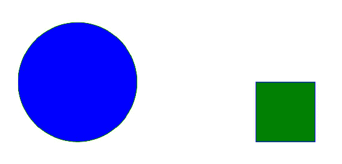
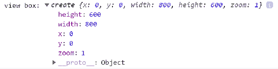
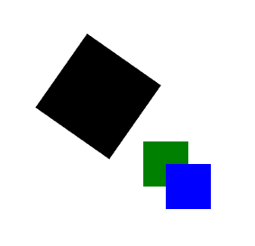
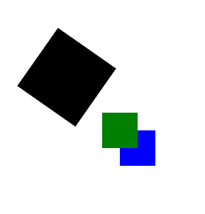
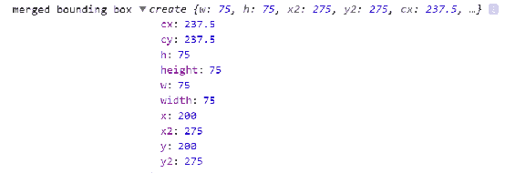

# 九、助手库 Snap.svg 和 SVG.js

到目前为止，在本书中我们已经学习了很多关于 SVG 的知识。 如果你已经走到了这一步，你已经准备好进行一些严肃的 SVG 开发，为此有三种方法:

*   继续完成我们在本书中已经完成的大部分工作——了解核心技术的交互方式以及将 SVG 集成到站点或应用的方式，就像您在任何标记中所做的那样。 用 JavaScript 和 CSS 操作它，你就准备好处理基本上任何事情了。 这是一种有效的方法，也是我在自己的工作中经常采用的方法。
*   使用任务特定的框架和库。 我们已经开始用 GSAP 和 Vivus 做动画了。 我们将继续在[第 10 章](10.html)，*与 D3.js*一起工作，当我们看 D3 时，一个强大的可视化框架。
*   使用通用 SVG 库可以帮助您完成各种 SVG 相关的任务。 SVG 是在 Raphael 这样的库的基础上进入 web 开发主流的，现在有很多库可供您在自己的工作中使用。 这个选项是本章的重点。

如前所述，由于浏览器支持有限，SVG 花了很多年才获得关注。 通用 SVG 图书馆叫 Raphael.js([http://dmitrybaranovskiy.github.io/raphael/)帮助支持桥梁通过提供一个非常聪明的**向量标记语言**(**VML**),](http://dmitrybaranovskiy.github.io/raphael/) [https://docs.microsoft.com/en-us/windows/desktop/vml/web-workshop---specs---standards----introduction-to-vector-markup-language--vml-](https://docs.microsoft.com/en-us/windows/desktop/vml/web-workshop---specs---standards----introduction-to-vector-markup-language--vml-)，旧版本的 Internet Explorer 的填充。 它还提供了在浏览器中处理 SVG 的友好 API，帮助不熟悉 SVG 的人快速、轻松地入门。

本章将讨论拉斐尔最受欢迎的两位继任者:

*   `Snap.svg`:拉斐尔的直接继承者，是《拉斐尔·js》的作者德米特里·巴拉诺夫斯基(Dmitry Baranovskiy)的图书馆([http://snapsvg.io/](http://snapsvg.io/))
*   `svg.js`:另一个小型的轻量级库，它为 SVG 提供了大量强大的选项([http://svgjs.com/](http://svgjs.com/)[)](http://svgjs.com/)

本章的其余部分将介绍每个库的基础知识，然后介绍一些熟悉的示例，这些示例经过重新设计以利用这些通用 SVG 工具的强大功能。

我们从 Snap.svg 开始。

# 使用 Snap.svg

SVG 是由 Dmitry Baranovskiy 编写的一个来自 Adobe 的 SVG 实用程序库。 它的功能相对齐全，具有友好、易于探索的 API，并且是开源的。 最近，这个库的开发速度有所放缓，但它仍然是一个有用的工具，如果您正在探索一个通用 SVG 库，那么应该注意这个工具。

让我们开始吧。

# 开始使用 Snap.svg

svg 在`npm`上可用，所以到目前为止最简单的方法是使用`npm`安装`Snap.svg`:

```html
npm install snapsvg
```

它也可以直接从网站[http://snapsvg.io/](http://snapsvg.io/)下载，也可以从 GitHub 下载或克隆[https://github.com/adobe-webplatform/Snap.svg](https://github.com/adobe-webplatform/Snap.svg)。

完成这些操作后，只需包括`node_modules`中的`snap.svg-min.js`或下载的文件夹，就可以开始使用 Snap 了。

在第一个示例中，我们将 Snap 加载到文档中，然后学习一些 Snap 基础知识，加载 Snap API 并操作 SVG。

最初，在第一个示例中，我们使用 ID`#target`获得对包含的`div`的引用。 然后，我们使用`new`关键字创建 Snap 实例，并将其存储在变量`S`中。 传入了两个参数:`800`和`600`。 它们表示 SVG 元素的宽度和高度。

While we will use the variable `S` to represent the `Snap.svg` API in this chapter, you can name the variable anything you like as long as you assign the return value of the `Snap.svg` constructor to it. There's nothing magical about S, other than the fact that it's the conventional variable name that the authors of Snap use for their examples. 

接下来，我们使用 Snap 实用程序方法`S.appendTo`将新的 SVG 元素添加到文档中，并使用`#target`元素作为容器。

既然在页面上有了 SVG 元素，我们就向文档中添加两个新的 SVG 元素，以显示使用 Snap 添加和操作 SVG 元素的基本模式。 我们加一个圆和一个矩形。 使用`S.circle`添加圆，并传入三个属性:`center x`、`center y`和`radius`。 一旦添加了圆环，我们将调用链式方法`attr`，传入`fill`和`stroke`。

接下来我们调用`S.rect`来创建一个矩形，传入`x`、`y`、`width`和`height`参数，并再次使用`attr`添加`fill`和`stroke`。

这种链接方法调用以操作 SVG 元素的类似 jquery 的模式是与 Snap 交互的核心。 如果您有这种开发风格的经验，您将很快掌握 Snap。 API 是清晰和逻辑的，所以很容易进行实验:

```html
<!doctype html>
<html lang="en">

<head>
 <meta charset="utf-8">
 <title>Mastering SVG- Basic Snap.svg demo</title>
 <link rel="stylesheet" 
  href="https://maxcdn.bootstrapcdn.com/bootstrap/4.0.0/css/bootstrap.m
  in.css" integrity="sha384-
  Gn5384xqQ1aoWXA+058RXPxPg6fy4IWvTNh0E263XmFcJlSAwiGgFAW/dAiS6JXm" 
  crossorigin="anonymous">
</head>

<body>

 <div class="container-fluid">
 <div class="row">
 <div class="col-12" id="target">

 </div>
 </div>
 </div>

 <script src="node_modules/snapsvg/dist/snap.svg-min.js"></script>
 <script>
 const target = document.getElementById("target");
 const S = new Snap(800,600);
 S.appendTo(target);
 S.circle(250,250,100)
 .attr({
 "fill":"blue",
 "stroke":"green"
 });
 S.rect(550,250,100,100)
 .attr({
 "fill":"green",
 "stroke":"blue"
 });
 </script>
</body>

</html>
```

在浏览器中运行上述操作会产生如下输出:



使用这个基本模式，我们现在可以开始使用 Snap 重新创建之前的一些演示。 看看我们是如何从核心技术过渡到库的，可以给您一种对库的感觉，以及它是否像您想要使用的东西。

# 动画与吸附

由于 SVG 动画是现代 web 的一个重要特性，Snap 提供了几个动画工具。 它还提供了操作现有 SVG 元素的能力，而不仅仅是 Snap 本身生成的元素(这是 SVG.js 做不到的)。 这个演示利用了这两个特性。

设置类似于我们在这个动画演示的早期示例中看到的。 我们通过获取三个元素引用开始演示:`document`的`doc`，`canvas`的父 SVG，以及`circle`元素的`circle`。 接下来，我们引用`viewBox`和相关的`width`来计算圆的终点。 这个新的终点存储为`newX`。

接下来是本示例的 Snap 特定特性。 首先，我们用 Snap 的 API 加载一个对`circle`元素的引用。 为此，我们将变量`circle`(一个指向`circle`元素的 DOM 引用)传递给 Snap。 如果您经常使用 jQuery，那么这可能是您熟悉的模式。

完成之后，我们可以使用 Snap`animate`方法让圆在屏幕上移动。 在本例中，`animate`有四个参数:

1.  第一个是指示动画结束状态的对象。 在本例中，我们将`cx`属性动画化为计算出的`newX`值。
2.  然后我们传入动画的持续时间，以毫秒计 3 秒。
3.  在那之后，我们通过动画缓和。 我们再次使用弹跳放松。 这是 Snap 的`mina`对象的一部分，它提供内置的缓动选项以及一些用于处理动画的其他实用程序。
4.  最后，我们传入一个`callback`函数在动画完成后运行。 这个函数将填充颜色改为红色:

```html
<!doctype html>
<html lang="en">

<head>
  <meta charset="utf-8">
  <title>Mastering SVG- SVG Animation with Snap.svg</title>
  <link rel="stylesheet" 
   href="https://maxcdn.bootstrapcdn.com/bootstrap/4.0.0/css/boot
   strap.min.css" integrity="sha384-
   Gn5384xqQ1aoWXA+058RXPxPg6fy4IWvTNh0E263XmFcJlSAwiGgFAW/dAiS6J
   Xm"
    crossorigin="anonymous">
</head>

<body>

  <div class="container-fluid">
    <div class="row">
      <div class="col-12">
        <svg  viewBox="0 0 1000
         450" width="1000" height="450" version="1.1" id="canvas"
         class="canvas">
          <circle cx="75" cy="225" r="50" fill="blue" 
           id="circle"></circle>
        </svg>
      </div>
    </div>
  </div>

  <script src="node_modules/snapsvg/dist/snap.svg-min.js"></script>
  <script>
    const doc = document;
    const canvas = doc.getElementById("canvas");
    const circle = doc.getElementById("circle");
    const viewBox = canvas.viewBox.baseVal;
    const width = viewBox.width;
    const newX = width - (circle.r.baseVal.value * 3);
    const S = new Snap(circle);

    S.animate({ "cx": newX }, 3000, mina.bounce, () => {
      S.attr({ "fill": "red" })
    });
  </script>
</body>

</html>
```

除了本例中看到的动画实用程序外，Snap 还包括使用 SVG 的其他实用程序。 下一节将演示其中的一些实用程序。

# Snap.svg 公用事业

本示例将演示用于使用 SVG 的两个有用的 Snap 实用程序。 使用像 Snap 这样的通用库的全部目的就是使用如下这样的实用方法。 本示例只展示了两个这样的实用程序，但这应该足以向您展示可用的东西。

这个例子的开始是标准的`Snap.svg`开发。 首先获取对`#target`元素的引用。 我们创建一个`Snap`变量`S`，然后将其附加到`#target`元素。

一旦它在文档中，我们就可以使用两个实用程序中的第一个。 它是对变量`bbox`的单行赋值，它返回 SVG 元素的边界框，在本例中是一个圆。

A bounding box is the smallest possible rectangle that can contain a shape (or group of shapes). 

让我们看看作业中发生了什么。 首先，我们在像素半径为`110`的(`255`，`255`)处创建一个新的`circle`。 然后添加`fill`和`stroke`，以便可以在 SVG 元素上看到它。 然后调用`getBbox`方法，该方法存储为`bbox`。

当我们用`console.log`输出`bbox`变量时，我们看到以下值:


如您所见，返回值包含的信息远不止包含元素的最小矩形的简单坐标。 它有这些信息(`x`、`y`、`height`,`width`),但它也有一些其他的属性可能有用如果你操纵元素相对于另一个元素在动画,可视化,或动态图。

下面的列表显示了边界框的值及其所代表的内容:

*   `cx`框中心的*x*值
*   `cy`框中心的*y*值
*   `h`盒子的高度
*   `height`盒子的高度
*   `path`框的路径命令
*   完全包围盒子的圆半径
*   方框所能包住的最小圆的半径
*   能被包围的最大圆的半径
*   `vb`将盒子作为`viewBox`命令
*   `w`盒子的宽度
*   `width`盒子的宽度
*   `x2`框右侧的*x*值
*   `x`框左侧的*x*值
*   `y2`框底边缘的*y*值
*   `y`框上边缘的*y*值

这是一个非常有用的，但可能并不特别的实用方法。 正如您将在 SVG.js 部分看到的，边界框是使用 SVG 时一个重要而常见的概念。

下一个示例实用程序更有趣一些。 让我们看看它是如何工作的。

为此，我们首先创建一个代表程式化字母 R 的`path`。您在前面的一个动画示例中看到了这个 R 和相关的`path`。 一旦将字母 R 插入到文档中，我们将向其添加`fill`和`stroke`，然后对其应用一个转换，以便将其集中在前面创建的`circle`上。 最终结果如下截图所示:


一旦插入路径，我们将再次调用`console.log`，并将另一个实用程序方法`path.getTotalLength()`作为参数传入。 `path.getTotalLength()`做它在 tin 上说的事情——它返回引用路径元素的总长度。

例如，如果你在一段定义的时间内沿着路径动画，那么获得路径的长度将是一个至关重要的度量。 正如下面的截图所示，这个实用程序提供了强大的指标，很少大惊小怪:


刚才描述的代码整体如下:

```html
<!doctype html>
<html lang="en">

<head>
  <meta charset="utf-8">
  <title>Mastering SVG- Snap.svg utilities</title>
  <link rel="stylesheet" 
   href="https://maxcdn.bootstrapcdn.com/bootstrap/4.0.0/css/bootstrap.
    min.css" integrity="sha384-
    Gn5384xqQ1aoWXA+058RXPxPg6fy4IWvTNh0E263XmFcJlSAwiGgFAW/dAiS6JXm"
    crossorigin="anonymous">
</head>

<body>

  <div class="container-fluid">
    <div class="row">
      <div class="col-12" id="target">

      </div>
    </div>
  </div>

  <script src="node_modules/snapsvg/dist/snap.svg-min.js"></script>
  <script>
    const target = document.getElementById("target");
    const S = new Snap(800,600);
    S.appendTo(target);
    const bbox = S.circle(255,255,110)
                    .attr({
                        "fill":"blue",
                        "stroke":"green"
                    }).getBBox();
    console.log("bounding box",bbox);

   const path = 
   S.path("M28.14,92.59c1.43,1.56,2.81,3,4,4.45,3.56,4.31,6.05,9.14,6.3
    9,14.82.37,6.35-2,11.81-5.82,16.7-.61.76-1.27,1.48-
    2,2.35,3.15-.86,6.09-1.74,9.07-2.48,2.82-.7,5.66-1.4,8.54-
    1.82a6.54,6.54,0,0,0,2.84-1.15c4.26-2.9,8.5-5.84,12.87-
    8.56a30.61,30.61,0,0,1,10.12-
    4.23c3.16-.64,6.11-.57,7.81,3a73.85,73.85,0,0,0-.4-7.64c-.51-4.55-
    1.4-9-3.7-13-2.84-5-7-6.39-12.32-4.22a32.44,32.44,0,0,0-
    9.07,6.17c-.38.34-.77.65-1.51,1.26-.88-4.66-1.72-9-5.08-12.1.76-
    1.26,1.5-2.32,2.05-3.46a22.71,22.71,0,0,0,1.38-
    3.57,31.72,31.72,0,0,0,0-16.47c-1-4.39-2.26-8.73-3.33-13.11-.37-
    1.53-.53-3.12-.77-4.58-12-.08-23.06-3.78-34.44-
   6.66L6.21,65.08l14.68,9.47L.83,105.88c5.07.89,9.91,1.7,14.74,2.6a1.5
  ,1.5,0,0,0,1.76-.72C20.86,102.76,24.42,97.8,28.14,92.59Z")
    .attr({"fill":"gray","stroke":"burgundy"})
    .transform("s2 t110,85");

    console.log("total length", path.getTotalLength());

  </script>
</body>

</html>
```

现在我们已经了解了一些 Snap 实用程序，让我们看看 Snap 的事件系统，该系统允许您以交互式的方式处理 SVG 元素，同时仍然严格地保持在 Snap API 的范围内。

# Snap.svg 事件

虽然您可能已经掌握了使用`Element.addEventListener`手动管理事件的方法，或者已经使用 jQuery 之类的工具来处理事件，但值得注意的是，Snap 提供了自己的一些事件实用程序。 如果您非常专注于 SVG 的工作，这允许您减少外部依赖。 在处理 SVG 元素时，它还允许您跳过 jQuery 等库提供的任何怪癖。

下面的示例是一个熟悉的示例，经过修改，显示了 Snap.svg 事件的工作方式。 在本例中，我们再次将`click`事件处理程序添加到空白的 SVG 画布上，并在单击处将随机大小的圆圈插入 SVG 元素中。 使用 Snap 实现此演示与前面看到的非常相似，但它具有一些值得注意的便利，并且它演示了 Snap 处理事件的直接方式。

该示例首先访问`#target`元素，设置`height`和`width`变量，然后创建一个添加到`#target`元素并存储在标准 Snap 变量`S`中的 Snap 实例。

一旦加载了 Snap，我们将链接一系列方法调用，使用`S.circle`方法添加一个圆，使用`attr`方法设置`fill`，然后使用 Snap 的`click`事件实用程序向元素添加一个单击事件处理程序。

`callback`函数称为当用户单击 SVG 元素几乎是一样的香草 JS 版本,尽管它使用吸附方法`S.circle`插入一个圆元素使用熟悉的随机参数`fill`、`radius`,`newX`,【5】:

```html
<!doctype html>
<html lang="en">

<head>
  <meta charset="utf-8">
  <title>Mastering SVG- SVG Events with Snap.svg</title>

</head>

<body>

  <div class="container-fluid">
    <div class="row">
      <div class="col-12" id="target">

      </div>
    </div>
  </div>

  <script src="node_modules/snapsvg/dist/snap.svg-min.js"></script>
  <script>
    const target = document.getElementById("target");
    const height = 600;
    const width = 800;
    const S = new Snap(width,height);
    S.appendTo(target);
    S.circle(250,250,100).attr({"fill":"blue"}).click(()=>{
      const newX = Math.random() * width;
      const newY = Math.random() * height;
      const r = Math.random() * height/2;
      const red = Math.random() * 255;
      const blue = Math.random() * 255;
      const green = Math.random() * 255;
      S.circle(newX,newY,r).attr({
        "fill":`rgba(${red},${blue},${green},${Math.random()})`
      });
    });

  </script>
</body>

</html>
```

如果您习惯使用 jQuery 或遵循类似模式的其他库，那么您应该能够快速掌握使用 Snap 的事件实用程序。

# 使用 Snap.svg 自定义数据可视化

最后一个使用`Snap.svg`的示例展示了如何使用它进行自定义数据可视化。 这将展示`Snap.svg`的许多功能，并提供该库的最终完整外观。

这个例子将再次可视化地显示出波士顿红袜队的大卫·奥尔蒂斯在他的红袜队生涯中，每年本垒打的正/负增量与平均每年本垒打的增量。

因为我们已经看到了这种可视化，所以在本节中，我们将只关注使用了`Snap.svg`的区域，而不是脚本的每一行。 如果你需要一个进修的发展形式和原因数据可视化本身以及指标计算,请回顾[第八章](08.html),*SVG 动画和可视化*,整个脚本的完整说明。

您将看到的第一个文件是 HTML 文件，它与此可视化的原始版本类似。 唯一的区别是包含了`node_modules`中的`Snap.svg`源文件:

```html
  <div class="container-fluid">
    <div class="row">
      <div class="col-12">
        <svg  viewBox="0 0 1000 450" 
         width="1000" height="450" version="1.1" id="canvas" 
         class="canvas">
        </svg>
      </div>
    </div>
  </div>

  <script src="node_modules/snapsvg/dist/snap.svg-min.js"></script>
  <script src="scripts.js"></script>
```

查看一下`scripts.js`的源代码，`viz()`函数在结构上是相同的，但是有一些与 snap 相关的差异，您需要注意。

The `data` variable is exactly the same and is truncated here to make the `viz()` function slightly easier to read. See [Chapter 8](08.html), *SVG Animation and Visualizations*, or the source code to see the full data set. 

在变量`data`之后，一些有趣的东西从变量`S`开始。 正如您前面看到的，`S`是`Snap.svg`的一个实例，它将成为我们进行大量工作的接口。 在此之后，这个版本与原始版本之间没有任何变化，直到我们使用对 SVG 元素的 DOM 节点`S.node`的 Snap 引用来访问 SVG 元素的`viewBox`。

接下来，您将注意到的最大区别是，可以使用 Snap 便利方法`S.rect`、`S.line`和`S.text`(都与`S.attr`配对)将行、框和文本元素添加到屏幕上。 我们还使用`S.addClass`向其中一行添加一个 CSS 类。

因为所有这些方法都存在于`Snap.svg`中，所以这个示例与我们仅使用 javascript 的示例之间的最大区别就是缺少我们自己的、手工生成的方便方法。 由于 Snap 提供了这么多方便的特性，我们不需要自己提供它们。 这本身就很好，当然，Snap 包含了比`S.rect`、`S.line`、`S.text`和`S.attr`更方便的方法:

```html
function viz() {
  /*
    ES6
  */
  const data = [
    /* truncated for brevity - see Chapter 8 for the full data set*/   
    {
      "year": 2016,
      "hrs": 38
    }
  ];

  const doc = document;
  const canvas = doc.getElementById("canvas");
  const S = new Snap(canvas);
  function maxDiffer(arr) {
    let maxDiff = arr[1] - arr[0];
    for (let i = 0; i < arr.length; i++) {
      for (let j = i + 1; j < arr.length; j++) {
        if (arr[j] - arr[i] > maxDiff) {
          maxDiff = arr[j] - arr[i];
        }
      }
    }
    return maxDiff;
  }
  document.addEventListener("DOMContentLoaded", () => {
    const viewBox = S.node.viewBox.baseVal;
    const width = viewBox.width;
    const height = viewBox.height;
    const x = viewBox.x;
    const y = viewBox.y;
    const padding = width / 200;
    const vizWidth = width - padding;
    const years = data.length;
    const total = data.reduce((total, item) => {
      return total + item.hrs;
    }, 0);
    const avg = total / years;
    const verticalMidPoint = (y + height) / 2;
    const diffs = data.map((item) => {
      return item.hrs - avg;
    });
    const maxDiff = maxDiffer(diffs);
    const yIntervals = verticalMidPoint / maxDiff;
    const xInterval = (vizWidth / years);
    for (const i in diffs) {
      const newX = xInterval * i;
      const newY = diffs[i] * yIntervals;
      if (diffs[i] < 0) {
        S.rect(
          newX + padding,
          verticalMidPoint,
          xInterval - padding,
          Math.abs(newY)
        ).attr({ 
          "fill": "#C8102E", 
          "stroke": "#ffffff" 
        });

        S.text(
          newX + padding, 
          verticalMidPoint + Math.abs(newY) + (padding * 3), 
          `${data[i].hrs} in ${data[i].year}`
        );
      }
      else if (diffs[i] > 0) {
        S.rect(
          newX + padding,
          verticalMidPoint - newY,
          xInterval - padding,
          newY,
        ).attr({ 
          "fill": "#4A777A", 
          "stroke": "#ffffff" 
        });

        S.text(
          newX + padding,
          verticalMidPoint - newY - (padding * 2)
          , `${data[i].hrs} in ${data[i].year}`
        );
      }
      S.line(
        x,
        verticalMidPoint,
        width,
        verticalMidPoint
      ).attr({ 
        "stroke": "#ffffff" 
      });
      S.text(
        x + padding,
        height - (padding * 3)
        `Based on an average of ${avg} home runs over ${years} years`
       ).addClass("large");
    }
  });

}

viz();
```

现在我们已经很好地了解了`Snap.svg`，并希望让您对它的使用有了一些感觉，让我们看一下另一个`helper`库，也就是适当命名的 SVG.js。

# 使用 SVG.js

SVG.js 由 Wout Fierens 创建，目前由 Ulrich-Matthias Schäfer、Jon Ronnenberg 和 Rémi Tétreault 维护。 它被设计为轻量级和快速的，并且是使用 SVG 的友好界面。 它比`Snap.svg`更积极地维护，所以它有这个优势。 在撰写本文时，最近的代码是在过去两周内添加到项目中的。

# 开始使用 SVG.js

和`Snap.svg`一样，SVG.js 也可以在`npm`上使用，所以最简单的方法是使用`npm`来安装 SVG.js:

```html
npm install svg.js
```

Make sure you install `svg.js` with `npm` and not `svg.js`. Both work and both point to the correct project. `svg.js` is, however, out of date because the official package is `svg.js`.

也可以从网站[http://svgjs.com/installation/#download](http://svgjs.com/installation/#download)直接下载。 也可以从 GitHub 下载或克隆[http://svgjs.com/](http://svgjs.com/)，并可以在`cdnjs`[上使用。](http://snapsvg.io/)

一旦您完成了这些工作，就很容易从`node_modules`或下载的文件夹中包含`svg.min.js`，然后您就可以开始使用 SVG.js 了。

第一个示例重复了先前的蓝色圆圈/绿色正方形演示。 SVG.js 的惯例，如他们的演示所示，是使用一个变量`draw`来保存所使用的 SVG.js 的加载实例。

要创建 SVG.js 的实例，您需要传入一个对目标 HTML 元素的引用，SVG.js 将加载的 SVG 元素插入到目标元素中，以便您使用。 然后链接一个方法`SVG.size`，该方法将设置新创建的 SVG 元素的大小。

While we will use the variable `draw` to represent the SVG.js API in this chapter, you can name the variable anything you like. As long as you assign the return value of the SVG.js constructor to it, any variable name will work. There's nothing specifically magical about `draw`, other than the fact that it's the conventional variable name that the authors of SVG.js use for their examples.

`Snap.svg`的`true`和变量`S`也是如此。 这些只是惯例。

SVG.js isn't designed to work with an existing SVG element, so you have to slightly change your approach if you're used to getting a reference to an existing SVG element and then manipulating it. 

有了`draw`的引用并将 SVG 元素添加到页面后，就可以开始操作 SVG 元素，添加正方形和圆形。

看看圆的例子，我们调用命名清楚的方法`draw.circle`来创建圆。 `draw.circle`接受*一个*参数，即圆的*半径*。

有趣的是，所有其他属性都是使用熟悉的(来自 jQuery 和 Snap)`attr`方法操作的。 我认为这是一个奇怪的选择，因为只有半径的圆并不是很有用。 `draw.rect`也一样，它需要矩形的高度和宽度作为参数，然后用`attr`作为属性执行所有其他操作。

这个语法工作得很好。 但有趣的是，这些属性分布在两个方法中:

```html
<!doctype html>
<html lang="en">

<head>
  <meta charset="utf-8">
  <title>Mastering SVG- Basic SVG.js demo</title>
  <link rel="stylesheet" 
   href="https://maxcdn.bootstrapcdn.com/bootstrap/4.0.0/css/bootstrap.
    min.css" integrity="sha384-
    Gn5384xqQ1aoWXA+058RXPxPg6fy4IWvTNh0E263XmFcJlSAwiGgFAW/dAiS6JXm"
    crossorigin="anonymous">
</head>

<body>

  <div class="container-fluid">
    <div class="row">
      <div class="col-12" id="target">

      </div>
    </div>
  </div>

  <script src="node_modules/svg.js/dist/svg.min.js"></script>
  <script>
    const draw = SVG('target').size(800,600);
    draw.circle(200)
        .attr({
          "fill":"blue",
          "stroke":"green", 
          "x":250,
          "y":250
        });
    draw.rect(100,100)
        .attr({
          "fill":"green",
          "stroke":"blue", 
          "x":550,
          "y":250
        });
  </script>
</body>

</html>
```

# 动画与 SVG.js

现在我们已经看到了在页面中插入元素的基本示例，让我们继续使用与`Snap.svg`相同的模式，并看看如何使用 SVG.js 创建动画。

我们还需要一个依赖项来让动画在 SVG.js 中正常运行`svg.easing.js`。 这是一个使用 SVG 动画的简化函数库:

```html
npm install svg.easing.js
```

在包含主 SVG.js 文件之后再包含它，就可以开始了。

从这个示例开始，我们创建了几个变量，以在整个动画中使用`width`、`height`、`cx`、`cy`和`radius`。 前面已经看到了这些，它们映射到 SVG 元素的属性。

然后创建 SVG.js 实例，使用`height`和`width`值作为参数，并将其存储在`draw`变量中。 在此之后，我们将创建`circle`元素，并将`radius`变量作为唯一参数调用`draw.circle`。 然后，我们分别调用带有蓝色`fill`值的`attr`和`cx`和`cy`变量作为`cx`和`cy`属性的值。 这将在 SVG 元素的正确位置创建蓝色圆圈。

然后计算变量`newX`。 然后，我们使用 SVG.js 方法`circle.animate`将圆动画为新值。 `animate`方法有三个参数，`3000`表示动画的长度，`SVG.easing.bounce`表示要使用的缓动函数(来自`svg.easing.js`)，以及`1000`表示动画延迟。

接下来是一个链式操作方法`center`，在本例中，它指示要执行的动画类型。 `center`将元素的中心移动到传递给它的新`(x,y)`坐标。 将其与`animate`链接意味着您将在这两个状态之间顺利地进行动画操作。 在我们的示例中，`center`将`newX`和原来的`cy`变量作为参数，这为我们提供了新的水平位置，同时保留了原来的垂直位置。

最后，为了演示动画`callback`方法，我们使用方法`after`，该方法允许我们在动画完成后运行一个函数。 这里我们简单地用`attr`方法改变圆的颜色:

```html
<!doctype html>
<html lang="en">

<head>
  <meta charset="utf-8">
  <title>Mastering SVG- SVG Animation with SVG.js</title>
  <link rel="stylesheet" 
   href="https://maxcdn.bootstrapcdn.com/bootstrap/4.0.0/css/bootstrap.
    min.css" integrity="sha384-
    Gn5384xqQ1aoWXA+058RXPxPg6fy4IWvTNh0E263XmFcJlSAwiGgFAW/dAiS6JXm"
    crossorigin="anonymous">
</head>

<body>

  <div class="container-fluid">
    <div class="row">
      <div class="col-12" id="canvas">

      </div>
    </div>
  </div>

  <script src="node_modules/svg.js/dist/svg.min.js"></script>
  <script src="node_modules/svg.easing.js/dist/svg.easing.min.js"></script>
  <script>
    const width = 1000;
    const height = 450;
    const radius = 50;
    const cx = 75;
    const cy = 225;
    const draw = SVG('canvas').size(width,height);
    const circle = draw.circle(radius * 2)
                        .attr({
                            "fill":"blue",
                            "cx":cx,
                            "cy":cy
                         });
    const newX = width - (radius * 3);
    circle.animate(3000, SVG.easing.bounce, 1000)
      .center(newX,cy)
      .after(function(situation) {
        this.attr({ 
          "fill": 'red' 
        });
      });

  </script>
</body>
</html>
```

正如我们在这两个例子中看到的，SVG.js API 中有一些奇怪的地方。 由于这些特性是一致的，比如在两个链接的方法中设置属性，您可以很快地习惯它们。

# SVG.js 公用事业

与`Snap.svg`一样，SVG.js 有一组实用函数来帮助您使用 SVG。 其中一些真的很棒。 这个例子展示了它们中有多少是有效的。

首先，我们创建一个加载的 SVG.js 变量，绘制并传递`800`、`600`给`height`和`width`。

从一些实用程序开始，我们调用`draw.viewbox()`来获得 SVG 元素的`viewBox`。 如果您还记得使用`Snap.svg`完成的可视化示例，您将记得我们必须导航多个属性才能在 Snap 中访问`viewBox`。 根本没有方便的方法，只有表示 SVG 元素的 DOM 节点的一个属性。

这里我们有一个方便的方法直接返回它:



接下来，我们加载一个变量`rect`，在(`100`，`100`)`console.log`处加载一个`100`by`100`的矩形`rect.bbox()`，它返回矩形的边界框。 正如你在下面的截图中看到的，它的属性比边界框的例子`Snap.svg`要少，但它仍然有用，因为你需要与这个元素进行清晰的交互:


下面介绍与标准边框相关的一个非常有用的实用程序。

首先，我们使用 SVG.js 的`transform`方法对矩形进行变换，旋转 125 度。 `transform`是一个`getter `/`setter`，在不带参数调用时将返回当前转换值，在带参数调用时将设置该值。

一旦我们转换了`rect`矩形，我们将`console.log`取出`rect.rbox()`的返回值，它将返回一个边界框，该框表示包含了*所有转换的元素的可视化表示。* 这将节省你大量的代码，如果你正在处理转换的元素:


下一个方法`data`的工作原理与 jQuery 数据方法类似。 `setter`，`rect.data({"data":"storing arbitrary data"}),`，`data`设置对象上的任意数据，存储在用户提供的标签下。 作为`getter`调用，并将标签作为参数`rect.data("data")`传入，它返回带标签的数据的值:


下一个实用方法允许您调整 SVG 元素的堆栈。 与绝对定位的 HTML 元素(具有显式的堆叠顺序(z-index))不同，SVG 元素是根据它们在 DOM 中的外观分层的。 DOM 中较晚出现的元素位于 DOM 中较早出现的元素之上。

下一个代码块展示了如何使用 SVG.js 实用程序调整这种堆叠顺序。

首先，我们创建两个正方形，一个绿色正方形，然后一个蓝色正方形。 当它们最初出现在屏幕上时，它们的外观如下图所示:



然后，在一秒的超时时间内，我们调用`back()`方法，该方法将元素发送到堆栈的后面。 之后，方块看起来如下所示:



现在我们在屏幕上有了两个正方形，是时候看看最后一个超级有用的与边界框相关的实用工具了。 如果调用`first.bbox().merge`并传入`second.bbox()`作为参数，就会得到一个合并的边界框。 如果你正在处理多个不属于结构化 SVG 组的元素，这将非常有用:



下面是整个代码示例:

```html
<!doctype html>
<html lang="en">

<head>
  <meta charset="utf-8">
  <title>Mastering SVG- SVG.js utilities</title>
  <link rel="stylesheet" 
   href="https://maxcdn.bootstrapcdn.com/bootstrap/4.0.0/css/bootstrap.
    min.css" integrity="sha384-
    Gn5384xqQ1aoWXA+058RXPxPg6fy4IWvTNh0E263XmFcJlSAwiGgFAW/dAiS6JXm"
    crossorigin="anonymous">
</head>

<body>

  <div class="container-fluid">
    <div class="row">
      <div class="col-12" id="canvas">

      </div>
    </div>
  </div>

  <script src="node_modules/svg.js/dist/svg.min.js"></script>
  <script>
    const draw = SVG('canvas').size(800,600);
    console.log("view box:",draw.viewbox());
    const rect = draw.rect(100,100)
                    .attr({
                        "x":100,
                        "y":100
                     });
    console.log("bounding box:", rect.bbox());
    rect.transform({ rotation: 125 });
    console.log("rbox:",rect.rbox());
    rect.data({"data":"storing arbitrary data"});
    console.log("data method:", rect.data("data"));

    const first = draw.rect(50,50)
                      .attr({
                          "x": 200,
                          "y": 200, 
                          "fill": "green"
                       });
    const second = draw.rect(50,50)
                        .attr({
                            "x": 225,
                            "y": 225, 
                            "fill": "blue"
                        });
    setTimeout(()=> {
      second.back();
    },2000);
    console.log("merged bounding box", first.bbox().merge(second.bbox()));

  </script>
</body>

</html>
```

# SVG.js 事件

SVG.js 也有事件处理实用程序。 下面的示例将演示 SVG.js 提供的非常熟悉的事件处理模式。

再一次，我们通过将`click`事件绑定到一个函数来说明事件处理，该函数在画布上插入随机大小的圆圈并随机填充。 这也将说明 SVG.js`front()`方法的一个很好的用法。

该示例首先创建`draw`变量，设置其高度和宽度，然后使用 SVG.js 增强的`circle`元素创建一个`circle`变量。

之后，我们将一个`click`事件绑定到圆圈上，它使用事件实用程序`circle.click`创建随机大小/填充的圆圈元素。 这是简单的。 与`Snap.svg`或早期 jQuery 版本中的示例一样，您将`callback`方法作为参数传递给`click`，这就是正确绑定事件所需要的全部内容。

在`callback`中，我们使用`draw.circle`创建圆，其中包含每次函数运行时生成的随机值。

在这里使用 SVG.js 的一个好处是，您可以在添加每个圆圈后调用`circle.front()`，从而始终确保可单击的圆圈位于堆栈的顶部。 否则，它最终可能会被出现在它上面的其他元素所掩埋，因为它们是后来插入到 DOM 中的:

```html
<!doctype html>
<html lang="en">

<head>
  <meta charset="utf-8">
  <title>Mastering SVG- SVG.js Events

  </title>
</head>

<body>

  <div class="container-fluid">
    <div class="row">
      <div class="col-12" id="target">

      </div>
    </div>
  </div>

  <script src="node_modules/svg.js/dist/svg.min.js"></script>
  <script>
    const height = 600;
    const width = 800;
    const draw = SVG('target').size(width,height);
    const circle = draw.circle(100)
                    .attr({
                      "fill":"blue",
                      "cx":250,
                      "cy":250
                    });

    circle.click((e)=> {
      const newX = Math.random() * width;
      const newY = Math.random() * height;
      const r = Math.random() * height/2;
      const red = Math.random() * 255;
      const blue = Math.random() * 255;
      const green = Math.random() * 255;
      draw.circle(r)
        .attr({
            "cx": newX,
            "cy": newY,
            "fill":`rgba(${red},${blue},${green},${Math.random()})`
          });
      circle.front();
    });

  </script>
</body>

</html>
```

# 使用 SVG.js 自定义数据可视化

本章的最后一个例子是另一个自定义数据可视化的例子。 我们将再次回顾大卫·奥尔蒂斯作为波士顿红袜队的一员在职业生涯中打出的全垒打。

由于我们已经多次看到这种情况，我们可以简单地关注 SVG.js 可以帮助我们完成这项工作的方式。

您将看到的第一个文件是 HTML 文件。 它和普通 JS 版本之间的唯一区别是包含了来自`node_modules`的 SVG. JS 源文件，并且没有基本的 SVG 元素:

```html
  <div class="container-fluid">
    <div class="row">
      <div class="col-12" id="target">

      </div>
    </div>
  </div>
  <script src="node_modules/svg.js/dist/svg.min.js"></script>
  <script src="scripts.js"></script>
</body>
```

`viz()`函数与我们在`Snap.svg`版本中看到的类似。 为了可读性，我们再次剪辑了数据对象。

接下来是使用 SVG.js 的常见模式。 我们设置`width`和`height`变量，然后使用`width`和`height`变量作为参数创建`draw`SVG.js 实例。

SVG.js 首先发挥作用的地方是`DOMContentLoaded callback`函数中易于使用的`viewBox()`方法，该方法返回 SVG 元素的`viewBox`。 我们使用这个变量来计算可视化中使用的多个变量。 熟悉后超过 20 行创建变量(见第八章[,*SVG 动画和可视化,为复习什么这些),我们画一些箱子,我们画一些线条,我们添加一些文本。*](08.html)

 *让我们看一个例子，看看 SVG.js 如何帮助实现这些功能。

通过绘制方框，我们可以公开 SVG.js 提供的一些非常方便的方法来替代`attr`中的设置属性。 `draw.rect`的调用与前面一样，传入每个盒子的计算宽度和高度。 然后,我们三个方法调用链:`attr`用于设置`x`和`y`然后,说明他们的可用性,我们也使用两个便利方法,`fill`和`stroke`,直接设置`fill`和【显示】。 很有可能简单地将所有内容设置为`attr`的参数，但是如果您喜欢以这种方式链接方法调用，那么调用`fill`和`stroke`来设置这些属性对您来说是一个不错的选择。

绘制文本介绍了一种新的方法，`draw.plain`。 有一个`draw.text`方法，但是`draw.text`被设计用于处理较大的文本块，因此在混合中引入`tspan`元素来帮助控制流和换行符。 这实际上非常聪明，对于在 SVG 中处理长文本块的许多情况来说，这是一个有用的选项，因为与流和换行有关的一切都必须手动处理。 在这些情况下，有多个元素一起工作是很好的。

然而，`draw.plain`非常适合我们这里的需要，因为我们只对单个文本元素感兴趣。 要使用它，我们调用`draw.plain`，将连接的字符串作为参数传入，然后使用好友`attr`设置`(x,y)`坐标。

绘制线条需要四个初始参数，开始的`(x,y)`和结束的`(x,y)`。 一旦我们提供这些值作为计算其他`viz()`功能,我们可以添加一个中风,通过`draw.attr``draw.stroke`(如本例)或(如果你愿意),或添加一个类使用方便的方法【5】:

```html
function viz() {
  /*
    ES6
  */
  const data = [
/* truncated for brevity - see Chapter 8 for the full data set */
    {
      "year": 2016,
      "hrs": 38
    }
  ];
  const width = 1000;
  const height = 450;
  const draw = SVG("target").size(width, height);
  function maxDiffer(arr) {
    let maxDiff = arr[1] - arr[0];
    for (let i = 0; i < arr.length; i++) {
      for (let j = i + 1; j < arr.length; j++) {
        if (arr[j] - arr[i] > maxDiff) {
          maxDiff = arr[j] - arr[i];
        }
      }
    }
    return maxDiff;
  }
  document.addEventListener("DOMContentLoaded", () => {
    const viewBox = draw.viewbox();
    const width = viewBox.width;
    const height = viewBox.height;
    const x = viewBox.x;
    const y = viewBox.y;
    const padding = width / 200;
    const vizWidth = width - padding;
    const years = data.length;
    const total = data.reduce((total, item) => {
      return total + item.hrs;
    }, 0);
    const avg = total / years;
    const verticalMidPoint = (y + height) / 2;
    const diffs = data.map((item) => {
      return item.hrs - avg;
    });
    const maxDiff = maxDiffer(diffs);
    const yIntervals = verticalMidPoint / maxDiff;
    const xInterval = (vizWidth / years);
    for (const i in diffs) {
      const newX = xInterval * i;
      const newY = diffs[i] * yIntervals;
      if (diffs[i] < 0) {
        draw.rect(
          xInterval - padding,
          Math.abs(newY)
        )
        .attr({
          "x": newX + padding,
          "y": verticalMidPoint,
        })
        .fill("#C8102E")
        .stroke("#ffffff");

        draw.plain(`${data[i].hrs} in ${data[i].year}`)
        .attr({
          "x": newX + padding,
          "y": verticalMidPoint + Math.abs(newY) + (padding * 3)
        });
      }
      else if (diffs[i] > 0) {
        draw.rect(
          xInterval - padding,
          newY,
        )
        .attr({
          "x": newX + padding,
          "y": verticalMidPoint - newY
        })
        .fill("#4A777A")
        .stroke("#ffffff");

        draw.plain(`${data[i].hrs} in ${data[i].year}`)
        .attr({
          "x": newX + padding,
          "y": verticalMidPoint - newY - (padding * 2)
        });
      } 
    }
    draw.line(
      x,
      verticalMidPoint,
      width,
      verticalMidPoint
    )
    .attr({ 
      "stroke": "#ffffff" 
    });

    draw.plain(`Based on an average of ${avg} home runs over ${years} years`)
    .attr({
      "x": x + padding,
      "y": height - (padding * 3)
    })
    .addClass("large");
  });

}

viz();
```

# 总结

本章快速介绍了使用 SVG 的两个独立库`Snap.svg`和 SVG.js。 在这两个库中执行之前在普通 JS 中处理过的相同的熟悉的任务，可以让您看到使用普通 JS 处理 SVG 操作和使用库处理它们之间的区别。 您还可以在类似的任务中比较这两个库本身。

总之，您已经通过这两个库学习了许多不同的主题，包括如何开始、如何激活元素、如何处理事件以及如何进行自定义数据可视化。

现在我们已经了解了通用库，接下来我们将了解最后一个具有非常特定目的的 SVG 库，即 D3.js。 D3 用于繁重的数据可视化，是使用 SVG 的最强大工具之一。*