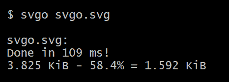
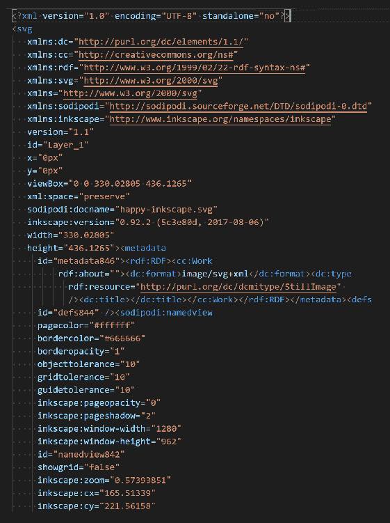
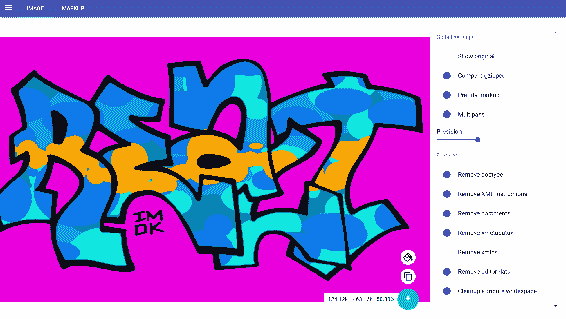

# 十一、优化 SVG 的工具

现在，您已经了解了本书中关于 SVG 的所有内容—从纯 SVG 标记的基础知识到您在过去几章中完成的基于 javascript 的动态 SVG 工作—您已经准备好充分利用 SVG 提供的一切了。

我们应该考虑的 SVG 的最后一个方面是，当您为用户提供服务时，如何确保您所做的工作以最好的方式呈现。 SVG 应该针对性能进行优化，包括在线性能和复杂性。 保持 SVG 文件尽可能精简，并有效地为它们提供服务，将为用户带来更好的体验。

本章将作为对优化 SVG 图像的多种方法的高级介绍。 接下来的一些是纯粹的、与性能相关的工程。 其他则是纯 SVG 工具。

在本章中，你将学到以下内容:

*   在三个流行的服务器平台(IIS、Apache 和 nginx)上压缩 SVG
*   SVGO 及其相关工具套件
*   svgcleaner 是 SVGO 的替代方案，提供无损优化

# SVG 提供压缩

使用 SVG 可以实现的最直接的性能增强之一是在提供`gzip`文件时压缩它们。 虽然文本文件在提供给浏览器时通常受益于 gzip，但由于 SVG 图像的使用方式(通常用于核心界面)以及一些文件的潜在大小，SVG 是一个特别重要的目标。 您希望图像快速加载，SVG 也不例外。

根据您的平台，这可能很简单，只需添加几行代码或在对话框中勾选一个框。 接下来的几节将向您展示如何在三个常见的 web 服务器上实现此操作。

# 在 Apache 上压缩 SVG

将以下代码放置在何处取决于 Apache 实例的设置方式以及对服务器的访问权限。 在共享主机上的大多数人将在他们的`.htaccess`文件中这样做。 `.htaccess`是服务器根目录中的一个特殊文件，它允许您配置 Apache 行为，而不必访问主配置文件(`httpd.conf`)。 假设您的服务器允许您访问这个功能(一些主机不允许您打开压缩，因为它使用更多的服务器资源)，gzip 文本内容就像在您的`.htaccess`文件中添加以下内容一样简单。 示例代码取自 H5BP Apache 服务器配置项目([https://github.com/h5bp/server-configs-apache/blob/master/dist/.htaccess#L795](https://github.com/h5bp/server-configs-apache/blob/master/dist/.htaccess#L795))。 有三个部分:

*   第一个修复了一个问题，请求头被代理服务器破坏，因此资产没有被 gzip 服务(这修复了不仅仅是 SVG)
*   第二个实际上是告诉 Apache 压缩列出的 MIME 类型的文件(这里缩写为; 通常列出了几十种不同的 MIME 类型)
*   第三种方法确保以压缩格式`.svgz`压缩并保存的 SVG 文件得到正确的服务:

```html
# ######################################################################
# # WEB PERFORMANCE #
# ######################################################################

# ----------------------------------------------------------------------
# | Compression |
# ----------------------------------------------------------------------

<IfModule mod_deflate.c>

    # Force compression for mangled `Accept-Encoding` request headers
    #
    # https://developer.mozilla.org/en-US/docs/Web/HTTP/Headers/Accept-Encoding
    # https://calendar.perfplanet.com/2010/pushing-beyond-gzipping/

    <IfModule mod_setenvif.c>
        <IfModule mod_headers.c>
            SetEnvIfNoCase ^(Accept-EncodXng|X-cept-Encoding|X{15}|~{15}|-{15})$ ^((gzip|deflate)\s*,?\s*)+|[X~-]{4,13}$ HAVE_Accept-Encoding
            RequestHeader append Accept-Encoding "gzip,deflate" env=HAVE_Accept-Encoding
        </IfModule>
    </IfModule>

    # - - - - - - - - - - - - - - - - - - - - - - - - - - - - - - - - -

    # Compress all output labeled with one of the following media types.
    #
    # https://httpd.apache.org/docs/current/mod/mod_filter.html#addoutputfilterbytype

    <IfModule mod_filter.c>
        AddOutputFilterByType DEFLATE "application/atom+xml" \
                                      "application/javascript" \
                                      "application/json" \
# Many other MIME types clipped for brevity
                                      "image/svg+xml" \
# Many other MIME types clipped for brevity        
                                      "text/xml"

    </IfModule>

    # - - - - - - - - - - - - - - - - - - - - - - - - - - - - - - - - -

    # Map the following filename extensions to the specified
    # encoding type in order to make Apache serve the file types
    # with the appropriate `Content-Encoding` response header
    # (do note that this will NOT make Apache compress them!).
    #
    # If these files types would be served without an appropriate
    # `Content-Enable` response header, client applications (e.g.:
    # browsers) wouldn't know that they first need to uncompressed
    # the response, and thus, wouldn't be able to understand the
    # content.
    #
    # https://developer.mozilla.org/en-US/docs/Web/HTTP/Headers/Content-Encoding
    # https://httpd.apache.org/docs/current/mod/mod_mime.html#addencoding

    <IfModule mod_mime.c>
        AddEncoding gzip svgz
    </IfModule>

</IfModule>
```

# 在 nginx 上压缩 SVG

与 Apache 类似，为 SVG 打开`gzip`压缩只需要几行配置。 这个代码块来自于 HTML5 样板 nginx 服务器 configs 项目([https://github.com/h5bp/server-configs-nginx/blob/master/nginx.conf#L89](https://github.com/h5bp/server-configs-nginx/blob/master/nginx.conf#L89))，提供了一个如何做到这一点的例子。 代码将打开`gzip`压缩，设置`gzip`压缩级别，停止对已经很小的对象的压缩，为代理设置一些值，然后将 SVG MIME 类型添加到应该压缩的对象列表中(同样，这里是缩写; 通常列出了几十种不同的 MIME 类型):

```html
# Enable gzip compression.
  # Default: off
  gzip on;

  # Compression level (1-9).
  # 5 is a perfect compromise between size and CPU usage, offering about
  # 75% reduction for most ASCII files (almost identical to level 9).
  # Default: 1
  gzip_comp_level 5;

  # Don't compress anything that's already small and unlikely to shrink much
  # if at all (the default is 20 bytes, which is bad as that usually leads to
  # larger files after gzipping).
  # Default: 20
  gzip_min_length 256;

  # Compress data even for clients that are connecting to us via proxies,
  # identified by the "Via" header (required for CloudFront).
  # Default: off
  gzip_proxied any;

  # Tell proxies to cache both the gzipped and regular version of a resource
  # whenever the client's Accept-Encoding capabilities header varies;
  # Avoids the issue where a non-gzip capable client (which is extremely rare
  # today) would display gibberish if their proxy gave them the gzipped version.
  # Default: off
  gzip_vary on;

  # Compress all output labeled with one of the following MIME-types.
  # text/html is always compressed by gzip module.
  # Default: text/html
  gzip_types
    # Many other MIME types clipped for brevity
    image/svg+xml
    # Many other MIME types clipped for brevity
```

# 在 IIS 上压缩 SVG

默认情况下，IIS 不会压缩 SVG 文件。 根据服务器的配置方式，需要在您的`applicationHost.config`(`C:\Windows\System32\inetsrv\config`)或`web.config`文件中进行以下更改。 只需将 SVG MIME 类型添加到`httpCompression`模块中的`staticTypes`和`dynamicTypes`元素中，就可以开始了:

```html
<httpCompression directory="%SystemDrive%\inetpub\temp\IIS Temporary Compressed Files">
    <scheme name="gzip" dll="%Windir%\system32\inetsrv\gzip.dll" />
        <staticTypes>
            <add mimeType="image/svg+xml" enabled="true" />
        </staticTypes>
        <dynamicTypes>
            <add mimeType="image/svg+xml" enabled="true" />
        </dynamicTypes>
</httpCompression>
```

既然我们已经了解了如何有效地提供 SVG，那么现在是时候在 SVG 上服务器之前研究一些优化 SVG 的方法了。

# SVGO

SVG 优化器([https://github.com/svg/svgo](https://github.com/svg/svgo))是一个用于优化 SVG 文件的 Node.js 实用程序。 SVG 文件，特别是那些由编辑器生成的文件，可能有许多与之相关的问题。 SVGO 可以清理元数据、注释、隐藏元素等等，而不需要更改 SVG 元素本身的呈现方式。

要安装它，假设你已经安装了 Node.js，在命令行上运行以下命令:

```html
$ npm install -g svgo
```

用法就像这样简单:

```html
svgo svgo.svg
```

在 Inkscape 生成的一个小文件上运行它，文件大小会减少 50%以上:



如果您查看`svgo.svg`源代码中优化前后的变化，就会发现明显的差异。

下面的截图显示了 Inkscape 在编写过程中添加的元数据:



这张截图显示了优化后的清理文件:


它是一个很棒的工具，具有许多配置选项([https://github.com/svg/svgo#usage](https://github.com/svg/svgo#usage))，并与其他工具([https://github.com/svg/svgo#other-ways-to-use-svgo](https://github.com/svg/svgo#other-ways-to-use-svgo))集成。

# SVGOMG

在前面的链接中列出的一个集成是 SVGO 的一个 web 前端，叫做 SVGOMG([https://jakearchibald.github.io/svgomg/](https://jakearchibald.github.io/svgomg/))。 SVGOMG 是 SVGO 的一个网页前端。 在 UI 中公开几乎所有的选项，可以让您更深入地研究 SVGO 提供的优化，而不必仔细研究所有的配置选项。 将 SVG 元素加载到界面中，会显示如下视图:



加载的 SVG 在左边，显示在优化的视图中。 您可以切换 Show original 按钮，以查看是否有由于优化而导致的可见图像的退化。

Keep in mind that some of the optimizations that SVGO offers are potentially *lossy*. This means that the image itself might change in some visible way; the effective data of the image will be lost, because of the optimizations that are run. 

然后，在右侧有许多可供你调整图片的选项。 有一个预览版，然后有一个下载按钮，你可以下载自己的作品。

虽然很多人会将这种优化作为构建过程的一部分进行自动化，但很高兴知道你可以在 web 上对这个工具进行细粒度的控制，并对你的更改进行即时反馈。

# SVGO 编写插件

除了可用的命令行工具和基于 web 的界面之外，还有一些编辑插件可供您将 SVGO 集成到您的编辑工作流中。 `SVG-NOW`是 Adobe Illustrator 的一个插件(尽管它似乎已经被抛弃了; 它自 2014 年以来一直没有更新)和 SVGO 压缩机是一个积极开发的插件，流行的应用，Sketch。 如果你有一个设计团队，你可以节省自己的时间，然后将这些优化提前整合到生产过程中。 因为他们将控制输出过程，他们将准确地知道 SVGO 优化的输出结果是什么。

# svgcleaner

svgcleaner 是 SVGO 的替代方案，提供*[(](https://github.com/RazrFalcon/svgcleaner)[https://github.com/RazrFalcon/svgcleaner](https://github.com/RazrFalcon/svgcleaner))*的无损优化。* 与具有破坏功能的 SVGO 相比，svgcleaner 承诺永远不会破坏 SVG 文件。 浏览他们的图表([https://github.com/RazrFalcon/svgcleaner#charts](https://github.com/RazrFalcon/svgcleaner#charts))，看看他们如何将自己与 SVGO 和 scour(另一种选择)进行比较。*

 *更重要的是，还有一个可下载的 GUI([https://github.com/RazrFalcon/svgcleaner-gui/releases](https://github.com/RazrFalcon/svgcleaner-gui/releases))，你可以在桌面上运行。 下面的截图显示了它的运行情况。 进入这个状态的唯一方法就是加载一个 SVG 元素并点击 Play 按钮，这将运行优化:


由于它是内置的 Rust 并且不是一个本地 Node.js 应用，所以它不能很好地与`npm/node`世界兼容，但它仍然是一个很棒的工具。

# 总结

这是本书中最轻松的一章，但您仍然学到一些有助于 SVG 优化的知识。 记住这些因素和这些工具将确保您的用户获得最好的结果，并确保您使用 SVG 的努力工作将被视为最好的结果。

至此，我们的 SVG 世界之旅就结束了。 从最基本的 SVG 元素，到复杂的 JavaScript 可视化和基于 css 的动画，您已经体验了 SVG 所提供的全部内容。 希望您喜欢这一过程，并将在将来继续使用 SVG。*