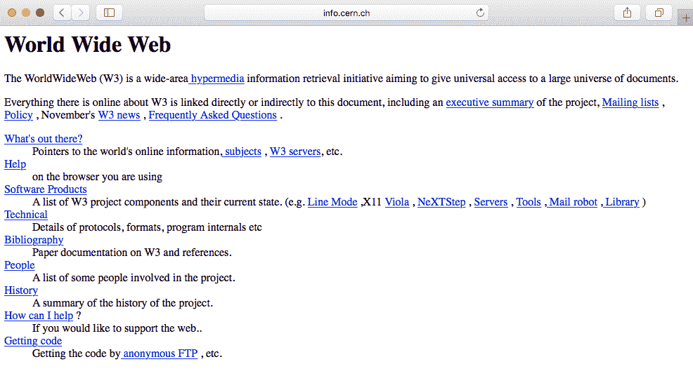
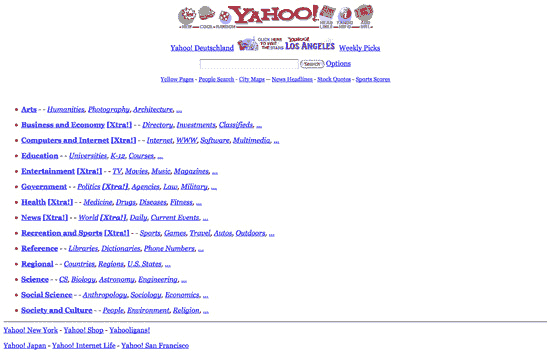
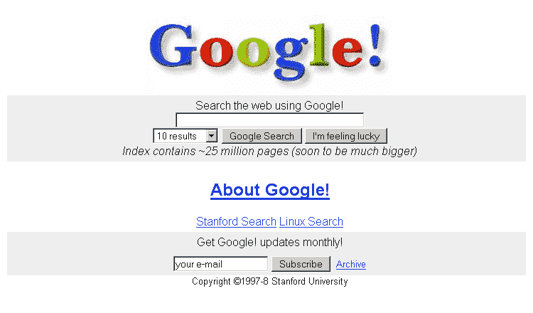
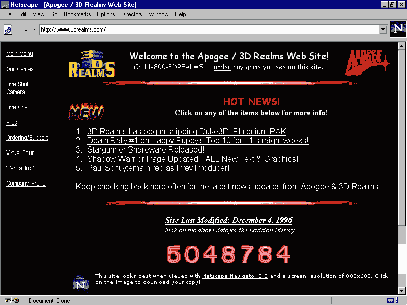
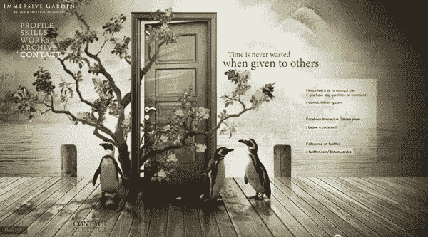
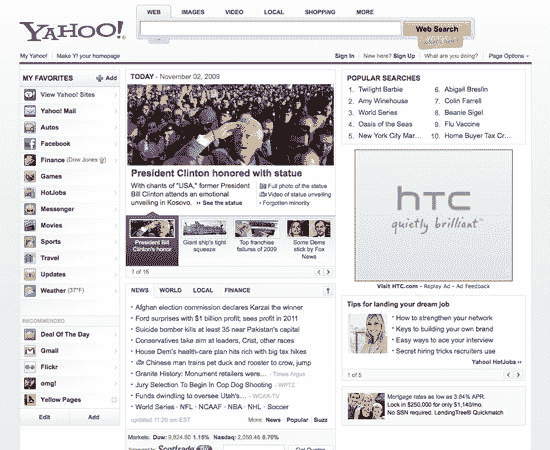
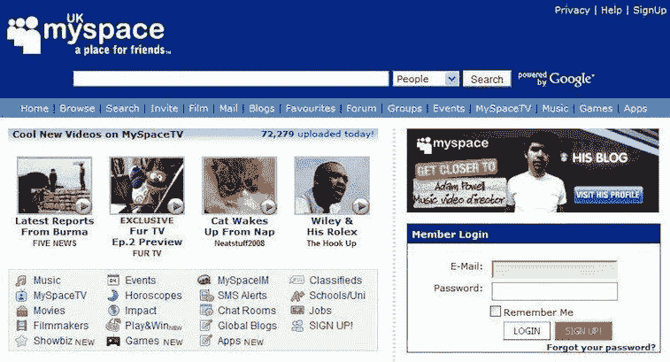

# 一、网页设计的演变

我还记得当我还是个孩子的时候，我曾经用我的 56k 调制解调器浏览互联网。 这在当时似乎很棒! 网站的加载速度非常慢，但它们的设计是为了最小化我们所使用的数据的消耗，因为每 kbit 都是按使用量计算的(没有无限的互联网，哈!) 为了理解网页设计是如何工作的，我强烈认为我们需要了解它背后的历史，当 1991 年蒂姆·伯纳斯-李创建第一个网站时，开发者和设计师是如何设计网站的。 基于表格的网站、动画文本和 GIF 图像、免费的页面生成器以及 1996 年 Macromedia 引入的 Flash 是网页设计领域的重大进步。 它将真正帮助你理解为什么和它的方向的网页设计原则。 让我们通过这些关键方面来准确地了解网页设计是如何演变的，并分析它在当代社会的日常生活中的重要性。

在本章中，我们将涵盖以下内容:

*   有史以来第一个网站:*万维网的起源*
*   基于表的布局:*在 HTML 中引入表标记*
*   Flash 简介:*网页设计的复兴*
*   css -救世主:*设计网站的新方法*
*   Web 2.0:*javascript -一种新的 Web 智能*
*   手机的兴起:*手机网页设计的繁荣*
*   响应式网页设计:*面向移动和桌面的设计*
*   *新设计趋势的兴起*

# 有史以来第一个网站

第一个网站是由一位名叫蒂姆·伯纳斯·李爵士的科学家在 1990 年创建的。 他是欧洲核子研究组织(CERN)的一名英国计算机科学家。 它基本上是一个基于文本的网站，只有一些链接。 1992 年的原始页面的副本仍然存在于网上。 它的存在只是为了服务和告诉人们**万维网**(**WWW**)是什么:

大多数要关注的网站都差不多。 有完全基于文本的简单 HTML 标记:

*   `<h1>`标题
*   `
`为段落
*   `<a>`用于链接(我们将在 HTML 课程中讨论所有这些标记)

下面的 HTML 版本进一步允许人们插入图像``和表`<table>`，从而创造更多的可能性。

1994 年，万维网联盟(W3C)成立，制定并建立了万维网的标准([https://www.w3.org/](https://www.w3.org/))。 这主要是为了阻止私有公司建立自己的网络语言，因为这会在网络上造成混乱。 时至今日，W3C 仍在继续为开放网络提供标准，如新的 HTML5 或 CSS3。

这里有一些 90 年代的网站。 下面的截图显示了雅虎网页在 1994 年是如何回顾的:

下面的截图显示了谷歌网页如何在 1996 年回顾:

# 表格布局

随着 HTML 中表格标记的引入，Web 设计变得更加有趣。 Web 设计人员看到了使用原始表标记构建设计的机会(他们总是很狡猾)。 网站仍然是大量的文本，但至少他们可以把内容分成不同的列、行和其他导航元素。 垫片的使用 gif,介绍了大卫的西格尔的书*创建杀手网站*1996 年,允许网页设计师玩空白(基本上,小透明 gif 被安置在之间的内容),将切片图像背景,用户会有错觉的结构简单, 而实际上在它后面有一个表格布局。 设计师最终可以尝试一些平面设计元素，因为它迅速流行起来，如访问计数器，动画 gif，等等。 文字和图片在网站上随处可见。

我们可以在 3dreams 1996 年的网站上看到这一点，它展示了设计师在他们的网站上添加的所有花哨元素:

我们还可以看到 2002 年雅虎网页的演变:

# 介绍闪

Flash，以前是 Macromedia Flash，现在是 Adobe Flash，创建于 1996 年。 这就像是网页设计的复兴。 如果你现在用 Flash 来创建网站，人们可能会取笑你，但在当时，它是创建交互式和图形网站的杀手级工具。 设计师能够添加动画，自定义字体和形状，3D 按钮，醒目页面，所有这些都在一个工具- flash 中。 整个程序被封装到一个文件中，然后读取到用户的浏览器中。 就像魔法一样。 不幸的是，这种魔法并不方便。 它不是**搜索引擎****优化**(**SEO**)友好的，而且对您的计算机来说资源非常重。

早在 2010 年，当苹果决定在其 iOS 软件中停止支持 Flash 时，Flash 就开始走下坡路了([https://www.apple.com/hotnews/thoughts-on-flash/](https://www.apple.com/hotnews/thoughts-on-flash/))。 随着 HTML5/CSS3 的新特性，你可以在其中创建动画和添加多媒体内容，设计师和开发人员很快就从 Flash 转向了，至少在网页设计方面是这样。

下面是一些 Flash 网站的例子。 这张截图显示了一个非常基本的 flash 网站，使用滑块，动画，和互动。 您可以在[http://www.richard-goodwin.com/flash/indexn.html](http://www.richard-goodwin.com/flash/indexn.html)查看本网站。

当我开始网页设计时，有一个令人印象深刻的 Flash 网站*沉浸式花园*:

# CSS -救世主

**级联样式表**(**CSS**)在 2000 年代变得越来越流行，在 web 浏览器中支持的越来越多。 CSS 定义了 HTML 的显示方式，这允许设计师将内容和设计分开，使网站更容易维护和更快地加载。 您可以在不修改内容的情况下改变基于 css 的网站的整个外观。

作为 Flash 的替代品，CSS 确实有所不同。 W3C 推荐它作为最佳实践，它提供了更清晰的语义，从而产生了更好的 SEO。

然而，CSS 的一个缺点是缺乏各种浏览器的支持:一种浏览器支持最新的特性，而另一种不支持。 这对开发者来说是一场噩梦。

我们将在本书第六章*构建自己的网站*中进一步探讨这个问题。 以下是雅虎网站(2009 年)的一些设计变化:

# Web 2.0

21 世纪初，JavaScript 开始兴起。 这是事情真正开始向我们今天所知道的网络发展的时候。 JavaScript 是第一个为 web 添加智能的方法。 设计师能够在他们的设计中添加交互、复杂导航和多媒体应用程序。

虽然最初的网站似乎主要关注设计和美学，但很快，它就以用户为中心，可用性为主要焦点。 设计师们也更加注意颜色分布、位置、排版注意以及图标而非文本链接的使用。 最后，Web 2.0 的发展也见证了 SEO 作为内容驱动的增长。 这些技术，如关键字优化、标记以及入站和出站链接，现在仍在使用。 网页行业真的看到了 SEO 的重要性，这也成为了网页设计的主要焦点。

以下是一些网站的例子:

我们可以从设计上看出差异。 布局和内容更加结构化。 随着*MySpace*网站的出现，开发人员开始创建应用程序供人们进行互动:

# 手机的崛起

我还记得第一部 iPhone 问世的时候。 我很清楚我不会买。 我当时显然不了解自己。 iPhone 最终开启了手机浏览的热潮。 在网络行业没有人预见到这一趋势; 用户怎么能在这么小的屏幕上浏览网站呢? 它显然一点都不友好。 网页设计师开始设计第二个只在手机上显示的网站。 我仍然记得那些以[m.domainname.com](http://m.domainname.com)开头的链接。 维护两个网站绝对是件麻烦事。 人们开始越来越多地用手机访问网站。

2016 年，移动和平板电脑的互联网使用量在全球首次超过了桌面:

StatCounter Stats http://gs.statcounter.com/press/mobile-and-tablet-internet-usage-exceeds-desktop-for-first-time-worldwide

# 响应网页设计

我们第一次听到这个术语*响应式网页设计*是在 2011 年 Ethan Marcotte 提出的。 在他关于响应式设计的书中，他描述了一种新的设计方式，不仅适用于桌面，也适用于移动界面，基本上建议使用相同的内容，但在每个屏幕上的设计有不同的布局。 960 网格系统的引入也帮助解决了这个问题([https://960.gs](https://960.gs))。 最流行的版本是 12 栏或 16 栏。 对于设计师来说，在设计网站时使用 12 栏作为桌面，然后为了手机浏览而逐步降级，这已经成为了一种标准。 随着**媒体查询**与 CSS3 的引入，对于设计师来说，为手机屏幕设计网站变得更加容易。

我们将在下一章进一步详细探讨这个问题。

媒体查询是一个 CSS3 模块，允许内容渲染适应屏幕分辨率等条件(例如，与计算机屏幕相比，智能手机屏幕)。 从左到右，我们有 iPhone、iPad 和台式机版本。 这是一个网格系统和媒体查询([https://www.wired.com/2011/09/the-boston-globe-embraces-responsive-design/](https://www.wired.com/2011/09/the-boston-globe-embraces-responsive-design/))的完美示例:

# 平面设计

你可能听说过这个术语。 如果没有，平面设计是指设计中没有风格的形状和特征的元素，比如渐变、阴影、纹理和任何让它看起来真实和三维的设计类型。 它通常被描述为*丰富设计*的对立面，而丰富设计的目的是让元素在用户导航时感觉更有触感、真实感和可用性。

人们常说扁平化设计起源于瑞士风格。 如果你没有听说过这个，瑞士风格(也被称为国际排版风格)是主导设计风格早在 1940-50 年代，并开始在瑞士:

作为现代主义运动的一部分，它在许多设计相关领域仍然对平面设计产生着深远的影响。 在 20 世纪中期，它成为全世界平面设计的坚实基础。 这种设计风格的主要特点是使用不对称的布局、网格、无衬线字体(如 Akzidenz 怪异)和清晰的内容层次结构。 著名的 Helvetica 字体就是在这一时期创造出来的，并被用于各种类型的设计中。

我们可以毫无疑问地说，瑞士风格对我们今天所知道的平面设计风格有很强的影响。 然而，这一趋势的主要原因是在这一时期响应式设计的发展，开发人员和设计师努力实现一个严重依赖于纹理、落阴影和背景图像的设计。 根据不同的屏幕尺寸和浏览器兼容性的限制来缩小这些模式对设计师来说实在是太难了。 他们必须回归基础，简化设计，减少纹理。 这将导致更快的加载网站，将更有效，更容易设计。

作为一名设计师，我看到了这种趋势的兴起。 我还记得设计人员在测试 CSS3 的最新特性时，尝试使用尽可能少的设计资产，同时尝试通过代码创建所有内容。 此时，开发人员和设计人员的主要关注点是效率和更快的加载速度。

但有一件事我们可以达成一致，那就是微软和苹果都对这一趋势产生了重大影响，并使其进一步普及。 随着微软 Metro 和苹果 iOS 7 的发布，人们立刻觉得所谓的丰富设计已经完全过时了，并很快发现有必要重新设计他们的网站或应用程序。

Comparison between iOS 6 and iOS 7

# 接下来是什么?

在回顾了所有这些重要的网页设计特征之后，有一件重要的事情需要记住，那就是网页设计的趋势并不是源于任何特定的个人或公司。 网页设计是视觉设计(受印刷设计的影响)和在网页上使用的技术的混合。 随着 HTML5 和 CSS3 的进步，我们可以开始看到，与最初的平面设计相比，设计变得越来越复杂。 现在的技术允许人们在设计和形式上有更多的灵活性。 让我们看看网页设计的趋势将如何发展，但请记住，它发展得很快，非常快。

# 总结

作为本章的总结，我们看到了蒂姆·伯纳斯·李爵士创建的第一个网站是如何开始的，以及随着基于表格的布局、Flash、CSS，特别是智能手机的兴起，网络在这些年来是如何发展的，智能手机改变了全球用户浏览网页的方式。 记住这段历史，我们现在可以跳到第二章，这一章将讨论 web 组件并解释它们的用法。 那么，让我们开始吧!