# 二、网页设计及其组件

在[第一章](01.html)、*网页设计的演变*中，我们回顾了自 1990 年蒂姆·伯纳斯·李爵士创建第一个网页以来，网页设计是如何演变的。 在这些年里，我们看到网站设计中出现了新的元素和风格。 有些元素会帮助用户浏览网站，有些元素会帮助讲述一个故事，但最重要的是，所有这些元素都有潜力改善访问者的体验。 在本章中，我将帮助您了解每个组件，它的用法，以及为什么它是有用的。 让我们开始吧!

下面是我们将要介绍的组件列表:

*   网格
*   行动呼吁
*   面包屑
*   搜索栏
*   图标
*   资本
*   排版
*   颜色
*   可用性
*   一致性

# 网格

如果你还记得，我们在第一章讲过网格。 网格对响应式设计有很大帮助，但它们的使用还不止于此。 自从印刷设计以来，设计师们就开始使用网格，用于书籍、出版物，尤其是杂志。 简单地说，网格系统是一种帮助设计师构建设计、内容和图像，并使其更具可读性和可管理性的系统。

理解网格非常重要，因为它们将帮助您按比例设计、平衡设计中的元素、组织模块和部分。 更重要的是，它将帮助用户导航与一致性和熟悉你的设计网格:

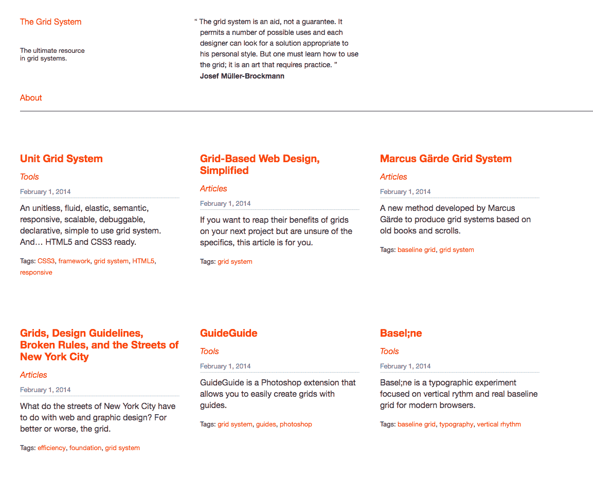

网格系统网站([http://thegridsystem.net/](http://thegridsystem.net/))是每个网格系统的一个非常有用的工具，是一个必须知道的。

# 缺点

每样东西都有优点和缺点，网格也不例外。 网格的第一个缺点是，对于大多数人，尤其是那些刚开始设计的人来说，他们可能会觉得网格系统具有一些限制性和创造性的重复性。 完全可以理解，但不幸的是，它时常发生，你觉得很难跳出框框去思考，它可以感觉你在一次又一次地创造相同的事情。 但请记住，网格并不容易接管，需要实践和经验来充分利用它的优势。

网格在这里是有帮助的，但就像所有设计规则一样，规则是用来打破的。 您不必坚持网格，但在打破规则之前，您确实需要了解它是如何工作的。 让我们来看一些使用网格布局的好例子:

[http://kinfold.com](http://kinfold.com)

网格的出色使用，优雅，简单。 你可以清楚地看到构图和布局。 你可以查看网站([http://kinfold.com](http://kinfold.com))，你可以看到，顶部部分不是网格的一部分，但它仍然完美地流动与设计:

The well-known Bootstrap, a CSS framework based on Grid

一个很好的练习是尝试在网站上找到网格。 看看它是如何设计的。

# 行动呼吁

**Call to Action**(**CTA**)是一个营销术语，它定义了一个设计好的元素，该元素号召并鼓励用户采取行动，其最终目标是尝试销售。 当你开始设计网站时，你会听到很多这个术语，尤其是为了营销目的。 每个设计师的目标都是最大化这个按钮的点击转化率，这最终会带来销售。 下面是设计您的 CTA 时的一些良好实践。

# 使它明显

我的一个建议是，在设计 CTA 时不要太有创意，因为它仍然是一个按钮，人们已经习惯了它。 由于用户已经习惯了在线体验，他们知道 cta 是以按钮的形式出现的。 他们看到一个按钮; 他们知道该怎么做。 简单。 让它大一点，明显一点，从周围的一切中脱颖而出，它就在袋子里。

以下是一个糟糕的 CTA 的例子:

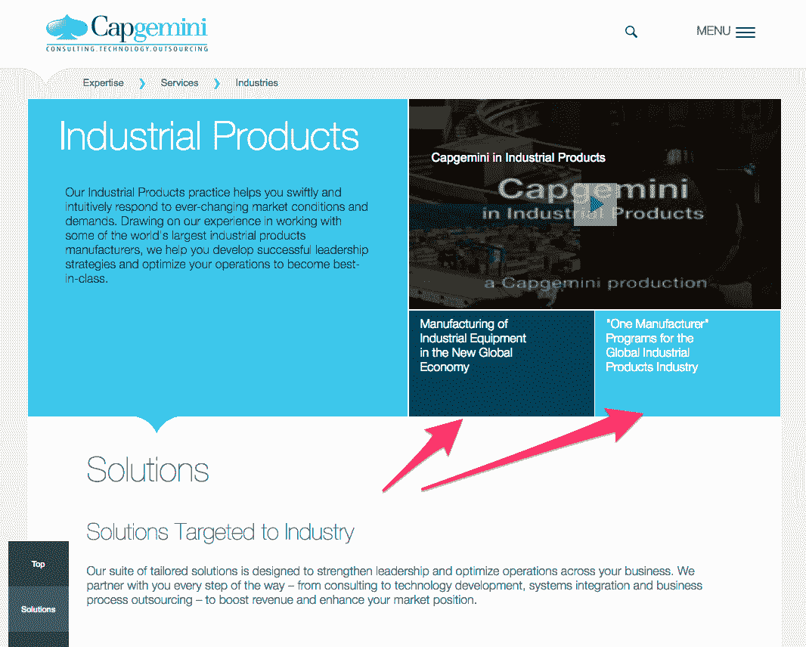

Image from Capgemini.com website 2017\. All rights reserved to Capgemini

箭头所指的区域是按钮，是的，我是认真的，你可以点击它。 这就是为什么你应该保持 CTA 作为按钮，而不是作为其他形式，特别是不类似的内容或标题。

# 使用对比色

使用对比色可以让按钮脱颖而出，吸引用户的眼球。 颜色的选择也很重要，所以要注意你使用的颜色。 我们将在本章后面讨论颜色的心理学。

这里有一个很好的例子:

Image from [Freelancer.com](http://Freelancer.com), all rights reserved to Freelancer International Limited

这个例子很有趣，因为这里的意图很明显是让用户将注意力集中在橙色按钮上，眼睛会自然地看到这个按钮。 你可以通过使用对比色来吸引用户的注意。

# 引人注目的副本

你在 CTA 里面写的东西也很重要。 措辞应该简短。 任何超过 10 或 15 个单词的内容可能都太长了。 简单的陈述是最好的。

下面是一个很好的例子，好的，简短的，有效的措辞:

Image from [Invision.com](http://Invision.com)

# 放置

位置也很重要，CTA 按钮需要放在用户下一步想看的地方。 作为设计师，您可以预测和预测这种行为。 你不需要很花哨，只需要逻辑:

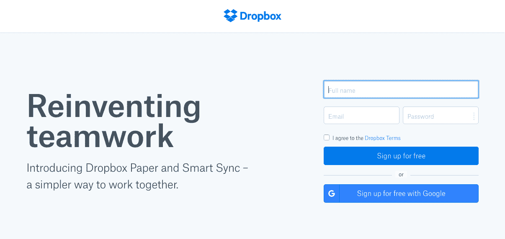

Image from [Dropbox.com](http://Dropbox.com)

这里很简单，你需要点击。 CTA 被逻辑地放在表单之后。

另一方面，这里有一个不太直接的例子:

Image from [Apple.com](http://Apple.com)

在本例中，按钮的放置不是直观的，用户必须返回到 CTA 上点击，而不是在内容之后。

# 面包屑

**面包屑(或 Breadcrumb trail)是一个二级导航系统,表明用户在网站或 web 应用程序。这个术语来自*,童话故事的主要角色创建一个的面包屑以跟踪回到他们的房子。 就像故事一样，网页上的 breadcrumb 允许用户从他们开始的地方找到他们的路。 它对于复杂的网站或应用程序非常有用，但对于没有逻辑层次或分组的单页面网站就不太有用了。***

 *下面是一些面包屑的例子。

谷歌 Drive 的示例如下:

这是一个电子商务网站的例子。 [mac-addict.com.au](http://mac-addict.com.au)):

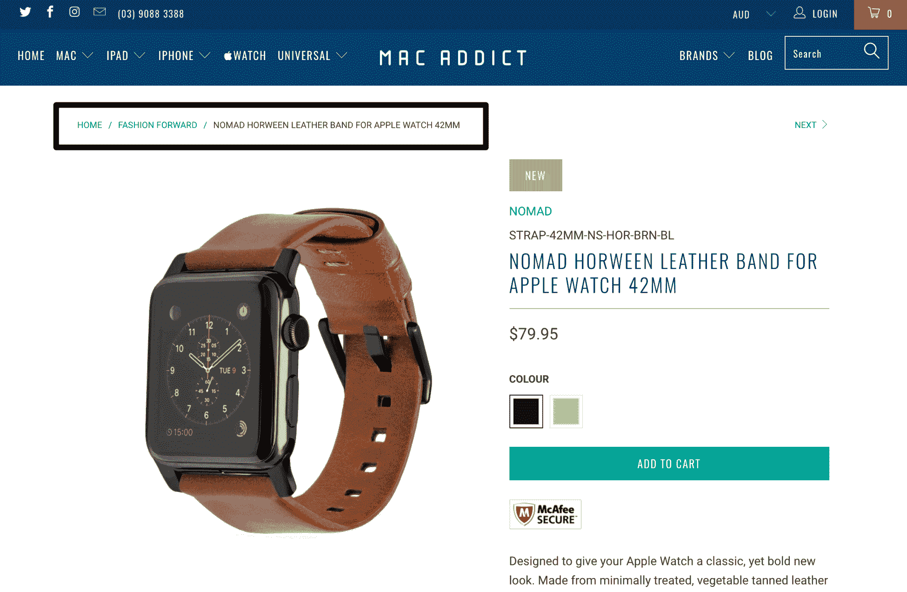

# 搜索栏

搜索栏对 YouTube、Facebook 和 eBay 等内容丰富的网站来说越来越重要。 用户现在已经熟悉了使用搜索栏，他们在搜索的时候总是在寻找它。 然而，并不是每个网站都需要搜索栏。 如果你有一个简单直观的网站，简单的内容，一个搜索栏可能是多余的。

下面是一些设计搜索栏的快速技巧。

# submit 按钮

设计师在设计提交按钮时经常贬低它，但它背后总是有原因的。 尽管用户可以按下*回车*按钮，但它的价值不足以不显示它。 用户需要看到还有另一个动作需要触发。 为你的用户提供不同的可能性来实现他们的最终目标总是更好的:

前面是一个坏的搜索栏和一个好的搜索栏的例子。

# 使它明显

让用户寻找搜索框是一种糟糕的方法。 搜索框应该总是容易找到的，尤其是当你的网站上有很多内容的时候。 让你的搜索栏脱颖而出，使用对比或颜色。 显示一个完全开放的文本框也很重要，因为隐藏在图标后面的搜索栏会使搜索功能不那么明显，并增加访问它的点击次数:

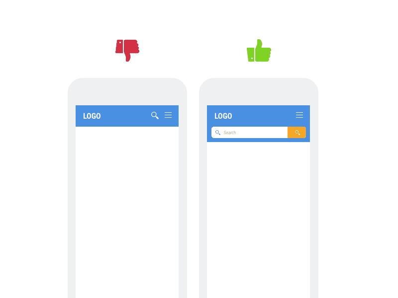

以下是亚马逊手机网站的样子:

Image from [Amazon.com](http://Amazon.com)

你可以看到亚马逊专注于手机搜索栏，并没有隐藏它。

# 正确放置搜索栏

一个搜索栏需要突出，但也需要放置良好。 *A. Dawn Shaikh*和*Keisi Lenz*(*Where’s the Search? 重新检查用户对 Web 对象的期望*，142 名参与者表明，最方便用户的位置将位于您站点的每个页面的顶部中心或右上角。

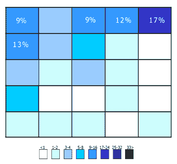

Image from ([https://blog.wikimedia.org/2010/06/15/usability-why-did-we-move-the-search-box/](https://blog.wikimedia.org/2010/06/15/usability-why-did-we-move-the-search-box/))

# 图标

图标现在到处都是，你可以在路标、键盘、界面等上找到它们。 图标帮助我们更好地理解和解释信息。 在任何图形通信中，它都是一个重要的视觉辅助工具。 作为一个设计师，知道何时何地使用图标来为你的设计服务是非常重要的。 下面是一些快速入门的技巧。

# 简而言之

有趣的是图标可以快速概括你的文本内容。 网络用户在浏览网页寻找与他们相关和感兴趣的内容方面变得更加熟练。 因此，只要看图标，他们就会迅速进入他们想要的信息。 例如，在本例中:

([uber.com](http://uber.com))

图标快速描述了内容是什么，一个美丽的效果。

# 引起用户的注意

一个没有图标的网站会很无聊。 想象一份没有图片的杂志，会有多无聊? 同样的逻辑也适用于网站中的图标。 此外，漂亮的图标，你为你的网站增添了更多的美学，而你的用户将欣赏你的方便:

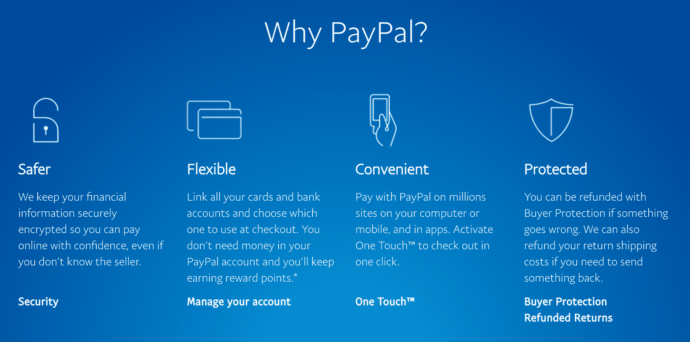

Image from [Paypal.com](http://Paypal.com)

请看这张截图，从 PayPal 网站的图标与下面的一个，我们删除了图标:

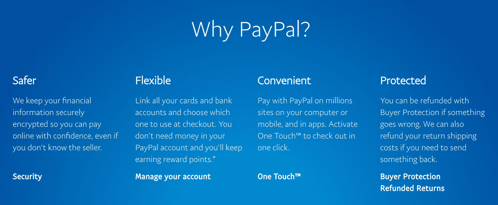

Image from [Paypal.com](http://Paypal.com)

第一个肯定比第二个更有趣，更吸引人。

# 定向

我建议使用图标的最后一个原因是向用户显示方向。 比起显示前*或下*，显示箭头更有效率，因为用户现在已经习惯了:**

 **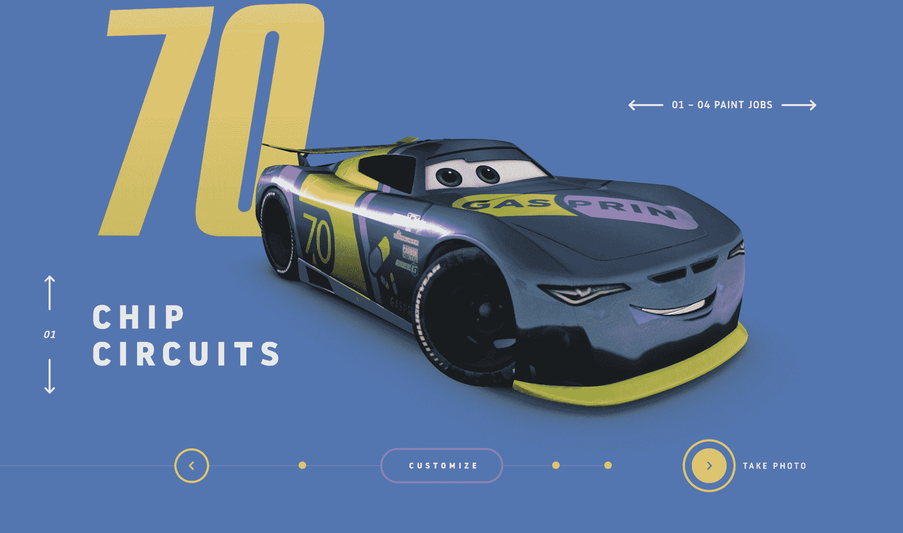

箭头也可以设计得很好([http://cars3generations.com/](http://cars3generations.com/))。

# 资本

模态框通常是出现在屏幕上的弹出窗口，而不是打开一个新标签/窗口。 他们通常使背景变暗，以引起注意弹出。 简而言之，模态框用于在同一页面上向用户显示信息，而无需重新加载页面，从而提高了可用性。

模态框起源于 Windows、Mac OSX 和 Linux，但它们很快扩展到 web 应用程序和其他应用。

使用情态框有五种常用用法:

*   **Error**:提示用户有错误
*   **警告:**警告用户潜在的有害情况
*   **收集信息:**收集用户信息
*   **Confirm or Prompt:**要求用户确认操作
*   **Helper:**帮助用户使用界面

模态框不应与侧边栏、手风琴菜单、工具栏等非模态组件混淆，因为它们允许用户与父窗口交互。

下面是一些模态框的例子:

在[Twitter.com](http://Twitter.com)上撰写 tweet 时使用的模态框:

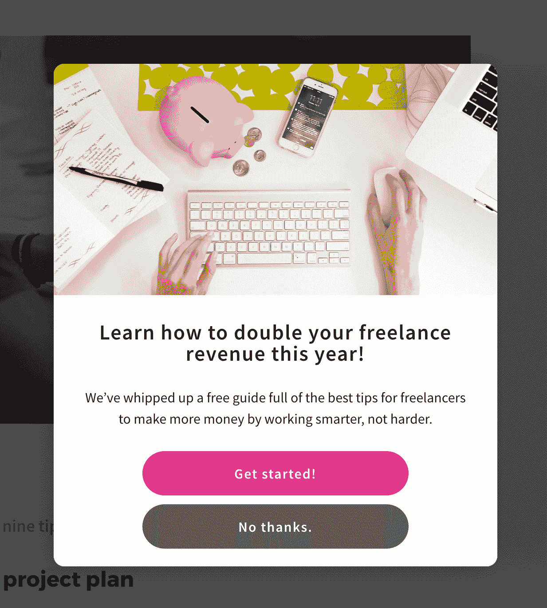

模态框也用于获取人们的电子邮件或关注时登陆他们的网站，如前面的[Getflywheel.com](http://getflywheel.com)。

# 排版

我还记得当我设计我的第一个网站时，在网页设计中字体是非常有限的。 有一些默认字体可用，我们不得不在大多数情况下坚持使用超级中性的 Arial 字体。 有了 CSS3 的字体面推出，现在可以添加自定义字体，这对设计师来说是一种解脱! 排版在设计中是非常重要的，它可以改变访问者的看法。 使用衬线字体和无衬线字体可以改变网站的感觉。 《纽约时报》*([https://opinionator.blogs.nytimes.com/2012/08/08/hear-all-ye-people-hearken-o-earth/](https://opinionator.blogs.nytimes.com/2012/08/08/hear-all-ye-people-hearken-o-earth/))对字体的真实性进行了比较。 看看第一张图:*

 *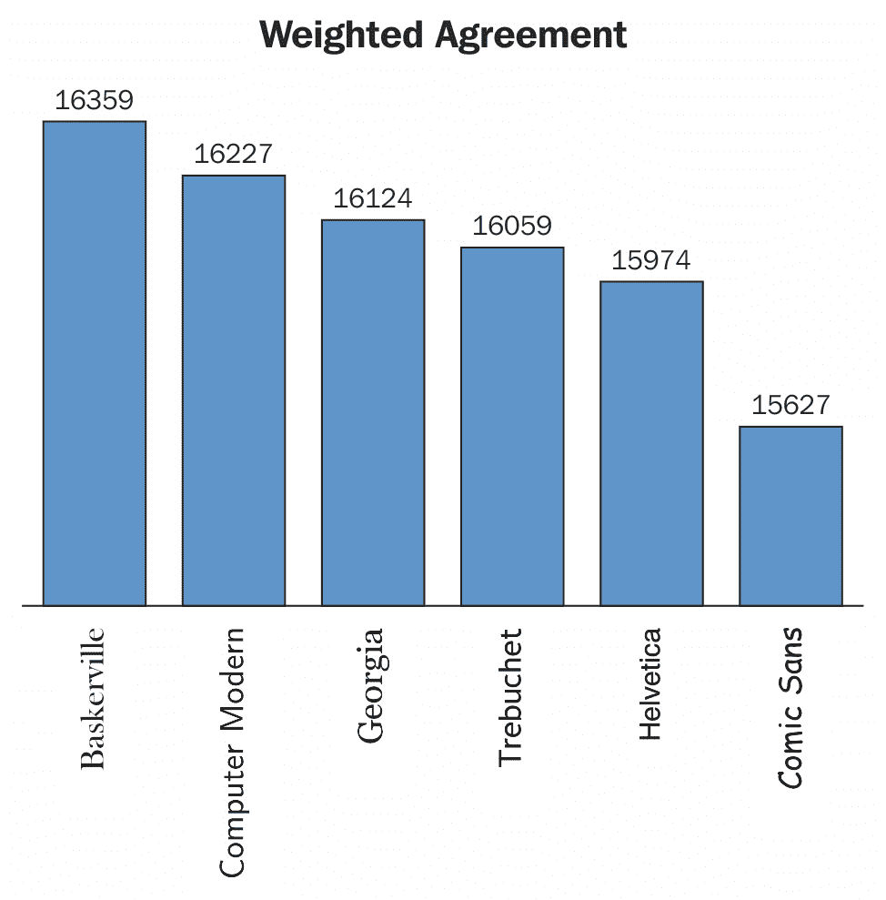

Weighted Agreement

你可以看到人们更倾向于相信 Baskerville 字体所写的信息:

Weighted Disagreement

字体在你的设计中真的扮演着重要的角色。 不幸的是，我不是来这里学习整个字体设计课程的，但这里有一些快速选择最佳字体的技巧。

# 选择一种能连接你的品牌的字体

你做的每件事都应该与你的品牌联系起来，还有你的排版。 你选择的字体会让用户知道你的品牌是关于谁和什么。 基本上有三种不同类型的字体:衬线字体、无衬线字体和脚本字体。

# 衬线字体

衬线字体很容易通过从字母延伸出来的小线条或笔画辨认出来。 这里有一个数据解释了这种差异:

Figure from [https://visualhierarchy.co/blog/serif-vs-sans-serif/](https://visualhierarchy.co/blog/serif-vs-sans-serif/)

与衬线字体相关的情绪通常是经典、浪漫、优雅、正式和确立的。 一些著名的衬线字体包括 Times New Roman, Baskerville, Georgia 和 Garamond。

# 决定

无衬线字体通常被认为比衬线字体更现代。 与无衬线字体相关的情绪更干净、友好、简约或现代。 一些最著名的无衬线字体是 Arial, Helvetica, Futura 或 Gotham。

Gotham Typeface from [https://www.typography.com/fonts/gotham/overview/](https://www.typography.com/fonts/gotham/overview/)

哥谭字体在 21 世纪晚期非常流行。

# 随意的脚本

这些字体的设计是为了暗示非正式，就好像它们写得很快一样。 很多时候，它们似乎是用刷子画的。 它们可以代表情感、速度和熟悉程度。 它们不是很适合正文内容，但可以作为一个很好的标题来推销一种情绪:

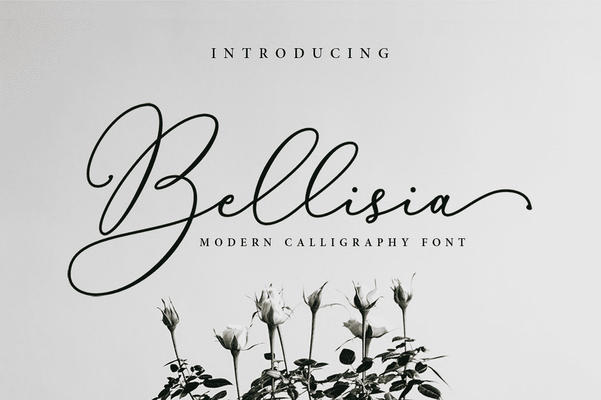

Bellisia font from Creative Market ([https://creativemarket.com/sizimon/1719182-Bellisia-Script](https://creativemarket.com/sizimon/1719182-Bellisia-Script))

# 不要使用太多的字体

这是我经常给年轻设计师的建议，因为他们在设计中倾向于使用太多的字体，我想这太令人兴奋了。 尽量与你的设计保持一致，我建议使用一到三种不同的字体，但不要更多。 用衬线字体作为标题，用无衬线字体作为正文是很好的搭配。

下面是一些好的组合的例子:

A combination of Playfair and Futura ([https://www.dogstudio.co/](https://www.dogstudio.co/))

另一个很好的组合:

Combination of GTWalsheim and Adobe Garamond ([http://www.christianaslund.com/the-new-oil-frontier](http://www.christianaslund.com/the-new-oil-frontier))

最后，GT-Sectra 和 Futura 的结合:

Combination of GT-Sectra and Futura ([http://changegout.com/](http://changegout.com/))

如果你想要一个网站找到伟大的排版组合，我推荐[https://fontpair.co/](https://fontpair.co/)。

有不同的方式添加字体到您的网站:

*   您可以使用自己的字体，也可以使用字体生成器来生成与浏览器兼容的字体。 我推荐[https://www.fontsquirrel.com/。](https://www.fontsquirrel.com/)
*   您也可以使用谷歌字体，它可以自由使用:[https://fonts.google.com/](https://fonts.google.com/)。

# 颜色

颜色在网页设计中有着非常重要的作用。 根据 Kissmetrics 的说法，当你看到一种颜色时，你的眼睛会与大脑中被称为下丘脑的区域进行交流，然后，下丘脑会向脑下垂体发送信号，最后传递给甲状腺。 这是荷尔蒙释放的信号，荷尔蒙会引起情绪、情绪的波动，并导致行为的发生。 很有趣,不是吗?

同样来自 Kissmetrics 的研究表明，网站访问者只需 90 秒就能形成一个判断或观点。 此外，62-90%的交互作用是由产品本身的颜色决定的。

你现在应该明白为什么颜色是非常重要的，为什么以正确的方式，在正确的时间，针对正确的受众，带着正确的目的来选择它们是至关重要的。

# 颜色是什么意思

每种颜色都能在每个人身上描绘出一种特定的情感。 尽管，这可能会因文化、背景或偏好而有所不同。 以下是颜色含义的快速参考:

*   黄色:
    *   在你的脸上使用黄色要小心
    *   男人觉得这很讨厌
    *   孩子们喜欢它
*   橙色:
    *   新红，温暖无危险
    *   与能量相关(饮料、运动、健身)
    *   孩子们也很喜欢
*   红色:
    *   刺激行动，增加呼吸和脉搏
    *   象征热情，是时尚/化妆品品牌，约会和食物的理想选择

*   紫色:
    *   奢华，优雅，女性化
    *   跨越了大量的女性人口，没有负面的联系
*   黑色:
    *   优雅、传统、企业
    *   卓越和形式
*   格林:
    *   成熟，绿色促进幸福
    *   理想的健康产品，道德运动
    *   较浅的绿色代表创新和新鲜的想法
*   蓝色:
    *   流行的蓝色象征着智慧和宁静
    *   深蓝与奢侈品联系在一起
    *   浅蓝色是让人耳目一新的产品和想法
    *   抑制食欲，所以对食物不好
*   粉色:
    *   很老套的粉色
    *   经常被过度使用来吸引女性用户的注意
    *   任何与女孩和婴儿有关的东西
    *   众所周知，它还能刺激人们对甜食的喜爱
*   怀特:
    *   纯粹、冷静、冷静、现代
*   布朗:
    *   大多数人都避免这种颜色
    *   不喜欢男人
    *   唤起自然
    *   表示可靠性

例如，如果你想创建一个销售玩具的电子商务网站，你不会使用黑色，因为黑色意味着更有格调和优雅。 你将更多地使用它在奢侈品牌，如欧莱雅或 MAC 化妆品:

Image from [Loreal.com](http://Loreal.com).

看看欧莱雅是如何使用黑色看起来更豪华的，即使他们不在奢侈品市场。

当然，请记住这些只是指导方针(它们总是取决于上下文)。 看看不同的网站，看看他们是如何使用颜色的，这总是最好的学习方法。

# 可用性

我们之前讨论过设计如何演变为以用户为中心的设计。 这正是我们现在要研究的，所以你问什么是可用性? 可用性只是定义用户界面的易用性的属性。 它通常由五个部分来衡量:

*   **易学性**:用户登陆网站时完成基本任务的容易程度如何?

*   **效率**:在学习后，用户重做任务或完成其他任务的效率如何?
*   **可记忆性**:对于用户来说，在一段时间不使用网站后，返回，并熟练地再次使用网站有多容易?
*   **容错**:用户从错误中恢复有多容易?
*   **满意度**:使用这个设计有多愉快和令人满意?

在过去的几年里，用户已经习惯了网页设计中的某些标准，并且不再容忍那些加载缓慢、外观丑陋或难以浏览的网站。 如果你的网站无法使用，还有很多网站可以使用。 缓慢的加载速度和糟糕的用户体验是增加网站跳出率的一些因素。 但如果你研究了用户的需求和行为，你就能据此定制你的内容和设计。 以下是一些快速指南，让你提前了解你应该注意的事情:

# 简单

简单绝对是我在设计中始终追求的目标之一。 有时候，页面中间的一个简单的 CTA 就是你所需要的，不是开玩笑! 首先尝试定义你的用户需要什么，并让用户体验尽可能简单。 添加没有任何功能性目的的不必要元素将不可避免地影响访问者。 建筑师的名言:

"Less is more" -Ludwig Mies van der Rohe

在某种程度上是相当准确的。

# 适航性

在简单性的连续性上，拥有一个直观的导航对于良好的用户体验至关重要。 不要让用户思考。 试着把你自己当成终端用户，让导航尽可能的轻松。 和你的朋友或家人一起做一些测试总是一个好主意。

这里有一些快速的导航技巧:

*   让主导航保持简单，最好是在顶部。
*   不要忘记大型网站的页脚导航(人们经常使用页脚导航)。
*   包含一个搜索框(我们之前讨论过为什么)。
*   不要让你的导航太复杂。 对物品进行分类，但不要太深。
*   链接应该是明显的，下划线，粗体，或用不同的颜色，但它们应该总是从内容中脱颖而出。

# 可访问性

如果你的网站加载时间超过三秒钟，你就需要考虑优化你的网站了。 现在的用户又懒又不耐烦。 在互联网的世界里，一切都是快速和容易访问的，你需要让你的网站尽可能容易访问。

以下是一些可用性和可访问性的基本要素:

*   **正常运行时间**:确保您的网站在加载时没有宕机或有任何错误。 投资一个好的主机。
*   **断开的链接**:确保没有死链接。 用户不应该登陆到 404 页面。 一个好的做法是，如果链接不可访问，将用户重定向到一个新页面。
*   **网站响应**:让你的网站在每个屏幕上都可用，并根据分辨率支持不同的布局。

好的可访问性的一个很好的例子是 Amazon。 他们的网站可以从任何地方访问，他们没有任何停机时间，主要是因为他们也是一个托管公司。 但如果你更仔细地观察，你会发现他们的网站在台式机和平板电脑上都是响应式的，调整大小时也能适应。 对于移动设备，他们有一个适应性的网站，有一个不同的和干净的布局，更适合小分辨率。 我们将在接下来的章节中看到反应能力和适应能力之间的区别。

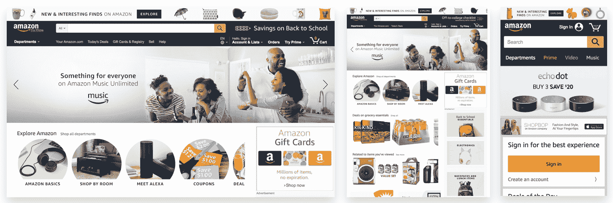

[Amazon.com](http://Amazon.com) on Desktop, iPad, and iPhone

# 一致性

在回顾了所有这些网页设计组件之后，我将以一致性和它的重要性来结束本文。 到目前为止，一致性是一个好的网站的关键组成部分之一。 它将为一个伟大的网站或应用程序带来最后一块拼图。 举个例子，当你想找到你的钥匙，但你知道它们总是在同一个地方，你不需要思考。 但如果你找不到它，你会开始为寻找它而感到压力。 网站对用户来说是一样的。 你不希望他们每次来你的网站都学习。

# 那么，我们怎样才能保持一致呢?

以下是你应该保持一致的几个方面:

*   设计
*   内容
*   交互

# 设计

你的设计应该是一致的，这意味着你创建的每个元素，如链接、按钮、输入或标题都应该遵循你自己的设计标识。 用户会有意识地记住细节，因此他们会根据特定的颜色或形状来识别链接。

一个**用户界面**(**UI**)风格的指南示例。 这有助于与你的 UI 保持一致:

# 内容

不仅视觉方面必须遵循一致性，内容也是如此。 网站上使用的情绪和语气必须反映品牌。 如果你是一个面向企业销售的公司网站，你的网站内容应该看起来和感觉都非常专业。

# 的相互作用

最后但并非最不重要的是，整个网站的互动必须保持一致。 网站对用户互动的反应应该始终保持一致。 例如，当在 Dropbox 上打开一个文件时，后退按钮总是位于左上角的位置，这样用户就不必再次寻找它并重新学习你的界面。

# 总结

在本章中，我们已经涵盖了相当多的主题，但总的来说，网页设计中的每个组件都是重要的，对你的设计，但最重要的是对最终用户。 有了所有的提示，你现在可以创建和使一个网站看起来很棒和用户友好。

在您开始深入研究创建自己的设计之前，我想向您介绍下一章，它将讨论响应式设计和适应性设计，这是作为设计师或开发人员需要知道的东西。 让我们开始吧!****