# 建立自己的网站

有趣的部分终于来了。 我们将从 A 到 z 开始实施我们的网站，我会详细解释每一步。 以下是本章内容的列表:

*   安装 HTML 样板
*   设置我们的项目与图像，字体，和 normalize.css
*   创建我们的标题和样式
*   创建我们的英雄部分，学习 CSS 中的位置
*   创建我们的 Blog 部分
*   添加 about 部分
*   创建伙伴部分
*   创建页脚部分

首先，让我们看看将要实现的设计。 如果你还记得，我们在[第 4 章](04.html)，*响应式设计与适应性设计*中看到了一点预览。

# 我们的设计

我们的主页将包括以下内容:

1.  标题:我们将学习如何创建和风俗化导航部分，在右边有一个标志和一个菜单。
2.  英雄形象:在网页设计中，它描述了一个前横幅图像，通常是一个大图像。 我们将学习如何创建一个大标题的全宽背景图像。
3.  带有 6 篇`blog`文章的`Blog`预览:我们将学习如何显示带有图像和内容的 3 个响应栏。
4.  一个关于我们的部分:我们将学习如何添加一个梯度到图像。

5.  合作伙伴部分:我们将学习如何将内容放在页面的中心。
6.  页脚:基本上和页眉是一样的东西，但是在底部。

您可以在我提供的资源文件`Resources`|`Screens`中查看主页的完整尺寸图像。 还有项目的`Sketch`源文件。

我强烈建议你安装 Sketch 或 Figma，如果你还没有使用这些设计工具之一。 Sketch 应用程序通常用于网页设计项目，可以在[http://sketchapp.com](http://sketchapp.com)下载。 它有 14 天的免费试用期。 Figma 与 Sketch 类似，无需试用即可使用。

这是我们的设计:

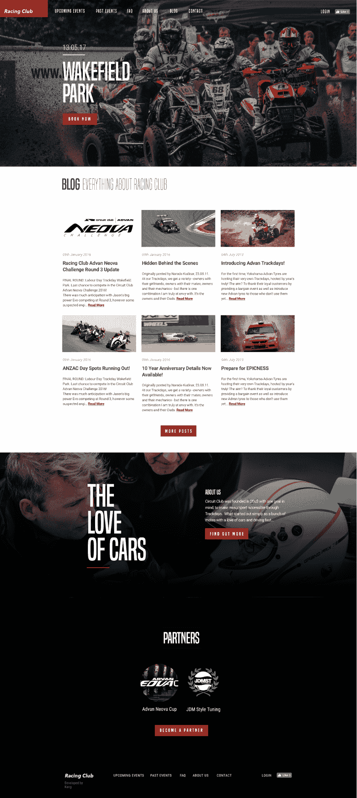

Our home page design

废话不多说，让我们开始吧!

# 安装 HTML 样板

我们将开始一个新的，让我们为这个项目创建一个新文件。 当我开始一个项目时，我喜欢做的是下载一个 HTML 样板。 HTML5 Boilerplate 是一个前端模板，用来帮助你构建快速、健壮和适应性强的 web 应用或网站。 您基本上下载一个包，它包含启动一个项目所需的所有文件。

让我们到[https://html5boilerplate.com/](https://html5boilerplate.com/)下载最新版本的模板:

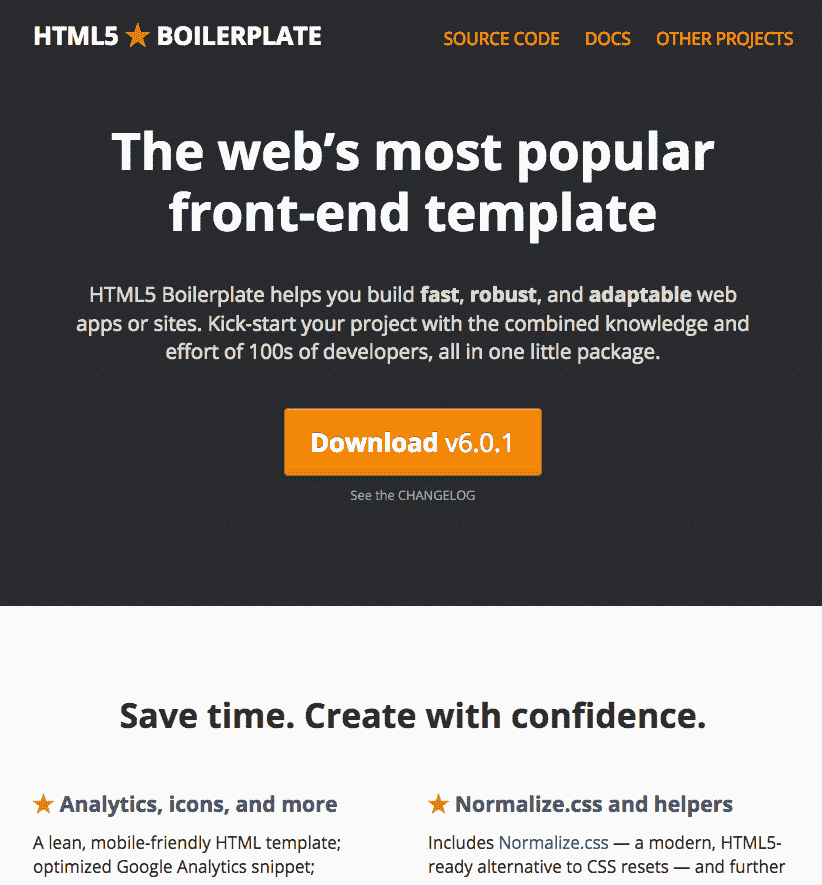

单击下载 v6.0.1 或更高版本。

让我们来看看我们的包里面有什么:


文件夹里有很多文件。 我们可以看到，它包含了一个网站正常运行所需的所有基本文件:

*   `index.html`:我们的主页，用户进入您的网站后将登陆的页面
*   `css`文件夹:存放所有 CSS 文件的文件夹
*   `img`文件夹:一个存放所有图像的文件夹
*   `js`文件夹:存放所有 JS 文件的文件夹
*   `favicon.ico`:显示在浏览器标签页左上角的图标，向用户表明他们在您的网站上，通常是您的标志
*   `404.html`:用于登录到错误 URL 的用户的 HTML 页面

其他的文件现在对我们来说不是很重要; 我们将在下一章中回顾它们。

让我们将文件夹重命名为自己的文件夹，例如`Web Project`。

# 编辑 index . html

现在让我们打开 Atom 中的文件夹; 点击菜单|打开…|并选择我们的`Web Project`文件夹。

从左面板中选择`index.html`。 你可以看到 HTML 文档和它包含的内容:

```html
<!doctype html>
<html class="no-js" lang="">
  <head>
      <meta charset="utf-8">
      <meta http-equiv="x-ua-compatible" content="ie=edge">
      <title></title>
      <meta name="description" content="">
      <meta name="viewport" content="width=device-width, initial-scale=1">

      <link rel="manifest" href="site.webmanifest">
      <link rel="apple-touch-icon" href="icon.png">
      <!-- Place favicon.ico in the root directory -->

      <link rel="stylesheet" href="css/normalize.css">
      <link rel="stylesheet" href="css/main.css">
  </head>
  <body>
      <!--[if lte IE 9]>
          <p class="browserupgrade">You are using an <strong>outdated</strong> browser. Please <a href="https://browsehappy.com/">upgrade your browser</a> to improve your experience and security.</p>
      <![endif]-->

      <!-- Add your site or application content here -->
      <p>Hello world! This is HTML5 Boilerplate.</p>
      <script src="js/vendor/modernizr-3.5.0.min.js"></script>
      <script src="https://code.jquery.com/jquery-3.2.1.min.js" integrity="sha256-hwg4gsxgFZhOsEEamdOYGBf13FyQuiTwlAQgxVSNgt4=" crossorigin="anonymous"></script>
      <script>window.jQuery || document.write('<script src="js/vendor/jquery-3.2.1.min.js"><\/script>')</script>
      <script src="js/plugins.js"></script>
      <script src="js/main.js"></script>

      <!-- Google Analytics: change UA-XXXXX-Y to be your site's ID. -->
      <script>
          window.ga=function(){ga.q.push(arguments)};ga.q=[];ga.l=+new Date;
          ga('create','UA-XXXXX-Y','auto');ga('send','pageview')
      </script>
      <script src="https://www.google-analytics.com/analytics.js" async defer></script>
  </body>
</html>
```

现在我们来回顾一下这个 HTML 文件的每一部分，以便你理解代码的每一部分:

```html
<title></title>
```

这里你可以放上我们网站的标题; 在这个练习中，我们写上`Racing Club - Events & Tickets`。

```html
<meta name="description" content="">
```

这一节是对页面的描述，它对 SEO 很有用，会出现在标题之后的搜索结果中。

```html
<meta name="viewport" content="width=device-width, initial-scale=1">
```

这将告诉浏览器如何处理桌面视图和移动视图。 你可以让它保持原样。

```html
<link rel="stylesheet" href="css/normalize.css">
<link rel="stylesheet" href="css/main.css">
```

在前一章中我们学习了在 HTML 页面中使用 CSS 有三种不同的方式。 我们在练习中使用了第二种方法，但是使用 CSS 的最佳方法是将其放入外部文件中，就像这样。 你可以让它保持原样。

```html
<!--[if lte IE 9]>
    <p class="browserupgrade">You are using an <strong>outdated</strong> browser. Please <a href="https://browsehappy.com/">upgrade your browser</a> to improve your experience and security.</p>
<![endif]-->
```

这基本上是建议使用 ie9 或更低版本的用户更新他们的浏览器。 您不需要更改代码。

```html
<!-- Add your site or application content here -->
 <p>Hello world! This is HTML5 Boilerplate.</p>
```

这就是我们的内容。 我们将编辑 HTML 的这一部分，以便在 HTML 页面中添加元素和内容。 您可以删除`<p>`元素，因为我们不需要它。

下面的代码包含了链接到我们页面的 JavaScript 插件列表:

```html
<script src="js/vendor/modernizr-3.5.0.min.js"></script>
<script src="https://code.jquery.com/jquery-3.2.1.min.js" integrity="sha256-hwg4gsxgFZhOsEEamdOYGBf13FyQuiTwlAQgxVSNgt4=" crossorigin="anonymous"></script>
<script>window.jQuery || document.write('<script src="js/vendor/jquery-3.2.1.min.js"><\/script>')</script>
<script src="js/plugins.js"></script>
<script src="js/main.js"></script>

<!-- Google Analytics: change UA-XXXXX-Y to be your site's ID. -->
<script>
    window.ga=function(){ga.q.push(arguments)};ga.q=[];ga.l=+new Date;
    ga('create','UA-XXXXX-Y','auto');ga('send','pageview')
</script>
<script src="https://www.google-analytics.com/analytics.js" async defer></script>
```

插件如下:

*   `modernizr`:检测用户的浏览器，并相应地改变网站的行为。
*   `Jquery`:我们将在下一章中使用这个框架来创建交互和动画。
*   `Plugin.js`:包含我们需要的所有其他插件。
*   `Main.js`:包含我们将要创建的所有 JS 代码。
*   `Google Analytics`:一个分析插件，用于分析用户并帮助了解您的网站的运行情况。 我们将在[第 10 章](10.html)，*优化并上线我们的**网站。*

让我们开始编辑我们的网页!

# 创建我们的网页

现在一切都设置好了，让我们开始将图像文件夹放在一起并安装字体。

# 图片文件夹

我准备了一个文件夹，里面有你做这个练习需要的所有图片。 这些图像可以在`Resources`|`Image Web project`中找到。 您可以简单地将所有图像和资源复制到我们新项目文件夹中的`img`文件夹中。

# 安装我们的字体

如果你再看看这个网站，你会发现我们使用的是自定义字体，这意味着我们使用的不是 web*安全的*字体。 网络安全字体是预装在每个设备上的字体。 它们出现在所有操作系统上。 Windows、Mac、谷歌、Linux、Unix 等都使用这个字体集合。

可能还有更多的字体，但这是一个常见的网络安全字体列表:

*   天线
*   海维提卡
*   新罗马字体
*   快递新
*   快递
*   Verdana
*   乔治亚州
*   Comic Sans MS
*   抛石机女士
*   Arial 黑
*   影响

不是超级有吸引力; 让我们诚实。

但是，使用 CSS3，我们现在可以使用`@font-face`添加我们自己的自定义字体。 让我们看看如何添加这个:

```html
@font-face
```

对于这个练习，我提供了一个名为`fonts.zip`的压缩文件，以便您更容易地完成它。 您可以解压缩该文件并将文件夹字体移动到我们的`Web Project`文件夹。 让我们看看这个文件夹里有什么:


它包含了所需的字体文件和准备使用的网页。

To use a custom font on the web, we need to generate or convert this font to a webfont beforehand. You can use the website [fontsquirrel.com](http://fontsquirrel.com) to generate web fonts from your own fonts. 

还有一个 CSS 文件使用了`@font-face`属性:

```html
@font-face {
  font-family: 'built_titling';
  src: url('built_titling_rg-webfont.woff2') format('woff2'),
       url('built_titling_rg-webfont.woff') format('woff');
  font-weight: 400;
  font-style: normal;
}

@font-face {
  font-family: 'built_titling';
  src: url('built_titling_el-webfont.woff2') format('woff2'),
       url('built_titling_el-webfont.woff') format('woff');
  font-weight: 200;
  font-style: normal;
}
```

让我们把这个 CSS 文件链接到我们的 HTML 文件。 在我们的`index.html`中，让我们添加以下内容:

```html
<link rel="stylesheet" href="fonts/font.css"> <!-- Font face CSS link -->

<link rel="stylesheet" href="css/normalize.css">
<link rel="stylesheet" href="css/main.css">
```

很好，我们现在已经把字体链接到 HTML 页面了。 现在添加第二种字体，谷歌字体。

# 导入谷歌字体

自 2010 年以来，谷歌为用户提供了一个平台来发现和自由使用字体。 在谷歌字体的主网站上有超过 800 种字体，我们将在这次练习中使用其中一种。

谷歌使导入字体变得非常容易。 以下是在我们的网站加入字体的步骤:

1.  到谷歌字体网站([https://fonts.google.com/](https://fonts.google.com/))。
2.  搜索我们的字体，Roboto，并点击相应的字体([https://fonts.google.com/specimen/Roboto](https://fonts.google.com/specimen/Roboto))。
3.  点击 SELECT THIS FONT。
4.  单击底部的小弹出窗口，并切换到 CUSTOMIZE 选项卡。
5.  我们要用正体和粗体。
6.  切换回 EMBED 选项卡并复制显示的代码:

```html
<link href="https://fonts.googleapis.com/css?family=Roboto:400,700" rel="stylesheet">
```

7.  在我们之前的 CSS 链接之前复制粘贴这段代码:

```html
<link href="https://fonts.googleapis.com/css?family=Roboto:400,700" rel="stylesheet">
<link rel="stylesheet" href="fonts/font.css"> <!-- Font face CSS link -->

```

您现在已经安装了您的谷歌字体!

现在，要使用我们的谷歌字体，简单地将 CSS 属性粘贴到我们想要样式化的元素:

```html
font-family: 'Roboto', sans-serif;
```

让我们进入我们的 CSS 文件，位于`css`|`main.css`。

找到带有以下注释的部分:

```html
/* ==========================================================================
   Author's custom styles
   ========================================================================== */
```

在这里,写:

```html
body {
  font-family: 'Roboto', sans-serif;
}
```

这将把 font-family 属性应用于`<body>`元素，这是我们 HTML 页面的主要元素，因此它将应用于`<body>`中的所有元素。

# 添加 normalize.css

在查找`main.css`时，您可能会注意到另一个`css`文件。 什么是`normalize.css`?为什么我们要把它集成到 HTML 中?

正如我们前面看到的，每个浏览器呈现的内容都不一样。 有了`normalize.css`，所有的浏览器将更加一致地呈现元素，并符合现代标准。 我们只需要将它添加到其他的`css`文件中，它就会完成工作。 很酷,不是吗?

# 头

让我们开始实现 header。 最佳实践是先完成 HTML，然后再完成 CSS。 让我们先看一下我们的设计。

如你所见，我们的标题有一个透明的背景，标志和主菜单在左边，二级菜单在右边。

首先，在我们的 HTML 文档中创建一个`<header>`标签:

```html
<!-- Add your site or application content here --> <header></header>
```

# 创建一个菜单

为了创建菜单，我们需要创建一个列表。 在 HTML 中，要创建一个列表，必须使用标记`<ul>`。

`<ul>`表示无序列表; 它需要在`<li>`中有一个列表标签。 你可以如下使用它:

```html
<ul>
  <li>Coffee</li>
  <li>Tea</li>
  <li>Milk</li>
</ul>
```

我们的列表应该是这样的:

```html
<header>
  <ul>
    <li>Upcoming events</li>
    <li>Past events</li>
    <li>FAQ</li>
    <li>About us</li>
    <li>Blog</li>
    <li>Contact</li>
  </ul>
</header>
```

# 插入链接

要使菜单正常工作，我们需要向列表添加链接; 否则，它将一事无成。 要添加链接，必须使用标签`<a>`。 为了使每个`<li>`元素都可以作为链接点击，我们需要在`<li>`标签中添加`<a>`标签，如下所示:

```html
<li><a>Upcoming events</a></li>
```

现在我们需要指定链接的位置。 为此，我们需要添加属性`href`:

```html
<li><a href="upcoming.html">Upcoming events</a></li>
```

如果没有`href`属性，`<a>`标记就不会充当超链接。 `href`的值可以是指向另一个网站的绝对链接，也可以是指向同一域上某个文件的相对链接。 它基本上与我们前面看到的`src`属性的行为相同。

最后，我们的菜单应该是这样的:

```html
<ul>
  <li><a href="upcoming.html">Upcoming events</a></li>
  <li><a href="past.html">Past events</a></li>
  <li><a href="faq.html">FAQ</a></li>
  <li><a href="about.html">About us</a></li>
  <li><a href="blog.html">Blog</a></li>
  <li><a href="contact.html">Contact</a></li>
</ul>
```

最后，让我们在`<ul>`标签中添加一个类，这样我们就可以在以后使用`css`指定样式，如下所示:

```html
<ul class="main-nav">
```

# 添加一个标志

除了导航，我们在左边也有一个标志。 我在`Resources`文件夹(`Exercise 2`|`Assets`)中提供了一些您可以用于此练习的资产。

只需将`logo.png`和`logo@2x.png`文件复制并粘贴到`Web Project`上的`img`文件夹中。

`logo@2x.png`只是图像的视网膜版本，这意味着它的像素密度是正常图像的两倍。 用`@2x`作为后缀来命名你的视网膜图像是一个很好的做法。

现在我们简单地在菜单前添加一个图像，如下所示:

```html

```

也许你已经注意到我们只放了`logo.png`而没有使用`logo@2x.png`。 为了能够只在视网膜设备上使用视网膜版本图像，我们必须使用属性`srcset`:

```html

```

属性使用起来非常简单。 对于每个资产，在最后添加密度，以指定应该使用哪个屏幕密度。 在这个例子中，我们将放入`img/logo@2x.png 2x`。 您还可以指定它应该出现在屏幕的哪个宽度，但是让我们在本例中保持简单。

一个很好的网页设计方法是将 logo 链接到主页上。 为此，我们需要将`img`标签放入标签中:

```html
<a href="#"></a>
```

为了确保链接在网站主页上，我们需要将`href`属性`"#"`更改为`"/"`，这样它就会转到文件夹的根目录:

```html
<a href="/"></a>
```

最后，让我们添加一个类`"logo"`，以便以后针对这个元素:

```html
<a class="logo" href="/"></a>
```

# 右边的菜单

菜单的最后一部分是带有`Login`和`Facebook`like 按钮的右侧菜单。 有很多方法可以做到这一点，但我建议使用另一个列表，比如我们之前创建的:

```html
<ul class="right-nav">
  <li><a href="login.html">Login</a></li>
  <li><a href="#">Facebook</a></li>
</ul>
```

我们将添加类`"right-nav"`，并添加 2`<li>`，如前面的代码所示。

# 添加一个 Facebook 喜欢按钮

要添加`Facebook`like 按钮，我们首先需要创建按钮。 为此，我们需要去 Facebook 开发者的网站获取信息。 我有现成的链接:[https://developers.facebook.com/docs/plugins/like-button](https://developers.facebook.com/docs/plugins/like-button%23)。 在这个页面，你会找到自定义按钮的方法，如下图所示:

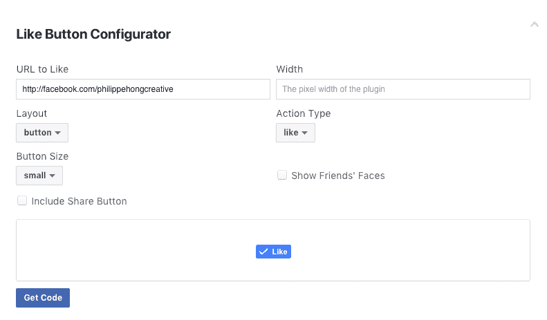

一旦完成，点击 Get Code 并选择选项卡 IFrame:

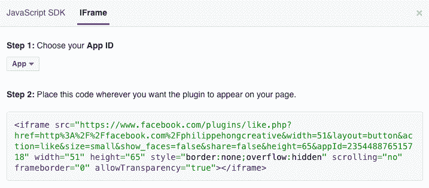

我们可以将这段代码复制到我们的网站的第二个`<li>`标签中。

我们会对按钮进行一些自定义; 将属性高度的默认值更改为`20px`。 你应该得到这样的代码:

```html
<ul class="right-nav">
  <li><a href="login.html">Login</a></li>
  <li><a href="#"><iframe src="https://www.facebook.com/plugins/like.php?href=http%3A%2F%2Ffacebook.com%2Fphilippehongcreative&width=51&layout=button&action=like&size=small&show_faces=false&share=false&height=65&appId=235448876515718" width="51" height="20" style="border:none;overflow:hidden" scrolling="no" frameborder="0" allowTransparency="true"></iframe></a></li>
</ul>

```

我们现在有了 HTML 中的菜单; 让我们添加一些 CSS 样式，使它看起来更好。

# 样式我们头

现在，我们的头球看起来很无聊。 但是，不用担心，我们将为 CSS 添加一些魔力，使它更漂亮。


我们之前看到 CSS 可以用三种不同的方式来编写:

*   在带有`style`属性的 HTML 标记中
*   在带有标签`<style>`的 HTML 文档中的`<head>`部分中
*   CSS 代码也可以放到一个外部文件中

对于我们自己的项目，我们将使用第三种方式，就像通常在 web 中使用的那样，因为 CSS 可以在不改变 HTML 文件的情况下改变。

让我们创建用于常规样式化的 CSS 文件。 在 Atom 中，单击“文件|新文件”，并使用“文件|另存为”保存该文件。 选择文件夹`css`并将此文件命名为`styles.css`。 我们必须像之前创建的`font.css`文件那样链接这个文件:

```html
<link href="https://fonts.googleapis.com/css?family=Roboto:400,700" rel="stylesheet">
<link rel="stylesheet" href="fonts/fonts.css"> <!-- Font face CSS link -->
<link rel="stylesheet" href="css/normalize.css">
<link rel="stylesheet" href="css/main.css">
<link rel="stylesheet" href="css/styles.css">
```

现在我们有了我们的`styles.css`，我们可以开始了。 但我通常喜欢同时查看 HTML 和 CSS。 这很容易做到; 选择您的`styles.css`，然后转到视图|窗格|右拆分。 现在在两个不同的窗格上打开了该文件。 你可以关闭左边的一个:

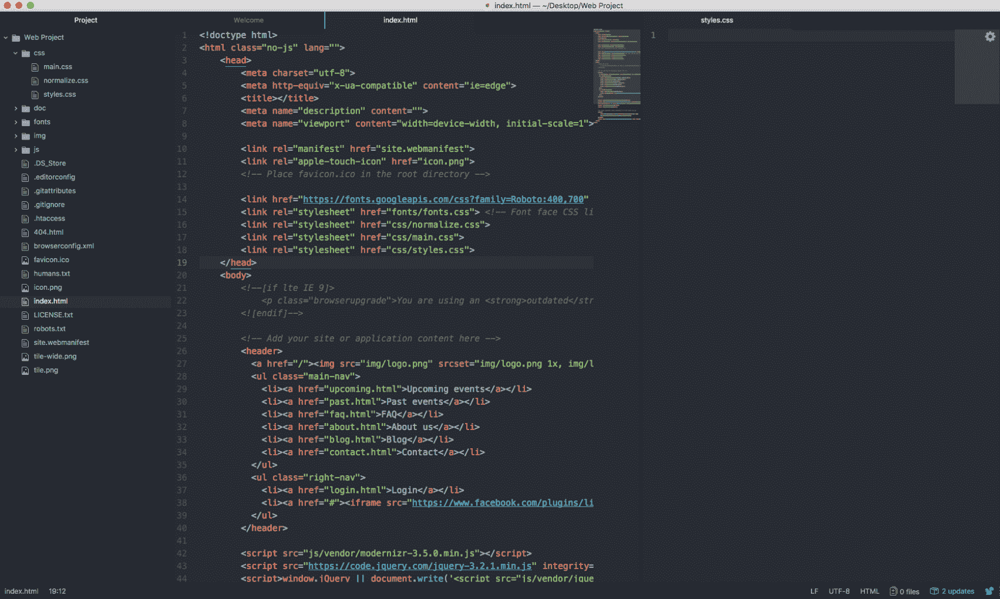

The view split in two in Atom.

首先，我们需要瞄准`header`标记。 标签没有类，但是我们可以只使用这个标签来定位 HTML 标签。 在 CSS 中它将是:

```html
header {
}
```

这将基本上针对 HTML 中的每个`<header>`标签，所以你需要小心对待它:


如果我们仔细看看我们的设计,我们可以注意到标题需要完整的 web 页面的宽度,高度*70 px*,和灰色有渐变透明的背景,让其背后的形象出现。

为此，我们有 CSS 属性`width`:

```html
header {
  width: 100%;
  height: 70px;
}
```

我们现在可以添加背景渐变。 为此，我们使用 CSS 属性`background-image: linear-gradient`:

```html
background-image: linear-gradient(0deg, rgba(0,0,0,0.00) 0%, rgba(0,0,0,0.50) 50%);
```

为了用 CSS 创建渐变，我经常使用生成器([http://www.colorzilla.com/gradient-editor/](http://www.colorzilla.com/gradient-editor/))来为我创建最终的代码。

我有时也会使用 Sketch 或 Photoshop 提供的 CSS 工具直接从设计中复制 CSS 属性。

对于这个练习，你可以复制我提供的代码:

```html
header {
  width: 100%;
  background-image: linear-gradient(0deg, rgba(0,0,0,0.00) 0%, rgba(0,0,0,0.50) 50%);
}
```

保存 CSS 和 HTML 文件，并在浏览器上打开`index.html`:


现在我们有了容器，但我们仍然需要使菜单程式化。 让我们首先根据它的类`main-nav`来定位我们的列表。 如果你还记得，要调用一个类，我们需要在类名之前添加一个点，像这样:

```html
header .main-nav {

}
```

现在我们要专门针对`<ul>`内的每一个`<li>`。 要做到这一点，我们只需在后面加上`li`，正如我们在前面一章中看到的:

```html
header .main-nav li {

}
```

让我们首先删除列表样式，它在默认情况下是一个圆。 要做到这一点，我们需要使用 CSS 属性`list-style-type`:

```html
header .main-nav li {
  list-style-type: none; 
}
```

让我们放入`none`，这样它将删除`li`标签中的所有样式。

我们还必须水平显示列表，而不是垂直显示。 要做到这一点，我们需要使用 CSS 属性`display: inline-block`。

CSS 属性`display: inline-block`将以内联方式显示列表，但可以将宽度和高度设置为块元素:

```html
header .main-nav li {
  list-style-type: none;
  display: inline-block;
}
```

让我们保存我们的工作，看看我们到目前为止有什么:

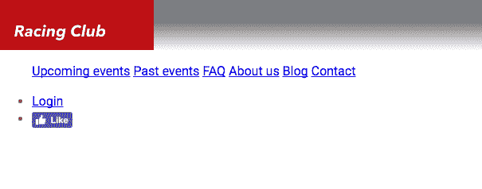

我们现在的目标是把菜单放在标志旁边。 为此，我们需要让 logo 浮动。 就像我们之前在 CSS 那章看到的，我们将在 logo 上使用 CSS 属性`float: left;`:

```html
header .logo {
  float: left;
}
```

现在我们需要正确地显示菜单。 首先，我们将为`main-nav`添加一个高度:

```html
header .main-nav {
  height: 70px;
}
```

我们还需要使菜单浮动，这样右边的菜单就可以放在最上面:

```html
header .main-nav {
  height: 70px;
}
```

因为所有的`<ul>`标签默认都有一些 padding 和 margin，我们需要覆盖它:

```html
Header .main-nav {
  height: 70px;
  float: left;
  margin: 0;
  padding: 0;
}
```

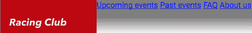

问题是我们的菜单和 logo 是并排的，所以我们需要给菜单添加一些填充:

```html
header .main-nav {
  height: 70px;
  float: left;
  margin: 0;
  padding: 0;
  padding-left: 0;
}
```

但现在我们有两个重叠的属性，因为填充包括所有的填充，比如 padding-left。 这将仍然工作，但它是糟糕的 CSS。 为了正确地编写它，我们可以使用一个 CSS 属性组合和修改填充:

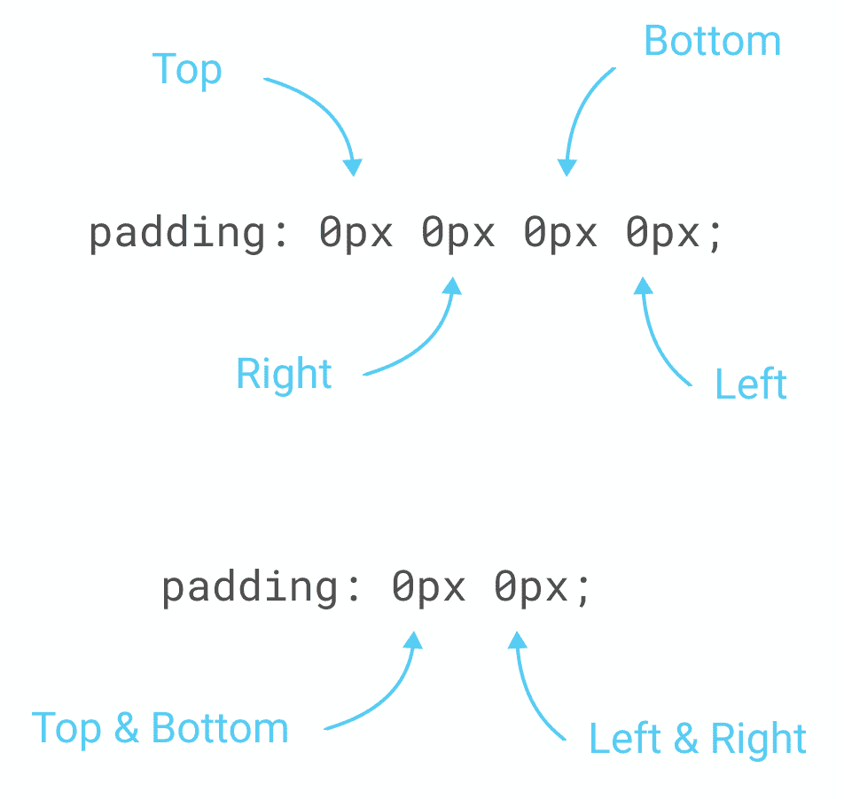

This image explains how you can change different paddings with just one property.

在我们的练习中，我们将做以下工作:

```html
header .main-nav {
  height: 70px;
  float: left;
  margin: 0;
  padding: 0px 15px;
}
```

我们的下一个目标是使我们的菜单与 logo 垂直对齐。 要做到这一点，我们可以使用 CSS 的一个小技巧，使用行高，它通常用于改变一个段落的行与行之间的空间。 通过将`line-height`设置为菜单的高度，我们将使菜单垂直对齐:

```html
header .main-nav {
  height: 70px;
  float: left;
  margin: 0;
  padding: 0px 15px;
  line-height: 70px;
}
```

现在让我们将字体定制为前面安装的字体。 让我向你展示最终的 CSS，这样我就可以逐行解释它的确切含义:

```html
header .main-nav li a {
  color: white;
  text-decoration: none;
  font-family: 'built_titling', Helvetica, sans-serif;
  font-weight: 200;
  font-size: 20px;
  letter-spacing: 4px;
  padding: 0px 15px;
}
```

首先，我们需要针对我们的`.main-nav`类中的`<a>`标记。 在我们的括号内，我们将有以下内容:

1.  `color: white;`将指定文本的颜色。 您可以使用十六进制代码或 140 原生颜色 CSS 支持([https://www.w3schools.com/cssref/css_colors.asp](https://www.w3schools.com/cssref/css_colors.asp))设置此颜色。
2.  `text-decoration: none;`将抑制文字上的所有修饰。 在这里，我们想要在每个链接上抑制下划线。
3.  `font-family: 'built_titling', Helvetica, sans-serif;`指定要显示的字体。 如果第一个不能加载，下面的字体名称将提供服务。
4.  `font-weight: 200;`是字体粗体的层次。
5.  `font-size: 20px;`将是字体的大小，以像素为单位。
6.  `letter-spacing:`将指示每个字符之间的间距。
7.  `padding:`这是我们之前学过的内填充。

我们几乎完成了。 让我们保存并查看:


我们只剩下右边的部分要完成了，让我们把它做完吧!

对于这一部分，我们需要让它浮在右边。 让我们首先针对这个类:

```html
Header .right-nav {

}
```

这个右导航和左导航的属性几乎是一样的; 我们只将浮动改为右:

```html
header .right-nav {
  height: 70px;
  float: right;
  margin: 0;
  padding: 0px 15px;
  line-height: 70px;
}
```

正如您将看到的，我们将使用大量的复制/粘贴进行编码，因为许多元素将使用相同的属性。

但如果有很多选择器都使用相同的 CSS 属性呢? 我们必须全部复制/粘贴吗? 编码方面的一个良好实践是简化代码，以减少加载时间。

在 CSS 中，我们可以调用多个选择器并放置相同的 CC 属性。 为此，我们需要用逗号`,`分隔它们。 以我们的`left-nav`和`right-nav`为例，我们可以这样做:

```html
header .main-nav, header .right-nav{
  height: 70px;
  float: left;
  margin: 0;
  padding: 0px 15px;
  line-height: 70px;
}

header .right-nav {
  float: right;
}
```

这将与我们之前编写的代码具有相同的效果。 而且因为我们调用了`.right-nav`并将属性`float: right;`放在后面，它会覆盖之前的属性`float: left;`。 在使用 CSS 进行编码时，这是一个很好的实践。

让我们在剩下的代码中牢记这一良好实践:

```html
header .main-nav li, header .right-nav li {
  list-style-type: none;
  display: inline-block;
}

header .main-nav li a, header .right-nav li a {
  color: white;
  text-decoration: none;
  font-family: 'built_titling', Helvetica, sans-serif;
  font-weight: 200;
  font-size: 20px;
  letter-spacing: 4px;
  padding: 0px 15px;
}
```

现在我们有了头球。 让我们保存它并最终查看:

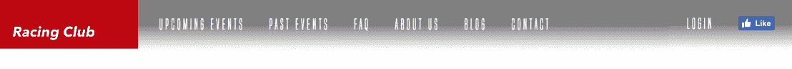

太棒了! 最后，为了使我们的代码干净且易于阅读，我建议在代码的每个部分的开头和结尾添加一些注释。

这将是我们的`HEADER`部分的最终 CSS 代码:

```html
/* HEADER */

header {
  width: 100%;
  height: 70px;
  background-image: linear-gradient(0deg, rgba(0,0,0,0.00) 0%, rgba(0,0,0,0.50) 50%);
  position: absolute;
}

header .logo {
  float: left;
}

header .main-nav, header .right-nav{
  height: 70px;
  float: left;
  margin: 0;
  padding: 0px 15px;
  line-height: 70px;
}

header .right-nav {
  float: right;
}

header .main-nav li, header .right-nav li {
  list-style-type: none;
  display: inline-block;
}

header .main-nav li a, header .right-nav li a {
  color: white;
  text-decoration: none;
  font-family: 'built_titling', Helvetica, sans-serif;
  font-weight: 200;
  font-size: 20px;
  letter-spacing: 4px;
  padding: 0px 15px;
}

/* END OF HEADER */
```

# 添加英雄部分

在实现 header 后，我们现在可以进入下一步，也就是英雄 Section。 在网页设计中，英雄部分通常由一个大图、一个标题、一个描述和一个**行动号召**(**CTA**)组成。 它可以作为网站的概述，因为它是访问者看到的第一件事。

在我们的设计中，我们有以下几点:

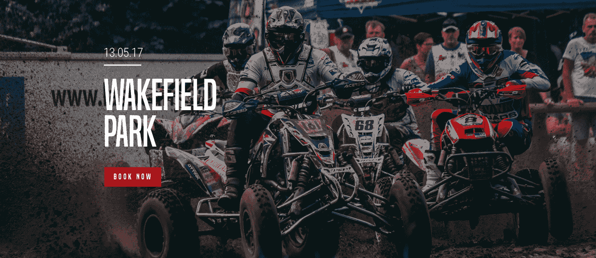

这很简单。 它由一个背景图像、一个渐变叠加和一些文字组成，左边有一个按钮。 如果我们试着标记出每个块的轮廓，我们可以得到这样的东西:

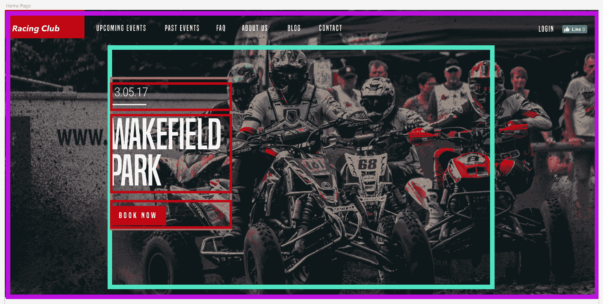

也许这可以帮助您可视化我们试图在 HTML/CSS 中做的事情。 让我们从 HTML 开始:

我们可以首先创建一个 section(紫色)来保存所有内容:

```html
<section id="hero">
</section>
```

我们将添加一个`id`，以便稍后更容易调用它。

现在我们必须创建一个`container`(fuschia)，它将包含其中的所有元素，但也要水平居中。 为此，我们将用类`container`创建一个`div`:

```html
<section id="hero">
  <div class="container">

  </div>
</section>
```

在内部，我们将有一个块，它将包含标题、描述和按钮，它们将左对齐。 我们可以称之为`"hero-text"`:

```html
<section id="hero">
  <div class="container">
    <div class="hero-text">

    </div>
  </div>
</section>
```

现在，让我们在里面添加内容:

```html
<section id="hero">
  <div class="container">
    <div class="hero-text">
      <p class="hero-date">10.05.18</p>
      <h1 class="hero-title">Wakefield Park</h1>
      <button type="button" name="button" class="btn-primary">Book now</button>
    </div>
  </div>
</section>
```

您可能已经看到，我们没有将图像添加到 HTML 中，因为我们想用 CSS 添加它。 使用 CSS 添加图像可以提供更多的灵活性和自定义。 在本例中，我们想让它全屏并覆盖背景。 首先，我们调用我们的`#hero`div:

```html
#hero {

}
```

让我们添加以下样式:

```html
#hero {
  width: 100%;
  height: 700px;
  background-image:
    linear-gradient(to bottom, rgba(0,0,0,0.3) 0%,rgba(0,0,0,0.4) 100%),
    url("img/hero-image.jpg");
  background-repeat: no-repeat;
  background-size: cover;
  background-position: center;
}
```

以下是一些解释:

1.  我们首先需要设置块的大小。 因为我们希望它是全屏的，我们必须使宽度为 100%，高度为 700px，因为尺寸是设计的。
2.  使用 CSS5，我们可以添加多个背景。 为此，我们需要用逗号分隔它们，如前面所示。
3.  我们使用`background-repeat`使背景不会像默认情况那样无限期地重复。

4.  `background-size: cover;`将使背景图像随着块的大小拉伸，这里是全屏。
5.  `background-position: center;`将总是把背景放在中间，即使在调整大小的时候。
6.  让我们保存我们的文件，看看我们得到什么:


我们有了图像和渐变; 现在让我们进入内容。

正如我们之前所说的，我们需要以内容为中心。 正如你可能已经看到的，我们的设计遵循一个网格:

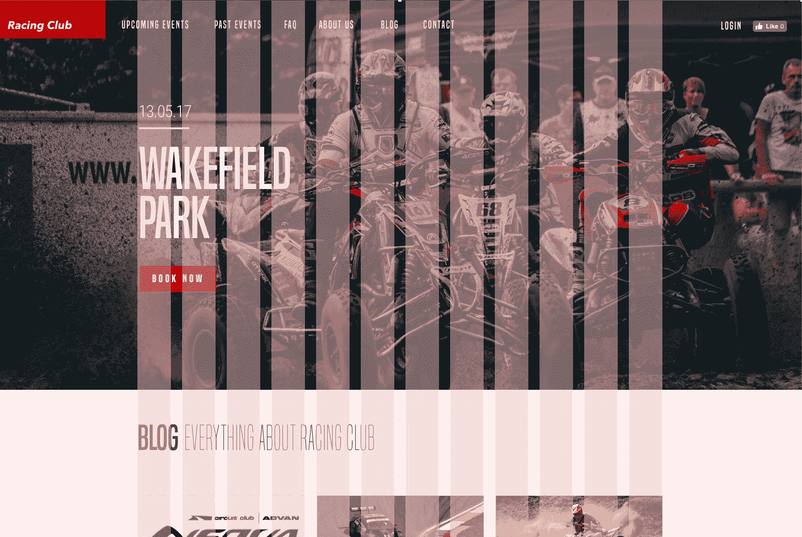

我们需要创建这个容器，它的宽度为 940px，并且水平居中。 这很简单，我们需要做的就是:

```html
.container {
  max-width: 940px;
  margin: 0 auto;
}
```

以下是一些注意事项:

1.  `max-width: 940px:`:我们不希望容器大于`940px`，但根据屏幕大小可以小于这个值。
2.  `margin: 0 auto;`是将块元素水平居中的简单方法。

下一步是对内容进行程式化。 但是，首先，我们需要在进入代码之前分析设计。 在看设计的时候，我们可以看到:

*   英雄内容需要垂直居中于英雄部分
*   英雄内容需要在左侧对齐，宽度为 50%

# ccs flexbox

为了实现这一点，我们将使用新的 CSS 属性`display: flex`。 CSS flexbox 非常实用，因为它允许您非常容易地定位元素。 定心，订货，和对齐是非常容易与 flexbox。 如果您可以处理这个新属性，我保证您将是 CSS 的杀手。

在我们的例子中，我们希望我们的`.container`垂直居中。 为此，我们将目标类并添加以下属性:

```html
#hero .container {
  display: flex;
  align-items: center;
  height: 700px;
}
```

通过在`.container`之前添加`#hero`，我们只针对`#hero`内部带有`.container`类的元素。 我们不希望所有`.container`都具有相同的属性:

1.  `display: flex;`必须设置在父元素上。
2.  `align-items: center;`将垂直对齐并居中该元素内的所有元素。 魔法!
3.  需要设置`height`以便可以将元素对齐到中间。

CSS flexbox has very powerful properties. We could have done the entire website with flexbox properties, but for you to learn all the possibilities, we had to go through all the steps.

让我们继续我们的文本样式:

```html
.hero-text {
  max-width: 470px;
}
```

我们设置这个宽度是因为我们不想让文本一直向右移动，所以我们将 max-width 设置为`.container`的`max-width`的一半。 继续遵循我们的设计:

```html
.hero-text .hero-date {
  font-family: 'built_titling', Helvetica, sans-serif;
  font-size: 30px;
  color: #FFFFFF;
  font-weight: normal;
}
```

接下来是我们的标题:

```html
.hero-text .hero-title {
  font-family: 'built_titling', Helvetica, sans-serif;
  font-size: 120px;
  margin: 20px 0px;
  font-weight: normal;
  color: #FFFFFF;
  line-height: 1;
}
```

最后，我们有按钮:

```html
.btn-primary {
  display: inline-block;
  font-family: 'built_titling', Helvetica, sans-serif;
  font-weight: 400;
  font-size: 18px;
  letter-spacing: 4.5px;
  background: #BF0000;
  color: white;
  padding: 12px 22px;
  border: none;
  outline: none;
}
```

我们使用`display: inline-block;`，这样就可以将按钮作为内联元素使用，但具有块元素的特性(宽度和高度)。 `border`和`outline`默认为`none`。 每个按钮都有`border`和`outline`。

让我们看看我们有什么:

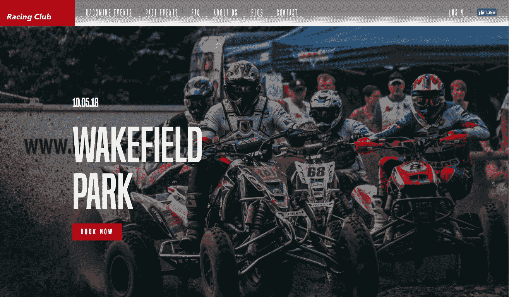

网站看起来很棒，但我们有一些烦人的页边距在顶部。 为了解决这个问题，我们需要使用 CSS 属性`"position"`。

# 在 CSS 定位

在 CSS 中，有五个不同的位置值:

*   静态
*   相对
*   固定
*   绝对
*   黏糊糊的

# 位置的静态

它们都有不同的用法。 默认情况下，所有 HTML 元素都是静态的。

# 位置相对

具有相对位置的元素相对于其正常位置被定位。 您可以通过改变其左、上、右或底部位置来调整位置。

例如:

```html
div.relative-element {
    position: relative;
    top: 50px;
    left: 50px;
}
```

Check the following diagram for better understanding:


# 绝对位置

位置为绝对的元素将被定位到其最近的父元素旁边，这意味着任何位置为位置静态的元素。 如果这个元素没有父元素，它将被定位到视口本身。

A positioned absolute element will be placed over the parent element.


# 位置固定

位置固定的元素将充当绝对位置，但只对视口本身起作用。 即使页面滚动，它也会保持在相同的位置:

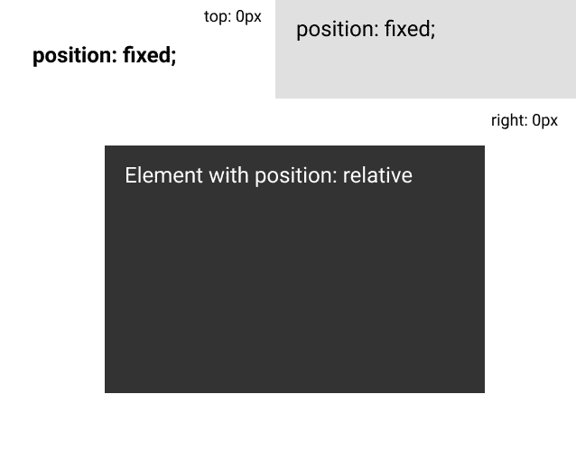

# 位置粘

具有位置 sticky 的元素将基于用户的滚动位置进行定位。

然而，并不是所有浏览器都完全支持它，因此我们不会在本练习中使用它。

现在我们理解了位置在 CSS 中的用法，我们需要将头部叠加到英雄部分上。 要做到这一点，我们需要使头部位置绝对。 由于头文件没有父元素，它将被定位在视口本身。

让我们回到标题部分，添加 position: absolute 属性:

```html
header {
  width: 100%;
  height: 70px;
  background-image: linear-gradient(0deg, rgba(0,0,0,0.00) 0%, rgba(0,0,0,0.50) 50%);
  position: absolute;
}
```

让我们保存，看看我们有什么:


现在我们已经很好地实现了第一个部分和标题。 让我们继续下一节。

# 博文

首先，就像我们经常做的那样(你需要养成这种习惯)，我们需要分析设计，看看它是如何组成的:


正如我们所看到的，Blog 部分由一个标题和六篇 Blog 文章组成。 每行有三篇文章，宽度均为三分之一。

我们知道如何使用`float`和`display: inline-block`属性来设计它。 让我们尝试用 CSS flexbox 来构建它。

让我们首先添加 HTML:

```html
<section id="blog">
  <div class="container">
    <h2><b>Blog</b> Everything about RACING CLUB</h2>

  </div>
</section>
```

以下是一些解释:

1.  我们需要创建另一个`section id "blog"`
2.  我们需要重用类`container`以获得一个具有相同宽度的容器
3.  我们添加了一个`<h2>`，因为它不像英雄头衔那么重要
4.  我们添加了一个`<b>`标签以使 Blog 这个词加粗

现在让我们添加我们的`blog`帖子部分:

```html
<section id="blog">
  <div class="container">
    <h2><b>Blog</b> Everything about RACING CLUB</h2>
    <div class="blog-posts">
      <div class="blog-post">
        
        <p class="blog-post-date">09th January 2016</p>
        <h3>Racing Club Advan Neova Challenge Round 3 Update</h3>
        <p class="blog-post-desc">FINAL ROUND: Labour Day Trackday Wakefield Park. Last chance to compete in the Circuit Club Advan Neova Challenge 2016!
There was much anticipation with Jason's big power Evo competing at Round 3, however some suspected engi… <a href="#">Read More</a></p>
      </div>
    </div>
  </div>
</section>
```

以下是我们所做的:

1.  我们添加了一个包含所有博客文章的类`"blog-posts"`的`div`。

2.  在内部，我们创建一个带有类`"blog-post"`的 div，它将是一个博客文章。
3.  在这个`div`中，我们添加了带有`img`标签和`srcset`的图像。
4.  我们还为 Blog 发布日期添加了一个带有类`"blog-post-date"`的 p 标签。
5.  我们添加了一个没有 class 的`<h3>`元素，因为它是唯一的`h3`元素，所以我们可以很容易地用 CSS 瞄准它。
6.  最后，我们添加了内部带有链接的`description`文本。

这表示一篇 Blog 文章，因此要制作六篇文章，我们只需要复制`blog`post 元素六次。

让我们也添加另一个`div`来创建我们的 Show More 按钮:

```html
<div class="blog-show-more">
  <button type="button" name="button" class="btn-primary">More posts</button>
</div>
```

最后，你应该得到这样的东西:

```html
<section id="blog">
  <div class="container">
    <h2><b>Blog</b> Everything about RACING CLUB</h2>
    <div class="blog-posts">

      <div class="blog-post">
        
        <p class="blog-post-date">09th January 2016</p>
        <h3>Racing Club Advan Neova Challenge Round 3 Update</h3>
        <p class="blog-post-desc">FINAL ROUND: Labour Day Trackday Wakefield Park. Last chance to compete in the Circuit Club Advan Neova Challenge 2016!
There was much anticipation with Jason's big power Evo competing at Round 3, however some suspected engi… <a href="#">Read More</a></p>
      </div>

      <div class="blog-post">
        
        <p class="blog-post-date">09th January 2016</p>
        <h3>Hidden Behind the Scenes</h3>
        <p class="blog-post-desc">Originally posted by Narada Kudinar, 23.08.11.
At our Trackdays, we get a variety - owners with their girlfriends, owners with their mates, owners and their mechanics - but there is one combination I am truly at envy with. It's the owners and their Dads. <a href="#">Read More</a></p>
      </div>

      <div class="blog-post">
        
        <p class="blog-post-date">04th July 2015</p>
        <h3>Introducing Advan Trackdays!</h3>
        <p class="blog-post-desc">For the first time, Yokohama Advan Tyres are hosting their very own Trackdays, hosted by your's truly! The aim? To thank their loyal customers by providing a bargain event as well as introduce new Advan tyres to those who don't use them yet...<a href="#">Read More</a></p>
      </div>

      <div class="blog-post">
        
        <p class="blog-post-date">09th Jun 2015</p>
        <h3>ANZAC Day Spots Running Out!</h3>
        <p class="blog-post-desc">FINAL ROUND: Labour Day Trackday Wakefield Park. Last chance to compete in the Circuit Club Advan Neova Challenge 2016!
There was much anticipation with Jason's big power Evo competing at Round 3, however some suspected engi… <a href="#">Read More</a></p>
      </div>

      <div class="blog-post">
        
        <p class="blog-post-date">15th Mar 2015</p>
        <h3>10 Year Anniversary Details Now Available!</h3>
        <p class="blog-post-desc">Originally posted by Narada Kudinar, 23.08.11.
At our Trackdays, we get a variety - owners with their girlfriends, owners with their mates, owners and their mechanics - but there is one combination I am truly at envy with. It's the owners and their Dads. <a href="#">Read More</a></p>
      </div>

      <div class="blog-post">
        
        <p class="blog-post-date">16th Jan 2015</p>
        <h3>Prepare for EPICNESS</h3>
        <p class="blog-post-desc">For the first time, Yokohama Advan Tyres are hosting their very own Trackdays, hosted by your's truly! The aim? To thank their loyal customers by providing a bargain event as well as introduce new Advan tyres to those who don't use them yet... <a href="#">Read More</a></p>
      </div>

    </div>
div class="blog-show-more">
      <button type="button" name="button" class="btn-primary">More posts</button>
    </div>

  </div>
</section>
```

现在让我们转向 CSS ! 我们将首先设计标题:

```html
#blog h2 {
  font-family: 'built_titling', Helvetica, sans-serif;
  font-weight: 200;
  font-size: 60px;
}
```

对于`blog-posts`集装箱，我们将做如下操作:

```html
.blog-posts {
  display: flex;
  flex-direction: row;
  flex-wrap: wrap;
  margin-top: 50px;
}

.blog-post {
  width: 33.33%;
  padding: 0 5px;
  box-sizing: border-box;
  margin-bottom: 30px;
}
```

`.blog-posts`是父元素，`.blog-post`是子元素。

以下是关于`.blog-posts`的一些信息:

1.  `display: flex;`总是需要添加到父元素中。
2.  `flex-direction: row;`将子元素定向为一行。 你可以把它作为一列。

3.  `flex-wrap: wrap;`将使子元素从上到下换行到多行。 默认情况下，它将尝试将每个元素都放在一行上。
4.  `margin-top: 50px;`在顶部加一点边距。

以下是关于`.blog-post`的一些信息:

1.  设置宽度为总宽度的三分之一
2.  `padding: 0 5px;`在左右两侧添加一些填充
3.  `box-sizing: border-box;`:正如我们前面看到的，这将使 padding 和 margin 属性应用于框内而不是框外

到目前为止，我们的布局是正确的:


让我们来设计博客文章的内容:

```html
.blog-post img {
  width: 100%;
}
```

我们使用`width: 100%;`，因为我们希望我们的图像取`width`的`100%`。 其余的是相当基本的 CSS，只是遵循设计:

```html
.blog-post .blog-post-date {
  font-size: 14px;
  color: #9A9A9A;
  margin-top: 20px;
}

.blog-post h3 {
  font-size: 20px;
  color: #4A4A4A;
  letter-spacing: -0.4px;
  line-height: 1.4;
}

.blog-post .blog-post-desc {
  font-size: 14px;
  color: #4A4A4A;
  line-height: 1.6;
}

.blog-post .blog-post-desc a {
  color: #BF0000;
  text-decoration: underline;
  font-weight: bold;
}
```

这是我们最终得到的结果:


现在看起来和我很像。 最后一部分是 Show More 按钮。 一个简单的方法是在父元素中添加一个`text-align: center`，这样它就会使按钮对齐到中间:

```html
.blog-show-more {
  text-align: center;
}
```

最后，我将在底部添加一些边距，以添加一点空白:

```html
#blog {
  margin-bottom: 50px; 
}
```

我们的 CSS 的`blog`部分:

```html
/* BLOG SECTION */

#blog {
  margin-bottom: 50px;
}

#blog h2 {
  font-family: 'built_titling', Helvetica, sans-serif;
  font-weight: 200;
  font-size: 60px;
}

.blog-posts {
  display: flex;
  flex-direction: row;
  flex-wrap: wrap;
  margin-top: 50px;
}

.blog-post {
  width: 33.33%;
  padding: 0 5px;
  box-sizing: border-box;
  margin-bottom: 30px;
}

.blog-post img {
  width: 100%;
}

.blog-post .blog-post-date {
  font-size: 14px;
  color: #9A9A9A;
  margin-top: 20px;
}

.blog-post h3 {
  font-size: 20px;
  color: #4A4A4A;
  letter-spacing: -0.4px;
  line-height: 1.4;
}

.blog-post .blog-post-desc {
  font-size: 14px;
  color: #4A4A4A;
  line-height: 1.6;
}

.blog-post .blog-post-desc a {
  color: #BF0000;
  text-decoration: underline;
  font-weight: bold;
}

.blog-show-more {
  text-align: center;
}

/* END OF BLOG SECTION */
```

# 创建 ABOUT US 部分

这个部分不是很复杂。 让我们来看看设计:


如果我们使用块分析器，我们可以得到这样的结果:

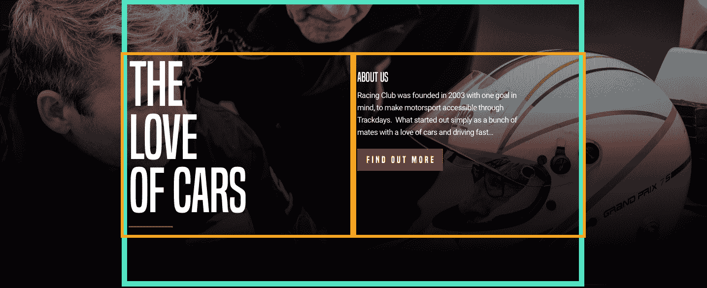

我们需要做的是:

*   使内容垂直居中
*   在左边对齐文字
*   有一个背景图像覆盖整个部分

如前所述，垂直对齐元素的最佳方法是使用 CSS flexbox。

让我们创建 HTML。 在我们的`blog`部分之后，我们将添加我们的`about-us`部分:

```html
<section id="about-us">

</section>
```

在这一部分，像往常一样，我们将添加我们的`container`:

```html
<section id="about-us">
          <div class="container">

          </div>
</section>
```

在我们的容器中，我们将创建两个 block，它们将包含我们的大标题和描述:

```html
<section id="about-us">
  <div class="container">
    <div class="about-us-title">
        <h3>The love of cars</h3>
    </div>
    <div class="about-us-desc">
      <h4>About us</h4>
      <p>Racing Club was founded in 2003 with one goal in mind, to make motorsport accessible through Trackdays. What started out simply as a bunch of mates with a love of cars and driving fast… </p>
      <button type="button" name="button" class="btn-primary">Learn more</button>
    </div>
  </div>
</section>
```

让我们保存并跳转到我们的 CSS 文件:

1.  首先，锁定我们的 about section ID:

```html
#about-us {

}
```

2.  为我们的部分添加背景图像:

```html
#about-us {
  width: 100%;
  background-image: url(img/about-us-bg.jpg);
  background-repeat: no-repeat;
  background-size: cover;
  padding: 120px 0;
  color: white;
}
```

我们使用的 CSS 属性与之前在 hero 部分使用的相同。 添加了一些填充，以保持与设计相似。 我们在父级设置颜色，所以我们不需要在每个子元素中设置颜色。

3.  设置 flexbox 在`container`:

```html
#about-us .container {
  display: flex;
  align-items: top;
}
```

`align-items: top;`将从`top`对齐文本，就像在设计中一样。

4.  现在我们必须在容器内设置 block 的`width`; 否则，flexbox 将无法工作:

```html
.about-us-title {
  width: 50%;
}

.about-us-desc {
  width: 50%;
}
```

让我们保存并检查设计:

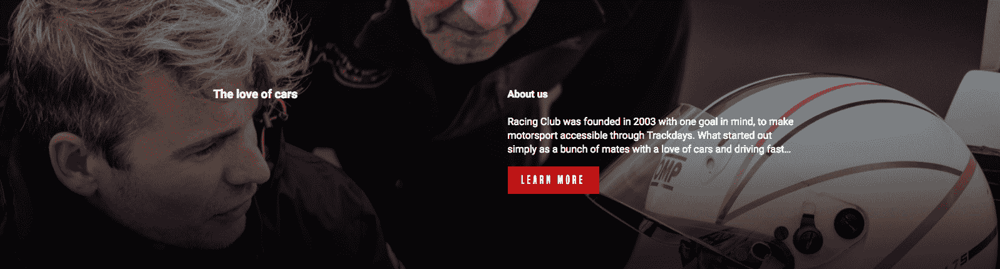

到目前为止，一切顺利; 我们的方向是对的。 让我们为标题和描述添加一些样式。

5.  为标题添加样式:

```html
.about-us-title h3 {
  font-family: 'built_titling', Helvetica, sans-serif;
  font-weight: 400;
  font-size: 120px;
  line-height: 1;
  letter-spacing: -1px;
  margin: 0;
}
```

默认情况下，必须添加`margin: 0`，因为每个`h`标题在文本大小之后都有一个边距。 让我们再次检查:

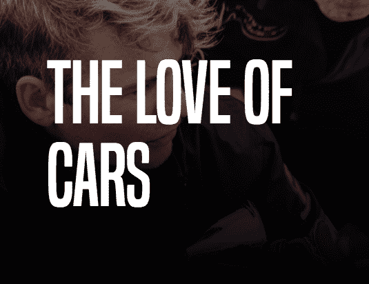

我们已经很接近了，但是我们仍然需要在我们的实现中更加精确:

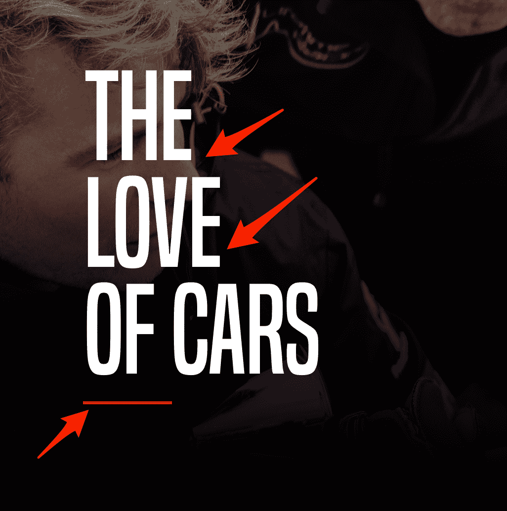

我们可以看到在我们的设计中，标题底部有一些换行符和一条红线。

为此，我们需要在 HTML 中添加一些换行符。 要在 HTML 中添加换行符，我们可以在任何文本块中使用标记`<br />`。 所以在标题中，我们将在`The`和`love`之后添加一个`<br />`标签:

```html
<h3>The<br /> love<br /> of cars</h3>
```

现在，要添加红线，我们可以创建一个`<div>`并将其定制为我们想要的形状和颜色。 但它会在 HTML 中添加一些无用的东西。

更好的方法是在 CSS 中使用`::before/:: after`选择器。 这个选择器可以在 HTML 元素之前或之后添加一些文本。

它主要用于在段落之后添加额外的文本，但我们将使用它来添加这条红线。

为此，我们必须选择`h3`元素并添加`::after`:

```html
.about-us-title h3::after {

}
```

对于每个`::after`或`::before`选择，我们需要添加 CSS 属性`content`:

```html
.about-us-title h3::after {
  content: "";
}
```

我们将该值留空，因为我们不需要任何文本。 继续:

```html
.about-us-title h3::after {
  content: "";
  display: block;
  background: #BF0000;
  width: 90px;
  height: 2px;
  margin-top: 30px;
}
```

我们所做的:

*   我们将`display`设置为`block`，因为它默认是内联的
*   我们添加了红色背景和尺寸
*   我们添加了边距以在文本和红线之间保留一些空间

我们几乎集。 我们有一个最后的润色添加到我们的描述标题:

```html
.about-us-desc h4 {
  font-family: 'built_titling', Helvetica, sans-serif;
  font-weight: 400;
  font-size: 26px;
  line-height: 1;
  margin: 0;
}
```

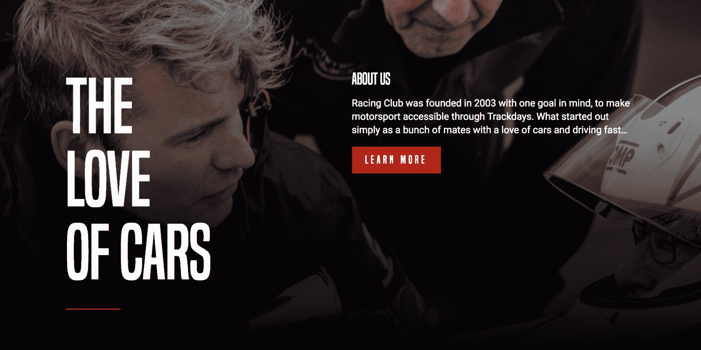

`ABOUT US`部分的最终 CSS 代码如下:

```html
/* ABOUT US SECTION */

#about-us {
  width: 100%;
  background-image: url(img/about-us-bg.jpg);
  background-repeat: no-repeat;
  background-size: cover;
  padding: 120px 0;
  color: white;
}

#about-us .container {
  display: flex;
  align-items: top;
}

.about-us-title {
  width: 50%;
}

.about-us-title h3 {
  font-family: 'built_titling', Helvetica, sans-serif;
  font-weight: 400;
  font-size: 120px;
  line-height: 1;
  letter-spacing: -1px;
  margin: 0;
}

.about-us-title h3::after {
  content: "";
  display: block;
  background: #BF0000;
  width: 90px;
  height: 2px;
  margin-top: 30px;
}

.about-us-desc {
  width: 50%;
}

.about-us-desc h4 {
  font-family: 'built_titling', Helvetica, sans-serif;
  font-weight: 400;
  font-size: 26px;
  line-height: 1;
  margin: 0;
}

/* END ABOUT US SECTION */
```

# 添加伙伴部分

让我们像上一节一样高效地过一遍这一节。

请看以下内容:

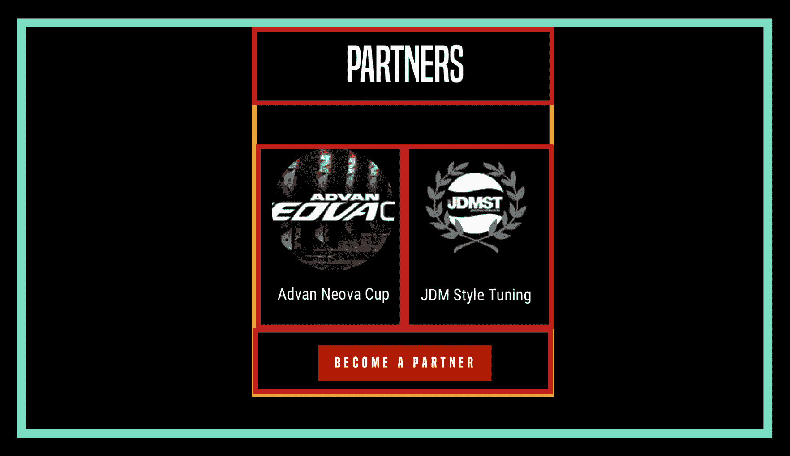

这个部分只包含一个标题、两个图像、文本和一个按钮。 我们需要在通常的容器中创建一个块(如橙色所示)。

HTML:

```html
<section id="partners">

</section>
```

从我们命名为`partners`的`section`标签和`id`开始:

```html
<section id="partners">
  <div class="container">
  </div>
</section>
```

像往常一样，我们需要我们的 div`"container"`来维护我们的结构:

```html
<section id="partners">
  <div class="container">
    <div class="partners-container">
    </div>
  </div>
</section>
```

在内部，我们创建另一个容器`"partners-container"`:

```html
<section id="partners">
  <div class="container">
    <div class="partners-container">

      <h2>Partners</h2>

      <div class="partners-inner">

        <div class="partner">
          
          <p>Advan Neova Cup</p>
        </div>

        <div class="partner">
          
          <p>JDM Style Tuning</p>
        </div>

      </div>

      <button type="button" name="button" class="btn-primary">Become a partner</button>
    </div>
  </div>
</section>
```

在我们的`"partners-container"``div`中，我们做以下工作:

*   我们将标题放入`h2`
*   我们还创建了另一个 div`"partners-inner"`来保存两个合作伙伴的图像
*   在这个`partner-inners div`中，我们有我们的单个伙伴`div`，每个伙伴有一个图像和一个文本
*   我们还添加了一个按钮，在`partners-inner`外，`"partners-container"`内

我们的 CSS 看起来是这样的:

```html
#partners {
  background-color: black;
  color: white;
  text-align: center;
  padding: 50px 0px;
}
```

下面是一些代码的解释:

1.  背景是`black;`，因为在设计中，我们有一个黑色的背景
2.  我们可以将`color:white;`放在父元素中，这样里面的所有元素都将具有相同的属性
3.  `text-align:center;`我们也可以这样做。
4.  我们还在顶部和底部添加了一些填充

```html
.partners-container {
  max-width: 400px;
  margin: 0 auto;
}
```

我们添加了`max-width`和`margin: 0 auto;`作为`partners-container`的中心。 要使任何内容与`margin: auto`方法对齐，你总是需要为元素定义一个宽度:

```html
.partners-container h2 {
  font-family: 'built_titling', Helvetica, sans-serif;
  font-weight: 400;
  font-size: 60px;
}
```

同时，添加以下 CSS:

```html
.partners-inner {
  display: flex;
  margin: 30px 0px;
}

.partners-inner .partner {
  width: 50%;
}
```

为了能够使用`display:flex;`，我们需要为子元素设置`width`。

合伙人部分的内容已经讲完了; 让我们把它保存起来看看:

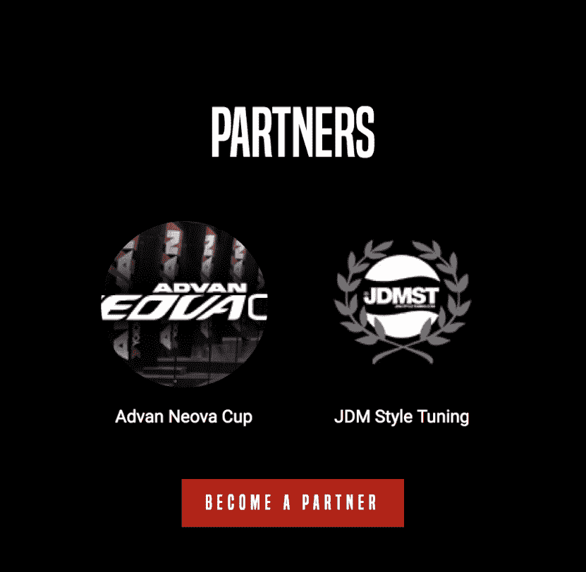

我们最终的 CSS 代码的伙伴部分如下:

```html
/* PARTNERS SECTION */

#partners {
  background-color: black;
  color: white;
  text-align: center;
  padding: 50px 0px;
}

.partners-container {
  max-width: 400px;
  margin: 0 auto;
}

.partners-container h2 {
  font-family: 'built_titling', Helvetica, sans-serif;
  font-weight: 400;
  font-size: 60px;
  line-height: 1;
}

.partners-inner {
  display: flex;
  margin: 30px 0px;
}

.partners-inner .partner {
  width: 50%;
}

/* END PARTNERS SECTION */
```

全部完成! 让我们进入最后一步，页脚!

# 添加页脚部分

在本节中，我们将研究页脚部分。


页脚和页眉基本上是一样的，所以为了便于编码，我们将简单地从页眉复制和粘贴代码，并更改一些事情:

```html
<header>
  <a id="logo" href="/"></a>
  <ul class="main-nav">
    <li><a href="upcoming.html">Upcoming events</a></li>
    <li><a href="past.html">Past events</a></li>
    <li><a href="faq.html">FAQ</a></li>
    <li><a href="about.html">About us</a></li>
    <li><a href="blog.html">Blog</a></li>
    <li><a href="contact.html">Contact</a></li>
  </ul>
  <ul class="right-nav">
    <li><a href="login.html">Login</a></li>
    <li><a href="#"><iframe src="https://www.facebook.com/plugins/like.php?href=http%3A%2F%2Ffacebook.com%2Fphilippehongcreative&width=51&layout=button&action=like&size=small&show_faces=false&share=false&height=65&appId=235448876515718" width="51" height="20" style="border:none;overflow:hidden" scrolling="no" frameborder="0" allowTransparency="true"></iframe></a></li>
  </ul>
</header>
```

以下是我们需要改变的地方:

*   将`<header>`标签更改为`<footer>`标签
*   在我们的页脚中添加一个`.container``div`来跟随网格
*   更改我们的 logo 形象为`"logo-footer.png"`

这是最终的 HTML:

```html
<footer>
  <div class="container">
    <a id="logo" href="/"></a>
    <ul class="main-nav">
      <li><a href="upcoming.html">Upcoming events</a></li>
      <li><a href="past.html">Past events</a></li>
      <li><a href="faq.html">FAQ</a></li>
      <li><a href="about.html">About us</a></li>
      <li><a href="blog.html">Blog</a></li>
      <li><a href="contact.html">Contact</a></li>
    </ul>
    <ul class="right-nav">
      <li><a href="login.html">Login</a></li>
      <li><a href="#"><iframe src="https://www.facebook.com/plugins/like.php?href=http%3A%2F%2Ffacebook.com%2Fphilippehongcreative&width=51&layout=button&action=like&size=small&show_faces=false&share=false&height=65&appId=235448876515718" width="51" height="20" style="border:none;overflow:hidden" scrolling="no" frameborder="0" allowTransparency="true"></iframe></a></li>
    </ul>
  </div>
</footer>
```

让我们跳到 CSS。 我们首先要瞄准我们的`footer`:

```html
footer {
  background: black;
  color: white;
}
```

我们调用没有任何点或`#`的`footer`，因为我们只调用标记本身。 它还意味着将选择每一个其他的`footer`标签。 因此，我们需要确保只为`footer`元素选择标记`footer`。

我们添加了一个黑色的背景，就像它在设计中一样，但也在父级添加了一个`color:white`。 我们很懒，我们不想每次都添加。

```html
footer .container {
  display: flex;
  height: 120px;
}
```

这变得很有趣; 现在我们已经将`footer`中的`.container`作为目标，并将其属性更改为`flex`，这样我们就可以内联显示这些元素了。

我们不打算为每个子元素指定宽度因为我们希望它们占用足够的空间。

最后，我们将为 logo 添加一些填充，使其与菜单对齐:

```html
footer .logo {
  padding-top: 20px;
}

footer .main-nav li, footer .right-nav li {
  list-style-type: none;
  display: inline-block;
}

footer .main-nav li a, footer .right-nav li a {
  color: white;
  text-decoration: none;
  font-family: 'built_titling', Helvetica, sans-serif;
  font-weight: 200;
  font-size: 20px;
  letter-spacing: 4px;
  padding: 0px 15px;
}
```

我们还从`header`借鉴了一些样式，并复制到这里:


现在我们完成了页脚!

这是最后的 CSS 代码:

```html
/* FOOTER SECTION */

footer {
  background: black;
  color: white;
}

footer .container {
  display: flex;
  height: 120px;
}

footer .logo {
  padding-top: 20px;
}

footer .main-nav li, footer .right-nav li {
  list-style-type: none;
  display: inline-block;
}

footer .main-nav li a, footer .right-nav li a {
  color: white;
  text-decoration: none;
  font-family: 'built_titling', Helvetica, sans-serif;
  font-weight: 200;
  font-size: 20px;
  letter-spacing: 4px;
  padding: 0px 15px;
}

/* END FOOTER SECTION */
```

# 总结

总结一下我们到目前为止所做的工作:我们从零开始创建了一个网页，并使用 HTML 样板来启动我们的项目。 我们已经学习了大量的 CSS 技术，特别是关于 CSS flexbox 的技术，这是非常有用的

在下一章中，我们将处理 CSS 的响应端，并为我们的网站添加一些交互性。 让我们开始吧!