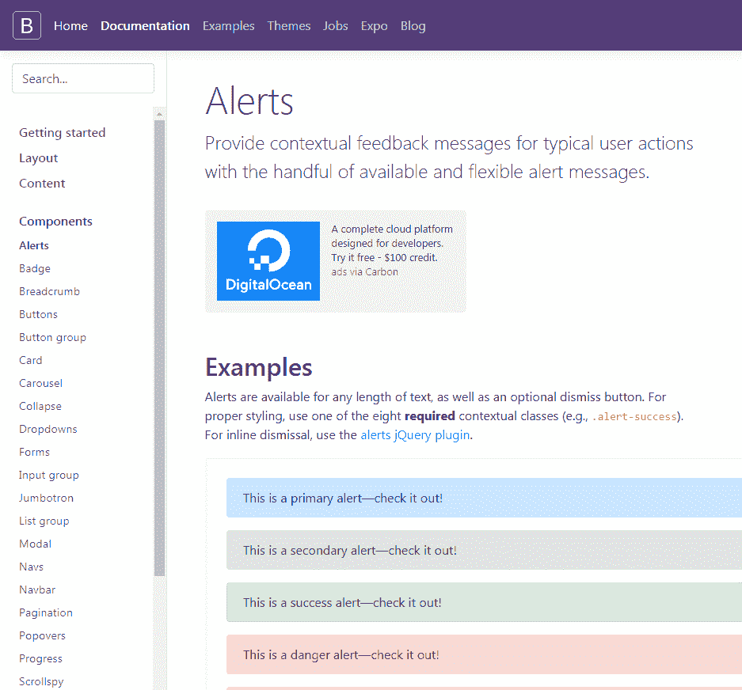
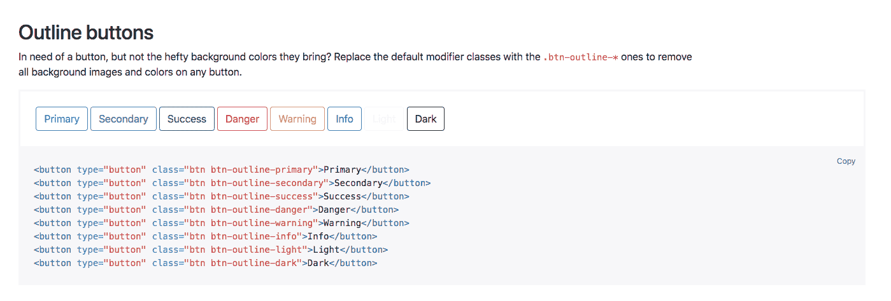
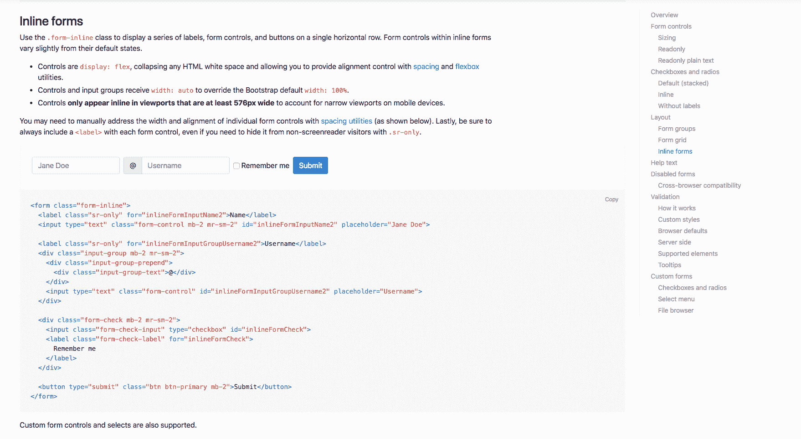
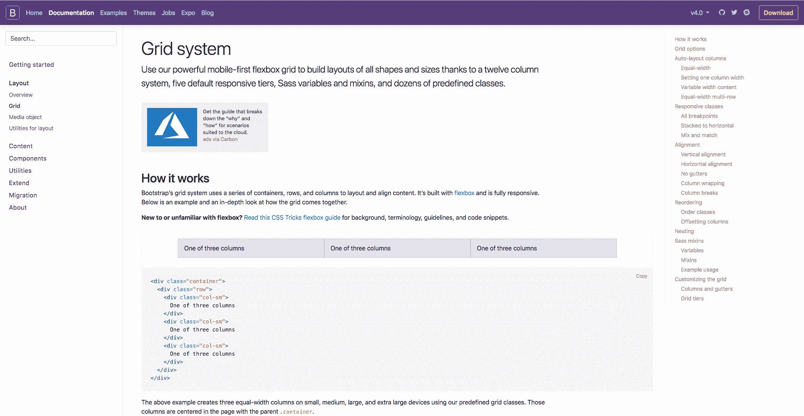

# 十一、Bootstrap是什么?

现在我们知道如何从零开始建立一个网站，我想向您介绍 Bootstrap([https://getbootstrap.com/](https://getbootstrap.com/))。

在本章中，我们将:

*   了解 Bootstrap 是什么以及为什么开发者喜欢它
*   浏览 Bootstrap 的文档并了解如何使用它
*   拿到著名的Bootstrap 网格
*   了解 Bootstrap 如何使用媒体查询

# Bootstrap是什么?

Bootstrap 是一个开源的 HTML, CSS 和 JS 库，帮助您构建网站和应用非常容易。 它是一个可以重用的组件库，而不是一遍又一遍地重新创建每个组件。 Bootstrap 首先具有响应性和可移动性; 这就是 Bootstrap 的本质，也是它在 web 开发者中如此流行的原因。 现在，假设开发者正在为不同的设备创建不同版本的网站; 只需在页面上应用少量代码，网站就可以在任何设备上正确显示，这节省了时间和额外的成本。

每隔几年就会有重大的更新。 Bootstrap 2 在 2012 年正式发布，然后很快被 2013 年发布的 Bootstrap 3 所取代。 然后，当然，2016 年出现了 Bootstrap 4。 它变得越稳定，两次释放之间的间隔就越长。 希望在 Bootstrap 5 到来之前不会太久。

Bootstrap 4 仍然很新，所以很多开发者仍然在使用 Bootstrap 3:

Bootstrap website

在这个框架中，还有大量的元素和组件可以在站点或页面中使用。 文档选项卡中的一切都是必要的; 它包含了你可以回头参考的宝贵信息，也是你想去了解新元素或组件的地方:

Bootstrap documentation

它从介绍 Bootstrap 开始，包括开始时所需的所有信息。 然后，在左侧，它提供了所有的节和组件。 这可能是您将看到的最受欢迎的部分之一，因为它包含了您可以在 Bootstrap 中使用的所有不同元素。 因此，从本质上说，这可以帮助您构建页面。

Bootstrap 在 examples 选项卡中也提供了一些示例或快速启动示例。 这些都是在你完成本章后进行实践或测试的想法，所以你可以把你的新想法放到自己的页面上，测试你在本章中学到的东西:

Bootstrap Examples.

它值得收藏这个页面或在未来回到这里。 现在，另一个需要关注的重要部分是 Bootstrap 博客; 这是所有更新发布的地方，无论大小。 因此，最好密切关注它，以防发生一些可能对您的站点产生影响的变化。

简而言之，这只是 Bootstrap 站点的一个快速概述。 值得将组件页面添加到书签中，以便将来需要时可以快速地查阅。 接下来，我们将进一步了解这些组件是什么，以及如何使用它们。

# 组件

让我们看一下我们的 Bootstrap 文档([https://getbootstrap.com/docs/4.0/getting-started/introduction/](https://getbootstrap.com/docs/4.0/getting-started/introduction/))，更具体地说，是组件部分。 它位于文档标签上，包含了很多元素，你将使用 Bootstrap 编码你的网站:

Bootstrap components

这些都是按字母顺序排列的，所以你可以很容易地找到你需要的东西。 例如，如果我们只是看一下按钮，这提供了所有你需要知道的启动按钮在 Bootstrap。 默认按钮有自己的样式类; 我们可以看到这里有主要的，次要的，成功，危险，警告，信息，光明，黑暗和链接:

Bootstrap buttons

要向页面添加任何这些按钮，您可以使用这里提供的代码，或者如果您想要按钮的大纲，例如，如果我们向下滚动，您可以看到大纲按钮也有自己的类。 你只需要添加以下代码来添加一个大纲按钮:

Bootstrap Outline buttons

如果我们继续向下滚动，您可以看到有许多不同的按钮选项。 当然，您可以添加一个标准按钮，然后自己手动启动它，但这些示例是一个很好的方法，可以让页面上的按钮快速启动和运行。

显然，按钮并不是那么令人兴奋; 这只是一个例子，说明了 Bootstrap 中有多少细节，以及在 Bootstrap 中编码时有多少支持。 让我们看另一个例子，比如表单。 所有表单内容都在右边。 例如，让我们点击内联表单; 我们可以看到所有描述内联表单选项的信息，但也可以看到你需要添加到页面的代码:

Inline forms

如果你选择另一个，例如，导航栏，这显示了所有不同的选项，你可以使用时，添加导航栏到你的页面。 它从基础开始，然后声明导航条需要一个导航条类，它的流体默认。 这只是意味着它们拉伸了整个页面的宽度。 然后，它继续描述了导航栏的不同元素，包括添加你的品牌，不同的配色方案，以及如何让你的导航栏响应。 有很多信息可以帮助您在需要时快速启动并运行。 如果你想的话，请随意看看这些组件。 当然也值得把这个页面收藏起来以备将来使用。

在开始构建页面时，我们显然会深入了解更多细节。 接下来，我们将继续，看看Bootstrap 网格系统。

# Bootstrap 网格系统

Bootstrap 如此受欢迎的一个主要原因是该框架的响应性。 Bootstrap 建立在一个网格系统上，它基于一组 12 列。 如果你直接进入 Bootstrap 网站的文档，然后进入布局部分，然后进入网格部分，我们可以更仔细地观察:

Bootstrap Grid

Bootstrap 包含三个不同的组件; 它们是列、容器和行。 从本质上讲，容器保存内容，行对齐内容，列规定内容如何沿着该行拆分。 如果这没有意义，不要太担心，因为你没有网格系统的经验; 当你通过你的方式通过这一章并获得实践经验时，一切都会变得清晰起来。 为了给出关于网格系统的最佳示例，我们可以看一下下一页中的响应式类部分。 我觉得这是对网格系统的最好解释:

Responsive class in Bootstrap

有五层预定义的类用于构建复杂的响应式布局。 在这个示例中，我们可以看到正在使用新的`col`类。 这意味着在这一行中，我们在同一行有四列，每个元素在 12 列的行中占据特定数量的列。

在第一种情况下，每个元素沿着 12 列的行占据三列，即 3 除 12 四次。 这种布局在所有设备上都是一样的，从非常小到非常大。 如果您愿意，还可以定义要在一行中占据的列数，在本例中是在第二行。

因此，第一点内容将占据`8`列，下一点内容将占据`4`列。 同样，这将沿行填充整个 12 列，不管屏幕大小是多少。 Bootstrap 之所以如此受欢迎，是因为它的响应性，而且某些元素是堆叠在较小的设备上的，它们在较大的设备上是沿着一行对齐的。 为此，我们只需要在列类中定义设备大小:

Responsive feature

在下一个示例中，您可以看到，通过使用`sm`类或小类，内容是相似的，因为我们在顶部有`8`和`4`，然后将下一行切换为三个部分。 然而，在实际的例子中，这两个内容实际上会堆叠在较小的设备上，当断点到达较小设备上方的任何位置时，它将沿行显示。 在这个页面中有很多关于 Grid 系统的信息，但是，正如我提到的，在我们阅读本章的过程中，您很快就会习惯它的工作方式。

我希望这能稍微解释一下 Grid 系统，但是，正如我所说的，在下一章中通过使用它，您很快就会掌握它的窍门。 接下来，我们将看看 Bootstrap 媒体查询。

# 媒体查询

关于 Bootstrap 最好的事情之一是，你可以把媒体查询合并到你的 CSS 文件中，这本质上让你开始特定的项目或断点，并帮助你针对特定设备的样式。 如果您首先转到 Documentation 选项卡，然后转到布局部分，那么我们只需要稍微向下滚动到响应式断点部分。 我们可以在这里看到我们的媒体查询。 我们可以看到断点是很重要的，因为这些通常被用作查询的指导方针，所以你可以决定你想要的样式为哪个设备:

Responsive breakpoint

在代码的第一部分中，我们对除额外小设备外的所有断点进行了媒体查询。 这将使用`min-width`命令。 如果我们稍微向下滚动，可以看到除了超大型设备之外的所有断点，这些设备使用`max-width`命令。 两者的区别在于，如果你首先针对移动设备进行设计，你倾向于使用`min-width`选项;如果你首先针对桌面设备进行设计，你倾向于使用`max-width`选项:

max-width command

一般来说，我倾向于使用`max-width`，而且我倾向于首先针对桌面进行设计; 最好能够理解这两方面的内容，以防你需要先针对手机平台进行设计。

这是对媒体查询的简单介绍; 随着课程的进行，你们会对它有更好的理解，但我希望这能解释一些东西这样当我们讲到的时候你们就能有一个基本的理解。

# 总结

在本章中需要记住的要点是 Bootstrap 就像一个组件库，开发者可以很容易地重用它。 通过了解它们(网格、组件)。 媒体查询)，你将能够取得很多比当你从零开始建立网站。

接下来，我们将继续使用 Bootstrap 设计我们的页面，一步一步地学习如何使用它。