# 二、基础知识的掌握

本章将掌握盒子型号、浮动故障排除定位和显示器类型。学完这一章，你会更加了解 HTML 和 CSS 的基础。

在本章中，我们将涵盖以下主题:

*   获得关于传统箱式模型的知识
*   浮动元素基础
*   网页上定位元素的基础
*   了解显示类型

# 传统箱型

对盒模型的理解是 CSS 理论的基础。您必须知道宽度、高度、边距和边框对盒子大小的影响，以及如何管理它以匹配网站上的元素。程序员和前端开发人员在采访中的主要问题是基于盒子模型理论。让我们开始这重要的一章，这将是每一个即将到来的主题的基础。

## 填充/边距/边框/宽度/高度

盒子最终宽度和高度的成分如下:

*   宽度
*   高度
*   利润
*   填料
*   边界

为了更好地理解盒子模型，以下是来自谷歌 Chrome 检查器的图片:

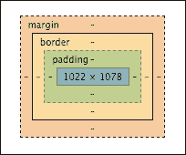

为了更清楚和更好地理解盒子模型，让我们分析以下图像:


在上图中，您可以看到在盒子模型中，我们有以下四条边:

*   内容边缘
*   填充边缘
*   边框边缘
*   边缘边缘

盒子的宽度和高度基于以下内容:

*   内容的宽度/高度
*   填料
*   边境
*   边缘

默认框大小的框中内容的宽度和高度由以下属性控制:

*   最小宽度
*   最大宽度
*   宽度
*   最小高度
*   最大高度
*   高度

盒子模型的一个重要方面是背景属性将如何表现。背景将包含在内容部分和填充部分(到填充边缘)。

让我们获取一个代码，并尝试指向盒子模型的所有元素。

HTML 代码:

```html
<div class="element">
  Lorem ipsum dolor sit amet consecteur
</div>
```

CSS 代码:

```html
.element {
   background: pink;
   padding: 10px;
   margin: 20px;
  width: 100px;
  height: 100px;
   border: solid 10px black;
}
```

在浏览器中，我们会看到以下内容:


谷歌 Chrome 的检查器的视图如下:

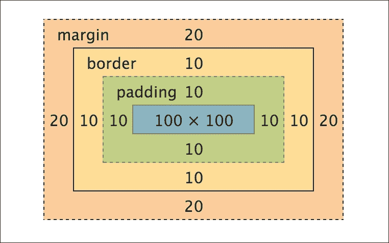

我们来看看在下面的具体例子中盒子模型的区域是如何放置的:

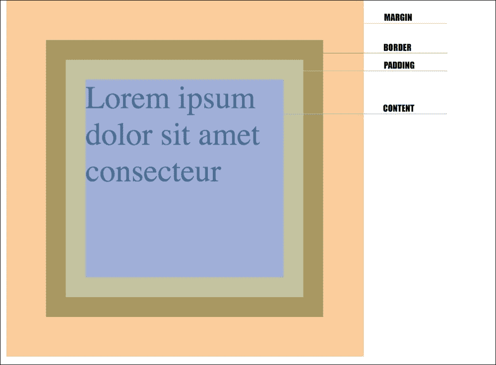

被采访的前端开发人员的基本任务是:

框/元素用以下样式描述:

```html
.box {
    width: 100px;
    height: 200px;
    border: 10px solid #000;
    margin: 20px;
    padding: 30px;
}
```

请统计这个元素的最后`width`和`height`(这个元素需要的真实空间)。

所以，如你所见，问题是计算盒子的宽度和高度。

*宽度的配料*如下:

*   宽度
*   左边界
*   右边框
*   左填充
*   向右填充

另外为盒子所占空间的宽度:

*   左边距
*   右边距

*身高的成分*如下:

*   高度
*   边框顶部
*   边框底部
*   填充顶部
*   填充底部

此外，盒子占据的空间高度:

*   上边距
*   边距底部

因此，当您对元素求和时，您将得到以下等式:

宽度:

```html
Box width = width + borderLeft + borderRight + paddingLeft + paddingRight
Box width = 100px + 10px + 10px + 30px + 30px = 180px
```

空间宽度:

```html
width = width + borderLeft + borderRight + paddingLeft + paddingRight +  marginLeft + marginRight 
width = 100px + 10px + 10px + 30px + 30px + 20px + 20 px = 220px
```

高度:

```html
Box height = height + borderTop + borderBottom + paddingTop + paddingBottom
Box height  = 200px + 10px + 10px + 30px + 30px = 280px
```

空间高度:

```html
Space height = height + borderTop + borderBottom + paddingTop + paddingBottom +  marginTop + marginBottom
Space height = 200px + 10px + 10px + 30px + 30px + 20px + 20px = 320px
```

可以在真实浏览器中勾选，如下图所示:

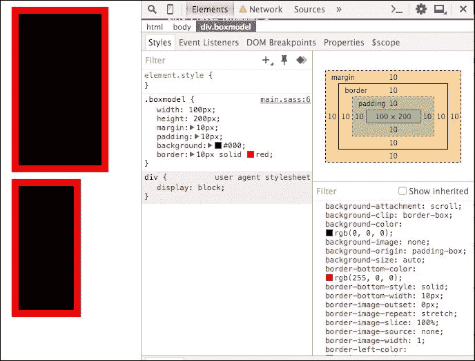

## 省略传统盒子模型的问题(盒子大小)

盒子模型的基础理论相当难学。你需要记住宽度/高度的所有元素，即使你设置了宽度和高度。对于初学者来说，最难理解的是填充，它不应该被算作宽度和高度的组成部分。应该是盒子里面的*，应该会对这个数值有影响。为了用 CSS3 改变这些行为，从 Internet Explorer 8 开始就支持的，是盒子大小。*

您可以按如下方式设置该值:

```html
box-sizing: border-box
```

它给了你什么？最后，计算盒子的宽度和高度会更容易，因为盒子的填充和边框都在盒子里面。所以如果我们在上一节课:

```html
.box {
    width: 100px;
    height: 200px;
    border: 10px solid #000;
    margin: 20px;
    padding: 30px;
}
```

我们可以很容易地计算宽度和高度:

```html
Width = 100px
Height = 200px
```

此外，盒子占据的空间:

*   空间宽度= 140 像素(因为 20 像素的边距在左右两侧)
*   空间高度= 240 像素(因为 20px 的边距在顶部和底部的两侧)

以下是谷歌 Chrome 的一个示例:

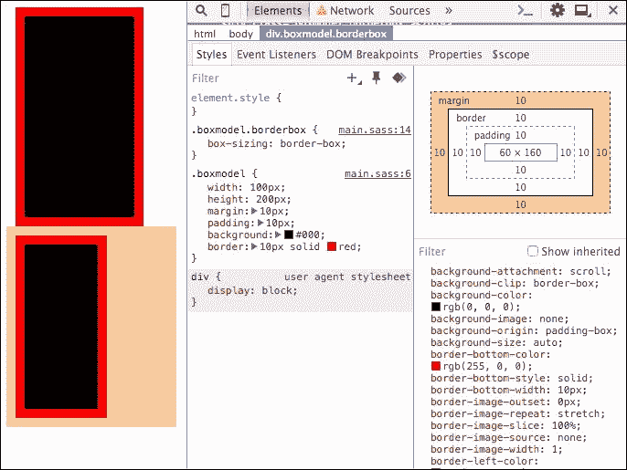

因此，如果您不想重复传统盒子模型的所有问题，您应该对所有元素全局使用它。当然，不建议老项目使用，比如一个新客户需要对老项目做一些小的改动。如果添加以下代码:

```html
* {
width: 100px;
}
```

由于这个属性对所有元素的继承，你可能会弊大于利，现在是基于传统的盒子模型。但是对于所有的新项目，你应该使用它。

# 浮动元素

浮动框是现代布局中使用最多的。浮动框理论特别用于网格系统和 CSS 框架中的内嵌列表。例如，类和 mixin 内联列表(在 Zurb Foundation 框架中)是基于浮点的。

## 浮动元素的可能性

元素可以左右浮动。当然，也有一种重置浮动的方法。可能的值如下:

```html
float: left; // will float element to left
float: right; // will float element to right
float: none; // will reset float 
```

## 最常见的浮动问题

当使用浮动元素时，会出现一些问题。浮动元素最常见的问题如下:

*   元素太大(因为宽度、左边距/右边距、左边距/右边距，以及基于盒子模型的错误计算的宽度)
*   未清除的浮动

所有这些问题都提供了特定的效果，你可以很容易地识别出来，然后修复。

太大的元素可以在不在一条线上时被识别出来，这是应该的。您应该首先检查是否应用了框尺寸:边框，然后检查宽度、填充和边距。

当下一个容器的某些元素的浮动结构为*浮动*时，可以很容易地识别出未清除的浮动。这意味着您的浮动容器没有明确的定位。

## 定义明确的修复/类/混合

当我开始开发 HTML 和 CSS 代码的时候，有一个用`.cb`或者`.clear`类清除浮动的方法，这两个类的定义如下:

```html
.clearboth, .cb {
    clear: both
}
```

这个元素是在所有浮动元素之后添加到容器中的。这对于清除浮动很重要，因为包含浮动元素的容器不会继承最高浮动元素的高度(其高度等于`0`，例如:

```html
<div class="container">
    <div class="float">
        … content ...
    </div>
    <div class="float">
        … content ...
    </div>
    <div class="clearboth"></div>
</div>
```

CSS 看起来如下所示:

```html
.float {
    width: 100px;
    height: 100px;
    float: left;
}

.clearboth {
    clear: both
}
```

现在有更好更快的清除漂浮物的方法。您可以使用`clear fix`元素来实现这一点，该元素可以定义如下:

```html
.clearfix:after {
    content: "";
    visibility: hidden;
    display: block;
    height: 0;
    clear: both;
}
```

您可以在 HTML 代码中使用它:

```html
<div class="container clearfix">
    <div class="float">
        ... content ...
    </div>
    <div class="float">
        ... content ...
    </div>
</div>

</div>
```

打开`clear fix`的主要原因是保存一个标签(用`clearboth`类)。推荐的用法基于`clear fix`混合，您可以在 SASS 中定义如下:

```html
=clear fix
&:after
    content: ""
    visibility: hidden
    display: block
    height: 0
    clear: both
```

因此，每次需要清除某个容器中的浮动时，都需要调用它。例如，让我们采用前面的代码:

```html
<div class="container">
<div class="float">
        … content ...
</div>
<div class="float">
        … content ...
</div>
</div>
```

该容器可描述如下:

```html
.container
  +clear fix
```

## 使用浮动元素的示例

浮动元素最常见的用法是网格。网格主要用于结构化网页上显示的数据。在这一章中，让我们检查一个网格的简短草稿。在接下来的章节中，我们将重点关注用 mixins 创建网格的自动化。

让我们创建一些 HTML 代码:

```html
<div class="row">
    <div class="column_1of2">
        Lorem
    </div>
    <div class="column_1of2">
        Lorem
    </div>

</div>
<div class="row">
    <div class="column_1of3">
        Lorem
    </div>
    <div class="column_1of3">
        Lorem
    </div>
    <div class="column_1of3">
        Lorem
    </div>

</div>

<div class="row">
    <div class="column_1of4">
        Lorem
    </div>
    <div class="column_1of4">
        Lorem
    </div>
    <div class="column_1of4">
        Lorem
    </div>
    <div class="column_1of4">
        Lorem
    </div>
</div>
```

并且还创建了一些 SASS 代码:

```html
*
  box-sizing: border-box

=clear fix
&:after
    content: ""
    visibility: hidden
    display: block
    height: 0
    clear: both

.row
  +clear fix

.column_1of2
  background: orange
  width: 50%
  float: left

&:nth-child(2n)
    background: red

.column_1of3
  background: orange
  width: (100% / 3)
  float: left

&:nth-child(2n)
    background: red

.column_1of4
  background: orange
  width: 25%
  float: left

&:nth-child(2n)
    background: red
```

最终效果如下:

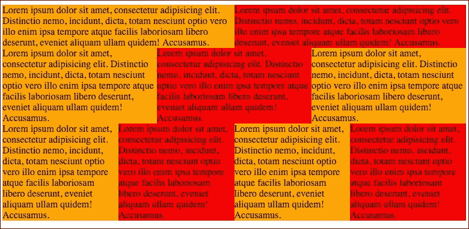

正如你看到的，我们创建了一个基本网格的结构。在放置 HTML 代码的地方`Lorem`这里有一个完整的`lorem ipsum`来说明网格系统。

# 显示类型

CSS 中有少数显示类型，其定义和行为是前端开发人员的基础。最常见和最基本的显示值如下:

*   在一条直线上的
*   街区
*   内嵌块
*   表格/表格单元格
*   Flex(这将在本书中进一步描述)

## 阻挡元素

块元素总是从新的一行开始。块元素最重要的属性是宽度和高度，可以从 CSS 代码中更改。为了更好地理解，让我们查看下面的截图:


很容易看出，所有的块元素都尽可能多地采用宽度。

主要使用的 HTML 块级元素如下:

*   `address`
*   `article`
*   `aside`
*   `blockquote`
*   `canvas`
*   `div`
*   `footer`
*   `form`
*   `h1`、`h2`、`h3`、`h4`、`h5`、`h6`
*   `header`
*   `main`
*   `nav`
*   `ol`
*   `output`
*   `p`
*   `pre`
*   `section`
*   `table`
*   `ul`
*   `video`

## 内联元素

内联元素可以被描述为需要多少空间就占用多少空间的元素。使用以下图像可以最好地描述它:

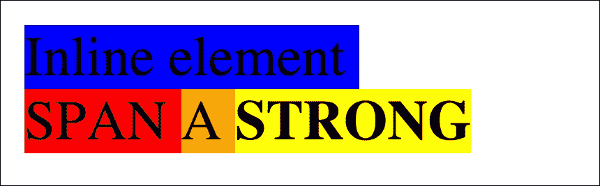

主要使用的 HTML 内联级元素如下:

*   `acronym`
*   `cite`
*   `code`
*   `dfn`
*   `strong`
*   `samp`
*   `var`
*   `a`
*   `bdo`
*   `br`
*   `img`
*   `map`
*   `object`
*   `script`
*   `span`
*   `sub`
*   `sup`
*   `button`
*   `input`
*   `label`
*   `select`
*   `textarea`

## 直列块显示

内嵌元素是收集内嵌和块元素属性的元素。内联元素需要占用多少空间就占用多少空间，但是您还可以设置它们的宽度、高度和填充。在下面添加的图像上(在代码列表之后)，您可以看到下面的代码:

```html
<body>
<p> Block element </p>
<span>Inline element</span>
<p class="width300"> Block element width 300 </p>
<span class="width300">Inline element width 300</span>
<span class="width300 dib"> Block element width 300 </span>
</body>
```

用 SASS 代码描述:

```html
p, span
  background: red

&.width300
    width: 300px

.dib
  display: inline-block
```

编译成 CSS:

```html
p, span {
  background: red;
}
p.width300, 
span.width300 {
    width: 300px;
}

.dib {
  display: inline-block;
}
```

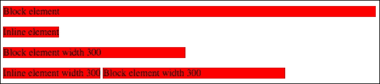

正如你很容易看到的，第一个元素是一个块元素，它尽可能的占据宽度。第二个元素是内联的。第三个是具有设定宽度(300 像素)的块元素。第四个元素以设定的宽度(300 像素)内联，但是它没有应用于这个元素，因为它没有合适的显示类型。此外，最后一个元素是一个跨度，它的正常显示类型是内联的，但在 CSS 中被设置为内联块。在此操作之后，您可以设置元素的宽度，此外，它自然会浮动到上一个内联元素。

## 在哪里可以使用其他类型的元素——导航

与显示类型相关的最常见问题是内嵌导航。为了更好地理解，让我们创建如下标记:

```html
<nav class="main-navigation">
    <ul>
        <li>
            <a href="#">First element</a>
        </li>
        <li>
            <a href="#">Second element</a>
        </li>
        <li>
            <a href="#"> Third element</a>
        </li>
    </ul>
</nav>
```

最简单的方式是用`float:left`将元素做成一行，例如:

```html
.main-navigation
  ul
    +clear fix /* This will prevent problems of cleared float */
    list-style: none

  li
    float: left
```

第二个想法是在`li`元素上使用`display: inline-block`:

```html
.main-navigation
  ul
    list-style: none

  li
    display: inline-block
```

## 哪里可以使用其他类型的元素——等框问题

有一个一个问题，就是在网页上重复，需要追加一些 JavaScript 代码来应用同样的高度。过去有必要这样做。首先测量盒子的高度，然后将较大的高度设置为高度，这将应用于另一个盒子。最后，高度将应用于所有均衡的盒子。

现在，您可以使用表格单元格值进行显示。

HTML 代码:

```html
<div class="equalizer">
    <div class="equalized">
        Lorem ipsum dolor sit amet, consectetur adipisicing elit.
    </div>
    <div class="equalized">
        Lorem ipsum dolor sit amet, consectetur adipisicing elit.
    </div>
    <div class="equalized">
        Lorem ipsum dolor sit amet, consectetur adipisicing elit. Nam, soluta voluptatem accusamus totam possimus corporis inventore consequuntur unde ut deserunt reiciendis quis aspernatur, ea quisquam numquam veniam illo, cum culpa.
    </div>
</div>
```

SASS 代码:

```html
.equalizer
  display: table
  background: orange

.equalized
  display: table-cell
  width: 300px
  background: yellow
```

浏览器中的效果如下所示:


# CSS 元素定位

理解 CSS 中的位置是前端开发人员的关键技能之一。它帮助您更改网页上每个元素的行为。此外，通过混合位置，您可以更改内部(子)元素的行为。

## 静态、相对、绝对、固定–差异

位置静态是位置的默认值，包括网页上的每个元素。

相对位置是使一个元素相对于自身。您可以通过以下代码轻松理解它:

```html
<p>
    Lorem
    <span> ipsum</span>
</p>
```

并创建 SASS:

```html
span
  position: relative
  top: -10px
```

在添加样式之前，您应该看到如下所示:

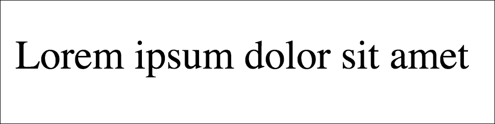

在中，添加样式后，您将看到以下内容:


如您所见，当我们将位置更改为`relative`并用属性 top、left、right 或 bottom 移动它时，我们将从它的当前位置移动元素。

此外，相对定位的元素可以设置为绝对位置的内部元素的范围，例如，HTML:

```html
<div class="relative">
    <div class="absolute"></div>
</div>
```

SASS:

```html
.relative
  width: 200px
  height: 200px
  background: orange
  position: relative

.absolute
  width: 40px
  height: 40px
  background: red
  position: absolute
  left: 100px
  top: 30px
```

浏览器中的效果如下图所示:


橙色方框是`.relative`元素。较小的盒子是绝对定位的，与`relative`元素相关。

位置`absolute`可以像前面的例子一样使用。但是当没有父相对元素时会发生什么呢？绝对定位的元素将与 HTML DOM 元素相关联。

*固定*元素严格固定在浏览器上。所以当你把位置:`fixed`应用到任何元素上，给它加上 top: `0`和 left: `0`，这个元素就会卡在浏览器的左上角。即使完成滚动操作，元素也不会改变其与浏览器相关的位置。

下面的代码将向您展示固定元素的行为。

HTML:

```html
<body>
<div class="fixed">
    position: fixed
</div>

<ul>
    <li>Lorem</li>
    <li>Ipsum</li>
    <li>Dolor</li>
    <li>Sit</li>
    <li>Amet</li>
</ul>
</body>
```

SASS:

```html
body
  padding-top: 100px
  background: red

.fixed
  position: fixed
  text-align: center
  top: 0
  left: 0
  height: 100px
  width: 100%
  background: blue

ul
  height: 2000px
```

从前面的代码中可以看到，`body`元素有`padding-top`，等于`.fixed`元素的高度。这是由`fixed`元素引起的，通常当您移除填充`fixed`元素时，它将覆盖`body`内容(它将覆盖该元素)。下面的截图显示了滚动动作前的浏览器，下一个截图显示了滚动动作后的浏览器。两个截图都包含浏览器的边框，以显示正确的滚动动作。

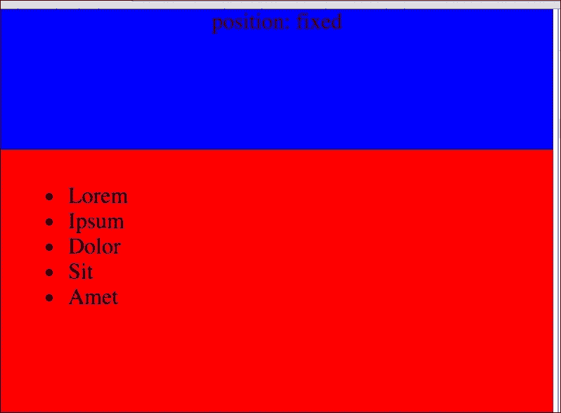


重要属性可以添加到位置为`relative` / `fixed` / `absolute`的元素中，如下所示:

*   左边的
*   对吧
*   顶端
*   底部
*   z 指数

位置编码过程中的一个常见问题是通过应用`right`值来覆盖`left`值。示例代码如下:

```html
.element
  position: absolute
  left: 10px
  right: 20px
```

`.element`仍会停留在其左侧位置。如何将它附加到正确的位置？

```html
.element
  position: absolute
  left: auto
  right: 20px
```

## 带有固定图像(在右侧或左侧)和描述的列表

这是与列表相关的一个非常常见的问题。如果没有`relative`和`absolute`这两个位置，一面有固定图像(宽度和高度固定)一面有弹性内容的文章列表可能会很成问题。下面是一个例子。

HTML:

```html
<article>
    <div class="image">
        
    </div>
    <div class="content">
        <p class="header">Header</p>
        <p class="description">Lorem ipsum dolor sit amet, consectetur adipiscing elit, sed do eiusmod tempor incididunt ut labore et dolore magna aliqua</p>
    </div>
</article>
```

SASS:

```html
*
  box-sizing: border-box

article
  position: relative
  padding: 10px
    left: 220px
  height: 220px
  background: red

  .image
    position: absolute
    left: 10px
    top: 10px
    background: #000
    width: 200px
    height: 200px

  .content
    width: 100%
```

编译后的 CSS 代码:

```html
* {
    box-sizing: border-box;
}

article {
    position: relative;
    padding: 10px;
    padding-left: 220px;
    height: 220px;
    background: red;
}

article .image {
    position: absolute;
    left: 10px;
    top: 10px;
    background: #000;
    width: 200px;
    height: 200px;
}

article .content {
    width: 100%;
}
```

浏览器中的效果如下所示:


浏览器调整大小后的效果如下图所示:

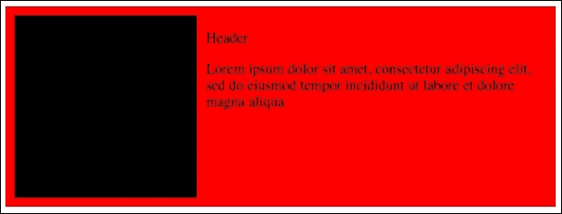

当您想要获得右侧的图像时，您需要进行以下更改:

```html
article
  position: relative
  padding: 10px
    right: 220px // change here
height: 220px
  background: red

  .image
    position: absolute
    right: 10px // change here
top: 10px
    background: #000
    width: 200px
    height: 200px
```

已编译的 CSS:

```html
* {
    box-sizing: border-box;
}

article {
    position: relative;
    padding: 10px;
    padding-right: 220px;
    height: 220px;
    background: red;
}

article .image {
    position: absolute;
    right: 10px;
    top: 10px;
    background: #000;
    width: 200px;
    height: 200px;
}
```

浏览器中的效果如下图所示:

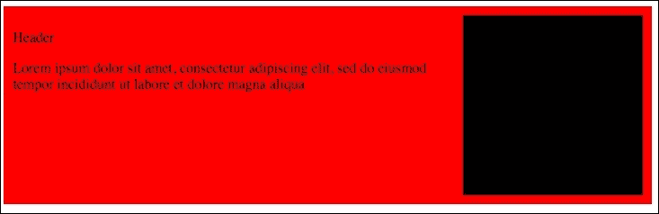

# 总结

本章为 CSS 的专业使用建立了坚实的基础。您收集了关于盒子模型、位置和浮动元素的知识。下一章将是一个关于伪类的故事。