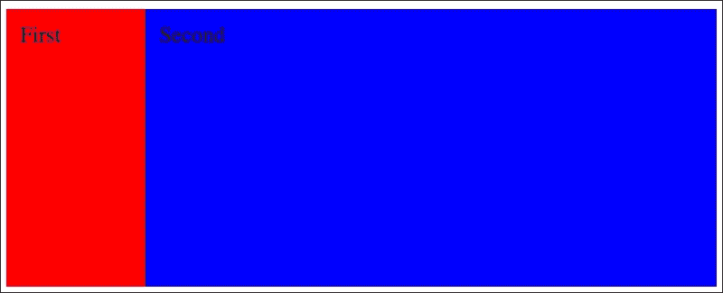
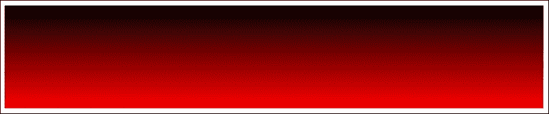
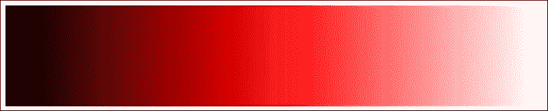
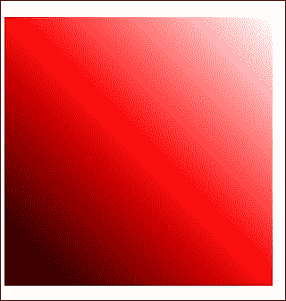
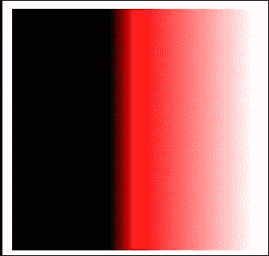
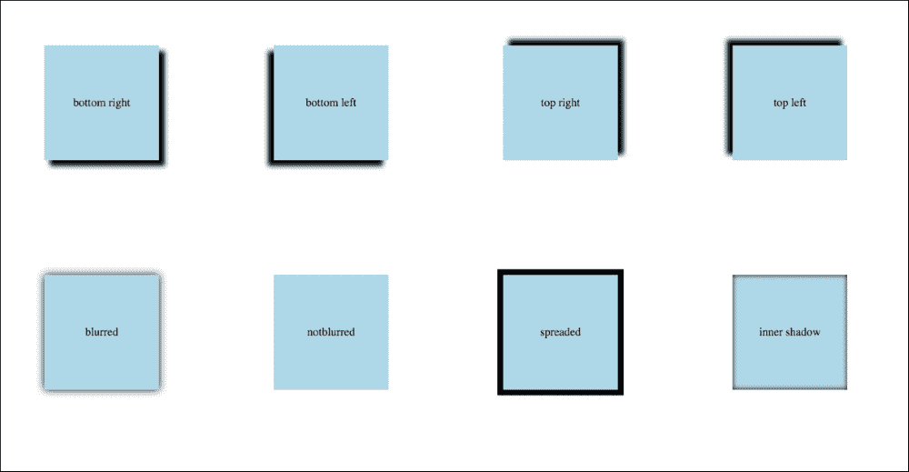

# 九、计算、渐变和阴影

在前一章中，我们分析了 flexbox 和基于 flexbox 模型的简单结构。在本章中，我们将重点介绍 CSS 的以下几个方面:

*   计算函数
*   梯度
*   阴影
*   CSS 动画。
*   数据属性的使用

开始吧！

# 计算()方法

您是否遇到过混合单元的问题？比如说你需要做一个 60%-10px 的方程？这些操作在旧的浏览器中可能会非常有用，这在 CSS 的`calc()`方法中是可能的。怎么用？让我们用两个浮动框来解决一个问题；一个是静态宽度，第二个是调整到可能的最大宽度。代码如下:

HTML:

```html
<div class="container">
    <div class="first">First</div>
    <div class="second">Second</div>
</div>
```

SASS:

```html
  &:after
    content: ""
    display: table
    clear: both

.container
  +clearfix

  & > *
    float: left
    height: 200px
    padding: 10px
    box-sizing: border-box

.first
  width: 100px
  background: red

.second
  width: calc(100% - 100px)
  background: blue
```

已编译的 CSS:

```html
.container:after {
    content: "";
    display: table;
    clear: both;
}

.container >* {
    float: left;
    height: 200px;
    padding: 10px;
    box-sizing: border-box;
}

.first {
    width: 100px;
    background: red;
}

.second {
    width: calc(100% - 100px);
    background: blue;
}
```

以下是的最终结果:



`calc()`函数让我们有机会做出简单的等式，比如百分比减去像素。在这个简单的例子中，你可以看到我们不需要使用划水和绝对位置的技巧。你可以用好`calc()`功能，问题就解决了。

# CSS 中的渐变

有经验的前端开发人员还记得渐变作为背景图像的时候。没错。这是在浏览器中模仿渐变的唯一想法。您需要剪切 1px 的宽度和渐变的高度(如果是垂直渐变；在水平的情况下，它是 1px，高度和宽度由 PSD 文件中的渐变宽度指定。然后，你必须在 CSS 中添加它，并在背景中重复你的*魔法*图像。

现在，你可以用 CSS 来做了！让我们从线性梯度开始。

## 线性梯度

线性渐变可以有两种类型:从上到下或者从左到右。让我们从垂直渐变开始:

```html
background: linear-gradient(to bottom, #000 0%, #f00 100%)
```

这段代码将生成从上到下的线性渐变。顶部的颜色是黑色，底部是红色。



然而，做一个前端开发人员不可能这么容易。这就是为什么你需要记住前缀:

```html
background: -webkit-gradient(linear, left top, left bottom, color-stop(0%, #000), color-stop(100%, #f00))
background: -moz-linear-gradient(top, #000 0%, #f00 100%)
background: -webkit-linear-gradient(top, #000 0%, #f00 100%)
background: -o-linear-gradient(top, #000 0%, #f00 100%)
background: -ms-linear-gradient(top, #000 0%, #f00 100%)
background: linear-gradient(to bottom, #000 0%, #f00 100%)
```

如您所见，带有前缀的定义占用了大量代码，尤其是当您需要 IE9 的后备时(过滤器定义的最后一行)。

基本的水平坡度定义如下:

```html
background: linear-gradient(left, #fff, #000) 
```

这个例子将生成一个从左到右的渐变，右边是白色，左边是黑色。


以下是前缀版本:

```html
background: -webkit-gradient(linear, left top, right top, from(#fff), to(#000))
background: -webkit-linear-gradient(left, #fff, #000)
background: -moz-linear-gradient(left, #fff, #000)
background: -ms-linear-gradient(left, #fff, #000)
background: -o-linear-gradient(left, #fff, #000)
background: linear-gradient(left, #fff, #000)
```

多色渐变呢？当然，有可能:

```html
background: linear-gradient(to right, black, red, white)
```

效果是这样的:



您也可以旋转渐变:

HTML:

```html
<div class="gradient-04"></div>
```

SASS:

```html
div[class^="gradient-"]
  height: 200px
  width: 200px
  margin-bottom: 20px

.gradient-04
  background: linear-gradient(45deg , black, red, white)
```

CSS:

```html
div[class^="gradient-"] {
    height: 200px;
    width: 200px;
    margin-bottom: 20px;
}

.gradient-04 {
    background: linear-gradient(45deg, black, red, white);
}
```

以下是浏览器中的效果:



如果你想改变颜色之间的平衡怎么办？举个的例子，也许你希望你的渐变中黑色的浓度更高？这也是可能的:

SASS:

```html
.gradient-05
  background: linear-gradient(to right, black 40%, red 50%, white 100%)
```

CSS:

```html
.gradient-05 {
    background: linear-gradient(to right, black 40%, red 50%, white 100%);
}
```

以下是浏览器中的效果:



要理解这一点，需要一步一步查看这个例子:

```html
black 40%:This line means that black color will be finished in 40% of width of the box
red 50%:This means that red color will be finished in 50% of width of the box
white 100%:This means that white color will be finished in 100% of width of the box
```

## 使用梯度混合

在这一章中，你可以得到这些混音并在你的项目中使用它们。我不喜欢每次都写长代码——只写一次，然后重复短版本。这就是为什么我准备了这两个简单的渐变:

```html
=linearGradientFromTop($startColor, $endColor)
  background: $startColor
  background: -webkit-gradient(linear, left top, left bottom, color-stop(0%, $startColor), color-stop(100%, $endColor))
  background: -moz-linear-gradient(top, $startColor 0%, $endColor 100%)
  background: -webkit-linear-gradient(top, $startColor 0%, $endColor 100%)
  background: -o-linear-gradient(top, $startColor 0%, $endColor 100%)
  background: -ms-linear-gradient(top, $startColor 0%, $endColor100%)
  background: linear-gradient(to bottom, $startColor 0%, $endColor 100%)
  filter: progid:DXImageTransform.Microsoft.gradient( startColorstr='#{$startColor}', endColorstr='#{$endColor}',GradientType=0 )

=linearGradientFromLeft($startColor, $endColor)
  background-color: $startColor
background: -webkit-gradient(linear, left top, right top, from($startColor), to($endColor))
  background: -webkit-linear-gradient(left, $startColor, $endColor)
  background: -moz-linear-gradient(left, $startColor, $endColor)
  background: -ms-linear-gradient(left, $startColor, $endColor)
  background: -o-linear-gradient(left, $startColor, $endColor)
  background: linear-gradient(left, $startColor, $endColor)
  filter: progid:DXImageTransform.Microsoft.gradient(startColorStr='#{$startColor}', endColorStr='#{$endColor}', gradientType='1')
```

在前面的 mixins 示例中，最重要的一点是您需要使用`hex`颜色的完整表示。例如，红色不能使用`#f00`。你必须使用`#ff0000`。这是因为 IE9 和更低的回退不尊重这种更短版本的渐变颜色表示。这个 mixin 中另一个重要的东西是第一行，它只设置背景颜色。这是所有不尊重任何带前缀/不带前缀的渐变版本的浏览器的后备方案。使用它，颜色仅设置为设置为`$startColor`的颜色。mixin 中的第二行与基于 WebKit 的旧版本浏览器有关。最后一行与旧 IE (9 及以下)相关。当然，如果您的项目中没有使用或不需要这些代码，您也不必保留它们。您可以修改它以符合项目的要求。

## 径向梯度

在某些项目中，您将需要添加径向渐变。径向梯度标准函数如下所示:

```html
radial-gradient()
```

或者您可以使用:

```html
background: repeating-radial-gradient()
```

让我们检查一个示例代码和使用渐变的可能性:

HTML:

```html
<table>
    <tr>
        <td><div class="gradient-04"></div></td>
        <td><div class="gradient-05"></div></td>
        <td><div class="gradient-06"></div></td>
    </tr>
    <tr>
        <td><div class="gradient-07"></div></td>
        <td><div class="gradient-08"></div></td>
        <td><div class="gradient-09"></div></td>
    </tr>
    <tr>
        <td><div class="gradient-10"></div></td>
        <td><div class="gradient-11"></div></td>
        <td><div class="gradient-12"></div></td>
    </tr>
</table>
```

SASS:

```html
div[class^="gradient-"]
  height: 200px
  width: 200px
  margin-bottom: 20px

//
.gradient-04
  background: red
  background: -webkit-radial-gradient(50% 50%, closest-side, red, black)
  background: -o-radial-gradient(50% 50%, closest-side, red, black)
  background: -moz-radial-gradient(50% 50%, closest-side, red, black)
  background: radial-gradient(closest-side at 50% 50%, red, black)

.gradient-05
  background: red
  background: -webkit-radial-gradient(10% 10%, closest-side, red, black)
  background: -o-radial-gradient(10% 10%, closest-side, red, black)
  background: -moz-radial-gradient(10% 10%, closest-side, red, black)
  background: radial-gradient(closest-side at 10% 10%, red, black)

.gradient-06
  background: red
  background: -webkit-radial-gradient(50% 10%, closest-side, red, black)
  background: -o-radial-gradient(50% 10%, closest-side, red, black)
  background: -moz-radial-gradient(50% 10%, closest-side, red, black)
  background: radial-gradient(closest-side at 50% 10%, red, black)

.gradient-07
  background: red
  background: -webkit-radial-gradient(50% 50%, closest-corner, red, black)
  background: -o-radial-gradient(50% 50%, closest-corner, red, black)
  background: -moz-radial-gradient(50% 50%, closest-corner, red, black)
  background: radial-gradient(closest-corner at 50% 50%, red, black)

.gradient-08
  background: red
  background: -webkit-radial-gradient(10% 10%, closest-corner, red, black)
  background: -o-radial-gradient(10% 10%, closest-corner, red, black)
  background: -moz-radial-gradient(10% 10%, closest-corner, red, black)
  background: radial-gradient(closest-corner at 10% 10%, red, black)

.gradient-09
  background: red
  background: -webkit-radial-gradient(50% 10%, closest-corner, red, black)
  background: -o-radial-gradient(50% 10%, closest-corner, red, black)
  background: -moz-radial-gradient(50% 10%, closest-corner, red, black)
  background: radial-gradient(closest-corner at 50% 10%, red, black)

.gradient-10
  background: red
  background: -webkit-repeating-radial-gradient(50% 50%, closest-corner,  red, black)
  background: -o-repeating-radial-gradient(50% 50%, closest-corner, red, black)
  background: -moz-repeating-radial-gradient(50% 50%, closest-corner, red, black)
  background: repeating-radial-gradient(closest-corner at 50% 50%, red, black)

.gradient-11
  background: red
  background: -webkit-repeating-radial-gradient(10% 10%, closest-corner, red, black)
  background: -o-repeating-radial-gradient(10% 10%, closest-corner, red, black)
  background: -moz-repeating-radial-gradient(10% 10%, closest-corner, red, black)
  background: repeating-radial-gradient(closest-corner at 10% 10%, red, black)

.gradient-12
  background: red
  background: -webkit-repeating-radial-gradient(50% 10%, closest-corner, red, black)
  background: -o-repeating-radial-gradient(50% 10%, closest-corner, red, black)
  background: -moz-repeating-radial-gradient(50% 10%, closest-corner, red, black)
  background: repeating-radial-gradient(closest-corner at 50% 10%, red, black)
```

CSS:

```html
div[class^="gradient-"] {
    height: 200px;
    width: 200px;
    margin-bottom: 20px;
}

.gradient-04 {
    background: red;
    background: -webkit-radial-gradient(50% 50%, closest-side, red, black);
    background: -o-radial-gradient(50% 50%, closest-side, red, black);
    background: -moz-radial-gradient(50% 50%, closest-side, red, black);
    background: radial-gradient(closest-side at 50% 50%, red, black);
}

.gradient-05 {
    background: red;
    background: -webkit-radial-gradient(10% 10%, closest-side, red, black);
    background: -o-radial-gradient(10% 10%, closest-side, red, black);
    background: -moz-radial-gradient(10% 10%, closest-side, red, black);
    background: radial-gradient(closest-side at 10% 10%, red, black);
}

.gradient-06 {
    background: red;
    background: -webkit-radial-gradient(50% 10%, closest-side, red, black);
    background: -o-radial-gradient(50% 10%, closest-side, red, black);
    background: -moz-radial-gradient(50% 10%, closest-side, red, black);
    background: radial-gradient(closest-side at 50% 10%, red, black);
}

.gradient-07 {
    background: red;
    background: -webkit-radial-gradient(50% 50%, closest-corner, red, black);
    background: -o-radial-gradient(50% 50%, closest-corner, red, black);
    background: -moz-radial-gradient(50% 50%, closest-corner, red, black);
    background: radial-gradient(closest-corner at 50% 50%, red, black);
}

.gradient-08 {
    background: red;
    background: -webkit-radial-gradient(10% 10%, closest-corner, red, black);
    background: -o-radial-gradient(10% 10%, closest-corner, red, black);
    background: -moz-radial-gradient(10% 10%, closest-corner, red, black);
    background: radial-gradient(closest-corner at 10% 10%, red, black);
}

.gradient-09 {
    background: red;
    background: -webkit-radial-gradient(50% 10%, closest-corner, red, black);
    background: -o-radial-gradient(50% 10%, closest-corner, red, black);
    background: -moz-radial-gradient(50% 10%, closest-corner, red, black);
    background: radial-gradient(closest-corner at 50% 10%, red, black);
}

.gradient-10 {
    background: red;
    background: -webkit-repeating-radial-gradient(50% 50%, closest-corner, red, black);
    background: -o-repeating-radial-gradient(50% 50%, closest-corner, red, black);
    background: -moz-repeating-radial-gradient(50% 50%, closest-corner, red, black);
    background: repeating-radial-gradient(closest-corner at 50% 50%, red, black);
}

.gradient-11 {
    background: red;
    background: -webkit-repeating-radial-gradient(10% 10%, closest-corner, red, black);
    background: -o-repeating-radial-gradient(10% 10%, closest-corner, red, black);
    background: -moz-repeating-radial-gradient(10% 10%, closest-corner, red, black);
    background: repeating-radial-gradient(closest-corner at 10% 10%, red, black);
}

.gradient-12 {
    background: red;
    background: -webkit-repeating-radial-gradient(50% 10%, closest-corner, red, black);
    background: -o-repeating-radial-gradient(50% 10%, closest-corner, red, black);
    background: -moz-repeating-radial-gradient(50% 10%, closest-corner, red, black);
    background: repeating-radial-gradient(closest-corner at 50% 10%, red, black);
}
```

以下是浏览器中的效果:


# 如何添加框影

在过去，阴影功能在 CSS 中是不可用的。此功能为您提供了将阴影效果附加到方框(带`box-shadow`)和文本(带`text-shadow`)的机会。`box-shadow`是如何被创造出来的？让我们在 CSS 中检查这个属性的参数:

```html
box-shadow: horizontal-shadow vertical-shadow blur spread color
```

在所有参数之前，您可以添加插图。使用此属性，阴影将位于元素内部。

理解这一点最简单的方法是检查它在浏览器中的行为:

HTML:

```html
<div class="container">
    <div class="box_container">
        <div class="box__bottom_right">bottom right</div>
    </div>
    <div class="box_container">
        <div class="box__bottom_left">bottom left</div>
    </div>
    <div class="box_container">
        <div class="box__top_right">top right</div>
    </div>
    <div class="box_container">
        <div class="box__top_left">top left</div>
    </div>
    <div class="box_container">
        <div class="box__blurred">blurred</div>
    </div>
    <div class="box_container">
        <div class="box__notblurred">notblurred</div>
    </div>
    <div class="box_container">
        <div class="box__spreaded">spreaded</div>
    </div>
    <div class="box_container">
        <div class="box__innershadow">inner shadow</div>
    </div>
</div>
```

SASS:

```html
=clearfix
  &:after
    content: ""
    display: table
    clear: both

.container
  +clearfix
  width: 800px

  & > *
    float: left

.box_container
  width: 200px
  height: 200px
  position: relative

div[class^="box__"]
  width: 100px
  height: 100px
  position: absolute
  background: lightblue
  top: 50%
  left: 50%
  line-height: 100px
  font:
    size: 10px
  text:
    align: center
  transform: translate(-50%,-50%)

.box__bottom_right
  box-shadow: 5px 5px 5px 0 #000

.box__bottom_left
  box-shadow: -5px 5px 5px 0 #000

.box__top_right
  box-shadow: 5px -5px 5px 0 #000

.box__top_left
  box-shadow: -5px -5px 5px 0 #000

.box__blurred
  box-shadow: 0px 0px 10px 0 #000

.box__notblurred
  box-shadow: 0px 0px 0 0 #000

.box__spreaded
  box-shadow: 0px 0px 0 5px #000

.box__innershadow
  box-shadow: inset 0px 0px 5px 0px #000
```

CSS:

```html
.container {
    width: 800px;
}

.container:after {
    content: "";
    display: table;
    clear: both;
}

.container > * {
    float: left;
}

.box_container {
    width: 200px;
    height: 200px;
    position: relative;
}

div[class^="box__"] {
    width: 100px;
    height: 100px;
    position: absolute;
    background: lightblue;
    top: 50%;
    left: 50%;
    line-height: 100px;
    font-size: 10px;
    text-align: center;
    transform: translate(-50%, -50%);
}

.box__bottom_right {
    box-shadow: 5px 5px 5px 0 #000;
}

.box__bottom_left {
    box-shadow: -5px 5px 5px 0 #000;
}

.box__top_right {
    box-shadow: 5px -5px 5px 0 #000;
}

.box__top_left {
    box-shadow: -5px -5px 5px 0 #000;
}

.box__blurred {
    box-shadow: 0px 0px 10px 0 #000;
}

.box__notblurred {
    box-shadow: 0px 0px 0 0 #000;
}

.box__spreaded {
    box-shadow: 0px 0px 0 5px #000;
}

.box__innershadow {
    box-shadow: inset 0px 0px 5px 0px #000;
}
```

以下是浏览器中的效果:



在本例中，您可以检查如何设置垂直和水平阴影。此外，您可以设置模糊扩散及其颜色。向垂直和水平阴影添加正值将分别向底部和右侧移动阴影。当您添加负值时，它将移动到顶部和左侧。

# 如何添加文字阴影

为盒子添加一个阴影非常简单。但是我们如何给文本添加阴影呢？有了`text-shadow`属性，这是可能的。它的工作原理与`box-shadow`非常相似。定义如下:

```html
text-shadow: horizontal-shadow vertical-shadow blur-radius color
```

让我们基于前一章的代码创建一个示例，以更好地理解`text-shadow`属性:

HTML:

```html
<div class="container">
    <div class="box_container">
        <div class="box__bottom_right">bottom right</div>
    </div>
    <div class="box_container">
        <div class="box__bottom_left">bottom left</div>
    </div>
    <div class="box_container">
        <div class="box__top_right">top right</div>
    </div>
    <div class="box_container">
        <div class="box__top_left">top left</div>
    </div>
    <div class="box_container">
        <div class="box__blurred">blurred</div>
    </div>
    <div class="box_container">
        <div class="box__notblurred">notblurred</div>
    </div>
</div>
```

SASS:

```html
=clearfix
  &:after
    content: ""
    display: table
    clear: both

.container
  +clearfix
  width: 00px

  &>*
    float: left

.box_container
  width: 100px
  height: 100px
  position: relative

div[class^="box__"]
  width: 100px
  height: 100px
  position: absolute
  background: lightblue
  top: 50%
  left: 50%
  line-height: 100px
  font:
    size: 10px
  text:
    align: center
  transform: translate(-50%,-50%)

.box__bottom_right
  text-shadow: 5px 5px 5px #000

.box__bottom_left
  text-shadow: -5px 5px 5px #000

.box__top_right
  text-shadow: 5px -5px 5px #000

.box__top_left
  text-shadow: -5px -5px 5px #000

.box__blurred
  text-shadow: 0px 0px 10px #000

.box__notblurred
  text-shadow: 5px 5px 0 red
```

CSS:

```html
.container {
    width: 0px;
}

.container:after {
    content: "";
    display: table;
    clear: both;
}

.container >* {
    float: left;
}

.box_container {
    width: 100px;
    height: 100px;
    position: relative;
}

div[class^="box__"] {
    width: 100px;
    height: 100px;
    position: absolute;
    background: lightblue;
    top: 50%;
    left: 50%;
    line-height: 100px;
    font-size: 10px;
    text-align: center;
    transform: translate(-50%, -50%);
}

.box__bottom_right {
    text-shadow: 5px 5px 5px #000;
}

.box__bottom_left {
    text-shadow: -5px 5px 5px #000;
}

.box__top_right {
    text-shadow: 5px -5px 5px #000;
}

.box__top_left {
    text-shadow: -5px -5px 5px #000;
}

.box__blurred {
    text-shadow: 0px 0px 10px #000;
}

.box__notblurred {
    text-shadow: 5px 5px 0 red;
}
```

以下是浏览器中的效果:


# 附加字体和文本功能

在过去的 5 年里，CSS 中的字体特性发生了很大的变化。回到过去，没有机会使用非标准字体，正如人们所描述的那样*安全上网*。这是闪存技术变得更加时尚的问题之一，不仅因为闪存页面的完整，还因为**可扩展的因曼闪存替代产品** ( **SIFR** )。有了 SIFR，你只需要在 Adobe Flash 中附上你的字体，编译文件；然后你可以在网站上使用你的字体。但是你有一个带有 Flash 实例的网页。然后，有一种基于 JavaScript 的方法论，叫做 **cufon** 。您可以使用您的字体访问 cufon 页面，编译您的字体，然后在您的网站上附加`cufon.js`和您编译的字体(JS 文件)。在 JavaScript 中，您需要添加应该交换的字体，最终您的字体在网站上可见。

现在，我们可以在网页版中使用字体和自定义字体。

## 在浏览器中使用非标准字体

如果你想在浏览器中使用你的字体，你需要做好准备。字体的基本定义是基于原始 CSS 中的这个例子:

```html
@font-face {
    font-family: font_name;
    src: url(your_font.woff);
}
```

如果您现在想使用您的字体，您将需要在您的 CSS 中添加以下示例代码:

```html
.classOfElement {
    font-family: font_name;
}
```

主要问题是，如果我有另一种字体格式，如何准备我的字体在浏览器中使用？如果你有字体，可以使用`fontsquirrel.com`生成 CSS 的最终视图，准备使用。当然，还有一些其他来源可以搜索字体:

*   谷歌字体([https://www.google.com/fonts](https://www.google.com/fonts)
*   类型(〈t0〉https://types . com/fonts【】)

在这里，你可以找到准备在你的项目中使用的字体。

## 使用 CSS 动画

CSS 动画是一个非常有用的特性。你不需要使用 JavaScript 来制作简单的动画，图形处理器支持 CSS 动画。我们能用 CSS 动画做什么？让我们看看下面的例子:

```html
<div class="container">
    <div class="rollin"></div>
</div>
```

SASS:

```html
.container
  width: 600px
  border: 1px solid #000

.rollin
  width: 100px
  height: 100px
  background: #000

  animation:
    duration: 1s
    name: roll_in
    iteration-count: 1
    delay: 1s
    fill-mode: backwards

@keyframes roll_in
  from
    margin-left: 100%
    opacity: .3

  to
    margin-left: 0%
    opacity: 1
```

以下是生成的 CSS:

```html
.container {
    width: 600px;
    border: 1px solid #000;
}

.rollin {
    width: 100px;
    height: 100px;
    background: #000;
    animation-duration: 1s;
    animation-name: roll_in;
    animation-iteration-count: 1;
    animation-delay: 1s;
    animation-fill-mode: backwards;
}

@keyframes roll_in {
from {
        margin-left: 100%;
        opacity: 0.3;
    }
to {
        margin-left: 0%;
        opacity: 1;
    }
}
```

以下是浏览器中的效果:


你可以看到动画的进度，在 SASS/CSS 文件中有描述。

CSS 动画的属性有:

*   `animation-name`:这个属性定义了应该使用哪个`@keyframs`定义，例如:`animation-name: roll_in`
*   `animation-delay`:这个属性定义了元素加载和动画开始之间的延迟，例如:`animation-delay: 2s`
*   `animation-duration`:这个属性定义了动画的长度，例如:`animation-duration: 2s`
*   `animation-iteration-count`:这个属性定义动画应该重复多少次，例如:`animation- iteration-count: 2`
*   `animation-fill-mode`:这个属性定义了元素对于延迟时间的行为，例如:`animation- fill-mode: backward`

如何在悬停时添加动画？让我们创建一个示例:

HTML:

```html
<a href="" class="animation_hover">Element</a>
```

SASS:

```html
.animation_hover
  display: inline-block
  padding: 20px
  background: #d3d3d3
  text-decoration: none
  color: black
  transition:
    duration: .5s
    property: all

  &:hover
    background: blue
    color: white
```

CSS:

```html
.animation_hover {
    display: inline-block;
    padding: 20px;
    background: #d3d3d3;
    text-decoration: none;
    color: black;
    transition-duration: 0.5s;
    transition-property: all;
}

.animation_hover:hover {
    background: blue;
    color: white;
}
```

以下是浏览器中的结束结果:


您可以看到悬停操作前后的元素。此外，还有一个过渡，给这个按钮增加了一点动画的味道。在这个动画宣言中，什么是重要的？

```html
transition-property
```

前面的声明给出了应该设置动画的值的列表。这个列表的一个例子可能是:

```html
Color, background-color
```

该列表意味着颜色和背景颜色将被动画化。当你想要设置所有属性的动画时，你可以使用*全部*作为一个值。

# 数据属性

数据属性主要是与 HTML 代码和 JavaScript 相关。使用数据属性，您可以描述 DOM 元素，并在脚本中使用这些值，例如，用于排序、动画或任何其他目的。但是它如何在 CSS 代码中帮助你呢？让我们考虑下面的例子。

## 发出–悬停时粗体移动导航

这是网站上非常常见的问题。让我们假设您有响应悬停的内联元素。悬停后，该元素将其字体粗细从正常更改为粗体。效果是悬停元素后的每个元素都向右移动。让我们从 HTML 代码开始:

```html
<ul>
    <li><a href="#">First</a></li>
    <li><a href="#">Second</a></li>
    <li><a href="#">Third</a></li>
    <li><a href="#">Fourth</a></li>
    <li><a href="#">Fifth</a></li>
</ul>
```

SASS:

```html
li, a
  display: inline-block
  text-align: center

a:hover
  font-weight: bold
```

CSS:

```html
li, a {
    display: inline-block;
    text-align: center;
}

a:hover {
    font-weight: bold;
}
```

CSS:

```html
li, a {
    display: inline-block;
    text-align: center;
}

a:hover {
    font-weight: bold;
}
```

无悬停和有悬停动作的浏览器中的效果是:


红色标尺是结构上的尖移。现在，让我们使用我们的*解毒剂*。首先，我们需要稍微改变我们的 HTML 代码。这种变化与`data-alt`属性及其值有关。作为一个值，我们复制了 DOM 元素的值:

HTML:

```html
<ul class="bold_list_fix">
    <li><a href="#" data-alt="First">First</a></li>
    <li><a href="#" data-alt="Second">Second</a></li>
    <li><a href="#" data-alt="Third">Third</a></li>
    <li><a href="#" data-alt="Fourth">Fourth</a></li>
    <li><a href="#" data-alt="Fifth">Fifth</a></li>
</ul>
```

SASS:

```html
.bold_list_fix
  a::after
    display: block
    content: attr(data-alt)
    font-weight: bold
    height: 1px
    color: transparent
    overflow: hidden
    visibility: hidden
```

CSS:

```html
.bold_list_fix a::after {
    display: block;
    content: attr(data-alt);
    font-weight: bold;
    height: 1px;
    color: transparent;
    overflow: hidden;
}
```

瞧！问题解决了。正如你可以看到的，这个技巧是基于`:after`伪元素，它现在作为一个不可见的元素保存着。通过`attr(data-alt)`从 HTML 代码中获取一个属性来设置内容。在此内容中，添加了粗体功能。这给了足够的空间，这在之前的代码中没有被占用。最后，元素不会向右移动。

# 总结

在这一章中，我们讨论了 CSS 渐变，所以你不需要用图像来制作渐变。我们分析了`box-shadow`和`text-shadow`的用法。我们创建了一个简单的动画，并分析了它的参数。此外，我们在 CSS 代码中使用了数据属性。

在下一章中，我们将讨论 CSS 中的 DRY(不要重复自己的缩写)，并尝试创建一个基本框架，作为您项目的开端。