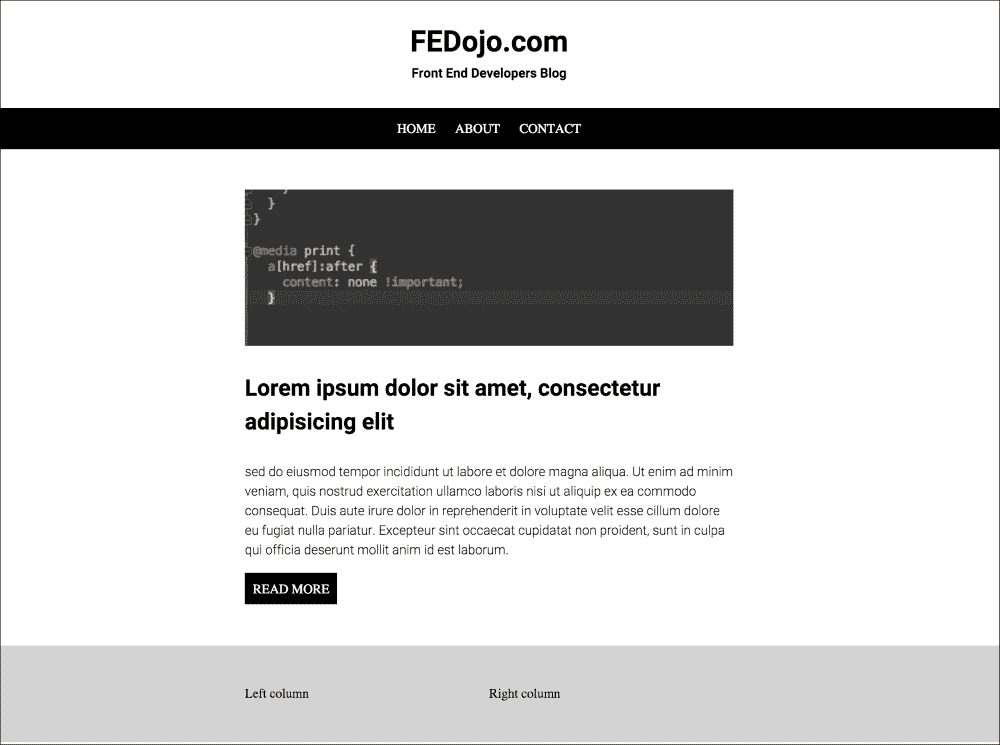

# 第十章。不要重复自己——让我们创建一个简单的 CSS 框架

有多少次你做了一些工作，只是为了在下一个项目中重复？你想过多少次可重复的元素？当你在编码的时候，你应该考虑下一次你在处理同一个或者另一个项目的时候，你可以省略多少操作。这意味着您需要使用以下内容:

*   自动化
*   代码模板或框架

这一章是关于构建可重用代码以及如何最终将它用作项目的基础。在本章中，我们将涵盖以下主题:

*   为一个小而简单的 CSS 框架制定计划
*   创建自己的网格系统
*   创建可重用元素

请记住，这段代码可以也应该扩展。Showed process 应该让您更清楚如何使用您已经创建的框架来帮助自己，但是这些框架仍然可以随着您的代码而发展。当然，您可以使用其他框架。

# 文件结构

规划系统/框架时，文件结构非常重要。当你开始创造某样东西时，它需要进化。所以根据开发过程，你的系统也在进化。当你的系统进化时，它会改变很多。所以，让我们创建一个简单的结构:

*   有用的混合:
    *   有用元素的简短形式
    *   内嵌列表
    *   基元
    *   克拉菲克斯
    *   简单梯度发生器
*   网格混合:
    *   n 的 n 个网格
*   表格:
    *   输入/文本区域样式助手
    *   输入占位符
*   按钮:
    *   内嵌(带自动宽度)
    *   全宽
*   标准导航:
    *   一级
    *   两层的

我们将使用 mixins 代替已经创建的类。为什么呢？我们希望尽可能地减少 CSS 代码，这样，当我们生成完整的 12 个网格时，我们将在媒体查询的每个断点中产生 12 个类。作为前端开发人员，我们希望根据需要创建尽可能多的代码。当然，我们可以重用一些类，并用 SASS 扩展它们，但是这个框架的主要方法是简单且可重用的 mixins。

# 有用元素的简短形式

在 CSS 代码中(不仅仅是 CSS)，你希望每次重复代码的一部分时能更快地得到最终效果。那么为什么不为一些 CSS 声明创建简短的形式呢？让我们看看有什么可以缩短的:

```html
/* Text decoration */
=tdn
  text-decoration: none

=tdu
  text-decoration: underline

/* Text align */
=tac
  text-align: center

=tar
  text-align: right

=tal
  text-align: left

/* Text transform */
=ttu
  text-transform: uppercase

=ttl
  text-transform: lowercase

/* Display */
=di
  display: inline

=db
  display: block

=dib
  display: inline-block

/* Margin 0 auto */
=m0a
  margin: 0 auto
```

现在，每次你想让一些文字大写，你只是在用代码:

```html
.sampleClass
  +ttu
```

下面是编译后的 CSS:

```html
.sampleClass {
    text-transform: uppercase;
}
```

使用短混合的另一个例子是一个元素，它将显示为块元素，文本将居中:

```html
.sampleClass
  +db
  +tac
```

下面是编译后的 CSS:

```html
.sampleClass {
    display: block;
    text-align: center;
}
```

# 其他混合物

还有其他对我们的框架有益的混合:

*   梯度
*   动画
*   克拉菲克斯

让我们从渐变混合开始:

```html
=linearGradientFromTop($startColor, $endColor)
  background: $startColor /* Old browsers */
  background: -moz-linear-gradient(top,  $startColor 0%, $endColor 100%)
  background: -webkit-gradient(linear, left top, left bottom, color-stop(0%, $startColor), color-stop(100%, $endColor))
  background: -webkit-linear-gradient(top,  $startColor 0%, $endColor 100%)
  background: -o-linear-gradient(top,  $startColor 0%, $endColor 100%)
  background: -ms-linear-gradient(top,  $startColor 0%, $endColor 100%)
  background: linear-gradient(to bottom,  $startColor 0%, $endColor 100%)
  filter: progid:DXImageTransform.Microsoft.gradient( startColorstr='#{$startColor}', endColorstr='#{$endColor}',GradientType=0 ) 

=linearGradientFromLeft($startColor, $endColor)
  background-color: $startColor
  background: -webkit-gradient(linear, left top, right top, from($startColor), to($endColor))
  background: -webkit-linear-gradient(left, $startColor, $endColor)
  background: -moz-linear-gradient(left, $startColor, $endColor)
  background: -ms-linear-gradient(left, $startColor, $endColor)
  background: -o-linear-gradient(left, $startColor, $endColor)
  background: linear-gradient(left, $startColor, $endColor)
  filter: progid:DXImageTransform.Microsoft.gradient(startColorStr='#{$startColor}', endColorStr='#{$endColor}', gradientType='1')
```

动画全部:

```html
=animateAll($time)
  -webkit-transition: all $time ease-in-out
  -moz-transition: all $time ease-in-out
  -o-transition: all $time ease-in-out
  transition: all $time ease-in-out
```

## 清修

不要忘记在你的私有 SASS 框架中添加`clearfix`到你的混搭中。您将使用它作为 mixin 的调用或作为一个类，所有其他元素将扩展先前创建的类:

```html
=clearfix
  &:after
    content: " "
    visibility: hidden
    display: block
    height: 0
    clear: both
```

每次您希望创建一个可重用的`clearfix`类时，您可以这样做:

```html
.clearfix
  +clearfix
```

下面是编译后的 CSS:

```html
.clearfix:after {
    content: " ";
    visibility: hidden;
    display: block;
    height: 0;
    clear: both;
}
```

或者更短的版本可以写成:

```html
.cf
  +clearfix
```

下面是编译后的 CSS:

```html
.cf:after {
    content: " ";
    visibility: hidden;
    display: block;
    height: 0;
    clear: both;
}
```

现在，您可以在 SASS 代码中用`@extend`扩展它:

```html
.element
  @extend .cf
```

下面是编译后的 CSS:

```html
.cf:after, .element:after {
    content: " ";
    visibility: hidden;
    display: block;
    height: 0;
    clear: both;
}
```

将一个绝对元素置于另一个相对元素的中心:

```html
/* Absolute center vertically and horizontally */
=centerVH
  position: absolute
  top: 50%
  left: 50%
  -ms-transform: translate(-50%,-50%)
  -webkit-transform: translate(-50%,-50%)
  transform: translate(-50%,-50%)
```

# 媒体查询

在每个响应性的网络项目中，您需要创建媒体查询。您需要选择将要实现的步骤，然后根据这些步骤开始创建项目。

## 媒体查询模板

媒体查询的使用和创建相当简单。媒体查询的主要问题是可重复使用的步骤，这些步骤可以放在一个地方。在某些项目中，由于项目可见性问题或一些会影响代码的额外代码，您将需要添加一些查询。让我们专注于如何用一些设置使它一次，然后在我们的代码中使用它。

基本设置集中在以下方面:

*   移动设备(电话)
*   移动设备(平板电脑)
*   桌面设备
*   桌面设备(大型)

在某些情况下，您可以使用移动设备位置(纵向和横向)扩展此列表，但是媒体查询的数量越少越好，维护也越容易。那么我们如何保持尺寸呢？

*   `$small` : 320px
*   `$medium` : 768px
*   `$large` : 1024px

# 网格

在标准的 HTML/CSS 项目中，最可重复的元素是网格。当然，你可以使用别人的网格，或者从 Bootstrap 或 Foundation 等 CSS 框架中取。从头开始创作很难吗？不完全是。在本章中，我们将创建一个基本的网格系统，并使用它来查看它如何创建行和列。

## 标准网格 16/12

标准网格基于 16 列或 12 列系统。两种系统的优点是什么？这取决于你的结构。例如，分析布局后，假设您需要:

*   三柱合成
*   双柱组合
*   六柱合成

所以，你可以使用 12 列系统。然而，正如您所看到的，您需要坚持这个系统，那么您如何创建自己的代码以使其更具弹性呢？您可以使用以下命名约定:

```html
.grid-NofK
```

这里，`N`是列数，`K`是分割线，例如:

```html
.grid-3of12
.grid-5of6
```

当您使用网格时，您需要记住有时您需要从左侧推送一些列。需要创建`.push`类时就是这种情况:

```html
.push-NofK
```

这种命名惯例的优点是什么？没有静态分频器。在经典网格中，你有一个 12 列或 16 列及其组合的网格。下面是一个按类编写的网格示例:

12 格:

```html
.grid-1of12 {
    width: 8.33%
}

.push-1of12 {
    margin-left: 8.33%
}

.grid-2of12 {
    width: 16.66%
}

.push-2of12 {
    margin-left: 16.66%
}

.grid-3of12 {
    width: 25%
}

.push-3of12 {
    margin-left: 25%
}

.grid-4of12 {
    width: 33.33%
}

.push-4of12 {
    margin-left: 33.33%
}

.grid-5of12 {
    width: 41.66%
}

.push-5of12 {
    margin-left: 41.66%
}

.grid-6of12 {
    width: 50%
}

.push-6of12 {
    margin-left: 50%
}

.grid-7of12 {
    width: 58.33%
}

.push-7of12 {
    margin-left: 58.33%
}

.grid-8of12 {
    width: 66.66%
}

.push-8of12 {
    margin-left: 66.66%
}

.grid-9of12 {
    width: 75%
}

.push-9of12 {
    margin-left: 75%
}

.grid-10of12 {
    width: 83.33%
}

.push-10of12 {
    margin-left: 83.33%
}

.grid-11of12 {
    width: 91.66%
}

.push-11of12 {
    margin-left: 91.66%
}

.grid-12of12 {
    width: 100%
}

.push-12of12 {
    margin-left: 100%
}
```

网格共 16 个:

```html
.grid-1of16 {
    width: 6.25%
}

.push-1of16 {
    margin-left: 6.25%
}

.grid-2of16 {
    width: 12.5%
}

.push-2of16 {
    margin-left: 12.5%
}

.grid-3of16 {
    width: 18.75%
}

.push-3of16 {
    margin-left: 18.75%
}

.grid-4of16 {
    width: 25%
}

.push-4of16 {
    margin-left: 25%
}

.grid-5of16 {
    width: 31.25%
}

.push-5of16 {
    margin-left: 31.25%
}

.grid-6of16 {
    width: 37.5%
}

.push-6of16 {
    margin-left: 37.5%
}

.grid-7of16 {
    width: 43.75%
}

.push-7of16 {
    margin-left: 43.75%
}

.grid-8of16 {
    width: 50%
}

.push-8of16 {
    margin-left: 50%
}

.grid-9of16 {
    width: 56.25%
}

.push-9of16 {
    margin-left: 56.25%
}

.grid-10of16 {
    width: 62.5%
}

.push-10of16 {
    margin-left: 62.5%
}

.grid-11of16 {
    width: 68.75%
}

.push-11of16 {
    margin-left: 68.75%
}

.grid-12of16 {
    width: 75%
}

.push-12of16 {
    margin-left: 75%
}

.grid-12of16 {
    width: 81.25%
}

.push-12of16 {
    margin-left: 81.25%
}

.grid-12of16 {
    width: 87.5%
}

.push-12of16 {
    margin-left: 87.5%
}

.grid-12of16 {
    width: 93.75%
}

.push-12of16 {
    margin-left: 93.75%
}

.grid-12of16 {
    width: 100%
}

.push-12of16 {
    margin-left: 100%
}
```

写了很多东西...

现在，我们需要创建一个代码，我们可以在媒体查询和响应网站上使用。在最流行的 CSS 框架(如 Bootstrap 和 Foundation)中，您可以为手机/平板电脑/台式机使用类:

```html
<div class="small-2 medium-4 large-5">
</div>
```

例如，当分隔线设置为`12`时，您将在`2`列宽的小型设备上、在`4`列宽的中型设备上以及在`5`列宽的大型文档上看到此框。我们可以创建所有这些类，但是我建议您创建一个我们可以在 CSS 中描述的每个元素中调用的 mixin。

高级安全系统代码如下所示:

```html
=grid($columns, $divider)
  width: percentage($columns/$divider)

=push($columns, $divider)
  margin-left: percentage($columns/$divider)
```

我们如何在 SASS 代码中使用它？假设我们有一个基于网格`16`的块，我们想给它`16`的`12`宽度，用`16`的`2`推它:

```html
.gridElement
  +grid(12, 16)
  +push(2, 16)
```

下面是编译后的 CSS:

```html
.gridElement {
    width: 75%;
    margin-left: 12.5%;
}
```

# 标准可重复使用结构

作为一名前端开发人员，你总是在与可重复的元素做斗争。几乎在所有的情况下，你都觉得自己在试图重新发明轮子，那么你能做些什么来避免重复自己呢？让我们创建一些标准的和可重用的结构。

## 可重复使用的多级菜单

多级菜单是可重用性最高的代码。所有较大的网站都有一个菜单，你可以称之为可重用代码。

让我们从 HTML 代码开始:

```html
<ul class="menu-multilevel">
    <li>
        <a href="#">Level one - item one</a>
        <ul>
            <li><a href="#">Level two - item one</a></li>
            <li><a href="#">Level two - item two</a></li>
            <li><a href="#">Level two - item three</a></li>
            <li><a href="#">Level two - item four</a></li>
        </ul>
    </li>
    <li>
        <a href="#">Level two - item one</a>
        <ul>
            <li><a href="#">Level two - item one</a></li>
            <li><a href="#">Level two - item two</a></li>
            <li><a href="#">Level two - item three</a></li>
            <li><a href="#">Level two - item four</a></li>
        </ul>
    </li>
    <li>
        <a href="#">Level one - item three</a>
        <ul>
            <li><a href="#">Level three - item one</a></li>
            <li><a href="#">Level three - item two</a></li>
            <li><a href="#">Level three - item three</a></li>
            <li><a href="#">Level three - item four</a></li>
        </ul>
    </li>
</ul>
```

SASS 代码:

```html
ul.menu-multilevel
  list-style: none
  padding: 0

ul.menu-multilevel > li
  float: left
  display: inline-block
  position: relative
  margin-right: 10px

  &:hover
    ul
      display: block
      width: 200px

ul.menu-multilevel ul
  display: none
  position: absolute
  left: 0

  li
    display: block
```

下面是编译的 CSS:

```html
ul.menu-multilevel {
    list-style: none;
    padding: 0;
}

ul.menu-multilevel > li {
    float: left;
    display: inline-block;
    position: relative;
    margin-right: 10px;
}

ul.menu-multilevel > li:hover ul {
    display: block;
    width: 200px;
}

ul.menu-multilevel ul {
    display: none;
    position: absolute;
    left: 0;
}

ul.menu-multilevel ul li {
    display: block;
}
```

现在，让我们稍微重建一下这段代码，在 SASS 中创建一个可重用的 mixin:

```html
=memuMultilevel
  list-style: none
  padding: 0

  & > li
    float: left
    display: inline-block
    position: relative
    margin-right: 10px

    &:hover
      ul
        display: block
        width: 200px

  & ul
    display: none
    position: absolute
    left: 0

    li
      display: block
```

要使用它，您需要调用一个像这样的 mixin:

```html
ul.menu-multilevel
  +memuMultilevel
```

生成的 CSS:

```html
ul.menu-multilevel {
    list-style: none;
    padding: 0;
}

ul.menu-multilevel > li {
    float: left;
    display: inline-block;
    position: relative;
    margin-right: 10px;
}

ul.menu-multilevel > li:hover ul {
    display: block;
    width: 200px;
}

ul.menu-multilevel ul {
    display: none;
    position: absolute;
    left: 0;
}

ul.menu-multilevel ul li {
    display: block;
}
```

## 如何创建可重用按钮

按钮是您可以看到和重用的下一个元素。让我们考虑一下按钮参数。当然，我们需要有机会设置背景和字体颜色。我们需要有机会改变边框颜色和填充。

让我们从一个简单的 CSS 定义开始:

```html
.button {
    padding: 5px 10px;
    background: #ff0000;
    color: #fff;
}
```

因此，基于此，mixin 在 SASS 中可以如下所示:

```html
=button($bgc, $fc)
  display: inline-block
  background: $bgc
  color: $fc
```

这里:

*   `$bgc`:背景色
*   `$fc` ： 色源

要使用这个混合，您只需要执行以下操作:

```html
.button
  padding: 5px 10px
  +button(#ff0000, #fff)
```

下面是编译后的 CSS:

```html
.button {
    padding: 5px 10px;
    display: inline-block;
    background: #ff0000;
    color: #fff;
}
```

如何扩展这种混合？让我们考虑一下可以参数化的其他值。当然，边界半径。那么，让我们添加一个新的 mixin:

```html
=roundedButton($bgc, $fc, $bc, $br)
  background: $bgc
  color: $fc
  border-color: $bc
  border-radius: $br
```

这里:

*   `$bc`:边框颜色
*   `$br`:边框半径

让我们使用这个混合:

```html
.roundedButton
  +roundedButton(black, white, red, 5px)
```

下面是编译后的 CSS:

```html
.roundedButton {
    background: black;
    color: white;
    border-color: red;
    border-radius: 5px;
}
```

如果需要创建一堆三种大小的按钮，可以这样做:

```html
.button
  +button(#ff0000, #fff)

  .small
    padding: 5px 10px

  .medium
    padding: 10px 20px

  .large
    padding: 15px 30px
```

下面是编译后的 CSS:

```html
.button {
    display: inline-block;
    background: #ff0000;
    color: #fff;
}

.button .small {
    padding: 5px 10px;
}

.button .medium {
    padding: 10px 20px;
}

.button .large {
    padding: 15px 30px;
}
```

# 收集其他可重复使用的混合物

我们需要的是一堆有用且可重复使用的混合物。还有什么额外的帮助？让我们想想:

*   基元
*   内嵌列表

## 图元

从前面的一章中你可以记得，我们一直在使用原语。创建原语的 mixins 列表可能是我们框架中非常有用和有帮助的部分。我们将为以下对象提供混音:

*   矩形(有和没有填充)
*   圆形/环形
*   三角

让我们快速提醒一下:

```html
=rectangle($w, $h, $c)
  width: $w
  height: $h
  background: $c

=square($w, $c)
  width: $w
  height: $w
  background: $c

=circle($size, $color)
  width: $size
  height: $size
  border-radius: 50%
  background: $color

=ring($size, $color, $width)
  width: $size
  height: $size
  border-radius: 50%
  border: $width solid $color
  background: none

=triangleRight($width, $height, $color)
  width: 0
  height: 0
  border-style: solid
  border-width: $height/2 0 $height/2 $width
  border-color: transparent transparent transparent $color

=triangleLeft($width, $height, $color)
  width: 0
  height: 0
  border-style: solid
  border-width: $height/2 $width $height/2 0
  border-color: transparent $color transparent transparent

=triangleTop($width, $height, $color)
  width: 0
  height: 0
  border-style: solid
  border-width: 0 $width/2 $height $width/2
  border-color: transparent transparent $color transparent

=triangleBottom($width, $height, $color)
  width: 0
  height: 0
  border-style: solid
  border-width: $height $width/2 0 $width/2
  border-color: $color transparent transparent transparent
```

# 让我们测试并使用我们的框架

为了检查我们的框架是如何工作的，以及添加我们所有的东西有多容易，让我们创建一个博客模板。在这个模板中，让我们包含视图:

*   职位列表
*   单中锋
*   单页

让我们创建区域:

*   页眉
*   页脚
*   内容

这是我们的简化设计:



让我们从博客页面(主页)的简单结构开始:

```html
<!DOCTYPE html>
<html>
<head>
    <meta charset="utf-8">
    <title></title>
    <link rel="stylesheet" href="css/master.css" media="screen" title="no title" charset="utf-8">
</head>
<body>
<header>
    <h1>FEDojo.com</h1>
    <h2>Front End Developers Blog</h2>
</header>

<nav>
    <ul>
        <li><a href="#">Home</a></li>
        <li><a href="#">About</a></li>
        <li><a href="#">Contact</a></li>
    </ul>
</nav>

<main>
    <article class="main--article">
        <a href="#">
            
            <span class="comments"></span>
        </a>
        <h3>Lorem ipsum dolor sit amet, consectetur adipisicing elit</h3>
        <p>
            sed do eiusmod tempor incididunt ut labore et dolore magna aliqua. Ut enim ad minim veniam, quis nostrud
            exercitation ullamco laboris nisi ut aliquip ex ea commodo consequat. Duis aute irure dolor in reprehenderit
            in voluptate velit esse cillum dolore eu fugiat nulla pariatur. Excepteur sint occaecat cupidatat non
            proident, sunt in culpa qui officia deserunt mollit anim id est laborum.
        </p>
        <a href="#" class="readmore">Read more</a>
    </article>

</main>

<footer>
    <div class="wrapper">
        <div class="column">
            Left column
        </div>
        <div class="column">
            Right column
        </div>
    </div>
</footer>
</body>
</html>
```

正如你所看到的，我们有一个基于标签的结构:

*   页眉
*   航行
*   主要的
*   页脚

这是我们的文件结构:


我们来描述一下表头:

```html
header
  h1
    +tac
    margin-bottom: 0

  h2
    +tac
    font-size: 16px
    margin-top: 0
    margin-bottom: 30px
```

描述页脚:

```html
footer
  width: 100%
  background: #d3d3d3
  padding: 50px 0

  .wrapper
    +m0a /* margin 0 auto */
    +clearfix
    max-width: $wrapper

  .column
    width: 50%
    float: left
```

描述导航:

```html
nav
  background: black
  text-align: center

  ul
    +navigation

  a
    color: white
    +ttu
    padding: 10px
```

在`fed`目录中，我们存储我们的可重用代码(我们的框架)。在剩下的目录中，我们存储了与项目相关的代码。在描述结构时，我们存储在所有视图上重复的元素样式。在视图目录中，我们将保留与特定视图相关的元素的样式。

# 记住！

当您创建一些可重用的代码或者任何其他代码时，您需要留下注释。出于某种原因，目前(也是不礼貌的)趋势是程序员不添加注释“他们的代码不需要额外的描述。”另一派认为，“那是我的代码。我明白我在写什么”。你认为保持现状公平吗？当然，答案是否定的！甚至你的记忆也不完美。你可以忘记你在代码中的意思和目的。建议你至少为自己和其他将参与这个项目的人写一些简短的评论。

在 Github 和 Bitbucket 的黄金时代，您可以在几秒钟内共享您的代码，并与来自世界另一端的另一位程序员一起工作，他可以分叉您的代码或为您的项目做出贡献。

# 总结

正如您所看到的，有很多可重用的结构，您可以在每次创建新项目时进行装饰。最好先写一次东西，然后再增加一些新的功能，而不是每次都写东西，描述可重复的元素。

在下一章中，我们将尝试创建一个简单的 CSS 框架，其中包含可以使用的组件！