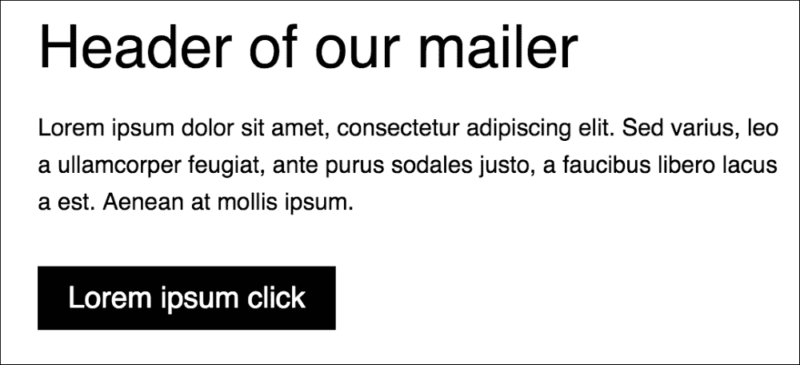
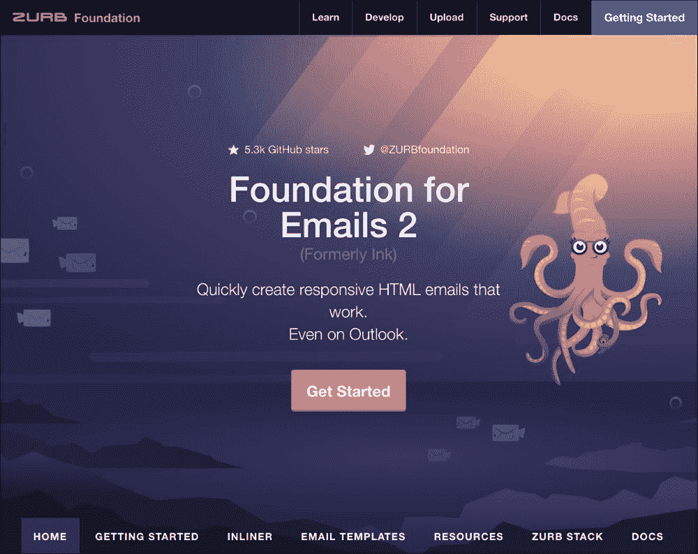
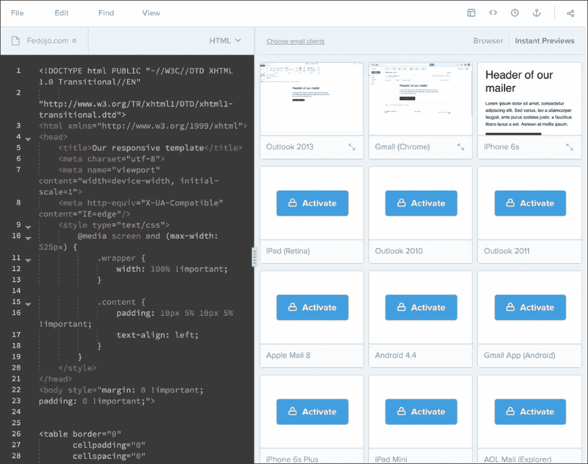

# 第十一章。邮件基础

这一章是关于建立邮件和创建正确结构的基本方面。因为为邮件程序构建正确的结构并不容易，而且这仍然与旧的关于 HTML 结构的学校思想有关，所以只有少数教程从头到尾展示了如何做到这一点。为什么呢？开始吧！

在本章中，我们将介绍:

*   为邮件创建一个简单的结构
*   在邮件中找出什么是可能的，什么是不可能的
*   比较最知名的邮件客户端，包括 Outlook 和 Gmail
*   回到基于表格的 HTML 结构的老派思维

# 测试你的邮件

测试电子邮件的过程很复杂，因为你需要在电脑上安装一堆电子邮件客户端。这当然与您需要安装以下内容的操作系统有关:

*   微软 Outlook 2007/2010/2013
*   Microsoft Outlook 2003/Express
*   微软 Outlook.com
*   iPhone 邮件
*   苹果邮件
*   谷歌邮箱
*   雅虎！电子邮件

这一堆电子邮件客户端相当长，测试所有这些客户端会有问题。但是你可以在你的工作流程中使用一些电子邮件测试器。有一个你可以使用的在线工具的列表，例如石蕊试纸，这将在本章后面描述。

# 回到餐桌

表格结构是构建防弹电子邮件模板最流行的方法。看起来像是过去的爆炸。因此，让我们带着过去的味道，开始创建正确的结构:

```html
<!DOCTYPE html PUBLIC "-//W3C//DTD XHTML 1.0 Transitional//EN" "http://www.w3.org/TR/xhtml1/DTD/xhtml1-transitional.dtd">
<html >
<head>
    <meta http-equiv="Content-Type" content="text/html; charset=utf-8"/>
    <meta name="viewport" content="width=device-width"/>
    <meta name="format-detection" content="telephone=no">
    <title>Untitled Document</title>
</head>
<body>
<style type="text/css">
    .class {} /* here will be your code */
</style>
<table width="100%" border="0" cellspacing="0" cellpadding="0">
    <!-- HERE your content -->
</table>
</body>
</html>
```

你可能会问，“但是 HTML5 声明在哪里，为什么链接`rel`标签没有包含样式？”这是因为电子邮件客户端中包含旧的 HTML 解释器，而使用较新的`doctype`会产生兼容性问题。目前，我们有一副骨架。让我们开始写风格:

那么我们为什么要使用这部分代码呢？

```html
<meta name="format-detection" content="telephone=no">
```

这个代码与一个 iOS 特有的问题有关。它会改变输入电话号码的行为，该电话号码(在 iOS 上)会被检测到并更改为交互式链接，您可以单击该链接并开始电话呼叫。

## 重置样式

在 CSS 代码中，有很多代码应该用来在所有浏览器上重置一个行为。同样的情况也发生在邮寄者身上。有一堆声明你应该附加到你的风格部分，这将帮助你提供一个防弹邮件。那么作为一个重置者，我们可以添加什么呢？

```html
body {
    margin: 0;
    padding: 0;
    min-width: 100% !important;
}
```

删除边距和填充的第一个声明非常重要。这个声明是从标准的互联网浏览器中得知的。如你所见，`min-width`也发生了。如代码中所述，这是非常重要的一行检查！值中有`100% !important`。没错。值和`!important`之间没有空格。以下代码是电子邮件发送者的`reset`样式的一部分:

```html
body,
table,
td,
a {
    -webkit-text-size-adjust: 100%; // IOS specific
-ms-text-size-adjust: 100%; // Windows mobile
}

.ExternalClass {
    width: 100%;
}

.ExternalClass,
.ExternalClass p,
.ExternalClass span,
.ExternalClass font,
.ExternalClass td,
.ExternalClass div {
    line-height: 100%;
}
```

什么是`ExternalClass`？这个类与将在 Outlook 或 Hotmail 中显示的模板相关。将这一组类设置到您的`<style>`标签中是一个很好的方法。这将最大限度地减少特定电子邮件客户端上可能出现的问题。下面的代码包含 mso 前缀。这意味着它与微软 Office 有关。

```html
table {
    mso-table-lspace: 0pt;
    mso-table-rspace: 0pt;
}
```

此代码与微软 Outlook 相关。它将重置边框中的额外空间:

```html
#outlook a{
    padding:0;
}

h1,
h2,
h3,
h4,
h5,
h6 {
    color: <your_color>!important;
}

h1 a,
h2 a,
h3 a,
h4 a,
h5 a,
h6 a {
    color: <your_color>!important;
}

h1 a:active,
h2 a:active,
h3 a:active,
h4 a:active,
h5 a:active,
h6 a:active {
    color: <your_color>!important;
}

h1 a:visited,
h2 a:visited,
h3 a:visited,
h4 a:visited,
h5 a:visited,
h6 a:visited {
    color: <your_color>!important;
}

img{
    -ms-interpolation-mode:bicubic;
    border: 0;
    height: auto;
    line-height: 100%;
    outline: none;
    text-decoration: none;
}
```

# 通过媒体查询锁定特定设备

要构建一个防弹邮件程序，您需要为一些特定的电子邮件客户端和设备使用特定的代码。这更难做到，因为调试有问题(没有好的调试器/检查器来实时检查行为)。我们需要哪些设备？让我们创建一个列表:

*   带视网膜和非视网膜显示屏的 iPad 或 iPhone
*   安卓设备具有:
    *   低密度(像素比小于 1)
    *   中等密度(像素比等于 1)
    *   高密度(像素比大于 1)

        ```html
        @media only screen and (max-device-width: 480px) {
        }
        ```

这套设备可以搭配平板电脑和小屏幕:

```html
@media only screen and (min-device-width: 768px) and (max-device-width: 1024px) {
}
```

视网膜显示是从苹果手机、苹果平板电脑和苹果平板电脑等 iOS 设备上了解到的。这些设备可以作为此媒体查询的目标:

```html
@media only screen and (-webkit-min-device-pixel-ratio: 2) {
}
```

目标低密度安卓布局:

```html
@media only screen and (-webkit-device-pixel-ratio: .75) {
}
```

目标中密度安卓布局:

```html
@media only screen and (-webkit-device-pixel-ratio: 1) {
}
```

目标高密度安卓布局:

```html
@media only screen and (-webkit-device-pixel-ratio: 1.5) {
}
```

如果你想让以 Outlook 2007 和 2010 为目标，你需要使用一个 HTML 条件结构。这将是这样的:

```html
<!--[if gte mso 9]>
<style>
    /* Your code here */
</style>
<![endif]-->
```

## 电子邮件模板中的 CSS 属性

重要的是记住你可以使用哪些属性，有哪些例外。这些知识会让你避免很多紧张的情况。让我们列出它们:

<colgroup class="calibre15"><col class="calibre16"> <col class="calibre16"></colgroup> 
| 

财产

 | 

特定客户端/设备的问题

 |
| --- | --- |
| `direction` | - |
| `font` | - |
| `font-family` | - |
| `font-style` | - |
| `font-variant` | - |
| `font-size` | - |
| `font-weight` | - |
| `letter-spacing` | - |
| `line-height` | (iOS)默认字体大小为 13px |
| `text-align` | (Outlook)不要将行高附加到`TD`元素。建议将该属性附加到`P`元素中。 |
| `text-decoration` | - |
| `text-indent` | - |
| `background` | (Outlook)不支持背景图像 |
| `background-color` | - |
| `border` | - |
| `padding` | (Outlook)元素不支持填充:`<p>``<div>``<a>` |
| `width` | (Outlook)元素不支持宽度:`<p>``<div>``<a>` |
| `list-style-type` | - |
| `border-collapse` | - |
| `table-layout` | - |

正如您所看到的，有很多属性在所有电子邮件客户端上的工作方式不同。这是一个很大的问题，但是有了基本的知识，你就会知道哪个元素可以用 CSS 来描述。邮件程序最大的问题是定位，这是不支持的。例如，在大多数情况下，当文本溢出一些图像时，您需要使用包含文本的图像。

## 响应性电子邮件模板

这本书的这一部分可以引发一场大讨论，因为在所有的电子邮件客户端中根本不可能构建响应性电子邮件。这是一份工作草案，可以作为您的电子邮件的基础:

```html
<!DOCTYPE html PUBLIC "-//W3C//DTD XHTML 1.0 Transitional//EN"
        "http://www.w3.org/TR/xhtml1/DTD/xhtml1-transitional.dtd">
<html >
<head>
    <title>Our responsive template</title>
    <meta charset="utf-8">
    <meta name="viewport" content="width=device-width, initial-scale=1">
    <meta http-equiv="X-UA-Compatible" content="IE=edge"/>
    <style type="text/css">
        @media screen and (max-width: 525px) {
            .wrapper {
                width: 100% !important;
            }

            .content {
                padding: 10px 5% 10px 5% !important;
                text-align: left;
            }
        }
</style>
</head>
<body style="margin: 0 !important;
padding: 0 !important;">

<table border="0"
       cellpadding="0"
       cellspacing="0"
       width="100%">
    <tr>
        <td bgcolor="#ffffff"
            align="center"
            style="padding: 10px;">
            <table border="0"
                   cellpadding="0"
                   cellspacing="0"
                   width="500"
                   class="wrapper">
                <tr>
                    <td>
                        <table width="100%"
                               border="0"
                               cellspacing="0"
                               cellpadding="0">
                            <tr>
                                <td align="left"
                                    style="font-size: 40px;
                font-family: Helvetica, Arial, sans-serif;
   color: #000000;
                padding-top: 10px;"
                                 class="content">Header of our mailer
                                </td>
                            </tr>
                            <tr>
                                <td align="left"
                                    style="padding: 20px 0 0 0;
              font-size: 16px;
              line-height: 25px;
              font-family: Helvetica, Arial, sans-serif;
              color: #000000;
              padding-bottom: 30px;"
class="content">Lorem ipsum dolor sit amet, consectetur adipiscing elit. Sed
                                    varius, leo a ullamcorper feugiat, ante purus sodales justo, a faucibus libero lacus
                                    a est. Aenean at mollis ipsum.
                                </td>
                            </tr>
                            <tr>
                                <td align="center" class="content">
                                    <table width="100%"
                                           border="0"
                                           cellspacing="0"
                                           cellpadding="0">
                                        <tr>
                                            <td align="left">
                                                <table
                                                      border="0"
                                                      cellspacing="0"
                                                      cellpadding="0">
                                            <tr>
                                              <td align="center"
                                              bgcolor="#000"><a href="#"
                                              target="_blank"
                                              style="font-size: 20px;
                        font-family: Helvetica, Arial, sans-serif;
                        color: #ffffff;
                        text-decoration: none;
                        color: #ffffff;
                        text-decoration: none;
                        padding: 10px 20px;
    display: inline-block;">
                                                    Lorem ipsum click
                                                        </a>
                                                        </td>
                                                    </tr>
                                                </table>
                                            </td>
                                        </tr>
                                    </table>
                                </td>
                            </tr>
                        </table>
                    </td>
                </tr>
            </table>

        </td>
    </tr>

</table>

</body>
</html>
```

如你所见，代码很多……但是当我们要把它和正常的网站对比的时候，效果就没那么大了。下面的截图显示了它在宽度大于 520px 的桌面浏览器中的外观:



在较小的浏览器(小于 520 px)中，您将看到以下内容:


# 内联电子邮件模板

当您使用单独的 CSS 文件或 CSS 代码写在`<style>`部分—[http://foundation.zurb.com/e-mails/inliner-v2.html](http://foundation.zurb.com/e-mails/inliner-v2.html)时，电子邮件模板的内联是推送项目之前非常重要的过程。

# 电子邮件模板开发技巧

像其他与前端开发相关的流程一样，这个应该从准备好的设计开始。真正的网页设计师知道一个好网站的边界在哪里，也应该知道与电子邮件相关的边界在哪里。全球电子邮件的创建过程有很多限制。这就是为什么参与这个过程的设计者应该知道可以在 HTML 电子邮件模板中使用的特性。

## ZURB 的电子邮件模板框架 INK

这个开发过程更简单，有一些收集测试过的代码片段的框架。ZURB 在创建了名为 Foundation 的伟大前端框架后，创建了 INK 作为电子邮件模板的框架。有关该框架的完整信息，建议您访问[http://foundation.zurb.com/e-mails.html](http://foundation.zurb.com/e-mails.html)。



基于 INK 的电子邮件模板的创建对开发人员非常友好。框架收集了许多易于使用的组件，如网格系统、按钮、缩略图，您可以轻松地将其添加到模板中。此外，还有一个可调参数列表，如檐槽、全局填充和边距。为了更深入地了解 ZURB INK2 框架，建议查看官方文档:[http://foundation.zurb.com/emails/docs/](http://foundation.zurb.com/emails/docs/)。

# 用石蕊测试

当您想要收集所有的测试环境时，电子邮件模板的测试相当复杂。当你在大多数已知的电子邮件客户端中使用 Litmus 来制作你的电子邮件模板截图时，事情会变得更容易。


创建模板后，您需要复制您的 HTML 代码并将其粘贴到系统中。如果你的电子邮件有一些图像托管在某个服务器上，你可以发送一封电子邮件到你的帐户。石蕊在应用端创建您的专用电子邮件地址。当你发送邮件到这个地址时，你可以用石蕊试纸测试这封邮件。



正如您在上面的屏幕上看到的，您可以在大多数已知的电子邮件客户端中检查您的代码。截图是在石蕊账号的试用版上制作的，说明了为什么一些视图没有被激活。

# 总结

准备防弹电子邮件模板是一个复杂的过程。为什么呢？正如您所看到的，当您熟悉标准的网络浏览器时，HTML 和 CSS 的行为非常奇怪，并且不符合逻辑。当然，所有这些过程都是可以描述的，并且有一个工作流程可以帮助您在没有紧张情况下构建邮件程序。电子邮件模板带来的限制列表非常长，但是良好的电子邮件模板开发基础知识和经验可以让您成为这一前端领域的专家。

在下一章中，我们将讨论 CSS 代码的可伸缩性和模块化。您将了解更多关于方法和命名约定的知识。开始吧！