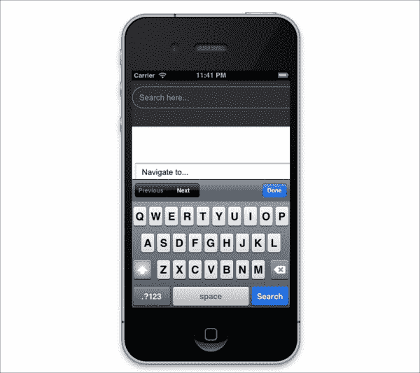
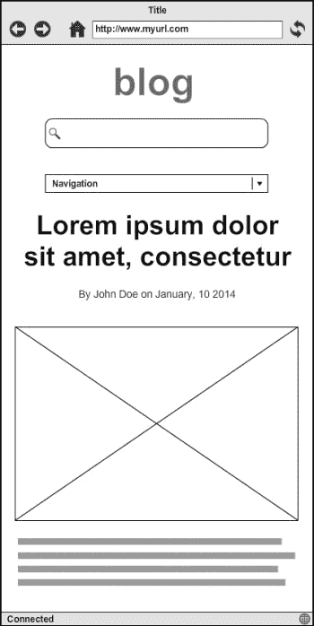
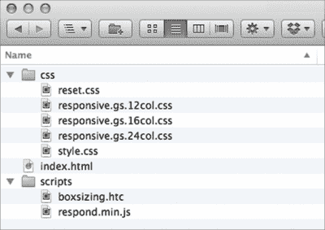
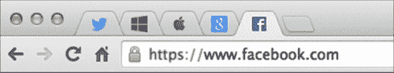

# 三、使用 ResponsiveGS 构建一个简单的响应式博客

在前一章中，我们安装了一些有助于我们的项目的软件。 在这里，我们将开始我们的第一个项目。 在这个项目中，我们将建立一个响应式博客。

*拥有一个博客对于一个公司来说是必不可少的。 甚至几家财富 500 强公司,如联邦快递(http://outofoffice.van.fedex.com/),微软(https://blogs.windows.com/)和通用汽车(General Motors)【显示】([http://fastlane.gm.com/)官方企业博客。 博客是公司](http://fastlane.gm.com/)发布官方新闻的一个很好的渠道，也是与客户和大众联系的一个很好的渠道。 让博客具有响应性是让可能通过手机或平板电脑等移动设备访问网站的读者更容易访问博客的方法。*

*由于我们在第一个项目中构建的博客不会那么复杂，这一章将是那些刚刚接触响应式网页设计的人的理想章节。*

*那么让我们开始吧。*

总而言之，本章将涵盖以下主题:

*   深入的反应。 gs 组件
*   检查博客蓝图和设计
*   整理网站文件和文件夹
*   研究 HTML5 元素的语义标记
*   构造博客标记

# 反应灵敏。 gs 组件

正如我们在[第一章](1.html#BE6O2-db71610abfe249d1a7f65c5cb7ebb0eb "Chapter 1. Responsive Web Design")，*响应式网页设计*中提到的，响应式网页设计。 gs 是一个轻量级的 CSS 框架。 它来了只有建立响应性网站的最低要求。 在这一节中，我们将看到 response .gs 中包含了什么。

## 上课

响应。 gs 提供了一系列可重用的类，以形成响应式网格，使 web 设计师构建网页布局更容易、更快。 这些类包含经过仔细校准和测试的预设样式规则。 因此，我们可以简单地在 HTML 元素中放入这些类来构建响应式网格。 下面是 response .gs 中的类列表:

<colgroup class="calibre17"><col class="calibre18"> <col class="calibre18"></colgroup> 
| 

类名

 | 

使用

 |
| --- | --- |
| `container` | 我们使用这个类来设置网页容器，并将其对齐到浏览器窗口的中心。 然而，这个类没有给出元素的宽度。 响应。 Gs 让我们可以根据我们的要求灵活地设置宽度。 |
| `row`，`group` | 我们使用这些两个类包装一组列。 这两个类都设置了所谓的自清除浮动，它修复了由 CSS`float`属性元素引起的一些布局问题。关于 CSS`float`属性及其对网页布局可能造成的问题，请查阅以下参考资料:

*   *The Mystery Of The CSS Float Property*by Louis Lazaris([http://www.smashingmagazine.com/2009/10/19/the-mystery-of-css-float-property/](http://www.smashingmagazine.com/2009/10/19/the-mystery-of-css-float-property/))
*   *All About Floats*by Chris Coyier([http://css-tricks.com/all-about-floats/](http://css-tricks.com/all-about-floats/))

 |
| `col` | 我们使用这个类来定义网页的列。 这个类使用 CSS`float`属性设置。 因此，用这个类设置的任何元素都必须包含在具有`row`或`group`类的元素中，以避免由 CSS`float`属性引起的问题。 |
| `gutters` | 我们使用这个类在与前面的`col`类设置的列之间添加空格。 |
| `span_{x}` | 这个类定义列宽度。 所以我们将这个类与`col`类结合使用。响应。 gs 有三种不同的网格，这给了我们组织网页布局的灵活性。 响应。 Gs 有 12、16 和 24 列格式。 这些变量设置在三个独立的样式表中。 如果你下载响应式。 gs 包，然后打开它，您将发现三个样式表，分别名为`responsive.gs.12col.css`、`responsive.gs.16col.css`和`responsive.gs.24col.css`。这些样式表之间的唯一区别是其中定义的`span_`类的数量。 很明显，24 列格式样式表拥有最多的`span_{x}`类; 课堂从`span_1`延伸至`span_24`。 如果你需要更大的灵活性来划分你的页面，那么使用 24 列的响应式格式。 g 是正确的。 不过每一栏可能都太窄了。 |
| `clr` | 提供了这个类来解决浮动问题。 当使用 row 类在语义上不合适时，我们使用这个类。 |

现在，让我们看看如何在一个例子中应用它们来发现它们是如何真正工作的。 很多时候，你会看到一个网页被分成多列结构。 考虑到这是我们这里的例子; 我们可以做以下来构建一个包含两列内容的网页:

```html
<div class="container">
<div class="row gutters">
  <div class="col span_6">
    <h3>Column 1</h3>
    <p>Lorem ipsum dolor sit amet, consectetur adipisicing    
elit. Veniam, enim.</p>
  </div>
  <div class="col span_6">
    <h3>Column 2</h3>
    <p>Lorem ipsum dolor sit amet, consectetur adipisicing
elit. Reiciendis, optio.</p>
  </div>
</div>
</div>
```

从前面的代码片段可以看到，我们首先添加了包装所有内容的`container`。 然后，接下来是带有`row`类的`div`来包装列。 同时，我们还添加了`gutters`类，这样两列之间就会有空格。 在本例中，我们使用 12 列格式。 因此，为了将页面分成两个相等的列，我们为每个列添加了`span_6`类。 这就是说，根据我们使用的变量，`span_{x}`类的数量应该等于 12、16 或 24，以便列覆盖整个容器。 因此，如果我们使用 16 列格式，例如，我们可以添加`span_8`来代替。

在浏览器中，我们将看到以下输出:


# 使用 HTML5 元素进行语义标记

Paul Boag 在他的文章*语义代码:什么? 为什么? 如何?* ([http://boagworld.com/dev/semantic-code-what-why-how/](http://boagworld.com/dev/semantic-code-what-why-how/))写道:

> HTML 最初的目的是作为一种描述文档内容的方法，而不是作为一种使它看起来赏心悦目的方法。

不像传统的内容渠道，如报纸或杂志，显然是为人类服务的，网络是由人类和机器阅读，如搜索引擎和帮助视障人士浏览网站的屏幕阅读器。 所以我们鼓励让我们的网站结构语义化。 语义标记允许这些机器更好地理解内容，并使不同格式的内容更易于访问。

基于这个原因，HTML5 在其使命中引入了一堆新元素，使 web 更加语义化。 下面的是我们将在博客中使用的元素列表:

<colgroup class="calibre17"><col class="calibre18"> <col class="calibre18"></colgroup> 
| 

元素

 | 

描述

 |
| --- | --- |
| `<header>` | 元素的作用是:指定节的标题。 虽然此元素通常用于指定网站的标题，但它也适用于使用此元素来指定，例如，我们放置标题和文章的其他支持部分的文章标题。 我们可以在一个页面中多次使用`<header>`。 |
| `<nav>` | `<nav>`元素用于表示一组链接，该链接用于网站的主要导航或页面的一个部分。 |
| `<article>` | 元素`<article>`是完全不言自明的。 此元素指定网站的文章，例如博客条目或主页内容。 |
| `<main>` | 元素`<main>`定义了节的主要部分。 此元素可用于执行诸如包装文章内容之类的操作。 |
| `<figure>` | 元素`<figure>`用于指定文档图形，如图表、插图和图像。 如果需要，可以使用`<figure>`元素与`<figcaption>`一起添加图形的标题。 |
| `<figcaption>` | 如前所述，`<figcaption>`表示文档图形的标题。 因此，必须将与元素串联使用。 |
| `<footer>` | 与`<header>`元素类似，`<footer>`元素通常用于指定网站页脚。 但它也可以用来表示一段的末端或最低部分。 |

### 提示

参考 cheat表格[http://websitesetup.org/html5-cheat-sheet/](http://websitesetup.org/html5-cheat-sheet/)，在 HTML5 中找到更多新的 HTML 元素。

## HTML5 搜索输入类型

除了新元素之外，我们还将在博客中添加一种特殊的新类型的输入，search。 正如名称所暗示的，搜索输入类型用于指定搜索输入。 在桌面浏览器中，您可能看不到显著的差异。 你可能也不会立即看到搜索输入类型如何给网站和用户带来优势。

搜索输入类型将提升移动用户的体验。 iOS、Android 和 Windows Phone 等移动平台已经配备了上下文屏幕键盘。 键盘会根据输入类型而改变。 以下截图可以看到，键盘上显示**Search**按钮，方便用户进行搜索:



### HTML5 占位符属性

HTML5 引入了一个名为`placeholder`的新属性。 规范将此属性描述为短提示(一个单词或短语)，用于在控件没有值时帮助用户进行数据输入，如下例所示:

```html
<input type="search" name="search_form " placeholder="Search here…"> 
```

你会看到`placeholder`属性中**Search here…**显示在输入栏中，如下截图所示:


在过去，我们依靠 JavaScript 来达到类似的效果。 现在，有了`placeholder`属性，应用变得简单多了。

## HTML5 在 Internet Explorer

这些新的 HTML 元素使我们的文档标记更具描述性和意义。 不幸的是，Internet Explorer 6、7 和 8 无法识别它们。 因此，处理这些元素的选择器和样式规则是不适用的; 就好像这些新元素没有包含在 Internet Explorer 字典中一样。

这就是一个名为 HTML5Shiv 的 polyfill发挥作用的地方。 我们将包括 HTML5Shiv([https://github.com/aFarkas/html5shiv](https://github.com/aFarkas/html5shiv))，以使 Internet Explorer 8 及其低版本承认这些新元素。 请阅读 Paul Irish 的博文([http://paulirish.com/2011/the-history-of-the-html5-shiv/](http://paulirish.com/2011/the-history-of-the-html5-shiv/))，了解 HTML5Shiv 背后的历史; 它是如何发明和发展的。

此外，旧的 Internet Explorer 版本将无法呈现 HTML5`placeholder`属性中的内容。 幸运的是，我们可以使用 polyfill([https://github.com/UmbraEngineering/Placeholder](https://github.com/UmbraEngineering/Placeholder))来模拟旧的 Internet Explorer 中的`placeholder`属性功能。 我们稍后也会在博客中使用它。

## A look into polyfills in the Responsive。 gs 包

响应。 gs 也被与两个腻子一起提供，以启用某些在 Internet Explorer 6、7 和 8 中不支持的特性。 从现在开始，让我们把这些浏览器版本称为“老 ie”，好吗?

### 盒装上浆填料

第一个填充可以通过一个名为`boxsizing.htc`的**HTML 组件**(**HTC**)文件使用。

HTC 文件与 JavaScript 非常相似，通常与 Internet Explorer 特有的 CSS 属性`behavior`一起使用，为 Internet Explorer 添加特定的功能。 响应式附带的`boxsizing.htc`文件。 gs 将应用类似于 CSS3`box-sizing`属性的功能。

响应。 gs 将`boxsizing.htc`文件包含在样式表中，如下所示:

```html
* { 
  -webkit-box-sizing: border-box;
  -moz-box-sizing: border-box;
  box-sizing: border-box;
  *behavior: url(/scripts/boxsizing.htc); 
}
```

如前面的代码片段所示，响应式。 gs 应用`box-sizing`属性并包含带有星号选择器的`boxsizing.htc`文件。 星号选择器也称为通配符选择器; 它选择文档中的所有元素，也就是说，在本例中，`box-sizing`将影响文档中的所有元素。

### 注意事项

为了让 polyfill 工作，`boxsizing.htc`文件路径必须是绝对路径或相对于 HTML 文档。 这是一个黑客。 这是我们强制使用的东西，使旧的 Internet Explorer 表现得像一个现代浏览器。 按照 W3C 标准，使用像前面这样的 HTC 文件是无效的。

有关宏达电文件([http://msdn.microsoft.com/en-us/library/ms531018(v=vs.85).aspx](http://msdn.microsoft.com/en-us/library/ms531018(v=vs.85).aspx))，请参考微软本页。

### CSS3 媒体查询 polyfill

响应式脚本附带的第二个 polyfill 脚本。 gs 是`respond.js`([https://github.com/scottjehl/Respond](https://github.com/scottjehl/Respond))，这将“神奇地”使 CSS3`respond.js`开箱即可工作。 不需要配置; 我们可以简单地将脚本链接到`head`标签中，如下所示:

```html
<!--[if lt IE 9]>
<script src="respond.js"></script>
<![endif]-->
```

在前面的代码中，我们将脚本封装在`<!--[if lt IE 9]>`中，使脚本只在旧的 Internet Explorer 中加载。

# 检查博客的线框

建网站和建房子差不多; 在我们堆砌所有砖块之前，我们需要检查每个角落的规格。 因此，在我们开始构建博客之前，我们将检查博客的线框，看看博客是如何布局的，以及将在博客上显示的内容。

让我们看看下面的线框。 这个线框显示了在桌面屏幕上查看博客的布局:


正如你在前面的截图中看到的，这个博客将是简单明了的。 在标题中，博客将有一个标志和一个搜索表单。 在标题的下方，我们将依次放置菜单导航、博客文章、导航到下一个或上一个文章列表的分页以及页脚。

博客文章一般为，包括标题、发表日期、文章特色图片、文章摘录。 这个线框是博客布局的一个抽象。 我们使用它作为我们的视觉参考如何安排博客布局。 所以，尽管我们在前面的线框中只显示了一篇文章，我们实际上会在后面的实际博客中添加更多的文章。

以下是压缩视口宽度时的博客布局:



当视口宽度变窄，博客布局适应。 值得注意的是，当我们改变布局时，我们不应该改变内容流和 UI 层次结构。 确保桌面版和手机版布局的一致性将有助于用户快速熟悉网站，无论他们在哪里浏览网站。 正如在前面的线框中所示，我们仍然按照相同的顺序设置 UI，尽管为了适应有限的区域，它们现在是垂直堆叠的。

从这个线框中值得一提的一件事是导航变成了一个 HTML 下拉选择。 我们将在构建博客的过程中讨论如何做到这一点。

现在，既然我们已经准备好了工具并签出了博客布局，我们就可以开始项目了。 我们将从创建和组织项目目录和资产开始。

# 组织项目目录和文件

通常，我们必须链接到某些文件，例如样式表和图像。 不幸的是，网站不是一个聪明的东西; 他们自己找不到这些文件。 因此，我们必须正确设置文件路径，以避免断开链接错误。

这就是为什么有组织目录和文件是必要的，当它涉及到建设网站。 当我们与一组人一起工作在一个非常大的项目，并且有几十到几百个文件要处理时，这将是非常重要的。 管理不善的目录会让团队中的任何人发疯。

拥有组织良好的目录将帮助我们最小化断开链接的潜在错误。 它还将使项目在未来更易于维护和扩展。

# 行动时间-创建和组织项目目录和资产

执行以下步骤设置项目的工作目录:

1.  转到`htdocs`文件夹。 提醒一下，这个文件夹是本地服务器中位于:
    *   `C:\xampp\htdocs`在 Windows
    *   `/Applications/XAMPP/htdocs`在 OSX
    *   Ubuntu 中的`/opt/lampp/htdocs`
2.  创建名为`blog`的新文件夹。 从现在开始，我们将把这个文件夹称为项目目录。
3.  创建一个名为`css`的新文件夹来存储样式表。
4.  创建一个名为`image`的新文件夹来存储映像。
5.  创建一个名为`scripts`的新文件夹来存储 JavaScript 文件。
6.  Create a new file named `index.html`; this HTML file will be the main page of the blog. Download the Responsive.gs package from [http://responsive.gs/](http://responsive.gs/). The package comes in the `.zip` format. Extract the package to unleash the files within the package. There, you will find a number of files, including style sheets and JavaScript files, as you can see from the following screenshot:

    

    在 response .gs 中发布的文件

7.  将`responsive.gs.12col.css`移动到项目目录的`css`文件夹; 它是响应式的唯一样式表。 我们需要的东西。
8.  将`boxsizing.htc`移动到项目目录的`scripts`文件夹中。
9.  响应式中附带的`respond.js`文件。 Gs 包过期。 让我们从 GitHub 库([https://github.com/scottjehl/Respond/blob/master/src/respond.js](https://github.com/scottjehl/Respond/blob/master/src/respond.js))下载最新版本的response .js，并把它放在项目目录的`scripts`文件夹中。
10.  从[https://github.com/aFarkas/html5shiv](https://github.com/aFarkas/html5shiv)下载HTML5Shiv。 将 JavaScript 文件`html5shiv.js`放到`scripts`文件夹中。
11.  我们还将使用由 James Brumond([https://github.com/UmbraEngineering/Placeholder](https://github.com/UmbraEngineering/Placeholder))开发的占位符填充。 James Brumond 开发了四种不同的 JavaScript 文件来满足不同的场景。
12.  这里我们将使用的脚本是`ie-behavior.js`，因为这个脚本专门针对 Internet Explorer。 下载脚本([https://raw.githubusercontent.com/UmbraEngineering/Placeholder/master/src/ie-behavior.js](https://raw.githubusercontent.com/UmbraEngineering/Placeholder/master/src/ie-behavior.js))并将其重命名为`placeholder.js`，以便更明显地表明该脚本是一个占位符填充。 把它放在项目目录的`scripts`文件夹中。
13.  The blog will need a few images to use as the post's featured image. In this module, we will use the images shown in the following screenshot, consecutively taken by Levecque Charles ([https://twitter.com/Charleslevecque](https://twitter.com/Charleslevecque)) and Jennifer Langley ([https://jennifer-langley.squarespace.com/photography/](https://jennifer-langley.squarespace.com/photography/)):

    

    ### 提示

    在 Unsplash([http://unsplash.com/](http://unsplash.com/))找到更多免费高清图像。

14.  We will add a favicon to the blog. A favicon is a tiny icon that appears on the browser tab beside the title, which will be helpful for readers to quickly identify the blog. The following is a screenshot that shows a number of pinned tabs in Chrome. I bet that you are still able to recognize the websites within these tabs just by seeing the favicon:

    

    谷歌 Chrome 固定标签

15.  Further, we will also add the iOS icon. In Apple devices such as iPhone and iPad, we can pin websites on the home screen to make it quick to access the website. This is where the Apple icon turns out to be useful. iOS (the iPhone/iPad operating system) will show the icon we provide, as shown in the following screenshot, as if it was a native application:

    

    网站添加到 iOS 主屏幕

16.  These icons are provided in the source files that come along with this module. Copy these icons and paste them in the image folder that we have just created in step 5, as shown in the following screenshot:

    

    ### 提示

    用 AppIconTemplate 快速轻松地创建 favicons 和 iOS 图标。

    AppIconTemplate([http://appicontemplate.com/](http://appicontemplate.com/))是一个 Photoshop 模板，可以方便我们设计图标。 该模板还附带了 Photoshop Actions，只需点击几下就可以生成图标。

## *刚才发生了什么?*

我们刚刚为这个项目创建了一个目录，并在该目录中放置了几个文件。 这些文件包括响应式文件。 gs 样式表和 JavaScript 文件，图像和图标，以及一些腻子。 我们还创建了一个`index.html`文件，它将作为博客的主页。 此时，项目目录应该包含如下截图所示的文件:


工作目录中的当前文件和文件夹

## 有一个英雄-使目录结构更有组织

对于如何组织项目的目录结构，许多人都有自己的偏好。 上一节中显示的只是一个示例，说明了我个人如何管理这个项目的目录。

尝试进一步使目录更有组织，并满足您自己对组织的偏好。 以下是一些常见的想法:

*   将文件夹名称缩短为`js`和`img`，而不是 JavaScript 和 Image
*   将文件夹`js`、`img`和`css`分组到一个名为`assets`的新文件夹中。

## Pop quiz - using polyfill

在本模块的早些时候，我们讨论了 polyfill，也提到了几个我们将在博客中实现的 polyfill 脚本。

Q1。 你认为什么时候使用填充物比较合适?

1.  当在 Internet Explorer 6 中查看博客时。
2.  当浏览器不支持该特性时。
3.  当我们需要在网站上添加新功能时。
4.  我们可以在任何时候使用它。

# 博客的 HTML 结构

我们已经在前一节中设置了项目目录和文件的结构。 现在让我们开始构建博客标记。 如前所述，我们将使用许多 HTML5 元素来形成更有意义的 HTML 结构。

# 是时候行动起来了——建立博客

执行以下步骤构建博客:

1.  Open the `index.html` file that we have created in step 6 of the previous section *Time for action – creating and organizing project directories and assets*. Let's start by adding the most basic HTML5 structure as follows:

    ```html
    <!DOCTYPE html>
    <html lang="en">
    <head>
      <meta charset="UTF-8">
      <title>Blog</title>
    </head>
    <body>

    </body>
    </html>
    ```

    在这里，设置`DOCTYPE`，它被带到了最低限度的形式。 HTML5 中的`DOCTYPE`格式现在比其对应的 HTML4 的`DOCTYPE`格式更短、更清晰。 然后，设置页面的语言，在本例中设置为`en`(英语)。 你可以把它换成你当地的语言; 在[http://en.wikipedia.org/wiki/List_of_ISO_639-1_codes](http://en.wikipedia.org/wiki/List_of_ISO_639-1_codes)中找到您的本地语言代码。

    我们还将字符编码设置为`UTF-8`，以使浏览器能够将 Unicode 字符(如`U+20AC`)呈现为可读格式`€`。

2.  Below the `charset` meta tag in the `head` tag, add the following meta:

    ```html
    <meta http-equiv="X-UA-Compatible" content="IE=edge">
    ```

    Internet Explorer 有时会表现得很奇怪，它会突然切换到兼容性模式，并呈现在 Internet Explorer 8 和 7 中所看到的页面。 这个元标签的添加将防止这种情况发生。 它将迫使 Internet Explorer 使用 Internet Explorer 中最新标准的最高支持来渲染页面。

3.  Below the `http-equiv` meta tag, add the following meta viewport tag:

    ```html
    <meta name="viewport" content="width=device-width, initial-scale=1">
    ```

    正如我们在[第一章](1.html#BE6O2-db71610abfe249d1a7f65c5cb7ebb0eb "Chapter 1. Responsive Web Design")，*响应式 Web 设计*中提到的，前面的视口元标签规范定义了网页视口宽度，以遵循设备视口大小。 在第一次打开网页时，它还定义了网页比例为 1:1。

4.  Link the Apple icon with the `link` tag, as follows:

    ```html
    <link rel="apple-touch-icon" href="image/icon.png">
    ```

    根据苹果的官方说明，你通常需要包含多种来源的图标，以迎合 iPhone、iPad 和带有 Retina 屏幕的设备。 这对我们的博客来说并不是必需的。 诀窍是我们通过一个单一的源提供所需的最大尺寸，即 512px 的正方形，如前一个截图所示。

    ### 注意事项

    去苹果公司文档,指定一个 web 页面图标为 web 剪辑(https://developer.apple.com/library/ios/documentation/AppleApplications/Reference/SafariWebContent/ConfiguringWebApplications/ConfiguringWebApplications.html),供进一步参考。

5.  在标题下方添加一个描述元标签，如下:

    ```html
    <meta name="description" content="A simple blog built using Responsive.gs">
    ```

6.  该博客的描述将显示在**搜索引擎结果页面**(**SERP**)。 在这一步中，我们将构造博客标题。 首先，让我们添加 HTML5`<header>`元素以及用于样式化的类，以包装头部内容。 在`body`标签中添加
7.  Within the `<header>` element that we added in step 9, add a new `<div>` element with the `container` and `gutters` class, as follows:

    ```html
    <header class="blog-header row">
    <div class="container gutters">

    </div>
    </header>
    ```

    参考本章前面显示的表格，`container`类将博客标题内容对齐到浏览器窗口的中心，而`gutters`类将在列之间添加空格，我们将在接下来的步骤中添加空格。

8.  创建一个新列，包含带有`<div>`元素的博客徽标/名称和响应式元素。 gs`col`和`span_9`类将`<div>`元素设置为列并指定宽度。 不要忘记添加类来添加自定义样式:

    ```html
    <header class="blog-header row">
    <div class="container gutters">
           <div class="blog-name col span_9">
    <a href="/">Blog</a>
    </div>
    </div>
    </header>
    ```

9.  Referring to the blog wireframe, we will have a search form next to the blog logo/name. On that account, create another new column with a `<div>` element together with the `col` and `span_3` class of Responsive.gs, and the input search type. Add the `<div>` element below the logo markup as follows:

    ```html
    <header class="blog-header row">
    <div class="container gutters">
           <div class="blog-name col span_9">
       <a href="/">Blog</a>
    </div>
    <div class="blog-search col span_3">
               <div class="search-form">
                 <form action="">
     <input class="input_full" type="search"      placeholder="Search here...">
      </form>
                </div>
       </div>
    </div>
    </header>
    ```

    正如我们在本章前面提到的，我们使用输入搜索类型来提供更好的用户体验。 这个输入将显示带有的移动屏幕键盘，一个特殊的键允许用户点击**Search**按钮并立即运行搜索。 我们还添加了带有 HTML5`placeholder`属性的占位符文本，以向用户显示他们可以通过输入字段在博客中执行搜索。

10.  构造完标题博客之后，我们将构造博客导航。 在这里，我们将使用 HTML5`nav`元素定义一个新的部分作为导航。 创建一个`nav`元素以及要样式化的支持类。 在标题结构下面添加`nav`元素，如下所示:
11.  在`nav`元素内部，使用`container`类创建一个`div`元素，以将导航内容对齐到浏览器窗口的中心:
12.  根据线框，博客将有五个项目的链接菜单。 我们将使用`ul`元素来布局这个链接。 在容器中添加链接，如下面的代码片段所示:
13.  Having done with constructing the navigation, we will construct the content section of the blog. Following the wireframe, the content will consist a list of posts. First, let's add the HTML5 `<main>` element to wrap the content below the navigation as follows:

    ```html
    ...
    </ul>  
    </nav>
    <main class="blog-content row">

    </main>
    ```

    我们使用`<main>`元素，因为我们认为文章是我们博客的主要部分。

14.  与其他博客部分(标题和导航)类似，我们添加了一个容器`<div>`来将博客文章对齐到中心。 在`<main>`元素中添加`<div>`元素:

    ```html
    <main class="blog-content row">
       <div class="container">

    </div>
    </main>
    ```

15.  现在我们将创建博客帖子标记。 把博客当成一篇文章。 因此，这里我们将使用`<article>`元素。 将`<article>`元素添加到容器`<div>`中，我们将在步骤 17 中添加

    ```html
    <main class="blog-content row">
    <div class="container">
      <article class="post row">

      </article>
    </div>
    </main>
    ```

16.  如前所述，`<header>`元素并不局限于定义头文件。 blog 可以用来定义一个部分的标题。 在本例中，除了 blog 标题之外，我们将使用`<header>`元素来定义文章标题部分，其中包含文章标题和发布日期。
17.  在 article 元素中添加`<header>`元素:

    ```html
    <article class="post row">
    <header class="post-header">
    <h1 class="post-title">
    <a href="#">Useful Talks &amp; Videos for Mastering CSS</a>
      </h1>
          <div class="post-meta">
         <ul>
            <li class="post-author">By John Doe</li>
            <li class="post-date">on January, 10 2014</li>
         </ul>
         </div>
    </header>
    </article>
    ```

18.  A picture is worth a thousand words. So, it's the norm to use an image to support the post. Here, we will display the image below the post header. We will group the featured image together with the post excerpt as the post summary, as shown in the following code:

    ```html
    ...
     </header>
     <div class="post-summary">
    <figure class="post-thumbnail">
    
    </figure>
    <p class="post-excerpt">Lorem ipsum dolor sit amet,   consectetur adipisicing elit. Aspernatur, sequi, voluptatibus, consequuntur vero iste autem aliquid qui et rerum vel ducimus ex enim quas!...<a href="#">Read More...</a></p>
      </div>
    </article>
    ```

    随后添加更多的帖子。 或者，你可以在其他帖子中排除帖子的特色图片。

19.  After adding a pile of posts, we will now add the post pagination. The pagination is a form of common page navigation that allows us to jump to the next or previous list of posts. Normally, the pagination is located at the bottom of the page after the last post item.

    博客的分页由两个链接组成，用于导航到下一个和上一个页面，还有一个小部分用于放置页码，以显示用户当前所在的页面。

20.  因此，在最后一篇文章之后添加以下代码:
21.  最后，我们将构造博客页脚。 我们可以使用 HTML5`<footer>`元素定义博客页脚。 页脚结构与页眉结构相同。 页脚有两列; 每一个分别包含博客页脚链接(或者，我们称之为二级导航)和版权声明。 这些柱子用`<div>`容器包裹。 在主体部分添加以下页脚，如下:

    ```html
          …
    </main> 
    <footer class="blog-footer row">
       <div class="container gutters">
         <div class="col span_6">
    <nav id="secondary-navigation"  class="social-   media">
              <ul>
               <li class="facebook">
    <a href="#">Facebook</a>
      </li>
               <li class="twitter">
    <a href="#">Twitter</a></li>
               <li class="google">
    <a href="#">Google+</a>
       </li>
             </ul>
           </nav>
         </div>
       <div class="col span_6">
    <p class="copyright">&copy; 2014\. Responsive  Blog.</p>
       </div>
       </div>
    </footer>
    ```

## *刚才发生了什么?*

我们刚刚构建了博客的 HTML 结构——标题、导航、内容和页脚。 假设您一直严格遵循我们的指示，您可以在 OS X 的`http://localhost/blog/`或`http://{coputer-username}.local/blog/`上访问该博客。

然而，由于我们还没有应用任何样式，你会发现博客看起来很普通，布局还没有组织:


博客出现在现阶段

我们将在下一章中设计这个博客的风格。

## 有一个英雄-创造更多的博客页面

在本模块中，我们只构建博客的主页。 但是，您可以通过创建更多页面来扩展博客，例如添加一个 about 页面、一个帖子内容页面和一个带有联系表单的页面。 你可以重用我们在本章中构建的 HTML 结构。 删除`<main>`元素中的任何内容，并根据您的需求将其替换为内容。

## Pop quiz - HTML5 元素

让我们以一些关于 HTML5 的简单问题来结束本章:

Q1。 `<header>`元素的用途是什么?

1.  它被用来表示网站的标题。
2.  它被用来代表一组介绍性和导航辅助设备。

Q2。 `<footer>`元素的用途是什么?

1.  它被用来表示网站页脚。
2.  它被用来表示一个区段的末端或最低部分。

第三季。 是否允许在一个页面中多次使用`<header>`和`<footer>`元素?

1.  是的，只要在语义上符合逻辑。
2.  不，这被认为是多余的。

# 总结

在本章中，我们开始了我们的第一个项目。 在本章的前面，我们探讨了响应式。 gs 组件，研究如何响应。 Gs 构造一个响应式网格，以及使用什么类来塑造网格。

我们还讨论了 HTML5，包括新元素，即在不支持特定特性的浏览器中模拟 HTML5 特性的腻子脚本。 然后，我们使用 HTML5 构建博客标记。

在下一章中，我们将更多地关注使用 CSS3 标记博客并添加一些 JavaScript。 我们还将调试博客中在旧 Internet Explorer 中出现的错误。