# 四、改进博客外观

*在上一章中，我们使用 HTML5 元素构建了从页眉部分到页脚部分的博客标记。 然而，这个博客目前还没有脸。 如果你用浏览器打开博客，你只会看到它是光秃秃的; 我们还没有写出它的外观风格。*

*在本章的整个过程中，我们将专注于用 CSS 和 JavaScript 装饰博客。 我们将使用 CSS3 来添加博客样式。 CSS3 带来了许多新的 CSS 属性，如`border-radius`、`box-shadow`和`box-sizing`，这些属性允许我们装饰网站，而不需要添加图像和额外的标记。 【5】*

然而，如前所述，CSS 属性仅适用于最新的浏览器版本。 Internet Explorer 6 到 8 不能识别这些 CSS 属性，并且不能在浏览器中输出结果。 因此，作为一种补充，我们还将使用一些腻子填充来使我们的博客在旧的 Internet Explorer 中显得更美观。

*这将是一个冒险的篇章。 我们走吧。*

在本章中，我们将涵盖以下主题:

*   我们将在博客中使用 CSS3 属性和 CSS 库
*   编译和缩小样式表和 javascript 与考拉
*   使用移动优先的方法组合博客样式规则
*   为桌面优化博客
*   用腻子填充在 ie 中修补博客

# 使用 CSS3

CSS3 提供了人们期待已久的属性`border-radius`和`box-shadow`，它们简化了在 HTML 中显示圆角和投影的旧而繁琐的方法。 除此之外，它还带来了一种新的伪元素类型，使我们能够通过 HTML5`placeholder`属性对输入字段中显示的占位符文本进行样式化。

让我们来看看它们是如何工作的。

## 使用 CSS3 创建圆角

在 90 年代，创建一个圆角是很复杂的。 添加一堆 HTML 标记、分割图像和制定多行风格的规则是不可避免的，正如Ben Ogle 在[http://benogle.com/2009/04/29/css-round-corners.html](http://benogle.com/2009/04/29/css-round-corners.html)的文章中所述。

CSS3 使得使用`border-radius`属性创建圆角变得更加简单，下面是一个例子:

```html
div {
  width: 100px; height: 100px;
  border-radius: 30px;
}
```

之前的样式规则将圆盒子角落(阅读*一个词在 CSS 盒模型在*部分第一章,*响应 Web 设计*)每个`30px`,如下图所示:


此外，我们也可以只圆到特定的角。 例如，下面的代码片段将只圆润右上角:

```html
div {
  width: 100px; height: 100px;
  border-top-right-radius: 30px;
}
```

## 创建投影

就像创建圆角一样，在过去的网站中，使用图像来创建阴影效果是不可避免的。 现在，通过引入`box-shadow`属性，添加投影变得很容易。 `box-shadow`属性由五个参数(或值)组成:

第一个参数指定阴影发生的位置。 可选参数。 设置值为`inset`，让阴影显示在框内，或者让它为空，显示框外的阴影。

第二个参数指定了**阴影垂直**和**水平距离**到框的距离。

第三个参数指定淡出阴影的**阴影模糊**; 一个更大的数字会产生一个更大但逐渐消失的阴影。

第四个参数指定**阴影展开**; 这个值与阴影模糊值有点矛盾。 这个值将会扩大并且加强阴影的深度。

最后一个参数指定颜色。 颜色可以是任何 web 兼容的颜色格式，包括十六进制、RGB、RGBA 和 HSL。

继续前面的例子，我们可以将`box-shadow`相加如下:

```html
div {
  width: 100px;
  height: 100px;
  border-radius: 30px;
  box-shadow: 5px 5px 10px 0 rgba(0,0,0,0.5);
}
```

上述代码将输出阴影，如下图所示:


如果你想显示框内的阴影，在开始添加`inset`，如下所示:

```html
div {
  width: 100px;
  height: 100px;
  border-radius: 30px;
  box-shadow: inset 5px 5px 10px 0 rgba(0,0,0,0.5);
}
```

### 提示

CSS3`box-shadow`属性可以应用于许多创造性的方式，下面是 Paul Underwood 的一个例子，为您提供灵感:

[http://www.paulund.co.uk/creating-different-css3-box-shadows-effects](http://www.paulund.co.uk/creating-different-css3-box-shadows-effects)

## CSS3 浏览器支持和使用厂商前缀

属性`border-radius`和`box-shadow`在许多浏览器中都得到了很好的实现。 从技术上讲，如果我们只迎合最新的浏览器版本，我们就不需要包含所谓的厂商前缀。

然而,如果我们想使这两个属性,`border-radius`和`box-shadow`,回到最早的浏览器版本,他们仍然标记为实验的浏览器厂商如 Safari 3, Chrome 4 和 Firefox 3,增加供应商的前缀是必需的。 每个浏览器都有如下的前缀:

*   `-webkit-`:这是基于 webkit 的浏览器前缀，目前包括 Safari、Chrome 和Opera。
*   `-moz-`:这是Mozilla Firefox前缀。
*   `-ms-`:Internet浏览器前缀。 但是 Internet Explorer 自 Internet Explorer 9 以来一直支持`border-radius`和`box-shadow`，而不需要添加该前缀。

让我们继续(再一次)前面的例子。 加上厂商前缀以迎合 Chrome、Safari 和 Firefox 的最早版本，代码将如所示:

```html
div {
  width: 100px;
  height: 100px;
  -webkit-border-radius: 30px;
  -moz-border-radius: 30px;
  border-radius: 30px;
  -webkit-box-shadow: 5px 5px 10px 0 rgba(0,0,0,0.5);
  -moz-box-shadow: 5px 5px 10px 0 rgba(0,0,0,0.5);
  box-shadow: 5px 5px 10px 0 rgba(0,0,0,0.5);
}
```

代码可能会更长一些; 尽管如此，它还是比必须处理复杂的标记和多种样式规则要好。

### 注意事项

**Chrome 和它的新浏览器引擎 Blink**

Chrome 决定扩展 Webkit，并在其上构建了自己的浏览器引擎，名为 Blink([http://www.chromium.org/blink](http://www.chromium.org/blink))。 Opera 之前为了 Webkit 放弃了它的初始引擎(Presto)，它跟随了 Chrome 的运动。 Blink 消除了厂商前缀的使用，所以我们不会找到`-blink-`前缀或类似的前缀。 在 Chrome 的最新版本中，Chrome 默认禁用实验功能，而不是使用厂商前缀。 但是，我们可以通过`chrome://flags`页面中的选项启用它。

## 自定义占位符文本样式

随着 HTML5 的加入，占位符属性带来了如何定制占位符文本的问题。 默认情况下，浏览器将占位符文本显示为浅灰色。 我们如何改变，例如，颜色或字体大小?

在撰写本文时，每个浏览器在这方面都有自己的方式。 基于 webkit 的浏览器，如 Safari、Chrome、Opera，都使用了`::-webkit-input-placeholder`。 Internet Explorer 10 使用`:-ms-input-placeholder`。 另一方面，Firefox 4 到 18 使用了`pseudo-class`、`:-moz-placeholder`，但是从 Firefox 19 开始，为了符合标准，它被伪元素`::-moz-placeholder`(注意双冒号)所取代。

这些选择器不能在一个样式规则中串联使用。 因此，下面的代码片段将无法工作:

```html
input::-webkit-input-placeholder,
input:-moz-placeholder,
input::-moz-placeholder,
input:-ms-input-placeholder { 
  color: #fbb034;
}
```

它们必须在一个样式规则声明中声明，如下所示:

```html
input::-webkit-input-placeholder {
  color: #fbb034; 
}
input:-moz-placeholder {
  color: #fbb034;
}
input::-moz-placeholder {
  color: #fbb034;
}
input:-ms-input-placeholder { 
  color: #fbb034;
}
```

这绝对是低效的; 我们增加额外的行只是为了达到相同的输出。 目前没有其他可行的选择。 对占位符进行样式化的标准仍在讨论中(有关更多细节，请参阅[http://wiki.csswg.org/ideas/placeholder-styling](http://wiki.csswg.org/ideas/placeholder-styling)和[http://wiki.csswg.org/spec/css4-ui#more-selectors](http://wiki.csswg.org/spec/css4-ui#more-selectors)中的 CSSWG 讨论)。

## 使用 CSS 库

区分 CSS 库和 CSS 框架的底层东西是它所解决的问题。 例如，CSS 框架，如Blueprint([http://www.blueprintcss.org/](http://www.blueprintcss.org/))，被设计为新网站的基础或起点。 它通常附带各种各样的库，以包含许多情况。 另一方面，CSS 库处理一个非常特定的事情。 通常，一个CSS 库也不受特定框架的约束。 `Animate.css`([http://daneden.github.io/animate.css/](http://daneden.github.io/animate.css/))和`Hover.css`([http://ianlunn.github.io/Hover/](http://ianlunn.github.io/Hover/))是方面的两个完美例子。 它们都是 CSS 库。 它们可以与任何框架一起使用。

在此,我们将两个 CSS 库集成到博客,即`Normalize`([http://necolas.github.io/normalize.css/)和](http://necolas.github.io/normalize.css/)`Formalize`【显示】([http://formalize.me/)。 这些 CSS](http://formalize.me/)库将标准化不同浏览器的基本元素样式，并最小化可能意外发生的样式错误。

# 与考拉合作

在探索了这个项目中要包含的所有内容之后，让我们设置这个工具来将它们组合在一起。 在[第一章](1.html#BE6O2-db71610abfe249d1a7f65c5cb7ebb0eb "Chapter 1. Responsive Web Design")、*响应式网页设计*中，我们已经安装了考拉。 考拉是一个免费的开源开发工具，附带许多特性。 在第一个项目中，我们将使用 Koala 将样式表和 javascript 编译成一个单独的文件，同时最小化代码以获得更小的文件大小。

我们将在博客中包含大约 5 个样式表。 如果我们分别加载所有这些样式表，浏览器将不得不执行 5 个 HTTP 请求，如下面的截图所示:

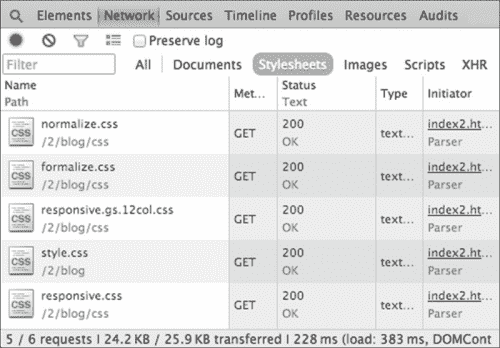

如前面的截图所示，浏览器执行 5 个 HTTP 请求来加载所有样式表，这些样式表的总大小为 24.4 KB，总共需要大约 228 毫秒来加载。

将这些样式表组合成一个文件并压缩其中的代码将加快页面加载性能。 样式表还可以变得更小，这最终也将节省带宽消耗。

如下面的截图所示，浏览器只执行一个 HTTP 请求; 样式表的大小减少到 13.5KB，并且只需要 111 毫秒就可以加载。 与前面的例子相比，页面加载速度快了大约 50%:

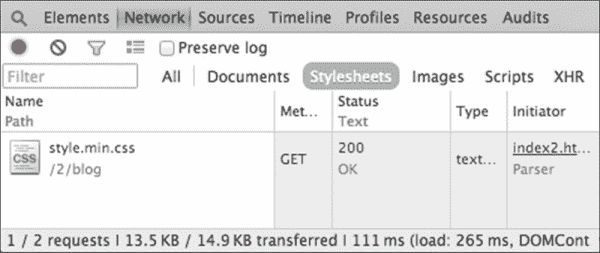

### 提示

**提高网站性能的最佳做法:**

头到 YSlow! 性能规则([https://developer.yahoo.com/performance/rules.html)](https://developer.yahoo.com/performance/rules.html)或谷歌 PageSpeed 洞察力规则([https://developers.google.com/speed/docs/insights/rules)为进一步措施使网站加载速度更快,除了结合样式表和 javascript。](https://developers.google.com/speed/docs/insights/rules)

# 行动时间-集成项目目录到考拉和组合样式表

在本节中，我们将将配置好的 Koala 集成到编译并输出样式表，步骤如下:

1.  在名为`main.css`的`css`文件夹中创建一个新的样式表。 这是主要的样式表，我们将在这里为博客编写自己的样式规则。
2.  创建一个名为`style.css`的新样式表。
3.  下载`normalize.css`([http://necolas.github.io/normalize.css/](http://necolas.github.io/normalize.css/))，并将其放入项目目录的`css`文件夹中。
4.  下载`formalize.css`([http://formalize.me/](http://formalize.me/))，并将其放入项目目录的`css`文件夹中。
5.  在崇高的文本中打开`style.css`。
6.  使用`@import`规则导入支持样式表，顺序如下:

    ```html
    @import url("css/normalize.css");
    @import url("css/formalize.css");
    @import url("css/responsive.gs.12col.css");
    @import url("css/main.css");
    @import url("css/responsive.css");
    ```

7.  Launch Koala. Then, drag-and-drop the project directory into the Koala sidebar. Koala will show and list recognizable files, as shown in the following screenshot:

    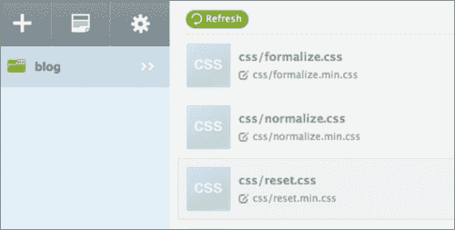

8.  Select `style.css` and tick **Auto Compile** to compile `style.css` automatically whenever Koala detects a change in it. Have a look at the following screenshot:

    

9.  Select the **Combine Import** option to let Koala combine the content within the style sheets (the content that was included in `style.css`) with the `@import` rule. Take a look at the following screenshot:

    

10.  Set **Output Style:** to **compress**. Take a look at the following screenshot:

    

    这将将样式规则压缩为一行，这最终将使`style.css`文件的大小更小。

11.  Click on the **Compile** button. Take a look at the following screenshot:

    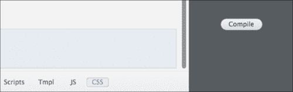

    这将编译`style.css`并生成一个名为`style.min.css`的新文件作为的输出。

12.  打开`index.html`和链接`style.min.css`。 使用以下代码:

    ```html
    <link href="style.min.css" rel="stylesheet">
    ```

## *刚才发生了什么?*

我们刚刚在 Koala 中集成了项目目录。 我们还创建了两个新的样式表，即`main.css`和`style.css`。 我们还使用`@import`规则将包括`main.css`在内的五个样式表放在`style.css`文件中。 我们合并了这些文件并生成了一个名为`style.min.css`的新样式表，可以在`style.css`中找到它，如下图所示:


最后，我们将简化的样式表`style.min.css`链接到`index.html`中。

## 有一个英雄-重命名输出

`style.min.css`名称是考拉设置的默认名称; 它向每个最小化的输出插入后缀`min`。 虽然是最流行的命名约定，用于最小化的 web 源文件，样式表和 JavaScript，考拉允许你重命名输出以匹配你的个人喜好。 要做到这一点，点击编辑图标，在下面的截图中用圆圈突出显示:

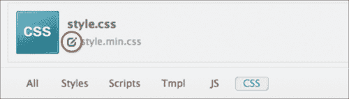

以下是一些可供选择的命名想法，你可以尝试:

*   `style-min.css`(加破折号)
*   `styles.min.css`(带`s`)
*   `blog.css`(指网站名称)

但是，如果您决定重命名前面步骤中管理的输出，而不是`style.min.css`，那么不要忘记更改引用样式表的`<link>`元素中指定的名称。

## Pop quiz -网站性能规则

Q1。 以下哪一条规则不是提高网站性能的一条?

1.  减少 CSS 和 JavaScript 等资源。
2.  压缩图像文件。
3.  利用浏览器缓存。
4.  使用 CSS 简写属性。
5.  通过 CDN 下发 web 资源。

# 手机优先

在我们着手编写代码之前，让我们先谈谈移动优先的方法，它将推动我们决定编写部分博客风格规则。

“移动优先”是网页设计界的一个流行词。 “移动优先”是当今网站建设的一种新思路，它也指导了为移动应用优化的网站建设模式。 正如[第一章](1.html#BE6O2-db71610abfe249d1a7f65c5cb7ebb0eb "Chapter 1. Responsive Web Design")，*响应式网页设计*中提到的，移动用户正在增长，桌面不再是用户访问网页的主要平台。

移动优先的概念驱使我们思考和优先使用移动构建网站块，包括我们如何组成风格规则和媒体查询。 此外，如 Brad Frost 在他的博客文章([http://bradfrostweb.com/blog/post/7-habits-of-highly-effective-media-queries/](http://bradfrostweb.com/blog/post/7-habits-of-highly-effective-media-queries/))中所论证的，采用移动优先思维可以产生更简洁的代码，而不是反过来(从桌面到移动)。 在此，我们将首先优化和解决移动版的博客，然后增强到桌面版。

Mobile-first超出了本模块的能力，我们将在稍后的[模块 3](part0180.html#5BL581-db71610abfe249d1a7f65c5cb7ebb0eb "Part 3. Module 3")、*HTML5 和 CSS3 响应式 web 设计烹饪书*中制作 Mobile-first web 应用。 以下是我的一些推荐资料，以进一步深入研究这个话题:

*   作者:Luke Wroblewski[http://www.abookapart.com/products/mobile-first](http://www.abookapart.com/products/mobile-first)
*   手机第一响应式网页设计:Brad Frost([http://bradfrostweb.com/blog/web/mobile-first-responsive-web-design/](http://bradfrostweb.com/blog/web/mobile-first-responsive-web-design/))
*   建立一个更好的响应式网站 Jeremy Girard([http://www.smashingmagazine.com/2013/03/05/building-a-better-responsive-website/](http://www.smashingmagazine.com/2013/03/05/building-a-better-responsive-website/))

# 撰写博客风格

在前面的小节中，我们添加了第三方样式，奠定了博客外观的基础。 从本节开始，我们将为博客编写自己的样式规则。 我们将从页眉开始，然后向下到页脚。

# 行动时间-组成基本风格规则

在本节中，我们将编写博客基本样式。 这些样式规则通常包括内容字体族、字体大小以及其中的许多元素。

首先，我个人认为，使用默认的系统字体，如 Arial 和 Times，是非常无聊的。

### 注意事项

由于浏览器支持和字体许可限制，我们只能使用安装在用户操作系统中的字体。 因此，十多年来，我们在 Web 上只能选择非常有限的字体，许多网站都使用相同的字体集，如 Arial、Times，甚至 Comic Sans。 是的，这些字体很无聊。

今天，随着`@font-face`规范的进步，以及在 Web 上使用字体的许可，我们现在可以在用户计算机的字体选择之外的网站上使用字体。 现在也有更大的字体集合,我们可以免费嵌入在 Web 上,比如那些我们能找到谷歌字体(http://www.google.com/fonts),打开字体库(http://openfontlibrary.org/),字体松鼠(http://www.fontsquirrel.com【显示】), Web 字体([http://fontsforweb.com/](http://fontsforweb.com/))，以及Adobe Edge Web 字体([https://edgewebfonts.adobe.com/](https://edgewebfonts.adobe.com/))。

我真的鼓励网页设计师探索更多的可能性，并建立一个更丰富的网站使用自定义字体在他们的网站上。

执行以下步骤来组成基本样式规则:

1.  To make our blog look more refreshing, we will use a couple of custom fonts from the Google Font library. Google Font has made it easy for us to use fonts on the Web. Google has taken care of the hassle of writing the syntax, as well as ensuring that the font formats are compatible in all major browsers.

    ### 注意事项

    说到这里,保罗指的是爱尔兰,*防弹@font-face 语法*([http://www.paulirish.com/2009/bulletproof-font-face-implementation-syntax/),为进一步帮助创作 CSS3`@font-face`语法,在所有浏览器工作。](http://www.paulirish.com/2009/bulletproof-font-face-implementation-syntax/)

2.  In addition, we won't be befuddled with the font license, as Google Font is completely free. All we have to do is add a special style sheet as explained in this page [https://developers.google.com/fonts/docs/getting_started#Quick_Start](https://developers.google.com/fonts/docs/getting_started#Quick_Start). In our case, add the following link before the prime style sheet link:

    ```html
    <link href='http://fonts.googleapis.com/css?family=Droid+Serif:400,700,400italic,700italic|Varela+Round' rel='stylesheet'>
    ```

    在这样做之后，我们将能够使用 Droid Serif 字体家族，以及 Varela Round; 请看以下网页中的字体样本和字符:

    *   DroidSerif([http://www.google.com/fonts/specimen/Droid+Serif](http://www.google.com/fonts/specimen/Droid+Serif))
    *   轮([http://www.google.com/fonts/specimen/Varela+Round](http://www.google.com/fonts/specimen/Varela+Round))
3.  将整个元素框的大小设置为`border-box`。 在`main.css`中添加以下行(以及接下来步骤中的其他行):

    ```html
    * { 
      -webkit-box-sizing: border-box;
      -moz-box-sizing: border-box;
      box-sizing: border-box;
      *behavior: url(/scripts/boxsizing.htc);
    }
    ```

4.  我们将设置博客的主字体，也就是应用于博客的整个内容的字体。 在这里，我们将使用 Droid 衬线的谷歌字体。 在`@import`样式表的列表之后添加以下样式规则:
5.  我们将对标题(`h1`、`h2`、`h3`、`h4`、`h5`和`h6`使用不同的字体家族，以便将其与正文内容区分开来。 在这里，我们将应用我们从谷歌字体集合带来的第二个自定义字体家族，Varela Round。
6.  Add the following line to apply Varela Round to the headings:

    ```html
    h1, h2, h3, h4, h5, h6 {
        font-family: "Varela Round", Arial, sans-serif;
        font-weight: 400;
    }
    ```

    ### 注意事项

    浏览器默认设置标题的权重为`bold`或`600`。 然而，Varela Round 只发送正常的字体重量，这相当于`400`。 因此，如前面的代码片段所示，我们还将`font-weight`设置为`400`，以防止所谓的*伪粗体*。

    关于仿体的更多信息，请参考 A List Apart 文章*Say No to Faux Bold*([http://alistapart.com/article/say-no-to-faux-bold](http://alistapart.com/article/say-no-to-faux-bold))。

7.  In this step, we will also customize the default anchor tag or link styles. It's my personal preference to remove the underline of the default link style.

    ### 注意事项

    甚至谷歌也删除了其搜索结果([http://www.theverge.com/2014/3/13/5503894/google-removes-underlined-links-site-redesign](http://www.theverge.com/2014/3/13/5503894/google-removes-underlined-links-site-redesign))的下划线。

    此外，我们还将链接颜色改为`#3498db`。 它是蓝色的，但比作为默认链接样式应用的蓝色更微妙，如下截图所示:

    

8.  添加以下行来更改默认链接颜色:

    ```html
    a {
        color: #3498db;
        text-decoration: none;
    }
    ```

9.  We will set the color of the link to hover state, as well. This color appears when the mouse cursor is over the link. Herein, we set the link hover color to `#2a84bf`, the darker version of the color we set in step 4\. Have a look at the following screenshot:

    

10.  添加以下一行，设置鼠标悬停时链接的颜色，如下:

    ```html
    a:hover {
        color: #2a84bf;
    }
    ```

11.  按照以下样式规则使图像流畅:

    ```html
    img {
      max-width: 100%;
      height: auto;
    }
    ```

此外，当实际图像宽度大于容器时，这些样式规则将防止图像超出其容器。

### 注意事项

有关流体图像的进一步详细信息，请参阅列表分开文章*流体图像*([http://alistapart.com/article/fluid-images](http://alistapart.com/article/fluid-images))。

## *刚才发生了什么?*

我们刚刚添加了处理博客中一些元素的样式规则，即标题、链接和图像。 在这个阶段，除了内容和标题中的字体家族以及链接颜色的变化，博客中还没有出现显著的差异。 看看下面的截图:

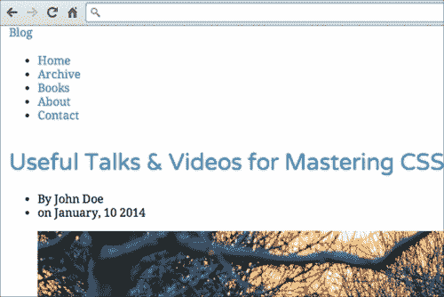

## 有一个去英雄-自定义链接颜色

请注意，链接颜色`#2a84bf`是我个人的选择。 选择颜色时要考虑很多因素，如品牌、受众、内容等。 链接不一定是`#2a84bf`。 例如，星巴克网站([http://www.starbucks.co.id/about-us/pressroom](http://www.starbucks.co.id/about-us/pressroom))的链接颜色为绿色，代表其品牌标识。

所以，不要害怕探索和尝试新的颜色。 以下是一些关于色彩的想法:

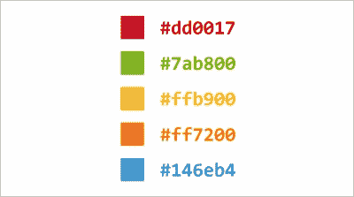

接下来，我们将编写博客标题和导航样式规则。 样式规则主要通过元素的类应用。 因此，在继续之前，请参考[第 2 章](2.html#F8901-db71610abfe249d1a7f65c5cb7ebb0eb "Chapter 2. Web Development Tools")、*Web 开发工具*，查看我们添加到元素中的类名和 ID。

# 操作时间-用 CSS 增强标题和导航外观

步骤如下:

1.  打开`main.css`。
2.  在标题周围添加一些空白，并将标题颜色设置为`#333`，如下所示:
3.  为了让 logo 看起来更突出，我们将它设置为 Varela Round 字体，这与我们用于标题的字体家族相同。 我们还将其变大，并将所有字母转换为大写，如下:

    ```html
     .blog-name {
      font-family: "Varela Round", Arial, sans-serif;
      font-weight: 400;
      font-size: 42px;
      text-align: center;
      text-transform: uppercase;
    }
    ```

4.  logo链接目前的颜色是`#2a84bf`，这是我们为链接`<a>`设置的常用颜色。 这个颜色和底色不太相配。 让我们将颜色改为白色，如下所示:
5.  Set the search input styles, as follows:

    ```html
    .search-form input {
      height: 36px;
      background-color: #ccc;
      color: #555;
      border: 0;
      padding: 0 10px;
      border-radius: 30px;
    }
    ```

    这些样式规则设置输入颜色、边框颜色和背景颜色。 它将输入变成如下截图所示:

    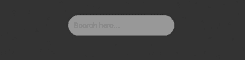

6.  As you can see in the preceding screenshot, the placeholder text is barely readable as the color blends with the input background color. So, let's make the text color a bit darker, as follows:

    ```html
    .search-form input::-webkit-input-placeholder {
      color: #555;
    }
    .search-form input:-moz-placeholder {
      color: #555;  
    }
    .search-form input::-moz-placeholder {
      color: #555;  
    }
    .search-form input:-ms-input-placeholder {  
      color: #555;
    }
    ```

    如果你使用的是 OS X 或 Ubuntu，你会看到当前目标输入的发光颜色，如下截图所示:

    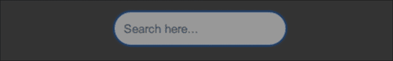

    在 OS X 中，发光的颜色是蓝色。 在 Ubuntu 中，它将是橙色的。

7.  I would like to remove this glowing effect. The glowing effect is technically shown through `box-shadow`. So, to remove this effect, we simply set the input `box-shadow` to `none`, as follows:

    ```html
    .search-form input:focus {
      -webkit-box-shadow: none;
      -moz-box-shadow: none;
      box-shadow: none;
    }
    ```

    值得注意的是，发光效果是**用户体验**(**用户体验**)设计的一部分，告诉用户他们目前在输入域中。 当用户只能通过键盘浏览网站时，这种 UX 设计尤其有用。

8.  So, we will have to create an effect that brings a similar UX as a replacement. Herein, we will replace the glowing effect that we removed by lightening the input background color. The following is the complete code of this step:

    ```html
    .search-form input:focus {
      -webkit-box-shadow: none;
      -moz-box-shadow: none;
      box-shadow: none;
      background-color: #bbb;
    }
    ```

    输入背景色在对焦时变浅，如下图所示:

    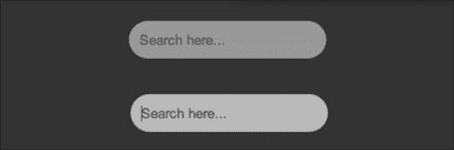

9.  我们将编写导航的样式。 首先，将菜单对齐到中间，并在导航的顶部和底部添加一些空白。 看看下面的代码:

    ```html
    .blog-menu {
      margin: 30px 0;
      text-align: center;
    }
    ```

10.  取下左手边的填充物`<ul>`，如下:

    ```html
    .blog-menu ul {
      padding-left: 0;
    }
    ```

11.  在菜单之间添加一些空白，并删除列表符号，如下所示:
12.  自定义菜单颜色和字体，如下:

    ```html
    .blog-menu a {
      color: #7f8c8d;
      font-size: 18px;
       text-transform: uppercase;
       font-family: "Varela Round", Arial, sans-serif;
    }
    .blog-menu a:hover {
        color: #3498db;
    }
    ```

## *刚才发生了什么?*

我们刚刚装饰了标题和导航。 与我们在本节前面中讨论的移动优先的思维方式相对应，我们首先将目标定位于优化移动博客的展示风格。

激活 Chrome 移动模拟器，你会看到博客已经针对更小的屏幕尺寸进行了优化; logo 和菜单，如下截图所示，是向中间对齐，而不是向左对齐:


## 有一个 go 英雄-自定义头部

blog 标题用深色`#333`表示。 我真的理解这种颜色对你们中的一些人来说可能看起来很无聊。 因此，自由地自定义颜色以及 logo 和搜索输入字段的风格。 一些想法如下:

*   使用 CSS3 渐变或图像作为头部背景
*   通过 CSS 图像替换方法，将 logo 替换为图像
*   减少搜索输入边框半径，更改背景颜色，并调整占位符文本颜色

在管理了博客标题和导航之后，我们继续到博客内容部分。 内容部分包括博客帖子项和博客分页。

# 行动时间-用 CSS 增强内容部分外观

执行以下步骤来样式化博客内容:

1.  用`padding`和`margin`在内容部分的所有侧面添加空白，如下

    ```html
    .blog-content {
      padding: 15px;
      margin-bottom: 30px;
    } 
    ```

2.  每一篇博文用一些空格和边界线分开，如下:
3.  将标题对齐到中间，调整标题字体大小，并按照以下样式规则更改颜色:

    ```html
    .post-title {
      font-size: 36px;
      text-align: center;
      margin-top: 0;
    }
    .post-title a {
      color: #333;
    }
    .post-title a:hover {
      color: #3498db;
    }
    ```

4.  标题下方有`post-meta`，由文章作者姓名和文章出版日期组成。 与标题类似，我们也调整字体大小和空白，并改变字体颜色，如下:

    ```html
    .post-meta {
      font-size: 18px;
      margin: 20px 0 0;
      text-align: center;
      color: #999;
    }
    .post-meta ul {
      list-style-type: none;
      padding-left: 0;
    }
    .post-meta li {
      margin-bottom: 10px;
    }
    ```

5.  The post thumbnail, as you can see in the following screenshot, looks small and squished due to the margin on all its sides:

    

6.  Let's remove these margins, as follows:

    ```html
    .post-thumbnail {
      margin: 0;
    }
    ```

    一些图片，如下截图所示，有一个标题:

    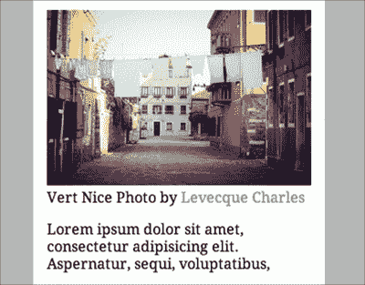

7.  让我们对其进行样式设置，使其与其他内容看起来与众不同，并显示它是一个图像标题。 添加以下代码行来样式标题:

    ```html
    .post-thumbnail figcaption {
      color: #bdc3c7;
      margin-top: 15px;
      font-size: 16px;
      font-style: italic;
    }
    ```

8.  调整文章摘录的字体大小、颜色和行高，如下:

    ```html
    .post-excerpt {
      color: #555;
      font-size: 18px;
      line-height: 30px;
    }
    ```

9.  从这一步开始，我们将编写博客分页的样式。 首先，让我们对字体大小、字体族、空白、位置和对齐进行一些调整，如下代码所示:

    ```html
    .blog-pagination {
      text-align: center;
      font-size: 16px;
      position: relative;
      margin: 60px 0;
    }
    .blog-pagination ul {
      padding-left: 0;
    }
    .blog-pagination li,
    .blog-pagination a {
      display: block;
      width: 100%;
    }
    .blog-pagination li {
      font-family: "Varela Round", Arial, sans-serif;
      color: #bdc3c7;
      text-transform: uppercase;
      margin-bottom: 10px;
    }
    ```

10.  用圆角边框装饰分页链接，如下:

    ```html
    .blog-pagination a {
      -webkit-border-radius: 30px;
      -moz-border-radius: 30px;
      border-radius: 30px;
      color: #7f8c8d;
      padding: 15px 30px;
      border: 1px solid #bdc3c7;
    }
    ```

11.  指定鼠标悬停在链接上时的链接装饰，如下所示:

    ```html
    .blog-pagination a:hover {
      color: #fff;
      background-color: #7f8c8d;
      border: 1px solid #7f8c8d;
    }
    ```

12.  最后，使用以下样式规则将页码指示器放在分页链接的顶部:

    ```html
    .blog-pagination .pageof {
      position: absolute;
      top: -30px;
    }
    ```

## *刚才发生了什么?*

我们刚刚设计了博客内容部分——包括页面导航(分页)，下面的截图显示了内容部分的外观:


## 有一个去英雄-提高内容部分

我们在内容部分应用的大多数样式规则都是装饰性的。 这是你不需要强制遵循的东西。 根据您的个人品味，随意改进款式。

您可以进行以下修改:

*   自定义文章标题字体家族和颜色
*   为 post 图像应用边框颜色或圆角
*   更改分页边框颜色，或使背景更丰富多彩

接下来，我们将样式页脚，这是博客的最后一部分。

# 行动时间-用 CSS 增强页脚部分外观

执行以下步骤来增强页脚样式:

1.  调整页脚字体、颜色和页边距，如下:

    ```html
    .blog-footer {
      background-color: #ecf0f1;
      padding: 60px 0;
      font-family: "Varela Round", Arial, sans-serif;
      margin-top: 60px;
    }
    .blog-footer,
    .blog-footer a {
      color: #7f8c8d;
    }
    ```

2.  页脚包含社交媒体链接。 让我们调整包含边距、填充、对齐、颜色和空白的样式，如下所示:
3.  将margin-top 移出版权容器。

    ```html
    .copyright {
      margin-top: 0;
    }
    ```

4.  将页脚内容居中对齐，如下:

    ```html
    .social-media,
    .copyright {
      text-align: center;
    }
    ```

## *刚才发生了什么?*

我们刚刚设计了页脚部分，下面的截图显示了博客页脚的样子:

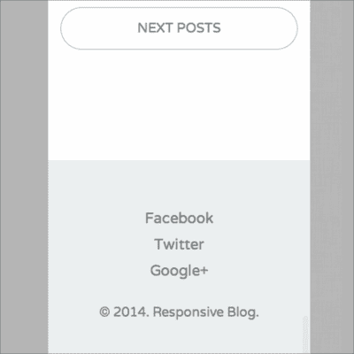

# 优化桌面博客

该博客目前为移动平台(或窄视口)进行了优化。 如果您在一个较大的视口中查看它，您将发现一些元素错位或没有正确对齐。 例如，博客的 logo 和导航现在是对齐到中间的，如下图所示:

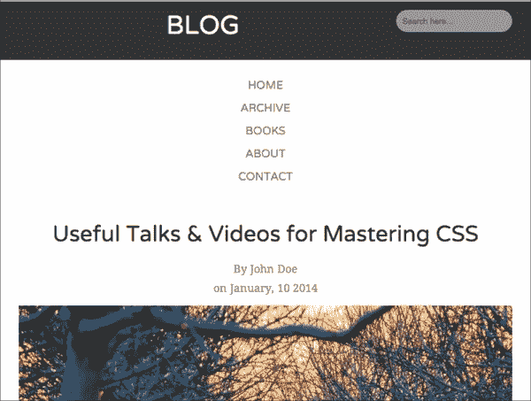

按照我们在[第 3 章](3.html#LTSU1-db71610abfe249d1a7f65c5cb7ebb0eb "Chapter 3. Constructing a Simple Responsive Blog with Responsive.gs")、*中展示的构建响应式简单博客的蓝图。 gs*，标志应对齐到左侧，每个菜单链接应内嵌显示。 在接下来的步骤中，我们将通过媒体查询修复这些问题; 我们将为桌面视图优化博客。

# 时间为行动组合风格规则的桌面

执行以下步骤编写桌面风格规则:

1.  在崇高的文本中打开`responsive.css`。
2.  添加以下媒体查询:

    ```html
    @media screen and (min-width: 640px) {
      // add style rules here
    }
    ```

我们将在这个媒体查询的以下步骤中添加所有样式规则。 该媒体查询规范将在视口宽度范围内应用样式规则，从 640 px 及以上开始。

1.  将博客 logo 对齐到左边，如下:

    ```html
    .blog-name {
      text-align: left;
      margin-bottom: 0;
    }
    ```

2.  将导航菜单、帖子 meta、社交媒体的列表项内联显示如下:

    ```html
    .blog-menu li,
    .post-meta li,
    .social-media li {
          display: inline;
    }
    ```

3.  增加文章标题大小，如下:

    ```html
    .post-title {
      font-size: 48px;
    }
    ```

4.  同时，内联显示博客分页链接，如下所示:
5.  将分页页面指示器放在其初始位置——与博客分页链接内嵌，如下所示:
6.  将页脚的社交媒体链接向左对齐，将版权声明向右对齐，如下:

    ```html
    .social-media {
      text-align: left;
    }
    .copyright {
      text-align: right;
    }
    ```

## *刚才发生了什么?*

我们刚刚为桌面视图添加了处理博客的样式规则。 如果你现在在大于 640 像素的视口中查看博客，你会发现博客中的元素，比如 logo 和导航菜单，都在它们的共同位置，如下图所示:

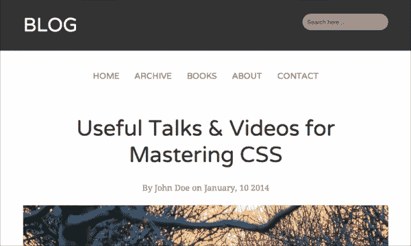

# 使 Internet Explorer 更有能力的腻子填充

使用了CSS3 和 HTML5 功能后，的结果是:在旧的 ie 中，布局失败并被破坏了，如下截图所示:


如果您对此没有意见，您可以跳过此部分并立即进入下一个项目。 但是，如果您感到冒险，让我们继续这一节并修复这些错误。

# 是时候用腻子填充来给 ie 打补丁了

执行步骤给 ie 打补丁:

1.  脚本文件夹中有多个腻子，即`html5shiv.js`、`respond.js`和`placeholder.js`。 让我们将这些脚本合并到一个文件中。
2.  首先，创建一个名为`polyfills.js`的新 JavaScript 文件，该文件将保存这些 polyfill 脚本的内容。
3.  在崇高的文本中打开`polyfills.js`。
4.  Add the following lines to import the polyfill scripts:

    ```html
    // @koala-prepend "html5shiv.js"
    // @koala-prepend "respond.js"
    // @koala-prepend "placeholder.js"
    ```

    ### 注意事项

    `@koala-prepend`指令是 Koala 用于导入 JavaScript 文件的专有指令。 在考拉文档页面[https://github.com/oklai/koala/wiki/JS-CSS-minify-and-combine](https://github.com/oklai/koala/wiki/JS-CSS-minify-and-combine)了解更多信息。

5.  In Koala, select `polyfills.js`, and click on the **Compile** button, as shown in the following screenshot:

    

    通过这一步，考拉将生成名为`polyfills.min.js`的最小化文件。

6.  Open `index.html`, and link `polyfills.js` before `</head>`, as follows:

    ```html
    <!--[if lt IE 9]>
    <script type="text/javascript" src="scripts/polyfills.min.js"></script>
    <![endif]-->
    ```

    ### 注意事项

    由于此脚本仅在 Internet Explorer 8 及以下版本中需要，所以我们将其封装为 Internet Explorer 条件注释`<!--[if lt IE 9]>`，正如您在前面的代码片段中所看到的那样。

    有关 Internet Explorer 条件注释的更多信息，请参考QuirksMode 文章[http://www.quirksmode.org/css/condcom.html](http://www.quirksmode.org/css/condcom.html)。

## *刚才发生了什么?*

我们只是在博客中应用了腻子填充来修补 HTML5 和媒体查询的 Internet Explorer 渲染问题。 这些 polyfills 工作即用。 刷新 ie 浏览器，瞧! 看看下面的截图:


应用了样式规则，布局就位，占位符文本也在那里。

## 加油英雄-为 ie 浏览器润色一下博客

我们将结束这个项目。 但是，正如您从前面的截图中看到的，要使博客在旧的 Internet Explorer 中显示得和在最新的浏览器中一样好，仍然有许多问题需要解决。 例如:

*   参考前面的屏幕截图，占位符文本目前对齐到顶部。 你可以固定它，让它垂直地对齐中心。
*   您还可以应用一个名为CSS3Pie([http://css3pie.com/](http://css3pie.com/))的填充，该填充在 Internet Explorer 中引入 CSS3 边界半径，使搜索输入字段四舍五入为最新浏览器版本中的。

# 总结

我们完成了第一个项目; 我们已经建立了一个简单的，响应式的博客使用 responve.gs。 这个博客的最终结果可能不会吸引你。 它也远非完美，尤其是在旧的 Internet Explorer 中; 如前所述，在这方面仍有许多问题需要解决。 尽管如此，我希望您能从过程、技术和其中的代码中获得一些有用的东西。

总结一下，以下是我们在本章中所做的，使用 CSS3 增强和优化了博客，使用 Koala 组合和最小化样式表和 JavaScript 文件，并应用 polyfills 修补了 HTML5 和 CSS3 的 Internet Explorer 问题。

在下一章，我们将开始第二个项目。 我们将探索另一个框架来建立一个更广泛和响应性更好的网站。