# 第五章。 用 Bootstrap 开发一个作品集网站

*Bootstrap([http://getbootstrap.com/](http://getbootstrap.com/))是最坚固的前端开发框架之一。 它提供了令人惊叹的特性，比如响应式网格、用户界面组件和 JavaScript 库，让我们能够快速构建响应式网站并运行。*

Bootstrap 是如此的流行，以至于 web 开发社区积极支持它，通过开发各种形式的扩展来添加额外的特性。 如果 Bootstrap 提供的标准特性还不够，可以使用扩展来满足您的特定需求。

*在本章中，我们将开始我们的第二个项目。 我们将利用 Bootstrap 建立一个响应式的投资组合网站。 所以，这一章显然会对那些在创意领域工作的人有用，比如摄影、平面设计和插画。*

*在此，我们还将使用 Bootstrap 扩展来赋予组合网站非画布导航。 跟随 Bootstrap，我们将转向 LESS 作为网站样式表的基础。*

让我们继续。

本章的讨论将包括以下主题:

*   探索引导组件
*   查看 Bootstrap 扩展来带来非画布导航
*   检查作品集网站蓝图和设计
*   与 Bower 和 Koala 建立和组织项目目录和资产
*   构建作品集网站的 HTML 结构

# 引导组件

与响应。 我们在第一个项目中使用的 gs 框架，Bootstrap 附带了额外的组件，这些组件通常在 Web 中使用。 因此，在我们进一步进入开发组合网站之前，首先让我们探索一下这些组件，主要是那些我们将在网站中使用的组件，比如响应式网格、按钮和表单元素。

### 注意事项

坦率地说，官方的Bootstrap 网站([http://getbootstrap.com/](http://getbootstrap.com/))永远是最新的 Bootstrap 相关信息的最佳来源。 因此，在这里，我想指出的关键的事情是直接的。

## 引导响应网格

Bootstrap 带有响应式网格系统，以及组成列和行的支持类。 在 Bootstrap 中，我们使用这些前缀类`col-xs-`、`col-sm-`、`col-md-`和`col-lg-`构建列。 接下来是列号，范围从`1`到`12`，以定义列大小，并将列定位为特定的视口大小。 更多关于前缀的细节见下表:

<colgroup class="calibre17"><col class="calibre18"> <col class="calibre18"></colgroup> 
| 

前缀

 | 

描述

 |
| --- | --- |
| `col-xs-` | 这为 bootstrap 定义的最小(特别小)视口大小指定了列，该视口大小等于或小于 768 px |
| `col-sm-` | 这指定了bootstrap 定义的小视口大小(等于或大于 768 px)的列。 |
| `col-md-` | 这为bootstrap 定义的中视口大小指定列，该大小等于或大于 992 像素 |
| `col-lg-` | 这为bootstrap 定义的大视口大小(等于或大于 1,200 像素)指定了列 |

在下面的例子中，我们在一行中设置了三列，每列分配一个`col-sm-4`类:

```html
<div class="row">
  <div class="col-sm-4"></div>
  <div class="col-sm-4"></div>
  <div class="col-sm-4"></div>
</div>
```

因此，每一列将具有相同的大小，并且它们将向下缩放到 bootstrap 定义的小视口大小(≥768px)。 下面的截图显示了前面的标记在浏览器中的效果(通过添加一些样式):

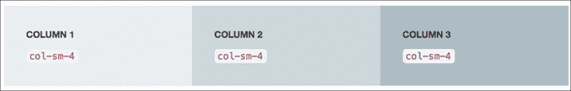

在 viewport 中查看示例，其尺寸小于 768 像素，所有这些列将开始堆叠——第一列在顶部，第三列在最底部，如下截图所示:


此外，我们可以添加多个类来指定多个视口大小中的列比例，如下所示:

```html
<div class="row">
  <div class="col-sm-6 col-md-2 col-lg-4"></div>
  <div class="col-sm-3 col-md-4 col-lg-4"></div>
  <div class="col-sm-3 col-md-6 col-lg-4"></div>
</div>
```

在前面的例子中，在 bootstrap 定义的大视口大小(≥1200 像素)内，列将具有相同的大小，如下截图所示:


然后，当我们在每个列上指定的类之后的中型视口中查看它时，列比例开始移动。 第一列的宽度会变小，第二列会保持不变的比例，而第三列会变大，如下图所示:

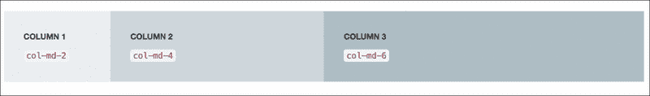

当网站处于 bootstrap 定义的中视口和小视口大小的阈值时，列比例将再次开始移动，大约在 991px，如下截图所示:

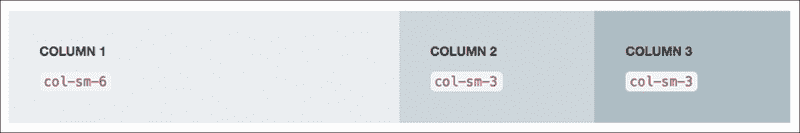

### 注意事项

如需进一步帮助构建 Bootstrap 网格，请访问 Bootstrap官方网站([http://getbootstrap.com/css/#grid](http://getbootstrap.com/css/#grid))的网格系统部分。

## 引导按钮和窗体

我们将并入网站的其他组件是按钮和表单。 我们将创建一个在线联系人，用户可以通过该联系人与我们取得联系。 在 Bootstrap 中，使用的`btn`类和`btn-default`组成按钮，应用 Bootstrap 的默认样式，如下代码所示:

```html
<button type="button" class="btn btn-default">Submit</button>
<a class="btn btn-default">Send</a>
```

将`btn-default`类替换为`btn-primary`、`btn-success`或`btn-info`，以赋予按钮指定的颜色，如下代码所示:

```html
<button type="button" class="btn btn-info">Submit</button>
<a class="btn btn-success">Send</a>
```

代码片段用以下类定义了按钮大小:`btn-lg`使按钮变大，`btn-sm`使按钮变小，以及`btn-xs`使按钮更小，如下代码所示:

```html
<button type="button" class="btn btn-info btn-lg">Submit</button>
<a class="btn btn-success btn-sm">Send</a>
```

下面的截图显示了按钮大小如何随外观变化，当添加了前面的类:


Bootstrap 允许我们以多种方式显示按钮，比如将一系列按钮内联显示在一起，或者在按钮中添加一个下拉切换。 为进一步援助和细节构造这些类型的按钮,前往按钮组([http://getbootstrap.com/components/ btn-groups](http://getbootstrap.com/components/#btn-groups))和按钮下拉([http://getbootstrap.com/components/ btn-dropdowns](http://getbootstrap.com/components/#btn-dropdowns))引导的官方网站。

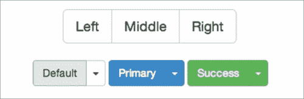

引导按钮组和按钮与下拉切换

Bootstrap 还提供了一些可重用的类来为表单元素设置样式，比如`<input>`和`<textarea>`。 Bootstrap 使用`form-control`类来设置表单元素的样式。 风格是轻和得体的，如下截图所示:

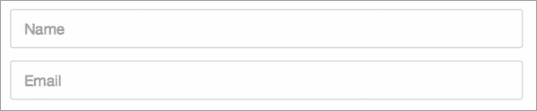

有关在 Bootstrap 中样式化和安排表单元素的更多信息，请参考 Bootstrap 官方页面的表单部分([http://getbootstrap.com/css/#forms](http://getbootstrap.com/css/#forms))。

## 引导超大屏幕

Bootstrap描述大屏幕如下:

> *“一个轻量级的，灵活的组件，可以选择扩展整个视口来展示您网站上的关键内容”([http://getbootstrap.com/components/#jumbotron](http://getbootstrap.com/components/#jumbotron))*

大屏幕是一个特殊的区域，用来显示网站的第一线信息，比如营销文案、标语或特别优惠，另外还有一个按钮。 大屏幕通常放在折叠上方和导航栏下方。 要在 Bootstrap 中构造一个 Jumbotron 部分，应用`jumbotron`类，如下所示:

```html
<div class="jumbotron">
  <h1>Hi, This is Jumbotron</h1>
<p>Place the marketing copy, catchphrases, or special offerings.</p>
  <p><a class="btn btn-primary btn-lg" role="button">Got it!</a></p>
</div>
```

使用 Bootstrap默认样式，下面是大屏幕的样子:

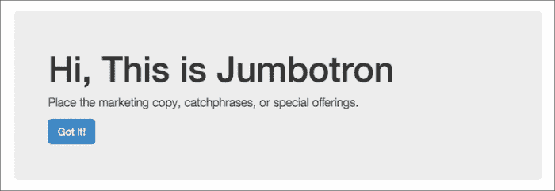

这是带有默认样式的大屏幕外观

### 注意事项

关于 Bootstrap 大屏幕的更多细节可以在 Bootstrap 组件页面[http://getbootstrap.com/components/#jumbotron](http://getbootstrap.com/components/#jumbotron)找到。

## 引导第三方扩展

不可能满足所有人的需求，Bootstrap 也是如此。 许多扩展被以多种形式创建——从 CSS、JavaScript、图标、初始模板和主题——来扩展 Bootstrap。 在本页找到完整的列表([http://bootsnipp.com/resources](http://bootsnipp.com/resources))。

在这个项目中，我们将包括一个名为Jasny Bootstrap([http://jasny.github.io/bootstrap/](http://jasny.github.io/bootstrap/))的扩展，由 Arnold Daniels 开发。 我们将主要使用它来合并非画布导航。 非画布导航是响应式设计中的一种流行模式; 菜单导航首先会设置网站的可见区域，通常只能通过点击或点击来滑动，如下图所示:

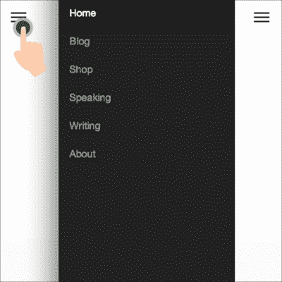

当用户单击三条线图标时，off-canvas 部分会向内滑动

### Jasny Bootstrap off-canvas

Jasny Bootstrap 是一个扩展，它为原始 Bootstrap 添加了额外的构建块。 Jasny Bootstrap 的设计与 Bootstrap 的思想; 它几乎在每个方面都遵循 Bootstrap 约定，包括 HTML 标记、类命名、JavaScript 函数以及 api。

如前所述，我们将使用这个扩展包括帆布导航在投资组合网站。 下面是一个使用 Jasny Bootstrap 构建非画布导航的示例代码片段:

```html
<nav id="offcanvas-nav" class="navmenu navmenu-default navmenu-fixed-left offcanvas" role="navigation">
  <ul class="nav navmenu-nav">
    <li class="active"><a href="#">Home</a></li>
    <li><a href="#">Link</a></li>
    <li><a href="#">Link</a></li>
  </ul>
</nav>
<div class="navbar navbar-default navbar-fixed-top">
<button type="button" class="navbar-toggle" data-toggle="offcanvas" data-target="#offcanvas-nav" data-target="body">
    <span class="icon-bar"></span>
    <span class="icon-bar"></span>
    <span class="icon-bar"></span>
  </button>
</div>
```

从前面的代码片段可以看到，构建非画布导航需要混合一些 HTML 元素、类和属性。 首先，我们需要两个元素`<nav>`和`<div>`，分别包含菜单和切换导航菜单的按钮。 `<nav>`元素通过`<button>`中的`data-target`属性被赋予一个 ID 作为菜单的唯一引用。

在这些元素中添加了一些类和属性来指定颜色、背景、位置和函数:

*   `navmenu`:Jasny Bootstrap 有一种新的导航方式，叫做 navmenu。 `navmenu`类将垂直显示导航，并放置在网站内容的左右手边，而不是顶部。
*   `navmenu-default`: The class that will set the `navmenu` class with the default styles, which is dominated by light gray. Use the `navmenu-inverse` class instead if you prefer a dark color. Have a look at the following screenshot:

    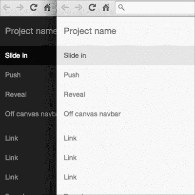

    两个非画布导航的默认颜色

*   `navmenu-fixed-left`类将导航菜单置于左侧。 使用`navmenu-fixed-right`类将其设置在右侧。
*   `offcanvas`类是用于将导航菜单从画布中设置出来的主要类。
*   `<button>`中的`data-target="#offcanvas-nav"`代码充当一个选择器，它引用具有给定 ID 的特定导航菜单。
*   `data-toggle="offcanvas"`代码告诉按钮切换非画布导航。 在中，原始的 Bootstrap 附带了几种类型的`data-toggle`来连接不同的小部件，比如模态(`data-toggle="modal"`)、下拉框(`data-toggle="dropdown"`)和标签(`data-toggle="tab"`)。
*   The data-target="body" lets the website body slide along with the off-canvas navigation at the same time when being toggled on and off. Jasny Bootstrap calls it as push menu; follow this page ([http://jasny.github.io/bootstrap/examples/navmenu-push/](http://jasny.github.io/bootstrap/examples/navmenu-push/)) to see it in action.

    ### 注意事项

    此外,Jasny 引导提供了两个额外的类型的 off-canvas 导航,名叫幻灯片菜单([http://jasny.github.io/bootstrap/examples/navmenu/)和显示菜单](http://jasny.github.io/bootstrap/examples/navmenu/)([http://jasny.github.io/bootstrap/examples/navmenu-reveal/)遵循包容](http://jasny.github.io/bootstrap/examples/navmenu-reveal/)URL 看到他们在行动。

# 挖掘 Bootstrap

探索 Bootstrap 组件的每一寸超出了本模块的能力。 因此，我们只讨论了 Bootstrap 中对项目至关重要的几件事。 除了Bootstrap 官方网站([http://getbootstrap.com/](http://getbootstrap.com/))，以下是一些专门的参考文献，深入挖掘 Bootstrap，你可以看看:

*   Bootstrap 教程为初学者的编码器指南([http://www.youtube.com/watch?v=YXVoqJEwqoQ](http://www.youtube.com/watch?v=YXVoqJEwqoQ))，一系列的视频教程，帮助初学者建立和运行 Bootstrap
*   *微博引导 Web 开发指南*,*大卫•科克伦**Packt 出版*(【http://www.packtpub.com/web-development/twitter-bootstrap-web-development-how-instant T6】)
*   *Mobile First Bootstrap*，*Alexandre Magno*，*Packt Publishing*([http://www.packtpub.com/web-development/mobile-first-bootstrap](http://www.packtpub.com/web-development/mobile-first-bootstrap))
*   学习 Bootstrap, Packt Publishing([https://www.packtpub.com/web-development/learning-bootstrap](https://www.packtpub.com/web-development/learning-bootstrap))

# 使用字体图标

视网膜或**高清**(**HD**)显示使屏幕上的一切看起来更清晰、更有活力。 但是，问题在于高清显示器出现之前遗留的图像或网络图标。 这些图像通常是位图或栅格图像，它们在屏幕上变得模糊，如下图所示:


一系列边缘模糊的图标，如视网膜显示器上显示的

我们不希望这种情况发生在我们的网站上，所以我们将不得不使用一个字体图标，这是更具伸缩性的，并在高清晰度屏幕上保持清晰。

说实话，Bootstrap提供了一个名为 Glyphicon 的字体图标集。 遗憾的是，它并没有提供我们所需要的社交媒体图标。 经过一系列的字体图标设置，我最终选择了为离子图标([http://ionicons.com/](http://ionicons.com/))。 在此，我们将使用 LESS 附带的替代版本，它是官方存储库，因此我们将能够无缝地与 Bootstrap 集成，它碰巧也使用 LESS。

# 检查作品集网站布局

在我们开始构建网站的块和边缘之前，让我们看看网站的线框图。 这个线框将是参考，并给我们的图片，如何网站布局将组织在移动和桌面视图。


上面的截图显示了桌面的网站布局，或者说是宽视口的尺寸。

网站将有一个按钮位于网站的左上方，该按钮带有一个所谓的**汉堡**图标，可以在非 canvas 菜单中滑动。 然后是网站的第一行，上面写着网站名称和标语。 接下来的部分将包含作品集图片，而最后一部分将包含一个在线表单和社交媒体图标。

移动视图看起来更简单，但保持相同的逻辑结构在桌面视图布局，如下截图所示:


# 项目目录、资产和依赖项

让我们通过组织项目目录和资产(包括依赖项、图像和字体图标)来开始项目。

### 注意事项

依赖关系是什么? 这里的依赖是一个文件或一个文件包，如 CSS 和 JavaScript 库，这是运行项目和构建网站所需要的。

在这个项目中，我们将运用Bower([http://bower.io/](http://bower.io/))来组织项目的依赖项。 鲍尔,正如我们在[第 1 章简要提及了](1.html#BE6O2-db71610abfe249d1a7f65c5cb7ebb0eb "Chapter 1. Responsive Web Design"),*响应网页设计*,是一个简化的前端包管理器【显示】的方法安装,删除和更新前端开发库,如 jQuery,规范化,HTML5Shiv。

# 行动时间-使用 Bower 组织项目目录、资产和安装项目依赖项

在本节中，我们将添加项目依赖项，包括 Bootstrap、Jasny Bootstrap、Ionicons 和 HTML5Shiv。 我们将使用 Bower 来安装它们，以便将来能够更无缝地维护它们——移除和更新它们。

此外，由于这可能是您中的许多人第一次使用 Bower，所以我将以缓慢的速度，一点一点地引导您完成这个过程。 请彻底执行以下步骤:

1.  在`htdocs`文件夹中，创建一个新文件夹，并将其命名为`portfolio`。 这是项目目录，我们将在其中添加所有项目文件和文件夹。
2.  在`portfolio`文件夹中，创建一个名为`assets`的新文件夹。 我们将把项目资产，如图像、JavaScript 和样式表放在这个文件夹中。
3.  在 assets 文件夹中，创建以下文件夹:
    *   `img`包含网站图像和基于图像的图标
    *   `js`来包含 JavaScript 文件
    *   包含字体图标集
    *   `less`包含 LESS 样式表
    *   `css`作为 LESS 的输出文件夹
4.  创建`index.html`作为网站的主页。
5.  Add the images for the website in the `img` folder; this includes the portfolio images and the icons for a mobile device, as shown in the following screenshot:

    

    ### 注意事项

    这个网站有大约 14 张图片，包括移动设备的图标。 我要感谢我的朋友瑜伽 Perdana([https://dribbble.com/yoga](https://dribbble.com/yoga))允许我在这个模块中使用他的精彩工作。 您可以找到与此模块绑定的这些图像。 但是，当然，你可以用你自己的图像来代替它们。

6.  我们将通过 Bower 安装依赖项——运行项目以及构建网站所需的包、库、JavaScript 或 CSS。 但是，在运行任何 Bower 命令来安装依赖项之前，我们希望使用`bower init`命令将项目设置为一个 Bower 项目，以在`bower.json`中定义项目规范，例如项目名称、版本和作者。
7.  首先，如果您使用 Windows，请打开终端或命令提示符。 然后，使用`cd`命令导航到项目目录，如下所示:
    *   Windows:`cd \xampp\htdocs\portfolio`
    *   在 OS X:`cd /Applications/XAMPP/htdocs/portfolio`
    *   Ubuntu:`cd /opt/lampp/htdocs/portfolio`
8.  Type `bower init`, as shown in the following screenshot:

    

    ### 注意事项

    这个命令，`bower init`，将我们的项目作为一个 Bower 项目启动。 这个命令还会导致填写许多提示信息来描述项目，比如项目名称、项目版本、作者等等。

9.  First, we specify the project name. In this case, I would like to name the project `responsive-portfolio`. Type the name as follows, and press *Enter* to proceed. Have a look at the following screenshot:

    

10.  Specify the project version. Since the project is new, let's simply set it to `1.0.0`, as shown in the following screenshot:

    

11.  按*进入*继续。
12.  Specify the project description. This prompt is entirely optional. You may leave it empty if you think it's not required for your project. In this case, I will describe the project as `a responsive portfolio website built with Bootstrap`, as shown in the following screenshot:

    

13.  Specify the main file of the project. This certainly will vary depending on the project. Herein, let's set the main file to `index.html`, the website's home page, as shown in the following screenshot:

    

14.  This prompts the question, "what types of modules does this package expose?" It specifies what the package is used for. In this case, simply select the global option, as shown in the following screenshot:

    

15.  Press the Space Bar key to select it, and press *Enter* to continue.

    ### 注意事项

    这个提示符描述了项目(我们的项目)中的模块技术的用途。 我们的项目不依附于特定的技术或模块; 它只是一个带有 HTML、CSS 和几行 JavaScript 的普通静态网站。 我们不是在建造 Node、YUI 或 AMD 模块。 因此，最好选择`globals`选项。

16.  The **keywords** prompt tells the project relation. In this case, I would like to fill it as `portfolio`, `responsive`, `bootstrap`, as shown in the following screenshot. Press *Enter* to continue:

    

    关键词**提示是可选的。 如果您愿意，您可以通过按*Enter*键让该值保持为空。**

***   The **authors** prompt specifies the author of the project. This prompt is prepopulated with your computer user name and e-mail that you have registered in the system. Yet, you can overwrite it by specifying a new name and pressing *Enter* to continue, as shown in the following screenshot:

    

    ### 提示

    如果项目有多个作者，可以用逗号分隔符指定每个作者，如下所示:

    **作者:**`John Doe, Jane Doe`

    *   Specify the project license. Herein, we will simply set it to the `MIT` license. The `MIT` license grants anyone to do whatever he or she wants with the code in the project, including modification, sublicensing, and commercial use. Have a look at the following screenshot:

    

    ### 注意事项

    请参考选择 License([http://choosealicense.com/](http://choosealicense.com/))查找其他类型的 License。

    *   Specify the home page of the project. This could be your own website repository. In this case, I would like to set it with my personal domain, `creatiface.com`, as shown in the following screenshot:

    

    *   In the **set currently installed components as dependencies?:** command, type `n` (no), as we haven't installed any dependencies or packages yet, as shown in the following screenshot:

    

    *   The **Add commonly ignored files to ignore list?** command will create the `.gitignore` file containing a list of common files to exclude from the Git repository. Type `Y` for yes. Have a look at the following screenshot:

    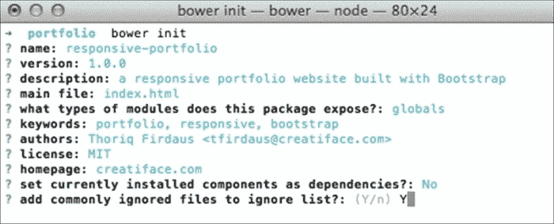

    ### 注意事项

    我将使用 Git管理代码修订，并将其上传到 Git 仓库，如 Github 或 Bitbucket，因此我选择`Y`(是)。 但是，如果您还不熟悉 Git，并且不打算将项目托管在 Git 存储库中，您可以忽略此提示并键入`n`。 Git 超出了本模块讨论的范围。 为了更好地了解 Git，下面是我推荐的最好的参考资料:

    通过 GitTower([http://www.git-tower.com/learn/](http://www.git-tower.com/learn/))为初学者学习 Git。

    *   For the **would you like to mark this package as private which prevents it from being accidentally published to the registry?** command type `Y` as we won't register our project to the Bower registry. Have a look at the following screenshot:

    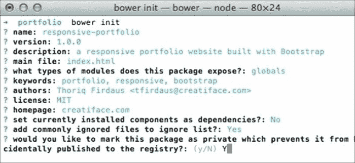

    *   Examine the output. If it looks good, type `Y` to generate the output within the `bower.json` file, as shown in the following screenshot:

    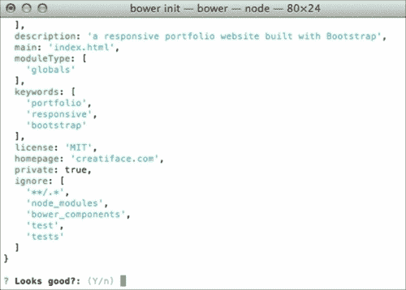

    *   There are a number of libraries we want to install. To begin with, let's install Bootstrap with the `bower install bootstrap ––save` command, as shown in the following screenshot:

    

    命令后面的`--save`参数将在`bower.json`中将 Bootstrap 注册为项目依赖项。 如果你打开它，你会发现它记录在依赖项下，如下截图所示:

    

    你还应该发现 Bootstrap 包被保存在一个新文件夹`bower_components`，和 jQuery 一起，这是一个 Bootstrap 依赖，如下截图所示:

    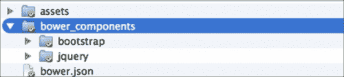

    *   安装 Bootstrap扩展，Jasny Bootstrap，使用`bower install jasny-bootstrap –save`命令。*   使用 LESS 样式表，使用`bower install ionicons`命令安装 Ionicons。*   The Ionicons package ships with the font files. Move them to the `fonts` folder of the project directory, as shown in the following screenshot:

    

    *   最后，使用`bower install html5shiv ––save`命令安装 HTML5Shiv 以启用 Internet Explorer 8 及以下的 HTML5 新元素。**

 **## *刚才发生了什么?*

我们只是创建了文件夹和网站主页文档`index.html`。 将在网站上显示的图像和图标也准备好了。 我们也在`bower.json`中记录了项目规范。 通过这个文件，我们可以知道这个项目被命名为`responsive-portfolio`，当前版本为 1.0.0，并且有几个依赖项，如下所示:

*   ([https://github.com/twbs/bootstrap](https://github.com/twbs/bootstrap))
*   JasnyBootstrap([http://jasny.github.io/bootstrap/](http://jasny.github.io/bootstrap/))
*   + LESS([https://github.com/lancehudson/ionicons-less](https://github.com/lancehudson/ionicons-less))
*   HTML5Shiv([https://github.com/aFarkas/html5shiv](https://github.com/aFarkas/html5shiv))

我们通过`bower install`命令下载了这些库，这比必须下载并解压`.zip`包要精简。 所有库都应该被添加到一个名为`bower_components`的文件夹中，如下截图所示:


## 有一个 go 英雄-指定 Bower 自定义目录

Bower 默认创建一个名为`bower_components`的新文件夹。 Bower 允许我们通过 Bower 配置文件`.bowerrc`来配置文件夹名称。 通过创建`.bowerrc`，根据您的偏好更改文件夹名称。 按照参考([http://bower.io/docs/config/](http://bower.io/docs/config/))配置 bowwer。

## 突击测验-测试你对 Bower 命令的理解

Q1。 我们已经向您展示了如何使用 Bower 安装和更新库。 现在的问题是:如何删除已安装的库?

1.  执行`bower remove`命令。
2.  执行`bower uninstall`命令。
3.  执行`bower delete`命令。

Q2。 除了安装和删除库，我们还可以在 Bower 注册表中搜索库的可用性。 如何通过 Bower 注册表搜索图书馆?

1.  运行后跟一个关键字的`bower search`。
2.  运行后跟库名称的`bower search`。
3.  运行后跟一个关键字的`bower browse`。

第三季。 Bower 还允许我们查看包属性的细节，比如包版本、依赖关系、作者等。 我们执行什么命令来查看这些细节?

1.  `bower info`
2.  `bower detail`
3.  `bower property`

## 更新 Bower 组件

由于依赖项与 Bower 一起安装，项目的维护将更加精简。 这些库可以在以后更新到新版本。 使用 Bower 命令，更新我们刚刚安装的库实际上比下载`.zip`包并手动将文件移动到项目目录中要简单得多。

运行`bower list`命令查看所有已安装的 Bower 包，查看是否有新版本可用，如下图所示:


然后，使用`bower install`命令安装新版本，然后加上 Bower 包名称和版本号。 安装 Bootstrap 3.2.0 版本，例如:`bower install bootstrap#3.2.0 ––save`。

### 注意事项

我们实际上应该能够使用`bower update`命令更新包。 然而，根据以下Bower 问题线程([https://github.com/bower/bower/issues/1054](https://github.com/bower/bower/issues/1054))中的许多报告，这个命令似乎并没有按照预期工作。 因此，如前面所示，使用`bower install`命令是目前的方法。

# 组合网站的 HTML 结构

现在我们已经把建立网站的基本要素放在一起了。 让我们开始构建网站的 HTML结构。 与上一个项目一样，在这里，我们将使用两个新的 HTML5 元素来构建语义结构。

# 时间行动-建立网站的 HTML 结构

在本节中，我们将构建网站的 HTML 结构。 你会发现，我们在这里添加的一些元素将与我们在第一个网站，响应式博客中添加的类似。 因此，下面的步骤很简单。 如果你已经完成了第一个步骤，那么这些步骤也应该很容易完成。 让我们继续。

1.  打开`index.html`。 然后，添加基本的 HTML 结构，如下所示:
2.  Below `<meta charset="UTF-8">`, add a meta tag to address the Internet Explorer rendering compatibility:

    ```html
    <meta http-equiv="X-UA-Compatible" content="IE=edge">
    ```

    前面的元标记规范将强制 Internet Explorer 使用其中最新的引擎版本来呈现页面。

    ### 注意事项

    有关`X-UA-Compatible`的更多信息，请参考《现代》。 IE 文章，*如何使用 x-ua 兼容*([https://www.modern.ie/en-us/performance/how-to-use-x-ua-compatible](https://www.modern.ie/en-us/performance/how-to-use-x-ua-compatible))。

3.  Below the `http-equiv` meta tag, add the meta viewport tag:

    ```html
    <meta name="viewport" content="width=device-width, initial-scale=1">
    ```

    上述视口元标签规范定义了网页视口宽度，以遵循设备视口大小，以及在第一次打开网页时按 1:1 比例缩放页面。

4.  在 viewport meta 标签下面，添加到 favicon 和 Apple -touch-icon 的链接，这将在苹果设备上显示网站的图标，如 iPhone, iPad 和 iPod:
5.  Add the website's meta description below `<title>`:

    ```html
    <meta name="description" content="A simple portoflio website built using Bootstrap">
    ```

    在此元标签中指定的描述将显示在**搜索引擎结果页面**(**SERP**)。

6.  你也可以在 meta description 标签下面用 meta 标签指定页面的作者，如下所示。

    ```html
    <meta name="author" content="Thoriq Firdaus">
    ```

7.  Inside `<body>`, add the website off-canvas navigation HTML, as follows:

    ```html
    <nav id="menu" class="navmenu navmenu-inverse navmenu-fixed-left offcanvas portfolio-menu" role="navigation">
            <ul class="nav navmenu-nav">
                <li class="active"><a href="#">Home</a></li>
                <li><a href="#">Blog</a></li>
                <li><a href="#">Shop</a></li>
                <li><a href="#">Speaking</a></li>
                <li><a href="#">Writing</a></li>
                <li><a href="#">About</a></li>
            </ul>
        </nav>
    ```

    除了我们在本章 Jasny Bootstrap off-canvas 部分提到的基本类之外，我们还在`<nav>`元素中添加了一个名为`portfolio-menu`的新类，将我们自己的样式应用到 off-canvas 导航中。

8.  添加 Bootstrap`navbar`结构，以及`<button>`来滑动画布:

    ```html
    <div class="navbar navbar-default navbar-portfolio portfolio-topbar">
    <button type="button" class="navbar-toggle" data-toggle="offcanvas" data-target="#menu" data-canvas="body">
            <span class="icon-bar"></span>
    <span class="icon-bar"></span>
    <span class="icon-bar"></span>
    </button>
    </div>
    ```

9.  Below `navbar`, add the `<main>` element, as follows:

    ```html
    <main class="portfolio-main" id="content" role="main">
    </main>
    ```

    如 W3C([http://www.w3.org/TR/html-main-element/](http://www.w3.org/TR/html-main-element/))中所述，`<main>`元素定义了网站的主要内容。 所以，这是我们将放置网站内容，包括作品集图片。

10.  Add Bootstrap Jumbotron, containing the portfolio website name and a line of catchphrase. Since I will display the work of a friend of mine, Yoga Perdana, I wish to show off his name, along with his catchphrase that is displayed in his Dribbble page profile ([https://dribbble.com/yoga](https://dribbble.com/yoga)), as follows:

    ```html
    <main class="portfolio-main" id="content" role="main">
    <section class="jumbotron portfolio-about" id="about">
    <h1 class="portfolio-name">Yoga Perdana</h1>
    <p class="lead">Illustrator &amp; Logo designer. I work using digital tools, specially vector.</p>
    </section>
    </main>
    ```

    您可以随意添加您的姓名或公司名称。

11.  在 Bootstrap Jumbotron 部分下面，添加一个带有 HTML5`<section>`元素的新部分，以及定义该部分的标题，如下所示:
12.  在标题下面添加一个 Bootstrap容器([http://getbootstrap.com/css/#overview-container](http://getbootstrap.com/css/#overview-container))，该容器将使用以下代码包含投资组合图像:
13.  Arrange the portfolio images into columns and rows. We have 12 portfolio images, which means we may have four img/columns in a row. The following is the first row:

    ```html
    ...
    <div class="container">
    <div class="row">
    <div class="col-md-3 col-sm-6 portfolio-item">
     <figure class="portfolio-image">
    
    <figcaption class="portfolio-caption">6 Layers</figcaption>
     </figure>
     </div>
    <div class="col-md-3 col-sm-6 portfolio-item">
     <figure class="portfolio-image">
    
    <figcaption class="portfolio-caption">Blur</figcaption>
    </figure>
     </div>
    <div class="col-md-3 col-sm-6 portfolio-item">
     <figure class="portfolio-image">
    
    <figcaption class="portfolio-caption">Brain</figcaption>
    </figure>
     </div>
     <div class="col-md-3 col-sm-6 portfolio-item">
     <figure class="portfolio-image">
    
    <figcaption class="portfolio-caption">Color</figcaption>
    </figure>
     </div>
    </div>
    </div>
    ```

    每个列都分配了一个特殊的类，允许我们应用定制的样式。 我们还在`<figure>`中添加了一个用于包装图像的类，以及用于包装图像标题的`<figcaption>`元素。

14.  将剩余的图像添加到列和行中。 因为在本例中，我们有 12 张图片，所以应该有三行显示在网站中。 每一行包含四个图像，其中包括我们在步骤 13 中添加的一行。
15.  Below the portfolio section, add the website message form containing three form fields and a button, as shown in the following code:

    ```html
    ...
    </section>
    <div class="portfolio-contact" id="contact">
     <div class="container">
     <h2>Get in Touch</h2>
    <form id="contact" method="post" class="form" role="form">
     <div class="form-group">
    <input type="text" class="form-control input-lg" id="input-name" placeholder="Name">
    </div>
     <div class="form-group">
    <input type="email" class="form-control input-lg" id="input-email" placeholder="Email">
     </div>
     <div class="form-group">
    <textarea class="form-control" rows="10"></textarea>
     </div>
     <button type="submit" class="btn btn-lg btn-primary">Submit</button>
     </form>
    </div>
    </div>

    ```

    在这里，我们使网站表单简单，只有三个表单字段。 但是，您可以根据自己的需求添加额外的表单字段。

16.  最后，我们将使用 HTML5`<footer>`元素添加网站页脚。 正如我们从网站线框中看到的，页脚包含了社交媒体图标和网站版权声明。
17.  在网站的主要内容下面添加以下 HTML 标记:

    ```html
    ... 
    </main>
    <footer class="portfolio-footer" id="footer">
            <div class="container">
              <div class="social" id="social">
                <ul>
    <li class="twitter"><a class="icon ion-social-twitter" href="#">Twitter</a></li>
    <li class="dribbble"><a class="icon ion-social-dribbble-outline" href="#">Dribbble</a></li>
                    </ul>
              </div>
    <div class="copyright">Yoga Perdana &copy; 2014</div>
            </div>
        </footer>
    ```

## *刚才发生了什么?*

我们只是用一些 HTML5 元素和Bootstrap 可重用类构建了作品集网站的 HTML 结构。 如果你使用的是 OS x，你应该能够通过以下地址`http://localhost/portfolio/`或`http://{computer-username}/portfolio/`看到网站。在这个阶段还没有应用到网站的样式; 我们在页面中没有链接任何样式表。 所以，下面的截图显示的是网站当前的样子。

### 提示

以上步骤中显示的完整代码也可以从下面的 Gist[http://git.io/oIh31w](http://git.io/oIh31w)中获得。


## 有一个英雄-扩展作品集网站

Bootstrap 船舶各种组件。 然而，我们只使用了一些，包括网格、大屏幕、按钮和表单。 扩展网站添加额外的 Bootstrap 组件，如下:

*   ([http://getbootstrap.com/components/#pagination](http://getbootstrap.com/components/#pagination))
*   ([http://getbootstrap.com/components/#breadcrumbs](http://getbootstrap.com/components/#breadcrumbs))
*   响应embed([http://getbootstrap.com/components/#responsive-embed](http://getbootstrap.com/components/#responsive-embed))
*   ([http://getbootstrap.com/components/#panels](http://getbootstrap.com/components/#panels))
*   ([http://getbootstrap.com/components/#wells](http://getbootstrap.com/components/#wells))

此外，尝试创建更多的网页，并通过非画布导航菜单链接它们。

## Pop quiz - Bootstrap 按钮类

Bootstrap 指定了许多可重用的类，以使用预先设置的样式快速塑造和形成元素。

Q1。 下面哪个类是不使用在 Bootstrap 网格?

1.  `col-sm-pull-8`
2.  `col-md-push-3`
3.  `col-xs-offset-5`
4.  `col-lg-6`
5.  `col-xl-7`

Q2。 下面哪个类 Bootstrap 使用样式按钮?

1.  `btn-link`
2.  `btn-submit`
3.  `btn-send`
4.  `btn-cancel`
5.  `btn-enter`

# 总结

本章开始本模块的第二个项目。 我们正在使用最流行的前端开发框架之一 Bootstrap 构建一个组合网站。 我们还在 web 开发中探索了一个名为 Bower 的新工具，它简化了网站依赖关系管理。

它们都是很好的工具组合。 Bootstrap 让我们使用模块化组件和可重用类快速构建响应式网站，而 Bower 使项目更容易维护。

在下一章中，我们将更多地使用 LESS 和 JavaScript 来装饰网站。**