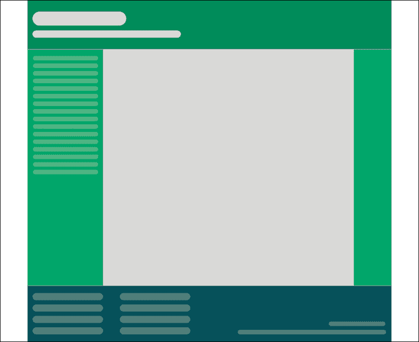
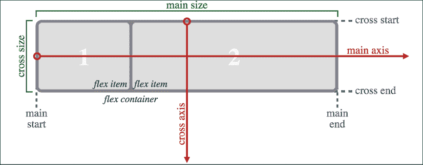
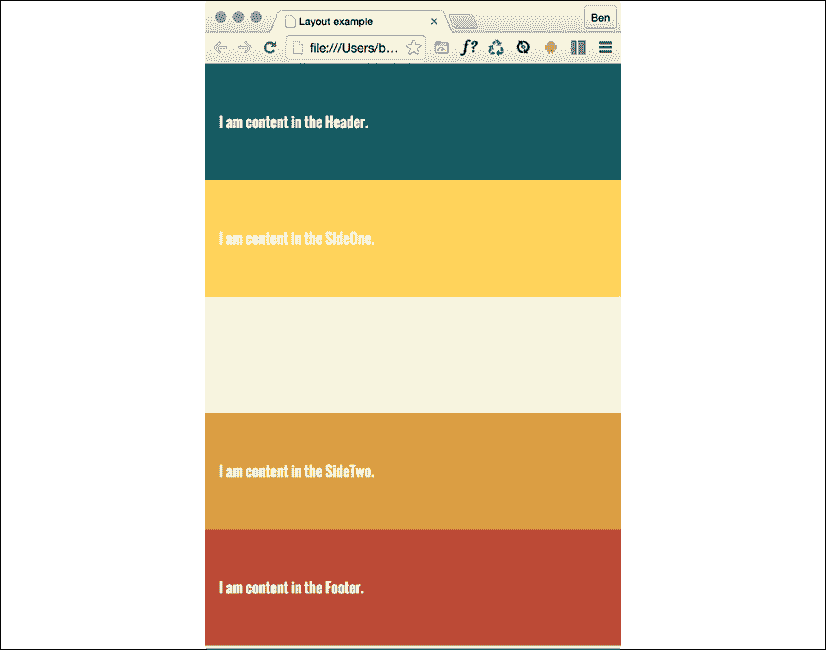
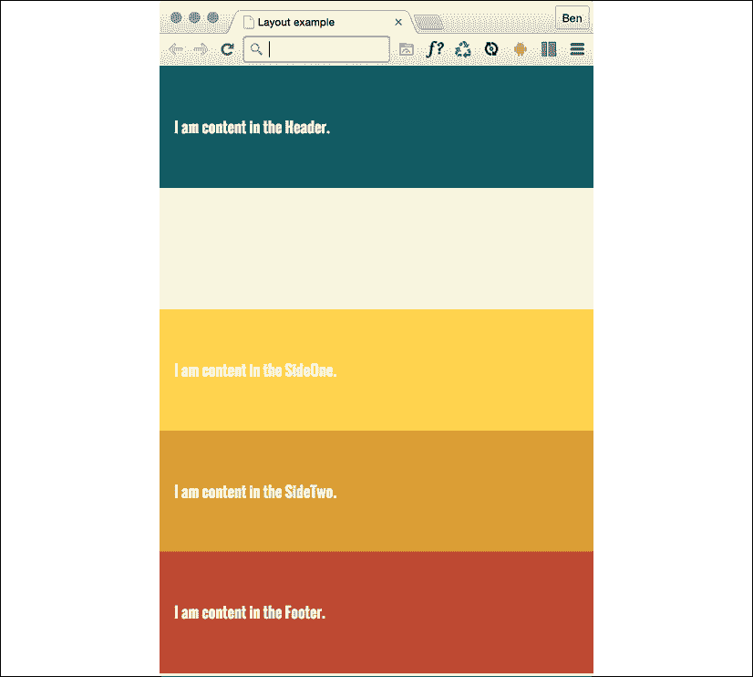

# 4

# 流体布局、Flexbox 和响应式图像

在上一章的最后，我们提醒自己响应式网页设计的三个核心原则是流动的布局、媒体查询和灵活的媒体。 我们花了*第三章*，*媒体查询-支持不同的视图*，学习所有关于媒体查询的知识。 现在我们知道如何使用它们来改变特定“断点”的布局。

在本章中，我们将重点关注响应式网页设计的另外两个支柱:流畅的布局和灵活的媒体。 在本章结束时，我们将能够确保我们编写的任何设计都可以在断点之间轻松伸缩，响应其容器的限制。

很久以前，在时间的迷雾中(好吧，20 世纪 90 年代末)，网站通常用百分比定义其宽度。 这些基于百分比的宽度可以灵活地调整到屏幕上，被称为流体布局。

在之后的几年里，也就是 21 世纪的中后期，出现了一种对固定宽度设计的迷恋(我把这归咎于那些讨厌的印刷设计师和他们对像素完美精度的痴迷)。 如今，当我们构建响应式网页设计时，我们需要回顾流畅的布局，并记住它们提供的所有好处。

直到最近，web 开发人员已经使用了几种 CSS 布局机制来创建优秀的流动布局。 如果你在 web 上工作过一段时间，你会熟悉块、内联块、表格和其他技术来实现任何给定的布局。 当我在 2020 年写这篇文章时，对这些老技术似乎只是粗略地提一提，没什么好处。 现在我们有两种强大的 CSS 布局机制:CSS Flexbox 和 CSS Grid。

本章将讨论 CSS Flexbox。 在*第五章*，*布局与 CSS 网格*中，我感觉你可以猜到我们将涵盖什么。

Flexbox 非常有用，因为它不仅仅能提供一个流畅的布局机制。 您是否希望轻松地将内容居中，更改标记的源顺序，并轻松地创建令人惊叹的布局? Flexbox 已经为你做好了准备。

在本章中，我们将:

*   了解如何将固定像素布局转换成比例大小
*   考虑现有的 CSS 布局机制及其缺陷
*   将 Flexbox 视为超越这些限制的可行途径
*   了解灵活盒布局模块和它提供的好处
*   学习如何使用响应图像和`srcset`的分辨率切换和艺术方向

让我们继续我们的第一个任务:将固定的设计转换为流动的关系。 这是一个你在构建响应式网页设计时需要经常执行的任务。

# 将固定像素设计转换为流体比例布局

图形合成，或“比较”，如，它们通常被称为，从一个程序，如 Photoshop, Illustrator，或素描，都有固定的像素尺寸。 在某些情况下，当将设计作为浏览器的流体布局重新创建时，需要将设计转换为比例尺寸。

响应式网页设计之父 Ethan Marcotte 在他 2009 年的文章*流体网格*([http://alistapart.com/article/FLUIDGRIDS](http://alistapart.com/article/FLUIDGRIDS))中提出了一个非常简单的公式:

目标/上下文=结果

换句话说，用你想要的东西的单位除以它所包含的东西。 让我们把它付诸实践。 理解它将使您能够将任何固定尺寸的布局转换为响应性/流体当量。

考虑一个为桌面设计的非常基本的页面布局。 在理想的情况下，我们总是会从较小的屏幕布局转移到桌面布局; 然而，为了说明比例，我们将从后往前看这两种情况。

这是布局的图像:

<figure class="mediaobject"></figure>

图 4.1:基本的“桌面”布局

布局宽度为 960px。 页眉和页脚都是整个布局的宽度。 左边的区域是 200px 宽，右边的区域是 100px 宽。 这样就留下了 660px 作为主要的内容区域。 我们的工作是将这个固定宽度的设计转换为流体布局，在调整大小时保持其比例。 对于我们的第一个任务，我们需要将中间部分和边部分转换成比例的尺寸。

我们将从左边开始变换。 左边是 200 单位宽。 这个值就是我们的目标值。 我们将目标大小除以 960 个单位，即我们的上下文，我们得到一个结果:.208333333。 现在，无论什么时候得到这个公式的结果，我们都需要把小数点右移两点。 这给我们一个值，这个值是目标值，描述为其父节点的百分比。 在本例中，左边部分是其父部分的 20.8333333%。

让我们在中间部分再练习一下这个公式。 目标值是 660。 除以 960，得到。6875。 小数点右移两位，得到 68.75%。

最后，让我们看看右边的部分。 我们的目标是 100 人。 除以 960 的上下文，得到。104166667。 移动小数点，我们得到的值是 10.4166667%。

这是最困难的了。 跟我一起说:目标，除以上下文，等于结果。

您可以在 CSS 中使用带有长十进制值的值。 或者，如果您希望在代码中看到更容易接受的数字，那么将它们四舍五入为两个小数点也可以用于浏览器。

为了证明的观点，让我们在浏览器中快速构建基本布局作为块。 为了便于理解，我在各种元素中添加了类，这些元素描述了它们所引用的“comp”的哪一部分。 根据它们的位置来命名通常不是一个好主意。 位置可以改变，特别是在响应式设计中。 简而言之，照我说的做，而不是照我在这里做的做!

可以查看为`example_04-01`。 这里是 HTML:

```html
<div class="Wrap">
  <header class="Header"></header>
  <div class="WrapMiddle">
    <aside class="Left"></aside>
    <main class="Middle"></main>
    <aside class="Right"></aside>
  </div>
  <footer class="Footer"></footer>
</div> 
```

这是 CSS:

```html
html,
body {
  margin: 0;
  padding: 0;
}
.Wrap {
  max-width: 1400px;
  margin: 0 auto;
}
.Header {
  width: 100%;
  height: 130px;
  background-color: #038c5a;
}
.WrapMiddle {
  width: 100%;
  font-size: 0;
}
.Left {
  height: 625px;
  width: 20.83%;
  background-color: #03a66a;
  display: inline-block;
}
.Middle {
  height: 625px;
  width: 68.75%;
  background-color: #bbbf90;
  display: inline-block;
}
.Right {
  height: 625px;
  width: 10.41%;
  background-color: #03a66a;
  display: inline-block;
}
.Footer {
  height: 200px;
  width: 100%;
  background-color: #025059;
} 
```

如果您在浏览器中打开示例代码并调整页面的大小，您将看到`.Left`、`.Middle`和`.Right`部分的尺寸彼此保持成比例。 您还可以使用`.Wrap`值的`max-width`来增大或减小布局的边界尺寸(在本例中，它被设置为 1400px)。

现在，让我们考虑如何在一个更小的屏幕上拥有相同的内容，它可以伸缩到一个点，然后改变我们已经看到的布局。 您可以在`example_04-02`中查看该布局的最终代码。

其想法是，对于较小的屏幕，我们将有一个单一的内容“管”。 左侧区域只能作为“非画布”区域查看; 通常，一个用于菜单或类似的区域，它位于可视屏幕区域之外，当按下菜单按钮时，它就会滑动进来。 主要内容位于标题下面，然后是标题下面的右边部分，最后是页脚区域。 在我们的示例中，我们可以通过单击标题上的任何位置来显示左侧菜单区域。 通常，当真正实现这种设计模式时，将使用一个菜单按钮来激活边菜单。

如你所料，当结合我们新掌握的媒体查询技能，我们可以调整视口和设计只是“响应”——毫不费力地从一个布局移动到另一个布局，并在两者之间拉伸。 这里我不会列出所有的 CSS 属性; 都在`example_04-02`中。 然而，这里有一个例子——左边部分:

```html
.Left {
  height: 625px;
  background-color: #03a66a;
  display: inline-block;
  position: absolute;
  left: -200px;
  width: 200px;
  font-size: 0.9rem;
  transition: transform 0.3s;
}
@media (min-width: 40rem) {
  .Left {
    width: 20.83%;
    left: 0;
    position: relative;
  }
} 
```

你可以看到，首先，没有媒体查询，是小屏幕布局。 然后，在更大的屏幕尺寸，宽度成为比例，定位相对，并将左值设置为零。 我们不需要重写诸如`height`、`display`或`background-color`之类的属性，因为我们不需要更改它们。

这是进步。 我们结合了两种核心的响应式网页设计技术; 将固定尺寸转换为比例，并使用媒体查询目标 CSS 规则相关的视口大小。

在实际的项目中，如果 JavaScript 不可用并且需要查看菜单内容，我们应该做一些准备。 我们在*第 9 章*、*转场、转换和动画*中详细讨论了这个场景。

我们现在已经介绍了流体设计的基本要素。 综上所述，在需要时，使元素的尺寸成比例而不是固定的。 这样，设计就能适应容器的大小。 现在，您可以使用简单的目标/上下文=结果公式进行必要的计算。

在我们继续讨论灵活媒体之前，我们先来讨论一下 CSS 的 Flexbox 布局机制。

## 我们为什么需要 Flexbox?

我们现在将探索如何使用 CSS 的 Flexible Box Layout，或者叫 Flexbox，因为它更常见的是。 然而，在我们这样做之前，我认为谨慎的做法是首先考虑现有布局技术的不足，如内联块、浮动和表。 现在，如果您以前从未使用过浮动、CSS 表或内联块来实现布局，我可能会建议您不要这么做。 正如我们将看到的，现在有更好的方法来做这件事。 然而，如果你已经使用了这些方法中的任何一种，那么提醒自己痛点是值得的。

### Inline-block 和空白

使用内联块作为布局机制的最大问题是它在 HTML 元素之间呈现一个空格。 这并不是一个 bug(尽管大多数开发人员会欢迎一种明智的方式来删除空间)，但它确实需要一些技巧来删除不需要的空间，对我来说，大约有 95%的时间是这样的。 有很多方法可以做到这一点。 但是，不要列出在使用内联块时删除空白的每个可能的解决方案，请参考 Chris Coyier 的这篇文章:[http://css-tricks.com/fighting-the-space-between-inline-block-elements/](http://css-tricks.com/fighting-the-space-between-inline-block-elements/)。

同样值得指出的是，在内联块中没有简单的方法来垂直居中内容。 使用内联块，也不可能有两个兄弟元素，其中一个具有固定的宽度，而另一个流畅地填充剩余空间。

### 浮点数

我讨厌使用浮点布局。 瞧，我说出来了。 对他们有利的是，他们在任何地方都能相当一致地工作。 然而，有两个主要的恼人之处。

首先，当以百分比指定浮动元素的宽度时，它们计算的宽度在不同的浏览器之间不会一致舍入(一些浏览器向上舍入，一些向下舍入)。 这意味着，有时，在无意的情况下，部分会低于其他部分，有时它们会在一侧留下一个令人恼火的间隙。

其次，你通常必须“清除”浮动，以便父框/元素不会崩溃。 这很容易做到，但它不断提醒我们，浮动从来就不是用来作为一种健壮的布局机制。

### 表和表格单元

不要将`display: table`和`display: table-cell`与等效的 HTML 元素混淆。 这些 CSS属性只是模仿了基于 html 的同类的布局。 它们不会影响 HTML 的结构。

在过去的几年里，我发现使用 CSS 表进行布局非常有用。 例如，使用`display: table`和`display: table-cell`子元素可以使元素的垂直中心保持一致和稳定。 此外，`table-cell`元素内部的`table`元素完美地将自己分隔开; 它们不像浮动元素那样存在四舍五入的问题。 您还可以从 Internet Explorer 7 一直得到浏览器支持!

然而，这也有局限性。 通常，有必要在项目周围加上一个额外的元素—为了获得完美的垂直居中，表格单元格必须位于作为表格的元素集中。 将设置为`display: table-cell`的项目包装到多行也是不可能的。

综上所述，现有的布局方法都有严重的局限性。 幸运的是，Flexbox 克服了所有这些问题。

吹起小号，铺上红地毯。 Flexbox 来了。

# 引入 Flexbox

Flexbox 解决了上述每种显示机制中的缺陷。 以下是对其超级大国的简要概述:

*   它可以很容易地垂直居中。
*   它可以改变元素的视觉顺序。
*   它可以自动对框内的元素进行空格和对齐，并自动在它们之间分配可用空间。
*   项目可以排列成一行，可以是反向排列的行，可以是沿页面向下排列的列，也可以是沿页面反向排列的列。
*   它可以让你看起来年轻 10 岁(可能不会，但在少量的实证测试中(我)，它已经被证明可以减轻压力)。

## 通往 Flexbox 的崎岖之路

Flexbox 经历了几个主要的迭代之后才得到了今天的稳定版本。 例如,考虑这些变化从 2009 版本(http://www.w3.org/TR/2009/WD-css3-flexbox-20090723/),2011 版(http://www.w3.org/TR/2011/WD-css3-flexbox-20111129/),和 2014 年的版本我们正在把我们的例子(http://www.w3.org/TR/css-flexbox-1/)。 标记了语法差异。

这些不同的规范意味着在不同的浏览器中有三种主要的实现。 其中有多少需要关注取决于您需要的浏览器支持级别。

然而，考虑到不同的版本，我们需要做一个简短但重要的切题。

## 把前缀留给别人

通过编写 Flexbox 代码来获得尽可能广泛的浏览器支持是一项艰巨的手工任务。 这里有一个例子; 我将设置三个与 flexbox 相关的属性和值。 考虑一下:

```html
.flex {
  display: flex;
  flex: 1;
  justify-content: space-between;
} 
```

这就是属性和值在官方语法中的样子。 然而，如果我们想要支持 Android 浏览器(v4 及以下)和 IE 10，以下是实际需要的:

```html
.flex {
  display: -webkit-box;
  display: -webkit-flex;
  display: -ms-flexbox;
  display: flex;
  -webkit-box-flex: 1;
  -webkit-flex: 1;
  -ms-flex: 1;
  flex: 1;
  -webkit-box-pack: justify;
  -webkit-justify-content: space-between;
  -ms-flex-pack: justify;
  justify-content: space-between;
} 
```

我不知道你是怎么想的，但我宁愿把时间花在做一些更有成效的事情上，也不愿每次都写那么多东西! 简而言之，如果您想要或需要对 Flexbox 提供最广泛的浏览器支持，请花时间设置一个自动重新修复解决方案。

### 选择您的自动修复解决方案

为了您的的完整性，为了准确且容易地将供应商前缀添加到 CSS 中，可以使用某种形式的自动前缀解决方案。 现在，我喜欢自动修复([https://github.com/postcss/autoprefixer](https://github.com/postcss/autoprefixer))。 它快速，容易设置，而且非常准确。

有版本的 Autoprefixer 为大多数设置; 您不一定需要基于命令行的构建工具(如 Gulp 或 Grunt)。 例如，如果您使用 Sublime Text，那么有一个版本可以直接从命令面板工作:[https://github.com/sindresorhus/sublime-autoprefixer](https://github.com/sindresorhus/sublime-autoprefixer)。 还有 Atom、括号、Visual Studio Code 等版本的 Autoprefixer。

从这一点开始，除非对说明某一点至关重要，否则代码示例中将不再有供应商前缀。

## 越来越容易步行

Flexbox 有四个关键特性:方向、对齐、顺序和灵活性。 我们将通过几个例子来介绍所有这些特征以及它们之间的关系。

这些例子故意简单化; 我们只是移动一些盒子和它们的内容，以便我们能够理解 Flexbox 的工作原理。

### 完美的垂直居中文本

请注意，第一个 Flexbox 示例是:

<figure class="mediaobject"></figure>

图 4.2:使用 Flexbox 定心很简单

这里的标记:

```html
<div class="CenterMe">
  Hello, I'm centered with Flexbox!
</div> 
```

这里是整个 CSS 规则，样式的标记:

```html
.CenterMe {
  background-color: indigo;
  color: #ebebeb;
  font-family: 'Oswald', sans-serif;
  font-size: 2rem;
  text-transform: uppercase;
  height: 200px;
  display: flex;
  align-items: center;
  justify-content: center;
} 
```

该规则中的大多数属性/值对只是设置颜色和字体大小。 我们感兴趣的三个属性是:

```html
.CenterMe {
  /* other properties */
  display: flex;
  align-items: center;
  justify-content: center;
} 
```

如果您没有使用过 Flexbox或相关的方框对齐规范([http://www.w3.org/TR/css3-align/](http://www.w3.org/TR/css3-align/))中的任何属性，那么这些属性可能看起来有点陌生。 让我们来看看每一个都做了什么:

*   `display: flex`:这是 Flexbox 的面包和黄油。 这只是将项目设置为 Flexbox，而不是块或内联块。
*   `align-items`:这将在十字轴上对齐 Flexbox 中的条目，并将示例中的文本垂直居中。
*   `justify-content`:设置主轴，内容居中。 对于 Flexbox 行，您可以将其视为字处理程序中将文本设置为左、右或中间的按钮(尽管稍后我们将看到另外的`justify-content`值)。

好的，在我们深入了解 Flexbox 的属性之前，我们将考虑更多的例子。

在其中一些示例中，我使用了 google 托管的字体“Oswald”(退而用无衬线字体)。 在*第 6 章*，*CSS 选择器，排版，颜色模式，以及更多*中，我们将看看如何使用`@font-face`规则链接到自定义字体文件。

### 抵消项目

一个简单的导航项列表，但在一边有一个偏移量怎么样?

它看起来是这样的:

<figure class="mediaobject"></figure>

图 4.3:Flexbox 使得在列表中偏移一个链接变得很简单

这里的标记:

```html
<div class="MenuWrap">
  <a href="#" class="ListItem">Home</a>
  <a href="#" class="ListItem">About Us</a>
  <a href="#" class="ListItem">Products</a>
  <a href="#" class="ListItem">Policy</a>
  <a href="#" class="LastItem">Contact Us</a>
</div> 
```

这是 CSS:

```html
.MenuWrap {
  background-color: indigo;
  font-family: 'Oswald', sans-serif;
  font-size: 1rem;
  min-height: 2.75rem;
  display: flex;
  align-items: center;
  padding: 0 1rem;
}
.ListItem,
.LastItem {
  color: #ebebeb;
  text-decoration: none;
}
.ListItem {
  margin-right: 1rem;
}
.LastItem {
  margin-left: auto;
} 
```

当设置`display: flex`; 在包装元素上，该元素的子元素成为伸缩项，然后使用伸缩布局模型对其进行布局。 这里的魔法属性是`margin-left: auto`，这使得该物品使用了该边的所有可用边距。

### 颠倒条目的顺序

想要把物品的顺序倒过来吗?

<figure class="mediaobject"></figure>

图 4.4:用 Flexbox 颠倒视觉顺序

只需将`flex-direction: row-reverse;`添加到包装元素并将偏移项上的`margin-left: auto`更改为`margin-right: auto`:

```html
.MenuWrap {
  background-color: indigo;
  font-family: 'Oswald', sans-serif;
  font-size: 1rem;
  min-height: 2.75rem;
  display: flex;
  **flex-direction****: row-reverse;**
  align-items: center;
  padding: 0 1rem;
}
.ListItem,
.LastItem {
  color: #ebebeb;
  text-decoration: none;
}
.ListItem {
  margin-right: 1rem;
}
.LastItem {
  **margin-right****: auto;**
} 
```

### 如果我们想让它们垂直排列呢?

简单。 将包装元素改为`flex-direction: column;`并移除自动边距:

```html
.MenuWrap {
  background-color: indigo;
  font-family: 'Oswald', sans-serif;
  font-size: 1rem;
  min-height: 2.75rem;
  display: flex;
  **flex-direction****: column;**
  align-items: center;
  padding: 0 1rem;
}
.ListItem,
.LastItem {
  color: #ebebeb;
  text-decoration: none;
} 
```

### 列反向

想要他们堆叠在相反的方向? 只需更改为`flex-direction: column-reverse;`，就完成了。

有一个`flex-flow`属性，它是一次性设置`flex-direction`和`flex-wrap`的简写。 例如，`flex-flow: row wrap;`将方向设置为一行，并将换行设置为 on。 然而，至少在最初，我发现单独指定这两个设置更容易。 在最古老的 Flexbox 实现中也没有`flex-wrap`属性，因此它可以在某些浏览器中显示整个声明为无效。

# 不同的 Flexbox 布局与媒体查询

顾名思义，Flexbox 天生就很灵活，所以我们在较小的视图中使用列列表，在空间允许的情况下使用行样式布局怎么样? 对 Flexbox 来说是小菜一碟。 事实上，我们在上一章已经使用了这个技巧。 你还记得我们开始的[https://rwd.education](https://rwd.education)网站的标题吗?

以下是相关部分:

```html
.rwd-MastHead {
  display: flex;
  flex-direction: column;
}
@media (min-width: 1200px) {
  .rwd-MastHead {
    flex-direction: row;
    justify-content: space-between;
    max-width: 1000px;
    margin: 0 auto;
  }
} 
```

一开始，我们将内容设置为沿着页面的一个列，标志和导航链接一个接着一个。 然后，最小宽度为 1200px，我们将这些元素显示为一行，每一行一个。 它们之间的空间由`justify-content`属性提供。 我们稍后会更详细地讨论这个问题。

## Inline-flex

Flexbox 有一个内联变体来补充`inline-block`和`inline-table`。 你可能已经猜到了，它是`display: inline-flex;`。 感谢它美丽的定心能力，你可以做一些古怪的事情，很少的努力:

<figure class="mediaobject"></figure>

图 4.5:flex 的内联等价物是恰当命名的“inline-flex”

这里的标记:

```html
<p>
  Here is a sentence with a
  <a
    href="http://www.w3.org/TR/css-flexbox-1/#flex-containers"
    class="InlineFlex"
    >inline-flex link</a
  >.
</p> 
```

并且，使用与前面例子相同的基本样式的字体，字体大小和颜色，这里是 CSS 所需要的:

```html
.InlineFlex {
  display: inline-flex;
  align-items: center;
  height: 120px;
  padding: 0 4px;
  background-color: indigo;
  text-decoration: none;
  border-radius: 3px;
  color: #ddd;
} 
```

当项目被匿名地设置为`inline-flex`时(如果它们的父元素没有被设置为`display: flex`，就会发生这种情况)，那么它们将在元素之间保留空白，就像`inline-block`或`inline-table`所做的那样。 但是，如果它们是在一个伸缩容器中，那么就会删除空白，就像 CSS 表中的 CSS 表格单元格项一样。 当然，您不必总是将项目放在 Flexbox 的中心。 有许多不同的选择。 现在让我们来看看这些。

## Flexbox 对齐属性

如果你想玩这个例子，你可以在`example_04-07`找到它。 记住,你下载的示例代码将在我们完成这个部分,所以如果你想“一道”,你可能更愿意删除所有`<body>`内的 HTML 标签,和所有基于类的 CSS 规则的示例文件,并重新开始。

对于 Flexbox 对齐，最重要的是要理解轴的概念。 有两个轴要考虑，“主轴”和“交叉轴”。 其中每一个代表的内容取决于 Flexbox 设置的方向。 例如，如果您的 Flexbox 的方向被设置为 row，那么主轴将是水平轴，交叉轴将是垂直轴。

相反，如果您的 Flexbox 方向设置为列，主轴将是垂直轴，交叉轴将是水平轴。

规范([http://www.w3.org/TR/css-flexbox-1/#justify-content-property](http://www.w3.org/TR/css-flexbox-1/#justify-content-property))提供了以下示例来帮助作者:

<figure class="mediaobject"></figure>

图 4.6:这张来自规范的图片显示了主轴总是与伸缩容器的方向相关

下面是我们示例的基本标记:

```html
<div class="FlexWrapper">
  <div class="FlexItem">I am content in the inner Flexbox.</div>
</div> 
```

让我们设置一些与 flexbox 相关的基本样式:

```html
.FlexWrapper {
  background-color: indigo;
  display: flex;
  height: 200px;
  width: 400px;
}
.FlexItem {
  background-color: #34005b;
  display: flex;
  height: 100px;
  width: 200px;
} 
```

在浏览器中，这会产生以下结果:

<figure class="mediaobject"></figure>

图 4.7:如果没有设置对齐属性，子元素默认位于左上角

好的，让我们来测试一下这些属性的效果。

### 对齐项目属性

`align-items`属性将项目定位在横轴上。 如果我们将这个属性应用到我们的包装元素，像这样:

```html
.FlexWrapper {
  background-color: indigo;
  display: flex;
  height: 200px;
  width: 400px;
  align-items: center;
} 
```

正如你会想象的那样，该框中的项目将垂直居中:

<figure class="mediaobject"></figure>

图 4.8:单行程序提供交叉轴居中

同样的效果将适用于任何数量的儿童。

### align-self 属性

有时，您可能希望将一个项目拉到不同的对齐方式。 单个伸缩项可以使用和`align-self`属性来对齐它们自己。 现在，我将删除 CSS 中以前的对齐属性。 我还将另外两个`div`元素添加到标记中，它们的类也是`FlexItem`。 在这三个项目中间，我将添加一个额外的 HTML 类`AlignSelf`。 我们将在 CSS 中使用这个类来添加`align-self`属性。

这是 HTML:

```html
<div class="FlexWrapper">
  <div class="FlexItem">I am content in the inner Flexbox 1</div>
  <div class="FlexItem AlignSelf">I am content in the inner Flexbox 2</div>
  <div class="FlexItem">I am content in the inner Flexbox 3</div>
</div> 
```

这里是 CSS:

```html
.FlexWrapper {
  background-color: indigo;
  display: flex;
  height: 200px;
  width: 400px;
}
.FlexItem {
  background-color: #34005b;
  display: flex;
  height: 100px;
  width: 200px;
}
.AlignSelf {
  align-self: flex-end;
} 
```

下面是浏览器中的效果:

<figure class="mediaobject"></figure>

图 4.9:单个项目可以以不同的方式对齐

哇! Flexbox 确实使这些变化变得微不足道。 在本例中，将`align-self`的值设置为`flex-end`。 让我们先考虑在十字轴上可能使用的值，然后再查看主轴上的对齐。

### 可能的调整值

对于交叉轴对齐，Flexbox 有以下可能的值:

*   `flex-start`:设置元素为`flex-start`将使其从伸缩容器的“起始”边缘开始。
*   `flex-end`:设置为`flex-end`将元素对齐在伸缩容器的末端。
*   `center`:这把它放在伸缩容器的中间。
*   `baseline`:设置容器中的所有伸缩项，使它们的基线对齐。
*   `stretch`:这将使项目拉伸到其伸缩容器的大小(在十字轴上)。

使用这些属性有一些固有的特性，所以如果有些东西玩得不愉快，请始终参考任何边界情况场景的规范:[http://www.w3.org/TR/css-flexbox-1/#align-items-property](http://www.w3.org/TR/css-flexbox-1/#align-items-property)。

### justify-content 属性

主轴对准用`justify-content`控制。 `justify-content`的可能值为:

*   `flex-start`
*   `flex-end`
*   `center`
*   `space-between`
*   `space-around`

前三个完全按照您现在所期望的进行操作。 但是，让我们看看`space-between`和`space-around`是做什么的。 考虑一下这个标记:

```html
<div class="FlexWrapper">
  <div class="FlexItem">I am content in the inner Flexbox 1.</div>
  <div class="FlexItem">I am content in the inner Flexbox 2.</div>
  <div class="FlexItem">I am content in the inner Flexbox 3.</div>
</div> 
```

然后考虑这个 CSS。 我们将三个类为`FlexItem`的`div`元素设置为 25%宽度，由伸缩容器包裹，类为`FlexWrapper`，设置为 100%宽度:

```html
.FlexWrapper {
  background-color: indigo;
  display: flex;
  justify-content: space-between;
  height: 200px;
  width: 100%;
}
.FlexItem {
  background-color: #34005b;
  display: flex;
  height: 100px;
  width: 25%;
} 
```

由于三个项目只占用 75%的可用空间，`justify-content`解释了我们希望浏览器用剩下的空间做什么。 值`space-between`在项之间放置等量的空格，而`space-around`将其放置在项周围。 也许这里的截图会有帮助-这是`space-between`:

<figure class="mediaobject"></figure>

图 4.10:采用内容正理属性对主轴进行对齐

下面是如果我们切换到`space-around`的结果:

<figure class="mediaobject"></figure>

图 4.11:略有不同，但要注意周围的空间，而不仅仅是物品之间的空间

我发现自己不时使用的另一个对齐属性是`space-evenly`。 这占用了可用空间，并在每个间隙中添加等量的内容。

Flexbox 的各种对齐属性目前正在 CSS 框对齐模块级别 3 中指定。 这将赋予其他显示属性相同的基本对齐能力，例如`display: block`; 和`display: table`。 该规范仍在开发中，因此您可以在[http://www.w3.org/TR/css3-align/](http://www.w3.org/TR/css3-align/)继续检查状态。

### flex 财产

我们已经在这些伸缩项目的上使用了`width`属性，但是也可以用`flex`属性来定义宽度，或者“灵活性”。 为了说明这一点，考虑另一个使用相同标记的例子，但对这些项目使用了修改过的 CSS:

```html
.FlexItem {
  border: 1px solid #ebebeb;
  background-color: #34005b;
  display: flex;
  height: 100px;
  flex: 1;
} 
```

属性实际上是指定三个单独属性的一种简写方式:`flex-grow`、`flex-shrink`和`flex-basis`。 该规范在[http://www.w3.org/TR/css-flexbox-1/#flex-components](http://www.w3.org/TR/css-flexbox-1/#flex-components)中详细介绍了这些单独的属性。 然而，规范建议作者使用`flex`速记属性，所以这就是我们将要在这里学习的，明白了吗?

<figure class="mediaobject"></figure>

图 4.12:理解 flex 属性的三个可能值

对于伸缩容器中的项，如果存在`flex`属性，则使用它来调整项的大小，而不是宽度或高度值(如果也存在)。 即使在`flex`属性之后指定宽度或高度值，它仍然没有效果。

但是，需要注意的是，如果要添加`flex`属性的项目不是伸缩项目，那么`flex`属性将不起作用。

现在，让我们来看看这些 flex 属性实际上做了什么:

*   `flex-grow`(您可以传递给 flex 的第一个值)是与其他 flex 项相关的数量，当空闲空间可用时，flex 项可以增长。
*   `flex-shrink`是当没有足够的可用空间时，伸缩项相对于其他伸缩项可以收缩的量。
*   `flex-basis`(您可以传递给 flex 的最后一个值)是伸缩项的基本大小。

虽然可以只写`flex: 1`，并将其解释为`flex: 1 1 0`，但我建议您自己将所有值写入 flex 速记属性中。 我认为这样更容易理解你想要发生的事情。 例如，`flex: 1 1 auto`表示物品将成长为可用空间的一部分。 当空间不足时，它还会收缩一部分，而伸缩的基本大小是内容的固有宽度(也就是说，如果不涉及伸缩的话，内容将是多大)。

让我们试试另一个:`flex: 0 0 50px`表示该项目将既不增长也不收缩，其基值为 50px(因此无论有任何空闲空间，它都将是 50px)。 `flex: 2 0 50%`怎么样? 这将占用两个“地段”的可用空间，它不会缩水，它的基础大小是 50%。 希望这些简短的例子已经稍微揭开了`flex`属性的神秘面纱。

如果将`flex-shrink`值设置为零，那么`flex-basis`值实际上表现为最小宽度。 你可以把`flex`属性看作是设定比率的一种方式。 当每个 flex 项被设置为 1 时，它们各自占用等量的空间:

<figure class="mediaobject"></figure>

图 4.13:使用相同的伸缩值，所有框的大小都是一样的

好的，为了测试这个理论，让我们修改标记中的 HTML 类。 我们依次将`FlexOne`，`FlexTwo`，和`FlexThree`添加到每一项:

```html
<div class="FlexWrapper">
  <div class="FlexItem FlexOne">I am content in the inner Flexbox 1.</div>
  <div class="FlexItem FlexTwo">I am content in the inner Flexbox 2.</div>
  <div class="FlexItem FlexThree">I am content in the inner Flexbox 3.</div>
</div> 
```

现在，让我们删除之前与`FlexItem`相关的样式，并添加以下内容:

```html
.FlexItem {
  border: 1px solid #ebebeb;
  background-color: #34005b;
  display: flex;
  height: 100px;
}
.FlexOne {
  flex: 1.5 0 auto;
}
.FlexTwo,
.FlexThree {
  flex: 1 0 auto;
} 
```

在这个实例中，`FlexOne`所占空间是`FlexTwo`和`FlexThree`所占空间的 1.5 倍。

<figure class="mediaobject"></figure>

图 4.14:使用 flex-grow 改变空闲空间元素的数量

这种简写语法对于快速消除项之间的关系非常有用。 例如，如果出现一个请求，比如“该请求需要比其他请求宽 1.8 倍”，您可以使用`flex`属性轻松地为该请求提供便利。

希望强大得令人难以置信的`flex`属性现在开始有点意义了。

我可以在 Flexbox 上写一章又一章! 我们可以看很多例子。 然而，在我们进入本章的另一个主要主题(响应图像)之前，我还想与您分享两件事。

## 简单的页脚

假设您想要一个页脚位于视口的底部，但没有足够的内容将其推到那里。 这一直是一个痛苦的实现，但使用 Flexbox 很简单。 考虑一下这个标记:

```html
<body>
  <div class="MainContent">
    Here is a bunch of text up at the top. But there isn't enough content to
    push the footer to the bottom of the page.
  </div>
  <div class="Footer">
    However, thanks to flexbox, I've been put in my place.
  </div>
</body> 
```

这是 CSS:

```html
html,
body {
  margin: 0;
  padding: 0;
}
html {
  height: 100%;
}
body {
  font-family: 'Oswald', sans-serif;
  color: #ebebeb;
  display: flex;
  flex-direction: column;
  min-height: 100%;
}
.MainContent {
  flex: 1 0 auto;
  color: #333;
  padding: 0.5rem;
}
.Footer {
  background-color: violet;
  padding: 0.5rem;
} 
```

在浏览器中查看并通过在`MainContent``div`中添加更多内容进行测试。 您将看到，当没有足够的内容时，页脚粘在视口的底部。 当足够时，它位于内容下方。

这是有效的，因为我们的`flex`属性被设置为在空间可用的地方增长。 由于我们的身体是一个 100%最小高度的伸缩容器，主要内容可以生长到所有可用的空间。 漂亮!

## 更改源顺序

Flexbox 有可视的源代码重新排序内置。 让我们看看它是如何工作的。

考虑一下这个标记:

```html
<div class="FlexWrapper">
  <div class="FlexItem FlexHeader">I am content in the Header.</div>
  <div class="FlexItem FlexSideOne">I am content in the SideOne.</div>
  <div class="FlexItem FlexContent">I am content in the Content.</div>
  <div class="FlexItem FlexSideTwo">I am content in the SideTwo.</div>
  <div class="FlexItem FlexFooter">I am content in the Footer.</div>
</div> 
```

您可以在这里看到包装器中的第三个项目有一个 HTML 类`FlexContent`—假设这个 div 将保存页面的主要内容。

好的，让我们保持简单。 我们将添加一些简单的颜色，以更容易区分各部分，并使这些项目一个接一个在相同的顺序，他们出现在标记:

```html
.FlexWrapper {
  background-color: indigo;
  display: flex;
  flex-direction: column;
}
.FlexItem {
  display: flex;
  align-items: center;
  min-height: 6.25rem;
  padding: 1rem;
}
.FlexHeader {
  background-color: #105b63;
}
.FlexContent {
  background-color: #fffad5;
}
.FlexSideOne {
  background-color: #ffd34e;
}
.FlexSideTwo {
  background-color: #db9e36;
}
.FlexFooter {
  background-color: #bd4932;
} 
```

在浏览器中呈现如下:

<figure class="mediaobject"></figure>

图 4.15:这里，我们的框是按源顺序显示的

现在，假设我们想将`FlexContent`的顺序转换为第一项，而不影响标记。 使用 Flexbox，只需添加一个属性/值对:

```html
.FlexContent {
  background-color: #fffad5;
  order: -1;
} 
```

`order`属性让我们简单而理智地修改 Flexbox 中的条目顺序。 在本例中，`-1`的值意味着我们希望它位于所有其他值之前。

如果您想要切换很多项，我建议您使用更声明的方式，为每项添加一个订单号。 当您将它们与媒体查询组合在一起时，这使得事情更容易理解。

让我们将新的源顺序改变能力与一些媒体查询结合起来，不仅产生不同大小的不同布局，而且产生不同的顺序。

注意:您可以在`example_04-09`查看这个完成的示例。

假设我们希望将主要内容放在文档的开头。 在这个例子中，我们的标记是这样的:

```html
<div class="FlexWrapper">
  <div class="FlexItem FlexContent">I am content in the Content.</div>
  <div class="FlexItem FlexSideOne">I am content in the SideOne.</div>
  <div class="FlexItem FlexSideTwo">I am content in the SideTwo.</div>
  <div class="FlexItem FlexHeader">I am content in the Header.</div>
  <div class="FlexItem FlexFooter">I am content in the Footer.</div>
</div> 
```

首先是页面内容，然后是两个侧栏区域，然后是页眉，最后是页脚。 因为我将使用 Flexbox，所以我们可以按照对文档有意义的顺序来构造 HTML，而不管需要如何可视化地布局内容。

在对每个`FlexItem`进行一些基本的造型后，对于最小的屏幕(在任何媒体查询之外)，我将按照以下顺序:

```html
.FlexHeader {
  background-color: #105b63;
  order: 1;
}
.FlexContent {
  background-color: #fffad5;
  order: 2;
}
.FlexSideOne {
  background-color: #ffd34e;
  order: 3;
}
.FlexSideTwo {
  background-color: #db9e36;
  order: 4;
}
.FlexFooter {
  background-color: #bd4932;
  order: 5;
} 
```

这样就可以在浏览器中显示:

<figure class="mediaobject"></figure>

图 4.16:我们可以使用单个属性以可视顺序移动项目

然后，在一个断点处，我切换到这个:

```html
@media (min-width: 30rem) {
  .FlexWrapper {
    flex-flow: row wrap;
  }
  .FlexHeader {
    width: 100%;
  }
  .FlexContent {
    flex: 1 0 auto;
    order: 3;
  }
  .FlexSideOne {
    width: 150px;
    order: 2;
  }
  .FlexSideTwo {
    width: 150px;
    order: 4;
  }
  .FlexFooter {
    width: 100%;
  }
} 
```

这在浏览器中给出了:

<figure class="mediaobject"></figure>

图 4.17:使用媒体查询，我们可以再次改变视觉顺序

在该示例中，使用了快捷方式`flex-flow: row wrap`。 `flex-flow`实际上是 sort 的一个简写属性，它允许您在一个属性中设置两个属性:`flex-direction`和`flex-wrap`。

我们已经使用了`flex-direction`在行和列之间切换，并反转元素。 然而，我们还没有看到`flex-wrap`。

## 包装与 flex

默认情况下，伸缩容器中中的项目将收缩到合适的大小，如果不能，它们将溢出容器。 例如，考虑以下标记:

```html
<div class="container">
  <div class="items">Item 1</div>
  <div class="items">Item 2</div>
  <div class="items">Item 3</div>
  <div class="items">Item 4</div>
</div> 
```

这 CSS:

```html
.container {
  display: flex;
  width: 500px;
  background-color: #bbb;
  align-items: center;
  border: 1px solid #111;
}
.items {
  color: #111;
  display: inline-flex;
  align-items: center;
  justify-content: center;
  font-size: 23px;
  flex: 0 0 160px;
  height: 40px;
  border: 1px dashed #545454;
} 
```

您可能想知道为什么外部容器被设置为`width`而不是我们前面看到的`flex`速记属性。 请记住，这是因为除非元素是一个伸缩项目(在 Flexbox 本身内)，否则`flex`没有作用。

因为伸缩容器的宽度只有 500px，所以这四个元素不适合:

<figure class="mediaobject"></figure>

图 4.18:默认情况下，Flexbox 将始终保持子元素不被包装

然而，这些项目可以设置为用`flex-wrap: wrap`包装。 一旦物品碰到容器的边缘，它就会包裹物品。

可能的情况是，有时您希望伸缩项进行包装，有时则不希望。 记住默认是不换行，但是您可以用一行轻松地进行更改。

另外，请记住，您可以使用`flex-wrap`单独设置包装，或者作为`flex-flow`方向和包装速记的一部分。

让我们用`flex-wrap`来解决一个现实世界的问题。 考虑下图中的段落列表。 在这个宽度，它们不容易阅读。

<figure class="mediaobject"></figure>

图 4.19:此内容在此视口宽度被过度拉伸

让我们用一个媒体查询和一些选择的伸缩属性来修改这个布局。 为了简洁起见，我在这里将所有这些更改合并到一个媒体查询中，但是请记住，您可以使用任意数量的更改来按照您认为合适的方式组织代码。 我们在*第 3 章*，*媒体查询-支持不同的视图*中广泛讨论了这些选项:

```html
@media (min-width: 1000px) {
  .rwd-Chapters_List {
    display: flex;
    flex-wrap: wrap;
  }
  .rwd-Chapter {
    flex: 0 0 33.33%;
    padding: 0 20px;
  }
  .rwd-Chapter::before {
    left: -20px;
  }
} 
```

这在浏览器中产生了这种效果:

<figure class="mediaobject"></figure>

图 4.20:将伸缩容器设置为 wrap，意味着内容可以平均地分开

我们将章节的容器变成了一个伸缩容器。 然后，为了防止元素相互挤压，我们将容器设置为 wrap。 为了将章节部分的宽度限制为容器的三分之一，我们使用 flex 速记法将 33.33%设置为`flex-basis`，并防止元素增长或收缩。 填充被用来在它们之间提供一点空间。 最后一个小调整是将章节编号带入一个小。

## 结束 Flexbox

当使用 Flexbox 布局系统时，有几乎无穷无尽的可能性，由于其固有的“灵活性”，它是响应式设计的完美匹配。 如果您以前从未用 Flexbox 构建过任何东西，那么所有的新属性和值可能看起来有点奇怪，而且有时很容易实现以前需要做更多工作的布局，这令人不安。

我们在 CSS 中拥有的另一个现代布局系统是网格，但这是关于*第 5 章*，*布局与 CSS 网格*的主题。 在我们到达那里之前，让我们来处理响应图像和媒体。

# 响应的图像

根据用户设备和环境的具体情况为其提供合适的图像一直是一个棘手的问题。 随着响应式网页设计的出现，这个问题变得更加突出，响应式网页设计的本质是为每个设备提供单一的代码库。

## 响应图像的固有问题

作为一个作者，你不可能知道每一个可能的设备可能访问你的网站现在或未来。 只有浏览器知道浏览网站的设备的细节:例如它的屏幕大小和设备功能。

相反，只有制作网站的人才知道我们可以使用哪些版本的图片。 例如，我们可能有同一图像的三个版本:小、中、大; 每个都具有增加的尺寸，以覆盖预期的屏幕大小和屏幕密度的可能性。 浏览器并不知道这一点。 我们必须告诉它。

总结一下这个难题，我们，作为网站作者，只有一半的解决方案，因为我们知道我们有什么图片。 浏览器有另一半的解决方案，它知道什么设备访问网站，最合适的图像尺寸和分辨率将是什么。

我们如何告诉浏览器我们有哪些图像，以便它为用户选择最合适的图像?

在响应式网页设计的最初几年，没有特定的方法。 幸运的是，现在我们有了嵌入式内容规范:[https://html.spec.whatwg.org/multipage/embedded-content.html](https://html.spec.whatwg.org/multipage/embedded-content.html)。

嵌入式内容规范描述了处理图像的简单分辨率切换的方法—以方便更高分辨率屏幕上的用户接收更高分辨率版本的图像。 它还有助于“艺术指导”的情况下，当作者希望用户看到一个完全不同的图像，取决于一些设备的特征(想想媒体查询)。 例如，在较小的视口上的某物的特写图像，然后在较大的视口上的相同事物的广角图像。

演示响应性图像示例是很棘手的。 不可能在一个屏幕上欣赏可以用特定语法或技术加载的不同的图像。 因此，下面的例子将主要是代码，您只需要相信我，它将产生您在支持浏览器方面需要的结果。

让我们看看两个最常见的场景，您可能需要响应性图像。 当需要不同的分辨率时，可以将一个图像切换到另一个图像，并完全依赖于可用的视口空间来改变图像。

## 简单的分辨率切换与 srcset

让我们假设您有同一图像的三个版本。 一个是较小的视口的较小尺寸，另一个迎合中型视口，最后，一个较大的版本覆盖了所有其他视口。 下面是我们如何让浏览器知道我们有这三个版本:

```html
 
```

对于响应性图像来说，这是最简单的事情，所以让我们确保语法是完全合理的。

首先，您已经熟悉的`src`属性在这里有双重作用; 它指定了图像的小 1x 版本，如果浏览器不支持`srcset`属性，它还充当一个回退图像。 这就是为什么我们在小图像中使用它。 这样，忽略`srcset`信息的旧浏览器将获得尽可能最小且性能最好的图像。

对于理解`srcset`的浏览器，通过该属性，我们提供了一个以逗号分隔的图像列表，供浏览器选择。 在图像名称(如`scones_medium.jpg`)之后，我们发出一个简单的分辨率提示。

我特意把它叫做提示，而不是指令或命令，你马上就会明白为什么。 在本例中，使用了`1.5x`和`2x`，但任何整数都是有效的。 例如，`3x`或`4x`也可以工作(前提是您可以找到合适的高分辨率屏幕)。

然而，这里有一个问题; 一个 1440px 宽，1x 屏幕的设备将得到与 480px 宽，3x 屏幕相同的图像。 这可能是也可能不是预期的效果。

## 使用 srcset 和大小进行高级切换

让我们考虑另一种情况。 在响应式网页设计中，一个图像在较小的视图上是整个视口宽度，但在较大的尺寸上只有视口宽度的一半，这并不罕见。 *第一章**《响应式网页设计要点》*中的主要例子就是一个典型的例子。 以下是我们如何将这些意图传达给浏览器:

```html
 
```

在图像标签内部，我们再次使用了`srcset`。 但是，这一次，在指定图像之后，我们将添加一个带有`w`后缀的值。 这告诉浏览器图像的宽度。 在我们的示例中，我们有一个 450px 宽的图像(称为`scones-small.jpg`)和一个 900px 宽的图像(称为`scones-medium.jpg`)。 需要注意的是，这个添加了`w`-后缀的值并不是一个“真正的”大小。 它只是对浏览器的一个指示，大致相当于“CSS 像素”的宽度。

在 CSS 中，像素的定义是什么? 我自己也不知道。 然后，我在[http://www.w3.org/TR/css3-values/#reference-pixel](http://www.w3.org/TR/css3-values/#reference-pixel)找到了解释，并希望我没有感到奇怪。

当我们考虑`sizes`属性时，这个带有`w`后缀的值更有意义。 `sizes`属性允许我们将图像的意图传达给浏览器。 在前面的例子中，第一个值相当于“对于至少 280px 宽的设备，我希望图像的宽度在 100vw 左右。”

如果使用的一些单位,比如`vh`(`1vh`=窗口高度的 1%)和`vw`(`1vw`=窗口宽度的 1%),没有意义,一定要读第六章*,*CSS 选择器,排版,颜色模式,和更多的*。*

 *第二部分实际上是，“嗨，浏览器，对于至少 640px 宽的设备，我只希望图像显示在 50vw。” 在考虑 DPI(或设备像素比的 DPR)之前，这似乎有点多余。 例如,320 px 宽设备上用 2 x 决议(有效要求宽 640 像素图像,如果在全宽),浏览器可能会决定 900 px 宽图像实际上是一个更好的匹配的第一个选项为一个图像,将大到足以满足所需的大小。

### 你是说浏览器“可能”选择一个图像而不是另一个?

需要记住的一件重要的事情是， `sizes` 属性中给出的值仅仅是对浏览器的提示。 这并不一定保证浏览器会一直遵守。 这是一件好事。 相信我，这是真的。 这意味着，在未来，如果浏览器有一种可靠的方法来确定网络条件，它可能会选择为一个图像而不是另一个图像提供服务，因为它知道我们作为作者在这一点上不可能知道的事情。 也许用户在他们的设备上设置了“只下载 1 张图片”或“只下载 2 张图片”。 在这些场景中，浏览器可以做出最好的调用。

替代浏览器决定的方法是使用`picture`元素。 使用这个元素可以确保浏览器提供您所需要的图像。 让我们看看它是如何工作的。

## 图像元素的艺术指导

你可能会发现你自己在一个场景中，你有不同的图像适用于不同的视口大小。 例如，再次考虑我们在第 1 章中以蛋糕为基础的例子。 也许在最小的屏幕上，我们想要一个司康饼的特写，并在上面放上大量的果酱和奶油。 对于更大的屏幕，也许我们想要使用更大的图像。 也许这是一张摆满各种各样蛋糕的桌子的广角照片。 最后，对于更大的视野，也许我们想看到乡村街道上一家蛋糕店的外观，人们坐在外面吃蛋糕和喝茶(我知道，听起来像涅槃，对吧?)

我们需要三个不同的图像，最适合在不同的视口范围。 下面是我们用`picture`解决这个问题的方法:

```html
<picture>
  <source media="(min-width: 480px)" srcset="cake-table.jpg" />
  <source media="(min-width: 960px)" srcset="cake-shop.jpg" />
  
</picture> 
```

首先，请注意，当您使用`picture`元素时，它只是一个包装器，方便其他图像进入其中的`img`标记。 如果您想以任何方式样式化图像，那么`img`标签应该引起您的注意。

其次，这里的`srcset`属性的工作原理与前面的示例完全相同。

第三，`img`标记提供了回退图像，以及在浏览器理解`picture`但没有任何媒体定义匹配时将显示的图像。 要非常清楚，不要省略`picture`元素中的`img`标签，否则不会有好结果。

与`picture`的关键区别在于我们有一个`source`标签。 在这里，我们可以使用媒体查询样式的表达式来显式地告诉浏览器在匹配的情况下使用哪个资产。 例如，前面示例中的第一个示例告诉浏览器，“嘿，如果屏幕至少是 480px 宽，那么就改为加载 cake-table.jpg 图像。” 只要条件匹配，浏览器就会忠实地遵守。

### 促进新的图像格式

另外，`picture`还有助于我们提供图像的替代格式。 “WebP”是一个较新的图像格式，由谷歌推送，苹果的 Safari 浏览器缺乏支持(检查在[http://caniuse.com/#search=WebP](http://caniuse.com/#search=WebP)是否仍然是这种情况)。 它提供了与 JPG 相当的质量，但有效载荷要小得多。 因此，如果浏览器支持它，那么让他们拥有该版本的图像是有意义的。 对于支持该格式的浏览器，我们可以提供该格式的文件，对于不支持该格式的浏览器，可以提供更常见的格式:

```html
<picture>
  <source type="image/webp" srcset="scones-baby-yeah.webp" />
  
</picture> 
```

希望现在能简单一点。 而不是`media`属性,我们使用的是`type`,,尽管通常用于指定视频来源(可能视频源类型可以在这里找到:[https://html.spec.whatwg.org/multipage/embedded-content.html attr-source-type](https://html.spec.whatwg.org/multipage/embedded-content.html#attr-source-type)),允许我们定义 WebP 图像作为首选的格式。 如果浏览器可以显示它，它就会显示; 否则，它将获取`img`标记中的默认值。

# 总结

在这一章中我们已经讨论了很多内容。 我们首先了解如何创建可以在我们设置的媒体查询之间伸缩的流体布局。 然后我们花了相当多的时间来熟悉 Flexbox，学习如何相对轻松地解决常见的布局问题。

我们还介绍了如何根据需要解决的问题为用户提供任意数量的备选图像。 通过使用`srcset`、`sizes`和`picture`，我们的用户应该总是得到最适合他们需要的图像，无论是现在还是将来。

幸运的是，CSS 在相当短的时间内相继出现了两种很棒的布局机制。 紧随柔性箱布局模块之后的是网格布局模块级别 1:[http://www.w3.org/TR/css3-grid-layout](http://www.w3.org/TR/css3-grid-layout)/。

和 Flexbox 一样，CSS Grid 意味着学习相当多的外来语法。 但不要因此而却步。 下一章将完全专注于网格:它能做什么，它是如何做的，以及我们如何使它屈服于我们的意志。*