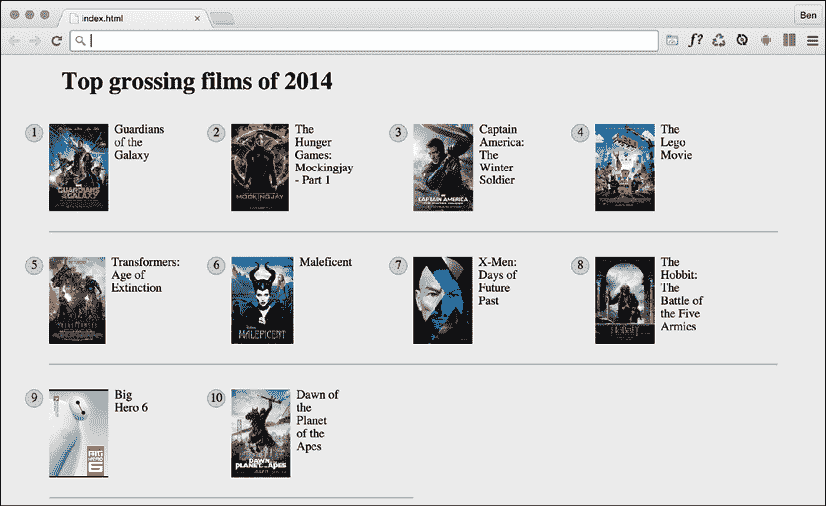
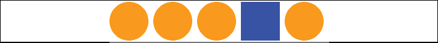

# 6

# CSS 选择器，字体，颜色模式，等等

在过去的几年里，CSS 拥有了大量的新特性。 有些可以使我们动画和变换元素。 其他方法允许我们创建多个背景图像、渐变、蒙版和滤镜效果，其他方法允许我们将 SVG 元素变得生动起来。

我们将在接下来的几章中讨论所有这些功能。 首先，我认为看看 CSS 的一些基础的最新改进会很有用。

没有人能够知道 CSS 语言中的每一个细微差别、功能和语法。 我已经和 CSS 打交道 20 年了，每周我都会发现一些新的东西(或者重新发现一些我已经忘记的东西)。 因此，我不认为尝试了解所有可能的 CSS 属性和值排列实际上是值得追求的。 相反，我认为更明智的做法是，充分了解解决最常见问题的可能性和存在的功能。

因此，我们将在这一章集中讨论一些技术，单位和选择器，我认为在构建响应式网页设计时最有用。 我希望你会有必要的知识来解决大多数问题，当开发一个响应式网页设计。

由于涉及的主题相当多，所以将它们分组:

**选择器、单位和能力**:

*   `::before`和`::after`伪元素
*   属性选择器和子字符串匹配
*   结构类，包括`:last-child`、`:nth-child`、`:empty`、`:not`
*   组合子选择器，包括子选择器、下一个兄弟选择器和随后的兄弟选择器
*   视口相关长度单位:vh, vw, vmax 和 vmin
*   `calc()`功能
*   CSS 自定义属性和环境变量
*   使用`@supports`来 fork CSS

**网页排版**:

*   `@font-face`规则
*   字体格式，包括`.woff`和`.woff2`
*   带有`font-display`属性的字体加载控件
*   可变字体和字体功能

**颜色**:

*   RGB
*   HSL
*   RGBA 和 HSLA

如你所见，我们有很多事要做。 让我们开始吧。

# 选择器、单元和功能

尽管它们可能看起来不像中最令人兴奋的主题，但选择器、单元和能力是 CSS 的“核心部分”。 掌握了这些，你用 CSS 解决问题的能力将会大大提高。 所以，跳过这一节你会有危险!

## 剖析 CSS 规则

在探讨 CSS 最近添加的一些之前，为了避免混淆，让我们建立一些用来描述 CSS 规则的术语。 考虑以下例子:

```html
.round {
  /* selector */
  border-radius: 10px; /* declaration */
} 
```

该规则由选择器(`.round`)和声明(`border-radius: 10px`)组成。 声明由属性(`border-radius`)和值(`10px`)进一步定义。 高兴我们在同一页? 很好，我们继续。

在撰写本文时，选择器级别 4 工作草案详细介绍了许多新的选择器，如`is()`、`has()`和`nth-col`。 遗憾的是，在所有常见的浏览器中都没有单一的实现。 然而，如果你想知道未来的事情是如何形成的，请前往[https://www.w3.org/TR/selectors-4/](https://www.w3.org/TR/selectors-4/)的草案。

## 伪元素和伪类

当我们稍后继续讨论“伪”选择器时，可能会产生一些混淆。 的原因是，在 CSS 中既有伪选择器，也有伪元素。 因此，让我们花一点时间来确定差异。

这里的“pseudo”一词指的是类似的东西，但不是真正的东西。 伪元素是类似于元素但不是真正的元素的东西，伪选择器是用来选择不是真正的东西的东西。 我现在听起来像蝙蝠侠里的谜语人了! 让我们用一些代码来澄清。 下面是如何在 CSS 中创建一个伪元素:

```html
.thing::before {
    content: "Spooky";
} 
```

这将在内容为“Spooky”的`.thing`元素中插入一个`::before`伪元素。 `::before`表现为元素的第一个子元素，`::after`表现为元素的最后一个子元素。

下面的图片可能会有所帮助。 它显示了一个在 Firefox 开发工具中表示的单一元素，其中包含在 CSS 中添加了`::before`和`::after`两个伪元素的文本:

<figure class="mediaobject"></figure>

图 6.1:Firefox 开发工具将显示伪元素在 DOM 中的位置

使用伪元素时要记住的关键一点是，如果不为`content`提供值，页面上将不会显示任何内容。 注意到在`before`之前的双冒号了吗? 正式来说，这就是您应该如何编码伪元素，因为这有助于将它们与伪选择器区分开来，后者只使用一个。 但是，一个冒号可以用于`::before`和`::after`的第一个实现，因此您仍然可以以这种方式编写它们。

你不能用伪选择器做同样的事; 它们总是只有一个冒号。 例如，`:hover`、`:active`和`:focus`都是伪选择器，使用单个冒号编写。

冒着过于简化的风险，不妨将伪选择器看作是选择原始内容的子部分的选择器。

希望伪选择器和元素之间的区别现在已经很清楚了。

做了这个区别之后，让我们继续看一下 CSS 中目前可用的一些强大的选择器。

## CSS Level 3 选择器以及如何使用它们

CSS 现在提供了难以置信的能力来选择页面中的元素。 你可能不认为这听起来很耀眼，但相信我，它会让你的生活更容易，你会爱上 CSS ! 我最好对这个大胆的断言加以说明。

### CSS 属性选择器

您可能已经使用 CSS 属性选择器来创建规则。 例如，考虑以下标记:

```html
 
```

这 CSS:

```html
img[alt] {
  border: 3px dashed #e15f5f;
} 
```

这将选择前面代码中的`img`元素，以及页面上具有`alt`属性的任何其他元素。

事实上,更有用的东西,我们可以结合`:not`否定选择器(我们稍后将详细看一下在本章)添加一个红色边框的任何图像没有`alt`属性或毫无防备的`alt`属性的值:

```html
img:not([alt]),
img[alt=""] {
    border: 3px solid red;
} 
```

从可访问性的角度来看，这将非常有用，因为它将在视觉上突出显示任何没有辅助技术包含替代文本的图像。

另一个例子，假设我们想要选择所有带有`data-sausage`属性的元素:

```html
[data-sausage] {
  /* styles */
} 
```

这里的关键是使用方括号指定您想要选择的属性。

在 HTML5 中引入的`data-*`类型属性是为了提供一个地方来存放其他任何现有机制都无法合理存储的自定义数据。 这些参数的规格说明可以在这里找到:[http://www.w3.org/TR/2010/WD-html5-20101019/elements.html#embedding-custom-non-visible-data-with-the-data-attributes](http://www.w3.org/TR/2010/WD-html5-20101019/elements.html#embedding-custom-non-visible-data-with-the-data-attributes)。

您还可以通过指定属性值来缩小范围。 例如，考虑以下规则:

```html
img[alt="Sausages cooking"] {
  /* Styles */
} 
```

这将只针对具有`alt`属性为“`Sausages cooking`”的图像; 例如:

```html
 
```

到目前为止，“很了不起，我们可以在 CSS2 中做到这一点。” CSS Level 3 选择器带来了什么?

### CSS 子字符串匹配属性选择器

CSS3 添加了基于属性选择器的子字符串选择元素的能力。 这听起来很复杂。 它不是! 这三个选项是属性是否:

*   从一个特定的子字符串开始
*   包含某个子字符串的实例
*   以某个子字符串结束

让我们看看它们是什么样子。

#### “begin with”子字符串匹配属性选择器

考虑以下标记:

```html
<li data-type="todo-chore">Empty the bins</li>
<li data-type="todo-exercise">Play football</li> 
```

假设标记表示我们正在构建的“todo”列表应用程序中的两个项。 即使它们都有不同的`data-type`属性值，我们也可以通过“beginning with”子字符串匹配属性选择器来选择它们，如下所示:

```html
[data-type^="todo"] {
/* Styles */
} 
```

这一切的关键字符是`^`符号。 这个符号被称为“插入符号”，尽管它也经常被称为“帽子”符号。 在中，它表示“以……开始”。 因为两个`data-type`属性都有以“todo”开头的值，所以我们的选择器选择它们。

#### “包含一个”子字符串匹配属性选择器

“包含”子字符串的实例匹配属性选择器的语法如下:

```html
[attribute*="value"] {
/* Styles */
} 
```

像所有属性选择器一样，如果需要的话，您可以将它们与`type`选择器(引用所使用的实际 HTML 元素的选择器)组合在一起，不过我只在必要时才这样做——如果您想更改所使用的元素类型的话。

让我们举个例子。 考虑一下这个标记:

```html
<p data-ingredients="scones cream jam">Will I get selected?</p> 
```

我们可以像这样选择这个元素:

```html
[data-ingredients*="cream"] {
    color: red;
} 
```

所有这些中的关键字符是`*`符号，在这里它的意思是“包含”。

“begin with”选择器在此标记中不起作用，因为属性内的字符串不是以“cream”开头的。 但是，它确实包含“cream”，所以“包含”子字符串属性选择器会找到它。

#### “end with”子字符串匹配属性选择器

匹配属性选择器的"ends with"子字符串的语法如下:

```html
[attribute$="value"] {
/* Styles */
} 
```

举个例子应该会有帮助。 考虑一下这个标记:

```html
<p data-ingredients="scones cream jam">Will I get selected?</p>
<p data-ingredients="toast jam butter">Will I get selected?</p>
<p data-ingredients="jam toast butter">Will I get selected?</p> 
```

假设我们只想在`data-ingredients`属性(第一个元素)中选择包含烤饼、奶油和果酱的元素。 我们不能使用“包含一个实例”(它将选择所有三个)或“以开始”(它将只选择最后一个)子字符串属性选择器。 但是，我们可以使用“ends with”子字符串属性选择器:

```html
[data-ingredients$="jam"] {
    color: red;
} 
```

的关键字符是`$`(美元)符号，意思是“以结束”。

好的，我们现在有一些非常方便的属性相关选择器。 同样值得知道的是，您可以链接属性选择器，就像您可以链接类选择器一样。

### 链接属性选择器

您还可以通过分组属性选择器来选择项目，从而拥有更多的可能性。

假设我们有这样的标记:

```html
<li
  data-todo-type="exercise"
  data-activity-name="running"
  data-location="indoor"
>
  Running
</li>
<li
  data-todo-type="exercise"
  data-activity-name="swimming"
  data-location="indoor"
>
  Swimming
</li>
<li
  data-todo-type="exercise"
  data-activity-name="cycling"
  data-location="outdoor"
>
  Cycling
</li>
<li
  data-todo-type="exercise"
  data-activity-name="swimming"
  data-location="outdoor"
>
  Swimming
</li> 
```

假设我只想选择“室内游泳” 我不能只使用`data-location="indoor"`，因为那会得到第一个元素。 我不能使用`data-activity-name="swimming"`，因为会得到第一个和第三个，但我可以这样做:

```html
[data-activity-name="swimming"][data-location="indoor"] {
    /* Styles */
} 
```

这选择了以“游泳”作为活动名称的元素，只要它们也以“室内”作为位置。

属性选择器允许您选择以数字开头的 id 和类。 在 HTML5 之前，以数字开头的 id 或类名不是有效标记。 HTML5 消除了这一限制。 当涉及到 id 时，仍然需要记住一些事情。 在 ID 名称中不应该有空格，并且它在页面上必须是唯一的。 更多信息，请访问[http://www.w3.org/html/wg/drafts/html/master/dom.html#the-id-attribute](http://www.w3.org/html/wg/drafts/html/master/dom.html#the-id-attribute)。 现在，虽然你可以在 HTML5 中用数字开始 ID 和类值，CSS 仍然限制你使用以数字开始的 ID 和类选择器([http://www.w3.org/TR/CSS21/syndata.html#characters](http://www.w3.org/TR/CSS21/syndata.html#characters))。 幸运的是，我们可以通过使用属性选择器轻松地解决这个问题; 例如`[id="10"]`。

是的，我认为我们的属性选择技能现在相当紧张。 让我们继续讨论如何根据元素在文档中的位置来选择元素。

## CSS 伪类结构

CSS 使我们能够根据元素在 DOM 结构中的位置选择元素。 让我们考虑一个常见的设计处理; 我们正在为一个更大的视口设计导航栏，我们想让除了最后一个链接之外的所有内容都在左边。 从历史上看，我们需要通过向最后一个链接添加类名来解决这个问题，这样我们就可以选择它，像这样:

```html
<nav class="nav-Wrapper">
  <a href="/home" class="nav-Link">Home</a>
  <a href="/About" class="nav-Link">About</a>
  <a href="/Films" class="nav-Link">Films</a>
  <a href="/Forum" class="nav-Link">Forum</a>
  <a href="/Contact-Us" class="nav-Link nav-LinkLast">Contact Us</a>
</nav> 
```

这本身就有问题。 例如，有时候，仅仅让内容管理系统将类添加到最终列表项中就非常困难。 幸运的是，在这种情况下，它不再是一个问题。 我们可以用 CSS 结构的伪类来解决这个问题。

### :胎选择器

CSS 2.1 已经有一个选择器适用于列表中的第一项; `:first-child`选择器:

```html
div:first-child {
  /* Styles */
} 
```

然而，CSS Level 3 添加了一个选择器，也可以匹配最后一个:

```html
div:last-child {
  /* Styles */
} 
```

让我们看看，如果我们不想或不能在标记中想要的位置添加另一个类，选择器如何解决我们之前的问题:

```html
.nav-Wrapper {
  display: flex;
}
.nav-Link:last-child {
  margin-left: auto;
} 
```

还有一些有用的选择器，用于当某项是唯一项:`:only-child`和某类型的唯一项:`:only-of-type`时。

### nth-child 选择器

选择器让我们解决更困难的问题。 使用与前面相同的标记，让我们考虑`nth-child`选择器如何允许我们在列表中选择我们想要的任意链接。

首先，选择所有其他列表项呢? 我们可以像这样选择奇数项:

```html
.nav-Link:nth-child(odd) {
  /* Styles */
} 
```

或者，如果你想选择偶数，你可以这样做:

```html
.nav-Link:nth-child(even) {
  /* Styles */
} 
```

#### 理解 n 条规则的作用

对于外行来说，基于 n 的选择器看起来相当吓人。 然而，一旦你掌握了逻辑和语法，你会惊讶于你可以用它们做什么。 让我们来看一看。

下面是我们可以使用的基于 n 的选择器:

*   `nth-child(n)`
*   `nth-last-child(n)`
*   `nth-of-type(n)`
*   `nth-last-of-type(n)`

我们已经看到，在基于 n 的表达式中已经可以使用(奇数)或(偶数)值，但(n)形参还可以以其他两种方式使用:

*   作为一个整数; 例如，`:nth-child(2)`将选择第二个项目。 向第 n 个选择器传递一个数字/整数很容易理解; 只需输入您想要选择的元素编号。
*   但是，您也可以传递一个数值表达式。 例如，`:nth-child(3n+1)`将从第一个元素开始，然后选择每三个元素。

选择器的数字表达式版本一开始可能有点令人困惑。 让我们分解一下。

##### 分解数学

让我们考虑一个页面上的10 个 span(你可以通过查看`example_06-05`来玩这些):

```html
<span></span>
<span></span>
<span></span>
<span></span>
<span></span>
<span></span>
<span></span>
<span></span>
<span></span>
<span></span> 
```

我们将把它们做成这样:

```html
span {
  height: 2rem;
  width: 2rem;
  background-color: blue;
  display: inline-block;
} 
```

正如你可能想象的那样，这给了我们一行 10 个正方形:

<figure class="mediaobject"></figure>

图 6.2:我们将在这十个相同的元素上测试我们的第 n 个孩子的选择技能

好的，让我们看看如何在基于 n 个选择的情况下选择不同的。

为了实用，当考虑括号内的表达式时，我从右边开始。 因此，例如，如果我想要计算出`(2n+3)`将选择什么，我从最右边的数字开始(这里的“3”表示从左边数起的第三项)，并知道它将从该点开始选择每第二个元素。 所以，添加这条规则:

```html
span:nth-child(2n + 3) {
  background-color: #f90;
  border-radius: 50%;
} 
```

结果在浏览器中:

<figure class="mediaobject"></figure>

图 6.3:任何与我们的第 n 个子选择器匹配的东西都会被转换成橙色

如您所见，我们的第 n 个选择器的目标是第三个列表项，然后是其后的第二个列表项。 如果有 100 个列表项，它将继续每隔一秒选择一个。

从第二项开始选择所有内容怎么样? 好吧，虽然你可以写`:nth-child(1n+2)`，但实际上你并不需要第一个数字`1`，除非另有说明，因为`n`等于`1`。 因此，我们可以只写`:nth-child(n+2)`。 同样地，如果我们想选择每第三个元素，而不是写`:nth-child(3n+3)`，我们可以只写`:nth-child(3n)`，因为每第三个元素无论如何都会从第三个元素开始，而不需要显式地声明它。

这个表达式也可以使用负数; 例如，`:nth-child(3n-2)`从- 2 开始，然后选择第三个项目。

你也可以改变方向。 默认情况下，一旦找到选择的第一部分，随后的部分就会沿着 DOM 中的元素向下移动(因此在我们的示例中是从左到右)。 然而，你可以用一个负号来逆转; 例如:

```html
span:nth-child(-2n+3) {
    background-color: #f90;
    border-radius: 50%;
} 
```

这个例子再次找到了第三个元素，但然后朝着相反的方向选择每两个元素(在 DOM 树上，因此在我们的例子中是从右到左):

<figure class="mediaobject"></figure>

图 6.4:有了减号，我们可以在相反的方向进行选择

希望，基于 n 的表达式现在更有意义了。 `nth-child`和`nth-last-child`的不同之处在于`nth-last-child`变体在文档树的另一端工作。 例如`:nth-last-child(-n+3)`从末尾的 3 开始，然后选择后面的所有项目。 下面是该规则在浏览器中给出的结果:

<figure class="mediaobject"></figure>

图 6.5:nth-last-child 允许您从元素的另一端开始

最后，让我们考虑一下`:nth-of-type`和`:nth-last-of-type`。 而前面的例子计算任何孩子,无论类型(永远记得`nth-child`选择目标所有儿童在同一 DOM level,不管类),`:nth-of-type`和`:nth-last-of-type`让你【显示】具体你要选择的项目类型。 考虑以下标记(`example_06-06`)，它是`div`和`span`元素的混合物，尽管具有相同的类:

```html
<span class="span-class"></span>
<span class="span-class"></span>
<span class="span-class"></span>
<span class="span-class"></span>
<span class="span-class"></span>
<div class="span-class"></div>
<div class="span-class"></div>
<div class="span-class"></div>
<div class="span-class"></div>
<div class="span-class"></div> 
```

如果我们使用选择器:

```html
.span-class:nth-of-type(-2n+3) {
  background-color: #f90;
  border-radius: 50%;
} 
```

尽管所有元素具有相同的`span-class`类，但它们并不被视为一个组。 选择器只对`span`元素应用一次，然后对`div`元素应用一次。 下面是被选中的内容:

<figure class="mediaobject"></figure>

图 6.6:n -of-type 选择器处理它们找到的每一种类型的元素

CSS 不像 JavaScript 和 jQuery 那样计算! 如果您习惯使用 JavaScript 和 jQuery，您将知道它从 0 开始计数(零基于索引)。 例如，如果在 JavaScript 或 jQuery 中选择一个元素，那么整数 1 实际上就是第二个元素。 然而，CSS 从 1 开始，所以 1 是它匹配的第一个项的值。

### 响应式网页设计中基于 n 的选择

为了结束这一小部分，我想说明一个现实生活中的响应式网页设计问题，以及我们如何使用基于 n 的选择来解决它。 假设我们正在创建一个页面，我们想要在其中列出某一年最卖座的电影。 我们的内容管理系统只是将所有项目显示在一个列表中，但我们希望以网格的形式显示它们。

对于一些视口，我们只能容纳两个项目的宽度。 然而，随着视口宽度的增加，我们可以显示三个项目，在更大的尺寸下，我们仍然可以显示四个项目。 但问题是这样的。 无论视口大小如何，我们都希望阻止底部行的任何项目在底部有边框。

您可以在`example_06-09`查看此代码。 下面是它的样子与四个项目宽:

<figure class="mediaobject"></figure>

图 6.7:我们在这里的任务是移除底部行上的边框，不管显示了多少边框

看到下面两个条目下面讨厌的边框了吗? 这就是我们需要移除的。 然而，我想要一个强大的解决方案，这样如果在底部一行有另一个项目(我们想要一个比其他网站更好的项目，并显示前 11 名最卖座的电影!)，边界也将从那里移除。

现在，由于在不同的视口，每行中有不同数量的项目，我们还需要在不同的视口宽度上更改基于 n 的选择。 但我们可以使用媒体查询。 为了简洁起见，我不打算向您展示每个媒体查询的选择。 我将向您展示每行匹配四个项目的选择，正如您在前面的屏幕截图中看到的那样。 但是，你可以打开代码示例来查看每个不同视口的选择:

```html
@media (min-width: 55rem) {
  .Item {
    width: 25%;
  }
  /*  Get me every fourth item and of those, only ones that are in the last four items */
  .Item:nth-child(4n+1):nth-last-child(-n+4),
  /* Now get me every one after that same collection too. */
  .Item:nth-child(4n+1):nth-last-child(-n+4) ~ .Item {
    border-bottom: 0;
  }
} 
```

你会注意到我们在这里链接了基于 n 的伪类选择器，就像我们在本章前面链接了属性选择器一样。 当你像这样链接第 n 个选择器时，理解这一点很重要，因为第一个选择器不会为下一个选择器“过滤”选择; 相反，元素必须匹配每一个选择。

对于这样的直线:

```html
.Item:nth-child(4n+1):nth-last-child(-n+4), 
```

`.Item`必须是四个项目中的第一个，也必须是最后四个项目中的一个:

<figure class="mediaobject"></figure>

图 6.8:解锁成就——使用 nth-child 选择器就像某种 nth-child 向导!

好了! 多亏了基于 n - th 的选择，我们有了一组防御性的规则来删除底部边框，而不管我们显示的视口大小或项目数量。

现在，我们在前面的例子中做的一个漂亮的选择是使用“subsequent sibling”选择器。 我们还没有研究过这个问题，所以我们将在接下来讨论它。

### 组合子选择器-子节点、下一个兄弟节点和随后的兄弟节点

这里我假设您理解基本的选择器模式，即一个类接另一个类选择任何匹配的子代。 例如，`.parent .descendant {}`将选择具有`.descendant`类的`.parent`元素的后代的任何元素，不管有多少层深。

#### 子选择符

子组合子只选择直接后代。 考虑一下这个标记:

```html
<div class="parent">
  <div class="descendant child">
    <div class="descendant grandchild"></div>
  </div>
</div> 
```

我们只能选择父元素的直接“子元素”，像这样:

```html
.parent > .descendant {
  /* Styles */
} 
```

注意选择器中两个类名之间的右尖括号; 这是子组合符。

#### 下一个兄弟姐妹

考虑另一个例子:

```html
<div class="item one">one</div>
<div class="item">two</div>
<div class="item">three</div>
<div class="item">four</div>
<div class="item">five</div>
<div class="item">six</div> 
```

让我们假设我们想要选择一个项目，但前提是它是`.one`的下一个兄弟项。 有了这个标记，我们可以像这样选择两个元素:

```html
.one + .item {
  border: 3px dashed #f90;
} 
```

这里的`+`符号表示“下一个兄弟元素”，因此选择`.one`的下一个兄弟元素。

#### 随后的兄弟姐妹

使用与前面示例相同的标记，如果我们想要选择第三个标记之后的所有项目，我们可以这样做:

```html
.item:nth-child(3) ~ .item {
  border: 3px dashed #f90;
} 
```

被称为“波浪”的符号`~`表示“每一个后续的兄弟姐妹”。

### 否定(:not)选择器

另一个方便的选择器是反类选择器。 这是用来选择除了其他东西以外的所有东西。 考虑一下:

```html
<div class="a-div"></div>
<div class="a-div"></div>
<div class="a-div"></div>
<div class="a-div not-me"></div>
<div class="a-div"></div> 
```

然后是这些风格:

```html
div {
  display: inline-block;
  height: 2rem;
  width: 2rem;
  background-color: blue;
}
.a-div:not(.not-me) {
    background-color: orange;
    border-radius: 50%;
} 
```

我们的最后一条规则将使具有`.a-div`类的每个元素都是橙色和圆形的，除了具有`.not-me`类的`div`的。 您可以在代码示例的`example_06-07`文件夹中找到这些代码(记住，您可以在[https://rwd.education](https://rwd.education)中获取所有代码):

<figure class="mediaobject"></figure>

图 6.9:否定选择器允许你从选择中排除元素

到目前为止，我们主要研究了所谓的结构性伪类(关于的完整信息可以在[http://www.w3.org/TR/selectors/#structural-pseudos](http://www.w3.org/TR/selectors/#structural-pseudos)上找到)。 然而，CSS 有更多的选择器。 如果你工作在一个 web 应用程序,值得看的 UI 元素的完整列表状态伪类([http://www.w3.org/TR/selectors/ UIstates](http://www.w3.org/TR/selectors/#UIstates)),例如,帮助你的目标规则基于是否被选中的东西。

### 空(:empty)选择器

我遇到过这样的情况:我有一个元素，它在内部包含一些填充，并动态地插入内容。 有时，它会插入内容，有时则不会。 问题是，当它不包含内容时，我仍然看到填充。 考虑一下`example_06-08`中的 HTML:

```html
<div class="thing"></div> 
```

这是 CSS:

```html
.thing {
  padding: 1rem;
  background-color: violet;
} 
```

在这个元素中没有任何内容，我仍然可以看到背景颜色。 幸运的是，我们可以很容易地隐藏它，像这样:

```html
.thing:empty {
  display: none;
} 
```

但是，要小心使用`:empty`选择器。 例如，你可能认为这是空的:

```html
<div class="thing"> </div> 
```

它不是! 看看里面的空格。 空格不是“没有”空格! 像换行符这样的东西也不是。

然而，为了混淆的问题，请注意注释并不影响一个元素被认为是“空的”还是不是。 例如，这仍然被认为是空的:

```html
<div class="thing"><!--I'm empty, honest I am--></div> 
```

记住要检查对用户的支持。 随着我们对 CSS 的研究越来越深入，如果你想知道当前浏览器对特定 CSS 或 HTML5 特性的支持水平，别忘了访问[http://caniuse.com](http://caniuse.com)。 除了显示浏览器版本支持(可按特性进行搜索)，它还提供了来自[http://gs.statcounter.com](http://gs.statcounter.com)的最新一组全局使用统计信息。

我们现在改变策略吧。 我们已经了解了如何在我们的响应世界中选择项目。 但是我们如何衡量它们呢? 下面我们来看看 viewport-percentage length。

## 响应视口百分比长度(vmax, vmin, vh，和 vw)

CSS 值和单元模块级别 3([http://www.w3.org/TR/css3-values/#viewport-relative-lengths](http://www.w3.org/TR/css3-values/#viewport-relative-lengths))迎来了视口相对单元。 这些非常适合响应式网页设计，因为每个单元都是视口长度的一个百分比:

*   vw 单位，每个 vw 单位是视口宽度的 1%
*   vh 单元，每个 vh 单元是视口高度的 1%。
*   vmin 单位(表示视口最小值; 等于 vw 或 vh 中较小的那一个)。
*   vmax(视口最大值; 等于 vw 或 vh 中较大的那个)。

想要一个模态窗口是浏览器高度的 90% ? 这很简单:

```html
.modal {
    height: 90vh;
} 
```

像 viewport 相对单元一样有用，一些浏览器有奇怪的实现。 例如，iOS 的 Safari 会在你从页面顶部滚动时改变可查看的屏幕区域(它缩小了地址栏)，但不会对报告的视口高度做出任何改变。

然而，当与字体结合时，您可能会发现这些单元更实用。 例如，现在很容易创建根据视口大小缩放的文本。

例如:

```html
.Hero-text {
  font-size: 25vw;
} 
```

现在，文本的大小将始终是视口宽度的百分比。

在访问 CSS 的过程中，有一个新的数学表达式`clamp()`，它允许我们指定最小、最大和可变大小。 例如，我们可以选择这样的标题:`.headline { font-size: clamp(20px, 40vw, 80px) }`。 虽然标题文本的大小可能会有所不同，但它永远不会小于`20px`或大于`80px`。 您可以在这里阅读`clamp()`的规范:[https://www.w3.org/TR/css-values-4/#calc-notation](https://www.w3.org/TR/css-values-4/#calc-notation)。

对，我们已经处理了各种类型的选择器，以及一些最近的长度单位，它们与响应式设计特别相关。 在我们继续讨论 web 排版之前，让我们先来看看 CSS 的一些重要功能。

## CSS calc

有多少次你试图编写一个布局，并想过“它需要父元素宽度的一半减去 10px”? 这在响应式网页设计中特别有用，因为我们永远不知道将浏览我们网页的屏幕的大小。 值得庆幸的是，CSS 有办法做到这一点。 它被称为`calc()`函数。 下面是 CSS 中的例子:

```html
.thing {
    width: calc(50% - 10px);
} 
```

只是要注意在符号周围包含空格。 例如，如果我写了`calc(50% -10px)`，漏掉了负号周围的空格，这个声明就不会起作用。

支持加法、减法、除法和乘法，因此可以解决很多问题在过去没有 JavaScript 是不可能解决的。

你也可以在那里使用 CSS 自定义属性。 如果你对 CSS 自定义属性一无所知，那你就很幸运了，因为这是我们接下来要讨论的内容。

## CSS 自定义属性

CSS 自定义属性通常被称为“CSS 变量”，尽管这并不是它们的唯一用途。

您可以在这里找到完整的规范:[http://dev.w3.org/csswg/css-variables/](http://dev.w3.org/csswg/css-variables/)。

CSS 自定义属性允许我们在样式表中存储信息，然后可以在样式表中使用这些信息或者用 JavaScript 读写这些信息。

让我们从一个简单的用例开始; 存储一个我们稍后可以在样式表中更简单地引用的`font-family`名称:

```html
:root {
  --MainFont: 'Helvetica Neue', Helvetica, Arial, sans-serif;
} 
```

这里，我们使用`:root`伪类将自定义属性存储在文档根目录中(尽管您可以将它们存储在任何您喜欢的规则中)。

伪类总是引用文档结构中最上面的父元素。 在 HTML 文档中，这始终是 HTML 标记，但对于 SVG 文档(我们将在*第 8 章**使用 SVG 实现分辨率独立性*中讨论 SVG)，它将引用不同的元素。

自定义属性总是以两个破折号开始，然后是自定义名称，然后在属性的末尾，就像普通 CSS 属性一样，我们以冒号结束属性。

我们可以在样式表的其他地方使用`var()`符号引用该值，如下所示:

```html
.Title {
  font-family: var(--MainFont);
} 
```

显然，您可以通过这种方式存储所需的任意数量的自定义属性。 这种方法的主要好处是，您可以更改变量内的值，并且使用该变量的每个规则都可以获得新值，而无需直接修改它们。

让我向您展示一个非常简单的例子，说明在 JavaScript 中使用 CSS 自定义属性。 你可以在`example_06-11`中找到这个。 我们将用拉迪亚德·吉卜林的诗《如果》做一页。 在底部是一个简单的亮/暗模式切换按钮。 这个按钮所要做的就是切换两个 CSS 自定义属性的值:`--background`和`--foreground`。

这是我们的 CSS:

```html
body {
    background-color: var(--background);
    color: var(--foreground);
} 
```

下面是我们正在使用的 JavaScript 代码片段。 本质上，它只是说，如果前景变量是`#eee`(接近白色)，那么将其设置为`#333`(深灰色); 否则，则取`#eee`。 如果背景变量为`#333`，则设置为`#eee`; 否则，做它`#333`:

```html
var root = document.documentElement;
var btn = document.getElementById("colorToggle");
btn.addEventListener("click", e => {
    root.style.setProperty("--background", getComputedStyle(root).getPropertyValue('--background') === "#333" ? "#eee" : "#333");
    root.style.setProperty("--foreground", getComputedStyle(root).getPropertyValue('--foreground') === "#eee" ? "#333" : "#eee");
}) 
```

下面是各个州的截图:

<figure class="mediaobject"></figure>

图 6.10:每个州并列的例子，颜色很容易与自定义属性交换

这个例子在本章的代码中是`example_06-12`。

自定义属性在特性方面也与其他属性一样。 例如，我们在根级别设置自定义的属性，但是如果在更接近所讨论的元素的地方重新声明它们，更具体的值将覆盖第一个。 考虑一下这个 CSS:

```html
:root {
  --backgroundColor: red;
}
header {
  --backgroundColor: goldenrod;
} 
```

标题和其中使用`--backgroundColor`自定义属性的任何元素将具有“黄花”背景色，而其他元素将具有红色背景。

### 设置回退值

可能存在这样一种情况:您希望防止自定义属性不可用。 您可以通过提供一个回退值来实现。 语法很简单:只需在自定义属性名和逗号之后提供回退值。 例如，假设我想使用`--backgroundColor`自定义属性，但如果该变量不可用，则默认为深灰色。 我可以这样写:

```html
.my-Item {
     background-color: var(--backgroundColor, #555);
} 
```

为了安全起见，养成在使用自定义属性时提供回退值的习惯非常有意义。

### env()环境变量

除了我们可能为自己创建的自定义属性外，偶尔还可以从我们所操作的环境中读取一些属性。 这些被称为“环境变量”。 我目前所知道的唯一可靠的例子是适用于锯齿手机的`safe-area-inset`属性。 “安全区域”因 iPhone X 而出名，它指的是屏幕顶部和底部的部分，UI 或物理按钮区域会影响到观看区域。

环境变量是用`env()`函数定义的。 与其他 CSS 函数一样，将值传递给这个函数。 例如，如果我们想在元素顶部添加与环境“safe area inset top”的高度相等的填充，我们可以这样做:

```html
padding-top: env(safe-area-inset-top); 
```

如果浏览器有可用的值，并且它理解`env()`函数，它将应用该值; 否则，它将跳过它到下一个声明。

您可以在这里阅读环境变量的当前规范:[https://drafts.csswg.org/css-env-1/#env-function](https://drafts.csswg.org/css-env-1/#env-function)。

iPhone 的凹痕屏幕还有一些额外的特点。 要获得处理 iPhone 凹槽的完整演练，请阅读[https://benfrain.com/css-environment-variables-iphonex/](https://benfrain.com/css-environment-variables-iphonex/)。

我一直在寻找 CSS 自定义属性的新用例。 它们可以“动态地”更新，这意味着它们在各种场景中都很有用。 它们可以很容易地从脚本中读取和写入，这一事实大大提升了它们的价值，远远超出了 CSS 预处理程序(如 Sass、Less 等)所普及的变量类型。

不能保证自定义属性以及以及我们已经讨论过和将要讨论的许多特性在您可能需要支持的每个浏览器中都能工作。 值得庆幸的是，CSS 有一种优雅的语法来封装与最新特性相关的代码。 让我们接下来看看。

## 使用@supports 来 fork CSS

当你构建一个响应式网页设计，试图提供一个在所有设备上都能运行的单一设计时，一个简单的事实是，你会经常遇到某些设备上不支持特性或技术的情况。 在这些情况下，您可能需要在 CSS 中创建一个 fork。 如果浏览器支持某个特性，则提供一段代码; 如果没有，它会得到不同的代码。

这种情况是由 JavaScript 中的`if`/`else`或`switch`语句处理的。 在 CSS 中，我们使用了`@supports`at-rule。

### 功能查询

CSS 中分叉代码的原生解决方案是使用“特性查询”，这是 CSS条件规则模块 3 级([http://www.w3.org/TR/css3-conditional/](http://www.w3.org/TR/css3-conditional/))的一部分。 iOS、Safari 9、Firefox 22、Edge 12 和 Chrome 28 都提供了支持。

特性查询遵循与媒体查询类似的语法。 考虑一下:

```html
@supports (flashing-sausages: lincolnshire) {
  body {
    sausage-sound: sizzling;
    sausage-color: slighty-burnt;
    background-color: brown;
  }
} 
```

在这里，只有当浏览器支持`flashing-sausages`属性和`lincolnshire`值结合使用时，样式才会被应用。 我非常确信没有浏览器会支持`flashing-sausages: lincolnshire`属性/值组合(如果他们支持，我想要完整的信用)，所以`@supports`块中的任何样式都不会被应用。

让我们考虑一个更实际的例子。 当浏览器支持 Grid 时，我们就使用它，当浏览器不支持 Grid 时，我们就退回到另一种布局技术。 考虑一下这个例子:

```html
@supports (display: grid) {
  .Item {
    display: inline-grid;
  }
}
@supports not (display: grid) {
  .Item {
    display: inline-flex;
  }
} 
```

这里，我们定义了一个代码块用于浏览器支持某个特性时，另一个代码块用于浏览器不支持时。 如果浏览器支持`@supports`，这个模式就很好(是的，我意识到这很令人困惑)，但是如果不支持，它就不会应用任何这些样式。

如果你想掩盖不支持`@supports`的设备，你最好先写默认声明，然后再写`@supports`特定声明。 这样，如果存在对`@supports`的支持，先前的规则将被驳回，而`@supports`块将被忽略，如果浏览器不支持它。 因此，我们前面的例子可以改写为:

```html
.Item {
  display: inline-flex;
}
@supports (display: grid) {
  .Item {
    display: inline-grid;
  }
} 
```

抱歉，那个解释太难了——希望你能理解!

### 结合条件

你也可以组合条件句。 假设我们只是想用一些规则如果 Flexbox 和`pointer: coarse`支持(如果你错过了它,我们覆盖了`pointer`交互媒体特性在第 3 章*,*【5】*媒体查询,支持【显示】*不同视窗*)。 这可能是什么样子的:*

```html
@supports ((display: flex) and (pointer: coarse)) {
  .Item {
    display: inline-flex;
  }
} 
```

在这里，我们使用了`and`关键字，但是我们可以使用`or`as，或者代替它。 例如，如果我们愿意应用样式，如果这两个先前的属性/值组合被支持，或 3D 转换被支持:

```html
@supports ((display: flex) and (pointer: coarse)) or
  (transform: translate3d(0, 0, 0)) {
  .Item {
    display: inline-flex;
  }
} 
```

注意，额外的圆括号将`display`和`pointer`条件与`transform`条件分隔开。

这就是特征查询的全部内容。 与媒体查询一样，首先将您的“默认”样式，然后将您的增强放在特性查询`@supports`at-rule 中。 记住，您可以组合查询，也可以提供应用所附代码的不同可能性。

# 网络排版

在过去的几年里，网页上的字体设计已经有了巨大的发展。 曾经有必要包含大量不同的文件格式，但现在基本上只剩下了`.woff`和更新的`.woff2`。 此外，在 CSS 中，我们对字体的细节有更多的控制，每个月都会出现新的可变字体。

如果你已经听不懂这些介绍，不要害怕。 让我们试着通过当前的艺术状态在网页排版。

首先，让我们来谈谈系统字体，因为它们代表了你可以选择的最佳 web 排版选择。

## 系统字体

每个操作系统都预装了自己的一组字体。 然而，除了一些例外，没有多少字体可以依赖于来安装在用户可能使用的每个设备上。

随后，我们已经习惯于编写字体“堆栈”，它使我们能够为浏览器编写字体“愿望列表”。 例如:

```html
font-family: -apple-system, BlinkMacSystemFont, Roboto, Ubuntu, 'Segoe UI', 'Helvetica Neue', Arial, sans-serif; 
```

浏览器读取该声明，然后从左到右，直到找到可用的字体，然后选择该字体来呈现相关的文本。

在我们的示例系统字体堆栈,macOS 用户将获得旧金山或 Helvetica(`-apple-system`告诉 Safari 选择旧金山和`BlinkMacSystemFont`告诉浏览器使用 Helvetica), Android 会“Roboto”流行的 Ubuntu Linux 发行版将“Ubuntu, Windows 用户将看到“Segoe UI,” 然后我们尝试用“Helvetica Neue”或“Arial”来做最后的尝试。 如果所有这些都失败了，我们告诉浏览器使用它拥有的任何 sans-serif 字体。

有些字体名称包含空格，所以必须用单引号或双引号将这些字符串括起来。 你可以在我们之前的例子中看到“Segoe UI”和“Helvetica Neue”都是这样写的。

在很多情况下，使用系统字体是一个令人信服的选择。 这是零网络开销，你永远不必担心字体不加载或看到不美观的跳跃在页面上作为一种字体替换另一种。

这样做的代价是，使用系统字体时，您永远无法完全确定您的文本在用户设备上是如何呈现的。 如果特定的字体对手头的项目至关重要，你会想看看带有`@font-face`的网页字体。

## @font-face CSS 规则

`@font-face`CSS 规则在 CSS2 中就出现了(但在 CSS 2.1 中就没有了)。 Internet Explorer 4 甚至部分支持! 那么，当我们应该讨论最新的 CSS 时，它在这里做什么呢?

嗯，事实证明，`@font-face`为 CSS 字体模块([http://www.w3.org/TR/css3-fonts](http://www.w3.org/TR/css3-fonts))重新引入了。 由于在 web 上使用字体的历史法律困境，它花了数年时间才获得关注，成为 web 排版的实际解决方案。

就像 web 上任何涉及资产的东西一样，在一开始，没有单一的文件格式用于字体传递。 嵌入式 OpenType(带有`.eot`扩展名的文件)字体是 Internet Explorer 的首选，而不是其他任何人的首选。 其他人喜欢更常见的 TrueType(文件扩展名`.ttf`)，而也有可伸缩矢量图形(`.svg`)，然后是 Web 开放字体格式(扩展名`.woff`/`.woff2`)。

值得庆幸的是，到 2020 年，你真的只需要考虑 WOFF (Web Open Font Format)，尽管有两种类型:WOFF 和 WOFF2。 当用户可以使用 WOFF2 时，它总是更可取的，因为它只是一种更有效的压缩字体信息的方法。

然而，好消息是，为每种浏览器添加每种自定义字体格式很容易。 让我们来看看!

## 使用@font-face 实现 web 字体

有许多在线字体服务将漂亮的字体放到网上。 谷歌字体和 Adobe 字体可能是最受欢迎的两个。 他们每个人都有自己的变体所需的语法，让他们的字体进入你的网站。 然而，由于它不总是可能或更可取的使用在线字体供应商，我们将看看如何为自己做它。

在这个练习中，我将使用 Rasmus Andersson 的“Inter”。 它是大多数[https://rwd.education](https://rwd.education)网站使用的字体。 不仅如此，它还是所谓的“可变”字体。

在我们讨论各种字体之前，让我们先来看看你可能会花大量时间处理的 web 字体。 如果您从[https://rsms.me/inter/](https://rsms.me/inter/)中获取“Inter”字体，那么将同时拥有标准字体和可变字体。

如果可以，下载你的字体的“子集”，特定于你打算使用的语言。 例如，如果您不打算使用西里尔或希腊字符，为什么要包括它们? 结果文件的大小会小得多，因为它不会包含您无意使用的语言的符号。 在购买字体时，您通常可以选择字符集，但是对于开源版本，有越来越多的服务和实用程序可以为您划分字体子集。

下载了“Inter”字体后，查看 ZIP 文件内部，可以看到不同文件的文件夹。 我选择了`Inter-Regular.woff2`和`Inter-Regular.woff`文件作为示例。

为了在 CSS 中使用 web 字体，我们使用了`@font-face`at 规则。 这让我们可以为字体提供一个名称，然后我们可以引用它，并告诉浏览器到哪里去获取这个文件。 让我们来看看语法:

```html
@font-face {
  font-family: 'InterRegular';
  src: url('Inter-Regular.woff2') format('woff2'),
url('Inter-Regular.woff') format('woff');
  font-weight: normal;
  font-style: normal;
  font-display: fallback;
} 
```

在`@font-face`大括号内，我们为字体命名为“InterRegular”。 如果我愿意，我可以叫它“飞香蕉”; 它不会影响任何东西，除了我需要引用这个字体的名字，当我想要使用它。 例如:

```html
.hero-Image {
  font-family: 'FlyingBanana', sans-serif;
} 
```

所以，要知道您可以做到这一点，但使用类似于您期望看到的字体的名称是有意义的!

然后可以在我们的`src`属性中看到两个连续的`url()`和`format()`部分。 每一对用逗号隔开。 正如我们前面提到的，`.woff2`总是我们的首选，因为它是相同字体的更好的压缩版本，所以我们把它列在前面。 只要浏览器能够理解`.woff2`并下载文件，它就会这样做。 但是，如果浏览器找不到该文件，或者无法理解`.woff2`，它将下载后面列出的`.woff`文件。

现在，尽管这段代码对于喜欢复制和粘贴的人来说非常好，但重要的是要注意字体存储的路径。 例如，如果我们要将字体放置在一个名为`fonts`的文件夹中，与`css`文件夹处于同一级别，我们就需要修改路径。 因此，我们的`@font-face`block 将变成:

```html
@font-face {
  font-family: 'InterRegular';
  src: url('../fonts/Inter-Regular.woff2') format('woff2'),
url('../fonts/Inter-Regular.woff') format('woff');
  font-weight: normal;
  font-style: normal;
  font-display: fallback;
} 
```

## 优化字体加载与字体显示

如果你的主要字体是一个 web 字体,这是一个好主意来请求文件预先通过加载一个链接的`head`部分与`rel`你的 HTML 属性值`preload`。 例如:

```html
<link
  rel="preload"
  href="fonts/inter.var.woff2"
  as="font"
  type="font/woff2"
  crossorigin
/> 
```

你可以在这里阅读更多关于字体优化技术:[https://developers.google.com/web/fundamentals/performance/resource-prioritization](https://developers.google.com/web/fundamentals/performance/resource-prioritization)。

以这种方式添加带有`rel="preload"`的链接会在关键渲染路径的早期触发对 web 字体的请求，而无需等待 CSSOM 被创建。 虽然谷歌推荐这种技术，但即使其他浏览器没有这样做，它也不太可能造成任何伤害。 只有对`.woff2`文件才值得这样做。 支持`.woff2`的浏览器也支持 `rel`属性中的`preload` 值。

我们可以利用`font-display`属性对 web 字体进行进一步的优化。

### font-display

对于支持它的浏览器，我们也可以利用 CSS 相对较新的`font-display`属性(旧的浏览器忽略了它):

```html
font-display: fallback; 
```

您还可以看到在前面的示例中使用了这个属性。 它提供了一些控制字体应该如何显示的方法。

我们提供的`fallback`值设置了一个非常短的“块”周期和一个很短的“交换”周期。

为了理解“块”和“交换”这类术语在这个上下文中的含义，我们需要考虑浏览器在显示字体方面做了什么。 我在这里只是泛泛而谈，但这些概念符合我们的需要。

假设一个浏览器正在加载我们的网页，我们为文本指定了一个网页字体。 浏览器已经有了 HTML，并且正在解析 CSS，它知道需要下载一种字体来显示它想要的文本。 在它将任何文本绘制到屏幕之前，它会挂起，等待获取 web 字体，以便它可以根据需要将文本绘制到页面上。 这种延迟被称为“FOIT”，意思是“不可见文本的闪光”。

一旦字体到达，浏览器就解析它并相应地将文本绘制到屏幕上。

希望这种延迟是无法察觉的。 如果不是，关于如何最好地处理事情有两种思想流派。

一种选择是等待字体下载，通常是几秒钟，但有时是无限期的; Safari 是这个选项最著名的支持者。

第二种选择是先用系统字体呈现文本，然后在浏览器拥有该字体时用正确的字体替换它。

这种从系统字体到实际预期字体的文本重绘被称为“无风格文本的 Flash”，简称为“FOUT”。

`font-display`设置所做的只是允许我们对我们希望看到发生的事情进行一些控制。

可能的值是:

*   `auto`:浏览器认为是最合适的。
*   `block`:获得长达 3 秒的白屏(但延迟最终是由浏览器决定的)，然后实际的字体可以替换任何系统显示的任何未来点。
*   `swap`:有很短的阻塞时间(建议 100ms)让网页字体加载; 否则，系统字体会显示出来，而 web 字体可以在任何可用的时候进行交换。
*   `fallback`:此选项阻止 web 字体替换系统字体，如果经过了设定的时间(建议 3 秒)。 这个选项最初阻塞大约 100 毫秒，允许交换最多 3 秒，但在那之后，如果 web 字体随后到达，它不会被应用。
*   `optional`:在这里，浏览器允许 web 字体加载的时间很短(100 毫秒)，但不允许交换期。 这样做的结果是，浏览器可以选择取消字体下载，如果它还没有到达，或者如果已经到达，将其用于后续页面加载。

您可以在这里阅读此属性的规范:[https://www.w3.org/TR/css-fonts-4/#font-display-desc](https://www.w3.org/TR/css-fonts-4/#font-display-desc)。

在 CSS 字体模块 4 级规范中，还指定了许多其他与字体相关的属性和值，但`font-display`是目前实现最广泛的，对响应式网页设计和性能具有最直接的相关性。

到目前为止，我们已经研究了如何将字体文件放入我们的项目中，甚至考虑了如何从性能的角度最好地处理它们。

然而，web 字体的最新发展，可能是让大多数开发人员兴奋的，是“可变”字体。 这是什么新魔法? 我听到你在哭泣。 让我们找出答案。

## 变量的字体

当我在 2020 年写这篇文章时，各种字体正在获得足够的关注。 有一个 W3C 规范，它们在最新的浏览器中得到了支持。 然而，由于支持仅限于最新的浏览器版本和操作系统，虽然我们将在这里讨论各种字体，但请注意，未来几年的实际情况是，您将需要考虑后备方案。

一种“正常”字体包含一种字体变体的信息和字形; 例如，常规版本的 Roboto。 相比之下，一个可变的字体，在一个单一的文件中，将包含每一个版本的 Roboto 所需要的一切。 粗体，斜体，薄，黑，中，以及更多的除此之外!

这种新的鬼把戏并非没有后果。 不同版本的字体在文件大小方面通常比“正常”版本大得多。 然而，当你大量使用单一字体时，它仍然是有意义的。

先不提警告，让我们看看可以用可变字体做些什么。

### 字体的变化

我使用之前使用的“Inter”字体，但使用的是可变版本。 首先，让我们考虑一下如何首先告诉浏览器我们正在使用可变字体。 它仍然是`@font-face`语法，但有一些变化:

```html
@font-face {
  font-family: 'Inter-V';
  src: url('fonts/inter.var.woff2') format('woff2-variations');
  font-weight: 100 900;
  font-style: oblique 0deg 10deg;
  font-display: fallback;
} 
```

首先要注意的是`format`。 我们将其设置为`woff2-variations`，以告诉浏览器这是一个使用了变体的字体文件。

接下来要记住的是，我们使用的是`font-weight`的范围。 我们在这里使用的两字值语法只有理解不同字体的浏览器才能理解。 这是一种告诉浏览器该字体可以使用的权重范围的方法。 虽然`font-weight`的范围限制为 0-999，但其他属性可能有不同的范围。 另外一些人仍然简单地接受`1`或`0`的值。

另一件要记住的事情是我们有`font-style`，它也提供了一个多值语法。 斜关键字告诉浏览器下一个值与`oblique`字体可以是什么样子有关，之后的两个值定义范围。 请注意，尽管这里的范围为正，但您可以传入负值。 我们马上就会看到。

最后，请注意，我们在这里使用了`font-display`属性来告诉浏览器我们希望如何处理该字体的加载和显示，但这与非可变字体没有什么不同。

您可以在`example_06-13`查看这个完整的示例。

### 使用可变字体

不同的字体使用所谓的“变化轴”。

变化轴只是定义刻度两端两个点的方式。 然后，可以在刻度上选择任意一点来显示字体。 规模不必很大; 事实上，它可以像“开”或“关”一样简单(我知道这不是一个很大的比例)。

变异轴又分为两组:注册和自定义。

#### 注册的轴

注册轴是最受欢迎的，该规范认为它值得拥有自己的 CSS 属性:

*   **Weight**:文本显示的重量; 例如`font-weight: 200.`
*   **宽度**:文本显示的宽度或宽度; 例如`font-stretch: 110%.`
*   **斜体**:字体是否显示为斜体; 例如:`font-style:` `italic.`
*   **倾斜**:不要将其与斜体混淆。 这只是改变了文本的角度; 它不能替代任何符号; 例如`font-style: oblique 4deg.`
*   **Optical-size**:这是注册轴中唯一需要一个新字体属性的轴。 使用`font-optical-sizing`可以让你改变，是的，你猜对了，光学尺寸。 但那是什么呢? 这是一种根据显示的大小改变字形以提高清晰度的做法。 例如，这意味着在大尺寸上显示的相同字形可能拥有更细的柄。

您选择使用这些属性的值应该在您正在使用的变量字体的能力范围内。 例如，如果您使用的字体只能达到`600`，则没有太多的点指定字体重`999`。

还有一个低级属性可以让你把可变字体设置捆绑成一个单一的属性/值组合:

```html
font-variation-settings: 'wght' 300, 'slnt' -4; 
```

在这里，我们将字体重量设置为`300`，倾斜的角度设置为`-4`。 然而，规范提供了以下警告建议:

> 在可能的情况下，作者通常应该使用与字体变化相关的其他属性(例如字体光学大小)，并且只在特殊情况下使用该属性，当它的使用是访问特定不经常使用的字体变化的唯一方法时。 例如，使用字体重量:700 比使用字体变化设置:" wight " 700 更可取。

我真的不知道为什么会给出这个建议。 规范没有解释其基本原理。 希望这个细节将在规范完成时添加。 您可以在这里找到当前版本:[https://drafts.csswg.org/css-fonts-4/](https://drafts.csswg.org/css-fonts-4/)。

字体变化属性可以动画和过渡，这可以做出一些奇妙的效果!

介绍了注册轴组之后，让我们简要地看一下自定义轴组。

#### 自定义轴

不同的字体可以包含各自的轴。 例如，“FS Pimlico 辉光 VF”字体有一个“辉光”轴。 你可以这样修改:

```html
font-variation-settings: 'GLOW' 500; 
```

注意这个自定义轴是如何大写的; 即`'GLOW'`? 这就是如何在可变字体设置中确定注册轴和自定义轴之间的差异。

如果你还没有被这些看似无穷无尽的可能性弄得头疼，我还需要告诉你关于字体的特性，它们有点类似于我们刚刚看到的两个不同的轴。 别担心; 它很快就会有意义。

### 字体功能

不同的字体也可以包含它们自己的“特性”。 这些功能可以是字体设计师想要的任何东西! 我们来看看国际米兰的选择:

<figure class="mediaobject"></figure>

图 6.11:在 Inter 设置页面的右边是字体的巨大可能性

所有这些“特性”都是可以通过 CSS 打开的设置。 您可以在这里使用这些设置:[https://rsms.me/inter/lab/?varfont=1](https://rsms.me/inter/lab/?varfont=1)。

当我们想要应用这些自定义特性时，我们使用`font-feature-settings`属性。 这与`font-variation-settings`语法非常相似。 例如，要打开“开叉零”，我们可以这样做:

```html
font-feature-settings: 'zero'; 
```

这个“划开 0”选项是一个二进制选项，因此没有必要写`'zero' 1`。 然而，如果我们想在我们的风格中进一步切换这个设置，我们可以这样写:

```html
font-feature-settings: 'zero' 0; 
```

当您想应用多个字体特性设置时，您可以用逗号分隔它们。 所以，如果我们想要“小写 L 带尾”和“大写 i 带衬线”，我们可以这样写:

```html
font-feature-settings: 'cv08', 'cv05'; 
```

这些是在已完成的`example_06-13`中打开的选项。

有更多的方式设置和功能指定在 CSS 字体模块级别 4。 我们只谈到了皮毛! 为了跟上技术的发展，请阅读下面的规范:[https://drafts.csswg.org/css-fonts-4/#introduction](https://drafts.csswg.org/css-fonts-4/#introduction)。

### 锻炼

看看我们的 CSS 例子页面:

```html
:root {
  --MainFont: 'Helvetica Neue', Helvetica, Arial, sans-serif;
}
@font-face {
  font-family: 'Inter-V';
  src: url('fonts/inter.var.woff2') format('woff2-variations');
  font-weight: 100 900;
  font-display: fallback;
  font-style: oblique 0deg 10deg;
}
body {
  background-color: var(--background);
  color: var(--foreground);
  transition: all 0.35s;
  font-size: 1.2em;
  font-family: 'sans-serif';
  font-family: var(--MainFont);
  font-weight: 400;
}
@supports (font-variation-settings: 'wdth' 200) {
  body {
    font-family: 'Inter-V';
    font-variation-settings: 'wght' 300, 'slnt' -4;
    font-feature-settings: 'cv08', 'cv05';
  }
} 
```

你现在能理解多少? 我们为我们的系统字体堆栈定义了一个 CSS 自定义属性，一个加载变量字体的字体面，以及为权重和倾斜定义的范围。 我们有 sans-serif 作为默认的字体堆栈，然后我们用自定义属性为理解它的浏览器定义的字体堆栈覆盖它。 最后，我们对各种字体进行了测试，并为其定义了设置，还添加了一些我们希望看到的额外字体特性。

关于网页排版的讨论到此结束。 到目前为止，在这一章中，我们已经看到 CSS 如何给我们提供了新的选择能力和为我们的设计添加自定义排版的能力。 现在，我们来看看 CSS 允许我们使用颜色的方法。

# CSS 颜色格式和 alpha 透明度

当我们开始使用 CSS 时，我们通常首先将颜色定义为十六进制值。 然而，CSS 提供了更强大的方法来声明颜色。 我们将探索另外两个:RGB 和 HSL。 在中，这两种格式使我们能够同时使用 alpha 通道(分别为 RGBA 和 HSLA)。 在本章的剩余部分，我们将看看这些是如何工作的。

## RGB 颜色

RGB(红、绿、蓝)是一种已经存在了几十年的着色系统。 它的工作原理是为一种颜色的红色、绿色和蓝色组成部分定义不同的值。 例如，红色可能在 CSS 中定义为十六进制值`#fe0208:`

```html
.redness {
    color: #fe0208;
} 
```

要想找到一篇描述如何更直观地理解十六进值的好文章，我推荐 Smashing Magazine 上的这篇文章:[http://www.smashingmagazine.com/2012/10/04/the-code-side-of-color/](http://www.smashingmagazine.com/2012/10/04/the-code-side-of-color/)。

然而，在 CSS 中，这种颜色同样可以用 RGB 符号来描述:

```html
.redness {
    color: rgb(254, 2, 8);
} 
```

大多数图像编辑应用程序在颜色选择器中同时以十六进制和 RGB 值显示颜色。 Photoshop 的颜色选择器有 R, G 和 B 框来显示每个通道的值。 例如，R 值可能是 254,G 值是 2,B 值是 8。 这是很容易转移到 CSS 颜色属性值。 在 CSS 中，定义了颜色模式(例如 RGB)后，红色、绿色和蓝色的值在括号中以逗号顺序分隔(就像我们在前面的代码中所做的那样)。

## 奥软的颜色

除了 RGB, CSS 还允许我们将颜色值声明为色相、饱和度和明度(HSL)。

HSL 和 HSB 不一样! 不要错误地认为，在图像编辑应用程序(如 Photoshop)的颜色选择器中显示的色相、饱和度和亮度(HSB)值与 hsl 相同——它不是!

使用 HSL 的乐趣在于，根据给定的值理解要表示的颜色相对简单。 例如，除非你是某种颜色挑选忍者，我敢打赌你不能立即告诉我`rgb(255, 51, 204)`是什么颜色? 什么人吗? 不,我没有。

但是，如果显示出`hsl(315, 100%, 60%)`的 HSL 值，我可以猜测它介于品红和红色之间(它实际上是喜庆的粉红色)。 我是怎么知道的? 很简单:“年轻人也可能是邋遢的流氓!” 这个助记符将帮助您记住 HSL 颜色轮中的颜色顺序，稍后您将看到这一点。

HSL 在一个 360°的色轮上工作。 它看起来是这样的:

<figure class="mediaobject"></figure>

图 6.12:HSL 色轮

HSL 颜色定义中的第一个数字表示色调。 看看我们的车轮，我们可以看到黄色是 60°，绿色是 120°，青色是 180°，蓝色是 240°，品红色是 300°，最后红色是 360°。 因此，由于上述 HSL 颜色的色调为 315，很容易知道它将介于品红(300°)和红色(360°)之间。

HSL 定义中的以下两个值是饱和度和亮度，用百分比指定。 这些仅仅改变了基础色调。 对于更饱和或“色彩丰富”的外观，在第二个值中使用更高的百分比。 最终的值，控制亮度，可以在黑色的 0%和白色的 100%之间变化。

因此，一旦您将颜色定义为 HSL 值，就很容易创建它的变体，只需改变饱和度和明度百分比。 例如，我们的红色可以在 HSL 值中定义如下:

```html
.redness {
    color: hsl(359, 99%, 50%);
} 
```

如果我们想要做一个稍微深一点的颜色，我们可以使用相同的 HSL 值，只改变亮度(最终值)的百分比值:

```html
.darker-red {
    color: hsl(359, 99%, 40%);
} 
```

总之,如果你能记住记忆”年轻人可以混乱的流氓”(或任何其他助记你记住)奥软色轮,你可以大约写奥软的颜色值而不是诉诸于一种颜色选择器,以及创建变体。 在办公室聚会上向 Ruby、Node.js 和.NET 开发人员展示这个技巧，迅速赢得一些赞誉!

### 阿尔法通道

到目前为止，你可能会奇怪为什么我们要使用 HSL 或 RGB，而不是我们多年来一直使用的十六进制值。 HSL 和 RGB 与十六进制的不同之处在于允许使用 alpha 透明通道，这样元素下面的东西就可以“显示出来”。 HSLA 颜色声明在语法上类似于标准 HSL 规则。 然而，除此之外，您还必须声明该值为`hsla`(而不仅仅是`hsl`)，并添加一个额外的不透明度值，以 0(完全透明)和 1(完全不透明)之间的十进制值给出。 例如:

```html
.redness-alpha {
    color: hsla(359, 99%, 50%, 0.5);
} 
```

RGBA 语法遵循与 HSLA 相同的约定:

```html
.redness-alpha-rgba {
    color: rgba(255, 255, 255, 0.8);
} 
```

你可能会想，为什么不直接使用`opacity`? 因为 CSS 允许使用`opacity`声明设置元素的不透明度。

当我们对一个元素应用`opacity`时，一个值被设置在 0 和 1 之间，以十进制递增(例如，不透明度设置为。1 是 10%)。 然而，不透明度不同于 RGBA 和 HSLA，因为设置一个元素的不透明度值会影响整个元素，而使用 HSLA 或 RGBA 设置一个值允许元素的特定部分有一个 alpha 层。 例如，一个元素可以有一个 HSLA 值作为背景，但其中的文本可以有一个纯色。

我们能从这些关于颜色的讨论中学到什么? 首先，如果给定的值是十六进制值，则不需要将它们转换为其他任何值。 同样地，如果 RGB 语法对您来说非常合理，那么这是一个可能性，并且您可以轻松地使用 RGBA 语法添加 alpha 通道。 对我们大多数人来说，对 HSL 有一些了解将是非常有用的。 我发现它是 CSS 中所有考虑颜色的方式中最人性化的; 现在它几乎得到了普遍的支持，而且它还支持带有 HSLA 的 alpha 通道。

# 总结

在本章中，我们学习了如何使用 CSS 强大的选择功能来选择页面上几乎所有我们需要的东西。 我们现在了解了 CSS 更强大的颜色功能，以及我们如何使用 RGB 和 HSL 应用颜色，以及如何使用透明 alpha 层实现伟大的美学效果。

在本章中，我们还学习了如何使用`@font-face`规则将自定义网页排版添加到设计中，将我们从单调的网页安全字体选择的束缚中解放出来。 我们还深入研究了各种字体，并考虑了它们所提供的可能性。

除此之外，我们还花时间研究了 CSS 自定义属性和在代码中提供特性分叉的`@supports`at 规则。

尽管有这么多伟大的新特性和技术，我们对 CSS 所能做的只是表面功夫。

*第七章**惊艳美学与 CSS* 在那里，我们将看到更多的 CSS 文本阴影，框阴影，渐变，多重背景，等等!