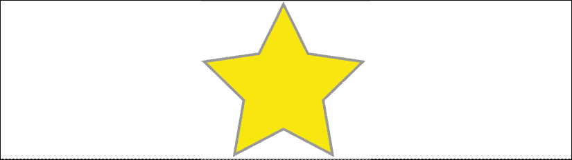
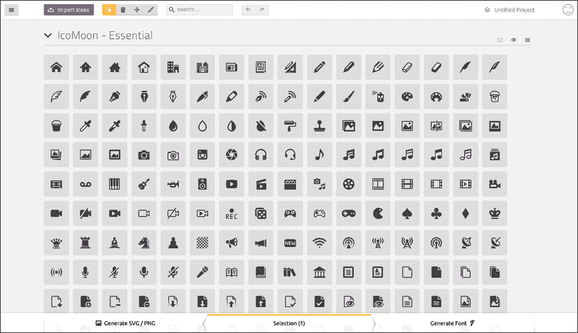
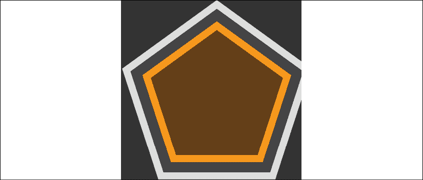
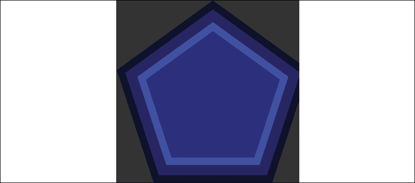

# 8

# 使用 svg 实现分辨率独立性

关于 SVG(可缩放矢量图形的缩写)的书籍已经、正在以及将来都将是完整的。 SVG 是响应式 web 设计的一项重要技术，因为它为所有屏幕分辨率提供了清晰和未来验证的图形资产。

网页上的图像，如 JPEG, GIF 或 PNG 格式，其视觉数据保存为设置像素。 如果您以这些格式保存图形，并设置宽度和高度，并将图像放大到原始大小的两倍或更多，那么它们的局限性就很容易暴露出来。

这是一个屏幕截图; 我在浏览器中放大的 PNG 图片:

<figure class="mediaobject"></figure>

图 8.1:光栅图像的缺点在当今的高清晰屏幕上很容易看到

你能看出来这张图片像素化很明显吗? 下面是保存为矢量图像的完全相同的图像，以 SVG 格式，并缩放到类似的级别:

<figure class="mediaobject"></figure>

图 8.2:无论显示大小如何，SVG 看起来都很清晰

希望差别是明显的。

除了尽可能小的图形资产，使用 SVG 而不是 JPEG、GIF 或 PNG 将产生与分辨率无关的图形，与位图图像相比，这些图形需要更小的文件大小。

虽然我们将在本章中涉及 SVG 的许多方面，但重点是如何将它们集成到您的工作流中，同时概述 SVG 的可能性。

在本章中，我们将介绍:

*   SVG 的简史和基本 SVG 文档的剖析
*   使用流行的图像编辑包和服务创建 svg
*   在带有`img`和`object`标签的页面中插入 svg
*   插入 svg 作为背景图像
*   直接(内联)插入 svg 到 HTML 中
*   重用 SVG 符号
*   引用外部 SVG 符号
*   每个插入方法都具有哪些功能
*   使用 SMIL 动画 svg
*   使用外部样式表对 svg 进行样式化
*   使用内部样式设计 svg
*   用 CSS 修改和动画 svg
*   媒体查询和 svg
*   优化 svg
*   使用 svg 为 CSS 定义过滤器
*   使用 JavaScript 和 JavaScript 库操作 svg
*   实施建议
*   进一步的资源

SVG 是一个密集的主题。 本章的哪些部分与您的需求最为相关，这取决于您对 SVG 的实际需求。 希望我能提前提供一些捷径。

如果您只是想将网站上的静态图形资产替换为 SVG 版本，以获得更清晰的图像和/或更小的文件大小，那么可以查看有关使用 SVG 作为背景图像和`img`标记的简短部分。

如果您想知道哪些应用程序和服务可以帮助您生成和管理 SVG 资产，请跳过*用流行的图像编辑包和服务创建 SVG*一节，了解一些有用的链接和指针。

如果您想更全面地理解 SVG，或者想使 SVG 动画化并操作 SVG，您最好让自己感到舒服，并获得您最喜欢的饮料的两倍大小，因为这可能需要一些时间。

为了开始我们的理解之旅，请和我一起回到 2001 年。

# SVG 的简史

SVG 的第一个发行版是在 2001 年。 这不是打字错误。 SVG 自 2001 年以来一直是“一件事”。 虽然 svg 在发展过程中获得了广泛的关注，但只有在高分辨率设备出现后，svg 才获得了广泛的兴趣和采用。 以下是 svg 1.1 规范([http://www.w3.org/TR/SVG11/intro.html](http://www.w3.org/TR/SVG11/intro.html))的介绍:

> SVG 是一种用 XML 描述二维图形的语言[XML10]。 SVG 支持三种类型的图形对象:矢量图形形状(例如，由直线和曲线组成的路径)、图像和文本。

顾名思义，可伸缩矢量图形允许在代码中将二维图像描述为矢量点。 这使得它们成为图标、线条画和图表的最佳选择。

由于向量描述的是相对点，它们可以缩放到任何大小，而不丢失保真度。 此外，在数据方面，由于 SVG 被描述为矢量点，与 JPEG、GIF 或 PNG 文件相比，它往往使它们变得很小。

现在浏览器对 SVG 的支持也非常好。 Android 2.3 及以上，以及 Internet Explorer 9 及以上支持:[http://caniuse.com/#search=svg](http://caniuse.com/#search=svg)。

# 一个图像，也是一个可读的网络文档

通常，如果在文本编辑器中查看图像文件的代码，生成的文本是完全无法理解的。

SVG 图形的不同之处在于，它们实际上是用标记样式语言描述的。 SVG 是用**可扩展标记语言**(**XML**)编写的，是 HTML 的近亲。 尽管您可能没有意识到，XML 在互联网上无处不在。 你是否使用 RSS 阅读器? 这就是 XML。 XML 是一种封装 RSS 提要内容的语言，它使 RSS 提要可以被各种工具和服务使用。

因此，不仅机器可以阅读和理解 SVG 图形，我们也可以。

让我给你举个例子。 看看这张星图:

<figure class="mediaobject"></figure>

图 8.3:基本的 SVG

这是一个 SVG 图形，在`example_08-01`中称为`Star.svg,`。 您可以在浏览器中打开这个示例(它将以星号的形式出现)，也可以在文本编辑器中打开它，然后可以看到生成它的代码。 考虑一下:

```html
<?xml version="1.0" encoding="UTF-8" standalone="no"?>
<svg
  width="198px"
  height="188px"
  viewBox="0 0 198 188"
  version="1.1"

  xmlns:xlink="http://www.w3.org/1999/xlink"
  xmlns:sketch="http://www.bohemiancoding.com/sketch/ns"
>
  <!-- Generator: Sketch 3.2.2 (9983) - http://www.bohemiancoding.com/sketch -->
  <title>Star 1</title>
  <desc>Created with Sketch.</desc>
  <defs></defs>
  <g
    id="Page-1"
    stroke="none"
    stroke-width="1"
    fill="none"
    fill-rule="evenodd"
    sketch:type="MSPage"
  >
    <polygon
      id="Star-1"
      stroke="#979797"
      stroke-width="3"
      fill="#F8E81C"
      sketch:type="MSShapeGroup"
      points="99 154 40.2214748 184.901699 51.4471742 119.45085 3.89434837 73.0983006 69.6107374 63.5491503 99 4 128.389263 63.5491503 194.105652 73.0983006 146.552826 119.45085 157.778525 184.901699 "
    ></polygon>
  </g>
</svg> 
```

这就是将星号生成为 SVG 图形所需的全部代码。

通常，如果您以前从未看过 SVG 图形的代码，那么您可能想知道为什么要看。 如果你想要的只是在 web 上显示矢量图形，你当然不需要这样做。 只要找到一个图形应用程序，将您的矢量艺术品保存为 SVG，您就完成了。

我们将在接下来的页面中列出中的几个包。 然而，尽管只在图形编辑应用程序中使用 SVG 图形是很常见的，也很有可能，但如果需要开始操作 SVG 并对其进行动画化，那么准确地理解 SVG 是如何结合在一起的以及如何根据自己的意愿对其进行调整将非常有用。

因此，让我们仔细研究一下 SVG 标记并了解其中到底发生了什么。 我想提请您注意几件关键的事情。

## 根 SVG 元素

这里的根 SVG 元素具有`width`、`height`和`viewBox`的属性:

```html
<svg width="198px" height="188px" viewBox="0 0 198 188" 
```

其中每一个都在如何显示 SVG 方面扮演着重要的角色。

希望此时您已经理解了术语“视口”。 在本书的大部分章节中，它都被用来描述一个设备中用来查看内容的区域。 例如，一个移动设备可能有一个 320px * 480px 的视口。 桌面计算机可能有 1920px * 1080px 的视口。

SVG 的`width`和`height`属性有效地创建了一个视口。 通过这个已定义的视口，我们可以窥视 SVG 中定义的形状。 就像网页一样，SVG 的内容可能比视口大，但这并不意味着其他内容不存在; 它只是隐藏在我们当前的视线之外。

另一方面，`viewBox`定义了控制 SVG 的所有形状的坐标系统。 您可以将`viewBox`值`0 0 198 188`看作描述矩形的左上和右下区域。 前两个值，技术上称为`min-x`和`min-y`，描述左上角，而后两个值，技术上称为宽度和高度，描述右下角。 有了`viewBox`属性，您可以进行放大或缩小图像等操作。 例如，如果你像这样将`viewBox`属性中的`width`和`height`减半:

```html
<svg width="198px" height="188px" viewBox="0 0 99 94" 
```

形状将“缩放”以填充 SVG 的宽度和高度。

`viewBox`真正理解和 SVG 坐标系和机会这礼物,我推荐这篇文章由莎拉 Soueidan: http://sarasoueidan.com/blog/svg-coordinate-systems/和[这篇文章 Jakob Jenkov: http://tutorials.jenkov.com/svg/svg-viewport-view-box.html](http://sarasoueidan.com/blog/svg-coordinate-systems/)[【5】。](http://tutorials.jenkov.com/svg/svg-viewport-view-box.html)

## 名称空间

这个 SVG 有一个为生成它的 Sketch 图形程序定义的额外名称空间(`xmlns`是 XML 名称空间的缩写):

```html
xmlns:sketch="http://www.bohemiancoding.com/sketch/ns" 
```

这些名称空间引用往往只被生成 SVG 的程序使用，所以当 SVG 绑定到 web 上时，通常不需要它们。 减少 svg 尺寸的优化过程通常会将其剥离。

## 标题和 desc 标签

有`title`和`desc`标记，使 SVG 文档具有高度可访问性:

```html
<title>Star 1</title>
    <desc>Created with Sketch.</desc> 
```

这些标签可以用来描述无法看到的图形内容。 但是，当 SVG 图形用于背景图形时，可以删除这些标记以进一步减小文件大小。

## def 标签

在我们的示例代码中有一个空的标签`defs`:

```html
<defs></defs> 
```

尽管在我们的示例中为空，但这是一个重要的元素。 它用于存储各种可重用内容的定义，如渐变、符号、路径等等。

## g 元素

元素`g`用来将其他元素分组在一起。 例如，如果你正在绘制一辆汽车的 SVG，你可以将组成整个车轮的形状分组到`g`标签中:

```html
<g id="Page-1" stroke="none" stroke-width="1" fill="none" fill-rule="evenodd" sketch:type="MSPage"> 
```

在我们的`g`标记中，我们可以看到这里重用了早期的 Sketch 名称空间。 它将帮助图形应用程序再次打开该图形，但如果该图像被绑定到其他地方，它将没有进一步的目的。

## SVG 图形

最里面的节点在这个例子中是一个多边形:

```html
<polygon id="Star-1" stroke="#979797" stroke-width="3" fill="#F8E81C" sketch:type="MSShapeGroup" points="99 154 40.2214748 184.901699 51.4471742 119.45085 3.89434837 73.0983006 69.6107374 63.5491503 99 4 128.389263 63.5491503 194.105652 73.0983006 146.552826 119.45085 157.778525 184.901699 "></polygon> 
```

svg 有许多现成的形状(`path`、`rect`、`circle`、`ellipse`、`line`、`polyline`和`polygon`)。

## SVG 路径

SVG 路径不同于 SVG 的其他形状，因为它们由任意数量的连接点组成(让您可以自由创建任何喜欢的形状)。

所以，这就是 SVG 文件的核心内容，希望您现在对正在发生的事情有了高层次的理解。 虽然有些人喜欢在代码中手写或编辑 SVG 文件，但更多的人宁愿使用图形包生成 SVG。 让我们考虑一些更受欢迎的选择。

# 使用流行的图像编辑包和服务创建 svg

SVG 可以打开,编辑,写在一个文本编辑器,都有大量的应用**提供一个图形用户界面**(**GUI)简化编写复杂的 SVG 图形如果你来自一个图形编辑背景。 也许最明显的选择是 Adobe 的 Illustrator (PC/Mac)。 然而,它是昂贵的对于普通用户,所以我个人的偏好是波西米亚编码的草图(Mac 只有:【显示】http://bohemiancoding.com/sketch/),仍不便宜 99 美元,或 Figma 是跨平台的,并使用一个基于订阅的模式,目前免费启动计划。 在[https://www.figma.com/](https://www.figma.com/)查看 Figma。**

如果您使用 Windows/Linux 和/或正在寻找便宜的选项，可以考虑免费开放的源 Inkscape([https://inkscape.org/en/](https://inkscape.org/en/))。 它绝不是最漂亮的工具，但它非常强大(如果你想要任何证据，查看 Inkscape 图库:[https://inkscape.org/en/community/gallery](https://inkscape.org/en/community/gallery)/)。

最后，有几个在线编辑。 谷歌有 svg-edit([https://svg-edit.github.io/svgedit/editor/svg-editor.html](https://svg-edit.github.io/svgedit/editor/svg-editor.html))。 还有DRAW SVG([http://www.drawsvg.org/](http://www.drawsvg.org/))和Method DRAW，一个可能看起来更好的 SVG -edit 分叉([http://editor.method.ac/](http://editor.method.ac/))。

## 使用 SVG 图标服务节省时间

上述应用程序都提供了从头创建 SVG 图形的能力。 但是，如果你想要的是图标，你可以通过从在线图标服务下载图标的 SVG 版本来节省大量时间(对我来说，还可以得到更好的结果)。

我个人最喜欢的是[https://icomoon.io](https://icomoon.io)，尽管[http://fontastic.me](http://fontastic.me)也很棒。 为了快速说明在线图标服务的好处，加载[https://icomoon.io](https://icomoon.io)应用程序将为您提供一个可搜索的图标库(一些是免费的，一些是付费的):

<figure class="mediaobject"></figure>

图 8.4:在线服务可以使开始整合 svg 变得简单

您选择您想要的，然后单击下载。 结果文件包含 SVG、png 以及放置在`defs`元素中的 SVG 符号(请记住`defs`元素是引用元素的容器元素)。

要自己看，打开`example_08-02`。 在我从[https://icomoon.io](https://icomoon.io)中选择了五个图标之后，您可以看到下载的结果文件。

# 插入 svg 到您的网页

使用 SVG 图像可以做很多事情(依赖于浏览器)，而使用普通图像格式(JPEG、GIF 和 PNG)无法做到。 可能的范围很大程度上取决于 SVG 插入页面的方式。

所以，在我们讨论 svg 实际能做什么之前，我们首先要考虑将它们放到页面上的各种方法。

## 使用 img 标签

使用 SVG 图形最直接的方法就是将任何图像插入 HTML 文档。 我们只是使用一个好的 ol'`img`标签:

```html
 
```

这使得SVG 的行为或多或少类似于任何其他图像。 关于这一点没什么可说的了。

## 使用对象标签

`object`标记是 W3C 推荐用于在web 页面中保存非 html 内容的容器(`object`的规范在这里:[http://www.w3.org/TR/html5/embedded-content-0.html#the-object-element](http://www.w3.org/TR/html5/embedded-content-0.html#the-object-element))。 我们可以使用它来将一个 SVG 插入到我们的页面中，就像这样:

```html
<object data="img/svgfile.svg" type="image/svg+xml">
<span class="fallback-info">Your browser doesn't support SVG</span>
</object> 
```

`data`或`type`属性都是必需的，尽管我总是建议同时添加这两个属性。 `data`属性是链接到 SVG 资产的地方，与链接到任何其他资产的方式相同。 属性描述与内容相关的 MIME 类型。 在本例中，`image/svg+xml`是 MIME(互联网媒体类型)类型，表示数据是 SVG。 如果您想用这个容器约束 SVG 的大小，还可以添加一个`width`和`height`属性。

通过`object`标记插入到页面中的 SVG 也可以通过 JavaScript 访问，所以这就是以这种方式插入它们的原因之一。 然而，使用`object`标记的另一个好处是，当浏览器不理解数据类型时，它提供了一种简单的机制。

例如，如果在 Internet Explorer 8(它不支持 SVG)中查看先前的对象元素，它只会看到“您的浏览器不支持 SVG”的消息。 您可以使用这个空间在`img`标记中提供一个回退映像。 但是，请注意，根据我的粗略测试，浏览器总是会下载后备映像，不管它是否实际需要它。 因此，如果您希望您的站点在尽可能短的时间内加载(您确实需要，相信我)，这实际上可能不是最好的选择。

提供后备方案的另一种方法是通过 CSS 添加`background-image`。 例如，在前面的示例中，我们的回退`span`有`.fallback-info`的`class`。 我们可以在 CSS 中使用它来链接到合适的`background-image`。 这样，背景图像只会在需要时下载。

## 插入 SVG 作为背景图像

svg 可以作为 CSS 中的背景图像，就像任何其他图像格式(PNG、JPG 或 GIF)一样。 你引用他们的方式没有什么特别的:

```html
.item {
  background-image: url('image.svg');
} 
```

如果你发现自己不可能情况的需要支持的浏览器不支持 SVG(例如,Android 2 和 Internet Explorer 8)可以使用 CSS 特性的查询,我们看着在第六章*,*CSS 选择器,排版,颜色模式,和更多的*:*

```html
.item {
  background-image: url('image.png');
}
@supports (fill: black) {
  .item {
    background-image: url('image.svg');
  }
} 
```

`@supports`规则在这里可以工作，因为`fill`是一个 SVG 属性，所以如果浏览器理解这一点，它将采用较低的规则。

如果您对 SVG 的需求主要是静态背景图像(可能是图标之类的)，那么我强烈建议将 SVG 实现为背景图像。 这是因为有许多工具可以自动创建图像精灵或样式表资产(这意味着包括 svg 作为数据 uri)、回退 PNG 资产，以及来自您创建的任何独立 svg 的必要样式表。 以这种方式使用 svg 得到了很好的支持; 映像本身的缓存效果很好(因此从性能方面来说，它们工作得很好)，而且实现起来很简单。

## 简单说一下数据 uri

阅读了上一节之后，您可能想知道**数据统一资源标识符**(**URI**)究竟是什么。 与 CSS 相关，它是一种将通常是外部资产(如图像)包含在 CSS 文件本身中的方法。 因此，我们可以这样做来链接到一个外部图像文件:

```html
.external {
  background-image: url('Star.svg');
} 
```

我们可以简单地在我们的样式表中包含一个数据 URI，像这样:

```html
.data-uri {
  background-image: url(data:image/svg+xml,%3C%3Fxml%20version%3D%221.0%22%20encoding%3D%22UTF-8%22%20standalone%3D%22no%22%3F%3E%0A%3Csvg%20width%3D%22198px%22%20height%3D%22188px%22%20viewBox%3D%220%200%20198%20188%22%20version%3D%221.1%22%20xmlns%3D%22http%3A%2F%2Fwww.w3.org%2F2000%2Fsvg%22%20xmlns%3Axlink%3D%22http%3A%2F%2Fwww.w3.org%2F1999%2Fxlink%22%20xmlns%3Asketch%3D%22http%3A%2F%2Fwww.bohemiancoding.com%2Fsketch%2Fns%22%3E%0A%20%20%20%20%3C%21--%20Generator%3A%20Sketch%203.2.2%20%289983%29%20-%20http%3A%2F%2Fwww.bohemiancoding.com%2Fsketch%20--%3E%0A%20%20%20%20%3Ctitle%3EStar%201%3C%2Ftitle%3E%0A%20%20%20%20%3Cdesc%3ECreated%20with%20Sketch.%3C%2Fdesc%3E%0A%20%20%20%20%3Cdefs%3E%3C%2Fdefs%3E%0A%20%20%20%20%3Cg%20id%3D%22Page-1%22%20stroke%3D%22none%22%20stroke-width%3D%221%22%20fill%3D%22none%22%20fill-rule%3D%22evenodd%22%20sketch%3Atype%3D%22MSPage%22%3E%0A%20%20%20%20%20%20%20%20%3Cpolygon%20id%3D%22Star-1%22%20stroke%3D%22%23979797%22%20stroke-width%3D%223%22%20fill%3D%22%23F8E81C%22%20sketch%3Atype%3D%22MSShapeGroup%22%20points%3D%2299%20154%2040.2214748%20184.901699%2051.4471742%20119.45085%203.89434837%2073.0983006%2069.6107374%2063.5491503%2099%204%20128.389263%2063.5491503%20194.105652%2073.0983006%20146.552826%20119.45085%20157.778525%20184.901699%20%22%3E%3C%2Fpolygon%3E%0A%20%20%20%20%3C%2Fg%3E%0A%3C%2Fsvg%3E);
} 
```

它并不漂亮，但它为我们提供了一种方法来否定网络上的单独请求。 对于数据 uri 有不同的编码方法，并且有很多工具可以从您的资产中创建数据 uri。

如果以这种方式编码 SVG，我建议避免使用 Base64 方法，因为它不能像压缩 SVG 内容的文本那样好。

## 生成图片精灵

对于生成图像精灵或数据 URI 资产，我个人的工具建议是 iconizr([http://iconizr.com](http://iconizr.com))。 它可以让你完全控制你想要怎样的 SVG 和回退 PNG 资产。 您可以将 svg 和回退 PNG 文件输出为数据 uri 或图像精灵，如果您选择数据 uri，它甚至包含加载正确资产所需的 JavaScript 片段。 这是强烈推荐的。

也,如果你想知道是否为您的项目选择数据 uri 或图片精灵,我做了进一步的利弊研究数据 uri 或图片精灵,你可能会感兴趣,你应该面对同样的选择:http://benfrain.com/image-sprites-data-uris-icon-fonts-v-svgs/。

虽然我非常喜欢将 SVG 作为背景图像，但如果你想动态地赋予它们动画效果，或者通过 JavaScript 向它们注入值，那么最好选择将 SVG 数据“内联”地插入到 HTML 中。

# 内联插入 SVG

由于 SVG 只是一个 XML 文档，因此可以将其直接插入 HTML 中。 例如:

```html
<div>
    <h3>Inserted 'inline':</h3>
    <span class="inlineSVG">
        <svg id="svgInline" width="198" height="188" viewBox="0 0 198 188"  xmlns:xlink="http://www.w3.org/1999/xlink">
        <title>Star 1</title>
            <g class="star_Wrapper" fill="none" fill-rule="evenodd">
                <path id="star_Path" stroke="#979797" stroke-width="3" fill="#F8E81C" d="M99 154l-58.78 30.902 11.227-65.45L3.894 73.097l65.717-9.55L99 4l29.39 59.55 65.716 9.548-47.553 46.353 11.226 65.452z" />
            </g>
        </svg>
    </span>
</div> 
```

不需要特殊的包装元素; 您只需将 SVG 标记插入到 HTML 标记中。 还值得注意的是，如果您删除`svg`元素上的任何`width`和`height`属性，SVG 将流畅地缩放以适应包含的元素。

就访问最广泛的 SVG 特性而言，将 SVG 作为标记插入文档可能是最通用的选项。

接下来让我们考虑内联插入 svg 所允许的一些特性。

# 从符号中重用图形对象

在本章的前面，我提到我从 IcoMoon([http://icomoon.io](http://icomoon.io))上选择并下载了一些图标。 它们是描述触摸手势的图标:滑动、缩放、拖动等等。 假设，在你正在建立的一个网站中，你需要多次使用它们。 还记得我提到过这些图标有一个版本作为 SVG 符号定义吗? 这就是我们现在要用到的。

在`example_08-09`中，我们将各种符号定义插入页面中 SVG 的`defs`元素中。 您会注意到，在`svg`元素上使用了一个内联样式`display:none`，并且`height`和`width`属性都被设置为`0`(如果愿意，可以在 CSS 中设置这些样式)。 这是为了使 SVG 不占用任何空间。 我们只使用这个 SVG 来存放我们想在其他地方使用的图形对象的符号。 我们的标记是这样开始的:

```html
<body>
    <svg display="none" width="0" height="0" version="1.1"  xmlns:xlink="http://www.w3.org/1999/xlink">
    <defs>
    <symbol id="icon-drag-left-right" viewBox="0 0 1344 1024">
        <title>drag-left-right</title>
        <path class="path1" d="M256 192v-160l-224 224 224 224v-160h256v-128z"></path> 
```

注意到`defs`元素内部的`symbol`元素了吗? 当我们想要定义一个形状以便以后重用时，就使用这个元素。

您可以创建`symbols`以便在`defs`标记中使用，方法是获取一个现有的 SVG，将`svg`标记更改为`symbol`，删除`namespace`属性，然后将其嵌套在`defs`标记中。

在 SVG 为我们的工作定义了所有必要的符号之后，我们就有了所有“正常的”HTML 标记。 然后，当我们想要使用这些符号之一时，我们可以这样做:

```html
<svg class="icon-drag-left-right">
  <use xlink:href="#icon-drag-left-right"></use>
</svg> 
```

它将显示左右拖动图标:

<figure class="mediaobject"></figure>

图 8.5:通过内联插入 svg，可以重用图形

这里的神奇之处在于`use`元素。 正如您可能已经从名称中猜到的那样，它用于利用已经在其他地方定义的现有图形对象。 选择引用的机制是`xlink`属性，在本例中，该属性引用标记开始处内联的“左右拖动”图标(`#icon-drag-left-right`)的符号 ID。

当您重用一个符号时，除非您显式地设置了大小(使用元素本身的属性或 CSS)，否则`use`将被设置为 100%的宽度和高度。 所以，为了调整图标的大小，我们可以这样做:

```html
.icon-drag-left-right {
  width: 2.5rem;
  height: 2.5rem;
} 
```

元素可以用于重用各种 SVG 内容:渐变、形状、符号等等。

## 内联 svg 允许在不同的上下文中使用不同的颜色

使用内联 svg，你还可以做一些有用的事情，比如根据上下文改变颜色，当你需要使用不同颜色的相同图标的多个版本时，这非常好:

```html
.icon-drag-left-right {
  fill: #f90;
}
.different-context .icon-drag-left-right {
  fill: #ddd;
} 
```

### 制作继承父图标颜色的双色图标

使用内联 SVG，您也可以通过使用最古老的 CSS 变量`currentColor`从单一颜色图标创建双色效果(只要 SVG 由多个路径组成)，从而获得一些乐趣。 为此，在 SVG 符号内，将您希望的路径的`fill`设置为`currentColor`的一种颜色。 然后，在 CSS 中使用`color`值为元素上色。 对于没有填充的 SVG 符号中的路径，设置为`currentColor`; 他们将获得`fill`值。 为举例说明这种:

```html
.icon-drag-left-right {
  width: 2.5rem;
  height: 2.5rem;
  fill: #f90;
  color: #ccc; /* this gets applied to the path that has it's fill attribute set to currentColor in the symbol */
} 
```

这个符号被重复使用了三次，每次都有不同的颜色和大小:

<figure class="mediaobject"></figure>

图 8.6:通过继承颜色生成双色 svg

记住，您可以在`example_08-09`中挖掘代码。 同样值得注意的是，`color`没有可以设置在元素本身上——它可以设置在任何父元素上; `currentColor`将从 DOM 树中继承一个值，并将`color`值设置为最近的父节点。

## 用 CSS 自定义属性重新给 svg 上色

现在，我发现为相同的 SVG 或符号重新上色的最有效的方法是使用 CSS 自定义属性。 让我举个例子。 这个例子可以在`example_08-11`中找到。

我用两条路径做了一个五边形。 每个路径都有一个`fill`和一个`stroke` 值。 以下是 SVG:

```html
<svg class="shape" width="268" height="254" >
  <g fill="none" fill-rule="evenodd" stroke-width="10">
    <path d="M134 6.18L6.73 98.647l48.613 149.615h157.314L261.27 98.647 134 6.18z" stroke="var(--stroke1)" fill="var(--fill1)"/>
    <path d="M134 36.18l-98.738 71.738 37.714 116.074h122.048l37.714-116.074L134 36.18z" stroke="var(--stroke2)" fill="var(--fill2)"/>
  </g>
</svg> 
```

注意，对于每个`path`元素，`stroke`和`fill`值都被设置为 CSS 自定义属性。 有了这些值，我就可以用 CSS、JavaScript 或两者的组合为 SVG 设置我想要的任何颜色!

在我们的例子中，我设置了默认颜色和悬停颜色，像这样:

```html
.shape {
  display: block;
  --stroke1: #ddd;
  --fill1: #444;
  --stroke2: #f90;
  --fill2: #663d00;
}
.shape:hover {
  --stroke1: #333;
  --fill1: #444;
  --stroke2: #fff;
  --fill2: #ffc266;
} 
```

遗憾的是，灰度图像在这里有点失败，但这是默认的颜色。 我把例子文档的背景调暗，只是为了让它更清晰:

<figure class="mediaobject"></figure>

图 8.7:CSS 自定义属性使 svg 重新上色变得简单

然后，为了证明进一步修改是多么容易，如果打开示例，您将看到一个按钮，该按钮使用少量 JavaScript 在页面上切换类，添加或删除`.amended`类。 这使得我们可以为这个形状进一步设置两组颜色:

```html
.amended .shape {
  --stroke1: #080b2b;
  --fill1: #141a67;
  --fill2: #192183;
  --stroke2: #2d3ad7;
}
.amended .shape:hover {
  --stroke1: #092b08;
  --fill1: #125610;
  --fill2: #2dd728;
  --stroke2: #1b8118;
} 
```

这通常会产生四种蓝色，悬停时产生四种绿色:

<figure class="mediaobject"></figure>

图 8.8:CSS 自定义属性创造了近乎无限的可能性

如您所见，在标记中放置 svg 有很多好处。 唯一的缺点是，需要在每个页面上都包含相同的 SVG 数据，您需要在每个页面上使用图标。 遗憾的是，这对性能不利，因为资产(SVG 数据)不容易缓存。 不过，还有另一种选择(如果您愿意添加一个脚本来支持 Internet Explorer 的话)。

## 重用来自外部源的图形对象

不必在每个页面中粘贴大量 SVG 符号，同时仍然使用`use`元素，而是可以链接到外部 SVG 文件并获取想要使用的文档部分。 看一下`example_08-10`和与我们在`example_08-09`中相同的三个图标，它们以这种方式放在页面上:

```html
<svg class="icon-drag-left-right">
  <use xlink:href="defs.svg#icon-drag-left-right"></use>
</svg> 
```

请注意，其中一些示例可能需要在服务器上运行。 两个简单的解决方案。 要么使用 BrowserSync 之类的工具来创建一个简单的本地服务器，要么将代码粘贴到 codepeno .io 之类的服务中

要理解的重要部分是`href`。 我们将链接到外部 SVG 文件(`defs.svg`部分)，然后指定要使用的文件(`#icon-drag-left-right`部分)中符号的 ID。 这种方法的好处是，资产由浏览器缓存(就像任何其他外部图像一样)，并且它可以用充满符号定义的 SVG 保存我们的标记。 其缺点是，与`defs`内联放置时不同，对`defs.svg`所做的任何动态更改(例如，如果一个路径正在被 JavaScript 操纵)不会在`use`标记中更新。

遗憾的是，Internet Explorer 不允许从外部资源引用符号。 然而，IE 9-11 有一个 polyfill 脚本，叫做*SVG for everyone*，它允许我们使用这种技术。 请访问[https://github.com/jonathantneal/svg4everybody](https://github.com/jonathantneal/svg4everybody)了解更多信息。

在使用这段 JavaScript 时，您可以愉快地引用外部资源，并且 polyfill 将 SVG 数据直接插入到 Internet Explorer 的文档主体中。

# 每个 SVG 插入方法可以做什么(内联、对象、背景图像和 img)

正如前面提到的，svg 不同于其他图形资产。 它们可以有不同的行为，这取决于它们插入页面的方式。 正如我们所看到的，将 SVG 放置到页面上有四种主要方式:

*   在`img`标签内
*   在`object`标签内
*   作为一个背景图片
*   内联

根据插入方法的不同，某些功能可能对您可用，也可能不可用。 为了理解每个插入方法可能会发生什么，考虑这个表可能会更简单:

<figure class="mediaobject"></figure>

图 8.9:根据插入方法的不同，可能会有不同的功能

现在，有警告需要考虑，用数字标记:

1.  在对象中使用 SVG 时，可以使用外部样式表对 SVG 进行样式化，但必须从 SVG 中链接到该样式表。
2.  您可以在外部资产中使用 svg(它是可缓存的)，但在 Internet Explorer 中，它在默认情况下不能工作。
3.  “内联”SVG 的样式部分中的媒体查询取决于它所在文档的大小(而不是 SVG 本身的大小)。

请注意，SVG 的浏览器实现也有所不同。 因此，仅仅因为这些事情应该是可能的(如前所述)并不意味着它们将在每个浏览器中，或者它们将一致地表现!

## 浏览器分裂

上表中的结果基于`example_08-03`中的测试页面。

测试页面的行为在最新版本的 Firefox、Chrome 和 Safari 中是相当的。 然而，Internet Explorer 有时做的事情有点不同。

例如，在所有支持 SVG 的 Internet Explorer 版本中(现在是 9、10 和 11)，正如我们已经看到的，不可能引用外部 SVG 源。 此外，Internet Explorer 将外部样式表中的样式应用到 svg 上，而不管它们是如何插入的(如果 svg 是通过对象或内联插入的，那么所有其他浏览器都只应用外部样式表中的样式)。

Internet Explorer也不允许任何 SVG 动画通过 CSS; 在 Internet Explorer 中 SVG 的动画必须通过 JavaScript 完成。 我再对坐在后面的那些人说一遍:除了 JavaScript，你不能用任何方法在 Internet Explorer 中动画 svg。

显然，Internet Explorer 的关注正在减少，但如果您需要支持 Internet Explorer，那么了解这些问题是值得的。

# 额外的 SVG 功能和古怪之处

让我们暂时把浏览器的缺点放在一边，考虑一下表中的这些特性实际上允许什么，以及为什么您可能想要或不想使用它们。

svg 将始终渲染锐利，作为观看设备将允许，而不管插入的方式。 对于大多数实际情况，分辨率无关通常是使用 SVG 的足够理由。 接下来的问题就是选择适合您工作流程和手头任务的插入方法。

但是，还有一些其他的功能和古怪之处值得了解，比如 SMIL 动画、链接到外部样式表的不同方式、使用 Character Data 定界符标记内部样式、使用 JavaScript 修改 SVG 以及在 SVG 中使用媒体查询。 让我们接下来讨论这些。

## SMIL animation

SMIL 动画([http://www.w3.org/TR/smil-animation/](http://www.w3.org/TR/smil-animation/))是在 SVG 文档本身中为 SVG 定义动画的一种方法。 SMIL(发音为“smile”，如果您想知道)代表同步多媒体集成语言，是作为在 XML 文档中定义动画的方法开发的(请记住，SVG 是基于 XML 的)。

下面是一个如何定义基于 smis 的动画的例子:

```html
<g class="star_Wrapper" fill="none" fill-rule="evenodd">
  <animate
    xlink:href="#star_Path"
    attributeName="fill"
    attributeType="XML"
    begin="0s"
    dur="2s"
    fill="freeze"
    from="#F8E81C"
    to="#14805e"
  />
  <path
    id="star_Path"
    stroke="#979797"
    stroke-width="3"
    fill="#F8E81C"
    d="M99 154l-58.78 30.902 11.227-65.45L3.894 73.097l65.717-9.55L99 4l29.39 59.55 65.716 9.548-47.553 46.353 11.226 65.452z"
  />
</g> 
```

我截取了前面讨论 SVG 的一节内容。 `g`是 SVG 中的一个分组元素，而这个元素同时包含一个星形(带有`id="star_Path"`的`path`元素)和`animate`元素中的 SMIL 动画。 这个简单的动画在 2 秒内将星星的填充颜色从黄色过渡到绿色。

**“Tweening”**

如果你不知道(我不知道)，“渐变”作为一个术语只是“中间”的缩写，因为它只是表示从一个动画点到另一个动画点的所有中间阶段。

而且，它还可以决定 SVG 是以`img`、`object`、背景图像还是内联的形式放在页面上(老实说，在除 Internet Explorer 以外的任何最新浏览器中打开`example_08-03`都可以看到)。

哇! 太好了,对吧? 嗯,有点。 尽管作为标准已经有一段时间了，SMIL 仍然不稳定。 在本书 2015 年 8 月发布的最后一个版本中，Chrome 浏览器似乎要弃用 Chrome 中的 SMIL。

了解 Internet Explorer 中不支持 SMIL 也是很重要的。 一个也没有。 没有什么结果。 邮政编码。 无价值之物。 我还可以继续使用其他几乎没有什么意义的词，但是我相信您理解 Internet Explorer 中不支持 SMIL。

然而，由于微软现在有了基于 Chromium 的 Edge 浏览器(Chrome 运行的代码是相同的)，SMIL 现在是最现代的微软浏览器。 另外，就像一只从火焰中升起的凤凰，Chrome 提供了一个“延缓执行”的意图来反对 SMIL:[https://groups.google.com/a/chromium.org/d/msg/blink-dev/5o0yiO440LM/YGEJBsjUAwAJ](https://groups.google.com/a/chromium.org/d/msg/blink-dev/5o0yiO440LM/YGEJBsjUAwAJ)。

因此，虽然从理论上讲，SMIL 适合用于某些用例，但我倾向于在思想上将其隔离为“作为最后手段使用”的技术。

但是，如果您仍然需要使用 SMIL, Sara Soueidan 在这里写了一篇关于 SMIL 动画的优秀、深入的文章:[http://css-tricks.com/guide-svg-animations-smil/](http://css-tricks.com/guide-svg-animations-smil/)。

值得庆幸的是，我们还有很多其他方法可以制作 svg 动画，我们很快就会讲到。 所以，如果你必须支持 ie 浏览器，请稍等。

## 使用外部样式表对 SVG 进行样式化

可以用 CSS 为 SVG 设置样式。 这可以是包含在 SVG 本身中的 CSS，也可以是在 CSS 样式表中编写所有“普通”CSS。

现在，如果您回顾本章前面的特性表，您可以看到，当通过`img`标记或作为背景图像包含 SVG 时(除了 Internet Explorer)，不可能使用外部 CSS 对 SVG 进行样式化。 只有通过`object`标记或内联插入 svg 时才有可能。

从 SVG 链接到外部样式表有两种语法。 最直接的方法是这样的(你通常会将其添加到`defs`部分):

```html
<link href="styles.css" type="text/css" rel="stylesheet"/> 
```

这类似于我们在 HTML5 之前链接样式表的方式(例如，注意`type`属性在 HTML5 中不再是必需的)。 然而，尽管这在许多浏览器中都能工作，但它不是规范定义如何在 SVG 中链接外部样式表的方式([http://www.w3.org/TR/SVG/styling.html#ReferencingExternalStyleSheets](http://www.w3.org/TR/SVG/styling.html#ReferencingExternalStyleSheets))。 以下是正确的/官方的方式，实际上早在 1999 年就为 XML 定义了([http://www.w3.org/1999/06/REC-xml-stylesheet-19990629/](http://www.w3.org/1999/06/REC-xml-stylesheet-19990629/)):

```html
<?xml-stylesheet href="styles.css" type="text/css"?> 
```

您需要将其添加到文件中打开的 SVG 元素之上。 例如:

```html
<?xml-stylesheet href="styles.css" type="text/css"?>
<svg
  width="198"
  height="188"
  viewBox="0 0 198 188"

  xmlns:xlink="http://www.w3.org/1999/xlink"
></svg> 
```

有趣的是，后一种语法是唯一在 Internet Explorer 中有效的语法。 因此，当您需要链接到 SVG 中的样式表时，我建议使用第二种语法以获得更广泛的支持。 你不需要使用外部样式表; 如果愿意，可以直接在 SVG 本身中使用内联样式。

## 使用内部样式样式化 SVG

您可以在 SVG 本身中放置 SVG 的样式。 它们应该放在`defs`元素中。 由于 SVG 是基于 xml 的，所以包含**字符数据标记**(**CDATA**)是最安全的。 Character Data 标记只是告诉浏览器，字符数据分隔部分中的信息可能被解释为 XML 标记，但不应该这样。 语法是这样的:

```html
<defs>
  <style type="text/css">
    <![CDATA[
        #star_Path {
            stroke: red;
        }
    ]]>
  </style>
</defs> 
```

### SVG 属性和 CSS 中的值

注意到前面代码块中的`stroke`属性了吗? 这不是 CSS 属性; 它是一个 SVG 属性。 有很多可以在样式中使用特定的 SVG 属性(无论它们是内联声明还是通过外部样式表声明)。 例如，对于 SVG，正如您在前面的示例中看到的那样，您不需要指定`background-color`; 而是指定一个`fill`。 不指定`border`; 您指定一个`stroke-width`。

要查看 svg 特定属性的完整列表，请查看这里的规范:[http://www.w3.org/TR/SVG/styling.html](http://www.w3.org/TR/SVG/styling.html)。

使用无论是内联的还是外部的 CSS，它是可能做所有“正常的”CSS 事情，你会期望; 改变一个元素的外观，动画和变换元素，等等。

## 用 CSS 制作 SVG 动画

让我们考虑一个在 SVG 中添加 CSS 动画的快速示例(请记住，这些样式也可以很容易地在外部样式表中)。 让我们以我们在本章中看到的星星为例，让它旋转。 你可以在`example_08-07`中查看完成的示例:

```html
<div class="wrapper">
  <svg
    width="198"
    height="188"
    viewBox="0 0 220 200"

    xmlns:xlink="http://www.w3.org/1999/xlink"
  >
    <title>Star 1</title>
    <defs>
      <style type="text/css">
        <![CDATA[
        @keyframes spin {
            0% {
                transform: rotate(0deg);
            }
            100% {
                transform: rotate(360deg);
            }
        }
        .star_Wrapper {
            animation: spin 2s 1s;
            transform-origin: 50% 50%;
        }
        .wrapper {
            padding: 2rem;
            margin: 2rem;
        }
        ]]>
      </style>
      <g id="shape">
        <path fill="#14805e" d="M50 50h50v50H50z" />
        <circle fill="#ebebeb" cx="50" cy="50" r="50" />
      </g>
    </defs>
    <g class="star_Wrapper" fill="none" fill-rule="evenodd">
      <path
        id="star_Path"
        stroke="#333"
        stroke-width="3"
        fill="#F8E81C"
        d="M99 154l-58.78 30.902 11.227-65.45L3.894 73.097l65.717-9.55L99 4l29.39 59.55 65.716 9.548-47.553 46.353 11.226 65.453z"
      />
    </g>
  </svg>
</div> 
```

如果您在浏览器中加载该示例，在延迟 1 秒后，恒星将在 2 秒内旋转一个完整的圈。

注意到 SVG 上设置了 50%的`transform-origin`吗? 这是因为，与 CSS 不同，SVG 的默认`transform-origin`不是 50% 50%(两个轴的中心); 实际上是 0 0(左上) 如果没有设置该属性，星号将围绕左上角旋转。

仅使用 CSS 动画就可以实现 svg 的动画效果(假设您不需要担心 Internet Explorer)。 然而，当您想要添加交互性、支持 Internet Explorer 或同步多个事件时，通常最好依靠 JavaScript。 好消息是，有一些很棒的库可以让 svg 的动画制作变得非常容易。 现在让我们看一个例子。

# 用 JavaScript 制作 SVG 动画

通过`object`标记或内联标记将 SVG 插入到页面中，可以直接或间接使用 JavaScript 操纵SVG。 间接地，我的意思是 JavaScript 可以在SVG 之上改变类，从而导致 CSS 动画开始。 例如:

```html
svg {
  /* no animation */
}
.added-with-js svg {
  /* animation */
} 
```

但是，也可以通过 JavaScript 直接对 SVG 进行动画处理。

如果你只是独立地为一两个东西做动画，那么通过手工编写 JavaScript 代码，事情可能会更轻松。 然而，如果您需要使许多元素动画，或者像在时间轴上一样同步元素的动画，JavaScript 库确实可以提供帮助。 最后，您需要判断在页面中包含库的权重是否适合您试图实现的目标。

我的建议通过 JavaScript 动画 svg 是 GreenSock 动画平台(http://greensock.com),Velocity.js (http://julian.com/research/velocity/),或 Snap.svg (http://snapsvg.io/)。 对于下一个例子，我们将介绍一个使用 GreenSock 的非常简单的例子。

## 这是一个用 GreenSock 制作 SVG 动画的简单例子

假设我们想要制作一个界面刻度盘，当我们点击从 0 到我们输入的任何值的按钮时，这个刻度盘会产生动画。 我们不仅想要刻度盘的笔划在长度和颜色上都有动画效果，还想要从 0 到我们输入的值的数字。 您可以在`example_08-08`中查看已完成的实现。

所以，如果我们输入的值是 75，然后点击**动画!!** ，表盘会填充成这样:

<figure class="mediaobject"></figure>

图 8.10:动画库使 svg 的动画变得更简单

为了简洁起见，我们不列出整个 JavaScript 文件(其中有大量注释，因此单独阅读应该有一定的意义)，而是只考虑关键点。

基本的思想是我们将圆作为 SVG`<path>`(而不是`<circle>`元素)。 因为它是一个路径，这意味着我们可以让路径产生动画效果，就像使用`stroke-dashoffset`技术绘制它一样。 关于这种技术的更多信息在下面的方框部分中，但简单地说，我们使用 JavaScript 测量路径的长度，然后使用`stroke-dasharray`属性指定所呈现的行部分的长度和间隙的长度。

然后，我们使用`stroke-dashoffset`来更改`dasharray`开始的位置。 这意味着您可以有效地启动描边“离开”路径并使其动画。 这给人一种正在绘制道路的错觉。

如果 animate`dasharray`的值是一个静态的、已知的值，那么通过 CSS 动画和一些尝试和错误就可以相对简单地实现这种效果(更多关于 CSS 动画的内容在下一章中)。 然而，除了一个动态值之外，在我们“绘制”线条的同时，我们想要淡入从一个值到另一个值的笔画颜色，并在文本节点中可视化地计算输入值。 这是一个相当于拍拍我们的头，揉我们的肚子，然后从 10000 倒数的动画。 GreenSock 让这些事情变得简单(游戏邦注:动画部分; 它不会揉你的肚子或拍拍你的头，不过如果你需要的话，它可以从 1 万数到 1 万。)

以下是让 GreenSock 做到这三件事所需要的 JavaScript 代码:

```html
// Animate the drawing of the line and color change
TweenLite.to(circlePath, 1.5, {
  'stroke-dashoffset': '-' + amount,
  stroke: strokeEndColour,
});
// Set a counter to zero and animate to the input value
var counter = {var: 0};
TweenLite.to(counter, 1.5, {
  var: inputValue,
  onUpdate: function() {
    text.textContent = Math.ceil(counter.var) + '%';
  },
  ease: Circ.easeOut,
}); 
```

本质上，通过`TweenLite.to()`函数，您传入想要动画的内容、动画应该发生的时间，然后是想要更改的值(以及想要更改的值)。

GreenSock网站有优秀的文档和支持论坛，所以如果你发现自己需要同时同步多个动画，请务必从日记中抽出一天时间，熟悉 GreenSock。

如果你之前没有接触过 SVG“线条绘制”技术，它是由《Polygon》杂志推广的，当时 Vox Media 为 Xbox One 和 PlayStation 4 游戏机制作了一些线条绘制动画。 你可以在这里阅读原文:[http://product.voxmedia.com/2013/11/25/5426880/polygon-feature-design-svg-animations-for-fun-and-profit](http://product.voxmedia.com/2013/11/25/5426880/polygon-feature-design-svg-animations-for-fun-and-profit)。

这里还有 Jake Archibald 对这项技术的精彩和更全面的解释:[http://jakearchibald.com/2013/animated-line-drawing-svg/](http://jakearchibald.com/2013/animated-line-drawing-svg/)。

# 优化 svg

作为有责任心的开发人员，我们希望确保资产尽可能小。 对 SVG 进行此操作的最简单的方法是使用可以优化 SVG 文档的各种细节的自动化工具。 除了删除元素(例如，剥离标题和描述元素)这样明显的经济效益外，还可以执行大量的微观优化，当加起来时，可以使 SVG 资产精简得多。 目前，对于这项任务，我推荐 SVGO([https://github.com/svg/svgo](https://github.com/svg/svgo))。

如果您以前从未使用过SVGO，我建议您从 SVGOMG([https://jakearchibald.github.io/svgomg/](https://jakearchibald.github.io/svgomg/))开始。 它是一个基于浏览器的 SVGO 版本，允许您切换各种优化插件，并获得关于文件保存的即时反馈。 还记得本章开始时的星型 SVG 标记吗? 默认情况下，简单 SVG 的大小为 489 字节。 通过通过 SVGO，可以将大小减少到 218 字节，这就留下了`viewBox`。 这节省了 55.42%。 如果您正在使用大量 SVG 图像，这些节省真的可以积累起来。 下面是优化后的 SVG 标记的样子:

```html
<svg
  width="198"
  height="188"
  viewBox="0 0 198 188"

>
  <path
    stroke="#979797"
    stroke-width="3"
    fill="#F8E81C"
    d="M99 154l-58.78 30.902 11.227-65.45L3.894 73.097l65.717-9.55L99 4l29.39 59.55 65.716 9.548-47.553 46.353 11.226 65.454z"
  />
</svg> 
```

在您花太多时间使用 SVGO 之前，请注意，SVGO 如此流行，许多其他 SVG 工具也使用了它。 例如，前面提到的 iconizr([http://iconizr.com](http://iconizr.com))工具在创建资产之前默认通过 SVGO 运行 SVG 文件，因此确保没有不必要的双重优化。

# 使用 svg 作为过滤器

在*第七章*，*CSS3 的惊艳美学*中，我们看到了 CSS 滤镜效果。 CSS 过滤器在较老的浏览器中不支持，如 Internet Explorer 10 或 11。 如果你有一个项目需要过滤器，你想要/需要支持这些浏览器，这可能会令人沮丧。

幸运的是，在 SVG 的帮助下，我们也可以创建在 Internet Explorer 10 和 11 中工作的过滤器，但它可能不像您想象的那样简单。 例如，在`example_08-05`中，我们有一个页面，其正文中包含以下标记:

```html
 
```

这是英国女王的肖像。 通常，它看起来是这样的:

<figure class="mediaobject"></figure>

图 8.11:没有应用 SVG 过滤器的图像

现在，在这个示例文件夹中，还有一个在`defs`元素中定义了过滤器的 SVG。 SVG 标记看起来像这样:

```html
<svg  version="1.1">
  <defs>
    <filter id="myfilter" x="0" y="0">
      <feColorMatrix
        in="SourceGraphic"
        type="hueRotate"
        values="90"
        result="A"
      />
      <feGaussianBlur in="A" stdDeviation="6" />
    </filter>
  </defs>
</svg> 
```

在滤镜中，我们首先定义色调旋转 90(使用`feColorMatrix`，然后通过`result`属性将该效果传递给下一个滤镜(`feGaussianBlur`)，其模糊值为6。 你要知道，我故意对你采取严厉措施。 这不会产生很好的美学效果，但它应该让你确信效果已经起作用了!

现在，我们不需要将 SVG 标记添加到 HTML 中，而是将其留在原地，使用与前一章中相同的 CSS 过滤器语法来引用它。

```html
.HRH {
  filter: url('filter.svg#myfilter');
} 
```

在大多数常青浏览器(Chrome, Safari 和 Firefox)中，效果如下:

<figure class="mediaobject"></figure>

图 8.12:应用了 SVG 过滤器的图像

遗憾的是，这个方法在 ie10 或 ie11 中不起作用。 但是，还有另一种方法可以实现的目标，即使用 SVG 自己的图像标记将图像包含在 SVG 中。 在`example_08-06`内部，我们有以下标记:

```html
<svg
  height="747px"
  width="1024px"
  viewBox="0 0 1024 747"

  version="1.1"
>
  <defs>
    <filter id="myfilter" x="0" y="0">
      <feColorMatrix
        in="SourceGraphic"
        type="hueRotate"
        values="90"
        result="A"
      />
      <feGaussianBlur in="A" stdDeviation="6" />
    </filter>
  </defs>
  <image
    x="0"
    y="0"
    height="747px"
    width="1024px"
    xmlns:xlink="http://www.w3.org/1999/xlink"
    xlink:href="queen@2x-1024x747.png"
    filter="url(#myfilter)"
  ></image>
</svg> 
```

这里的 SVG 标记非常类似于我们在前面示例中使用的外部`filter.svg`过滤器，但是添加了`height`、`width`和`viewBox`属性。 此外，我们想要应用过滤器的图像是 SVG 中除`defs`元素之外的唯一内容。 为了链接到过滤器，我们使用`filter`属性并传递我们想要使用的过滤器的 ID(在本例中，是从`defs`元素中传入的)。

尽管这种方法稍微复杂一些，但这意味着您可以获得 SVG 提供的许多不同的过滤器效果，甚至在 Internet Explorer 的版本 10 和 11 中也是如此。

# 关于 svg 内媒体查询的说明

所有理解 SVG 的浏览器都应该尊重内部定义的 CSS 媒体查询。 然而，当谈到 svg 中的媒体查询时，有一些事情需要记住。

例如，假设你在 SVG 中插入一个媒体查询，如下所示:

```html
<style type="text/css"><![CDATA[
    #star_Path {
        stroke: red;
    }
    @media (min-width: 800px) {
        #star_Path {
            stroke: violet;
        }
    }
]]></style> 
```

SVG 在页面上显示的宽度为 200px，而视口的宽度为 1200 px。

当屏幕为 800px 及以上时，我们可能期望星星的描边为紫色。 毕竟，这就是我们的媒体查询设置的内容。 但是，当 SVG 通过`img`标记、作为背景图像或在`object`标记中放置在页面上时，它不知道外部 HTML 文档。 因此，在这种情况下，`min-width`表示 SVG 本身的最小宽度。 因此，除非 SVG 本身在页面上显示的宽度为 800px 或更大，否则描边不会是紫色。

相反，当您插入一个 SVG 内联文档时，它(从某种意义上说)与外部 HTML 文档合并。 这里的`min-width`媒体查询查看视口(和 HTML 一样)来决定媒体查询何时匹配。

为了解决这个特定的问题并使相同的媒体查询行为一致，我们可以将媒体查询修改为:

```html
@media (min-device-width: 800px) {
  #star_Path {
    stroke: violet;
  }
} 
```

这样，不管的 SVG 大小或它是如何嵌入的，它都要看设备的宽度(实际上是视口)。

# SVG 实现技巧

我们现在已经到了本章的末尾，关于 SVG 我们还有很多可以讨论的内容。 因此，在这里，我只列出几个不相关的注意事项。 它们不一定值得冗长的解释，但我将在这里以注释的形式列出它们，以防它们可以节省您数小时的搜索 Stack Overflow:

*   如果不需要动画 svg，可以选择资产的图像精灵或数据 URI 样式表。 提供后备资产要容易得多，而且从性能的角度来看，它们几乎总是表现得更好。
*   使资产创建过程中尽可能多的步骤自动化; 这减少了人为错误，并更快地产生可预测的结果。
*   要在项目中插入静态 svg，选择一个交付机制并坚持使用它(图像精灵、数据 URI 或内联)。 以一种方式生成一些资产，以另一种方式生成一些资产，并维护各种实现，这可能成为一种负担。
*   对于 SVG 动画，没有简单的“一种大小适合所有人”的选择。 对于偶然的和简单的动画，使用 CSS。 对于复杂的交互式或时间轴风格的动画，也可以在 Internet Explorer 中工作，依靠一个成熟的库，如 GreenSock、Velocity.js 或 Snap.svg。

# 总结

这是一个复杂的章节。 我们已经讨论了在响应式项目中开始理解和实现 svg 所需的大量基本信息。 我们考虑了用于创建 SVG 资产的不同图形应用程序和在线解决方案，然后考虑了各种可能的插入方法和每种方法允许的功能，以及需要注意的各种浏览器特性。

我们还考虑了如何链接到外部样式表，并在同一页面内重用 SVG 符号，以及在外部引用时如何重用这些符号。 我们甚至研究了如何使用 SVG 制作过滤器，这些过滤器可以在 CSS 中引用和使用，以获得比 CSS 过滤器更广泛的支持。

最后，我们考虑了如何利用 JavaScript 库来帮助 svg 动画，以及如何利用 SVGO 工具来优化 svg。

在下一章中，我们将学习 CSS 转换、转换和动画。 关于 SVG 的那一章也值得一读，因为许多语法和技术也可以在 SVG 文档中使用和应用。

# 进一步的资源

正如我在本章开头所提到的，我既没有足够的空间，也没有足够的知识来传授关于 SVG 的所有知识。 因此，我想让你了解以下优秀的资源，它们为这个主题提供了额外的深度和广度:

*   *SVG Essentials, 2 Edition*by J. David Eisenberg and Amelia Bellamy-Royds:[http://shop.oreilly.com/product/0636920032335.do](http://shop.oreilly.com/product/0636920032335.do)
*   *SVG 动画指导(SMIL)*by Sara Soueidan:[http://css-tricks.com/guide-svg-animations-smil/](http://css-tricks.com/guide-svg-animations-smil/)
*   *svg 内部的媒体查询测试*by Jeremie Patonnier:[http://jeremie.patonnier.net/experiences/svg/media-queries/test.html](http://jeremie.patonnier.net/experiences/svg/media-queries/test.html)
*   *SVG 入门教程*:[http://www.w3.oimg/SVG/IG/resources/svgprimer.html](http://www.w3.oimg/SVG/IG/resources/svgprimer.html )
*   *理解 SVG 坐标系统和转换(Part 1)*by Sara Soueidan:[http://sarasoueidan.com/blog/svg-coordinate-systems/](http://sarasoueidan.com/blog/svg-coordinate-systems/)
*   *Hands On: SVG Filter Effects*:[https://testdrive-archive.azurewebsites.nimg/hands-on-css3/hands-on_svg-filter-effects.htm](https://testdrive-archive.azurewebsites.nimg/hands-on-css3/hands-on_svg-filter-effects.htm)
*   The full set of SVG tutorials by Jakob Jenkov:[http://tutorials.jenkov.com/svg/index.html](http://tutorials.jenkov.com/svg/index.html)*