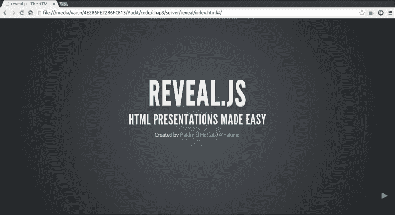
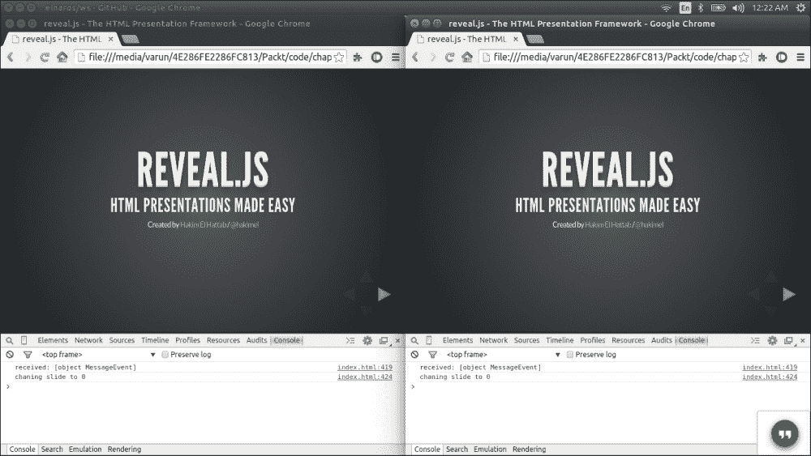

# 三、配置服务器并传输实时数据

数据是任何应用的核心。 而客户端和服务器之间的数据传输是其中非常重要的一部分。 我们在上一章已经看到了如何使用 WebSockets 传输数据。 现在，我们将了解如何利用它，并创建一个应用，在其中可以使用实时数据传输。 实时数据传输主要用于协作应用或任何需要在数据发生变化时进行反射的应用。

在本章中，我们将涵盖以下主题:

*   实时数据传输
*   实时应用
*   协作演示应用
*   增加合作
*   自己动手
*   提示和技巧

# 全双工实时数据传输

我们都知道，一旦发生一些变化，发送和接收数据是实时的数据传输。 它可以表示该数据中发生的一些变化。 数据更改的原因可能是用户本身或某些定时事件。 在正常情况下，用户的变化应相应反映到其他用户; 例如，人们互相发送信息的聊天应用。 一个聊天应用就是实时数据传输的一个很小的例子; 让我们以游戏为例。 游戏是需要实时数据传输的主要应用。 但随着行业的发展，我们的日常应用也在采用实时全双工数据通信。 如果我们看到任何股票市场应用，那么我们就可以看到实时数据的变化，这基本上是一个很好的服务器推的例子。 在这个场景中，服务器正在推送数据，这是 WebSockets 的一个很好的特性。

# 实时应用的基础

我们已经理解了实时数据传输; 现在让我们看看创建实时数据传输应用需要哪些步骤，在启动任何应用之前，需要考虑一些基础步骤。 一些主要的步骤是:

*   选择我们需要制作协作或实时数据传输应用的功能
*   选择服务器端技术使其成为可能
*   选择容易与服务器集成的客户端技术

这三个步骤是要记住的要点。 正如我们所知，HTML5 支持 WebSockets，是数据通信的最佳方式之一。 现在，对于服务器端，我们已经看到了如何轻松无缝地集成 Node.js 服务器。 现在最重要的部分是我们需要使哪些功能成为实时的。 这取决于我们正在构建的应用的类型。 接下来，记住这些要点，我们将开始构建我们的应用，以便更好地理解它。

# 协同演示应用

记住基础元素，让我们构建一个演示应用，如果您更改了演示，那么它也会为其他用户更改，反之亦然。 基本上，我们将建立一个基于 web 的协作演示共享应用。 为了使这个应用适用于现代浏览器，我们需要一个 JavaScript 库，它提供了表示应用所需的所有特性，比如创建不同的页面、导航等等。 然后我们将添加功能，使不同用户之间的协作。

## 演示库

我们可以从中选择不同的 JavaScript 库。 为创建应用提供足够功能的库是**reveal.js**。 它是一个制作精良的 API，完全基于 HTML5。 还有一个制作精良的应用用于制作在线演示，它也是基于我们将要使用的相同的 JavaScript 库。 相关网站为[www.slides.com](http://www.slides.com)。 去访问这个网站吧; 这会让你对我们的演讲有个大概的了解。 我们将使用这个 API 并使其协作，以便其他用户也可以改变幻灯片，每个人都可以看到反射。

## 设置图书馆

首先，我们需要下载并设置库文件。 我们将要使用的库可以在[https://github.com/hakimel/reveal.js](https://github.com/hakimel/reveal.js)找到。 下面是建立库的步骤:

1.  Download a copy for yourself and open the `index.html` file.

    

2.  Once you open the file, you can see the default presentation that comes with it.

    

3.  js 库是一个完整的演示解决方案，它有自己的导航和演示机制。
4.  在这里，您可以使用键盘控件导航到不同的页面。 使用右箭头键可转到下一张幻灯片，使用左箭头键可转到上一张幻灯片。 类似地，对不同的表示级别使用向上和向下箭头键。 它支持所有类型的文本，您可以在其中放入真实的代码或任何 HTML 内容。 你可以通过幻灯片了解更多关于库特性的信息。

## 添加协作

要将协作特性添加到演示库中，让我们首先看看需要遵循哪些步骤才能使这个应用工作。 从客户端和服务器端写下重要步骤是一个很好的实践，这只是为了确保我们涵盖了每一个步骤。

对于这个应用，让我们列出要为客户端做的事情:

*   连接到 WebSocket 服务器
*   从 WebSocket 接收消息
*   将从服务器接收到的幻灯片号应用到当前演示中
*   当用户更改幻灯片时，向服务器发送幻灯片详细信息

现在我们已经列出了客户端的要点，让我们也列出服务器端的要点:

*   初始化 WebSocket 服务器
*   从客户处接收幻灯片数据
*   存储当前滑动数据
*   为稍后加入的新用户传递当前的幻灯片数据
*   向所有用户广播幻灯片数据更改
*   检查幻灯片数据更改以减少重复调用

当我们下载了库后，我们需要添加自定义客户机和服务器端代码来使其工作。

## 代码实现

这个库已经为我们准备好了大部分代码，所以我们不需要为客户端添加太多代码。 我们需要完全编写服务器代码。 让我们来看看代码。

### 客户端代码

在客户端，主文件是`index.html`，所以我们要将代码添加到该文件中。 在文件中 JavaScript 代码的末尾，添加以下代码:

```html
function isJson(str)
{
    try 
    {
        JSON.parse(str);
    }
    catch (e)
    {
        return false;
    }
    return true;
}

var ws;

var isChangedByMe = true;
function init()
{
  ws = new WebSocket('ws://localhost:9001');
  //Connection open event handler
    ws.onopen = function(evt) 
    {
      ws.send('connection open');
    }
  //Event Handler to receive messages from server
  ws.onmessage = function(message)
  {
      console.log('received: '+ message);
      if(isJson(message.data))
      {
        var obj = JSON.parse(message.data);
        console.log("changing slide to "+ obj.indexh);
        isChangedByMe = false;
        Reveal.slide( obj.indexh, obj.indexv);
      }
  }
  //Adding event handler when slide is changed by use
  Reveal.addEventListener( 'slidechanged', function( event )
  {
      if(isChangedByMe)
      {
        ws.send(JSON.stringify({ 'indexh' :event.indexh , 'indexv' : event.indexv}));
        console.log("sending slide data : " + event.indexh);
      }
      isChangedByMe = true;
  });
}
//Event handler for application load event
window.addEventListener("load", init, false);
```

#### 代码说明

让我们看看我们在这段代码中写了什么。

我们已经在窗口中添加了加载事件监听器，以便一旦我们知道浏览器窗口被正确加载，我们就可以开始初始化我们的 WebSocket 连接:

```html
window.addEventListener("load", init, false);
```

一旦调用了`init`方法，我们就会编写与 WebSocket 服务器通信的实际代码。 这里，在这段代码中，我们实例化了 WebSocket 对象并编写了一个事件处理程序，当连接打开时将调用该事件处理程序。 一旦建立了连接，就会调用这个方法，我们就知道连接已经创建了。 现在我们发送一些随机数据，这可以作为对服务器的确认:

```html
  ws = new WebSocket('ws://localhost:9001');
  ws.onopen = function(evt) 
   {
      ws.send('connection open');
   }
```

现在，我们添加了消息事件处理程序，它在服务器发送消息时被调用——在我们的例子中，我们必须处理服务器将要发送给我们的数据:

```html
  ws.onmessage = function(message)
```

因此您可以看到，我们正在调用`isJson`方法并将消息数据发送给它。 这个方法被调用来检查我们接收到的数据是否符合我们想要的格式; 否则它会抛出一个错误:

```html
     if(isJson(message.data))
```

在检查数据类型是否正确之后，我们现在将数据解析为**JavaScript 对象表示法**(**JSON**)格式。 我们必须解析 JSON 方法的原因是，我们以 JSON 格式发送数据，它会被转换为字符串:

```html
     var obj = JSON.parse(message.data)
```

一旦数据被转换，obj 变量中就会有一个 JSON 对象。 下面是其中一个重要的方法，它基本上是一个 reveal.js 库方法，用于设置演示文稿的当前幻灯片:

```html
      Reveal.slide( obj.indexh, obj.indexv);
```

通过这种方式，我们接收数据并在演示中设置它。 接下来是代码的第二部分——将数据发送到服务器。

js 库为我们提供了一个事件，我们可以监听并获取关于当前幻灯片的信息:

```html
  Reveal.addEventListener( 'slidechanged', function( event )
```

将侦听器添加到`slidechanged`事件后，就可以使用在 event 属性下传递的数据。

下面是我们如何从 JSON 对象创建一个字符串并将其传递给服务器:

```html
  ws.send(JSON.stringify({ 'indexh' :event.indexh , 'indexv' : event.indexv}));
```

在 WebSockets 客户端中，我们使用`send`方法将数据发送到服务器。 发送后，服务器接收它并执行我们定义的操作。 现在让我们检查服务器是如何设置的以及它的行为。

### 服务器代码

我们已经在上一章中看到了如何创建 Node.js 服务器。 以类似的方式，我们将使用 NPM 创建另一个应用(请参考[第二章](2.html "Chapter 2. Getting Started with WebSockets")，*WebSockets 入门*，了解如何设置和运行服务器)。 下面是我们需要在`server.js`文件中写入的服务器代码:

```html
var WebSocketServer = require('ws').Server
   wss = new WebSocketServer({ port: 9001 });

//Broadcast method to send message to all the users
wss.broadcast = function broadcast(data,sentBy)
{
  for(var i in this.clients)
  {
    if(this.clients[i] != sentBy)
    {
      this.clients[i].send(data);
    }
  }
};

//Data holder for current side number
var currentSlideData = { 'indexh' :0 , 'indexv' : 0};
//JSON string parser
function isJson(str)
{
    try
    {
        JSON.parse(str);
    } 
    catch (e)
    {
        return false;
    }
    return true;
}

//WebSocket connection open handler
wss.on('connection', function connection(ws)
{
//WebSocket message receive handler
    ws.on('message', function incoming(message)
    {
    if(isJson(message))
    {
      var obj = JSON.parse(message);

        if(currentSlideData.indexv != obj.indexv || currentSlideData.indexh != obj.indexh )

        {
          currentSlideData.indexv = obj.indexv;
          currentSlideData.indexh = obj.indexh;
//Broadcasting the message to all the users
          wss.broadcast(message,this);
          console.log('broadcasting data');
        }
    }

      console.log('received: %s', message);

  });

  console.log('sending initial Data');
//When user is connected sending the current slide information for the users who joined later
  ws.send(JSON.stringify(currentSlideData));

});
```

这段代码非常标准且简单。 让我们分解一下，理解我们在这里放了什么以及为什么。

#### 代码说明

在这里，您可以看到的主要方法之一是`broadcast`。 我们编写这个方法来将幻灯片更改数据广播给所有使用 WebSockets 连接的用户。 我们只是简单地循环遍历所有的客户端，并使用`send()`方法发送数据:

```html
wss.broadcast = function broadcast(data,sentBy)
{
  for(var i in this.clients) 
  {
    if(this.clients[i] != sentBy)
    {
      this.clients[i].send(data);  
    }
  }
};
```

在这之后，我们定义一个变量，我们将在其中暂时保存幻灯片数据。 这个变量很重要，因为每当我们获得幻灯片数据时，我们都会存储它并在需要时传递它。 存在用户较晚加入会议的情况; 使用这个变量中存储的数据，我们可以为他们提供当前存储的幻灯片编号:

```html
var currentSlideData = {'indexh' :0 , 'indexv' : 0};
```

现在看看下面这段代码。 这里，我们处理连接事件，以便将当前幻灯片号数据传递给用户。 该事件为我们提供了新用户的指示。 在发送数据时，您会注意到我们使用了`JSON.stringify`方法。 这个方法用于从 JSON 中生成一个字符串，因为我们的对象是 JSON 格式的:

```html
wss.on('connection', function connection(ws) 
{
  console.log('sending initial Data');

  ws.send(JSON.stringify(currentSlideData));

});
```

在这段代码中，我们可以看到我们传递了一个参数:特定用户的 WebSocket 对象的实例。 要接收消息，我们需要添加一个`message`事件处理程序，您可以在下面的代码中看到。 而参数是实际的消息，从客户端传递:

```html
  ws.on('message', function incoming(message)
```

在得到消息后，我们检查传递的对象是否为 JSON。 为此我们定义了 JSON 方法，它检查 JSON 字符串并返回 true/false。 检查之后，我们解析 JSON 字符串，并检查该值是否与幻灯片索引数据的最后一个值相似。 如果没有，我们将其存储并将消息广播给所有客户机。 为了避免重复通话，有必要进行检查。 以下是代码:

```html
if(isJson(message))
  {
    var obj = JSON.parse(message);
      if(currentSlideData.indexv != obj.indexv || currentSlideData.indexh != obj.indexh )
      {
        currentSlideData.indexv = obj.indexv;
        currentSlideData.indexh = obj.indexh;
        wss.broadcast(message,this);
        console.log('broadcasting data');
      }
  }
```

这只是一个简单的服务器代码，它非常强大，可以很好地用于我们的小型应用。

一旦我们运行应用，下面是它的样子:



我们可以看到，两个都有相同的第一张幻灯片，在索引 0 上:


一旦我们切换到其他幻灯片，其他用户的幻灯片也会改变。 查看一下控制台**登录到左侧窗口。 我们可以看到，**发送幻灯片数据**，同时显示幻灯片编号，表示在幻灯片发生变化时，正在发送数据。 在右侧窗口中，我们可以看到控制台中登录了将幻灯片**更改为**的操作，这表明从服务器接收到了数据，因此我们可以看到用户的幻灯片正在更改。**

 **

类似地，如果我们从右边窗口更改幻灯片，它将反映在左边窗口上，从日志中可以清楚地看到左侧窗口。 同样的事情也会发生在所有用户身上。 以下是命令提示符中显示的日志截图:


在服务器端，我们可以看到接收到的数据，数据广播日志显示数据正传递给所有用户。 将日志放在服务器端总是有助于检查调试应用的步骤。

# 你自己做吧

此应用是一个非常简单且易于构建的应用。 您已经学习了如何创建一个具有有限功能的简单应用。 可以对这个应用进行许多添加，使它变得更强大。 让我们给您一些关于您可以开发的特性的提示。

## 输入用户名

当用户访问 URL 时，应用要求输入用户名。 输入的用户名显示在屏幕的左上角。 我认为这个场景很容易构建。 我将把它的实现留给您。 这很容易，直到我们想要显示用户列表为止，这基本上是我们的下一个场景。

## 用户列表

创建一个按钮，该按钮将显示当前在线的用户列表。 这个场景需要在客户端和服务器端都进行代码更改。 让我列出一些要点，你需要实现这个功能:

1.  当用户输入名称时，将其保存在服务器端。 这可以通过以特定格式发送用户名并在服务器端处理相同的名称来实现，以便将其存储在数组或对象中。
2.  维护服务器端所有用户的列表，以供参考。
3.  一旦我们加入服务器，就从服务器获取用户列表。 这可以通过发送像`getUsers`这样的特定消息并在`message`事件处理程序中添加另一个条目来实现，该事件处理程序返回用户列表。
4.  在 UI 端创建一个按钮，并在用户列表中滑动。

## 基于用户的授权更改演示

当用户进入会议时，询问他们是否希望作为主讲人或与会者加入会议。 如果用户选择作为演示者加入，则允许用户更改幻灯片。 如果用户选择作为与会者加入，则限制用户更改幻灯片。

询问用户什么时候输入名字很容易; 稍微复杂的部分是限制用户更改幻灯片。 如果深入研究 reveal.js 库的配置，这很容易。 在配置中，我们可以看到一些参数为真和假。 我们只需要根据用户类型:presenter/attendee 来修改它们。

## 让用户成为演讲者

我们有演讲者和出席者。 现在让我们制定一个规定，让演讲者允许与会者。 用户列表中的，如果发布者点击用户名，它就会使该用户成为发布者。

这可以通过在运行时更改 reveal.js 的配置以一种简单的方式实现。 我们前面根据角色更改的相同配置，我们只需要在用户的角色更改时调用相同的功能。

# 提示和技巧

让我们来谈谈一些可以在制作应用时使用的技巧和技巧。

*   Using JSON:

    JSON 格式在 JavaScript 中是一种易于阅读的格式。 以 JSON 格式传输数据总是好的。

*   Object-based structure for WebSockets:

    通常，在必须传输不同数据集的任何应用中，最好为消息确定适当的结构。 以一个聊天应用为例:如果我们确定一个结构，最好处理消息。 下面是一个结构示例:

    ```html
      {
        type: "message"
        data : {
          from: "varun"
          to : "user1"
          data : "hello"
               }
      }
    ```

*   Using ArrayBuffer:

    还有一种使用 ArrayBuffer 发送数据的方法; 您也可以发送一个**二进制大对象**(**BLOB**)。 下面是一个同样的例子:

    ```html
    var array = new Float32Array(5);
      for(var i = 0; i < array.length; ++i) {
        array[i] = i / 2;
      }
      ws.send(array, { binary: true, mask: true });
    ```

这些类型的结构可以帮助更好地理解，并可用于不同的消息集。 在这里，类型可以是消息、图像、音频、文件或任何其他内容。 并且属性数据是泛型，它可以包含所有这些不同类型的数据。

# 总结

在本章中，我们已经看到了如何利用基于 html5 的 JavaScript 库。 我们将 WebSockets 与 reveal.js 库结合起来，用于一个协作应用。 这是一个简单的示例，您已经看到，使用较少的编码，我们已经实现了一个良好的工作应用。 您已经了解了如何配置服务器、发送和接收数据以及如何将数据从服务器广播到所有客户机。

在下一章中，我们将看到使用另一个库和一些框架来使用现代技术开发一个完整的应用。**